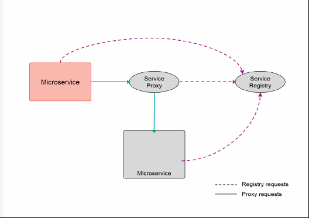
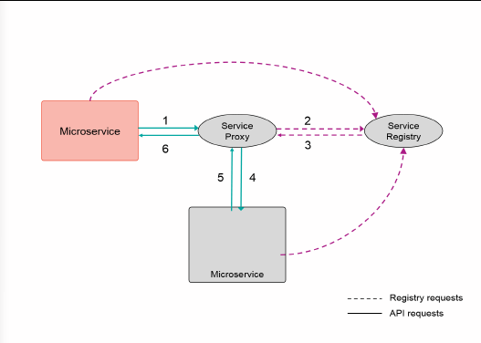
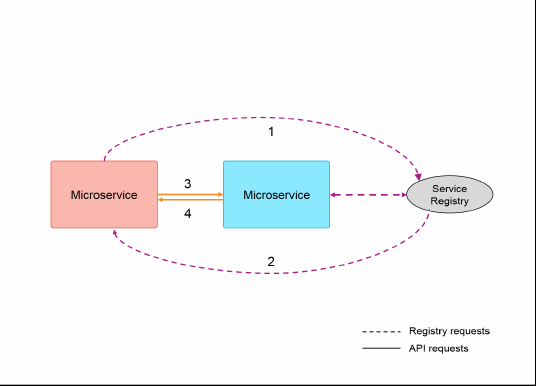

# 微服务通信
介绍可用于查找系统中的微服务并向其发出请求的选项以及在确定所需服务的位置后如何实现微服务架构中的不同服务之间的通信

**标签:** Java,云计算,反应式系统,微服务,消息传递

[原文链接](https://developer.ibm.com/zh/articles/j-cn-java-and-microservice-3/)

IBM Developer

发布: 2017-02-28

* * *

微服务的设计目的是方便扩展。这种扩展通过横向扩展各个服务来完成。面对众多微服务实例，您需要一种查找服务的方法，并在您调用的服务的不同实例之间进行负载平衡。本章将介绍可用于查找系统中的微服务并向其发出请求的选项，并将介绍在确定所需服务的位置后，如何实现微服务架构中的不同服务之间的通信。

## 服务注册表

服务注册表是一个持久存储区，包含随时可用的所有微服务的列表，以及访问它们的路径。微服务可能因为 4 种原因而需要与服务注册表进行通信：

1. 注册

    成功部署某项服务后，必须向服务注册表注册该微服务。

2. 检测信号

    微服务应定期向注册表发送检测信号，以表明它已准备好接收请求。

3. 服务发现

    要与另一个服务进行通信，微服务必须调用服务注册表来获得可用实例列表。（详见小节”服务调用”了解更多的细节）。

4. 注销

    当服务停止运行时，必须从服务注册表中的可用服务列表中删除它。


### 第三方注册与自注册

向服务注册表注册微服务的过程，可由微服务或第三方来完成。如果借助第三方，则要求第三方检查微服务，以确定当前状态，并将该信息转发给服务注册表。第三方还负责服务的注销。如果微服务本身负责执行注册和发送检测信号，那么在未收到检测信号时，服务注册表就可以注销该服务。

使用第三方的优势在于，注册和检测信号发送逻辑能够与业务逻辑保持分离。缺点在于，需要部署一个额外的软件，而且微服务必须向一个健康端点公开，以供第三方轮询。

使用自注册会将注册和检测信号发送逻辑整合到微服务自身中。使用此方法需要小心测试各种考虑因素，需要了解代码分离的更多信息。但是，许多服务注册表解决方案提供了一种便捷的库形式注册功能，降低了所需代码的复杂性。

通常会使用一个服务注册表，提供基于 Java 的库来处理注册和检测信号。这种配置使您的服务能更快地编码，并在系统中（即 Java 中）的所有微服务之间实现一致性。可以使用以下服务注册表解决方案：

- [Consul](https://www.consul.io/)
- [Eureka](https://github.com/Netflix/eureka)
- [Amalgam8](https://github.com/amalgam8/)

所有这些注册表都是开源的，支持针对 Java 的集成。作为 Netflix 产品栈的一部分，Eureka 与其他 Netflix 解决方案紧密集成来实现负载平衡和容错。使用 Eureka 作为服务注册表，您可以轻松地添加其他解决方案。Amalgam8 开源项目同时提供了服务注册和负载平衡功能。它还提供了可在测试期间使用的路由配置。

### 可用性与一致性

大部分服务注册表提供了分区容错性以及一致性或可用性。由于 CAP 定理，它们无法同时提供所有 3 种功能。例如，Eureka 提供了可用性，Consul 和 Apache Zookeeper都提供了一致性。一些文章认为，您应该始终选择一种或另一种功能（Knewton 博客上的这篇文章值得一读），但最终决定完全取决于您的应用程序的确切要求。如果您要求所有微服务每次都拥有相同的外观，那么您应该选择一致性。如果要求快速响应请求，而不是等待一致的答案，那么您应该选择可用性。一些解决方案可将这两种功能与 Java 集成。

## 服务调用

当一个服务需要与另一个服务通信时，它会使用服务注册表中存储的信息。然后在服务器端或客户端对实际的微服务执行调用。

### 服务器端

服务器端与微服务的通信是通过服务代理执行的。服务代理在服务注册表中提供或作为一个单独服务提供。当微服务需要执行调用时，它调用服务代理的已知端点。服务代理负责从服务注册表获取目标微服务的位置，并转发该请求。代理获取响应并将其路由回发出请求的原始微服务。在示例场景中，负载平衡完全在服务器端执行。图 1 给出了使用服务代理时的请求流。

#### 图 1.对其他微服务的调用是使用服务代理来实现的



使用服务器端调用具有以下重要优点：

- 请求简单

微服务发出的请求可以很简单，因为它调用的是一个已知端点。

- 更容易测试

使用服务器代理会从微服务消除任何负载平衡或路由逻辑。这种配置使您能够使用模拟代 理来测试服务的完整功能。

在云平台中，比如 Cloud Foundry 和 IBM Cloud，代理由平台提供。在 IBM Cloud 中，每个部署的应用程序都有一个已知的端点，称为 _路由_ 。当另一个服务或应用程序调用此路由时，IBM Cloud 会在后台执行负载平衡。

这种方法有以下主要缺点：

- 跳数更多

添加一次对服务代理的调用，就会增加每个请求的网络跳数。结果，每个请求的跳数通常比客户端解决方案还要多。值得注意的是，服务代理可能保存了有关其他微服务的缓存信息，所以在许多情况下，请求会经历 4 跳：1 →4 →5 →6。图 2 显示了所需的网络跳数。

#### 图 2.在使用服务代理时，完成一个请求服务需要网络跳跃



### 客户端

一个微服务对另一个微服务的请求可直接从客户端发出。首先，向服务注册表请求服务的一个或多个实例的位置。然后，在客户端发出对该微服务的请求。该微服务的位置通常已缓存，所以在未来，发出请求时无需返回到服务注册表。如果在未来，请求失败，客户端可重新调用服务注册表。一种最佳实践是对缓存的微服务位置设置一个超时值。这种配置意味着，如果部署了一个服务的新版本，那么其他微服务不必等到其缓存的实例发生错误才知道存在新实例。

与服务代理方法相比，此方法需要的网络跳数更少。图 3 显示了所需的网络跳数。同样地，这是在客户端没有服务的缓存信息时的跳数。在许多情况下，不需要向服务注册表发出请求，所以只需要两跳：3 →4。

#### 图 3.从客户端向服务注册表发出请求时的网络跳数



请求和所需的任何负载平衡可通过以下两种机制之一来处理：

- 客户端库
- Sidecar

两种机制都在客户端发出请求。但是，客户端可在微服务内运行，而 sidecar 虽然与微服务一起部署，但要在一个单独的进程上运行。图 4 显示了一个示例架构图。

#### 图 4.请求由客户端库或 sidecar 进程发出


### 客户端库

客户端库在许多方面很有用，一个方面是隔离与远程资源通信的细节。对于服务注册表，客户端库（比如 Consul 或 Netflix Eureka 所提供的库）处理服务注册和检测信号。其他库（比如 Netflix Ribbon）提供了客户端负载平衡功能。

您通常可以采用现有的库作为起点，而不是编写自己的库。如果您系统中的所有微服务都是使用 Java 编写的，则应标准化您的库。如果您有一个多语言的微服务系统，则需要为每种语言标准化一个库。通过在每个地方使用同一个库，开发人员可以灵活地在微服务之间移动，避免了让您的基础架构和构建流程变得过于复杂。

使用客户端库的缺点是，您现在将复杂的服务调用移回到了应用程序中。这种配置使测试您的服务变得更加复杂。确保使d用客户端库的代码与微服务中的业务逻辑保持了良好的分离。

### Sidecar

Sidecar 是服务代理与客户端库之间的一种不错的折衷方案。Sidecar 是一个与您的微服务一起部署的单独进程，它既可作为容器内的单独进程，也可作为一个单独但紧密相关的容器。

Sidecar 维护了向服务注册表的服务注册，通常还为对其他微服务的出站调用执行客户端负载平衡。

因为 Sidecar 是在自己的进程中运行的，所以它们不依赖于语言。您可以对一个多语言应用程序中的所有微服务使用同一种 Sidecar 实现，无论这些服务是使用什么语言编写的。

Netflix Prana 是一个开源 Sidecar，它向非 Java 应用程序提供了基于 Java 的 Ribbon 和 Eureka 客户端库的功能。有关的更多信息，请访问以下 [网站](http://github.com/Netflix/Prana) 。

Kubernetes 是一个容器编排引擎，提供了类似 Sidecar 的服务发现和负载平衡功能。有关的更多信息，请访问以下 [网站](http://kubernetes.io/docs/user-guide/services) 。

Amalgam8 解决方案可与容器结合使用，也可以单独使用。它管理服务注册，提供了客户端服务发现、路由和负载平衡功能。有关的更多信息，请访问以下 [网站](http://amalgam8.io) 。

选择一个能处理多个方面的解决方案，可以降低您的服务和基础架构的复杂性。

## API 网关

API 网关可用于为内部和外部客户端执行服务调用。API 网关也可对服务代理执行类似功能（参见小节”服务器端”）。服务向 API 网关发出请求，API 网关在注册表中查找目标服务，发出请求，然后返回响应。但是二者之间存在区别。对服务代理的请求使用了最终服务所提供的 API。对 API 网关的请求使用了网关提供的 API。这种配置意味着，API 网关可提供与微服务不同的 API。

内部微服务可使用这些相同的 API，而 API 网关对外部客户端最有利。通常，微服务提供了更细粒度的 API。相较而言，使用应用程序的外部客户端可能不需要细粒度的 API。它可能还需要一个 API 来使用来自多个微服务的信息。API 网关向外部客户端公开对它们有帮助的 API，将微服务的实际实现隐藏在网关背后。所有外部客户端都通过这个 API 网关访问应用程序。

## 微服务通信

在分布式系统中，服务间的通信至关重要。组成应用程序的微服务必须无缝协同工作，才能向客户提供有价值的东西。在上面我们讨论了如何找到特定的微服务，还介绍了跨不同实例执行负载平衡的选项。接下来，将介绍在确定所需服务的位置后，如何实现微服务架构中的不同服务之间的通信。本章还将介绍同步和异步通信，以及如何实现灾难恢复。

### 同步和异步

同步通信是一种需要响应的请求，无论是立即还是在一定时间量后获得响应。异步通信是一种不需要响应的消息。

在使用独立部件构建的高度分布式系统中使用异步事件或消息，具有令人信服的理由。在某些情况下，使用同步调用可能更适合，小节”同步消息 (REST)”将介绍这些情况。

对于每种调用风格，服务会使用 Swagger 等工具记录发布的所有 API。还会记录事件或消息有效负载，以确保系统容易被理解并为未来的使用者提供支持。事件订阅者和 API 使用者应该容忍无法识别的字段，因为它们可能是新字段。服务还应预料到和处理不良数据。假设某个时刻所有功能都将失效。

#### 同步消息 (REST)

前面已经提到，在分布式系统中，异步消息传递形式极为有用。如果适合明确的请求/响应语义，或者一个服务需要触发另一个服务中的特定行为，则应使用同步 API。

这些通常是传递 JSON 格式数据的 RESTful 操作，但也可以使用其他协议和数据格式。在基于 Java 的微服务中，让应用程序传递 JSON 数据是最佳选择。一些库可以将 JSON 解析为 Java 对象，而且 JSON 已得到广泛采用，这些使得 JSON 成为了让您的微服务容易使用的不错选择。

**JAX-RS 的异步支持功能**

尽管 JAX-RS 请求始终是同步的（您总是要求响应），但您可以利用异步编程模型。JAX-RS 2.0 中的异步支持使得线程在等待 HTTP 响应期间可执行其他请求。在无状态 EJB bean 中，注入一个 AsyncResponse 对象实例，并使用 @Suspended 注释与活动请求的处理相绑定。@Asynchronous 注释允许卸载活动线程上的工作。示例 1 给出了用于返回响应的代码。

#### 示例 1\. JAX-RS 2.0 包含异步支持

```
@Stateless
@Path("/")
public class AccountEJBResource {
@GET
@Asynchronous
@Produces(MediaType.APPLICATION_JSON)
public void getAccounts(@Suspended final AsyncResponse ar) {
Collection<Account> accounts = accountService.getAccounts();
Response response = Response.ok(accounts).build();
ar.resume(response);
}

```

Show moreShow more icon

要查看使用 JAX-RS 2.0 中的异步支持的更多示例，参见下面这个 [GitHub 项目](https://github.com/WASdev/sample.async.jaxrs) 。

另一个选项是使用反应式的库，比如 RxJava。RxJava 是 ReactiveX 的一种 Java 实现，是一个旨在对来自多个并行出站请求的响应进行聚合和过滤的库。它扩展了观察者模式，还紧密集成了旨在处理负载平衡和向端点添加恢复能力的库，比如 FailSafe和 Netflix Hystrix。

#### 异步消息（事件）

异步消息用于解耦协调。仅在事件的创建者不需要响应时，才能使用异步事件。

来自外部客户端的请求，通常必须经历多个微服务才能获得响应。如果每个调用都是同步执行，那么调用所需的总时间会阻碍其他请求。微服务系统越复杂，每个外部请求所需的微服务间的交互就越多，在系统中产生的延迟也就越大。如果在进程中发出的请求可替换为异步事件，那么您应实现该事件。

对事件采用一种反应式应对方式。服务仅发布与它自己的状态或活动相关的事件。其他服务然后可订阅这些事件并做出相应的反应。

事件是创作新交互模式而不引入依赖性的好方法。它们支持采用最初创建架构时未考虑到的方式来扩展架构。

微服务模式要求每个微服务都拥有自己的数据。这个要求意味着，当请求传入时，可能有多个服务需要更新它们的数据库。服务应使用其他关注方可以订阅的事件来通告数据更改。要进一步了解如何使用事件处理数据事务和实现一致性。

要协调应用程序的消息，可以使用任何一个可用的消息代理和匹配的客户端库。一些与 Java 集成的示例包括带 RabibitMQ Java 客户端的 AMQP 代理、Apache Kafka 和 MQTT（针对物联网领域而设计）。

#### 内部消息

事件可在一个微服务内使用。例如，为了处理订单请求，可以创建一组可由服务连接器类订阅的事件，这些事件可触发这些类来发布外部事件。使用内部事件可提高对同步请求的响应速度，因为不需要在返回响应之前等待其他同步请求的完成。

利用 Java EE 规范对事件的支持。内部异步事件可使用上下文和依赖注入 (CDI) 来完成。在此模型中，一个事件包含一个 Java 事件对象和一组修饰符类型。任何想对触发的事件做出反应的方法都需要使用 @Observes 注释。事件是使用 fire() 方法触发的。示例 2 给出了我们使用的方法和注释。

#### 示例 2\. 使用上下文和依赖注入的事件

```
public class PaymentEvent {
public String paymentType;
public long value;
public String dateTime;
public PaymentEvent() {}
}
public class PaymentEventHandler {
public void credit(@Observes @Credit PaymentEvent event) {
...
}
}
public class Payment {
@Inject
@Credit
Event<PaymentEvent> creditEvent;
Public String pay() {
PaymentEvent paymentPayload = new PaymentEvent();
// populate payload...
crediteEvent.fire(paymentPayload);
...
}
}

```

Show moreShow more icon

### 容错

迁移到微服务架构的一个强烈动机是获得具有更强的容错和恢复能力的应用程序。现代应用程序要求宕机时间接近于零，并在数秒内而不是数分钟内响应请求。微服务中的每项服务都必须能持续运行，即使其他服务已宕机。本节将重点介绍在与其他微服务通信时应使用的技术和工具，以便为您的微服务实现容错和恢复能力。

#### 适应更改

当一个微服务向另一个微服务发出同步请求时，它使用了一个特定的 API。该 API 拥有明确的输入属性和输出属性，输入属性必须包含在请求中，输出属性包含在响应中。在微服务环境中，这通常采用在服务间传递的 JSON 数据形式。假设这些输入和输出属性绝不会发生更改是不切实际的。甚至在设计最好的应用程序中，各种需求也在不断变化，导致需要添加、删除和更改属性。要适应这些形式的更改，微服务的制作者必须认真考虑他们制作的 API 和使用的 API。有关定义 API 的更多最佳实践，包括版本控制，请参阅 [第 2 部分”在 Java 中创建微服务”](https://www.ibm.com/developerworks/cn/java/j-cn-java-and-microservice-2/index.html) 。

- **使用 API**

作为 API 的使用者，必须对您收到的响应执行验证，确认它包含执行该功能所需的信息。如果收到了 JSON 数据，还需要在执行任何 Java 转换之前解析 JSON 数据。执行验证或 JSON 解析时，必须做两件事情：

1. 仅验证请求中需要的变量或属性。

    不要仅仅因为提供了变量，就对其执行验证。如果请求中未使用它们，则不需要验证它们的存在。

2. 接受未知属性

    如果您收到意料之外的变量，不要抛出异常。如果响应包含您需要的信息，一起提供的其他信息则无关紧要。


选择一个允许您配置传入数据的解析方式的 JSON 解析工具。Jackson Project 提供了注释来配置解析器，如示例 3 所示。Jackson 库提供的 @JsonInclude 和 @JsonIgnoreProperties 注释用于指示在序列化期间应使用哪些值，以及是否忽略未知属性。

_示例 3 . 用于 JSON 解析的 Jackson 注释_

```
@JsonInclude(Include.NON_EMPTY)
@JsonIgnoreProperties(ignoreUnknown = true)
Public class Account {
// Account ID
@JsonProperty("id")
protected String id;
}

```

Show moreShow more icon

通过遵循这些规则，您的微服务可适应任何对它没有直接影响的更改。即使微服务的制作者删除或添加了属性，如果您不使用这些属性，您的微服务就可以继续正常运行。

- **制作 API**

当向外部客户端提供 API 时，在接受请求和返回响应时应执行以下两种操作：

1. 接受请求中包含的未知属性

    如果一个服务使用了不必要的属性来调用您的 API，则丢弃这些值。在这种情况下，返回错误消息会导致不必要的故障。

2. 仅返回与被调用的 API 相关的属性

    为以后对服务的更改留出尽可能多的空间。避免因为过度分享而泄漏实现细节。


前面已经提到，这些规则组成了健壮性原则 (Robustness Principle)。通过遵循这两条规则，您能够在未来以最容易的方式更改 API，适应不断变化的客户需求。有关健壮性原则的更多信息，请访问 [网站](https://en.wikipedia.org/wiki/Robustness_principle) 。

#### 超时

使用超时可预防请求无限期地等待响应。但是，如果某个特定请求总是超时，您会浪费大量时间来等待超时。

断路器专为避免反复超时而设计。它的工作方式类似于电子领域中的断路器。特定请求每次失败或生成超时时，断路器都会进行记录。如果次数达到某个限制，断路器就会阻止进一步调用，并立即返回一个错误。它还包含一种重试调用机制，无论是在一定时间量后进行重试，还是为应对一个事件而重试。

在调用外部服务时，断路器至关重要。通常，会使用 Java 中的一个现有的库作为断路器。

#### 断路器

使用超时可预防请求无限期地等待响应。但是，如果某个特定请求总是超时，您会浪费大量时间来等待超时。

断路器专为避免反复超时而设计。它的工作方式类似于电子领域中的断路器。特定请求每次失败或生成超时时，断路器都会进行记录。如果次数达到某个限制，断路器就会阻止进一步调用，并立即返回一个错误。它还包含一种重试调用机制，无论是在一定时间量后进行重试，还是为应对一个事件而重试。

在调用外部服务时，断路器至关重要。通常，会使用 Java 中的一个现有的库作为断路器。

#### 隔板

在船运领域，隔板是一种隔离物，可以防止某个隔间中的渗漏导致整条船沉没。微服务中的隔板是一个类似的概念。您需要确保应用程序的某个部分中的故障不会导致整个应用程序崩溃。隔板模式关乎微服务的创建方式，而不是任何特定工具或库的使用。创建微服务时，应该总是询问自己如何才能够隔离不同部分，防止出现连锁故障。

隔板模式的最简单实现是提供应变计划 (fallback)。添加应变计划后，应用程序就能在非关键服务中断时继续正常运行。例如，在一家在线零售店中，可能有一个项用户提供推荐的服务。如果推荐服务中断，用户仍应能搜索商品和下单。一个有趣的示例是连锁应变计划，相对于抛出错误，针对个性化内容的失败请求会优先回退到针对更通用内容的请求，进而回退到返回缓存（且可能过时）的内容。

防止缓慢或受限制的远程资源导致整个应用程序崩溃的另一种策略是，限制可供这些出站请求使用的资源。实现此目标的最常见方式是使用队列和旗语 (Semaphore)。有关旗语的信息，请访问 [网站](https://docs.oracle.com/javase/7/docs/api/java/util/concurrent/Semaphore.html) 。

队列的深度表示待处理工作的最大量。任何在队列装满后发出的请求都会快速失败。队列还被分配了有限数量的工作者，该数量定义了可被远程资源阻塞的服务器线程的最大数量。

旗语机制采用了一组许可。发出远程请求需要许可。请求成功完成后，就会释放该许可。

二者之间的重要区别在于分配的资源被用尽时出现的结果。对于 Semaphore 方法，如果无法获得许可，则会完全跳过出站请求，但队列方法会提供一些填充信息（至少在队列装满之前）。

这些方法也可用于处理设置了速率限制的远程资源，速率限制是另一种要处理的意外故障形式。

## 结束语

本文重点介绍了在众多微服务实例中查找服务的方法，以及不同微服务之间的通信。下一部分将介绍如何使用基于 Java 的微服务实现微服务在数据处理方面保持可管理。好了，学习愉快，下次再见！