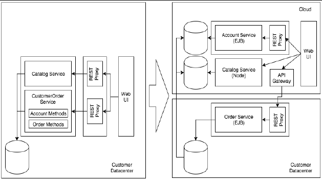
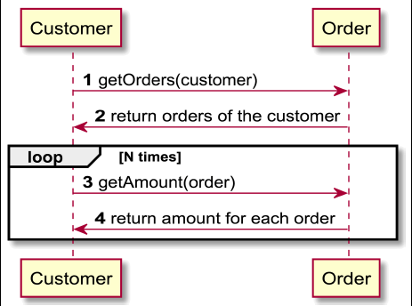
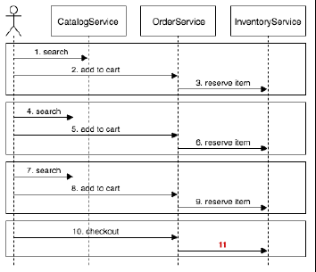

# 性能
性能成本

**标签:** Java,云计算

[原文链接](https://developer.ibm.com/zh/articles/j-cn-java-and-microservice-8/)

IBM Developer

更新: 2017-03-21 \| 发布: 2017-05-10

* * *

本章将探讨与转换为微服务有关的一个主要问题：性能成本。在同一个计算单元上共存的组件，现在分散在多个位置，而且不再彼此信任。

## 常见问题

分解整体式应用程序的一个重要性能问题是，了解在各个服务之间增加一个额外的网络层后，这些服务的可能行为。

因为本教程中的示例是演化一个示例 Java 应用程序，所以让时光倒流回 2000 年或许是一个不错的主意，那时您只有带远程接口的 EJB。该场景导致您会遇到在实现微服务时遇到的相同情形：交互过度频繁，您必须尽可能高效地执行这些通信。

图 1 显示了一个整体式应用程序分解给新应用程序带来性能损失的示例。

##### 图 1\. 应用程序架构更改



该图显示了以下信息：

- 在左侧，所有服务组件都在同一个 JVM 上执行。因此，当 CustomerOrder 服务需要一位客户的信息时，会直接在代码中调用该领域的一个方法，而不会采取额外的预防措施。右侧的情况有所不同。如果需要另一个领域的信息，需要网络传输才能满足该需求。
- 在左侧，向购物车添加了一个 SKU，调用了 Catalog 服务来获得商品的价格和可用性。这只需调用位于同一个 JVM 中的不同类上的一个方法。
- 尽管不是一体适用的最佳实践，但 N+1 反模式在左侧带来的问题没有右侧那么大，因为对于每个查询，也必须执行一次（或者甚至多次）网络传输。

## 要避免的反模式

请避免本节中介绍的模式，以减轻在微服务架构系统中导致性能问题的风险。

### N+1 服务调用模式

当一个客户端服务调用另一个服务器服务来履行其职责时，一个常见的陷阱可能导致严重的性能问题：客户端调用创建的往返传输次数比它本身与服务器之间的往返传输次数要多。N+1 服务调用模式就是一个例子。例如，假设您有一个名为 Customer 的服务，以及另一个名为 Order 的服务。Customer 服务收到一个请求，要求获取属于特定客户的所有订单的费用。为了满足该请求，Customer 服务对 Order 服务发出多次调用，如下所示：

1. 第一次调用是为了获取特定客户的所有订单。
2. 收到订单（N 个订单）后，Customer 服务循环处理所有订单，对于列表中的每个订单，它另外调用 Order 服务来获得这个订单的费用。在循环结束时，它对 Order 服务执行了 N 次调用。
3. Customer 服务为完成其原始请求，最终对 Order 服务执行了 N+1 次调用。

图 2 描述了在 Customer 和 Order 服务之间执行的调用的序列图。这种做法使两个服务之间的通信过度频繁，最终给系统带来性能问题。

在第二种调用中，Customer 服务可同时获得所有客户的付费，随后在自己的一端执行查找。

##### 图 2\. N+1 服务调用反模式的示例



### 过多的服务调用

微服务架构中的一种常见做法是，一个服务需要调用其他外围服务来履行其职责。但是，太多与此类似的出站调用可能产生性能问题。至于多少次调用才算太多，取决于您在系统中设计服务的方式；如果在端到端情形下，要求一个服务与数十个其他服务交互才能完成某个特定请求，那么就可以重新考虑该服务的有界上下文。

在微服务中，一种常见做法是在组织内创建微小空间或孤岛，让多个团队处理不同的服务，而且他们之间很少通信或者不通信。

当了解 N+1 情形后，您可能会想，”我们这里不会出现这种情况，因为我们知道如何创建服务”。在某种程度上讲，您可能是正确的。在从 Java 应用程序迁移时，请考虑图 3 中给出的场景。

##### 图 3\. 用户在网站上购物



这个简化的序列图显示了一个用户在您的网站上导航和购物。该用户搜索产品并将其加入购物车中，然后希望立刻结算。确认支付后（如图 3 中突出显示的第 11 步），您必须从库存中扣除这些产品。

在整体式 Java 应用程序中，尽管不是最佳实践，但有一个方法签名 “deductFromInventory(sku, quantity)” 可能没什么坏处，因为所有代码都在同一个 JVM 中执行。

当每次调用必须执行一次网络传输时，服务的响应实践可能受到巨大影响。因此，您必须创建接口（方法）来减少对等体之间过度频繁的通信。示例 1 给出了这样一个接口。

##### 示例 1\. 单个批处理执行

```
public class DeductionItem {
      SKU id;
      Int quantity;
      }
      deductFromInventory(DeductionItem[]);

```

Show moreShow more icon

在示例 1 中，无需多次调用该方法来从库存删除商品（对每个库存单位 (SKU) 调用一次），而是调用了一个批处理执行，同时向其发送了必须扣除的所有商品。

从”InventoryService”团队的角度讲，仅提供原始方法即可满足服务使用者（调用方）的需求，但这时需要”了解整体情况”：如果您没有理解调用方的需求，可能会提供低效的接口来处理服务使用者的情况。

### 通信频繁的服务

在图 3 中，创建了一个新对象来向 InventoryService 发送数据，制定该决策是因为相同的网络调用原则或限制：保持交互尽可能简单高效。

在整体式应用程序中，一种常见方法是使用下面的签名创建该方法：

`deductFromInventory(shoppingCart);`

同样地，尽管该方法不会用在整体式应用程序中，但在微服务中，它可能导致通过网络在对等体之间发送太多不必要的信息。必须避免该场景，以提高通信性能。

另一种常见情形是使用一个 getUserProfile(userId) 方法，它将用户的昵称和其他不必要的信息返回给调用您的服务的使用者。必须在微服务中避免这种情形。更好的方法是对该方法执行特殊化，以便仅返回这次调用必需的信息。

这并不意味着您必须将微服务发展为大型服务。您必须在实现中达到平衡，以提高效率。例如，您可以提供表 1 中列出的端点。

##### 表 1\. 返回数据的端点和类型

端点所返回信息的端点类型/user/{userId}与特定用户相关的所有信息/user/{userId}/address仅包含用户的已知地址/user/{userid}/address/home仅包含用户的家庭地址

使用端点可能会将微服务转换为大型组件，所以请谨慎采用此建议：仅在调用方需要时实现这些替代性端点。

**缓存不足**

如果不断向系统中添加服务，而且仅通过 API 公开数据供其他服务使用，这样做通常是不够的。例如：通过冗余数据库访问来处理来自其他服务的调用，而不是在多次服务调用中缓存数据，以避免额外的数据库访问以及数据库的往返数据传输。数据访问通常具有代价高昂的性能影响。

另外，您必须小心使用缓存。在服务之间谨慎使用缓存。一般而言，必须一次仅由一个服务写入数据。控制缓存逻辑和缓存不一致性是一项艰巨的任务。一种替代方法是使用可与您的应用程序同步的服务存储，按照租用模式根据需要提供数据。

## 提高性能的领先实践

本节将提出一些在从整体式架构转型的旅程中提高最终的微服务系统性能的建议。在服务之间引入的网络隔离所导致的重大影响，可以潜在地减少。

### 让服务拥有自己的操作数据

数据访问性能通常是在拥有高性能系统之前最难攻克的一个难题。微服务架构使用了一种分布式模型，其中每项服务通常只负责一个小的、焦点领域问题。每个服务根据需要调用其他服务来履行其业务职责。一般而言，要提高系统性能，必须确保系统中的每个服务始终处于最佳性能状态。

提高特定服务的性能的一种做法是，将数据和逻辑放在某个平衡的有凝聚力的环境中；也就是说，避免逻辑和数据组件分离。

### 避免过度频繁通信的安全措施

通常，执行安全措施会产生性能影响。如果恰当地将安全措施应用到架构中，一些模式和最佳实践可帮助协调安全性和性能。一个示例是最小化系统中的服务之间的交互和往返数据传输，或者最小化一个服务与外部服务之间的交互和往返数据传输。

有关微服务架构的安全方面的更多细节，以及满足您的需求的更多选项，请参见 [第 7 部分”安全和治理”](https://www.ibm.com/developerworks/cn/java/j-cn-java-and-microservice-7/index.html) 。

### 利用消息和 REST

消息功能是应用程序开发的一个关键组成部分，它使开发人员能将应用程序分解为组件，并将它们松散耦合在一起。

消息功能支持在组件之间建立异步耦合，使用消息队列或主题来发送消息。

消息发布/订阅模式减少了应用程序之间的不必要链接和网络流量。无需使用频繁的 REST 轮询调用，应用程序可在将消息发布到所有关注方（订阅方）之前保持空闲。发布之后，订阅的应用程序就会收到消息。基本上讲，无需使用 REST 询问”我们到了没”，订阅者可获得一个”拍肩提醒”来表明它们想要的消息已收到。

REST 和消息功能并不是鱼和熊掌。这两种方法可以互补。在某些情况下，最佳方法是将执行 REST 调用的应用程序与使用消息传输的应用程序相结合，以便在微服务上下文中结合使用两种技术。

在服务依赖于它们所没有的或未管理的数据的最新程度时，REST 可能带来问题。需要轮询才能拥有最新信息，这很快会让系统不堪重负，尤其在有许多互联的服务时。对于实时数据，首选的方法通常是在数据更改时发送它，而不是通过轮询来询问它是否已更改。轮询间隔甚至可能意味着您会遗漏更改。在这些类型的情况中，使用消息协议（比如 MQTT 或 AMQP）获得实时事件更新可能比 REST 更高效。

当应用程序使用与 RESTful 服务关联的请求/响应模式时，破坏的链接会导致无法协作。类似地，如果您的消息代理发生故障，会发生什么？消息不会被传送。要避免消息传送中断，可实现一种高可用性 (HA) 配置。您还可以扩展您的应用程序，以便拥有多个实例来处理消息，以防某个实例变得不可用。

在许多情况下，微服务需要知道何时发生了更改，而不需要轮询。REST 和消息协议可协同运行。使用消息协议增强 REST，可实现强大的组合，因为每种方法都可能在某个时刻发生故障。协同运行有助于让系统更加动态，实现更松散的耦合和更可持续的未来增长。

在将数据流发送给订阅者时，存储数据的责任就交给了数据接收者。通过将数据存储在事件订阅者中，订阅者可以自给自足和实现恢复。即使事件发布者的链接临时被切断，它们也能运行。

但是，在链接断开期间，它们使用的可能是逐渐过时的数据。在服务被同时连接到一个消息代理的设计中，API 服务会发送消息来告知数据更改，而订阅该信息的客户可在收到消息时做出反应。

当使用消息协议来增强 REST 而不是取代 REST 时，客户端服务不需要存储数据。它们仍需要跟踪通过 REST 调用获得的基准数据，而且能将此消息与此基准相关联。

使用主题发布者和订阅者的消息协议允许使用主题结构正斜杠 (/) 分隔符来同步 REST URL 与主题，实现 REST 与消息协议的镜像。在微服务需要知道它们关注的状态是否发生更改时，可以应用此技术。为此，无需不断轮询，使用端点 URL 作为消息主题使另一个微服务可以订阅主题，并在状态更改时收到信息。

如果您使用了一个 REST API，并向 REST 端点添加了一条导致状态更改的消息（POST、PUT、PATCH 或 DELETE），可发出一个 HTTP GET 请求来获取资源。如果另一个服务发出一项更新，并发布一条消息向订阅者告知该信息已更改，使用 REST API 端点的下游微服务也可以订阅与该端点的语法匹配的主题。借助此技术，可以减少频繁的 REST 轮询，让应用程序仍然保持最新。

通过在系统中的服务之间的通信中使用消息传递功能，可以提高数据传输吞吐量，并获得更高的性能。

### 快速且优雅地失败

在微服务架构中，因为服务应协同处理请求，所以任何地方都可能出现故障。一个服务可能发生故障，一个网络可能在某个时刻不再可靠，导致服务之间的调用失败，等等。出于这些原因，在设计微服务架构时，需要保持一种”容错式设计”思路。设计必须考虑到各种故障情形，以便在特定服务发生故障时，它们能快速失败，而不是缓慢地响应，并导致资源占用和瓶颈问题。快速失败有助于优雅地响应，以及更好地理解和解决问题。

可使用以下设计模式（未一一列举）来优雅地处理故障：

- 断路器

断路器模式常用于确保在发生故障时，故障服务不会对整个系统产生不利影响。如果对故障服务的调用量很高，而且对于每次调用，都必须等待超时后才能继续操作，则很可能出现这种情况。调用故障服务并等待，这会使用大量资源，最终导致整个系统变得不稳定。断路器模式的行为类似于家用电气系统中的断路器。它通过”跳闸”（关闭）来保护您。对微服务的调用包装在一个断路器对象中。当服务出现故障时，断路器对象允许继续调用该服务，直到失败尝试次数达到特定阈值。此时，该服务的断路器会跳闸，任何后续调用都被短路，不会再调用故障服务。此设置可节省宝贵的资源，保持系统的整体稳定性。

- 隔板

船上的船体由多个不透水的隔板组成。这么做的原因是，如果一个隔板损坏，故障被限制在该隔板内，因而不会导致整艘船沉没。这种将故障隔离到系统的很小部分中的分割方法也可用在软件中。服务边界（也即微服务本身）被用作隔板来隔离任何故障。将功能（就像 SOA 架构中所做的一样）拆分为不同的微服务，可以将故障的影响隔离在一个微服务中。隔板模式也可应用于微服务内。举例而言，考虑使用一个线程池来访问两个现有系统。如果一个现有系统开始变慢并导致线程池被耗尽，那么对另一个现有系统的访问也会受到影响。拥有分开的线程池可以确保一个现有系统变慢仅会耗尽它自己的线程池，而不会影响对另一个现有系统的访问。

## 结束语

本文主要介绍了在转化微服务时关于性能的关键因素。主要通过介绍一些常见问题以及需要避免的反模式。并且，在文章中也提出一些在从整体式架构转型的旅程中提高最终的微服务系统性能的建议。下一章（也是最后一部分）我们将介绍将应用程序演化为微服务集时，如何实施 DevOps 实践。好了，学习愉快，下次见！