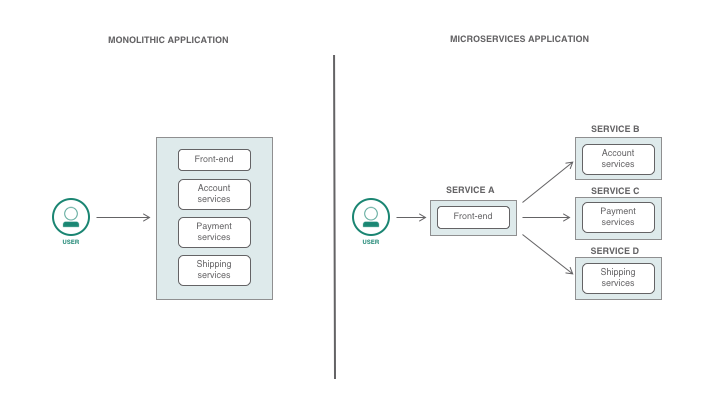
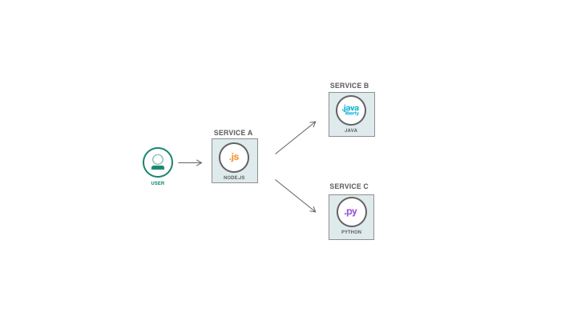
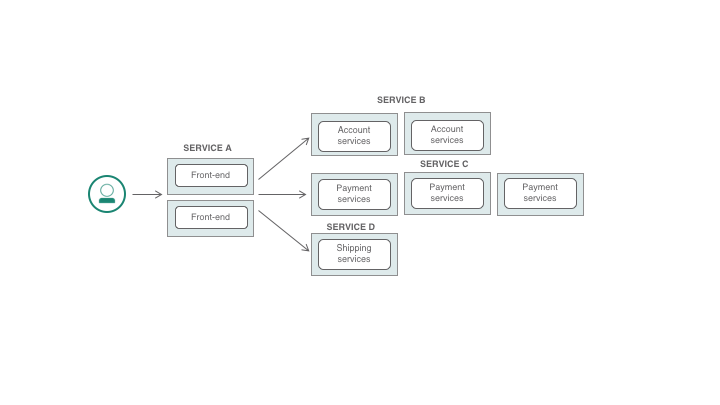
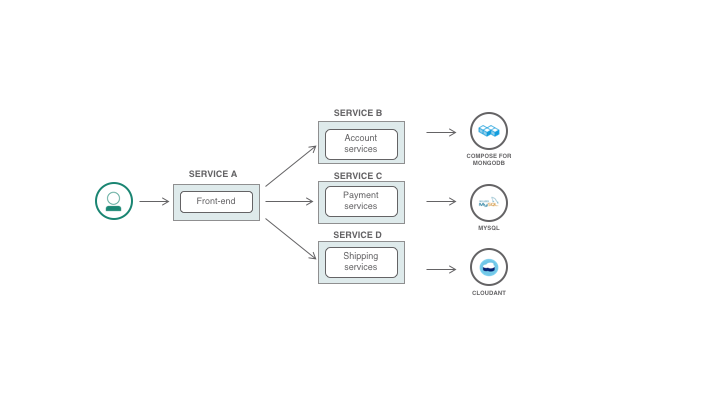
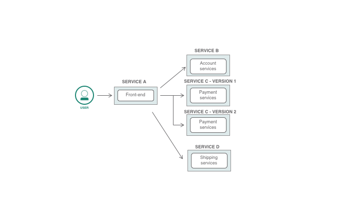

# 您为什么应该使用微服务和容器？
使用微服务和容器开展工作时会得到什么结果

**标签:** DevOps,Istio,Kubernetes,云计算,容器,持续交付,持续集成

[原文链接](https://developer.ibm.com/zh/articles/why-should-we-use-microservices-and-containers/)

[Anthony Amanse](https://developer.ibm.com/zh/profiles/anthony.amanse)

发布: 2018-11-01

* * *

## 什么是微服务和容器？

首先，什么是微服务？微服务是将应用程序拆分为多个服务的一种架构类型，这些服务具备构成整个应用程序的细粒度功能。每个微服务将具备针对您的应用程序的不同逻辑功能。与应用程序的所有组件和功能都在单个实例中的单体架构相比，微服务是应用程序架构领域一种更为现代的方法。您可以参考下图中单体架构与微服务架构的比较情况。

我们要将微服务放置在哪里？在容器中。容器是存放软件的包，里面包含运行软件所需的一切内容，比如代码、依赖关系、库、二进制文件等等。 [Docker](https://www.docker.com/) 是一种构建和运行容器的流行工具，但是 [Kubernetes](kubernetes.io) 正快速成为行业标准，用于编排企业环境中的多个容器。与虚拟机相比，容器可以共享操作系统内核，而不是像在一个主机上构建多个虚拟机那样拥有完整的副本。虽然可以将微服务放置在多个虚拟机中，但在这种情况下通常会使用容器，因为容器占用的空间更少，启动速度也更快。

## 为什么使用微服务架构？

微服务架构是为解决人们在单体应用程序中遇到的问题而创造的。微服务已被广泛使用，一些大型网站已将他们的单体应用程序转变为微服务。使用微服务架构的一些好处是：

- **与单体应用程序中的大型代码库相比，开发人员只需处理小型代码库。**
    当应用程序组件松散耦合时，开发人员可以轻松理解源代码，而不会减慢开发速度。如果使用的代码行数更少，您的 IDE 的速度显然会更快。开发人员无需处理各种功能的复杂性和依赖关系，这种情况只会在单体应用程序中出现。
- **开发人员的职责将会更加明确。**
    可以按照应用程序的组件或微服务来分配团队工作。代码复查速度将会加快。与单体应用程序相比，更新速度将会加快，而且无需构建和部署一切内容。
- **应用程序的技术堆栈可以通过微服务有所不同。**
    应用程序不再需要依赖一种语言或库。只要开发人员认为合适，微服务就可以利用多种不同编程语言。可以使用如下图所示的多语言微服务。
    
- **持续交付将变得更加容易。**
    对于简单变更，使用微服务就无需像单体应用程序那样再次重新部署一切。您可以选择仅重新构建和部署需要更新的微服务。频繁更新的速度将会加快。
- **可扩展性与每个微服务无关。**
    您可以选择根据应用程序所需的资源扩展它的每个组件。无需像单体应用程序那样为一切内容构建多个实例。扩展微服务将会有效利用可用资源，而不是像在单体应用程序中那样拥有整个应用程序的多个副本。
    
- **数据可以分散化处理。**
    您可以选择为微服务使用不同的数据库/存储器。如果比起关系数据库，您的微服务更适合使用非关系型数据库，那么就可以选择这种数据库。微服务也可能只需要简单的密钥存储数据库，比如 Redis。如下图所示，您可以选择组合使用 Cloudant、 MySQL 和 MongoDB。您可以利用不同的数据库来存储不同的数据类型。
    
- **隔离故障**
    一个微服务中的错误或缺陷不会使整个系统宕机。如果采用松散耦合的组件，您的应用程序中的微服务出现错误时，其他微服务不太可能受到影响，因为它们都在自己的容器中，不会完全依赖彼此。而对于单体应用程序，如果没有正确找出缺陷或错误，就会使整个应用程序流程宕机。

## 存在哪些弊端？

在使用微服务解决单体架构的一些问题时，每种微服务都存在一系列问题。如果您试图将单体应用程序拆分为微服务，那么第一个挑战就是如何拆分。您可以选择将它们拆分为多个业务功能，比如一个微服务处理批次，另一个微服务处理支付服务。最后，您的组件应该只具有一小部分的功能或责任。

我在微服务架构中看到的一些问题如下：

- 一旦微服务数量增长， **就会难以进行跟踪**。持续集成和持续交付的初始设置工作也并非易事，因为您需要处理拥有多个微服务所带来的额外复杂性。
- **复杂性**。微服务需要加强协作，尤其是在有多个团队参与的时候。如果需要与其他微服务交互，那么微服务还会引进更多的网络调用，而在单体应用程序中则不会出现这种情况。部署微服务并不像部署应用程序的一个实例那样简单。您还需要考虑其他很多问题：如何处理各个微服务之间的通信，解决错误以避免中断其他微服务，以及在每个组件中添加更多测试用例。
- 找到并跟踪应用程序中的缺陷/错误。如果您的微服务只有一条路径，那么查找起来会比较容易，但如果一个微服务与其他多个微服务进行通信，仅查找错误就会耗费大量时间。

- **进行微服务路由需要完成更多工作。** 您需要花时间来配置和控制微服务的流动。您还需要持续跟踪微服务的版本，并解决其路由问题。
    
- **微服务会消耗比单体应用程序更多的资源。** 虽然我提到的优点之一就是可以更出色、更有效地利用可扩展性和资源，但是所有组件都需要有自己的实例和容器，这可能就会导致内存和 CPU 使用量增多。

## 可帮助您使用微服务的工具

**免费试用 IBM Cloud**

利用 [IBM Cloud Lite](https://cocl.us/IBM_CLOUD_GCG)
快速轻松地构建您的下一个应用程序。您的免费帐户从不过期，而且您会获得 256 MB 的 Cloud Foundry 运行时内存和包含
Kubernetes 集群的 2 GB 存储空间。 [了解所有细节](https://www.ibm.com/cloud/blog/announcements/introducing-ibm-cloud-lite-account-2) 并确定如何开始。

### Kubernetes

Kubernetes 是一个容器编排平台，支持部署、扩展和管理所有容器。它可以自动部署容器化的微服务。这就更便于管理应用程序的所有组件和微服务。您可能会希望了解 Docker 如何实现微服务容器化。IBM 公开发布了产品 [IBM Cloud Kubernetes Service](https://www.ibm.com/cloud/container-service)，可以为您管理集群。

### Istio

Istio 能够解决微服务中的一些弊端。Istio 是一种服务网格，可进一步帮助您管理微服务。Istio 可以安装在 Kubernetes 之上，帮助您跟踪和监控微服务。同时，还可以帮助您快速跟踪应用程序中可能存在的错误和缺陷。Istio 还可以管理微服务的流量，比如管理和控制流动。可以轻松配置路由。Istio 也可以在微服务中提供安全保障，比如采用相互 TLS，或限制它访问外部服务。您也可以将 [Istio](https://cloud.ibm.com/docs/containers?topic=containers-istio#istio_tutorial) 安装到 IBM Cloud Kubernetes Service 上。

## 结束语

根据我的个人经验，使用容器编排平台是通过微服务构建应用程序的必要条件。Kubernetes 是广受开发人员欢迎的一种平台，因为它可以快速将应用程序从开发阶段带入生产环境。更棒的是，它是开源的！

对于开始构建自己的应用程序的开发人员来说，他们应该确定使用 [微服务](https://www.ibm.com/cloud/garage/architectures/microservices) 是否比使用单体应用程序对他们更有利。他们应该考虑应用程序的长期易用性和可扩展性。从单体架构着手完全没有问题，但是一旦应用程序规模扩大，将它们拆分为微服务的难度只会更大。在这种情况下，在初期开发阶段就从微服务开始显然会更加有利。对于现有的单体应用程序，开发人员应该考虑以何种方式分离应用程序中的哪些组件。

尽管存在一些弊端，但微服务在开发人员和企业中仍然很受欢迎，因为微服务对于应用程序和满足用户需求都极为有利。一旦使用了合适级别的微服务，借助它的灵活性，开发人员和企业就可以快速开发或更新应用程序。

本文翻译自: [Why should you use microservices and containers?](https://developer.ibm.com/articles/why-should-we-use-microservices-and-containers/#kubernetes)（2018-11-01）