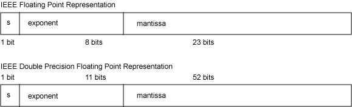

# 您的小数点到哪里去了？
使用浮点数和小数中的技巧和陷阱

**标签:** Java

[原文链接](https://developer.ibm.com/zh/articles/j-jtp0114/)

Brian Goetz

发布: 2003-04-20

* * *

虽然几乎每种处理器和编程语言都支持浮点运算，但大多数程序员很少注意它。这容易理解 ― 我们中大多数很少需要使用非整数类型。除了科学计算和偶尔的计时测试或基准测试程序，其它情况下几乎都用不着它。同样，大多数开发人员也容易忽略 `java.math.BigDecimal` 所提供的任意精度的小数 ― 大多数应用程序不使用它们。然而，在以整数为主的程序中有时确实会出人意料地需要表示非整型数据。例如，JDBC 使用 `BigDecimal` 作为 SQL `DECIMAL` 列的首选互换格式。

## IEEE 浮点

Java 语言支持两种基本的浮点类型： `float` 和 `double` ，以及与它们对应的包装类 `Float` 和 `Double` 。它们都依据 IEEE 754 标准，该标准为 32 位浮点和 64 位双精度浮点二进制小数定义了二进制标准。

IEEE 754 用科学记数法以底数为 2 的小数来表示浮点数。IEEE 浮点数用 1 位表示数字的符号，用 8 位来表示指数，用 23 位来表示尾数，即小数部分。作为有符号整数的指数可以有正负之分。小数部分用二进制（底数 2）小数来表示，这意味着最高位对应着值 ?(2-1)，第二位对应着 ?(2-2)，依此类推。对于双精度浮点数，用 11 位表示指数，52 位表示尾数。IEEE 浮点值的格式如图 1 所示。

##### 图 1\. IEEE 754 浮点数的格式



因为用科学记数法可以有多种方式来表示给定数字，所以要规范化浮点数，以便用底数为 2 并且小数点左边为 1 的小数来表示，按照需要调节指数就可以得到所需的数字。所以，例如，数 1.25 可以表示为尾数为 1.01，指数为 0： `(-1)<sup>0</sup>*1.01<sub>2</sub>*2<sup>0</sup>`

数 10.0 可以表示为尾数为 1.01，指数为 3： `(-1)<sup>0</sup>*1.01<sub>2</sub>*2<sup>3</sup>`

### 特殊数字

除了编码所允许的值的标准范围（对于 `float` ，从 1.4e-45 到 3.4028235e+38），还有一些表示无穷大、负无穷大、 `-0` 和 NaN（它代表”不是一个数字”）的特殊值。这些值的存在是为了在出现错误条件（譬如算术溢出，给负数开平方根，除以 `0` 等）下，可以用浮点值集合中的数字来表示所产生的结果。

这些特殊的数字有一些不寻常的特征。例如， `0` 和 `-0` 是不同值，但在比较它们是否相等时，被认为是相等的。用一个非零数去除以无穷大的数，结果等于 `0` 。特殊数字 NaN 是无序的；使用 `==` 、 `<` 和 `>` 运算符将 NaN 与其它浮点值比较时，结果为 `false` 。如果 `f` 为 NaN，则即使 `(f == f)` 也会得到 `false` 。如果想将浮点值与 NaN 进行比较，则使用 `Float.isNaN()` 方法。表 1 显示了无穷大和 NaN 的一些属性。

##### 表 1\. 特殊浮点值的属性

表达式结果`Math.sqrt(-1.0)``-> NaN``0.0 / 0.0``-> NaN``1.0 / 0.0``-> 无穷大``-1.0 / 0.0``-> 负无穷大``NaN + 1.0``-> NaN``无穷大 + 1.0``-> 无穷大``无穷大 + 无穷大``-> 无穷大``NaN > 1.0``-> false``NaN == 1.0``-> false``NaN < 1.0``-> false``NaN == NaN``-> false``0.0 == -0.01``-> true`

### 基本浮点类型和包装类浮点有不同的比较行为

使事情更糟的是，在基本 `float` 类型和包装类 `Float` 之间，用于比较 NaN 和 `-0` 的规则是不同的。对于 `float` 值，比较两个 NaN 值是否相等将会得到 `false` ，而使用 `Float.equals()` 来比较两个 NaN `Float` 对象会得到 `true` 。造成这种现象的原因是，如果不这样的话，就不可能将 NaN `Float` 对象用作 `HashMap` 中的键。类似的，虽然 `0` 和 `-0` 在表示为浮点值时，被认为是相等的，但使用 `Float.compareTo()` 来比较作为 `Float` 对象的 `0` 和 `-0` 时，会显示 `-0` 小于 `0` 。

## 浮点中的危险

由于无穷大、NaN 和 `0` 的特殊行为，当应用浮点数时，可能看似无害的转换和优化实际上是不正确的。例如，虽然好象 `0.0-f` 很明显等于 `-f` ，但当 `f` 为 `0` 时，这是不正确的。还有其它类似的 gotcha，表 2 显示了其中一些 gotcha。

##### 表 2\. 无效的浮点假定

这个表达式……不一定等于……当……`0.0 - f``-f`f 为 `0``f < g``! (f >= g)`f 或 g 为 NaN`f == f``true`f 为 NaN`f + g - g``f`g 为无穷大或 NaN

### 舍入误差

浮点运算很少是精确的。虽然一些数字（譬如 `0.5` ）可以精确地表示为二进制（底数 2）小数（因为 `0.5` 等于 2-1），但其它一些数字（譬如 `0.1` ）就不能精确的表示。因此，浮点运算可能导致舍入误差，产生的结果接近 ― 但不等于 ― 您可能希望的结果。例如，下面这个简单的计算将得到 `2.600000000000001` ，而不是 `2.6` ：

```
double s=0;
for (int i=0; i<26; i++)
    s += 0.1;
System.out.println(s);

```

Show moreShow more icon

类似的， `.1*26` 相乘所产生的结果不等于 `.1` 自身加 26 次所得到的结果。当将浮点数强制转换成整数时，产生的舍入误差甚至更严重，因为强制转换成整数类型会舍弃非整数部分，甚至对于那些”看上去似乎”应该得到整数值的计算，也存在此类问题。例如，下面这些语句：

```
double d = 29.0 * 0.01;
System.out.println(d);
System.out.println((int) (d * 100));

```

Show moreShow more icon

将得到以下输出：

```
0.29
28

```

Show moreShow more icon

这可能不是您起初所期望的。

## 浮点数比较指南

由于存在 NaN 的不寻常比较行为和在几乎所有浮点计算中都不可避免地会出现舍入误差，解释浮点值的比较运算符的结果比较麻烦。

最好完全避免使用浮点数比较。当然，这并不总是可能的，但您应该意识到要限制浮点数比较。如果必须比较浮点数来看它们是否相等，则应该将它们差的绝对值同一些预先选定的小正数进行比较，这样您所做的就是测试它们是否”足够接近”。（如果不知道基本的计算范围，可以使用测试”abs(a/b – 1) < epsilon”，这种方法比简单地比较两者之差要更准确）。甚至测试看一个值是比零大还是比零小也存在危险 ―”以为”会生成比零略大值的计算事实上可能由于积累的舍入误差会生成略微比零小的数字。

NaN 的无序性质使得在比较浮点数时更容易发生错误。当比较浮点数时，围绕无穷大和 NaN 问题，一种避免 gotcha 的经验法则是显式地测试值的有效性，而不是试图排除无效值。在清单 1 中，有两个可能的用于特性的 setter 的实现，该特性只能接受非负数值。第一个实现会接受 NaN，第二个不会。第二种形式比较好，因为它显式地检测了您认为有效的值的范围。

##### 清单 1\. 需要非负浮点值的较好办法和较差办法

```
// Trying to test by exclusion -- this doesn't catch NaN or infinity
    public void setFoo(float foo) {
      if (foo < 0)
          throw new IllegalArgumentException(Float.toString(f));
        this.foo = foo;
    }
    // Testing by inclusion -- this does catch NaN
    public void setFoo(float foo) {
      if (foo >= 0 && foo < Float.INFINITY)
        this.foo = foo;
else
        throw new IllegalArgumentException(Float.toString(f));
    }

```

Show moreShow more icon

### 不要用浮点值表示精确值

一些非整数值（如几美元和几美分这样的小数）需要很精确。浮点数不是精确值，所以使用它们会导致舍入误差。因此，使用浮点数来试图表示象货币量这样的精确数量不是一个好的想法。使用浮点数来进行美元和美分计算会得到灾难性的后果。浮点数最好用来表示象测量值这类数值，这类值从一开始就不怎么精确。

## 用于较小数的 BigDecimal

从 JDK 1.3 起，Java 开发人员就有了另一种数值表示法来表示非整数： `BigDecimal` 。 `BigDecimal` 是标准的类，在编译器中不需要特殊支持，它可以表示任意精度的小数，并对它们进行计算。在内部，可以用任意精度任何范围的值和一个换算因子来表示 `BigDecimal` ，换算因子表示左移小数点多少位，从而得到所期望范围内的值。因此，用 `BigDecimal` 表示的数的形式为 `unscaledValue*10<sup>-scale</sup>` 。

用于加、减、乘和除的方法给 `BigDecimal` 值提供了算术运算。由于 `BigDecimal` 对象是不可变的，这些方法中的每一个都会产生新的 `BigDecimal` 对象。因此，因为创建对象的开销， `BigDecimal` 不适合于大量的数学计算，但设计它的目的是用来精确地表示小数。如果您正在寻找一种能精确表示如货币量这样的数值，则 `BigDecimal` 可以很好地胜任该任务。

### 所有的 equals 方法都不能真正测试相等

如浮点类型一样， `BigDecimal` 也有一些令人奇怪的行为。尤其在使用 `equals()` 方法来检测数值之间是否相等时要小心。 `equals()` 方法认为，两个表示同一个数但换算值不同（例如， `100.00` 和 `100.000` ）的 `BigDecimal` 值是不相等的。然而， `compareTo()` 方法会认为这两个数是相等的，所以在从数值上比较两个 `BigDecimal` 值时，应该使用 `compareTo()` 而不是 `equals()` 。

另外还有一些情形，任意精度的小数运算仍不能表示精确结果。例如， `1` 除以 `9` 会产生无限循环的小数 `.111111...` 。出于这个原因，在进行除法运算时， `BigDecimal` 可以让您显式地控制舍入。 `movePointLeft()` 方法支持 10 的幂次方的精确除法。

### 使用 BigDecimal 作为互换类型

SQL-92 包括 `DECIMAL` 数据类型，它是用于表示定点小数的精确数字类型，它可以对小数进行基本的算术运算。一些 SQL 语言喜欢称此类型为 `NUMERIC` 类型，其它一些 SQL 语言则引入了 `MONEY` 数据类型，MONEY 数据类型被定义为小数点右侧带有两位的小数。

如果希望将数字存储到数据库中的 `DECIMAL` 字段，或从 `DECIMAL` 字段检索值，则如何确保精确地转换该数字？您可能不希望使用由 JDBC `PreparedStatement` 和 `ResultSet` 类所提供的 `setFloat()` 和 `getFloat()` 方法，因为浮点数与小数之间的转换可能会丧失精确性。相反，请使用 `PreparedStatement` 和 `ResultSet` 的 `setBigDecimal()` 及 `getBigDecimal()` 方法。

对于 `BigDecimal` ，有几个可用的构造函数。其中一个构造函数以双精度浮点数作为输入，另一个以整数和换算因子作为输入，还有一个以小数的 `String` 表示作为输入。要小心使用 `BigDecimal(double)` 构造函数，因为如果不了解它，会在计算过程中产生舍入误差。请使用基于整数或 `String` 的构造函数。

### 构造 BigDecimal 数

对于 `BigDecimal` ，有几个可用的构造函数。其中一个构造函数以双精度浮点数作为输入，另一个以整数和换算因子作为输入，还有一个以小数的 `String` 表示作为输入。要小心使用 `BigDecimal(double)` 构造函数，因为如果不了解它，会在计算过程中产生舍入误差。请使用基于整数或 `String` 的构造函数。

如果使用 `BigDecimal(double)` 构造函数不恰当，在传递给 JDBC `setBigDecimal()` 方法时，会造成似乎很奇怪的 JDBC 驱动程序中的异常。例如，考虑以下 JDBC 代码，该代码希望将数字 `0.01` 存储到小数字段：

```
PreparedStatement ps =
    connection.prepareStatement("INSERT INTO Foo SET name=?, value=?");
ps.setString(1, "penny");
ps.setBigDecimal(2, new BigDecimal(0.01));
ps.executeUpdate();

```

Show moreShow more icon

在执行这段似乎无害的代码时会抛出一些令人迷惑不解的异常（这取决于具体的 JDBC 驱动程序），因为 `0.01` 的双精度近似值会导致大的换算值，这可能会使 JDBC 驱动程序或数据库感到迷惑。JDBC 驱动程序会产生异常，但可能不会说明代码实际上错在哪里，除非意识到二进制浮点数的局限性。相反，使用 `BigDecimal("0.01")` 或 `BigDecimal(1, 2)` 构造 `BigDecimal` 来避免这类问题，因为这两种方法都可以精确地表示小数。

## 结束语

在 Java 程序中使用浮点数和小数充满着陷阱。浮点数和小数不象整数一样”循规蹈矩”，不能假定浮点计算一定产生整型或精确的结果，虽然它们的确”应该”那样做。最好将浮点运算保留用作计算本来就不精确的数值，譬如测量。如果需要表示定点数（譬如，几美元和几美分），则使用 `BigDecimal` 。