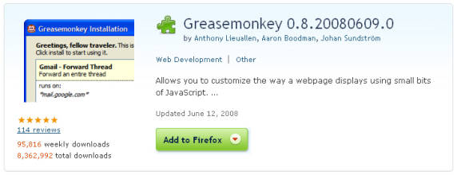
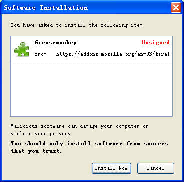
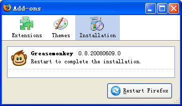
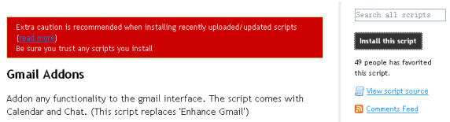
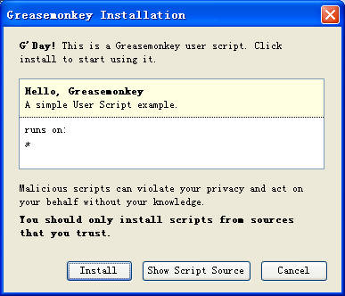
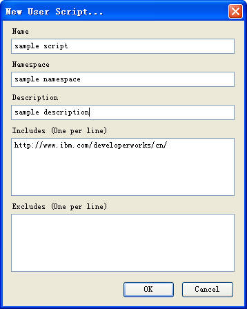
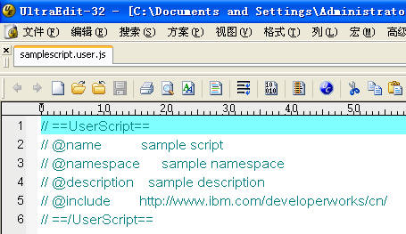
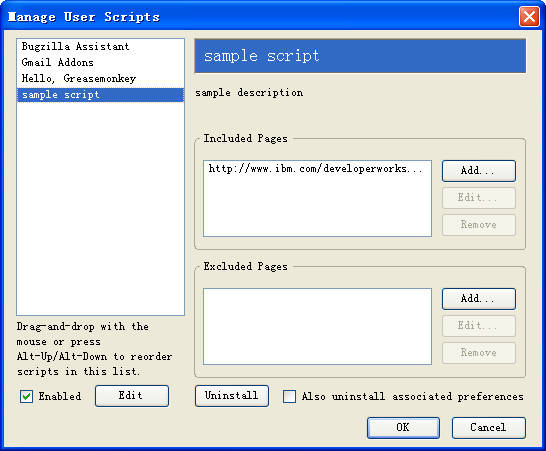
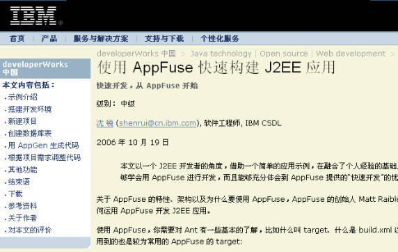
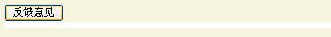

# 我的 Web 我做主: Greasemonkey 入门篇
让本文引领你进入 Greasemonkey 的世界

**标签:** Web 开发

[原文链接](https://developer.ibm.com/zh/articles/os-cn-greasemonkey/)

沈锐

发布: 2008-09-18

* * *

## Greasemonkey 简介

Greasemonkey 是一款 Firefox 的扩展。不同于其他 Firefox 扩展之处在于，Greasemonkey 并非提供某种特定的功能（例如”下载”或者”标签”功能），而是提供一个可供用户自己进行开发的平台。在 Greasemonkey 诞生之前，用户只能”被动”地使用 Web 应用提供的特性，或者凭借 Web 应用提供的有限的定制功能做一些个性化设置。Greasemonkey 的出现使用户”主动”对 Web 应用进行个性化定制成为可能。所以，不得不说 Greasemonkey 的出现对改变人们使用 Web 的方式具有”革命性”的意义。

安装 Greasemonkey 之后，必须要安装 User Script 才能具备特定的功能。所谓 User Script ，是一个用 Javascript 语言编写的以 user.js 为后缀的文件，例如” helloworld.user.js ”。因此只要你会 Javascript ，你就有能力为 Greasemonkey 编写 User Script。由于 Greasemonkey 运行于本地环境，而且它提供了一些自己的 API ，从而 User Script 所能做的事情远远超出 Javascript 的范围，比如数据的的持久化、本地文件的访问以及在 Firefox 菜单栏上增加命令等等。

[Userscripts.org](http://userscripts.org/) 拥有数以千计的 User Script 。该网站为 Greasemonkey 的爱好者提供了一个很好的分享和交流的平台。

## Greasemonkey 的安装及使用

### 安装 Greasemonkey

1. 打开该链接 [https://addons.mozilla.org/en-US/firefox/addon/748](https://addons.mozilla.org/en-US/firefox/addon/748) ，然后点击” Add to Firefox ”按钮。


    ##### 图 1\. 点击 “Add to Firefox” 按钮


    

2. 在弹出窗口中，点击” Install Now ”按钮。


    ##### 图 2\. 点击 “Install Now” 按钮


    

3. 点击” Restart Firefox ”按钮。


    ##### 图 3\. 点击 “Restart Firefox” 按钮


    


此时，在您的 Firefox 右下角会出现一个小猴子图标

[Greasemonkey 图标](https://developer.ibm.com/developer/default/articles/os-cn-greasemonkey/images/Monkey_Active.jpg)，这表明 Greasemonkey 已经安装成功，并且处于”激活”状态。点击该图标，图标变成灰色

[Greasemonkey 图标](https://developer.ibm.com/developer/default/articles/os-cn-greasemonkey/images/Monkey_Inactive.jpg)，此时，Greasemonkey 处于”非激活”状态。

### 安装 User Script

#### 网络安装

点击任何一个链接到以 user.js 为后缀的文件的 URL 都会弹出如下的 User Script 安装窗口。

##### 图 4\. User Script 安装窗口

接下来，您只要点击” Install ”按钮安装该 User Script。以 [Userscripts.org](http://userscripts.org/) 为例，当您搜索到需要的 User Script 后，点击右上角的” Install this script ”就可以安装当前的 User Script 了。

##### 图 5\. 示例：安装 Gmail Addons



#### 本地安装

如果您的 User Script 是本地文件，只要把它拖拽到 Firefox 窗口就可以了。此时，就会看到如下User Script安装窗口。

##### 图 6\. Hello，Greasemonkey 脚本安装窗口



之后的操作与”网络安装”一致。

### 新建 User Script

Greasemonkey 提供了一个简单的窗口帮助你新建 User Script。你可以通过 “Tools > Greasemonkey > New User Script …” 打开该窗口。

##### 图 7\. 新建 User Script 窗口



该窗口中的输入，只有 Name 和 Namespace 是必填的（关于每个输入的含义，详见”教你编写第一个 User Script”部分）。填写完毕后，点击 OK 按钮，Firefox 会用外部文本编辑器打开如下文件（如果是第一次，Greasemonkey 会让你指定文本编辑器程序），接着您就可以在已经生成好的元数据基础上继续编辑了。

##### 图 8\. samplescript.user.js



此时，打开 User Script 管理窗口（Tools > Greasemonkey > Manage User Script …），”sample script”已被创建。

另外一种创建 User Script 的方式是直接在本地创建一个后缀为 user.js 文件，然后将其拖拽到 Firefox 中进行安装（也就是前文中提到的”本地安装”方法）。

### 管理 User Script

点击 “Tools > Greasemonkey > Manage User Script…” 打开 User Script 管理窗口。

##### 图 9\. User Script 管理窗口



在该窗口中，您可以：

- 改变 User Script 的”活动”状态
- 配置 User Script 的 Included Pages 和 Excluded Pages 属性
- 卸载 User Script
- 点击” Edit ”按钮打开外部文本编辑器直接修改 User Script

## 教你编写第一个 User Script

不知道你是否已经厌倦了 developerWorks (注意：developerWorks 现已更名为 IBM Developer) 的白色背景？总是面对同样的一种样式，任何人都会厌倦的。好吧，让我们来编写一个可以改变 developerWorks 背景色的 User Script 。

### 第 1 步，新建一个 User Script

创建 User Script 的步骤请参见”新建 User Script ”部分。在”新建 User Script 窗口”输入如下内容：

- **Name**: dW Customizer

- **Namespace**: `http://www.ibm.com/developerworks/cn/`

- **Description**: 该脚本用于定制 developerWorks 中国网站文章的背景色

- **Includes**: `http://www.ibm.com/developerworks/cn/*`


### 第 2 步，编写脚本逻辑

完成第一步后，您应当已经用文本编辑器打开了 User Script 。请将下面的内容拷贝到您的脚本中（注意：从”// ==/UserScript==”以下开始粘贴）：

```
var myBgColor='beige'
//定制页面背景色
addGlobalStyle('body {background-color:'+myBgColor+'}');
//修改左边内容导航条背景色
addGlobalStyle('td.left-nav-highlight, tr.left-nav-child-highlight td
{background:'+myBgColor+' none repeat scroll 0%;vertical-align:top;}');
//修改"反馈意见”按钮下TD的背景色
var tds = document.evaluate(
    "//td[@bgcolor='#ffffff']",
    document,
    null,
    XPathResult.UNORDERED_NODE_SNAPSHOT_TYPE,
    null);
for (var i = 0; i < tds.snapshotLength; i++) {
    td = tds.snapshotItem(i);
    td.style.backgroundColor=myBgColor;
}
// 在head中添加style
function addGlobalStyle(css) {
    var head, style;
    head = document.getElementsByTagName('head')[0];
    if (!head) { return; }
    style = document.createElement('style');
    style.type = 'text/css';
    style.innerHTML = css;
    head.appendChild(style);
}

```

Show moreShow more icon

### 第 3 步，验证结果

点击该链接 [《使用 AppFuse 快速构建 J2EE 应用》](http://www.ibm.com/developerworks/cn/java/j-lo-appfuse/) ，您将看到此时文章的背景色已经是米色，而不再是一贯的白色。如果您没有看到所述的效果，可以到本文”下载”部分下载安装完整的dw\_customizer.user.js以核对检查是否您的 User Script 有什么错误。

##### 如何调试 User Script?

简单的答案是您如何调试 Javascript，就如何调试 User Script，因为本身 User Script 就是 Javascript 编写的。我常用的方法是：

- **Firebug**

     相信有经验的 Javascript 开发者都不会对 Firebug 感到陌生。Firebug 是一款 Firefox 的扩展，通过它您可以监视、编辑、调试网页中的CSS、HTML已经Javascript代码。对于 User Script 开发，Firebug是一个必不可少的工具。
- **GM\_log**

     这是一个 Greasemonkey 提供的记录日志的方法。您只需要写”GM\_log(‘my message’);”，就会在 Firefox 的 Javascript 控制台中看到日志信息”my message”。它比 alert 函数要好，因为您不会总要去点”确定”按钮关闭 alert 窗口。但有时，对于一些简单应用，用 alert 函数也不失为一种简单有效快速的方法。

当然，除此之外，还有其他的一些 Javascript 测试工具，例如 JSUnit，也可以用来调试 User Script 。

下面对该 User Script 做些解释。

User Script 开头的部分是对元数据的定义。它告诉 Greasemonkey 该 User Script 的名字、命名空间、描述以及何时应该运行该 User Script。下面我们一一对它们做详细讲解。

- **@name**

    顾名思义，这是 User Script 的名字。它会出现在 Greasemonkey 的窗口中，包括安装和管理的窗口。

    可选，如果不指定，默认为 User Script 的文件名（不包含后缀 .user.js）。

- **@namespace**

    User Script 的命名空间，它用于区别同名但却是”不同”的 User Script 。通常它的值是一个URL。

    可选，如果不指定，默认为下载该 User Script 的网站域名。

- **@description**

    User Script 的描述信息，告诉使用者该 User Script 会做些什么事情。

    可选，如果不指定，默认为空。但是处于从方便管理 User Script 的角度出发，建议填写 User Script 描述。

- **@include**

    @include 告诉 Greasemonkey 该 User Script 应当在哪些 URL 对应的网页上运行。`*` 的意思是匹配所有字符。例如，`http://www.ibm.com/developerworks/cn/*`指该 User Script 会在所有 developerWorks 中国的网页中运行。如果您将本例中的 @include 改成 `http://www.ibm.com/developerworks/cn/java/*`，那么它将只对 Java 专区的文章生效。

    可选，如果不指定，默认值为 `*`，也就是所有站点。

- **@exclude**

    @exclude 则是告诉 Greasemonkey 要排除哪些网页。您可以尝试着将本例的元数据改成如下：

    `// ==UserScript==
    // @name           dW Customizer
    // @namespace      http://www.ibm.com/developerworks/cn/
    // @description    该脚本用于定制 developerWorks 中国网站文章的背景色
    // @include        http://www.ibm.com/developerworks/cn/*
    // @exclude        http://www.ibm.com/developerworks/cn/java/*
    // ==/UserScript==`那么，该 User Script 将会在所有除了 Java 专区以外的 developerWorks 中国的网页中运行。从该例中，您也可以看出，@exclude 优先于 @include。另外，@include 和 @exclude 都可以被声明多次（一个声明是单独的一行）。Greasemonkey 将根据所有的声明确定该 User Script 运行范围。

    可选，如果不指定，默认为不排除任何网页。


至于元数据定义之后的代码则是纯粹的 Javascript ，不过这里我们还是简单地解释一下。

addGlobalStyle 是一个用于向 head 中添加样式定义的函数。第一个对 addGlobalStyle 函数的调用添加了对 body 背景色的样式定义。该语句运行后，页面背景已经变成我们指定的颜色：米色。但是你会发现左边的内容导航栏的背景色仍然是白色 － 这让整个页面很不协调。所以，在指定 body 背景色的语句之后，又添加了一个 addGlobalStyle 语句用于覆盖内容导航栏的样式定义。

##### 图 10\. 左边的内容导航条



解决了这个问题后，把页面滚动到最后，我发现”反馈意见”按钮下面仍然有一行白条。用 Firebug 看了一下，原来那个 td 的 bgcolor 属性被设置成白色了。于是，我添加了剩下的代码来修改这个 td 的背景色设置。这里，我用到了 Greasemonkey 的 evaluate 方法，该方法非常有用，它可以根据指定的 XPath 查询方便地找到您想要的页面元素，而无需找到所有的标签后一一对属性值进行判断。

<h5 id=”图-11-” 反馈意见”按钮下的白条>图 11. “反馈意见”按钮下的白条



<h2 id=”其他浏览器上的” greasemonkey”>其他浏览器上的”Greasemonkey”

不只在 Firefox 上有 Greasemonkey，在其他浏览器上也有类似的扩展。

- **Safari**

    [Creammonkey](http://creammonkey.sourceforge.net/) 能够让 Safari 运行绝大多数为 Greasemonkey 创建的 User Script。

- **IE**

    [Greasemonkey for IE](http://www.gm4ie.com/) 是一个提供 Greasemonkey 类似功能的 IE 扩展。Greasemonkey for IE 脚本由两部分组成：一个 js 文件（用于编写脚本逻辑）和一个 gm4ie 文件（用于安装脚本）。

    [Trixie](http://www.bhelpuri.net/Trixie/) 类似于 Creammonkey，它能够直接运行 Greasemonkey 创建的 User Script。但是，由于浏览器的差异，并不是所有的 User Script 能够同时运行于 Greasemonkey 和 Trixie。


## 结束语

本文向大家介绍了 Greasemonkey 的安装使用以及如何编写一个简单的 User Script，并且为 Safari 和 IE 用户列举了一些可选的等价软件。希望这些能使大家的网络生活的变得更加”丰富多采”。在随后的”进阶篇”中，将会涉及一些 Greasemonkey 的高级特性和 User Script 编程技巧。