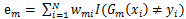
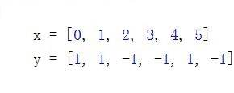

# 手把手教你实现一个 AdaBoost
深入了解机器学习

**标签:** 分析

[原文链接](https://developer.ibm.com/zh/articles/machine-learning-hands-on6-adaboost/)

韩笑琳

发布: 2018-01-31

* * *

## AdaBoost 简介

前面五篇文章涵盖了分类、回归、关联分析等诸多模型，其中分类模型被介绍得最多。原因是分类在机器学习方向是应用最广的方向之一。本文将要介绍的是分类模型中的另一种模型，AdaBoost（adaptive boosting），即自适应提升算法。

Boosting 是一类算法的总称，这类算法的特点是通过训练若干弱分类器，然后将弱分类器组合成强分类器进行分类。为什么要这样做呢？因为弱分类器训练起来很容易，将弱分类器集成起来，往往可以得到很好的效果。俗话说，”三个臭皮匠，顶个诸葛亮”，就是这个道理。这类 boosting 算法的特点是各个弱分类器之间是串行训练的，当前弱分类器的训练依赖于上一轮弱分类器的训练结果。各个弱分类器的权重是不同的，效果好的弱分类器的权重大，效果差的弱分类器的权重小。值得注意的是，AdaBoost 不止适用于分类模型，也可以用来训练回归模型。这需要将弱分类器替换成回归模型，并改动损失函数。本文将重点介绍用 AdaBoost 进行分类的算法原理。

AdaBoost 算法有其独特的优点，那就是可以将不同的分类算法组合起来，形成强分类器。这就可以充分利用不同分类算法的优势进行建模。也可以将同一算法的不同设置进行组合，这样训练的模型比单一设置模型的训练精度高。

当然，就如每一个算法都有自己的优缺点一样，AdaBoost 也有自身的缺点。AdaBoost 算法只直接支持二分类，遇到多分类的情况，需要借助 one-versus-rest 的思想来训练多分类模型。关于 one-verus-rest 的细节可以参考本系列第一篇文章 SVM。

为了让读者有一个感性的认识，在文章一开始先举个 AdaBoost 训练出来的强分类器的例子，如下所示，强分类器 G(x)中包含三个弱分类器 f(x), g(x) 和 z(x)， 其中每个弱分类器的权重分别为0.80, 0.69和0.71。

G(x) = sign( 0.80 _f(x) + 0.69_ g(x) + 0.71 \* z(x) )

## AdaBoost原理

AdaBoost 的核心就是不断迭代训练弱分类器，并计算弱分类器的权重。需要注意的是，弱分类器的训练依赖于样本权重。每一轮迭代的样本权重都不相同，依赖于弱分类器的权重值和上一轮迭代的样本权重。具体过程如下：

### 训练当前迭代最优弱分类器

最优弱分类器是错误率最小的那个弱分类器。错误率的计算公式是：



其中m = 1,2,..,M，代表第m轮迭代。i代表第i个样本。w 是样本权重。I指示函数取值为1或0，当I指示函数括号中的表达式为真时，I 函数结果为1；当I函数括号中的表达式为假时，I 函数结果为0。取错误率最低的弱分类器为当前迭代的最优弱分类器。

注意，第一轮迭代计算时样本权重初始化为总样本数分之一。

### 计算最优弱分类器的权重

最优弱分类器的权重只与该弱分类器的错误率有关。弱分类器的权重计算公式如下：


可以看出，错误率越小，则 alpha 值越大，即该弱分类器的权重越高；反之，错误率越大，则 alpha 值越小，则该弱分类器的权重越小。这样可以使分类精度高的弱分类器起到更大的作用，并削弱精度低的弱分类器的作用。

### 根据错误率更新样本权重

样本权重的更新与当前样本权重和弱分类器的权重有关。样本权重更新公式如下：


其中m = 1,2,..,M，代表第 m 轮迭代。i代表第i个样本。w 是样本权重。alpha 是弱分类器的权重。当样本被正确分类时，y 和 Gm 取值一致，则新样本权重变小；当样本被错误分类时，y 和 Gm 取值不一致，则新样本权重变大。这样处理，可以使被错误分类的样本权重变大，从而在下一轮迭代中得到重视。

### 迭代终止条件

不断重复1,2,3步骤，直到达到终止条件为止。终止条件是强分类器的错误率低于最低错误率阈值或达到最大迭代次数。

## 用例子解释 AdaBoost 原理

本节主要用示例数据详细说明用上节介绍的 AdaBoost 原理进行分类的过程。本例用到的数据集如表1所示。为方便说明，本文所用弱分类器为形如x<1.5,则y=1，否则y=-1的简单分类算法。熟悉了 AdaBoost 原理的读者，可以使用其他分类算法作为弱分类器。如使用本系列上篇文章介绍的 CART 树中的分类树作为弱分类器，可训练出提升分类树模型。

##### 表 1\. 示例数据集

x012345y11-1-11-1

第一轮迭代

**1.a 选择最优弱分类器**

第一轮迭代时，样本权重初始化为（0.167, 0.167, 0.167, 0.167, 0.167, 0.167）。

表1数据集的切分点有0.5, 1.5, 2.5, 3.5, 4.5

若按0.5切分数据，得弱分类器x < 0.5,则 y = 1; x > 0.5, 则 y = -1。此时错误率为2 \* 0.167 = 0.334

若按1.5切分数据，得弱分类器x < 1.5,则 y = 1; x > 1.5, 则 y = -1。此时错误率为1 \* 0.167 = 0.167

若按2.5切分数据，得弱分类器x < 2.5,则 y = 1; x > 2.5, 则 y = -1。此时错误率为2 \* 0.167 = 0.334

若按3.5切分数据，得弱分类器x < 3.5,则 y = 1; x > 3.5, 则 y = -1。此时错误率为3 \* 0.167 = 0.501

若按4.5切分数据，得弱分类器x < 4.5,则 y = 1; x > 4.5, 则 y = -1。此时错误率为2 \* 0.167 = 0.334

由于按1.5划分数据时错误率最小为0.167，则最优弱分类器为x < 1.5,则 y = 1; x > 1.5, 则 y = -1。

**1.b 计算最优弱分类器的权重**

alpha = 0.5 \* ln((1 – 0.167) / 0.167) = 0.8047

**1.c 更新样本权重**

x = 0, 1, 2, 3, 5时，y分类正确，则样本权重为：

0.167 \* exp(-0.8047) = 0.075

x = 4时，y分类错误，则样本权重为：

0.167 \* exp(0.8047) = 0.373

新样本权重总和为0.075 \* 5 + 0.373 = 0.748

规范化后，

x = 0, 1, 2, 3, 5时，样本权重更新为：

0.075 / 0.748 = 0.10

x = 4时, 样本权重更新为：

0.373 / 0.748 = 0.50

综上，新的样本权重为(0.1, 0.1, 0.1, 0.1, 0.5, 0.1)。

此时强分类器为G(x) = 0.8047 \* G1(x)。G1(x)为x < 1.5,则 y = 1; x > 1.5, 则 y = -1。则强分类器的错误率为1 / 6 = 0.167。

第二轮迭代

**2.a 选择最优弱分类器**

若按0.5切分数据，得弱分类器x > 0.5,则 y = 1; x < 0.5, 则 y = -1。此时错误率为0.1 \* 4 = 0.4

若按1.5切分数据，得弱分类器x < 1.5,则 y = 1; x > 1.5, 则 y = -1。此时错误率为1 \* 0.5 = 0.5

若按2.5切分数据，得弱分类器x > 2.5,则 y = 1; x < 2.5, 则 y = -1。此时错误率为0.1 \* 4 = 0.4

若按3.5切分数据，得弱分类器x > 3.5,则 y = 1; x < 3.5, 则 y = -1。此时错误率为0.1 \* 3 = 0.3

若按4.5切分数据，得弱分类器x < 4.5,则 y = 1; x > 4.5, 则 y = -1。此时错误率为2 \* 0.1 = 0.2

由于按4.5划分数据时错误率最小为0.2，则最优弱分类器为x < 4.5,则 y = 1; x > 4.5, 则 y = -1。

**2.b 计算最优弱分类器的权重**

alpha = 0.5 \* ln((1 –0.2) / 0.2) = 0.6931

**2.c 更新样本权重**

x = 0, 1, 5时，y分类正确，则样本权重为：

0.1 \* exp(-0.6931) = 0.05

x = 4 时，y分类正确，则样本权重为：

0.5 \* exp(-0.6931) = 0.25

x = 2,3时，y分类错误，则样本权重为：

0.1 \* exp(0.6931) = 0.20

新样本权重总和为 0.05 _3 + 0.25 + 0.20_ 2 = 0.8

规范化后，

x = 0, 1, 5时，样本权重更新为：

0.05 / 0.8 = 0.0625

x = 4时, 样本权重更新为：

0.25 / 0.8 = 0.3125

x = 2, 3时, 样本权重更新为：

0.20 / 0.8 = 0.250

综上，新的样本权重为(0.0625, 0.0625, 0.250, 0.250, 0.3125, 0.0625)。

此时强分类器为G(x) = 0.8047 _G1(x) + 0.6931_ G2(x)。G1(x)为x < 1.5,则 y = 1; x > 1.5, 则 y = -1。G2(x)为x < 4.5,则 y = 1; x > 4.5, 则 y = -1。按G(x)分类会使x=4分类错误，则强分类器的错误率为1 / 6 = 0.167。

第三轮迭代

**3.a 选择最优弱分类器**

若按0.5切分数据，得弱分类器x < 0.5,则 y = 1; x > 0.5, 则 y = -1。此时错误率为0.0625 + 0.3125 = 0.375

若按1.5切分数据，得弱分类器x < 1.5,则 y = 1; x > 1.5, 则 y = -1。此时错误率为1 \* 0.3125 = 0.3125

若按2.5切分数据，得弱分类器x > 2.5,则 y = 1; x < 2.5, 则 y = -1。此时错误率为0.0625 \* 2 + 0.250 + 0.0625 = 0.4375

若按3.5切分数据，得弱分类器x > 3.5,则 y = 1; x < 3.5, 则 y = -1。此时错误率为0.0625 \* 3 = 0.1875

若按4.5切分数据，得弱分类器x < 4.5,则 y = 1; x > 4.5, 则 y = -1。此时错误率为2 \* 0.25 = 0.5

由于按3.5划分数据时错误率最小为0.1875，则最优弱分类器为x > 3.5,则 y = 1; x < 3.5, 则 y = -1。

**3.b 计算最优弱分类器的权重**

alpha = 0.5 \* ln((1 –0.1875) / 0.1875) = 0.7332

**3.c 更新样本权重**

x = 2, 3时，y分类正确，则样本权重为：

0.25 \* exp(-0.7332) = 0.1201

x = 4 时，y分类正确，则样本权重为：

0.3125 \* exp(-0.7332) = 0.1501

x = 0, 1, 5时，y分类错误，则样本权重为：

0.0625 \* exp(0.7332) = 0.1301

新样本权重总和为 0.1201 _2 + 0.1501 + 0.1301_ 3 = 0.7806

规范化后，

x = 2, 3时，样本权重更新为：

0.1201 / 0.7806 = 0.1539

x = 4时, 样本权重更新为：

0.1501 / 0.7806 = 0.1923

x = 0, 1, 5时, 样本权重更新为：

0.1301 / 0.7806 = 0.1667

综上，新的样本权重为(0.1667, 0.1667, 0.1539, 0.1539, 0.1923, 0.1667)。

此时强分类器为 G(x) = 0.8047 _G1(x) + 0.6931_ G2(x) + 0.7332 _G3(x)。G1(x)为x < 1.5,则 y = 1; x > 1.5, 则 y = -1。G2(x)为x < 4.5,则 y = 1; x > 4.5, 则 y = -1。G3(x)为x > 3.5,则 y = 1; x < 3.5, 则 y = -1。按G(x)分类所有样本均分类正确，则强分类器的错误率为0 / 6 = 0。则停止迭代，最终强分类器为G(x) = 0.8047_ G1(x) + 0.6931 _G2(x) + 0.7332_ G3(x)。

## 实现步骤: 自己动手实现 AdaBoost

本节将介绍如何用 python 代码实现 AdaBoost。AdaBoost 的实现是一个迭代的过程，每一轮迭代都会训练最优基本弱分类器，然后计算弱分类器的权重；再根据错误率和上一轮样本权重更新样本权重值。如果当前所有弱分类器的线性组合的错误率低于最低错误率阈值，或者达到最大迭代数，则结束迭代，返回所有弱分类器的线性组合作为最终训练所得的强分类器。

#### 清单 1\. 计算可能的划分点

```
def generateGxList(x):
    gxlist = []
    for i in range(len(x) - 1):
        gx = (x[i] + x[i + 1]) / 2
        gxlist.append(gx)
    return gxlist

```

Show moreShow more icon

清单1介绍了计算x所有可能划分点的过程。本文选取两个相邻x的均值作为划分点。

#### 清单 2\. 计算弱分类器权重

```
def calcAlpha(minError):
    alpha = 1/2 * log((1-minError)/minError)
    return alpha

```

Show moreShow more icon

清单 2 用来计算弱分类器的权重。权重计算公式参加上文 AdaBoost 原理部分。可以看出弱分类器的权重只与错误率有关，错误率越大，则对应的弱分类器的权重越小；错误率越小，而对应的弱分类器的权重越大。

#### 清单 3\. 计算样本新权重

```
def calcNewWeight(alpha,ygx, weight, gx, y):
    newWeight = []
    sumWeight = 0
    for i in range(len(weight)):
        flag = 1
        if i  < gx and y[i] != ygx: flag = -1
        if i > gx and y[i] != -ygx: flag = -1
        weighti = weight[i]*exp(-alpha*flag)
        newWeight.append(weighti)
        sumWeight += weighti
    newWeight = newWeight / sumWeight

    return newWeight

```

Show moreShow more icon

清单 3 介绍了更新样本权重的方法。该方法只与上一轮样本权重和弱分类器的权重 alpha 值有关。具体计算公式为weighti = weight[i] _exp(-alpha_ flag)，可以看出若样本分类正确，则flag为1，exp(-alpha _flag)越小，则新权重越小；若样本分类错误，则flag为-1，exp(-alpha_ flag)越大，则新权重会越大。这会使得上一轮分类错误地样本的权重变大，使其在新一轮训练中得到重视。

#### 清单 4\. 训练基本弱分类器

```
def trainfxi(fx, i, x, y, weight):
    minError = inf
    bestGx = 0.5
    gxlist = generateGxList(x)
    bestygx = 1
    # 计算基本分类器
    for xi in gxlist:
        error, ygx = calcErrorNum(xi, x, y, weight)
        if error  < minError:
            minError = error
            bestGx = xi
            bestygx = ygx
    fx[i]['gx'] = bestGx
    #计算alpha
    alpha = calcAlpha(minError)
    fx[i]['alpha'] = alpha
    fx[i]['ygx'] = bestygx
    #计算新的训练数据权值
    newWeight = calcNewWeight(alpha,bestygx, weight, bestGx, y)
    return newWeight

def calcErrorNum(gx, x, y, weight):
    #判断以gx为切分点的两种方式里，哪种会让误差更小
    error1 = 0
    errorNeg1 = 0
    ygx = 1
    for i in range(len(x)):
        if i  < gx and y[i] != 1: error1 += weight[i]
        if i > gx and y[i] != -1: error1 += weight[i]
        if i  < gx and y[i] != -1: errorNeg1 += weight[i]
        if i > gx and y[i] != 1: errorNeg1 += weight[i]
    if errorNeg1  < error1:
        return errorNeg1, -1 #x>gx,则fgx = 1
    return error1, 1 #x <gx, 则fgx = 1

```

Show moreShow more icon

清单 4 用来训练基本弱分类器。首先，选出错误率最低的弱分类器作为当前迭代的基础分类器，然后调用 calcAlpha 函数计算该弱分类器的权重，接着调用 calcNewWeight 函数更新训练数据权重。

#### 清单 5\. 计算当前弱分类器线性组合的错误率

```
def calcFxError(fx, n, x, y):
    errorNum = 0
    for i in range(len(x)):
        fi = 0
        for j in range(n):
            fxiAlpha = fx[j]['alpha']
            fxiGx = fx[j]['gx']
            ygx = fx[j]['ygx']
            if i < fxiGx: fgx = ygx
            else: fgx = -ygx
            fi += fxiAlpha * fgx
        if sign(fi) != y[i]: errorNum += 1

    return errorNum/len(x)

```

Show moreShow more icon

清单 5 用来计算当前所有弱分类器线性组合形成的强分类器的错误率。错误率为错分类样本数除以总样本数。

#### 清单 6\. 训练强分类器

```
def trainAdaBoost(x, y, errorThreshold, maxIterNum):
    fx = {}
    weight = []
    xNum = len(x)
    for i in range(xNum):
        w = float(1/xNum)
        weight.append(w)

    for i in range(maxIterNum):
        fx[i] = {}
        newWeight = trainfxi(fx, i, x, y, weight)
        weight = newWeight
        fxError = calcFxError(fx, (i+1), x, y)
        if fxError  < errorThreshold: break

    return fx

```

Show moreShow more icon

清单 6 用来训练强分类器。errorThreshold 为最低错误率阈值，maxIterNum 为最大迭代数，用这两个变量控制迭代是否结束。首先，初始化样本权重为总样本数分之一，然后训练弱分类器，并更新样本权重。如果强分类器权重小于最低错误率阈值 errorThreshold，或者达到最大迭代数，则算法结束。

### 代码下载

本文所有 AdaBoost 实现代码可在文末下载。

## 本文数据集简介

##### 图1.数据集样例



数据集共有 6 条数据。分别为x取0时，y为1；x取1时，y取1；x取2时，y取-1；以此类推。其中y是目标变量，取值范围为1和-1。

## 应用示例: 应用实现的 AdaBoost 训练模型

#### 清单 7\. 用 AdaBoost 训练模型

```
def loadDataSet():
    x = [0, 1, 2, 3, 4, 5]
    y = [1, 1, -1, -1, 1, -1]
    return x, y

if __name__ == '__main__':
    x, y = loadDataSet()
    errorThreshold = 0.01
    maxIterNum = 10
    fx = trainAdaBoost(x, y, errorThreshold, maxIterNum)
    print(fx)

```

Show moreShow more icon

清单 7 用来训练模型。首先加载数据集，得到x和y。然后设置最小错误阈值和最大迭代数，用来控制模型训练何时结束。最后调用 trainAdaBoost 函数训练模型。运行结果如下所示。

运行结果：

{0: {‘alpha’: 0.80471895621705025, ‘gx’: 1.5, ‘ygx’: 1}, 1: {‘alpha’: 0.69314718055994529, ‘gx’: 4.5, ‘ygx’: 1}, 2: {‘alpha’: 0.73316853439671348, ‘gx’: 3.5, ‘ygx’: -1}}

运行结果中共包含3个弱分类器。第一个弱分类器的权重是0.8047，该分类器为x < 1.5，则y取1，否则y取-1。第二个弱分类器的权重是0.6931，该分类器为x < 4.5，则y取1，否则y取-1。第三个弱分类器的权重是0.7332，该分类器为x < 3.5，则y取-1，否则y取1。

## 总结

本文首先介绍了 AdaBoost 的概念、优点及缺点，接着从训练弱分类器、计算弱分类器权重、更新样本权重等入手详细深入地讲解了 AdaBoost 的原理。接着用例子介绍 AdaBoost 的算法过程。然后通过代码样例，介绍了自己动手实现 AdaBoost 的思路。最后，利用数据展示了如何应用 AdaBoost 训练具体模型。有读者肯定会想问弱分类器的权重计算公式由何而来？其实，该公式并非凭空造出来的，而是经过严格推导出来的。它是将指数函数作为损失函数，前向分步算法作为学习算法而一步步推导得到的。上文介绍了用 AdaBoost 思想进行简单分类的过程，如果把上文中的弱分类器替换成树中的分类树，就得到了提升树模型。其实用 AdaBoost 也可以进行回归。用 AdaBoost 实现回归模型需要将弱分类器替换成回归树，并将平方误差作为损失函数。由于篇幅有限在此不展开，有兴趣的读者可以详细阅读下方参考资料进行了解。

## 参考资源

本文用到的参考文献如下：

- 参考李航著《统计学习方法》，了解弱分类器权重计算过程及用 AdaBoost 进行回归的原理和过程。
- 参考 Peter Harrington 著《机器学习实战》，了解 Boosting 的特点。

## Download

[AdaBoost\_code](/developerworks/cn/analytics/library/machine-learning-hands-on6-adaboost/AdaBoost_code.zip): 样例代码