# 手把手教你实现一个高斯混合模型
机器学习手把手系列

**标签:** 分析

[原文链接](https://developer.ibm.com/zh/articles/ba-lo-machine-learning-hands-on7-gmm/)

韩 笑琳

发布: 2018-06-28

* * *

## 高斯混合简介

在本系列的前六篇中，笔者分别介绍了分类，关联规则两种模型。分类模型根据样本标签和样本数据训练分类模型，如 SVM，决策树等模型；关联规则挖掘频繁项集之间的共现规则。在本篇中，笔者将介绍另一类模型, 聚类。聚类和分类的区别在于，待聚类的样本标签是未知的，需要根据样本分布情况，将样本聚成不同的簇，每一簇代表相似的群体。聚类模型中比较经典的模型当属高斯混合模型和 K-means 模型。这两个模型的思想有相似之处。

K-means 模型先随机初始化聚类中心，然后计算所有样本到k个聚类中心的距离，将样本归入离其最近的一个聚类中心所在的簇。然后对形成的每个簇，重新计算聚类中心，计算方式为簇内所有样本点的均值。有了新的聚类中心后，重新计算所有样本到 k 个聚类中心的距离，将样本归入离其最近的聚类中心所在的簇。不断迭代这两个步骤，当聚类中心不再发生变化或者达到最大迭代次数时结束。

K-means 将样本分到离其最近的聚类中心所在的簇，也就是每个样本数据属于某簇的概率非零即 1。对比 K-means，高斯混合的不同之处在于，样本点属于某簇的概率不是非零即 1 的，而是属于不同簇有不同的概率值。高斯混合模型假设所有样本点是由 K 个高斯分布混合而成的，如统计一个班级里所有同学的身高，这些身高就是由男生身高和女生身高这两个高斯分布混合而成的。

假设我们已知班上所有同学的性别，如下图所示，那么可以很容易根据样本身高和样本类别求得男生身高和女生身高这两个高斯分布的参数。

##### 图1.身高分布

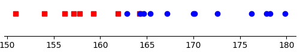

但是，现实中很多时候我们往往无法得知采样样本是来自哪个类，如下图所示。从下图可以看出，身高在 150cm 到 180cm 之间分布。

##### 图2.未知类别身高分布

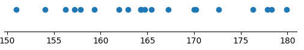

当我们只有身高数据的时候，如何将身高数据聚成男女生两个簇？这就是高斯混合分布可以解决的问题。高斯混合分布首先将该问题转换为包含隐变量（即每条样本属于不同类别的概率）和模型参数（即男女生两个高斯分布的参数）的极大似然估计问题。由于该极大似然估计问题中包含隐变量和模型参数，所以无法用传统的求偏导的方法求得。这时，需要利用EM算法，即期望最大化算法求解参数。

## 高斯混合原理

和 K-means 模型类似，高斯混合模型主要分为两步，Expectation（期望）和 Maximization（最大化）。在本节中主要介绍高斯混合模型这两步的原理，至于这两步的计算公式是如何得到的，会在下一节介绍。

(1) Expectation (期望)

考虑男女生身高这个例子，假设有 20 个身高样本数据，但是并不知道每个样本数据是来自男生还是女生。在这种情况下，求如何将这 20 个身高数据聚成男女生两大类。假设男女生身高服从高斯分布。如上一节中所介绍，如果我们知道每条样本所属的类别后，可以很容易得计算出男女生两个类所对应的高斯分布的参数。但是，往往我们不知道每个样本所属的类别。这就需要先估计每个样本所属的类别，然后根据每个样本估计的类别，计算男女生两个类别的高斯分布的参数，然后不断迭代。大体思想和 K-means 是一致的。

参考 K-means，首先会随机初始化聚类中心，K-means 中的这个聚类中心对应到高斯混合模型中就是男女生两个簇的高斯分布参数。随机初始化模型参数后，K-means 会根据每个样本点到簇中心的距离决定每个样本属于哪个簇。对应到高斯混合模型中，就是 Expectation（期望）这一步。在高斯混合模型期望这一步中，需要求解的是每个样本点属于男女生两类的概率。注意这里是概率，而不是像 K-means 中确定每个样本点属于男女生哪个类，取值是0或1，而非概率。在本节中先给出求解每个样本点属于男女生两类的概率计算公式，具体计算公式的推导过程会在下一节介绍。

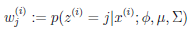

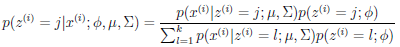

其中，mu,sigma 指高斯分布的均值和方差（如果是二维以上，则是协方差）。Phi 服从多项式分布，指男生类别和女生类别出现的概率。这两个概率和为 1。在这一步中，假设三个参数都是已知的，只有每个样本点属于男女生两类的概率是未知的，这个概率可以通过已知的这三个参数计算得出。上面的公式利用了经典的贝叶斯公式求解。

(2) Maximization (最大化)

最大化用来求解各个聚类结果对应的高斯分布的参数，即期望步骤中提到的 mu ,sigma 和 phi 三个参数。这一步类似于 K-means 中根据每个样本点所属的簇，重新计算不同簇的聚类中心。只不过，在混合高斯模型中，需要计算高斯分布的参数：均值 mu,方差 sigma 和男女生类别概率 phi。这三个参数的计算公式如下，具体计算公式的推导过程会在下一节中介绍。

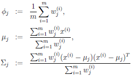

其中，m 为样本的个数。W 为期望步骤中求得的每个样本点属于男女生两类的概率。可以看出，这一步利用期望步骤中求得的 w，来更新三个模型参数。

这种参数估计的思想，先随机初始化模型参数（每个类别对应的高斯分布的均值，方差，和每个类别的概率），然后利用模型参数更新隐变量（每个样本属于男女生两类的概率）。不断迭代这两步，直到收敛或者达到最大迭代次数为止。这就是EM算法的思想。下一节介绍利用 EM 算法如何估计高斯混合模型的参数。

## 利用 EM 算法估计高斯混合的参数

通过上文的介绍，读者对高斯混合模型原理有了一定的了解。同时，也会有疑惑，究竟期望最大化两步中，求解四个参数的公式从何而来呢？这就要提到最大似然估计，以及 EM（期望最大化）算法。

最大似然估计，即求使得观察到的数据出现的概率最大化对应的参数值。假设观察到的样本数据都是独立的，则它们出现的概率为每个样本的概率乘积。为了方便计算，对这个概率乘积加上 log，得到 log 似然函数：

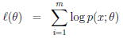

其中 theta 是三个模型参数，即每个聚类对应高斯分布的均值 mu，方差 sigma，男女生两个类别的概率 phi。我们还知道，在这个问题中，有一个隐变量，即每个样本属于不同类别的概率，将该隐变量的各个取值求和，可得：

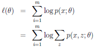

可以通过求解上式的最大值得到各个参数的解。不同于其他最大似然估计问题，上式无法直接对各个参数求偏导从而得到各个参数的值。因此，这里就需要对上式做一些变换，如下：

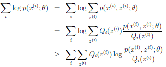

这里引入 Q 函数，而且利用了 Jensen 不等式。Jensen 不等式利用了凹函数的不等式性质。这里不展开介绍，有兴趣的读者可以参考维基百科对 Jensen 不等式的介绍（`https://en.wikipedia.org/wiki/Jensen%27s_inequality`）。由上式，可以得到 log 似然函数的下界。由此，可以通过求似然函数的最紧下界，然后最大化其最紧下界这两个步骤迭代求得 log 似然函数的最大值。而提到的求似然函数的最紧下界，就是 EM 算法的 E 步骤。最大化其最紧下界，就是 M 步骤。

E 步骤，即求似然函数的最紧下界，需要让上面的不等式中的等式成立。由 Jensen 不等式的性质，为了让等式成立，需要满足：

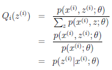

利用贝叶斯公式，可得：


M 步骤，即最大化其最紧下界，由于该最紧下界中的隐变量已在 E 步骤中求得，可以直接利用极大似然估计求解：

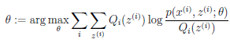

求解过程中，对每个参数逐个求偏导，然后令偏导等于0求得该参数。

最终三个参数的解为：


## 实现步骤: 自己动手实现高斯混合模型

本节将介绍如何利用上文介绍的参数求解过程来自己动手实现一个高斯混合模型。高斯混合模型的代码关键之处，在于 Expectation 期望和 Maximization 最大化两步，通过不断迭代这两个步骤，从而不断更新模型参数。最后可得到每一个样本属于不同类别的概率值，选择概率值最大的那个类别作为最终的聚类结果。

#### 清单 1\. 加载数据集

```
def loadData(fileName):
    data = np.loadtxt(fileName
    return data

```

Show moreShow more icon

清单 1 介绍了加载数据集的过程。Numpy 库提供了读取 txt 文件并将数据存为数组的函数 loadtxt (fileName)。

#### 清单 2\. 归一化数据集

```
def scaleData(dataMat):
    max = dataMat[:,0].max()
    min = dataMat[:,0].min()
    dataMat[:,0] = (dataMat[:,0] - min) / (max - min)
    return dataMat

```

Show moreShow more icon

清单 2 用来归一化数据集。Max 为所有数据中最大的值，min 为所有数据中最小的值，对每个数据减去最小值然后除以最大值和最小值的差，从而进行归一化，使得每一个数据在 0 到 1 范围内。

#### 清单 3\. 初始化参数

```
def initializePara():
    theta = np.array([0.3, 0.7])
    mu = np.array([[0.2], [0.4]])
    sigma = np.array([0.3, 0.5])
    print("mu:",mu,"sigma:",sigma,"theta:",theta,sep='\n')
    return theta,mu,sigma

```

Show moreShow more icon

清单 3 介绍了初始化参数的方法。对 theta, mu, sigma 三个参数各自赋上初始值。这一步和 K-means 中需要首先随机初始化聚类中心类似。

#### 清单 4\. Expectation 步骤

```
def eStep(theta, mu, sigma, dataMat):
    w = np.mat(np.zeros((20, 2)))
    for j in range(2):
        temp = multivariate_normal(mu[j],sigma[j]).pdf(dataMat[:,0])*theta[j]
        w[:, j] = np.matrix(temp).transpose()
    for i in range(20):
        w[i,:] = w[i,:]/np.sum(w[i,:])
    return w

```

Show moreShow more icon

清单 4 用来计算 Expectation 步骤，即期望。该步骤利用上文介绍的 w 计算公式，利用上一步求得的 theta, mu, sigma 三个参数的值来估计 w 的新值。

#### 清单 5\. Maximization 步骤

```
def mStep(data, w):
    sigma = np.zeros(2)
    for j in range(2):
        theta[j] = np.sum(w[:,j]) / 20
        mu[j] = w[:,j].transpose() * data[:,0] / np.sum(w[:,j])
        for i in range(20):
            sigma[j] += w[i,j]*(data[i,0]-mu[j])*(data[i,0]-mu[j])/ np.sum(w[:,j])
    return theta,mu,sigma

```

Show moreShow more icon

清单 5 用来计算 Maximization 步骤，即最大化。该步骤利用上文介绍的三个模型参数计算公式，利用上一步更新后的 w 值和样本值，来更新 theta, mu, sigma 这三个参数的值。

## 代码下载 (code downloads)

本文所有高斯混合模型实现代码可 [在此](https://s3.us.cloud-object-storage.appdomain.cloud/developer/default/articles/ba-lo-machine-learning-hands-on7-gmm/static/GMM_code.rar) 下载。

## 本文数据集简介

##### 图3.数据集样例

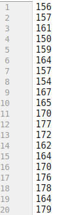

数据集共有 20 条数据，为 20 名男女生的身高，单位为厘米。但是并不知道每条数据是男生还是女生的。这就需要建立高斯混合模型来估计每条样本所属的类别概率，及男女生这两个类别对应的高斯分布的参数 (均值和方差) 和男女生两个类别的概率。

## 应用示例: 应用实现的高斯混合训练模型

#### 清单 6\. 用高斯混合训练模型

```
import numpy as np
import matplotlib.pyplot as plt
from scipy.stats import multivariate_normal
#load data
data = loadData('height.txt')
dataMat = np.matrix(data,copy=True).transpose()
m,n = dataMat.shape
#rescale data
dataMat = scaleData(dataMat)
# initialize parameters
theta,mu,sigma = initializePara()
numIter = 40
# train parameters by E-step and M-stemp
for i in range(numIter):
    w = eStep(theta, mu, sigma, dataMat)
    theta,mu,sigma = mStep(dataMat, w)
# calculate final w by trained parameters
print("mu:", mu, "sigma:", sigma, "theta:", theta, sep='\n')
w = eStep(theta, mu, sigma, dataMat)
cluster = w.argmax(axis = 1).flatten().tolist()[0]
#get data for female and male
female = np.array([data[i] for i in range(20) if cluster[i] == 0])
male = np.array([data[i] for i in range(20) if cluster[i] == 1])
# plot
plt.plot(female,[0]*len(female),'rs',label="female")
plt.plot(male,[0]*len(male),'bo',label="male")
plt.legend(loc="best")
plt.title('GMM Clustering Result')
plt.show()

```

Show moreShow more icon

清单 6 用来训练高斯混合模型。首先加载数据集 height.txt，然后对数据集进行归一化，使其取值范围为 0 到 1 之间。然后调用 initializePara() 方法进行参数初始化。接着迭代进行期望和最大化两个步骤，重复 40 次。随之，将估计出的参数带入期望函数中，求得最终的每条样本对应男女两类的概率矩阵，将每条样本对应两个类别概率中最大的那个作为最终类别。运行结果如下所示。

##### 图4.运行结果

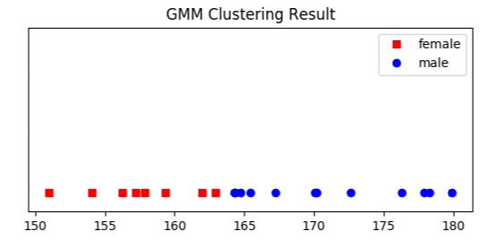

运行结果中红色方块代表聚类结果为女生的样本，蓝色原点代表聚类结果为男生的样本。

## 总结

本文首先介绍了高斯混合模型的原理，并将高斯混合模型和 k-means 模型做了比较，接着从EM算法入手详细深入地讲解了推导高斯混合模型的过程。然后通过代码样例，介绍了自己动手实现高斯混合模型的思路。最后，利用数据展示了如何应用高斯混合模型训练具体模型。高斯混合模型是常用的聚类算法，可以在未知样本标签的情况下，通过参数估计求得每个样本所属的类。上文提到的EM即期望最大化算法，是典型的求解包含隐变量的参数估计的方法。通过将隐变量和模型参数分别固定，逐步更新来求得最终的隐变量和模型参数的值。EM 算法不光适用于求解高斯混合模型的参数，对于其他包含隐变量的极大似然估计的参数求解同样适用。

## 参考资源

本文用到的参考文献如下：

- 参考李航著《统计学习方法》，了解 EM 算法的原理和过程。
- Andrew NG for Machine Learning (CS 229)，了解利用 EM 算法估计高斯混合模型参数的原理及推导过程。