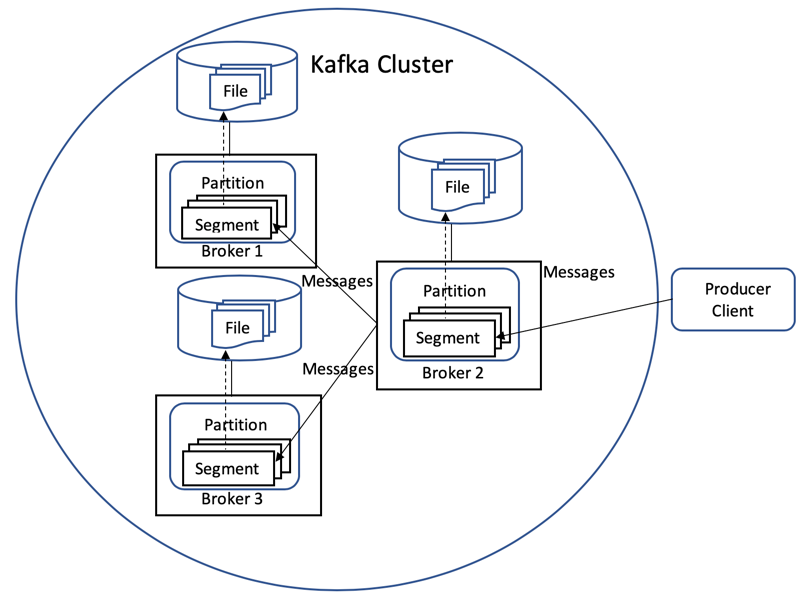

# 持久化在 Apache Kafka 部署中的工作原理
在默认的 Kafka 或 IBM Event Streams on IBM Cloud 部署中持久化存储数据

**标签:** Apache Kafka,IBM Event Streams,消息传递

[原文链接](https://developer.ibm.com/zh/articles/how-persistence-works-in-apache-kafka/)

Geoffrey Judd

发布: 2020-07-07

* * *

在本文中，我们将探讨 Apache Kafka 如何持久化存储发送到 Kafka 部署的数据。我们将讨论主题分区和日志段、确认和数据保留。

本文假定您已了解 Kafka 的基本概念：

- Kafka 部署由 Kafka 集群中的 1 个或多个 Kafka 代理进程组成
- 生产者客户端将消息写入主题分区，消费者客户端从中读取消息
- 可以跨 1 个或多个代理复制主题分区

要了解有关 Apache Kafka 的更多信息，请参阅其 [Apache Kafka 简介](https://kafka.apache.org/intro) 和 [Apache Kafka 文档](https://kafka.apache.org/documentation/)。

在数据持久化方面，我们还将描述如何在 IBM Event Streams on IBM Cloud 中配置 Kafka。

## 主题分区和日志段

主题分区中的数据分为多个日志段。对于每个日志段，磁盘上都有一个对应的文件。其中一个段是当前将消息写入其中的活动段。一旦达到活动段的大小或时间限制，就会关闭相应的文件并打开一个新文件。通过将主题分区的数据划分为多个段，Kafka 可以清除和压缩非活动段中的消息。

在下图中，主题分区具有 3 个副本，代理 2 是领导者副本，代理 1 和 3 是追随者副本。每个副本都有一个用于主题分区的段，该段由其自己的文件备份。

将数据写入日志段时，默认情况下不会立即将其写入到磁盘。Kafka 依靠底层操作系统将数据缓慢地写入到磁盘，从而提高了性能。尽管这似乎增加了数据丢失的风险，但是在大多数情况下，每个主题分区都将配置为具有多个副本。因此，数据将存在于多个代理中。

Kafka 具有服务器配置参数和基于主题的配置参数，这些参数允许通过已接收消息的数量或消息在段中的留存时间来控制将段数据写入到磁盘的频率。通常，您不应覆盖允许操作系统自行决定何时将段数据写入到磁盘的默认设置，而是应依靠复制来确保数据的持久性。

## 确认

生产者客户端可以选择需要等待多少副本接收到内存中的数据（但不一定要写入到磁盘），才能将写入视为完成。您在生产者客户端配置中使用 ACKs 设置。

发送消息的生产者可使用以下选项来设置等待 Kafka 接收消息的方式：

- 不等待回复 (`ACKs=0`)
- 等待回复说领导者代理已经收到了消息 (`ACKs=1`)
- 等待回复说所有同步中的副本代理均已经收到了消息 (`ACKs=all`)

在有 3 个副本的情况下（如上图所示），如果生产者指定了 `ACKs=all`，将等待所有 3 个副本接收到数据。因此，生产者写入了数据之后，如果某个代理发生故障，那么仍有两个代理保有该数据的副本。当发生故障的代理重新联机后，会有一段“追赶”的时间，直到它与其他代理同步。但是，对于 `ACKs=0` 或 `ACKs=1`，如果某个代理在数据到达所有副本之前发生故障，那么丢失数据的风险更大。

## 数据保留

数据保留可以通过 Kafka 服务器配置参数和基于主题的配置参数来控制。数据的保留可以通过以下条件来控制：

- 为每个主题分区保存的数据的大小限制：

    - 在 Kafka 代理属性文件中设置 `log.retention.bytes` 属性
    - 在主题配置中设置 `retention.bytes` 属性
- 保留数据的时间：

    - 在 Kafka 代理属性文件中设置 `log.retention.ms`、`log.retention.minutes` 或 `log.retention.hours` 属性
    - 在主题配置中设置 `retention.ms`、`retention.minutes` 或 `retention.hours` 属性

当达到上述任一限制时，Kafka 将从系统中清除数据。

使用 REST 管理 API 或管理 Kafka Java 客户端 API 时，您只能指定 `retention.bytes` 和 `retention.ms` 属性。

## IBM Event Streams on IBM Cloud 中持久化的配置方式

IBM Event Streams on IBM Cloud 有许多不同的套餐可供选择，但是 Enterprise 套餐在持久化方面提供了最佳选项。Enterprise 套餐提供明显更多的分区和存储空间以及最长的保留期限。有关 IBM Event Streams on IBM Cloud 套餐的更多信息，请参阅文档中的“ [选择套餐](https://cloud.ibm.com/docs/EventStreams?topic=EventStreams-plan_choose)”。

多区域地区的 IBM Event Streams on IBM Cloud 的 Enterprise 套餐将按如下方式配置 Kafka：

- 在多区域地区中，每个 Event Streams on IBM Cloud 服务实例中均有一个 Kafka 集群。
- 集群在配备了实例的地区内划分为 3 个可用性区域。
- Kafka 集群中有 3 个代理，每个可用性区域中都有一个代理。
- 每个主题分区的副本数为 3。因此，如果整个可用性区域变得不可用，那么仍将有 2 个可用的主题分区数据副本。

IBM Event Streams on IBM Cloud 使用默认设置来写入日志段数据且不允许按主题进行更改。

借助 IBM Event Streams on IBM Cloud，您可以使用 [Administration REST API](https://github.com/ibm-messaging/event-streams-docs/tree/master/admin-rest-api) 或 [Administration Kafka Java Client API](https://cloud.ibm.com/docs/EventStreams?topic=EventStreams-kafka_java_api) 来控制创建主题时数据的保留方式。

## 结束语

为了提供高性能，默认情况下，Kafka 不会立即将数据写入磁盘。通过在多个代理上复制数据，可以减轻数据丢失的风险。通过时间或数据大小的上限我们可以控制保留数据的持续时间。

本文翻译自： [How persistence works in an Apache Kafka deployment](https://developer.ibm.com/articles/how-persistence-works-in-apache-kafka/)（2020-06-18）