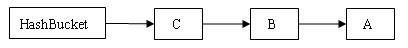
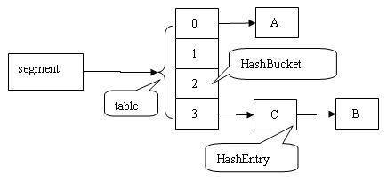
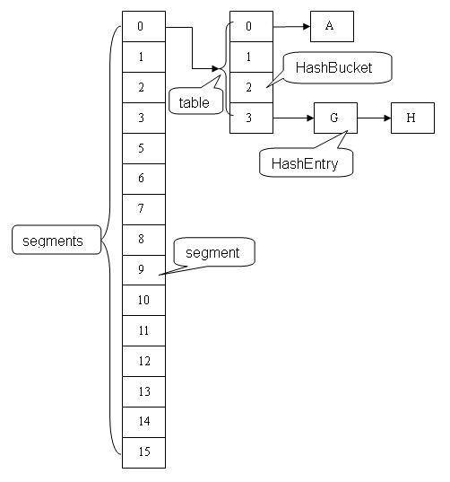
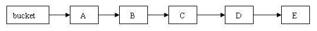
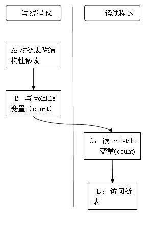

# 探索 ConcurrentHashMap 高并发性的实现机制
合 Java 内存模型，分析 JDK 源代码，探索 ConcurrentHashMap 高并发的具体实现机制

**标签:** Java

[原文链接](https://developer.ibm.com/zh/articles/java-lo-concurrenthashmap/)

程晓明

发布: 2011-05-25

* * *

## 简介

ConcurrentHashMap 是 util.concurrent 包的重要成员。本文将结合 Java 内存模型，分析 JDK 源代码，探索 ConcurrentHashMap 高并发的具体实现机制。

由于 ConcurrentHashMap 的源代码实现依赖于 Java 内存模型，所以阅读本文需要读者了解 Java 内存模型。同时，ConcurrentHashMap 的源代码会涉及到散列算法和链表数据结构，所以，读者需要对散列算法和基于链表的数据结构有所了解。

## Java 内存模型

由于 ConcurrentHashMap 是建立在 Java 内存模型基础上的，为了更好的理解 ConcurrentHashMap，让我们首先来了解一下 Java 的内存模型。

Java 语言的内存模型由一些规则组成，这些规则确定线程对内存的访问如何排序以及何时可以确保它们对线程是可见的。下面我们将分别介绍 Java 内存模型的重排序，内存可见性和 happens-before 关系。

### 重排序

内存模型描述了程序的可能行为。具体的编译器实现可以产生任意它喜欢的代码 — 只要所有执行这些代码产生的结果，能够和内存模型预测的结果保持一致。这为编译器实现者提供了很大的自由，包括操作的重排序。

编译器生成指令的次序，可以不同于源代码所暗示的”显然”版本。重排序后的指令，对于优化执行以及成熟的全局寄存器分配算法的使用，都是大有脾益的，它使得程序在计算性能上有了很大的提升。

重排序类型包括：

- 编译器生成指令的次序，可以不同于源代码所暗示的”显然”版本。
- 处理器可以乱序或者并行的执行指令。
- 缓存会改变写入提交到主内存的变量的次序。

### 内存可见性

由于现代可共享内存的多处理器架构可能导致一个线程无法马上（甚至永远）看到另一个线程操作产生的结果。所以 Java 内存模型规定了 JVM 的一种最小保证：什么时候写入一个变量对其他线程可见。

在现代可共享内存的多处理器体系结构中每个处理器都有自己的缓存，并周期性的与主内存协调一致。假设线程 A 写入一个变量值 V，随后另一个线程 B 读取变量 V 的值，在下列情况下，线程 B 读取的值可能不是线程 A 写入的最新值：

- 执行线程 A 的处理器把变量 V 缓存到寄存器中。
- 执行线程 A 的处理器把变量 V 缓存到自己的缓存中，但还没有同步刷新到主内存中去。
- 执行线程 B 的处理器的缓存中有变量 V 的旧值。

### Happens-before 关系

happens-before 关系保证：如果线程 A 与线程 B 满足 happens-before 关系，则线程 A 执行动作的结果对于线程 B 是可见的。如果两个操作未按 happens-before 排序，JVM 将可以对他们任意重排序。

下面介绍几个与理解 ConcurrentHashMap 有关的 happens-before 关系法则：

1. 程序次序法则：如果在程序中，所有动作 A 出现在动作 B 之前，则线程中的每动作 A 都 happens-before 于该线程中的每一个动作 B。
2. 监视器锁法则：对一个监视器的解锁 happens-before 于每个后续对同一监视器的加锁。
3. Volatile 变量法则：对 Volatile 域的写入操作 happens-before 于每个后续对同一 Volatile 的读操作。
4. 传递性：如果 A happens-before 于 B，且 B happens-before C，则 A happens-before C。

## ConcurrentHashMap 的结构分析

为了更好的理解 ConcurrentHashMap 高并发的具体实现，让我们先探索它的结构模型。

ConcurrentHashMap 类中包含两个静态内部类 HashEntry 和 Segment。HashEntry 用来封装映射表的键 / 值对；Segment 用来充当锁的角色，每个 Segment 对象守护整个散列映射表的若干个桶。每个桶是由若干个 HashEntry 对象链接起来的链表。一个 ConcurrentHashMap 实例中包含由若干个 Segment 对象组成的数组。

### HashEntry 类

HashEntry 用来封装散列映射表中的键值对。在 HashEntry 类中，key，hash 和 next 域都被声明为 final 型，value 域被声明为 volatile 型。

##### 清单 1.HashEntry 类的定义

```
static final class HashEntry<K,V> {
        final K key;                       // 声明 key 为 final 型
        final int hash;                   // 声明 hash 值为 final 型
        volatile V value;                 // 声明 value 为 volatile 型
        final HashEntry<K,V> next;      // 声明 next 为 final 型

        HashEntry(K key, int hash, HashEntry<K,V> next, V value) {
            this.key = key;
            this.hash = hash;
            this.next = next;
            this.value = value;
        }
}

```

Show moreShow more icon

在 ConcurrentHashMap 中，在散列时如果产生”碰撞”，将采用”分离链接法”来处理”碰撞”：把”碰撞”的 HashEntry 对象链接成一个链表。由于 HashEntry 的 next 域为 final 型，所以新节点只能在链表的表头处插入。 下图是在一个空桶中依次插入 A，B，C 三个 HashEntry 对象后的结构图：

##### 图 1\. 插入三个节点后桶的结构示意图：



注意：由于只能在表头插入，所以链表中节点的顺序和插入的顺序相反。

避免热点域

在 `ConcurrentHashMap``中，`每一个 Segment 对象都有一个 count 对象来表示本 Segment 中包含的 HashEntry 对象的个数。这样当需要更新计数器时，不用锁定整个 `ConcurrentHashMap``。`

### Segment 类

Segment 类继承于 ReentrantLock 类，从而使得 Segment 对象能充当锁的角色。每个 Segment 对象用来守护其（成员对象 table 中）包含的若干个桶。

table 是一个由 HashEntry 对象组成的数组。table 数组的每一个数组成员就是散列映射表的一个桶。

count 变量是一个计数器，它表示每个 Segment 对象管理的 table 数组（若干个 HashEntry 组成的链表）包含的 HashEntry 对象的个数。每一个 Segment 对象都有一个 count 对象来表示本 Segment 中包含的 HashEntry 对象的总数。注意，之所以在每个 Segment 对象中包含一个计数器，而不是在 `ConcurrentHashMap 中使用全局的计数器，是为了避免出现"热点域”而影响 ConcurrentHashMap 的并发性。`

##### 清单 2.Segment 类的定义

```
static final class Segment<K,V> extends ReentrantLock implements Serializable {
        /**
         * 在本 segment 范围内，包含的 HashEntry 元素的个数
         * 该变量被声明为 volatile 型
         */
        transient volatile int count;

        /**
         * table 被更新的次数
         */
        transient int modCount;

        /**
         * 当 table 中包含的 HashEntry 元素的个数超过本变量值时，触发 table 的再散列
         */
        transient int threshold;

        /**
         * table 是由 HashEntry 对象组成的数组
         * 如果散列时发生碰撞，碰撞的 HashEntry 对象就以链表的形式链接成一个链表
         * table 数组的数组成员代表散列映射表的一个桶
         * 每个 table 守护整个 ConcurrentHashMap 包含桶总数的一部分
         * 如果并发级别为 16，table 则守护 ConcurrentHashMap 包含的桶总数的 1/16
         */
        transient volatile HashEntry<K,V>[] table;

        /**
         * 装载因子
         */
        final float loadFactor;

        Segment(int initialCapacity, float lf) {
            loadFactor = lf;
            setTable(HashEntry.<K,V>newArray(initialCapacity));
        }

        /**
         * 设置 table 引用到这个新生成的 HashEntry 数组
         * 只能在持有锁或构造函数中调用本方法
         */
        void setTable(HashEntry<K,V>[] newTable) {
            // 计算临界阀值为新数组的长度与装载因子的乘积
            threshold = (int)(newTable.length * loadFactor);
            table = newTable;
        }

        /**
         * 根据 key 的散列值，找到 table 中对应的那个桶（table 数组的某个数组成员）
         */
        HashEntry<K,V> getFirst(int hash) {
            HashEntry<K,V>[] tab = table;
            // 把散列值与 table 数组长度减 1 的值相"与”，
// 得到散列值对应的 table 数组的下标
            // 然后返回 table 数组中此下标对应的 HashEntry 元素
            return tab[hash & (tab.length - 1)];
        }
}

```

Show moreShow more icon

下图是依次插入 ABC 三个 HashEntry 节点后，Segment 的结构示意图。

##### 图 2\. 插入三个节点后 Segment 的结构示意图：



### ConcurrentHashMap 类

ConcurrentHashMap 在默认并发级别会创建包含 16 个 Segment 对象的数组。每个 Segment 的成员对象 table 包含若干个散列表的桶。每个桶是由 HashEntry 链接起来的一个链表。如果键能均匀散列，每个 Segment 大约守护整个散列表中桶总数的 1/16。

##### 清单 3.ConcurrentHashMap 类的定义

```
public class ConcurrentHashMap<K, V> extends AbstractMap<K, V>
        implements ConcurrentMap<K, V>, Serializable {

    /**
     * 散列映射表的默认初始容量为 16，即初始默认为 16 个桶
     * 在构造函数中没有指定这个参数时，使用本参数
     */
    static final      int DEFAULT_INITIAL_CAPACITY= 16;

    /**
     * 散列映射表的默认装载因子为 0.75，该值是 table 中包含的 HashEntry 元素的个数与
* table 数组长度的比值
     * 当 table 中包含的 HashEntry 元素的个数超过了 table 数组的长度与装载因子的乘积时，
* 将触发 再散列
     * 在构造函数中没有指定这个参数时，使用本参数
     */
    static final float DEFAULT_LOAD_FACTOR= 0.75f;

    /**
     * 散列表的默认并发级别为 16。该值表示当前更新线程的估计数
     * 在构造函数中没有指定这个参数时，使用本参数
     */
    static final int DEFAULT_CONCURRENCY_LEVEL= 16;

    /**
     * segments 的掩码值
     * key 的散列码的高位用来选择具体的 segment
     */
    final int segmentMask;

    /**
     * 偏移量
     */
    final int segmentShift;

    /**
     * 由 Segment 对象组成的数组
     */
    final Segment<K,V>[] segments;

    /**
     * 创建一个带有指定初始容量、加载因子和并发级别的新的空映射。
     */
    public ConcurrentHashMap(int initialCapacity,
                             float loadFactor, int concurrencyLevel) {
        if(!(loadFactor > 0) || initialCapacity < 0 ||
concurrencyLevel <= 0)
            throw new IllegalArgumentException();

        if(concurrencyLevel > MAX_SEGMENTS)
            concurrencyLevel = MAX_SEGMENTS;

        // 寻找最佳匹配参数（不小于给定参数的最接近的 2 次幂）
        int sshift = 0;
        int ssize = 1;
        while(ssize < concurrencyLevel) {
            ++sshift;
            ssize <<= 1;
        }
        segmentShift = 32 - sshift;       // 偏移量值
        segmentMask = ssize - 1;           // 掩码值
        this.segments = Segment.newArray(ssize);   // 创建数组

        if (initialCapacity > MAXIMUM_CAPACITY)
            initialCapacity = MAXIMUM_CAPACITY;
        int c = initialCapacity / ssize;
        if(c * ssize < initialCapacity)
            ++c;
        int cap = 1;
        while(cap < c)
            cap <<= 1;

        // 依次遍历每个数组元素
        for(int i = 0; i < this.segments.length; ++i)
            // 初始化每个数组元素引用的 Segment 对象
this.segments[i] = new Segment<K,V>(cap, loadFactor);
    }

    /**
     * 创建一个带有默认初始容量 (16)、默认加载因子 (0.75) 和 默认并发级别 (16)
* 的空散列映射表。
     */
    public ConcurrentHashMap() {
        // 使用三个默认参数，调用上面重载的构造函数来创建空散列映射表
this(DEFAULT_INITIAL_CAPACITY, DEFAULT_LOAD_FACTOR, DEFAULT_CONCURRENCY_LEVEL);
}

```

Show moreShow more icon

}

下面是 ConcurrentHashMap 的结构示意图。

##### 图 3.ConcurrentHashMap 的结构示意图：



## 用分离锁实现多个线程间的并发写操作

在 ConcurrentHashMap 中，线程对映射表做读操作时， _一般情况下_ 不需要加锁就可以完成，对容器做结构性修改的操作才需要加锁。下面以 put 操作为例说明对 ConcurrentHashMap 做结构性修改的过程。

首先，根据 key 计算出对应的 hash 值：

##### 清单 4.Put 方法的实现

```
public V put(K key, V value) {
        if (value == null)          //ConcurrentHashMap 中不允许用 null 作为映射值
            throw new NullPointerException();
        int hash = hash(key.hashCode());        // 计算键对应的散列码
        // 根据散列码找到对应的 Segment
        return segmentFor(hash).put(key, hash, value, false);
}

```

Show moreShow more icon

`然后，根据 hash 值找到对应的` Segment 对象：

##### 清单 5.根据 hash 值找到对应的 Segment

```
/**
     * 使用 key 的散列码来得到 segments 数组中对应的 Segment
     */
final Segment<K,V> segmentFor(int hash) {
    // 将散列值右移 segmentShift 个位，并在高位填充 0
    // 然后把得到的值与 segmentMask 相"与”
// 从而得到 hash 值对应的 segments 数组的下标值
// 最后根据下标值返回散列码对应的 Segment 对象
        return segments[(hash >>> segmentShift) & segmentMask];
}

```

Show moreShow more icon

最后，在这个 Segment 中执行具体的 put 操作：

##### 清单 6.在 Segment 中执行具体的 put 操作

```
V put(K key, int hash, V value, boolean onlyIfAbsent) {
            lock();  // 加锁，这里是锁定某个 Segment 对象而非整个 ConcurrentHashMap
            try {
                int c = count;

                if (c++ > threshold)     // 如果超过再散列的阈值
                    rehash();              // 执行再散列，table 数组的长度将扩充一倍

                HashEntry<K,V>[] tab = table;
                // 把散列码值与 table 数组的长度减 1 的值相"与”
                // 得到该散列码对应的 table 数组的下标值
                int index = hash & (tab.length - 1);
                // 找到散列码对应的具体的那个桶
                HashEntry<K,V> first = tab[index];

                HashEntry<K,V> e = first;
                while (e != null && (e.hash != hash || !key.equals(e.key)))
                    e = e.next;

                V oldValue;
                if (e != null) {            // 如果键 / 值对以经存在
                    oldValue = e.value;
                    if (!onlyIfAbsent)
                        e.value = value;    // 设置 value 值
                }
                else {                        // 键 / 值对不存在
                    oldValue = null;
                    ++modCount;         // 要添加新节点到链表中，所以 modCont 要加 1
                    // 创建新节点，并添加到链表的头部
                    tab[index] = new HashEntry<K,V>(key, hash, first, value);
                    count = c;               // 写 count 变量
                }
                return oldValue;
            } finally {
                unlock();                     // 解锁
            }
        }

```

Show moreShow more icon

注意：这里的加锁操作是针对（键的 hash 值对应的）某个具体的 Segment，锁定的是该 Segment 而不是整个 ConcurrentHashMap `。因为插入键 / 值对操作只是在这个 Segment 包含的某个桶中完成，不需要锁定整个` ConcurrentHashMap。 `此时，其他写线程对另外 15 个` Segment 的加锁并不会因为当前线程对这个 Segment 的加锁而阻塞。同时，所有读线程几乎不会因本线程的加锁而阻塞（除非读线程刚好读到这个 Segment 中某个 `HashEntry 的 value 域的值为 null，此时需要加锁后重新读取该值` ）。

相比较于 `HashTable 和由同步包装器包装的 HashMap 每次只能有一个线程执行读或写操作，` ConcurrentHashMap 在并发访问性能上有了质的提高。 _在理想状态下_ ，ConcurrentHashMap 可以支持 16 个线程执行并发写操作（如果并发级别设置为 16），及任意数量线程的读操作。

## 用 HashEntery 对象的不变性来降低读操作对加锁的需求

在代码清单”HashEntry 类的定义”中我们可以看到，HashEntry 中的 key，hash，next 都声明为 final 型。这意味着，不能把节点添加到链接的中间和尾部，也不能在链接的中间和尾部删除节点。这个特性可以保证：在访问某个节点时，这个节点之后的链接不会被改变。这个特性可以大大降低处理链表时的复杂性。

同时，HashEntry 类的 value 域被声明为 Volatile 型，Java 的内存模型可以保证：某个写线程对 value 域的写入马上可以被后续的某个读线程”看”到。在 ConcurrentHashMap 中，不允许用 unll 作为键和值，当读线程读到某个 HashEntry 的 value 域的值为 null 时，便知道产生了冲突——发生了重排序现象，需要加锁后重新读入这个 value 值。这些特性互相配合，使得读线程即使在不加锁状态下，也能正确访问 ConcurrentHashMap。

下面我们分别来分析线程写入的两种情形：对散列表做非结构性修改的操作和对散列表做结构性修改的操作。

非结构性修改操作只是更改某个 HashEntry 的 value 域的值。由于对 Volatile 变量的写入操作将与随后对这个变量的读操作进行同步。当一个写线程修改了某个 HashEntry 的 value 域后，另一个读线程读这个值域，Java 内存模型能够保证读线程读取的一定是更新后的值。所以，写线程对链表的非结构性修改能够被后续不加锁的读线程”看到”。

对 ConcurrentHashMap 做结构性修改，实质上是对某个桶指向的链表做结构性修改。如果能够确保：在读线程遍历一个链表期间，写线程对这个链表所做的结构性修改不影响读线程继续正常遍历这个链表。那么读 / 写线程之间就可以安全并发访问这个 ConcurrentHashMap。

结构性修改操作包括 put，remove，clear。下面我们分别分析这三个操作。

clear 操作只是把 ConcurrentHashMap 中所有的桶”置空”，每个桶之前引用的链表依然存在，只是桶不再引用到这些链表（所有链表的结构并没有被修改）。正在遍历某个链表的读线程依然可以正常执行对该链表的遍历。

从上面的代码清单”在 Segment 中执行具体的 put 操作”中，我们可以看出：put 操作如果需要插入一个新节点到链表中时 , 会在链表头部插入这个新节点。此时，链表中的原有节点的链接并没有被修改。也就是说：插入新健 / 值对到链表中的操作不会影响读线程正常遍历这个链表。

下面来分析 remove 操作，先让我们来看看 remove 操作的源代码实现。

##### 清单 7.remove 操作

```
V remove(Object key, int hash, Object value) {
            lock();         // 加锁
            try{
                int c = count - 1;
                HashEntry<K,V>[] tab = table;
                // 根据散列码找到 table 的下标值
                int index = hash & (tab.length - 1);
                // 找到散列码对应的那个桶
                HashEntry<K,V> first = tab[index];
                HashEntry<K,V> e = first;
                while(e != null&& (e.hash != hash || !key.equals(e.key)))
                    e = e.next;

                V oldValue = null;
                if(e != null) {
                    V v = e.value;
                    if(value == null|| value.equals(v)) { // 找到要删除的节点
                        oldValue = v;
                        ++modCount;
                        // 所有处于待删除节点之后的节点原样保留在链表中
                        // 所有处于待删除节点之前的节点被克隆到新链表中
                        HashEntry<K,V> newFirst = e.next;// 待删节点的后继结点
                        for(HashEntry<K,V> p = first; p != e; p = p.next)
                            newFirst = new HashEntry<K,V>(p.key, p.hash,
                                                          newFirst, p.value);
                        // 把桶链接到新的头结点
                        // 新的头结点是原链表中，删除节点之前的那个节点
                        tab[index] = newFirst;
                        count = c;      // 写 count 变量
                    }
                }
                return oldValue;
            } finally{
                unlock();               // 解锁
            }
        }

```

Show moreShow more icon

`和 get 操作一样，首先根据散列码找到具体的链表；然后遍历这个链表找到要删除的节点；最后把待删除节点之后的所有节点原样保留在新链表中，把待删除节点之前的每个节点克隆到新链表中。下面通过图例来说明 remove 操作。` 假设写线程执行 remove 操作，要删除链表的 C 节点，另一个读线程同时正在遍历这个链表。

##### 图 4\. 执行删除之前的原链表：



##### 图 5\. 执行删除之后的新链表


从上图可以看出，删除节点 C 之后的所有节点原样保留到新链表中；删除节点 C 之前的每个节点被克隆到新链表中， _注意：它们在新链表中的链接顺序被反转了_ 。

在执行 remove 操作时，原始链表并没有被修改，也就是说：读线程不会受同时执行 remove 操作的并发写线程的干扰。

综合上面的分析我们可以看出，写线程对某个链表的结构性修改不会影响其他的并发读线程对这个链表的遍历访问。

## 用 Volatile 变量协调读写线程间的内存可见性

由于内存可见性问题，未正确同步的情况下，写线程写入的值可能并不为后续的读线程可见。

下面以写线程 M 和读线程 N 来说明 ConcurrentHashMap 如何协调读 / 写线程间的内存可见性问题。

##### 图 6\. 协调读 – 写线程间的内存可见性的示意图：



假设线程 M 在写入了 volatile 型变量 count 后，线程 N 读取了这个 volatile 型变量 count。

根据 happens-before 关系法则中的程序次序法则，A appens-before 于 B，C happens-before D。

根据 Volatile 变量法则，B happens-before C。

根据传递性，连接上面三个 happens-before 关系得到：A appens-before 于 B； B appens-before C；C happens-before D。也就是说：写线程 M 对链表做的结构性修改，在读线程 N 读取了同一个 volatile 变量后，对线程 N 也是可见的了。

虽然线程 N 是在未加锁的情况下访问链表。Java 的内存模型可以保证：只要之前对链表做结构性修改操作的写线程 M 在退出写方法前写 volatile 型变量 count，读线程 N 在读取这个 volatile 型变量 count 后，就一定能”看到”这些修改。

ConcurrentHashMap 中，每个 Segment 都有一个变量 count。它用来统计 Segment 中的 HashEntry 的个数。这个变量被声明为 volatile。

##### 清单 8.Count 变量的声明

```
transient volatile int count;

```

Show moreShow more icon

所有不加锁读方法，在进入读方法时，首先都会去读这个 count 变量。比如下面的 get 方法：

##### 清单 9.get 操作

```
V get(Object key, int hash) {
            if(count != 0) {       // 首先读 count 变量
                HashEntry<K,V> e = getFirst(hash);
                while(e != null) {
                    if(e.hash == hash && key.equals(e.key)) {
                        V v = e.value;
                        if(v != null)
                            return v;
                        // 如果读到 value 域为 null，说明发生了重排序，加锁后重新读取
                        return readValueUnderLock(e);
                    }
                    e = e.next;
                }
            }
            return null;
        }

```

Show moreShow more icon

在 ConcurrentHashMap 中，所有执行写操作的方法（put, remove, clear），在对链表做结构性修改之后，在退出写方法前都会去写这个 count 变量。所有未加锁的读操作（get, contains, containsKey）在读方法中，都会首先去读取这个 count 变量。

根据 Java 内存模型，对 同一个 volatile 变量的写 / 读操作可以确保：写线程写入的值，能够被之后未加锁的读线程”看到”。

这个特性和前面介绍的 HashEntry 对象的不变性相结合，使得在 ConcurrentHashMap 中，读线程在读取散列表时，基本不需要加锁就能成功获得需要的值。这两个特性相配合，不仅减少了请求同一个锁的频率（读操作一般不需要加锁就能够成功获得值），也减少了持有同一个锁的时间（只有读到 value 域的值为 null 时 , 读线程才需要加锁后重读）。

## ConcurrentHashMap 实现高并发的总结

### 基于通常情形而优化

在实际的应用中，散列表一般的应用场景是：除了少数插入操作和删除操作外，绝大多数都是读取操作，而且读操作在大多数时候都是成功的。正是基于这个前提，ConcurrentHashMap 针对读操作做了大量的优化。通过 HashEntry 对象的不变性和用 volatile 型变量协调线程间的内存可见性，使得 大多数时候，读操作不需要加锁就可以正确获得值。这个特性使得 ConcurrentHashMap 的并发性能在分离锁的基础上又有了近一步的提高。

### 结束语

ConcurrentHashMap 是一个并发散列映射表的实现，它允许完全并发的读取，并且支持给定数量的并发更新。相比于 `HashTable 和` 用同步包装器包装的 HashMap（Collections.synchronizedMap(new HashMap())），ConcurrentHashMap 拥有更高的并发性。在 `HashTable 和由同步包装器包装的 HashMap 中，使用一个全局的锁来同步不同线程间的并发访问。同一时间点，只能有一个线程持有锁，也就是说在同一时间点，只能有一个线程能访问容器。这虽然保证多线程间的安全并发访问，但同时也导致对容器的访问变成 _串行化_ 的了。`

在使用锁来协调多线程间并发访问的模式下，减小对锁的竞争可以有效提高并发性。有两种方式可以减小对锁的竞争：

1. 减小请求 同一个锁的 频率。
2. 减少持有锁的 时间。

ConcurrentHashMap 的高并发性主要来自于三个方面：

1. 用分离锁实现多个线程间的更深层次的共享访问。
2. 用 HashEntery 对象的不变性来降低执行读操作的线程在遍历链表期间对加锁的需求。
3. 通过对同一个 Volatile 变量的写 / 读访问，协调不同线程间读 / 写操作的内存可见性。

使用分离锁，减小了请求 _同一个锁_ 的频率。

通过 HashEntery 对象的不变性及对同一个 Volatile 变量的读 / 写来协调内存可见性，使得 读操作大多数时候不需要加锁就能成功获取到需要的值。由于散列映射表在实际应用中大多数操作都是成功的 读操作，所以 2 和 3 既可以减少请求同一个锁的频率，也可以有效减少持有锁的时间。

通过减小请求同一个锁的频率和尽量减少持有锁的时间，使得 `ConcurrentHashMap` 的并发性相对于 HashTable 和用同步包装器包装的 `HashMap` 有了质的提高。