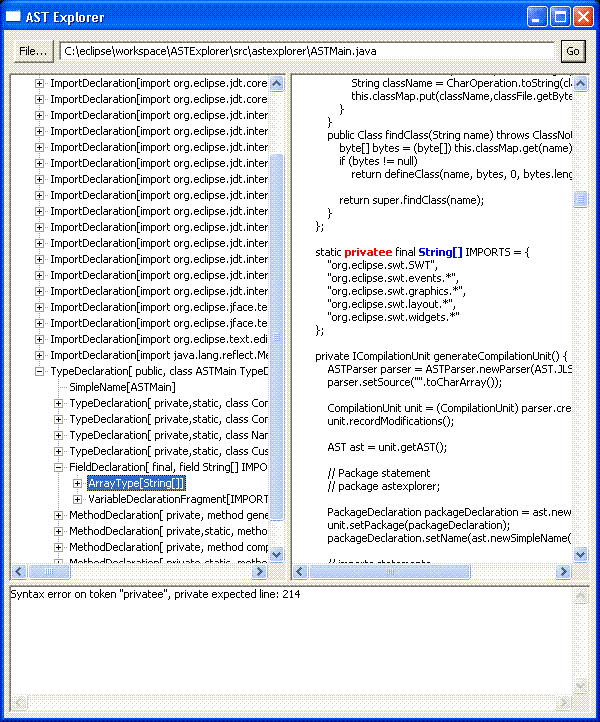

# 探索 Eclipse 的 ASTParser
如何使用这种解析器生成代码

**标签:** Java

[原文链接](https://developer.ibm.com/zh/articles/os-ast/)

Manoel Marques

发布: 2005-04-28

* * *

## Eclipse JDT 能提供什么帮助

Eclipse JDT 提供了操纵 Java 源代码、检测错误、执行编译和启动程序的的 API。本文将说明如何使用 ASTParser 从头创建一个 Java 类，同时介绍如何使用 JDT 服务编译生成的代码。

Eclipse JDT 有自己的文档对象模型（DOM），其思想和众所周知的 XML DOM 是一致的：抽象的语法树（AST）。

Eclipse V3.0.2 支持 Java Language Specification, Second Edition (JLS2)，能够正确解析用各种 Java 语言版本（最高到 J2SE 1.4）编写的程序。对 JLS3 的支持正在进行之中，在下一个重要的 Eclipse 版本中，就能够解析用新的 J2SE 1.5 结构编写的程序。

## 完全免费的代码

本文提供了两个示例应用程序，这两个示例都包含在一个称为 ASTExplorer 的 Eclipse 项目中：

- ASTMain
- ASTExplorer

ASTMain 生成一个 Java 类，然后编译这个类并运行其 `main()` 方法。该方法将使用按钮创建一个 SWT Shell 物件。

ASTExplorer 解析给定的 Java 类，显示其 AST 层次结构。它有三个面板：一个包含 AST Tree 视图显示 AST 层次结构，一个显示源代码，还有一个显示解析器错误。

图 1 显示了执行中的 ASTExplorer 界面。注意，如果选择一个节点，源代码中对应的位置将使用蓝色突出显示。解析错误用红色突出显示。

##### 图 1\. 运行中的 ASTExplorer



这些例子是在 Eclipse V3.0.1 及 V3.0.2、Windows® XP Professional SP2、Sun J2SDK 1.4.2.05 环境中经过测试的。文中的项目类路径是用于 Eclipse V3.0.2 的。如果需要在 Eclipse V3.0.1 下运行，只需要修改类路径指向正确的插件即可。

建议在阅读后面的内容之前先下载示例应用程序。这里的关键词是 **探索** ，阅读本文的同时运行给出的例子有助于提高学习的效率。

## ASTParser 和 ASTNodes

AST 层次结构的最上层是 ASTNode。每个 Java 结构都用它来表示。多数节点的名称意义都很明确，如 Comment、CastExpression 等。可以使用 AST 类的方法（比如 `newBlock()` 、 `newBreakStatement()` 等）来创建节点。Java 类用 Compilation Unit（编译单元）节点表示。清单 1 展示了如何创建编译单元。

##### 清单 1\. 创建编译单元

```
ASTParser parser = ASTParser.newParser(AST.JLS2);
parser.setSource("".toCharArray());
CompilationUnit unit = (CompilationUnit) parser.createAST(null);
unit.recordModifications();
AST ast = unit.getAST();

```

Show moreShow more icon

要注意 ASTParser 对 JLS2 的配置，然后使用空数组初始化解析器。如果不这样做，就会在访问编译单元时遇到异常。

解析已有代码也需要同样的步骤。该例中要解析的是 org.eclipse.core.runtime 的一个实例。 `createAST()` 方法的 IProgressMonitor 可以在长时间的解析中提供反馈信息，后面将示范它的用法。

调用 `recordModifications()` 将启动对节点修改的监控。调用这个方法很重要，因为这样可以在以后通过检索节点的修改来访问源代码。

最后，从编译单元中访问 AST 的所有者，并在后续的节点创建中使用它。AST 树中的所有节点都属于同一个所有者。任何不是该所有者创建的节点都要先通过导入才能加入到树中。现在就可以开始创建 Java 类了，清单 2 展示了如何创建一个包。

##### 清单 2\. 创建 Package

```
PackageDeclaration packageDeclaration = ast.newPackageDeclaration();
unit.setPackage(packageDeclaration);
packageDeclaration.setName(ast.newSimpleName("astexplorer"));

```

Show moreShow more icon

有几个节点方法要使用 Name 节点。Name 节点可以是 SimpleName 或者 QualifiedName，后者是一组 SimpleNames。QualifiedName 的外部表示是（比方说） **org.eclipse.swt.widgets** 。因此，实质上只要您使用点（dot），您就是在使用 QualifiedName。ast.newName() 方法接收一个字符串数组来创建 Name 节点。在代码示例中，我提供了一各方便的方法来解析带点（dot）的字符串，并创建字符串数组。

有 6 种主要的节点组：BodyDeclaration、Comment、Expression、Statement、Type 和 VariableDeclaration。BodyDeclarations 可以是类中的任何声明。比如，声明 `private Point minimumSize;` 的创建代码如下所示：

##### 清单 3\. 创建 VariableDeclaration

```
VariableDeclarationFragment vdf = ast.newVariableDeclarationFragment();
vdf.setName(ast.newSimpleName("minimumSize"));
FieldDeclaration fd = ast.newFieldDeclaration(vdf);
fd.setModifiers(Modifier.PRIVATE);
fd.setType(ast.newSimpleType(ast.newSimpleName("Point")));

```

Show moreShow more icon

要注意如何从 VariableDeclarationFragment 创建 FieldDeclaration。AST 编程就是组合不同的节点。您不需要使用像 XML DOM 中的 `appendChild()` 或 `insertBefore()` 这样的方法。相反，不同的节点类型有不同的创建和初始化方法。

刚刚看到的是一种 VariableDeclaration 类型的例子，即 VariableDeclarationFragment。还有一种类型 SingleVariableDeclaration，它主要用于参数列表。比如，清单 4 说明了如何在 `ControlAdapterImpl(Point size)` 中创建参数 `size` 。

##### 清单 4\. 创建方法参数

```
SingleVariableDeclaration variableDeclaration = ast.newSingleVariableDeclaration();
variableDeclaration.setModifiers(Modifier.NONE);
variableDeclaration.setType(ast.newSimpleType(ast.newSimpleName("Point")));
variableDeclaration.setName(ast.newSimpleName("size"));
methodConstructor.parameters().add(variableDeclaration);

```

Show moreShow more icon

有三种类型的注释节点：BlockComment、Javadoc 和 LineComment。

AST Tree 仅支持 Javadoc 节点的创建和插入，它认为 BlockComment 和 LineComment 节点的具体定位存在问题，因此只在解析已有代码时才会看到这类节点。清单 5 显示了如何创建 Javadoc 节点。

##### 清单 5\. 创建 Javadoc 节点

```
Javadoc jc = ast.newJavadoc();
TagElement tag = ast.newTagElement();
TextElement te = ast.newTextElement();
tag.fragments().add(te);
te.setText("Sample SWT Composite class created using the ASTParser");
jc.tags().add(tag);
tag = ast.newTagElement();
tag.setTagName(TagElement.TAG_AUTHOR);
tag.fragments().add(ast.newSimpleName("Manoel Marques"));
jc.tags().add(tag);
classType.setJavadoc(jc);

```

Show moreShow more icon

Expression 和 Statement 节点是最常用的节点类型。示例代码中包含创建表达式和语句节点的多个例子。可以使用 `GridLayout gridLayout = new GridLayout()` 创建一个简单的语句：

##### 清单 6\. 创建语句

```
VariableDeclarationFragment vdf = ast.newVariableDeclarationFragment();
vdf.setName(ast.newSimpleName("gridLayout"));
VariableDeclarationStatement vds = ast.newVariableDeclarationStatement(vdf);
vds.setType(ast.newSimpleType(ast.newSimpleName("GridLayout")));
ClassInstanceCreation cc = ast.newClassInstanceCreation();
cc.setName(ast.newSimpleName("GridLayout"));
vdf.setInitializer(cc);
constructorBlock.statements().add(vds);

```

Show moreShow more icon

要注意节点的组合，整个语句是一个 GridLayout 类型的 VariableDeclarationStatement。它包含一个 VariableDeclarationFragment，后者包含 ClassInstanceCreation。

使用 Assignment 表达式也可以创建同样的语句，如清单 7 所示。

##### 清单 7\. 创建同一语句的另一种方法

```
Assignment a = ast.newAssignment();
a.setOperator(Assignment.Operator.ASSIGN);

VariableDeclarationFragment vdf = ast.newVariableDeclarationFragment();
vdf.setName(ast.newSimpleName("gridLayout"));
VariableDeclarationExpression vde = ast.newVariableDeclarationExpression(vdf);
vde.setType(ast.newSimpleType(ast.newSimpleName("GridLayout")));
a.setLeftHandSide(vde);

ClassInstanceCreation cc = ast.newClassInstanceCreation();
cc.setName(ast.newSimpleName("GridLayout"));
a.setRightHandSide(cc);
constructorBlock.statements().add(ast.newExpressionStatement(a));

```

Show moreShow more icon

可以将其看作一个 Assignment 表达式，左侧是包含 VariableDeclarationFragment 的 VariableDeclarationExpression，右侧是一个 ClassInstanceCreation。要注意，在添加到语句列表之前，Assignment 表达式首先要通过 `newExpressionStatement()` 方法使用 Statement 包装起来。

两种方法都生成同样的源代码，但是应该使用第一种方法。如果解析已有的代码，就会看到节点是按照第一种方法创建的。这也是为何强调使用 ASTExplorer 这个例子的原因。这样您可以看到解析器为特定代码片段创建的节点，从而按照同样的方式创建自己的节点。

仔细看一看 ASTMain 类，就可以了解在几种情况下如何创建不同的节点。我尽量包含所有所需技巧的结构，比如内部类、try 块、数组参数，等等。我将介绍我曾经遇到问题，同时还将介绍您可能需要帮助的地方。

### 获得实际的源代码

有了编译单元之后，就可以很轻松地获得实际的源代码。

调用 `recordModifications()` 可以完成一半的工作，剩下的工作可以在编译单元中调用 `rewrite()` 方法来完成。该方法需要一个 org.eclipse.jface.text.IDocument 实例和格式化选项 Map。IDocument 实例包含原来的源代码 —— 该例中没有这样的源代码， `rewrite()` 方法将合并编译单元中的修改和文档文本，返回包含所有更改内容的 org.eclipse.jface.text.edits.TextEdit 实例。

通过格式化选项可以规定括号和缩进的位置等。在 org.eclipse.jdt.core.formatter.DefaultCodeFormatterConstants 类中可以找到所有的选项列表。

获得 TextEdit 实例之后，可以用它来查看作了哪些更改。不过在该例中，仅仅将这些更改用于原来的文档。

现在，所有的代码都放在了将准备提取的文档中，这个过程如清单 8 所示。

##### 清单 8\. 访问编译单元的内容

```
public char[] getContents() {
char[] contents = null;
try {
      Document doc = new Document();
      TextEdit edits = unit.rewrite(doc,null);
      edits.apply(doc);
      String sourceCode = doc.get();
      if (sourceCode != null)
         contents = sourceCode.toCharArray();
}
catch (BadLocationException e) {
      throw new RuntimeException(e);
}
return contents;
}

```

Show moreShow more icon

## 编译生成的代码

Eclipse IDE 在工作区中处理项目。构建整个项目后，要依靠 JDT 检查依赖性和编译所有的类。Eclipse 帮助中有详细的说明，可以将这些归结如下：

##### 清单 9\. 构建 Eclipse 项目

```
IProject myProject;
IProgressMonitor myProgressMonitor;
myProject.build(IncrementalProjectBuilder.INCREMENTAL_BUILD, myProgressMonitor);

```

Show moreShow more icon

对此我不再赘述，因为 Eclipse 帮助中已介绍得很清楚。JDT 还提供了另一种方法，这种方法更适合于我们的目的，即借助于 org.eclipse.jdt.internal.compiler.Compiler 类。这种方法实际上很简单：先创建一个编译器对象，然后对它调用 `compile()` 方法。

##### 清单 10\. 编译一个编译单元

```
Compiler compiler = new Compiler(new NameEnvironmentImpl(unit),
                     DefaultErrorHandlingPolicies.proceedWithAllProblems(),
                     settings,requestor,new DefaultProblemFactory(Locale.getDefault()));
compiler.compile(new ICompilationUnit[] { unit });

```

Show moreShow more icon

首先说明构造函数的参数，其中包括：

- **org.eclipse.jdt.internal.compiler.env.INameEnvironment**: 连接编译器和外部环境。简而言之，它表示的是类路径。编译器使用该参数来获得可能遇到类型的信息。
- **org.eclipse.jdt.internal.compiler.IErrorHandlingPolicy**: 告诉编译器遇到错误时如何处理。我倾向于在停止之前让编译器接受尽可能多的处理，因此使用了预定义的 `DefaultErrorHandlingPolicies.proceedWithAllProblems()` 实例。
- **Map Settings**: 可以在 org.eclipse.jdt.internal.compiler.impl.CompilerOptions 中找到的编译器设置。通过它可以规定是否需要生成行编号，是否忽略方法警告，等等。
- **org.eclipse.jdt.internal.compiler.ICompilerRequestor**: 接收编译结果和编译过程中遇到的任何错误。
- **org.eclipse.jdt.internal.compiler.IProblemFactory**: 负责创建 org.eclipse.jdt.core.compiler.IProblem 实例的工厂。如果支持特殊类型的错误处理或者不同语言版本的错误消息，那么实现该工厂非常有用。该例中使用了标准实现 `DefaultProblemFactory(Locale.getDefault())` 。

最后，在编译的时候，还需要一个 org.eclipse.jdt.internal.compiler.env.ICompilationUnit 数组。不要将该接口和 org.eclipse.jdt.core.ICompilationUnit 混淆。不幸的是，它们的名称相同，但后者一般只在您的类属于 Eclipse Java 项目时才有用。

实现 org.eclipse.jdt.internal.compiler.env.ICompilationUnit 很容易，它对应于已经创建的 CompilationUnit 节点。清单 11 给出了一种实现方法。

##### 清单 11\. ICompilationUnit 实现

```
static private class CompilationUnitImpl implements ICompilationUnit {
private CompilationUnit unit;
CompilationUnitImpl(CompilationUnit unit) {
      this.unit = unit;
}
public char[] getContents() {
      char[] contents = null;
      try {
         Document doc = new Document();
         TextEdit edits = unit.rewrite(doc,null);
         edits.apply(doc);
         String sourceCode = doc.get();
         if (sourceCode != null)
            contents = sourceCode.toCharArray();
      }
      catch (BadLocationException e) {
         throw new RuntimeException(e);
      }
      return contents;
}
public char[] getMainTypeName() {
      TypeDeclaration classType = (TypeDeclaration) unit.types().get(0);
      return classType.getName().getFullyQualifiedName().toCharArray();
}
public char[][] getPackageName() {
      String[] names =
        getSimpleNames(this.unit.getPackage().getName().getFullyQualifiedName());
      char[][] packages = new char[names.length][];
      for (int i=0;i < names.length; ++i)
         packages[i] = names[i].toCharArray();
      return packages;
}
public char[] getFileName() {
      TypeDeclaration classType = (TypeDeclaration) unit.types().get(0);
      String name = classType.getName().getFullyQualifiedName() + ".java";
      return name.toCharArray();
}
}

```

Show moreShow more icon

### 检查编译错误

完成编译后，要做的第一件事就是从 ICompilerRequestor 实现中找出各种可能的错误，其中包括警告或致命错误。下面是一个例子：

##### 清单 12\. 处理编译错误

```
List problems = requestor.getProblems();
boolean error = false;
for (Iterator it = problems.iterator(); it.hasNext();) {
IProblem problem = (IProblem)it.next();
StringBuffer buffer = new StringBuffer();
buffer.append(problem.getMessage());
buffer.append(" line: ");
buffer.append(problem.getSourceLineNumber());
String msg = buffer.toString();
if(problem.isError()) {
      error = true;
      msg = "Error:\n" + msg;
}
else
      if(problem.isWarning())
         msg = "Warning:\n" + msg;
System.out.println(msg);
}

```

Show moreShow more icon

### 运行编译后的应用程序

如果一切正常，那么就可以实例化这个类并运行其 main 方法了。对 ICompilerRequestor 实现返回的字节码使用反射很容易做到。

##### 清单 13\. 运行编译后的应用程序

```
try {
ClassLoader loader = new CustomClassLoader(getClass().getClassLoader(),
requestor.getResults());
String className = CharOperation.toString(unit.getPackageName()) + "." +
new String(unit.getMainTypeName());
Class clazz = loader.loadClass(className);
Method m = clazz.getMethod("main",new Class[] {String[].class});
m.invoke(clazz,new Object[] { new String[0] });
}
catch (Exception e) {
e.printStackTrace();
}

```

Show moreShow more icon

注意我是如何使用自定义的类加载器访问这个类的，该加载器按照请求加载编译后的字节码。清单 14 给出了一个例子。

##### 清单 14\. 自定义的类加载器

```
static private class CustomClassLoader extends ClassLoader {
    private Map classMap;
    CustomClassLoader(ClassLoader parent,List classesList) {
       this.classMap = new HashMap();
       for (int i = 0; i < classesList.size(); i++) {
          ClassFile classFile = (ClassFile)classesList.get(i);
          String className = CharOperation.toString(classFile.getCompoundName());
          this.classMap.put(className,classFile.getBytes());
       }
    }
    public Class findClass(String name) throws ClassNotFoundException {
       byte[] bytes = (byte[]) this.classMap.get(name);
       if (bytes != null)
          return defineClass(name, bytes, 0, bytes.length);
       return super.findClass(name);
    }
}

```

Show moreShow more icon

这是一个非常简单的编译器。INameEnvironment 实现非常简单，并假设所有的类依赖性都已经在当前的类加载器中加载了。真正的实现可能需要其他自定义类加载器，该加载器将搜索为编译提供的某些类路径。

此外可能还需要缓冲某些信息，特别是从 ICompilationUnit 实现返回的信息。比方说，获得源代码的过程非常耗时，所以应该进行缓冲。

## 解析已有的代码

我们看一看解析的必要步骤，如清单 15 所示。

##### 清单 15\. 解析 Java 类

```
ASTParser parser = ASTParser.newParser(AST.JLS2);
parser.setKind(ASTParser.K_COMPILATION_UNIT);
parser.setSource(sourceString.toCharArray());
CompilationUnit node = (CompilationUnit) parser.createAST(null);

```

Show moreShow more icon

我知道解析的结果是一个编译单元，因此用 `ASTParser.K_COMPILATION_UNIT` 初始化了解析器，也可以使用 `K_CLASS_BODY_DECKARATION` 、 `K_EXPRESSION` 或 `K_STATEMENTS` 。例如：

##### 清单 16\. 解析 Java 语句

```
parser.setKind(ASTParser.K_STATEMENTS);
parser.setSource(sourceString.toCharArray());
Block block =  (Block) parser.createAST(null);

```

Show moreShow more icon

如果稍后需要将大块的语句插入已有的块中，那么这样做非常有用。但不要忘记插入之前导入已经解析的节点块，如 `block = (Block)ASTNode.copySubtree(unit.getAST(), block);` 。

`createAST()` 的参数是 org.eclipse.core.runtime.IProgressMonitor。创建代码时不需要该接口，但是解析的时候这个接口很重要。通过使用该接口，外部观测者可以跟踪任务的进展并在需要的时候取消它。当 UI 线程接收来自 IProgressMonitor 的通知时，可以在不同的线程中进行解析。

所有只读的树操作都是线程安全的，只要没有线程修改它。如果其他线程可以修改节点，那么建议同步拥有该树的 AST 对象（ `synchronize (node.getAST()) {...}` ）。

JFaces 库提供了便利的对话框，在 org.eclipse.jface.dialogs.ProgressMonitorDialog 中封装了 IProgressMonitor。可以像清单 17 那样使用它。

##### 清单 17\. 用 IProgressMonitor 解析

```
ProgressMonitorDialog dialog = new ProgressMonitorDialog(getShell());
dialog.run(true, true, new IRunnableWithProgress() {
public void run(final IProgressMonitor monitor)
            throws InvocationTargetException {
    try {
      ASTParser parser = ASTParser.newParser(AST.JLS2);
      if (monitor.isCanceled()) return;
      parser.setKind(ASTParser.K_COMPILATION_UNIT);
      if (monitor.isCanceled()) return;
      final String text = buffer.toString();
      parser.setSource(text.toCharArray());
      if (monitor.isCanceled()) return;
      final CompilationUnit node =
              (CompilationUnit) parser.createAST(monitor);
      if (monitor.isCanceled()) return;
      getDisplay().syncExec(new Runnable() {
          public void run() {
            // update the UI with the result of parsing
            ...
          }
      });
    }
    catch (IOException e) {
      throw new InvocationTargetException(e);
    }
}
});

```

Show moreShow more icon

对话框 run 方法的前两个布尔参数表示 IRunnableWithProgress 实例的 run 方法应该在单独的线程中，而且能够取消它。这样，解析是在单独的线程中运行的，对话框中还显示了一个取消按钮。如果用户按下该按钮，那么对话框就会把 IProgressMonitor 实例方法 `setCanceled()` 设为 true。因为还要将该实例传递给解析器，所以解析器的操作将停止。

解析结束后，我们需要通过它自己的 UI 线程（而不是执行解析的线程）使用解析结果来刷新 UI。为此，应该使用 org.eclipse.swt.widgets.Display.syncExec 方法，该方法在 UI 线程的可运行实例中运行代码。

### 遍历树

ASTNode 允许使用访问者模式（请参阅 参考资料 ）遍历节点树。然后创建一个从 org.eclipse.jdt.core.dom.ASTVisitor 派生的类，将该类的实例传递给节点方法 `accept()` 。调用该方法时，从当前节点开始向下，树中的每个节点都将被”访问”。对每个节点都将调用以下方法：

1. `preVisit(ASTNode node)`
2. `boolean visit(node)`
3. `endVisit(node)`
4. `postVisit(ASTNode node)`

每种节点类型都有一个方法， `visit()` 和 `endVisit()` 。参数节点的类型与访问节点对应。如果 `visit()` 方法返回 false，那么该节点的子接点将不会被访问。

AST 树中没有显示注释节点，因为它们没有父子关系。方法 `getParent()` 返回 null。通过调用编译单元的 `getCommentList()` 方法可以访问注释。如果需要显示注释，应该调用该方法来单独访问每个注释节点。

该例中，类 ASTExplorerVisitor 在 `preVisit()` 方法中包含一段已注释的代码块，如果没有取消注释，那么该代码块将显示作为编译单元的子节点的所有注释节点。

解析器错误是在编译单元类实例中返回的。 `getProblems()` 方法返回 IProblem 实例数组。这个 IProblem 类和编译错误使用的类相同。

一定要注意的是，ASTParser 不是一个编译器。只有当源文件中有一些代码影响到 AST 树的完整性时才会标记错误。

比方说，如果输入 **classs** 而不是输入 **class** ，那么会影响到 TypeDeclaration 节点的创建，这就是一个错误。另一方面，如果输入 `private Stringgg str;` ，它是合法的，因为可能存在一个叫做 `Stringgg` 类。只有编译器才能标记这个错误。要知道，合法的树并不意味着编译也合法。

## 结束语

我们介绍了使用 ASTParser 时遇到的所有”窍门”。现在可以将这种 JDT 服务添加到您的项目中了。还有很多的功能这里没有介绍，您可以直接使用它们。祝解析愉快！

## 下载示例代码

[ASTExplorer and sample code](http://download.boulder.ibm.com/ibmdl/pub/software/dw/library/os-ast/os-astexplorer.zip)