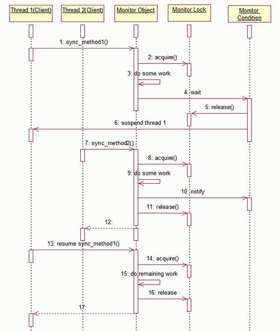
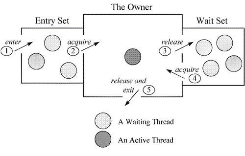

# 探索 Java 同步机制
Monitor Object 并发模式在 Java 同步机制中的实现

**标签:** Java

[原文链接](https://developer.ibm.com/zh/articles/j-lo-synchronized/)

李 三红

发布: 2008-12-26

* * *

本文将从两个方面进行阐述:

1. 使用 C++ 语言来描述 Monitor Object 设计模式。Java 对于这样一个典型的模式做了很好的语言层面的封装，因此对于 Java 的开发者来说，很多关于该模式本身的东西被屏蔽掉了。本文试图使用 Native C++ 语言，帮助读者从本质上对 Monitor object 设计模式有一个更全面的认识。
2. 结合 C++ 版本的 Monitor Object 设计模式，引领读者对于 Java 同步机制有一个更深刻的认识，帮助读者正确有效地使用 Java 同步机制。

## 预备知识

在开始正式讨论之前，需要了解一些预备知识。

### 什么是 RAII

资源获取即初始化（RAII, Resource Acquisition Is Initialization）是指，在一个对象的构造函数中获得资源 , 并且在该对象的析构函数中释放它。这个资源可以是对象、内存、文件句柄或者其它类型。实现这种功能的类，我们就说它采用了资源获取即初始化（RAII）的方式。 RAII 是一种很典型的语言惯用法，被很多的 OO 语言所使用，下面是 C++ 的例子。

##### 清单 1\. RAII Using C++

```
class Raii {
public:
    // Store a pointer to the resource and initialize the resource.
    Raii(Resource &resource)
    :m_pRes (&resource){
        m_pRes->initialize ();
    }
    // Close the resource when the execution goes out of scope.
    virtual ~Raii() {
        m_pRes->close ();
    }
private:
    // Pointer to the resource we're managing.
    Resource *m_pRes;
    // ... maybe need disallow copying and assignment ...
};

```

Show moreShow more icon

使用 RAII 的好处是：由于析构函数由系统自动调用，这样可以帮助我们自动地隐式释放我们所获取的资源。事情上，我们熟知的很多 c++ 技术都用到了这一设计模式，比如：智能指针 (Smart Pointer)，以及我们接下来要讨论的范围锁 (Scoped Lock) 。

不同于 C++，Java 对象没有析构函数，Java System 提供了 GC 来管理内存资源。而对于像数据库连接，Sockets 这样类型的资源， Java 提供了 [finalize()](http://java.sun.com/javase/6/docs/api/java/lang/Object.html#finalize%28%29) 来处理。但是，请注意，Java 的 [finalizer](http://java.sun.com/javase/6/docs/api/java/lang/Object.html#finalize%28%29) 与 C++ 的析构函数是不同的， [finalize()](http://java.sun.com/javase/6/docs/api/java/lang/Object.html#finalize%28%29) 函数由 GC 异步地在某个恰当的时候调用，我们不能等同地使用 [finalize()](http://java.sun.com/javase/6/docs/api/java/lang/Object.html#finalize%28%29) 来实现 C++ 里的 RAII 。通常的做法是使用 Java 提供的 finally 语句块。

##### 清单 2\. RAII Using Java

```
MyResource res = null;
try {
    res = new MyResource();
    // Use the resource
} finally {
    //At exit point, close the resource.
    if (res != null) { res.close(); }
}

```

Show moreShow more icon

### 什么是区域锁 (Scoped Lock)

区域锁是指线程执行进入一个区域时，一个锁将自动被获取，当该线程执行离开这个区域时，这个锁将被自动释放。 C++ 区域锁的实现使用了 RAII 技术 , 实现如下。

##### 清单 3\. Scoped Lock Using C++

```
template <class LOCK>
class Guard {
public:
    // Store a pointer to the lock and acquire the lock.
    Guard (LOCK &lock)
    :m_pLlock (&lock), m_bOwner (false) {
        m_pLlock->acquire ();
        m_bOwner = true;
    }
    // Release the lock when the guard goes out of scope,
    // but only if <acquire> succeeded.
    virtual ~Guard () {
        if (m_bOwner) m_pLlock->release ();
    }
private:
    // Pointer to the lock we're managing.
    LOCK *m_pLlock;
    // Records if the lock is held by this object.
    bool m_bOwner;
    // ... maybe need disallow copying and assignment ...
};

```

Show moreShow more icon

Guard 是一个模板类，LOCK 类型指的是对操作系统提供的线程锁的抽象，比如，在 Windows 平台上，LOCK 可以是对 CRITICAL\_SECTION 的封装。

那么对于 Java，怎么实现区域锁呢？不必担心，Java 对于区域锁模式在语言层面上已经做了封装，所以对于 Java 开发者来说，不必像 C++ 这样来开发自己的区域锁类，这就是我们所熟知的 synchronized 关键字。

##### 清单 4\. Scoped Lock Using Java

```
public int scopedLockSample() {
synchronized(this) {
        try {
            //do some work...
        } catch( MyException1 e) {
            //no need release lock explicitly
            return -1;
        } catch( MyException2 e) {
            //no need release lock explicitly
            return -2;
        }
        //other exceptions handling...
    }
    return 0;
}

```

Show moreShow more icon

synchronized 保证在进入该区域后，获得对象锁，不管最终该函数从哪里退出，该对象锁都会被正确释放。

### 什么是条件变量 (Condition Variables)

条件变量通常被一个线程用于使自己等待，直到一个涉及共享数据的条件表达式到达特定的状态。当另外的协作线程指示共享数据的状态已发生变化，调度器就唤醒在该条件变量上挂起的线程。于是新唤醒的线程重新对它的条件表达式进行求值，如果共享数据已到达合适状态，就恢复处理。以下是条件变量的 C++ 实现。

##### 清单 5\. Thread Condition Using C++

```
class Thread_Condition {
public:
    // Initialize the condition variable and associate it with the specified lock.
    Thread_Condition (const Thread_Mutex &m)
    :m_obMutex(m) {
        cond_init (&cond_, USYNC_THREAD, 0);
    }
    // Destroy the condition variable.
    virtual ~Thread_Condition () {
        cond_destroy (&cond_);
    }
    // Wait for the <Thread_Condition> to be notified
    // or until <timeout> has elapsed. If <timeout> == 0 then wait indefinitely.
    void wait (Time_Value *timeout = 0) {
        cond_timedwait(&cond_, &m_obMutex.m_lock,timeout == 0?0:timeout->msec ());
    }
    // Notify one thread waiting on <Thread_Condition>.
    void notify () { cond_signal (&cond_); }
    // Notify all threads waiting on <Thread_Condition>.
    void notify_all () { cond_broadcast (&cond_);
}
private:
    // Solaris condition variable.
    cond_t cond_;
    // Reference to mutex lock.
    const Thread_Mutex &m_obMutex;
};

```

Show moreShow more icon

Thread\_Condition 的实现与操作系统提供的 API 密切相关，以上的例子是基于 Solaris condition variable API 的面向对象的封装。另外，这里的 Thread\_Mutex 类型是对操作系统提供的线程锁的面向对象的封装 (Thread\_Mutex 类型就是 Guard 模板参数 LOCK 所指向的类型 ) 。

而对于 Java，问题就变得简单很多，你不需要去封装自己的条件变量类，Java 的根类 Object 提供了 wait/notify/notifyAll 方法给开发者，很容易使用，这个我们在后面的讨论中会看到。

## Monitor Object 设计模式 C++ 描述

我们将从以下几个方面来讨论 Monitor Object 模式。

### 问题描述

我们在开发并发的应用时，经常需要设计这样的对象，该对象的方法会在多线程的环境下被调用，而这些方法的执行都会改变该对象本身的状态。为了防止竞争条件 (race condition) 的出现，对于这类对象的设计，需要考虑解决以下问题：

- 在任一时间内，只有唯一的公共的成员方法，被唯一的线程所执行。

- 对于对象的调用者来说，如果总是需要在调用方法之前进行拿锁，而在调用方法之后进行放锁，这将会使并发应用编程变得更加困难。合理的设计是，该对象本身确保任何针对它的方法请求的同步被透明的进行，而不需要调用者的介入。

- 如果一个对象的方法执行过程中，由于某些条件不能满足而阻塞，应该允许其它的客户端线程的方法调用可以访问该对象。

我们使用 Monitor Object 设计模式来解决这类问题：将被客户线程并发访问的对象定义为一个 monitor 对象。客户线程仅仅通过 monitor 对象的同步方法才能使用 monitor 对象定义的服务。为了防止陷入竞争条件，在任一时刻只能有一个同步方法被执行。每一个 monitor 对象包含一个 monitor 锁，被同步方法用于串行访问对象的行为和状态。此外，同步方法可以根据一个或多个与 monitor 对象相关的 monitor conditions 来决定在何种情况下挂起或恢复他们的执行。

### 结构

在 Monitor Object 模式中，主要有四种类型的参与者：

- 监视者对象 (Monitor Object): 负责定义公共的接口方法，这些公共的接口方法会在多线程的环境下被调用执行。
- 同步方法：这些方法是监视者对象所定义。为了防止竞争条件，无论是否同时有多个线程并发调用同步方法，还是监视者对象含有多个同步方法，在任一时间内只有监视者对象的一个同步方法能够被执行。
- 监视锁 (Monitor Lock): 每一个监视者对象都会拥有一把监视锁。
- 监视条件 (Monitor Condition): 同步方法使用监视锁和监视条件来决定方法是否需要阻塞或重新执行。

### 执行序列图

在监视者对象模式中，在参与者之间将发生如下的协作过程：

1、同步方法的调用和串行化。当客户线程调用监视者对象的同步方法时，必须首先获取它的监视锁。只要该监视者对象有其他同步方法正在被执行，获取操作便不会成功。在这种情况下，客户线程将被阻塞直到它获取监视锁。当客户线程成功获取监视锁后，进入临界区，执行方法实现的服务。一旦同步方法完成执行，监视锁会被自动释放，目的是使其他客户线程有机会调用执行该监视者对象的同步方法。

2、同步方法线程挂起。如果调用同步方法的客户线程必须被阻塞或是有其他原因不能立刻进行，它能够在一个监视条件上等待，这将导致该客户线程暂时释放监视锁，并被挂起在监视条件上。

3、监视条件通知。一个客户线程能够通知一个监视条件，目的是为了让一个前期使自己挂起在一个监视条件上的同步方法线程恢复运行。

4、同步方法线程恢复。一旦一个早先被挂起在监视条件上的同步方法线程获取通知，它将继续在最初的等待监视条件的点上执行。在被通知线程被允许恢复执行同步方法之前，监视锁将自动被获取。图 1 描述了 `监视者` 对象的动态特性。

##### 图 1\. Monitor Object Sequence Diagram.



### 示例

在本节中，我们将使用监视者对象设计模式来解决一个实际的问题。

这是一个典型的生产者 / 消费者模式问题。假定我们有一个固定长度的消息队列，该队列会被多个生产者 / 消费者线程所操作，生产者线程负责将消息放入该队列，而消费者线程负责从该对列中取出消息。

##### 清单 6\. Message\_Queue.h

```
class Message_Queue {
public:
    enum { MAX_MESSAGES = 100/* ... */ };
    // The constructor defines the maximum number
    // of messages in the queue. This determines when the queue is 'full.'
    Message_Queue(size_t max_messages = MAX_MESSAGES);
    virtual ~Message_Queue();
    // Put the <Message> at the tail of the queue.
    // If the queue is full, block until the queue is not full.
    /* synchronized */
    void put (const Message &msg);
    // Get the <Message> from the head of the queue
    // and remove it. If the queue is empty, block until the queue is not empty.
    /* synchronized */
    Message get();
    // True if the queue is empty, else false.
    /* synchronized */
    bool empty () const;
    // True if the queue is full, else false.
    /* synchronized */
    bool full () const;
private:
    // Put the <Message> at the tail of the queue, and
    // get the <Message> at its head, respectively.
    // Note that, the internal methods are not synchronized.
    void put_i (const Message &msg);
    Message get_i ();
    // True if the queue is empty, else false.
    bool empty_i () const;
    // True if the queue is full, else false.
    bool full_i () const;
private:
    // Internal Queue representation omitted, could be a
    // circular array or a linked list, etc.. ...
    // Current number of <Message>s in the queue.
    size_t message_count_;
    // The maximum number <Message>s that can be
    // in a queue before it's considered 'full.'
    size_t max_messages_;
    // Monitor lock that protects the queue's
    // internal state from race conditions during concurrent access.
    mutable Thread_Mutex monitor_lock_;
    // Condition variable used in conjunction with <monitor_lock_> to make
    // synchronized method threads wait until the queue is no longer empty.
    Thread_Condition not_empty_;
    // Condition variable used in conjunction with <monitor_lock_> to make
    // synchronized method threads wait until the queue is no longer full.
    Thread_Condition not_full_;
};

```

Show moreShow more icon

##### 清单 7\. Message\_Queue.cpp

```
#include "Message_Queue.h"
Message_Queue::Message_Queue (size_t max_messages)
:not_full_(monitor_lock_),
not_empty_(monitor_lock_),
max_messages_(max_messages),
message_count_(0) {
}
bool Message_Queue::empty () const {
    Guard<Thread_Mutex> guard (monitor_lock_);
    return empty_i ();
}
bool Message_Queue::full () const {
    Guard<Thread_Mutex> guard (monitor_lock_);
    return full_i ();
}
void Message_Queue::put (const Message &msg) {
    // Use the Scoped Locking idiom to acquire/release the < monitor_lock_> upon
    // entry/exit to the synchronized method.
    Guard<Thread_Mutex> guard (monitor_lock_);
    // Wait while the queue is full.
    while (full_i ()) {
        // Release < monitor_lock_> and suspend the
        // calling thread waiting for space in the queue.
        // The <monitor_lock_> is reacquired automatically when <wait> returns.
        not_full_.wait ();
    }
    // Enqueue the <Message> at the tail.
    put_i (msg);
    // Notify any thread waiting in <get> that the queue has at least one <Message>.
    not_empty_.notify ();
} // Destructor of <guard> releases <monitor_lock_>.
Message Message_Queue::get () {
// Use the Scoped Locking idiom to acquire/release the <monitor_lock_> upon
// entry/exit to the synchronized method.
Guard<Thread_Mutex> guard (monitor_lock_);
// Wait while the queue is empty.
while (empty_i ()) {
    // Release <monitor_lock_> and suspend the
    // calling thread waiting for a new <Message> to
    // be put into the queue. The <monitor_lock_> is
    // reacquired automatically when <wait> returns.
    not_empty_.wait ();
}
// Dequeue the first <Message> in the queue and update the <message_count_>.
    Message m = get_i ();
    // Notify any thread waiting in <put> that the
    // queue has room for at least one <Message>.
    not_full_.notify ();
    return m;
} // Destructor of <guard> releases <monitor_lock_>.
bool Message_Queue::empty_i () const {
    return message_count_ == 0;
}
bool Message_Queue::full_i () const {
    return message_count_ == max_messages_;
}
Message_Queue::~Message_Queue() {
}

```

Show moreShow more icon

## Monitor Object Java 实践

### 认识 Java Monitor Object

Java Monitor 从两个方面来支持线程之间的同步，即：互斥执行与协作。 Java 使用对象锁 ( 使用 synchronized 获得对象锁 ) 保证工作在共享的数据集上的线程互斥执行 , 使用 notify/notifyAll/wait 方法来协同不同线程之间的工作。这些方法在 Object 类上被定义，会被所有的 Java 对象自动继承。

实质上，Java 的 Object 类本身就是监视者对象，Java 语言对于这样一个典型并发设计模式做了内建的支持。不过，在 Java 里，我们已经看不到了我们在 C++ 一节所讨论的区域锁与条件变量的概念。下图很好地描述了 Java Monitor 的工作机理。

##### 图 2\. Java Monitor



线程如果获得监视锁成功，将成为该监视者对象的拥有者。在任一时刻内，监视者对象只属于一个活动线程 (Owner) 。拥有者线程可以调用 wait 方法自动释放监视锁，进入等待状态。

### 示例

在本节，我们将用 Java Monitor 来重新解决用 C++ 实现的生产者 / 消费者模式问题。

##### 清单 8\. Message Class

```
public class Message {
    private static int OBJ_COUNT = 0;
    public int obj_index_;
    Message(){
        synchronized(Message.class) {
            OBJ_COUNT++;
            obj_index_ = OBJ_COUNT;
        }
    }

    @Override
    public String toString() {
        return "message["+obj_index_+"]";
    }
}

```

Show moreShow more icon

##### 清单 9\. MessageQueue Class

```
public class MessageQueue {
private int message_count_;
    private int max_messages_;
    private Message[] buffer_;

    private int in_ = 0, out_ = 0;
    public MessageQueue(int max_messages) {
        max_messages_   = max_messages;
        message_count_  = 0;
        buffer_          = new Message[max_messages_];
    }

    synchronized boolean full () {
        return full_i ();
    }
    synchronized  void put (Message msg) {
        while (full_i ()) {
            try {
                System.out.println("thread["+
                  Thread.currentThread().getId()+
                  "]"+
                  "release monitor lock, wait for space in the queue");
                wait();
            } catch (InterruptedException e) {
                //do something.
            } finally {
                //do something.
            }
        }//end while.
        put_i(msg);
        notifyAll();
    }
    synchronized  Message get() {
        while (empty_i ()) {
              try {
                  System.out.println("thread["+
                    Thread.currentThread().getId()+
                    "]"+
                    "release monitor lock, wait for message in the queue");
                            wait();
                        } catch (InterruptedException e) {
                            //do something.
                        } finally {
                            //do something.
                        }
        }//end while.
        Message m = get_i ();
        notifyAll();
        return m;
    }
    private boolean empty_i () {
        return message_count_ == 0;
    }
    private boolean full_i () {
        return message_count_ == max_messages_;
    }
    private void put_i (Message msg) {
        System.out.println("thread ["+
            Thread.currentThread().getId()+
            "] put message <"+
            msg+
            ">" +
            "to the queue");
        buffer_[in_] = msg;
                in_ = (in_ + 1) % max_messages_;
                message_count_++;
    }
    private Message get_i() {
             Message msg = buffer_[out_];
                out_= (out_ + 1) % max_messages_;
                message_count_--;
                System.out.println("thread ["+
                    Thread.currentThread().getId()+
                    "] get message <"+
                    msg+
                    ">" +
                    "from the queue");
            return msg;
    }
}

```

Show moreShow more icon

在 Java 的示例中，没有放更多的注释，希望读者通过对照 C++ 的示例，来阅读理解这里的 Java 代码。可以看到，使用 Java 的版本代码简洁了很多。另外，这里提供的 Java 代码，稍作修改，是直接可以作为独立的 Java 程序运行的。

需要说明的是，本文所提供的样例代码都是示例性的，目的只是为了帮助读者更好地理解 Java 多线程同步机制，并不保证能够直接用来解决实际开发中所面临的问题。

## 结束语

我们对比一下 Monitor Object 设计模式的 C++ 版本与 Java 版本，做出如下的总结。

在 Java 的版本中，我们不需要亲自开发 Scoped Lock，Thread Condition 类，Java 语言给我们提供了内建的支持，我们很容易使用 synchronized, wait/notify 这些 Java 特性来构建基于 Monitor Object 模式的应用。而缺点是：缺乏一些必要的灵活性。比如 : 在 Java 的版本中，我们并不能区分出 not empty 与 not full 这两个条件变量，所以我们只能使用 notifyAll 来通知所有等待者线程，而 C++ 版本使用了不同的通知唤醒：not _full_.notify 与 not _empty_.notify 。同样，在 Java 中对于 synchrnonized 的使用，后面一定要跟 {} 语句块，这在代码的书写上有些不灵活，而在 C++ 中的，Scoped Lock 默认就是保护当前的语句块，当然你也可以选择使用 {} 来显式声明。而且，使用 synchroninzed 所获得的对象锁，无法细粒度地区分是获得读锁还是写锁。

不过总的来说，Java 的确简化了基于 Monitor Object 并发模式的开发。不过，我们应该意识到，并发的实际应用开发决不会像 Java 语法这么体现出来的简单，简洁。我们更应该看到并发应用程序本质的一些东西，这有利于帮助我们构建更加健壮的并发应用。