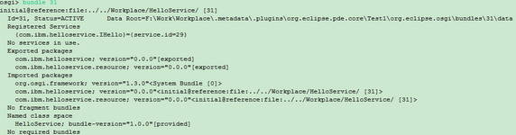
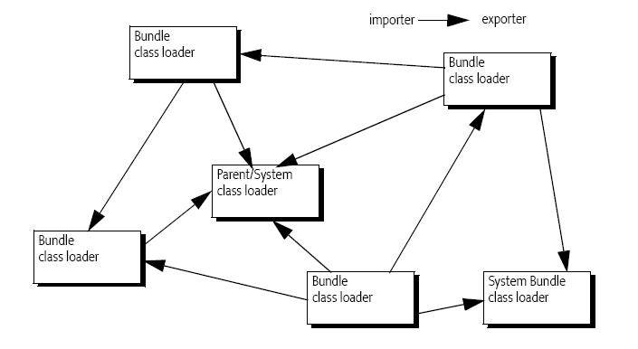
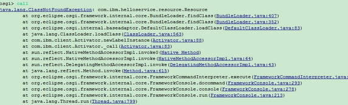
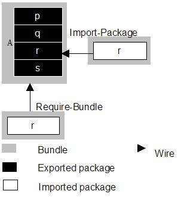
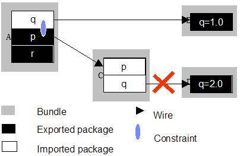

# 探索 OSGi 框架的组件运行机制
结合实例探索 OSGi 框架中的组件 Bundle 的运行机制

**标签:** Java

[原文链接](https://developer.ibm.com/zh/articles/j-lo-osgi/)

王珏

发布: 2008-07-24

* * *

在目前的 Java 开发平台中，对于组件开发过程，比如打包、部署和验证等，并没有一个统一的标准。正因如此，许多 Java 项目，例如 JBoss 和 Net Beans，都拥有一套自定义的组件开发规范和框架，但是实际上这些解决方案都是基于为组件分配独立的类加载器 (Class Loader) 的思想。 OSGi 框架为基于 Java 的组件开发提供了一套通用的和标准的解决方案，并已经成为事实上的工业标准。

## OSGi 组件框架

在 OSGi 框架中，组件被称为 Bundle，它是由一些提供 Bundle 自身功能的资源 ( 如 Java 类文件、配置文件等 )、MANIFEST.MF 文件和其它资源文件构成。在运行时环境中，每个 Bundle 都有一个独立的 Class Loader，Bundle 之间通过不同的类加载器和在 MANIFEST.MF 文件中定义的包约束条件就可以轻松实现包级别的资源隐藏和共享，从而实现基于组件方式的开发和运行。 Class Loader 是实现这种运行方式的关键机制，每个 Bundle 的 Class Loader 必须在此 Bundle 得到正确的解析 ( Resolving ) 之后，再由 OSGi 框架创建。只有当一个 Bundle 中的所有包约束条件都满足时，它才被正确解析完毕。

### Bundle 解析

Bundle 的解析是通过分析定义在 MANIFEST.MF 文件中的元数据 ( 主要定义了包约束条件 )，查找与包约束条件相匹配的 Bundle 并建立关联关系的过程。 MANIFEST.MF 文件中的包约束条件主要是通过 Import-Package、DynamicImport-Package、Export-Package 和 Require-Bundle 这四种表达方式来实现。下面简单介绍一下它们：

1. Import-Package：定义需要导入的包。默认是所有需导入的包必须都能够找到相应的导出 Bundle (Exporter)，否则解析失败。
2. Export-Package：定义导出的包。在一个 Bundle 里面，一个包的导出定义并不意味着相应的包导入定义，而是这些类资源会在 Bundle 自身的类路径里面查找和加载。
3. Require-Bundle：定义依赖的 Bundle 。
4. DynamicImport-Package：定义需要动态导入的包。这部分定义没有在 Bundle 解析过程中使用，而是在运行时动态解析并加载共享包。

在 Bundle 得到正确解析后，OSGi 框架将会生成此 Bundle 的依赖关系表。在实际运行过程中，框架就可以通过此关系表找到 Bundle 依赖的外部 Class Loader，从而实现外部类资源的加载和运行 hg 。 Bundle 的关系图可以在 OSGi 的控制台中通过内部命令＂ bundle ＂来查看，如下图所示：

##### 图 1\. Bundle 依赖关系表



### Bundle 运行

Bundle 的运行主要依靠于 OSGi 框架为其创建的类加载器（Class Loader），加载器负责查找和加载 Bundle 自身或所依赖的类资源。 ClassLoader 之间的依赖关系构成了一个有向图，如下图所示：

##### 图 2\. Class Loader 依赖关系图



Bundle 的 Class Loader 能加载的所有类的集合构成了 Bundle 的类空间 (Class Space) 。类空间包含的类资源主要来自于以下几个方面：

1. 父 Class Loader 可加载的类集合；
2. Import-Package 定义的依赖的包；
3. Require-Bundle 定义的依赖的 Bundle 的类集合；
4. Bundle 自身的类集合，通常在 Bundle-Classpath 中定义；
5. 隶属于 Bundle 的 Fragment 类集合。

在实际运行环境中，Bundle 的 Class Loader 根据如下规则去搜索类资源。规则简要介绍如下：

1. 如类资源属于 java.\* 包，则将加载请求委托给父加载器；
2. 如类资源定义在 OSGi 框架中启动委托列表（org.osgi.framework.bootdelegation）中，则将加载请求委托给父加载器；
3. 如类资源属于在 Import-Package 中定义的包，则框架通过 Class Loader 依赖关系图找到导出此包的 Bundle 的 Class Loader，并将加载请求委托给此 Class Loader ；
4. 如类资源属于在 Require-Bundle 中定义的 Bundle，则框架通过 Class Loader 依赖关系图找到此 Bundle 的 Class Loader，将加载请求委托给此 Class Loader ；
5. Bundle 搜索自己的类资源 ( 包括 Bundle-Classpath 里面定义的类路径和属于 Bundle 的 Fragment 的类资源）；
6. 若类在 DynamicImport-Package 中定义，则开始尝试在运行环境中寻找符合条件的 Bundle 。

如果在经过上面一系列步骤后，仍然没有正确地加载到类资源，则 OSGi 框架会向外抛出类未 发现异常。

## 确保 Bundle 类空间的完整性

从上述对 OSGi 组件框架的剖析中，MANIFEST.MF 文件中定义的元数据对 Bundle 的解析和运行起着至关重要的作用。 Bundle 所需要的类资源应该完全被其类空间所覆盖，否则将会在运行时环境中抛出类或资源未发现异常，从而导致 Bundle 无法正常工作。下面给出一个实际例子来说明这种情况。

在 Eclipse 环境中创建两个插件开发项目 , 并命名为 Client 和 HelloService. HelloService 向外提供服务 , Client 通过注册在 OSGi 控制台中的命令来调用 HelloService 的服务。 HelloSerive 定义的服务接口为 :

##### 清单 1\. IHello.java

```
package com.ibm.helloservice;
public interface IHello {
    public void sayHello(String addition);
}

```

Show moreShow more icon

##### 清单 2\. ILabelProvider.java

```
package com.ibm.helloservice;

public interface ILabelProvider {
    public String getLabel();
}

```

Show moreShow more icon

同时 HelloService 还给出了具体实现 :

##### 清单 3\. HelloImpl.java 和 Resource.java

```
package com.ibm.helloservice.impl;
import com.ibm.helloservice.IHello;
public class HelloImpl implements IHello {
    public void sayHello(String addition) {
        System.out.println ("Hello ” + addition + "!");
    }
}

package com.ibm.helloservice.resource;
import com.ibm.helloservice.ILabelProvider;
public class Resource implements ILabelProvider {
    public String getLabel() {
        return "Test Label";
    }
}

```

Show moreShow more icon

由于此 Bundle 向外提供了服务和资源信息，因此需要在 MANIFEST.MF 文件中将它们所属于的包导出：

##### 清单 4\. MANIFEST.MF

```
Manifest-Version: 1.0
Bundle-ManifestVersion: 2
Bundle-Name: HelloService Plug-in
Bundle-SymbolicName: HelloService
Bundle-Version: 1.0.0
Bundle-Activator: com.ibm.helloservice.impl.Activator
Bundle-Localization: plugin
Export-Package: com.ibm.helloservice,
com.ibm.helloservice.resource
Import-Package: org.osgi.framework; version="1.3.0"

```

Show moreShow more icon

在 BundleActivator 类中，向 OSGi 框架注册了 IHello 的 service，具体实现代码十分简单，在此略过。服务使用方 (Client Bundle)，是一个控制台程序，通过注册在 OSGi 框架中的命令调用 HelloService Bundle 提供的服务。具体实现参见如下代码：

##### 清单 5\. Activator.java

```
package com.ibm.client;

import java.io.IOException;
import java.io.InputStream;
import java.util.Properties;

import org.eclipse.osgi.framework.console.CommandInterpreter;
import org.eclipse.osgi.framework.console.CommandProvider;
import org.osgi.framework.BundleActivator;
import org.osgi.framework.BundleContext;
import org.osgi.framework.ServiceReference;
import org.osgi.framework.ServiceRegistration;
import org.osgi.util.tracker.ServiceTracker;
import org.osgi.util.tracker.ServiceTrackerCustomizer;

import com.ibm.helloservice.IHello;
import com.ibm.helloservice.ILabelProvider;

public class Activator implements BundleActivator,
    ServiceTrackerCustomizer, CommandProvider  {

    private ServiceTracker helloServiceTracker;
    private ServiceRegistration registration;
    private BundleContext bundleContext;
    private IHello hello;

    private static Properties config = null;

    static {
        config = new Properties();
        try {
            InputStream is = Activator.class.getClassLoader()
                .getResourceAsStream("LabelProvider.properties");
            config.load(is);
        } catch (IOException e) {
            e.printStackTrace();
        }
    }

    public void start(BundleContext context) throws Exception {
        bundleContext = context;
        helloServiceTracker = new ServiceTracker(context, IHello.class.getName(), this);
        helloServiceTracker.open();
        registration = context.registerService(CommandProvider.class.getName(),
        this, null);
    }

    public void stop(BundleContext context) throws Exception {
        helloServiceTracker.close();
        registration.unregister();
        bundleContext = null;
    }

    public Object addingService(ServiceReference servRef) {
        Object service = bundleContext.getService(servRef);
        if(service instanceof IHello) {
            hello = (IHello)service;
            return hello;
        }
        return service;
    }

    public void modifiedService(ServiceReference servRef, Object service) { }

    public void removedService(ServiceReference servRef, Object service) {
        if(service instanceof IHello) {
            hello = null;
        }
        bundleContext.ungetService(servRef);
    }

    public String getHelp() {
        return "\tcall - say hello";
    }

    public void _call(CommandInterpreter ci) throws Exception {
        hello.sayHello(newLabelInstance().getLabel());
    }

    private ILabelProvider newLabelInstance() throws Exception {
        String className = config.getProperty("ProviderClass");
        Class<?> labelClass = this.getClass().getClassLoader().loadClass(className);
        ILabelProvider label = (ILabelProvider)labelClass.newInstance();
        return label;
    }
}

```

Show moreShow more icon

在以上代码中，Bundle 通过 ServiceTracker 得到 IHello 这个服务接口，并同时向 OSGi 框架注册一个名为＂ call ＂的命令。在这个命令的执行过程中，Bundle 通过自身的 ClassLoader 去加载定义在 LabelProvider.properties 文件中的 ILabelProvider 实现类，并打印 Label Provider 中的内容。从以上代码中，我们会很容易地定义出此 Bundle 需要导入哪些包，如下 MANIFEST.MF 文件所示 :

##### 代码清单 6: MANIFEST.MF

```
Manifest-Version: 1.0
Bundle-ManifestVersion: 2
Bundle-Name: Client Plug-in
Bundle-SymbolicName: Client
Bundle-Version: 1.0.0
Bundle-Activator: com.ibm.client.Activator
Bundle-Localization: plugin
Import-Package: com.ibm.helloservice,
org.eclipse.core.runtime,
org.eclipse.osgi.framework.console;version="1.0.0",
org.osgi.framework;version="1.3.0",
org.osgi.util.tracker;version="1.3.1"

```

Show moreShow more icon

从表面上看 , 这个文件没有任何遗漏 , 在 Eclipse IDE 环境中能够正确解释通过 , 并且在启动 OSGi 框架后 , Client Bundle 也能够被正确解析和启动。但是在敲入 call 命令的后 , 就会显示如下错误 :

##### 图 3\. 资源加载异常



原来缺少了一个依赖包 com.ibm.helloservice.resource.Resource。在 MANIFEST.MF 文件中加入对它的定义后 , call 命令就能够正确运行了 :

##### 图 4\. 运行结果


这个例子模拟了在实际 Bundle 开发过程中普遍遇到的问题，即许多类资源定义在 plugin.xml 文件中，然后由其他组件动态的创建和调用，而在 Eclipse IDE 开发环境中，并没有相应的机制去检查非 Java 代码里的包引用，从而 Bundle 缺失对某些包依赖的定义，最后就造成了 Bundle 类空间的不完整性。通常这种情况下，Bundle 能够被正确解析，但是在运行的时候就会抛出类未找到异常。所以在开发一个 Bundle 的时候，一定要仔细检查类空间是否已经将整个 Bundle 所需要的类资源覆盖，这样才能避免运行时的异常发生。

## 合理使用 Manifest 文件

### Import-Package 与 Require-Bundle

OSGi 框架提供了两种导入包依赖的方式，即 Import-Package 和 Require-Bundle 。从下图中我们可以看出 Require-Bundle 会对整个 Bundle 产生依赖，也就是说 Bundle 所 Export 出的包都会被 A 加入到自己的类空间，而 Import-Package 只会对指定的包产生依赖关系。

##### 图 5\. Bundle 依赖关系图



在大多数情况下，都应该使用 Import-Package 而不是 Require-Bundle 。 Import-Package 比 Require-Bundle 更利于 Bundle 的部署和版本维护，同时在查找类的时候有更高的效率。

### Eclipse-LazyStart

在 OSGi R4 版本中，通过对 Eclipse-LazyStart 属性的设置，可以指定 Bundle 是否支持慢启动功能。当 Eclipse-LazyStart 被设置为 true 的时候，Bundle 不会被默认启动，而是当 Bundle 的类或其它资源被第一次调用时，由框架自动激活 Bundle 。这样就会使得 OSGi 框架在启动的时候，只启动必须的 Bundle 而延迟启动其它的 Bundle，从而确保了启动时间和效率。在默认情况下，Eclipse-LazyStart 为 false 。

### Bundle-ManifestVersion

Bundle-ManifestVersion 指定了 Bundle 应该遵循 OSGi 规范的版本号。其默认值是 1，即 R3 版本；值为 2 的时候，表示为 R4 版本。当 Bundle 需要用到 R4 中新功能的时候，如 Bundle 的慢启动，则必须显示设置 Bundle-ManifestVersion 为 2 。

### 类不一致性问题

在 OSGi 框架中，多个 Bundle 可以导出相同的包，如果在某个 Bundle 的类空间中存在来自于不同 Bundle 的相同类信息，就会导致类的不一致性问题。示例如下：

##### 图 6\. Bundle 依赖关系图



Bundle A 向外 Export 两个包 p 和 r，其中 p 对 q 存在约束关系，即 q 须为 Bundle B 中的 1.0 版本。同时，Bundle C 又分别导入了 p 和 q 两个包，包 p 来自于 A，而包 q 为 Bundle D 中的 2.0 版本。虽然 C 中并没有显示地定义对 B 中包 q 的依赖关系，但是由于 A 中的包 p 绑定了 B 中版本为 1.0 的包 q，故 C 在解析对包 p 的依赖关系的时候也会自动把 B 中 1.0 版本的包 q 导入到自己的类空间中。这样在 C 的类空间中，就存在着两个不同版本、来自于不同 Bundle 的包 q，进而就会存在两个不同的 Class Loader 对应着包 q，故在 Bundle C 的运行过程中就会出现类不一致性的异常。

## 结束语

本文介绍了 OSGi 框架的组件运行机制，包括 Bundle 的解析、运行等，并结合实际的示例演示了在基于 OSGi 平台开发 Bundle 的过程中应该注意的一些问题。

## 相关主题

- [Equinox](https://www.eclipse.org/equinox)
- [了解 Eclipse 插件如何使用 OSGi](https://www.ibm.com/developerworks/cn/opensource/os-ecl-osgi/)
- [利用 OSGi 解决 Eclipse 插件难题](https://www.ibm.com/developerworks/cn/opensource/os-ecl-dynext/)
- [OSGi Alliance Service Platform](https://www.osgi.org/)