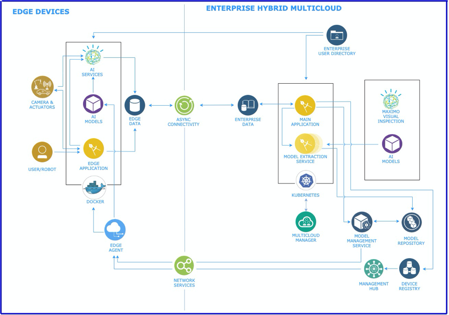
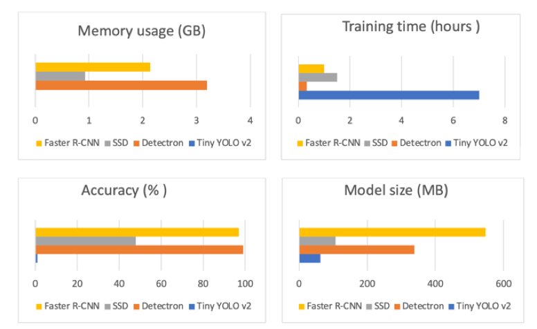

# 探索用于质量检验系统的边缘计算架构的详细信息
了解 IBM Edge Application Manager 和 IBM Maximo Visual Inspection 如何共同交付边缘计算解决方案

**标签:** IBM Edge Application Manager,IBM Maximo,IBM Maximo Visual Inspection,IBM Power Systems,Open Horizon,人工智能,深度学习,系统,边缘计算

[原文链接](https://developer.ibm.com/zh/articles/explore-details-edge-computing-architecture/)

Christine Ouyang, Feng Xue, Igor Khapov, Charisse Lu, Thomas Cook

发布: 2020-12-15

* * *

在前面文章“ [启用分布式 AI 以通过边缘计算在制造业中进行质量检验](/zh/articles/enabling-distributed-ai-with-edge-computing/)”中，我们概述了 AI 技术辅助的质量检验系统。在本文中，我们将深入研究最终边缘计算解决方案的架构和开发。

下图显示了此 AI 辅助质量检验系统的环境关系图。

##### 图 1\. 质量检验系统的系统环境关系图


我们的边缘计算项目的主要功能是将 AI 模型从云端分发到制造领域使用的边缘设备。此解决方案使用 IBM Edge Application Manager (IEAM) 将 AI 工作负载部署到边缘设备，使用 [IBM Maximo Visual Inspection](https://www.ibm.com/products/ibm-maximo-visual-inspection)（以前称为 IBM PowerAI Vision）训练模型，并使用 NVIDIA Jetson TX2 设备在边缘进行推理。还讨论了有关在 Maximo Visual Inspection 中训练的 IEAM 和 AI 模型的技术细节。此解决方案正在生产中部署，结合 IBM AI 和 Edge 产品，同时扩展了边缘设备，用于 IBM 系统的制造。

本文的目标读者是从事边缘计算项目的架构师、开发者和管理员。

## 我们边缘计算解决方案的高级架构

图 2 显示了基于 [IBM Edge Computing 参考架构](https://www.ibm.com/cloud/architecture/architectures/edge-computing/reference-architecture) 的质量检验系统架构，其中的组件可以在以下两种环境中实现：

- 企业混合云环境
- 一组边缘服务

企业混合云环境负责模型训练、管理、导出和部署。它还具有管理设备、角色和用户的功能。

边缘设备组件负责执行 AI 推理，报告推理结果并提供设备状态信息。

##### 图 2\. 基于 IBM Edge Computing 参考架构的解决方案架构



在此解决方案架构中，我们开发的质量检验系统包含以下组件：主应用程序、模型导出服务、模型管理服务、模型存储库、AI 模型和边缘应用程序。IBM Edge Application Manager 在我们的架构中提供了以下组件：管理中心、边缘代理、设备注册表、模型存储库和多云环境。

我们来讨论一下边缘计算解决方案架构的主要组成部分：

- 云基础架构
- 边缘计算
- 数据模型
- 边缘设备监控
- 认证和授权
- 边缘服务

### 云基础架构

边缘计算解决方案的一项首要要求是提供主要的质量检验应用程序及其相关的微服务，这些微服务负责导出和部署模型、管理用户以及监控边缘设备。为了确保高可用性，在 Docker 容器中运行的主要应用程序及其相关的微服务是使用 [IBM Cloud Kubernetes Service](https://www.ibm.com/cloud/container-service/) 开发的。我们正在迁移到 Red Hat OpenShift Container Platform。

### 边缘计算

IBM Edge Application Manager (IEAM) 是一个边缘计算平台，用于管理数以万计的边缘设备上的多种服务。IEAM 是基于开源项目 [Open Horizon](https://github.com/open-horizon/)，这是一个 [LF Edge 项目](https://www.lfedge.org/projects/openhorizon/)（LF Edge 是 Linux 基金会旗下的组织）。

[IEAM 命令行界面](https://www.ibm.com/support/knowledgecenter/SSFKVV_4.0/devices/installing/exploring_hzn.html)（hzn 命令）可用于管理设备以及部署新的模式和服务。不过，IEAM 也支持 REST API 调用，其功能与 IEAM CLI 相同。通过使用 REST API，我们无需使用多个 Shell 程序，就能创建集成服务和边缘连接器。

### 数据模型

边缘计算解决方案的数据模型包括以下数据：

- IBM Maximo Visual Inspection 凭证（以支持多个安装）
- 用户角色支持
- 丰富的推理结果
- 设备列表、设备配置信息和利用率
- 已部署服务的列表

目前，我们使用 IBM Cloud® 中的 MongoDB 作为存储数据的数据库。也可以考虑使用其他云存储服务或本地数据存储器。

### 边缘设备监控

我们使用 MQ 遥测传输 (MQTT) 协议来收集所有边缘设备的信息。MQTT 是一种轻量级协议，适合于收集状态元数据信息。设备可以生成资源利用率（RAM、HDD 和 CPU）数据，并提供有关推理结果的信息。

### 认证和授权

对于认证，我们使用企业单点登录 (SSO) 解决方案在 IBM Cloud 上的主应用程序和边缘设备上的边缘应用程序中对用户进行认证。根据定义的角色授权允许用户执行的操作。

### Edge 微服务

为了充分利用 IEAM 的优势，我们使边缘应用程序实现了容器化，以便轻松高效地将其部署到多个边缘设备中。特别是，我们将边缘应用程序拆分为以下边缘服务（参见图 3）：

- 模型同步服务。此服务负责从对象存储中下载指定的模型版本，对其进行解密和解压缩，并使其可用于推理工作。
- 模型检测器服务。这是一种推理服务，用于使 AI 分析作业能够在不同类型的模型之间切换。
- 路由器。 这是一种边缘服务，提供了用户界面和已部署模型之间的集成点。
- 边缘仪表板。此用户界面允许质量检验员执行推理。
- 认证服务。此服务提供使用边缘仪表板的用户授权。
- 边缘监控。此服务通过 MQTT 实现边缘设备监控。

##### 图 3\. 边缘微服务架构


## 使用 IEAM API 实现边缘设备与 IEAM 服务器通信

IBM Edge Application Manager 在 Red Hat OpenShift Container Platform 上运行，并提供了用于管理边缘设备和边缘集群上的多种服务的功能。在我们的项目环境中，IEAM 提供了协调 Jetson TX2 设备上的三种微服务的功能。IEAM 负责在应用程序级别进行设备和服务管理。

IEAM 使用各种设备上的代理来管理服务。服务可以表示为 Docker 容器，而且我们能够对微服务开发使用与云和虚拟化开发设置所用相同的最佳实践。因此，通过利用 Maximo Visual Inspection 中的模型来安排本地化数据处理，我们能够减少从制造领域到云端的流量。

Horizon 命令行界面 (hzn CLI) 可用于配置边缘设备以及注册新的模式和服务。此界面适合用于测试，但脚本界面和 CLI 不适用于生产用途。例如，必须调用与 hzn CLI 的一系列操作和交互才能与边缘设备通信（例如，部署服务、获取设备列表等）。

对于生产用途，Node.js 模块通过 REST API 与 IEAM 服务器通信，无需与边缘设备上的 hzn CLI 交互。本节的其余部分将介绍边缘设备和管理中心之间的基本流程。

要将大多数请求发送到 IEAM 管理中心，需要以下信息：

- 组织 ID (HZN\_ORG\_ID)
- 授权用户凭证 (HZN\_EXCHANGE\_USER\_AUTH)

IEAM 客户端 API 可连接到用于管理 IEAM 实体的主要组件的 IEAM Exchange 服务以及用于存储模型的 IEAM IEAM Cloud Sync Service (CSS)。

您可以在此 [GitHub 存储库](https://github.com/IBM/manufacturing-edge/) 中阅读有关这些 API 的更多信息。

我们使用 HZN\_EXCHANGE\_API 和 HZN\_MMS\_API（作为环境变量导入）作为 API 连接的基本 URL。以下是这些 URL 的示例值：

- `HZN_EXCHANGE_API=https://<ieam_service_host>: <ieam_service_port>/ec-exchange/v1/`
- `HZN_MMS_API=https://<ieam_service_host>: <ieam_service_port>/ec-css/`.

## 利用 Maximo Visual Inspection 优化和训练模型

我们的边缘计算解决方案是一种分布式 AI，通过边缘计算在制造业中进行质量检验。此项目的主要功能是将 AI 模型从云端分发到制造领域使用的边缘设备。IBM Maximo Visual Inspection 使用从 IBM 生产设施中的实际质量检验收集的训练数据集对模型进行训练。

Jetson TX2 和 Jetson Nano 均为候选边缘设备。经证实，即使具有磁盘缓冲，但由于内存不足，Jetson Nano 不适用于 Faster R-CNN 模型推理。

IBM Maximo Visual Inspection 提供了一个用户友好的界面，用于创建和训练计算机视觉模型。它提供了不同类型的优化，并且可以训练各种模型类型，包括：

- Faster R-CNN
- Tiny YOLO v2
- Detectron
- Single Shot Detector (SSD)

IBM Maximo Visual Inspection 还使用户能够优化不同的模型超参数，例如：

- 最大迭代次数
- 动量
- 比率
- 学习速率
- 权重衰减

为了提高模型的准确性，在使用 Maximo Visual Inspection 进行模型训练期间，可以应用不同的数据增强方法：

- 模糊
- 锐化
- 渲染
- 裁切
- 垂直翻转
- 水平翻转
- 旋转
- 噪点
- 图像大小

Jetson TX2 上的推理以 Docker 容器的形式进行。Docker 镜像基于 Ubuntu 18.04，并安装了用于推理的 Python 软件包（caffe、py-faster-rcnn、pytorch 和 detectron）。为了从远程主机运行推理，我们使用 `uwsgi` Web 服务器和 Python Flask 框架来启用 REST API：

- GET REST API 可用于获取推理容器的状态：

    `<Jetson IP address>:8081/inference`

     返回内容示例：


    ```
    Ready - Indicates that the service is ready for inference POST request
    Busy - Indicates that an active inference process is currently running

    ```


    Show moreShow more icon

- POST REST API 可用于运行推理。它使用两个参数（model 和 image）：


    ```
    "Content-Type: application/json" -X POST <Jetson IP address>:8081/inference -d '{"model":"<model_id>", "image": "<imageName>"}'

    ```


    Show moreShow more icon

     而且，它会返回检测到的不良连接器的列表，该信息包含坐标和置信度：


    ```
    [{'label': 'fbends', 'confidence': 1.0, 'xmin': 372, 'ymin': 189, 'xmax': 389, 'ymax': 211}, {'label': 'fbends', 'confidence': 0.99, 'xmin': 55, 'ymin': 282, 'xmax': 71, 'ymax': 303},{'label': 'fbends', 'confidence': 0.96, 'xmin': 65, 'ymin': 283, 'xmax': 80, 'ymax': 300}]

    ```


    Show moreShow more icon

     我们使用包含 424 个 JPG 文件的数据集来进行模型训练，这些文件带有两种标签：

- fbends：1118（不良连接器）

- good：62（良好连接器）

根据上面的数据集，在 Maximo Visual Inspection 中训练了四个模型，并用在 Jetson TX2 上进行推理，得出了以下结果。

- 通过利用我们的测试集，Faster R-CNN 和 Detectron 模型针对精度进行了优化，推理结果显示精度很高。两种模型都使用矩形边界框来标记对象。Detectron 模型还可以使用通过多边形（分段）标记的对象来提高训练精度。但是，训练使用多边形标签的数据集比训练使用矩形边界框的数据集更费时间。在我们的场景中，我们禁用了分段：Maximo Visual Inspection 使用矩形而不是多边形。

- Tiny YOLO 和 SSD 的低推理精度也在意料之中。Tiny YOLO V2 模型主要针对速度进行了优化，可以在任何地方运行，但可能不如针对精度优化的模型准确，尤其是对于像我们这样分类了许多非常小的目标的用例。SSD 模型适用于实时推理和嵌入式设备。它几乎与 YOLO 一样快，但不如 Faster R-CNN 准确。


下表总结了每种模型的训练和推理结果，图 4 中还显示了条形图。

推理内存使用 (GB)训练时间（小时）精度 (%)模型大小 (MB)Faster R-CNN2.1401.097546.9SSD0.9251.548107.3Detectron3.1970.3399338.1Tiny YOLO v2N/A7.0163.1

##### 模型训练和推理结果总结



## 结束语及后续步骤

在本文中，我们讨论了用于制造业质量检验的分布式 AI 的解决方案架构，以及有关 IBM Edge Application Manager CLI、API 和在 IBM Maximo Visual Inspection 训练的 AI 模型的技术细节。我们希望本文对正在开发边缘计算应用程序的读者有所帮助。

在下一篇文章中，我们将针对不同类型的 AI 模型深入研究边缘设备推理性能基准，这对于边缘计算应用程序开发中的边缘设备选择至关重要。

您可以联系 Christine Ouyang (couyang@us.ibm.com)，获取有关此解决方案的更多信息。

### 致谢

感谢 Ekaterina Krivtsova 和 Dmitry Gorbachev 对本文提出意见和进行评审。

本文翻译自： [Explore the details of an edge computing architecture for a quality inspection system](https://developer.ibm.com/articles/explore-details-edge-computing-architecture/)（2020-11-18）