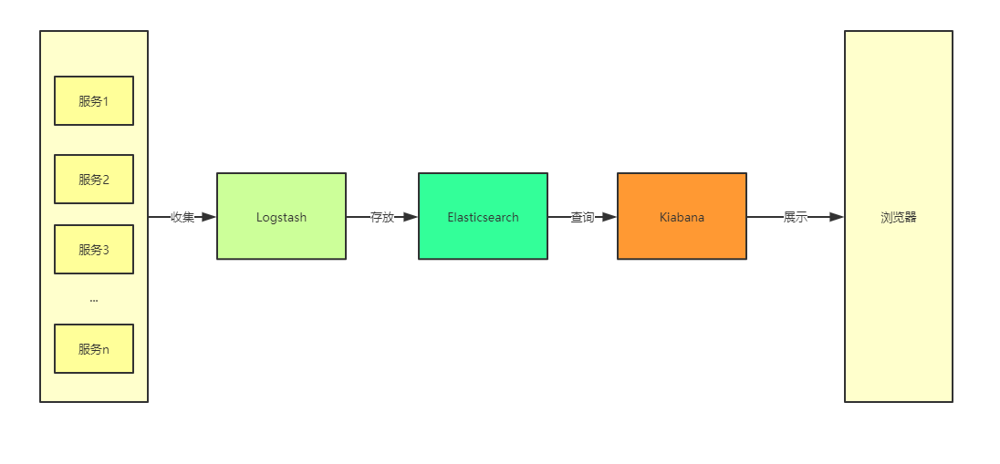
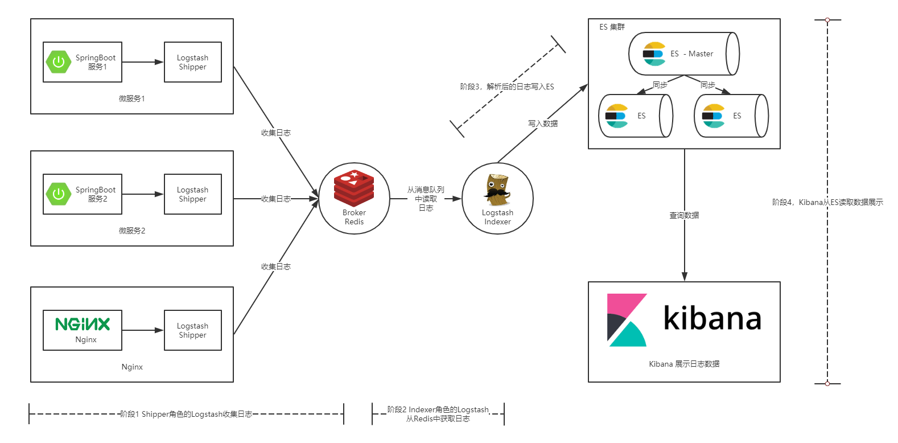
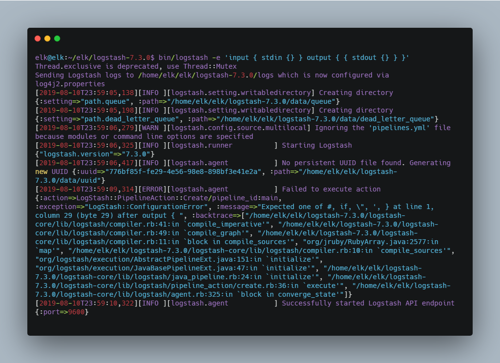
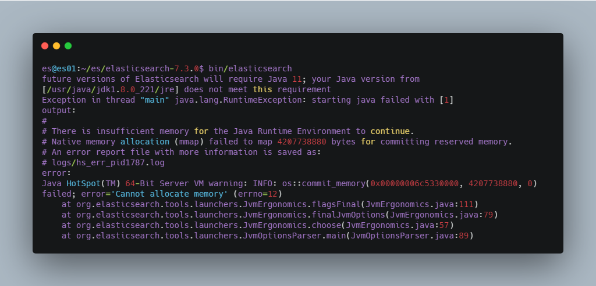
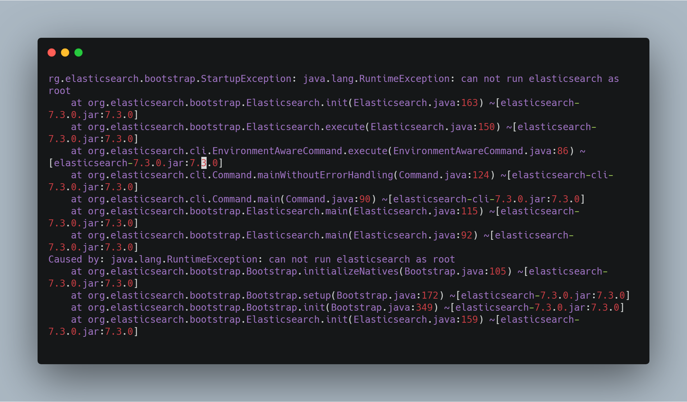
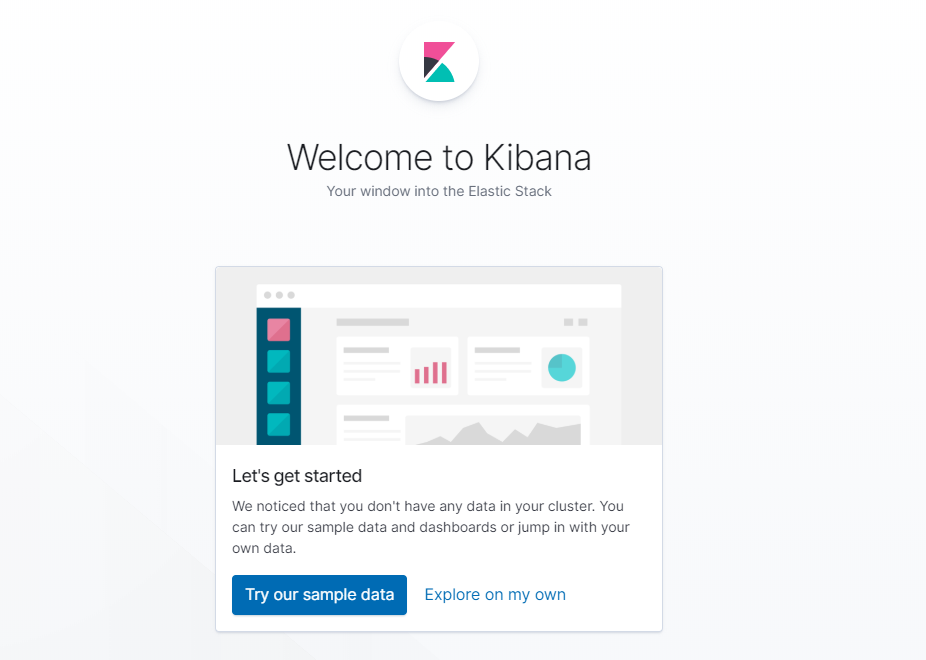
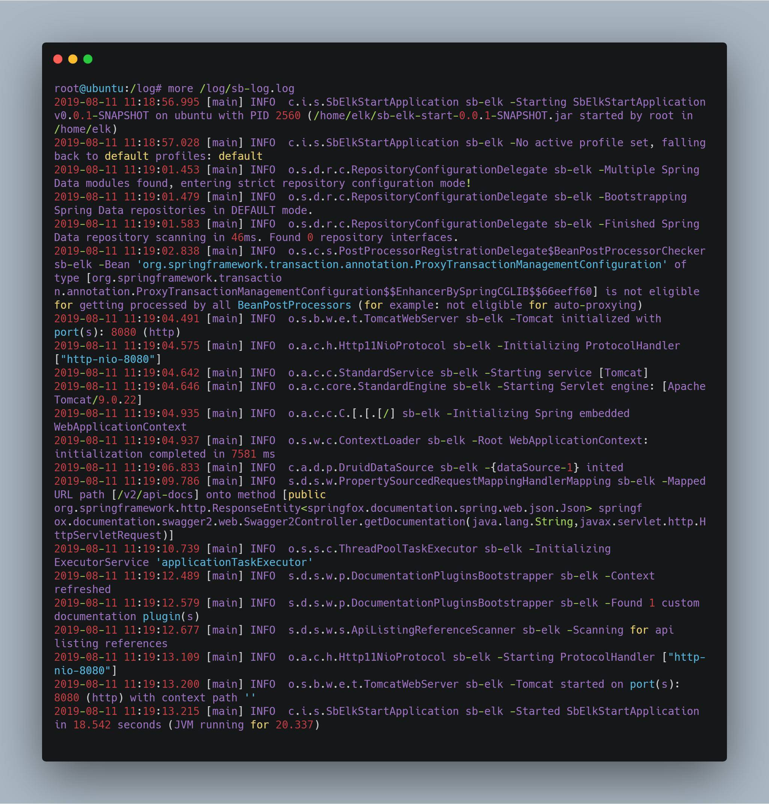
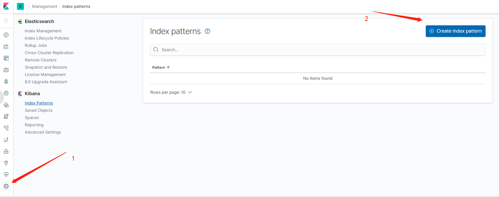
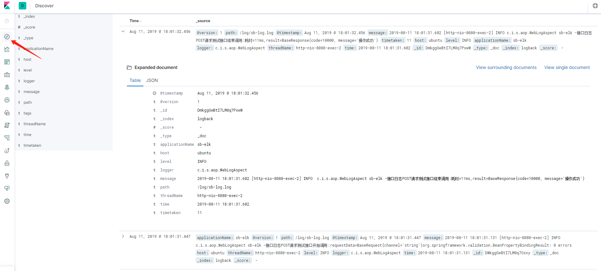
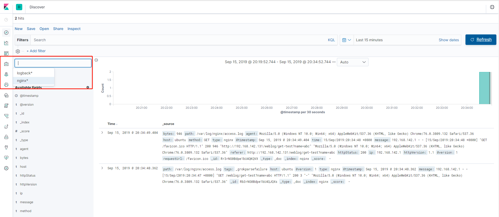

# 搭建 ELK 实时日志平台并在 Spring Boot 和 Nginx 项目中使用
了解 ELK 实时日志平台的运行原理并实践其搭建和使用

**标签:** DevOps,Spring,分析

[原文链接](https://developer.ibm.com/zh/articles/build-elk-and-use-it-for-springboot-and-nginx/)

甘 朝阳

发布: 2019-10-21

* * *

在排查线上异常的过程中，查询日志总是必不可缺的一部分。现今大多采用的微服务架构，日志被分散在不同的机器上，使得日志的查询变得异常困难。工欲善其事，必先利其器。如果此时有一个统一的实时日志分析平台，那可谓是雪中送碳，必定能够提高我们排查线上问题的效率。本文带您了解一下开源的实时日志分析平台 ELK 的搭建及使用。

## ELK 简介

ELK 是一个开源的实时日志分析平台，它主要由 Elasticsearch、Logstash 和 Kiabana 三部分组成。

### Logstash

Logstash 主要用于收集服务器日志，它是一个开源数据收集引擎，具有实时管道功能。Logstash 可以动态地将来自不同数据源的数据统一起来，并将数据标准化到您所选择的目的地。

Logstash 收集数据的过程主要分为以下三个部分：

- 输入：数据（包含但不限于日志）往往都是以不同的形式、格式存储在不同的系统中，而 Logstash 支持从多种数据源中收集数据（File、Syslog、MySQL、消息中间件等等）。
- 过滤器：实时解析和转换数据，识别已命名的字段以构建结构，并将它们转换成通用格式。
- 输出：Elasticsearch 并非存储的唯一选择，Logstash 提供很多输出选择。

### Elasticsearch

Elasticsearch （ES）是一个分布式的 Restful 风格的搜索和数据分析引擎，它具有以下特点：

- 查询：允许执行和合并多种类型的搜索 — 结构化、非结构化、地理位置、度量指标 — 搜索方式随心而变。
- 分析：Elasticsearch 聚合让您能够从大处着眼，探索数据的趋势和模式。
- 速度：很快，可以做到亿万级的数据，毫秒级返回。
- 可扩展性：可以在笔记本电脑上运行，也可以在承载了 PB 级数据的成百上千台服务器上运行。
- 弹性：运行在一个分布式的环境中，从设计之初就考虑到了这一点。
- 灵活性：具备多个案例场景。支持数字、文本、地理位置、结构化、非结构化，所有的数据类型都欢迎。

### Kibana

Kibana 可以使海量数据通俗易懂。它很简单，基于浏览器的界面便于您快速创建和分享动态数据仪表板来追踪 Elasticsearch 的实时数据变化。其搭建过程也十分简单，您可以分分钟完成 Kibana 的安装并开始探索 Elasticsearch 的索引数据 — 没有代码、不需要额外的基础设施。

对于以上三个组件在 [《ELK 协议栈介绍及体系结构》](https://www.ibm.com/developerworks/cn/opensource/os-cn-elk/index.html) 一文中有具体介绍，这里不再赘述。

在 ELK 中，三大组件的大概工作流程如下图所示，由 Logstash 从各个服务中采集日志并存放至 Elasticsearch 中，然后再由 Kiabana 从 Elasticsearch 中查询日志并展示给终端用户。

**图 1\. ELK 的大致工作流程**



## ELK 实现方案

通常情况下我们的服务都部署在不同的服务器上，那么如何从多台服务器上收集日志信息就是一个关键点了。本篇文章中提供的解决方案如下图所示：

**图 2\. 本文提供的 ELK 实现方案**



如上图所示，整个 ELK 的运行流程如下：

1. 在微服务（产生日志的服务）上部署一个 Logstash，作为 Shipper 角色，主要负责对所在机器上的服务产生的日志文件进行数据采集，并将消息推送到 Redis 消息队列。
2. 另用一台服务器部署一个 Indexer 角色的 Logstash，主要负责从 Redis 消息队列中读取数据，并在 Logstash 管道中经过 Filter 的解析和处理后输出到 Elasticsearch 集群中存储。
3. Elasticsearch 主副节点之间数据同步。
4. 单独一台服务器部署 Kibana 读取 Elasticsearch 中的日志数据并展示在 Web 页面。

通过这张图，相信您已经大致清楚了我们将要搭建的 ELK 平台的工作流程，以及所需组件。下面就让我们一起开始搭建起来吧。

## ELK 平台搭建

本节主要介绍搭建 ELK 日志平台，包括安装 Indexer 角色的 Logstash，Elasticsearch 以及 Kibana 三个组件。完成本小节，您需要做如下准备：

1. 一台 Ubuntu 机器或虚拟机，作为入门教程，此处省略了 Elasticsearch 集群的搭建，且将 Logstash(Indexer)、Elasticsearch 以及 Kibana 安装在同一机器上。
2. 在 Ubuntu 上安装 JDK，注意 Logstash 要求 JDK 在 1.7 版本以上，具体在 Ubuntu 上安装 JDK 的方法，可以参考 [“在 Ubuntu 上安装 JDK1.8”](https://itweknow.cn/blog-site/posts/2f849d53.html) 这篇文字。
3. Logstash、Elasticsearch、Kibana 安装包，您可以在 [此页面](https://www.elastic.co/cn/downloads/) 下载。

### 安装 Logstash

1. 解压压缩包：


    ```
    tar -xzvf logstash-7.3.0.tar.gz

    ```


    Show moreShow more icon

2. 简单用例测试，进入到解压目录，并启动一个将控制台输入输出到控制台的管道。


    ```
    cd logstash-7.3.0
    elk@elk:~/elk/logstash-7.3.0$ bin/logstash -e 'input { stdin {} } output { { stdout {} } }'

    ```


    Show moreShow more icon

    看到如下日志就意味着 Logstash 启动成功。

    **图 3\. Logstash 启动成功日志**

    

3. 在控制台输入 `Hello Logstash` ，看到如下效果代表 Logstash 安装成功。

    **清单 1\. 验证 Logstash 是否启动成功**


    ```
    Hello Logstash
    {
        "@timestamp" => 2019-08-10T16:11:10.040Z,
              "host" => "elk",
          "@version" => "1",
           "message" => "Hello Logstash"
    }

    ```


    Show moreShow more icon


### 安装 Elasticsearch

1. 解压安装包：


    ```
    tar -xzvf elasticsearch-7.3.0-linux-x86_64.tar.gz

    ```


    Show moreShow more icon

2. 启动 Elasticsearch：


    ```
    cd elasticsearch-7.3.0/
    bin/elasticsearch

    ```


    Show moreShow more icon

    在启动 Elasticsearch 的过程中我遇到了两个问题在这里列举一下，方便大家排查。

    **问题一** ：内存过小，如果您的机器内存小于 Elasticsearch 设置的值，就会报下图所示的错误。解决方案是，修改 `elasticsearch-7.3.0/config/jvm.options` 文件中的如下配置为适合自己机器的内存大小，若修改后还是报这个错误，可重新连接服务器再试一次。

    **图 4\. 内存过小导致 Elasticsearch 启动报错**

    

    **问题二** ，如果您是以 `root` 用户启动的话，就会报下图所示的错误。解决方案自然就是添加一个新用户启动 Elasticsearch，至于添加新用户的方法网上有很多，这里就不再赘述。

    **图 5\. Root 用户启动 Elasticsearch 报错**

    

3. 启动成功后，另起一个会话窗口执行 `curl http://localhost:9200` 命令，如果出现如下结果，则代表 Elasticsearch 安装成功。

    **清单 2\. 检查 Elasticsearch 是否启动成功**


    ```
    elk@elk:~$ curl http://localhost:9200
    {
    "name" : "elk",
    "cluster_name" : "elasticsearch",
    "cluster_uuid" : "hqp4Aad0T2Gcd4QyiHASmA",
    "version" : {
        "number" : "7.3.0",
        "build_flavor" : "default",
        "build_type" : "tar",
        "build_hash" : "de777fa",
        "build_date" : "2019-07-24T18:30:11.767338Z",
        "build_snapshot" : false,
        "lucene_version" : "8.1.0",
        "minimum_wire_compatibility_version" : "6.8.0",
        "minimum_index_compatibility_version" : "6.0.0-beta1"
    },
    "tagline" : "You Know, for Search"
    }

    ```


    Show moreShow more icon


### 安装 Kibana

1. 解压安装包：


    ```
    tar -xzvf kibana-7.3.0-linux-x86_64.tar.gz

    ```


    Show moreShow more icon

2. 修改配置文件 `config/kibana.yml` ，主要指定 Elasticsearch 的信息。

    **清单 3\. Kibana 配置信息**


    ```
    #Elasticsearch主机地址
    elasticsearch.hosts: "http://ip:9200"
    # 允许远程访问
    server.host: "0.0.0.0"
    # Elasticsearch用户名 这里其实就是我在服务器启动Elasticsearch的用户名
    elasticsearch.username: "es"
    # Elasticsearch鉴权密码 这里其实就是我在服务器启动Elasticsearch的密码
    elasticsearch.password: "es"

    ```


    Show moreShow more icon

3. 启动 Kibana：


    ```
    cd kibana-7.3.0-linux-x86_64/bin
    ./kibana

    ```


    Show moreShow more icon

4. 在浏览器中访问 `http://ip:5601` ，若出现以下界面，则表示 Kibana 安装成功。

    **图 6\. Kibana 启动成功界面**

    


ELK 日志平台安装完成后，下面我们就将通过具体的例子来看下如何使用 ELK，下文将分别介绍如何将 Spring Boot 日志和 Nginx 日志交由 ELK 分析。

## 在 Spring Boot 中使用 ELK

首先我们需要创建一个 Spring Boot 的项目，之前我写过一篇文章介绍 [如何使用 AOP 来统一处理 Spring Boot 的 Web 日志](https://www.ibm.com/developerworks/cn/java/j-spring-boot-aop-web-log-processing-and-distributed-locking/index.html) ，本文的 Spring Boot 项目就建立在这篇文章的基础之上，源码可以 [点击这里](https://github.com/ganchaoyang/spring-tutorial/tree/master/sb-elk-start) 获取。

### 修改并部署 Spring Boot 项目

1. 在项目 `resources` 目录下创建 `spring-logback.xml` 配置文件。

    **清单 4\. Spring Boot 项目 Logback 的配置**


    ```
    <?xml version="1.0" encoding="UTF-8"?>
    <configuration debug="false">
        <contextName>Logback For demo Mobile</contextName>
        <property name="LOG_HOME" value="/log" />
        <springProperty scope="context" name="appName" source="spring.application.name"
                        defaultValue="localhost" />
        ...

        <appender name="ROLLING_FILE" class="ch.qos.logback.core.rolling.RollingFileAppender">
            ...
            <encoder class="ch.qos.logback.classic.encoder.PatternLayoutEncoder">
                <pattern>%d{yyyy-MM-dd HH:mm:ss.SSS} [%thread] %-5level %logger{25} ${appName} -%msg%n</pattern>
            </encoder>
            ...
        </appender>
        ...
    </configuration>

    ```


    Show moreShow more icon

    以上内容省略了很多内容，您可以在源码中获取。在上面的配置中我们定义了一个名为 `ROLLING_FILE` 的 `Appender` 往日志文件中输出指定格式的日志。而上面的 `pattern` 标签正是具体日志格式的配置，通过上面的配置，我们指定输出了时间、线程、日志级别、logger（通常为日志打印所在类的全路径）以及服务名称等信息。

2. 将项目打包，并部署到一台 Ubuntu 服务器上。

    **清单 5\. 打包并部署 Spring Boot 项目**


    ```
    # 打包命令
    mvn package -Dmaven.test.skip=true
    # 部署命令
    java -jar sb-elk-start-0.0.1-SNAPSHOT.jar

    ```


    Show moreShow more icon

3. 查看日志文件， `logback` 配置文件中我将日志存放在 `/log/sb-log.log` 文件中，执行 `more /log/sb-log.log` 命令，出现以下结果表示部署成功。

    **图 7\. Spring Boot 日志文件**

    


### 配置 Shipper 角色 Logstash

Spring Boot 项目部署成功之后，我们还需要在当前部署的机器上安装并配置 Shipper 角色的 Logstash。Logstash 的安装过程在 ELK 平台搭建小节中已有提到，这里不再赘述。安装完成后，我们需要编写 Logstash 的配置文件，以支持从日志文件中收集日志并输出到 Redis 消息管道中，Shipper 的配置如下所示。

**清单 6\. Shipper 角色的 Logstash 的配置**

```
input {
    file {
        path => [
            # 这里填写需要监控的文件
            "/log/sb-log.log"
        ]
    }
}

output {
    # 输出到redis
    redis {
        host => "10.140.45.190"   # redis主机地址
        port => 6379              # redis端口号
        db => 8                   # redis数据库编号
        data_type => "channel"    # 使用发布/订阅模式
        key => "logstash_list_0"  # 发布通道名称
    }
}

```

Show moreShow more icon

其实 Logstash 的配置是与前面提到的 Logstash 管道中的三个部分（输入、过滤器、输出）一一对应的，只不过这里我们不需要过滤器所以就没有写出来。上面配置中 Input 使用的数据源是文件类型的，只需要配置上需要收集的本机日志文件路径即可。Output 描述数据如何输出，这里配置的是输出到 Redis。

Redis 的配置 `data_type` 可选值有 `channel` 和 `list` 两个。 `channel` 是 Redis 的发布/订阅通信模式，而 `list` 是 Redis 的队列数据结构，两者都可以用来实现系统间有序的消息异步通信。 `channel` 相比 `list` 的好处是，解除了发布者和订阅者之间的耦合。举个例子，一个 Indexer 在持续读取 Redis 中的记录，现在想加入第二个 Indexer，如果使用 `list` ，就会出现上一条记录被第一个 Indexer 取走，而下一条记录被第二个 Indexer 取走的情况，两个 Indexer 之间产生了竞争，导致任何一方都没有读到完整的日志。 `channel` 就可以避免这种情况。这里 Shipper 角色的配置文件和下面将要提到的 Indexer 角色的配置文件中都使用了 `channel` 。

### 配置 Indexer 角色 Logstash

配置好 Shipper 角色的 Logstash 后，我们还需要配置 Indexer 角色 Logstash 以支持从 Redis 接收日志数据，并通过过滤器解析后存储到 Elasticsearch 中，其配置内容如下所示。

**清单 7\. Indexer 角色的 Logstash 的配置**

```
input {
    redis {
        host      => "192.168.142.131"    # redis主机地址
        port      => 6379               # redis端口号
        db        => 8                  # redis数据库编号
        data_type => "channel"          # 使用发布/订阅模式
        key       => "sb-logback"  # 发布通道名称
    }
}

filter {
     #定义数据的格式
     grok {
       match => { "message" => "%{TIMESTAMP_ISO8601:time} \[%{NOTSPACE:threadName}\] %{LOGLEVEL:level}  %{DATA:logger} %{NOTSPACE:applicationName} -(?:.*=%{NUMBER:timetaken}ms|)"}
     }
}

output {
    stdout {}
    elasticsearch {
        hosts => "localhost:9200"
        index => "logback"
}
}

```

Show moreShow more icon

与 Shipper 不同的是，Indexer 的管道中我们定义了过滤器，也正是在这里将日志解析成结构化的数据。下面是我截取的一条 `logback` 的日志内容：

**清单 8\. Spring Boot 项目输出的一条日志**

```
2019-08-11 18:01:31.602 [http-nio-8080-exec-2] INFO  c.i.s.aop.WebLogAspect sb-elk -接口日志
POST请求测试接口结束调用:耗时=11ms,result=BaseResponse{code=10000, message='操作成功'}

```

Show moreShow more icon

在 Filter 中我们使用 Grok 插件从上面这条日志中解析出了时间、线程名称、Logger、服务名称以及接口耗时几个字段。Grok 又是如何工作的呢？

1. `message` 字段是 Logstash 存放收集到的数据的字段， `match = {"message" => ...}` 代表是对日志内容做处理。
2. Grok 实际上也是通过正则表达式来解析数据的，上面出现的 `TIMESTAMP_ISO8601` 、 `NOTSPACE` 等都是 Grok 内置的 `patterns` ，具体 Grok 中内置了哪些 `patterns` 可以 [点击这里查看](https://github.com/elastic/logstash/blob/v1.4.2/patterns/grok-patterns) 。
3. 我们编写的解析字符串可以使用 [Grok Debugger](http://grokdebug.herokuapp.com/) 来测试是否正确，这样避免了重复在真实环境中校验解析规则的正确性。

### 查看效果

经过上面的步骤，我们已经完成了整个 ELK 平台的搭建以及 Spring Boot 项目的接入。下面我们按照以下步骤执行一些操作来看下效果。

1. 启动 Elasticsearch，启动命令在 [ELK 平台搭建](#elk-平台搭建) 小节中有提到，这里不赘述（Kibana 启动同）。
2. 启动 Indexer 角色的 Logstash。


    ```
    # 进入到 Logstash 的解压目录，然后执行下面的命令
    bin/logstash -f indexer-logstash.conf

    ```


    Show moreShow more icon

3. 启动 Kibana。

4. 启动 Shipper 角色的 Logstash。


    ```
    # 进入到 Logstash 的解压目录，然后执行下面的命令
                bin/logstash -f shipper-logstash.conf

    ```


    Show moreShow more icon

5. 调用 Spring Boot 接口，此时应该已经有数据写入到 ES 中了。

6. 在浏览器中访问 `http://ip:5601` ，打开 Kibana 的 Web 界面，并且如下图所示添加 `logback` 索引。

    **图 8\. 在 Kibana 中添加 Elasticsearch 索引**

    

7. 进入 **Discover** 界面，选择 `logback` 索引，就可以看到日志数据了，如下图所示。

    **图 9\. ELK 日志查看**

    


## 在 Nginx 中使用 ELK

相信通过上面的步骤您已经成功的搭建起了自己的 ELK 实时日志平台，并且接入了 Logback 类型的日志。但是实际场景下，几乎不可能只有一种类型的日志，下面我们就再在上面步骤的基础之上接入 Nginx 的日志。当然这一步的前提是我们需要在服务器上安装 Nginx，具体的安装过程网上有很多介绍，这里不再赘述。查看 Nginx 的日志如下（Nginx 的访问日志默认在 `/var/log/nginx/access.log` 文件中）。

**清单 9\. Nginx 的访问日志**

```
192.168.142.1 - - [17/Aug/2019:21:31:43 +0800] "GET /weblog/get-test?name=elk HTTP/1.1"
200 3 "http://192.168.142.131/swagger-ui.html" "Mozilla/5.0 (Windows NT 10.0; Win64; x64)
AppleWebKit/537.36 (KHTML, like Gecko) Chrome/76.0.3809.100 Safari/537.36"

```

Show moreShow more icon

同样，我们需要为此日志编写一个 Grok 解析规则，如下所示：

**清单 10\. 针对 Nginx 访问日志的 Grok 解析规则**

```
%{IPV4:ip} \- \- \[%{HTTPDATE:time}\] "%{NOTSPACE:method} %{DATA:requestUrl}
HTTP/%{NUMBER:httpVersion}" %{NUMBER:httpStatus} %{NUMBER:bytes}
"%{DATA:referer}" "%{DATA:agent}"

```

Show moreShow more icon

完成上面这些之后的关键点是 Indexer 类型的 Logstash 需要支持两种类型的输入、过滤器以及输出，如何支持呢？首先需要给输入指定类型，然后再根据不同的输入类型走不同的过滤器和输出，如下所示（篇幅原因，配置文件在此没有全部展示，可以 [点击此处获取](https://github.com/ganchaoyang/spring-tutorial/blob/master/sb-elk-start/indexer-logstash.conf) ）。

**清单 11\. 支持两种日志输入的 Indexer 角色的 Logstash 配置**

```
input {
    redis {
        type      => "logback"
        ...
    }
    redis {
       type       => "nginx"
       ...
    }
}

filter {
     if [type] == "logback" {
         ...
     }
     if [type] == "nginx" {
         ...
     }
}

output {
    if [type] == "logback" {
        ...
    }
    if [type] == "nginx" {
       ...
    }
}

```

Show moreShow more icon

我的 Nginx 与 Spring Boot 项目部署在同一台机器上，所以还需修改 Shipper 类型的 Logstash 的配置以支持两种类型的日志输入和输出，其配置文件的内容可 [点击这里获取](https://github.com/ganchaoyang/spring-tutorial/tree/master/sb-elk-start) 。以上配置完成后，我们按照 [查看效果](#查看效果) 章节中的步骤，启动 ELK 平台、Shipper 角色的 Logstash、Nginx 以及 Spring Boot 项目,然后在 Kibana 上添加 Nignx 索引后就可同时查看 Spring Boot 和 Nginx 的日志了，如下图所示。

**图 10\. ELK 查看 Nginx 日志**



## ELK 启动

在上面的步骤中，ELK 的启动过程是我们一个一个的去执行三大组件的启动命令的。而且还是在前台启动的，意味着如果我们关闭会话窗口，该组件就会停止导致整个 ELK 平台无法使用，这在实际工作过程中是不现实的，我们剩下的问题就在于如何使 ELK 在后台运行。根据 [《Logstash 最佳实践》](https://doc.yonyoucloud.com/doc/logstash-best-practice-cn/get_start/daemon.html) 一书的推荐，我们将使用 Supervisor 来管理 ELK 的启停。首先我们需要安装 Supervisor，在 Ubuntu 上执行 `apt-get install supervisor` 即可。安装成功后，我们还需要在 Supervisor 的配置文件中配置 ELK 三大组件（其配置文件默认为 `/etc/supervisor/supervisord.conf` 文件）。

**清单 12\. ELK 后台启动**

```
[program:elasticsearch]
environment=JAVA_HOME="/usr/java/jdk1.8.0_221/"
directory=/home/elk/elk/elasticsearch
user=elk
command=/home/elk/elk/elasticsearch/bin/elasticsearch

[program:logstash]
environment=JAVA_HOME="/usr/java/jdk1.8.0_221/"
directory=/home/elk/elk/logstash
user=elk
command=/home/elk/elk/logstash/bin/logstash -f /home/elk/elk/logstash/indexer-logstash.conf

[program:kibana]
environment=LS_HEAP_SIZE=5000m
directory=/home/elk/elk/kibana
user=elk
command=/home/elk/elk/kibana/bin/kibana

```

Show moreShow more icon

按照以上内容配置完成后，执行 `sudo supervisorctl reload` 即可完成整个 ELK 的启动，而且其默认是开机自启。当然，我们也可以使用 `sudo supervisorctl start/stop [program_name]` 来管理单独的应用。

## 结束语

在本教程中，我们主要了解了什么是 ELK，然后通过实际操作和大家一起搭建了一个 ELK 日志分析平台，并且接入了 Logback 和 Nginx 两种日志。文中所涉及到的源代码以及 Logstash 的配置文件您都可以 [在 Github 上找到](https://github.com/ganchaoyang/spring-tutorial/tree/master/sb-elk-start) 。如果您想对本教程做补充的话欢迎发邮件（gancy.programmer@gmail.com）给我或者直接在 Github 上提交 Pull Request。