# 支持向量机的原理和实现
深入了解机器学习

**标签:** 分析

[原文链接](https://developer.ibm.com/zh/articles/machine-learning-hands-on1-svn/)

韩笑琳

发布: 2017-09-26

* * *

本文将介绍机器学习领域经典的支持向量机 SVM 模型，它利用了软间隔最大化、拉格朗日对偶、凸优化、核函数、序列最小优化等方法。支持向量机既可以解决线性可分的分类问题，也可完美解决线性不可分问题。您将看到 SVM 的原理介绍、SVM 实现步骤和详解、SVM 实现代码以及用 SVM 解决实际的分类问题。通过阅读本文，您会对 SVM 的原理了如指掌，并可以自己开发出 SVM 的实现代码。

## 关于机器学习的简介

机器学习是从大量数据中学习出 _特定规律_ 的算法。其中提到的规律有很多种，比如分类、聚类、回归、关联分析等。

**分类** 就是给定大量带标签的数据，计算出未知标签样本的标签取值。如年龄 40 岁以上、工科、研究生以上学历，这类人薪资水平是高收入；年龄 20-30 岁、文科、大专学历，这类人的薪资水平是低收入；现有一位 23 岁大专文科人士，求该人的薪资水平是哪类？根据分类建模，就可以知道这个人的薪资水平很可能是低收入。

**聚类** 是将大量不带标签的数据根据距离聚集成不同的簇，每一簇数据有共同的特征。如电信行业可以根据用户的月长途电话分钟数、上网时长、短信使用数、地理位置、月消费数，将所有用户聚集成有典型特征的簇，聚集出的某簇特征可能是月长途电话分钟数长、上网时间长、地理位置变化不大、月消费数目低，分析可得这类人极有可能是在校大学生，那么电信公司就可以针对这类特定人群制定有针对性的营销策略。

**回归** 是根据特征值、目标变量拟合出特征值与目标变量之间的函数关系，可用来估计特征值对应的目标变量的可能取值。举个简单的例子，某市今年某 100 平米的房子价格是 80 万，某 150 平米房子价格是 120 万，那么某 200 平米的房子价格的取值就可能是 200\*0.8=160 万左右。

**关联分析** 是计算出大量数据之间的频繁项集合。如超市订单中有大量订单同时包含啤酒与尿布，这其中的频繁项就是啤酒和尿布，那么超市就可以针对这个规律对啤酒和尿布进行组合促销活动。

分类算法主要包括 K 近邻、决策树、朴素贝叶斯、逻辑回归、支持向量机、AdaBoost 等；回归主要包括线性回归、岭回归、lasso、树回归等；聚类主要包括 K-Means 以及它的各种变形算法；关联分析主要包括 Apriori、FP-growth 等算法。

支持向量机即 support vector machine(简称 SVM)，是机器学习领域经典的 _分类算法_ 。

## 关于 SVM 的简介

**支持向量** 是距离分类超平面近的那些点，SVM 的思想就是使得支持向量到分类超平面的间隔最大化。出发点很容易理解，距离分类超平面近的那些点到该超平面的间隔最大化代表了该超平面对两类数据的区分度强，不容易出现错分的情况。如图 1 所示，支持向量到超平面 1 的间隔大于支持向量到超平面 2 的间隔，因此超平面 1 优于超平面 2。

##### 图 1\. 两个超平面示例

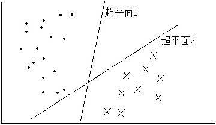

SVM 可以很好得解决 **二分类** 问题，对于 **多分类** 情况，就需要对模型进行改动。如 one-versus-rest 法，这种方法每次选择一个类别作为正样本，剩下其他类别作为负样本，假设一共有 3 个类别，这样相当于训练出了 3 个不同的 SVM。然后将测试数据分别带入 3 个 SVM 模型中，得到的 3 个结果中的最大值则为最终的分类结果。

支持向量到分类超平面的间隔最大化的思路很完美，按这种思路得到的模型理论上是准确度最高的一种模型。但是使用过 SVM 的朋友都知道，调用 SVM 算法的测试准确度并不一定都很高。这其中有很多原因，比如数据预处理的效果、训练集的大小、特征值的选择、参数设置以及核函数的选择等因素。

任何模型都是 **优点** 与 **缺点** 并存的。

SVM 的优点是：

1. 可以解决线性不可分的情况。如图 2 所示，两类数据点根本无法用超平面分隔开;
2. 计算复杂度仅取决于少量支持向量，对于数据量大的数据集计算复杂度低。

SVM 的缺点是：

1. 经典的 SVM 算法仅支持二分类，对于多分类问题需要改动模型;
2. 不支持类别型数据，需在预处理阶段将类别型数据转换成离散型数据。类别型数据即”男”、 “女”这类由字符串表示某类信息的数据，需将这类数据转换成离散型数据如 1、2。

##### 图 2\. 线性不可分问题

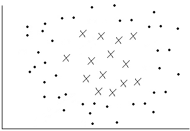

## SVM 基本原理

SVM 原理分为软间隔最大化、拉格朗日对偶、最优化问题求解、核函数、序列最小优化 _SMO_ 等部分。虽然这些名词看起来很晦涩，但是深入探索后就会发现其中的思想并没有那么复杂。

### 软间隔最大化

SVM 的核心思路是最大化支持向量到分隔超平面的间隔。后面所有的推导都是以最大化此间隔为核心思想展开。一般的机器学习问题都是先得到模型的目标函数和约束条件，然后在约束条件下对目标函数求得最优解。因此，我们下面首先需要推导出 SVM 模型的目标函数和约束条件。

既然要最大化间隔，那么回顾下点 x 到超平面(w,b)的距离公式：

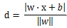

其中超平面的公式为：

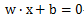

由此可推出点 x 到超平面(w,b)的几何间隔为：

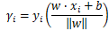

其中 xi 代表第 i 条数据，yi 代表第 i 条数据对应的目标变量的取值，取值有+1 和-1 两种。所以当第 i 条数据被正确分类时，y 取值和 w _x+b 取值的正负一致，几何间隔为正；当被错误分类时，y 取值和 w_ x+b 取值的正负相反，几何间隔为负。

##### 图 3\. 样本数据关于 w\*x+b 的取值符号

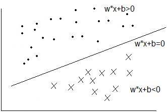

定义几何间隔中最小的为：

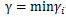

由此，可以得到间隔最大化问题的目标函数：

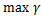

并遵循如下约束条件：

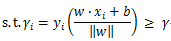

做如下变换：

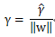

则目标函数转换为：

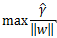

相应的约束条件变为：

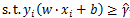

做如下变换：

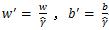

可得目标函数和约束条件变为：

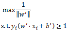

由于 w, b 成倍数变化并不会影响超平面的公式，所以：


此时得到最终的间隔最大化的目标函数和约束条件如下：

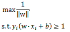

但是，到这里并没有真正得结束。考虑到现实生活中的真实数据，存在一些特异点即 outliers，这些数据点并不满足上面推导出的约束条件，如图 4 所示，图中点 A 就是 outlier 特异点。

##### 图 4\. Outlier 特异点

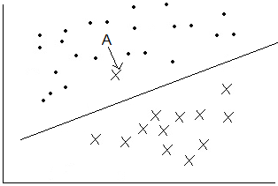

为了解决这种问题，对每个样本点引进一个松弛变量，使得约束条件变为：

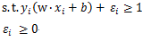

这样给 outlier 的约束条件加上一个变量，使其可以满足大于等于 1 的条件。则相应的目标变量变为：

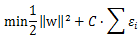

其中 C 为惩罚参数，它的目的是使得目标变量最小即几何间隔最大，且使得松弛变量最小化。加入松弛变量的目标函数就是软间隔最大化。

### 拉格朗日对偶

对于凸二次优化问题，通过引入拉格朗日乘子，将目标函数和约束条件整合到拉格朗日函数中，这样能方便求解最值问题。那么，对每个不等式约束引入拉格朗日乘子，得到拉格朗日函数如下：

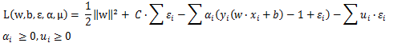

分析可知：

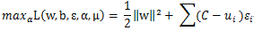

则原最优化问题转换成：

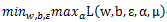

由于原最优化问题直接求解很困难，利用拉格朗日对偶性，可通过求解原最优化问题的对偶问题得到原问题的最优解。原最优化问题的对偶问题为：

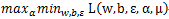

### 最优化问题求解

到此为止，已经将目标函数和约束条件转换成了极大极小化拉格朗日函数的问题了。首先求解关于拉格朗日函数的极小化问题。

对三个变量分别求偏导得：

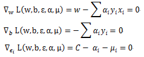

将以上三式带入拉格朗日函数中得：

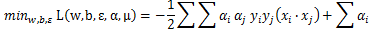

那么极大极小化拉格朗日函数转换成：

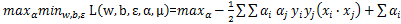

为求解方便，将极大转换成极小得：

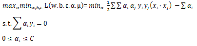

### 核函数

对于线性不可分问题，如图 2 所示，这类问题是无法用超平面划分正负样本数据的。倘若能将超平面换成超曲面，则可以将正负样本正确分类，如图 5 所示。

##### 图 5\. 超曲面分离正负样本

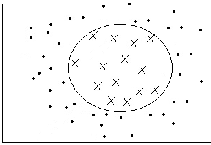

我们知道曲面的公式是：

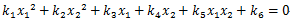

映射到新坐标如下：

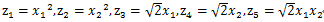

可将超曲面在新坐标下表示成超平面：

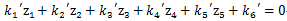

也就是将在二维空间(x1,x2)下线性不可分的问题转换成了在五维空间(z1,z2,z3,z4,z5)下线性可分的问题。

得映射后新坐标下的内积：

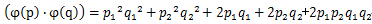

有一核函数如下：

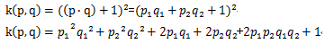

可知

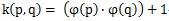

何为核函数？核函数在低维空间中完成了映射到高维空间后的内积运算。这点非常有用，利用核函数，无需先将变量一一映射到高维空间再计算内积，而是简单得在低维空间中利用核函数完成这一操作。为什么说不用一一映射到高维空间很有用呢？原因就在于首先我们无法针对每种情况提供精确的映射函数，再者对于需要映射到无穷维的情况显然无法一一映射完成。

那么为什么是映射到高维后的内积运算呢？这是因为在上节中我们得到了如下目标函数：

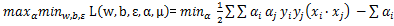

正是因为该目标函数中包含自变量的内积运算，而映射到高维空间后的内积运算又恰好可以通过核函数在低维空间中直接求得，故而有了核函数的由来。较常用的核函数是高斯核，高斯核可以将低维空间映射到无穷维。

运用核函数后，最优化问题的目标函数和约束条件变为：

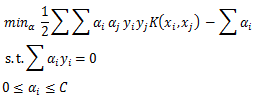

### 序列最小优化 (Sequential minimal optimization)

到目前为止，优化问题已经转化成了一个包含 N 个 alpha 自变量的目标变量和两个约束条件。由于目标变量中自变量 alpha 有 N 个，为了便与求解，每次选出一对自变量 alpha，然后求目标函数关于其中一个 alpha 的偏导，这样就可以得到这一对 alpha 的新值。给这一对 alpha 赋上新值，然后不断重复选出下一对 alpha 并执行上述操作，直到达到最大迭代数或没有任何自变量 alpha 再发生变化为止，这就是 SMO 的基本思想。说直白些，SMO 就是在约束条件下对目标函数的优化求解算法。

为何不能每次只选一个自变量进行优化？那是因为只选一个自变量 alpha 的话，会违反第一个约束条件，即所有 alpha 和 y 值乘积的和等于 0。

下面是详细的 SMO 过程。假设选出了两个自变量分别是 alpha1 和 alpha2，除了这两个自变量之外的其他自变量保持固定，则目标变量和约束条件转化为：

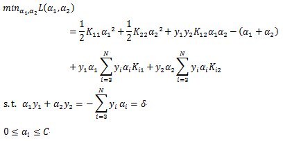

将约束条件中的 alpha1 用 alpha2 表示，并代入目标函数中，则将目标函数转化成只包含 alpha2 的目标函数，让该目标函数对 alpha2 的偏导等于 0：

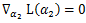

可求得 alpha2 未经修剪的值：

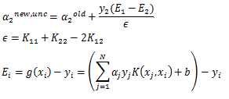

之所以说 alpha2 是未经修剪的值是因为所有 alpha 都必须满足大于等于 0 且小于等于 C 的约束条件，用此约束条件将 alpha2 进行修剪，修剪过程如下：

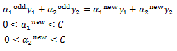

由此得：

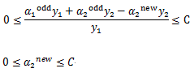

分两种情况讨论：

情况 1.当 y1 等于 y2 时，有：

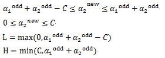

情况 2.当 y1 不等于 y2 时，有：

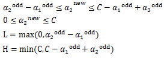

修剪后，可得 alpha2 的取值如下：

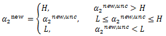

由 alpha2 和 alpha1 的关系，可得：

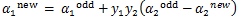

在完成 alpha1 和 alpha2 的一轮更新后，需要同时更新 b 的值，当 alpha1 更新后的值满足 0<alpha1<C 时，由 KKT 条件得：


由于篇幅有限，在此就不把推导过程一一列举，可得：

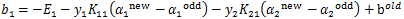

同样的道理，当 alpha2 更新后的值满足 0<alpha1<C 时可得：

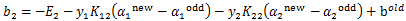

若更新后的 alpha1 和 alpha2 同时满足大于 0 且小于 C 的条件，那么 b 就等于 b1 等于 b2;否则，b 取 b1 和 b2 的中点。

那么问题来了，如何选择 alpha1 和 alpha2 呢？

选择违背下列 KKT 条件推导结果的 alpha 作为 alpha1：

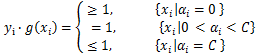

为了让每次变化尽可能大，alpha2 的选择满足如下式子最大，即步长最大化：

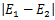

其中 E 是上面提到过的预测值和真实值差值的绝对值，也就是误差值。

按上述方法不断选择一对 alpha 并更新，直到达到最大迭代次数或所有 alpha 都不再变化，则停止迭代。有朋友就会问，求出 alpha 之后呢？如何判断新样本数据属于 1 还是-1 呢？

别忘了，在最优化求解一节，我们得到了如下：

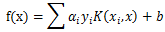

若 f(x)大于 0，则新样本数据属于 1；否则，新样本数据属于-1。

可以见得，求出 alpha 后，所有问题都迎刃而解了。

## 实现步骤: 自己动手实现 SVM

以上都为推导部分，实现代码主要围绕对目标函数的优化求解上，即序列最小优化算法部分。

##### 清单 1\. alpha1 选择

```
yI = diyObj.yMat[alphaI]
    EI = calcE(alphaI, diyObj)
    diyObj.E[alphaI] = [1, EI]
    # if alpha1 violates KKT
if((yI * EI > diyObj.toler and diyObj.alphas[alphaI] > 0) or
(   yI * EI < - diyObj.toler and diyObj.alphas[alphaI] < diyObj.C)):

```

Show moreShow more icon

选择违背 KKT 条件推导结果的 alpha 作为 alpha1，本代码中 diyObj.toler 取值为 0.0001。

##### 清单 2\. alpha2 选择

```
for j in nonzeroEIndex:
    if alphaI == j: continue
    EJtemp = calcE(j, diyObj)
    deltaE = abs(EI - EJtemp)
    if(deltaE > maxDelta):
        maxDelta = deltaE
        alphaJ = j
        EJ = EJtemp

```

Show moreShow more icon

alpha2 的选择遵循步长最大化，即 E 值与 alpha1 的 E 值相差最大的 alpha 选为 alpha2。

##### 清单 3\. alpha1,alpha2,b 求解

```
alpha1old = diyObj.alphas[alphaI].copy()
alpha2old = diyObj.alphas[alphaJ].copy()
eta = diyObj.K[alphaI,alphaI] + diyObj.K[alphaJ, alphaJ] - 2 * diyObj.K[alphaI, alphaJ]
if eta <= 0: return 0
    alpha2newUnclip = alpha2old + yJ * (EI - EJ) / eta
if(yI == yJ):
    L = max(0, alpha1old + alpha2old - diyObj.C)
    H = min(diyObj.C, alpha1old + alpha2old)
else:
    L = max(0, alpha2old - alpha1old)
    H = min(diyObj.C, diyObj.C - alpha1old + alpha2old)
if L == H: return 0
    alpha2new = clipAlpha(alpha2newUnclip, L, H)
    if abs(alpha2new - alpha2old) < 0.00001: return 0
    alpha1new = alpha1old + yI * yJ * (alpha2old - alpha2new)
    b1new = - EI - yI * diyObj.K[alphaI,alphaI] * (alpha1new - alpha1old) \
            - yJ * diyObj.K[alphaJ, alphaI] * (alpha2new - alpha2old) + diyObj.b
    b2new = - EJ - yI * diyObj.K[alphaI,alphaJ] * (alpha1new - alpha1old) \
            - yJ * diyObj.K[alphaJ, alphaJ] * (alpha2new - alpha2old) + diyObj.b
    b = calcb(b1new, b2new)

```

Show moreShow more icon

先算出 alpha 取值的上下界，求出 alpha2 后用上下界进行裁剪。用裁剪后的 alpha2 新值计算 alpha1 新值。b 的取值由 b1 和 b2 综合决定。

##### 清单 4\. 核函数

```
def transfer2Kernel(X, Xi, kernelParam):
    m = shape(X)[0]
    Ktemp = mat(zeros((m, 1)))
    if kernelParam[0]=="rbf":
        for i in range(m):
            xdelta = X[i,:] - Xi
            Ktemp[i] = xdelta * xdelta.T
        Ktemp = exp(-Ktemp/kernelParam[1]**2)
    else: raise NameError("undefined kernel name!")
    return Ktemp

```

Show moreShow more icon

本代码中使用高斯核完成从低维到高维的映射。

### 代码下载 (code downloads)

本文所有 SVM 实现代码可在文末下载。

## 本文数据集简介

###### 图 6\. 数据集样例

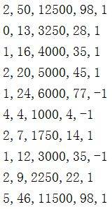

数据集是献血中心关于某人是否在 2007 年三月献血的数据。前四列分别代表距离上次献血的月份数、总献血次数、总献血毫升数、距离第一次献血的月份数。最后一列代表是否在 2007 年三月献血，1 代表是，-1 代表否。本数据集共 748 条。

## 应用示例: 应用实现的 SVM 解决实际问题

##### 清单 5\. 用 SVM 解决实际问题

```
dataMat,yMat = loadDataset("bloodTransfusion.txt")
alphas,b = smo(dataMat, yMat, 200, 0.0001,100, ("rbf",20))
#yi of testData: 1,1,1,-1,-1,-1,-1,1,1,-1
testData = [[2,50,12500,98],[0,13,3250,28],[1,16,4000,35],[1,24,6000,77],[4,4,1000,4]
         ,[1,12,3000,35],[4,23,5750,58],[2,7,1750,14],[2,10,2500,28],[1,13,3250,47]]
m, n = shape(testData)
testmat = mat(testData)
for i in range(m):
    kernelEval = transfer2Kernel(mat(dataMat), testmat[i,:],("rbf",20))
    predict = kernelEval.T * multiply(mat(yMat).transpose(), alphas) + b
    print(sign(predict))

```

Show moreShow more icon

用 bloodTransfusion 数据集训练 SVM 模型，得到该模型的 alpha 矩阵和 b 值。然后将 10 条测试数据输入模型中，输出结果为 10 条测试数据对应的预测值。

##### 表 1\. 应用本文实现的 SVM 对 10 条数据进行预测的结果示例

**特征值****预测值****真实值**[2,50,12500,98]11[0,13,3250,28]11[1,16,4000,35]-11[1,24,6000,77]-1-1[4,4,1000,4]-1-1[1,12,3000,35]-1-1[4,23,5750,58]-1-1[2,7,1750,14]-11[2,10,2500,28]11[1,13,3250,47]-1-1

从表中可以看出，8 条数据分类正确，2 条数据分类有误。要想提高模型准确度，可以修改模型参数如最大迭代数、C 惩罚系数、高斯核参数等。

## 结束语

本文首先介绍了机器学习的体系框架，接着详细深入地讲解了 SVM 的基本原理，分别为软间隔最大化、拉格朗日对偶、最优化问题求解、核函数和序列最小优化等。通过代码样例，介绍了在自己动手实现 SVM 模型时的思路。最后，用献血中心的数据展示了如何应用 SVM 解决实际问题。本文的内容不算高深，读者如果能静下心来细读，将会有很大收获。如若文中有纰漏的地方，欢迎广大读者留言指正，也很期待在接下来的机器学习系列文章中继续和志同道合的读者相遇。

## 参考资源

本文用到的参考文献如下：

- 参考李航著《统计学习方法》，了解 SVM 基本原理。
- 参考 Peter Harrington 著《机器学习实战》，了解 SVM 代码框架。
- 参考周志华著《机器学习》，了解 SVM 基本思路。
- [http://archive.ics.uci.edu/ml/datasets/Blood+Transfusion+Service+Center](http://archive.ics.uci.edu/ml/datasets/Blood+Transfusion+Service+Center) ，本文所用数据集网址。

## Download

[svm\_code\_new.zip](https://www.ibm.com/developerworks/cn/analytics/library/machine-learning-hands-on1-svn/svm_code_new.zip)