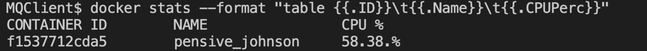
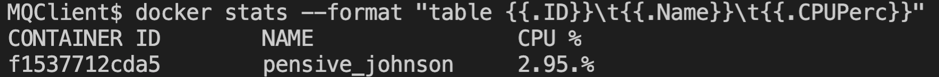
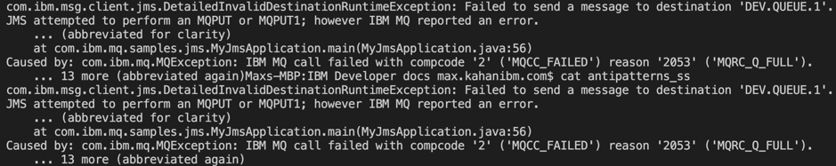
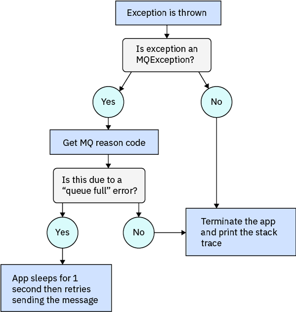
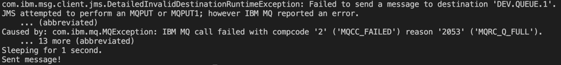

# 改进 IBM MQ 应用程序
提高慢速应用程序的运行速度，处理丢失的消息并降低 CPU 使用率

**标签:** IBM MQ

[原文链接](https://developer.ibm.com/zh/articles/mq-best-practices/)

Max Kahan

发布: 2020-07-27

* * *

您在开发应用程序时所做的选择将决定您在之后的工作中是得心应手还是束手无策。

在本文中，将介绍开发者经常遇到的三个常见陷阱以及如何避开这三个陷阱。

本文中示例的代码是针对 JMS 2.0 API 编写的，而队列管理器是在 Docker 容器中运行的。（如果您尚未准备好，查看“ [准备、设置和连接容器](/zh/tutorials/mq-connect-app-queue-manager-containers/)”教程，以便设置在 Docker 容器中运行的队列管理器。）要深入了解 JMS 2.0 API 与 IBM MQ，您可以完成“ [编写并运行第一个 IBM MQ JMS 应用程序](/zh/tutorials/mq-develop-mq-jms/)”教程。 但是，本文中的讨论内容适用于所有语言和 API。

我们将涵盖以下常见问题：

- [优化慢速应用程序](#1-optimizing-a-slow-application)
- [避免在接收消息时 CPU 使用率过高](#2-avoiding-high-cpu-usage-when-receiving-messages)
- [通过捕获异常来避免消息丢失和应用程序崩溃](#3-avoiding-lost-messages-and-crashing-apps-by-catching-exceptions)

## 1\. 优化慢速应用程序

我们很容易这样想：发送的每条消息都需要使用自己的会话和连接（在 JMS 2.0 规范中统称为“上下文”）、生产者和目标对象等，这似乎很合理？但我们不需要这样做。我们可以重复使用这些对象来发送多条消息。

例如，假设您要向某个队列发送 5000 条消息。如果创建了 5000 组连接对象，那么发送如此多的消息将需要很长的时间。

实际上，整个过程中最耗时的部分是创建这些连接对象；相比之下，消息的发送要快得多。

### 一个可行示例

我们来看一下这个示例。以下代码显示了通过 MQ 发送一些消息的 JMS 2.0 应用程序的一部分。（不要复制和使用以下代码！）

```
for (int i = 1; i <= 5000; i++) {
    context = cf.createContext();
    destination = context.createQueue("queue:///"+ QUEUE_NAME);
    TextMessage message = context.createTextMessage("This is message number " + i + ".\n");
    producer = context.createProducer();
    producer.send(destination, message);
    context.close();
}

```

Show moreShow more icon

该应用程序将用于创建新上下文（会话和连接）、生产者和消息的过程放入一个循环中，以便发送 5000 条消息。

**这个办法不太好。** 下面显示了输出：


该程序需要 46.52 秒来发送所有消息。是不是很慢？还有更严重的问题。如果您忘了在创建每组连接变量之间关闭上下文（使用上面的 `context.close()`），那么您可能会遇到一些严重错误。

### 改进代码

我们来改进该代码。下面我们将重写该代码。（ _最好是复制下面的代码，而非上面的代码！_）

```
context = cf.createContext();
destination = context.createQueue("queue:///"+ QUEUE_NAME);
producer = context.createProducer();
for (int i = 1; i <= 5000; i++) {
    TextMessage message = context.createTextMessage("This is message number " + i + ".\n");
    producer.send(destination, message);
}
context.close();

```

Show moreShow more icon

这次，我们使用一个会话、一个连接和一个生产者来发送所有 5000 条消息。我们来看看这次的输出：


现在您可以更高效地发送消息，而且发送速度更快。

注意，虽然此示例使用的是 Java 和 JMS，但使用任何语言或 API 以这种方式进行连接（需要更谨慎一些）都可以提高应用程序的性能。

## 2\. 避免在接收消息时 CPU 使用率过高

将一些消息发送到 MQ 队列后，您可能需要从队列中移出这些消息。要在 JMS 2.0 中执行此操作，使用在 MessageConsumer 对象上定义的 `receive()` 方法。但是，如果未设置 `receive()` 以在消息到达之前阻止线程，那么您将遇到一些严重的性能问题。

以下代码显示了尝试无限期地接收消息的 JMS 2.0 应用程序的一部分。编写此代码的开发者希望立即从队列中移出消息，因此将超时设置为 1 毫秒。（ **不要复制以下代码！**）

```
while (true) {
    Message receivedMessage = consumer.receive(1); // wait time of 1ms
    getAndDisplayMessageBody(receivedMessage); // refactored for clarity
}

```

Show moreShow more icon

while 循环大约每 1 毫秒执行一次。这意味着，该应用程序将使用大量资源来检查是否有新消息。

我们来看一下 CPU 使用率。由于该应用程序是 Docker 容器中唯一运行的程序，因此我们可以通过在新的终端窗口中运行 docker stats 命令来查看 CPU 使用率：



如果该应用程序未在运行，则容器将使的 CPU 占总 1-3%。因此，该应用程序使用了整个容器 CPU 的 55% 以上。在只有一个应用程序的情况下，这个值有些偏高！

### 解决方案

我们来尝试另一种方法（ **复制以下代码！**）：

```
while (true) {
    Message receivedMessage = consumer.receive();
    getAndDisplayMessageBody(receivedMessage); // refactored for clarity
}

```

Show moreShow more icon

该应用程序现在会无限期地等待新消息（默认的 receive() 配置）。但在收到消息后，它会立即发出新请求。这也可以极大提高 CPU 的运行速度：



因此，添加更智能的 `receive()` 方法对 CPU 极有好处！

如果想要接收多条消息，则可以采用阻塞技术。`receive()` 将一直等待，直至消息到达。在消息到达后，该应用程序将立即发出一个新请求以接收下一条消息。

我们来进入下一步。如果要以事件驱动的方式从队列中获取消息，则可以使用 MessageListener 对象。该对象将链接到 MessageConsumer，并在单独的线程上侦听来自指定目标的消息。这会为我们提供很大的灵活性，因为当侦听器在后台侦听时，我们的应用程序可以继续运行。有关正在使用的 MessageListener 对象的完整代码示例，查看 [GitHub 上的这个消息侦听器演示应用程序](https://github.com/ibm-messaging/mq-dev-samples/tree/master/jms/DemoMessageListenerApplication)。

现在，您可以大量减少 CPU 的工作量，并获取真正需要的所有消息。阻止 receive/get 调用和消息侦听器这两个概念不仅适用于 Java 和 JMS，也适用于其他语言和 API。无论使用哪种开发环境，高效地获取消息都可以提高应用程序的运行速度。

## 3\. 通过捕获异常来避免消息丢失和应用程序崩溃

在 JMS 1.1 规范中，我们使用的大多数 API 方法都声明为 Throwable，因此需要捕获异常，否则程序将无法编译。

在 JMS 2.0 规范中，许多 API 方法都未声明为 Throwable，因此不需要捕获 JMS 异常。如果抛出了 RuntimeException，则程序将终止。此外，连接、发送或获取消息时遇到的问题也会导致应用程序抛出异常并终止。

消息未到达也可能导致消息丢失。

### 一个可行示例

下面是来自一个 JMS 2.0 应用程序的代码示例，在其中开发者希望将重要消息放入队列中（ **不要复制以下代码！**）：

```
TextMessage message = context.createTextMessage("This important message MUST be sent");
producer.send(destination, message);
System.out.println("Sent message!");

```

Show moreShow more icon

如果队列已满，则程序将终止，并显示以下错误消息（缩写形式）：



这很糟糕。重要消息没有发送出去。可能的原因如下：

- 使用者应用程序终止或运行速度太慢，导致队列中填满消息。

- 在使用者应用程序从队列中移出消息之前，许多应用程序可能正在向该队列发送消息并填充该队列。


### 解决方案

开发者预计，如果队列中的流量过大，那么使用者应用程序可能会出现问题。因此，开发者编写了以下代码来捕获“队列已满”异常（ **复制以下代码！**）：

```
Boolean sent = false;
while (!sent){
    try {
        TextMessage message = context.createTextMessage("This important message MUST be sent");
        producer.send(destination, message);
        System.out.println("Sent message!");
        sent = true;
    } catch (Exception ex) {
        ex.printStackTrace();
        Throwable causeex = ex.getCause();
        if ((causeex instanceof MQException) && (MQConstants.MQRC_Q_FULL == ((MQException) causeex).getReason())) {
            try{
                Thread.sleep(1000);
            } catch (InterruptedException ie) {
                ie.printStackTrace();
            }
        } else {
            throw ex;
        }
    }
}

```

Show moreShow more icon

代码中抛出异常时会发生什么？异常处理的工作方式如以下流程图中所示：



现在，我们已妥善解决了“队列已满”错误。该应用程序会一直运行，直至发出了消息，甚至要等到使用者应用程序清空队列。在这里，消息生产者应用程序会尝试发送消息，然后每秒重试一次，直至发送成功。在下面的输出中，首先显示了“队列已满”错误，然后清空了该队列，最后消息才到达。



如果正确捕获和处理了此错误，该应用程序就可以继续运行并发送重要消息。

现在您已经捕获异常，可以更好地控制该应用程序，使其能够解决外部问题。

根据 IBM MQ 异常处理和异常选择应用程序行为这两个概念不仅适用于 Java 和 JMS，也适用于其他语言和 API。语法可能有所不同，但 MQ 异常是相同的；在编写要在生产环境中运行的代码时，最好是考虑不同的 MQ 异常。

## 结束语及后续步骤

如果您在尝试其中一些最佳实践后仍然遇到问题，您可以阅读以下文章：

- 尝试阅读以下调试指南： [面向开发者的 IBM MQ 备忘单](/zh/articles/mq-dev-cheat-sheet/)。
- 有关改进 MQ 应用程序的更多想法，查看 [IBM MQ 性能文档](http://ibm-messaging.github.io/mqperf/)。

本文翻译自： [Improving your IBM MQ applications](https://developer.ibm.com/articles/mq-best-practices)（2020-06-23）