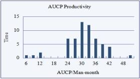

# 敏捷用例
一种适合敏捷开发的改进用例方法

**标签:** DevOps

[原文链接](https://developer.ibm.com/zh/articles/agile-use-case/)

张克强

发布: 2018-01-12

* * *

## 引言

1999 年，Kent Beck 介绍了极限编程（常见缩写是 XP) ，发表了题为 “ [Embracing change with extreme programming](http://ieeexplore.ieee.org/document/796139/?reload=true)” 的论文。在他的这篇论文里，小发布是第 2 个 实践，说到”系统在解决所有问题之前，在几个月内投入生产，新的发布以每天到每月的频度进行。这是持续交付起源之一。因为小版本发布，以故事的方式来一起进行全部的分析，可以想象为集合在一张索引卡上，组合起来成为一个用例。每个故事必须是以业务导向的，可测试的，可估算的 ” 。 在 XP 开始的时候，没有选择用例作为需求的格式，而是发明了用户故事。

为什么没有选择直接使用当时已经成为国际标准的用例？ 用例被认为是组织一群需求的方法：一个用户目标，场景，约束，业务规则，线框图，图表，等等。当将它考虑为一个原子工作时，它太大了。通过用例本身，它们不能生成有用的燃尽图。事实上， [一个完整的用例不能在单个迭代中完成](http://t.cn/RvI0iTI) 。 Martin Fowler 说 用例以叙述文来组织需求，说明用户如何关联系统，如何使用系统。因此用例聚焦在用户目标上，如何与系统交互来满足目标。 [XP 的故事为了计划而将需求进行切分](http://t.cn/RvI0vD4) 。故事被明确的分解 ，以 让它们能够在极限编程发布计划过程中进行估算。

2001 年敏捷软件开发宣言发布了。在这之后，出现了许多敏捷方法，用户故事几乎成为绝大多数敏捷方法的需求表达方式 。

2010 年 持续交付为了更快的交付出现了，持续交付不仅仅是持续集成的升级版，而且它更加关注快速和可持续的交付价值。需求是价值的关键，如何快速可持续地实现高质量的需求是持续交付的焦点，不仅是短期，而且包括长期。显然的，如果没有变化，用例对持续交付而言也是太大了。因此，如果要跟上持续交付，那么它需要分解到其他形式的工作逻辑块。

而用户故事经过了超过 16 年 的实践，人们发现用户故事在长期处理中存在大困难。对于产品待办列表，写出好的用户故事是非常困难的，也难以确保它们是轻量的，难以确保被开发团队理解， [难以确保产生业务价值](http://t.cn/z8vG7WB) 。实例化需求的作者 Gojko Adzi c 同样也注意到了上述问题， [他提出维护特性集的整体树](http://t.cn/8s0dMn7) 。在用户故事完成后（可以被扔掉时），关键信息应当同步到特性集树。显然的，同步需要额外工作量，很可能延期，甚至漏掉和忘记。

2011 年 12 月， [用 例 2.0](http://www.ivarjacobson.com/Use_Case2.0_ebook/) 由 Ivar Jacobson, Ian Spence, Kurt Bittner 三人发布。 用例 2 . 0 给出了一个激动人心的解决方案：就利用用例来帮助定义用户故事。用例切片成为用例 2.0 最 重要的组成部分。用例切片的定义：一个用例切片是从用例中选取出来的一个或多个故事，它形成了对客户有清晰价值的一个工作项。但是对比用户故事，如果用例是扼要描述的，用 例 2.0 只是让用例像史诗故事，而让用例切片像用户故事；如果用例得到详细完整描述，在用例与用例切片之间的不一致性将成为困难。所以用例 2.0 并没有给出彻底的解决方案。

在本文中，一个新的用例规约叙述方式得到了介绍，它易于控制用例的颗粒度，利用上下文中的@，易于阐述用例切片，易于维护特性集，同时兼顾短期和长期情况。

## 敏捷用例规约

用例规约没有包括在 UML 标 准当中，所以用例规约有许多方式。用例本身与敏捷团队并没有截然的不适合关系，但是用例规约的典型写法是不敏捷的，比如提前全部写完整。所以为了敏捷和持续交付， [一个敏捷的用例规约叙述方式是必须的](http://t.cn/RvqTB5C) 。

### 备选流的问题

在 RUP 中 这样说明备选流：事件的备选流覆盖了对比正常行为的可选或者异常点，也覆盖了正常行为的变种。根据上述这句话，可以识别的有三种类型的备选流：

- 结果积极：一个备选流是一个或一系列步骤，虽然步骤与基本流不一样，但仍然达成与基本流相同的目标；
- 结果消极：一个异常导致不能达成用户目标；
- 结果待定：一个异常导致流转到前面的基本流步骤，目标达成是否取决于后续响应。

根据以上，CRUD（创建-读取-更新-删除）方式用例得到了许多人的支持，包括 UML 三友[9]，科伯恩 。

对于 CRUD 方式用例，创建流位于基本流，其它流（读取，更新，删除）放置在备选流，而这些流程的异常情况也需要，这样导致了巨大的用例，这是完全不利于敏捷的。因此，备选流中的混淆是值得澄清的。

### 备选流问题解决方案

根据敏捷思考，在此敏捷用例中，备选流被异常流和新用例来替代，所以再也没有备选流的混淆情况。具体解决方案是：

- 将结果积极的备选流改为新用例，用例的大小得到限制，CRUD 方式用例须进行分割；
- 将结果消极和结果待定的备选流改为异常流。

### 用例的步骤

Ivar Jacobson, 用例的发明人，将一个用例事务描述为一个”环形”，从用户到系统，再回到用户；一个事务结束于当系统等待新的输入刺激时。

在一个事务中有如下 4 个类型的步骤：

- 请求 — 角色提交一个请求给系统
- 验证 — 系统进行所需的验证
- 改变 — 系统改变或者存储
- 回应 — 系统返回响应信息，带领角色进入到下一个事务

为了清晰表现，步骤必须属于上 述 4 种类型之一，步骤不能合并，也不能分割。一个事务通常含有 2 ~ 4 个步骤。

### 基本流

基本流不是强制，但是如果需要书写，那么为了步骤清晰需遵循如下格式

- 主角提交请求

    - 第 1 子步骤
    - 第 2 子步骤
- 系统进行验证
- 系统修改
- 系统返回响应
- 下一个事务开始-主角请求
- ……

为了让用例保持瘦身及轻量，并且容易理解，一个用例只有一条基本流。基本流中的步骤称为基本步骤。基本步骤最多可以有一层子步骤，上述例子中步骤 1 有 2 个子步骤。

### 异常流

异常流也不是强制要求的，但如果异常流得到书写，需遵循如下格式。

[n]a [异常开始位置] 和条 件 1

- 系统显示响应
- 主角反应
- 系统恢复到基本流 M

[n]b [异常开始位置] 和条件 2

- 系统显示响应，结束此用例。

说 明 1 : [n] 代表哪个基本步骤是异常开始位置。

说 明 2 : ” a ” 是该步骤的 第 1 个异常点， “b” 是 第 2 个异常点，依次类推。

根据以上表格，一个用例可以有多个异常流，为便于理解，在异常流中的步骤称之为异常步骤。异常步骤最多有一层子步骤，与基本步骤一样。

### 启动点

如果没有启动点，通常基本流的第一步需要说明用例如何启动，如下：

基本流：

用户开始添加新书

系统显示一些信息，让用户填写

可以看到，第一步对于真正价值而言，是废话，但它是需要的，因此值得把启动点分离出来。启动点作为用例的属性字段，说明用例如何启动，这样让事件流专注于价值。

### 敏捷用例规约模版

##### 表 1.用例属性字段

**属性字段****描述****必要性****名称**用例名称必需**代号**用于标识，引用必需**描述**简要说明用例有了好**启动点**How to start this use-case有了好**基本流**Basic flow of use-case宜有**异常流**Exception flow of use-case宜有

任何被认为有价值的新属性字段都可以加入，比如干系人利益，前置条件，后置条件，等等[9,10]。

### 利用迭代标记来管理跟踪 用例的变化

在快速变化的环境里，需求变更发生得很快，就算是在彻底的需求分析和非常正式的决策的情况下，需求也不能保证不变。所以用例需要演进，也许在发布一天后就要更新。

在用例 2.0 当中，用例切片得到识别来捕捉变化。但是用例切片与用例是分离的，用例切片自身没有上下文。在用例中使用@ 可以简单清晰地说明在哪个迭代来处理。 @可以用来标注相应迭代或者版本的新增或者修改的切片，它能将用例切片保留在用例中。下方列出了例子。没有@的句子所对应的迭代缺省是向前查找的表明迭代的 第 1 个值。显然的对于标注而言，@符号不是唯一的选择，任何标注迭代代号的方式都可以，只需要保持一致性。

##### 表 2 . 标记迭代的用例规约例子

**Field****Description****ID**UC1**Name**Add new book**Description**Library admin Adds new books, so that user could search the book**Start Point**Admin start to add book**Basic Flow**_system provide existed catalog options. [@I1]_ admin add a new book by book name, author and select catalog option _system check whether it is duplicated._ system record the new book. \* system return success message to admin, and back to step 1.**Exception Flow**3 a – duplicated book system show duplicated book message, back to step 1 . give 2 options:1,back to step1;2, go to the duplicated book [@I2] Admin make the selection [@I2] System lead admin to the selected option[@I2] If go to the duplicated book, lunch another use-case: show book

通过[@iteration ID], 用例切片得到清晰的定义， 由于它处于上下文中，它易于理解。如果将它分离的话，更多文字需要说明其上下文，以及要维护其与母用例的关系。在工具的支持下，在指定迭代的用例可以容易的查找到。

##### 表 3.用例列表样例

**Use Case****Category****Iteration****OR****State**UC1AAI1,I2OR1selectedUC2AAI1,I2OR1selectedUC4ABI2OR2selected……

Note:OR stands for Original Requirement. From category tree, all use-cases can be organized as their intrinsic structure.

在用例 1.0 和用例 2.0 里的好处得到了保留，而其弱点都被移除了。

## 敏捷用例点 Agile Use Case Point – AUCP

在起初的用例点方法中，一个简单用例能含有 3 个事务[12]，这意味着 6 ~12 步 ，一 个 UCP 约需要 20 小时[12]，或者 1 5~30 小时[13]，所以一个用例点为 10 的普遍用例需要 200 小时，这几乎超过了一个迭代工作量的 50%，（假设 5 人团队 2 周的迭代）。所以旧用例点对于敏捷迭代和持续交付而言实在是太大了。

敏捷迭代和持续交付需要一个新的 UCP 方法，本文将它称为敏捷用例点，缩写是 AUCP。

### 敏捷用例点 AUCP 的 定位

每个团队都拥有自己的环境、团队成员和工具，等等。所以在敏捷开发中，故事点是相对的，并且在不同团队是不同的， 在 A 团队的一个故事点是与 B 团 队的一个故事点不一样的。它不能用于在不同团队之间比较。

第一个用例点方法是受 Albrecht 在 1979 年 提出的功能点方法的启发[12]。功能点方法是一个估算的普遍模型（留意”普遍”），事实上国际功能点用户组织的功能点在 2003 年 成为了国际标准[14]。

AUCP 的 定位设定在团队级别和普遍级别的中间，是在组织级别。在相同的组织，有相同或类似的环境，团队得到同一套组织过程的指导，开发相同或者类似的相关的软件。所以它容易定义组织标准度量方法，它只需关系组织自身的情况和背景。许多公司发布了他们自己的度量方法。

也就是说，AUCP 是可以调整的，本文下面的设置是基本参考，每个组织，甚至每个团队可以根据本文定义自己的 A UCP。团队层面的敏捷用例点同样是推荐的。

### 敏捷用例点 AUCP 的 范围

角色的比重相较于用例而言是非常小的[12,13]，而且在迭代和看板当中，角色要比用例稳定许多，一般不变。所以 AUCP 只考虑用例。

在 1993 的 UCP 方 法中，有技术复杂因子和环境因子。这两个因子不是用例的基本。对于特定的团队和软件，技术复杂因子和环境因子不会有大变化。AUCP 的 目标是估算和度量用例的规模，而不直接是工作量。所以 AUCP 不包括这两个因子。AUCP 只 反映了用例的基本尺寸，与谁来开发无关，与在什么环境下用什么技术开发无关。

另外一个方面是关于类、对象和数据实体。显然的，这些事物超出了需求的边界，AUCP 关乎于需求层面，不包括这个方面。

### 敏捷用例点 AUCP 设 置

##### 表 4.不同类型用例的 AUC P 设置

**Typ e 类 型****Descriptio n 说 明****AUCP Weigh t 权 重**Simple New 简单新增5 or fewer basic steps, exception flows not exceed 3 少于等于 5 个 基本步骤，异常流不超过 3 个5Average New 普 通新增6~10 basic steps, exception flows not exceed 6 6 到 10 个基本步骤，异常流不超过 6 个10Complex New 复 杂新增11~15 basic steps, exception flows not exceed 9 11 到 15 个基本步骤，异常流不超过 9 个15Simple Chang e 简单变更Add or change 1~3 steps 新增或变更 1 ~ 3 个步骤3Average Chang e 普通变更Add or change 4~6 steps 新增或变更 4 ~ 6 个步骤6Complex Chang e 复杂变更Add or change more than 6 steps 新增或变更超过 6 个步骤Same as whole use-cas e 与整个用例规模等同

AUCP 特别情况调整规则：

- 如果异常流数量超过限制，上调用例权重档次，或者切分用例；
- 如果某一步超级复杂，比如一个系统步骤有超过 5 个子步骤，上调用例权重档次，或者切分用例；
- 如果基本步骤超过 15 步 ，如果是新增的情况下，分割此用例；如果它是历经演进超过 15 步 ，难以分割，那么将它保持为复杂，只计数其变更和新增的切片。

所以 AUCP 总数可以识别用例类型来统计得到。 表 4 的用法示例在表 5 中 。

##### 表 5.标称 AUCP 的 用例

**ID****Name****Description****Type****AUCP**UC1Add new bookInput book fieldsSimple change3UC2Show bookShow book all fieldsAvg. change6UC4Edit bookChange book name, author and catalogAvg. new10Total19

### 敏捷用例点生产率

在敏捷迭代开发中，每个迭代的总敏捷用例点（AUCP）可以被收集到历史数据表中，那么敏捷用例点生产率基线能够被计算。一般的，用例点生产率的单位是 AUCP 每人月，即是 AUCP/人月；另外一个常见的单位 是 PF(生产率因 子 Productivity Factor），它表达的是每个用例点需要多少工时来开发，单位是工时/AUCP。

两者之间的换算公式如下 ：

AUCP/人月 = 月度工时 / PF

PF = 月度工时/(AUCP/人月)

月度工时根据不同国家来取，中国大陆的月度工时是 166.64 工时，正因为月度工时在不同国家略有差异，所以在功能点领域，PF 是更加常用的单位。

因为不同的背景，AUCP 生产率处在一个较大的范围内。所以没有缺省值可以提供。每个组织或者团队应当试验 1 ~ 3 个迭代来得到自己的 AUCP 生产率参考或者基准。

### 根据 AUCP 来 估算

估算的工时 = AUCP 数量 \* PF

## 用例列表与用例待办列表 Use-Case List vs. Use-Case Backlog

根据柯林斯词典，待办列表（Backlog）是要做但还没做的事务。用例常常需要修改，即使它们已经完整的发布了，所以带有迭代或者版本代号的用例列表是值得维护的，而用例待办列表就不是一个用例存放的好地方。用例列表是一个容易理解的词，而且它适合来维护用例，它的典型字段在上述 表 1 中展现了。

伴随着工具的搜索功能，用例可以根据迭代、状态、类型、名字等等来检索。这样，需要变更的用例可以容易地加入到当前迭代，改变它的状态，更新它的描述，添加或者修改用例切片，等等。工具应当记录所有日志，保留所有历史版本。这样比较简单的待办列表，它更加强大，并且合理。

## 敏捷用例使用指南大纲

上述章节提供了许多理论，本节给出一个可操作的用例敏捷迭代开发的指南大纲。

- 需求负责人员（ 在 Scrum 中 ，Product Owner 产品主管）收集原始需求，起草相应的用例；
- 需求负责人员将用例区分优先级地存放在用例列表中（与待办列表相类似），注明用例切片，使用用例的用例点（相当于故事点）来估计用例的大小；
- 开发团队根据优先级选择用例及切片，将正确的迭代代号赋予所选择的用例和用例切片（用@符）。用例点的扑克计划游戏是值得采用来让用例和用例切片更加清楚。用例规约可能变得详细和清晰。敏捷用例点总计，团队能力和生产率在适当的迭代工作范围中得到平衡。
- 团队实现那些选中的用例，验证和确认它们，可能包括不同的测试。用例规约根据需要变得越来越详细。
- 用例点得到每日监控，燃尽图展现在团队日常工作空间。
- 用例被跟踪到发布。
- 迭代的总敏捷用例点数和其它相关度量一起收集到历史数据库。在指定范围内的敏捷用例点生产率可以得到计算。

## 本方法的结果

本敏捷用例用在一家软件公司中， 8 个项目累计 61 个迭代的数据得到收集，其背景是平台开发（产品与 iFix、Struts 相似）， 4 周 为迭代周期。平均发布工期偏差 是 3.4%， 6 个 标准差范围是[-17.8%，24.6%]，这是真的很好的工期偏差控制。平均敏捷用例点生产率是每人月 30.7 个用例点， 6 个 标准差范围是[13.6，47.8]，如下图一所示；相应的 PF 是 5.4 工时/用例点， 6 个标准差范围是[3.5,12.2]。

##### 图 1 . 敏捷用例点生产率分布

在最近笔者担当产品经理的项目中， PF 在 1.8 到 3.9 之间变化，平均值 2.5 ，单位是工时每用例点。此项目的背景是 S harePoint 网站短迭代方式的二次开发。

## 结束语

本文阐述了一个新的敏捷用例方法，包括其用例规约格式和规则。这个新方法移除了令人混淆的备选流，加入了定义明确的异常流，清晰地定义了步骤。`@` 用来标记用例切片，这是为了短期使用，`@` 的使用将用例切片保留在了用例本身，这样就照顾了长期使用。用例和切片的尺寸可以通过敏捷用例点称量。这个方法汇集了来自于敏捷、极限编程和用例 2 . 0 的好处，并且摒弃了用例对于敏捷所有已知的弱点。这个敏捷用例新方法能很好的支持敏捷迭代开发和持续交付。

## 参考资料

- Beck, K. (1999). Embracing change with extreme programming. Computer, 32(10), 70-77.
- Fowler, M . [Use Cases And Stories](http://t.cn/RvI0vD4), 8/18/2003
- Matt Terski . [Use Cases in an Agile Backlog](http://t.cn/RvI0iTI), 12/15/2011
- Humble, J., & Farley, D. (2010). Continuous delivery: reliable software releases through build, test, and deployment automation. Pearson Education.
- Richard Schaaf. [Improving User Stories With Use Cases](http://t.cn/z8vG7WB), 7/12/2012
- Gojko Adzic. [Throw user stories away after they are delivered](http://t.cn/8s0dMn7), 3/25/2014
- Ivar Jacobson, Ian Spence, Kurt Bittner. [USE-CASE 2.0](http://www.ivarjacobson.com/Use_Case2.0_ebook/), 2011/12,
- Matt Terski. [Agile Use Cases in Four Steps](http://t.cn/RvqTB5C), 9/28/2009
- Kruchten, P. (2004). The rational unified process: an introduction. Addison-Wesley Professional.
- Cockburn, A. (2001). Writing effective use-case s. Pearson Education.
- Jacobson, Ivar et al., Object-Oriented Software Engineering. A Use Case Driven Approach, revised printing, Addison-Wesley 1993.