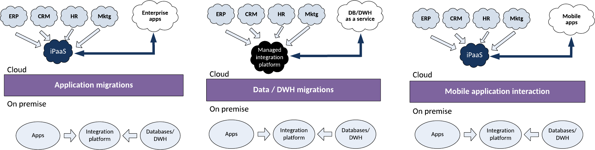
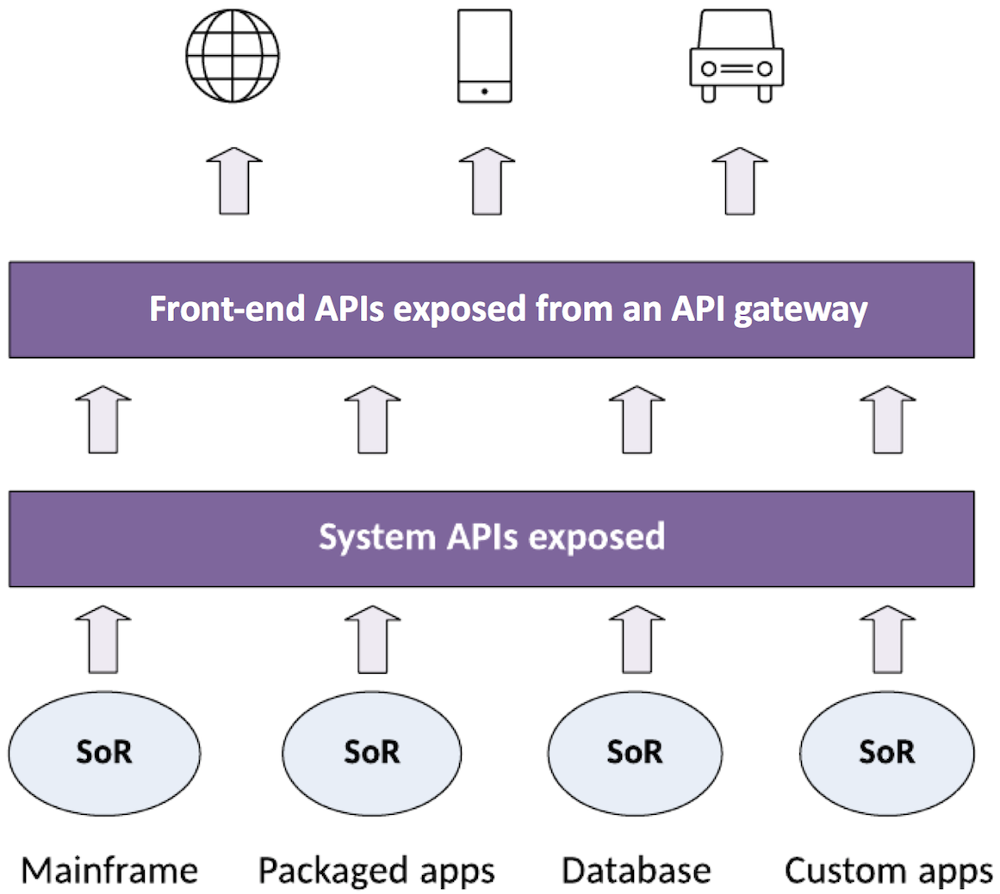
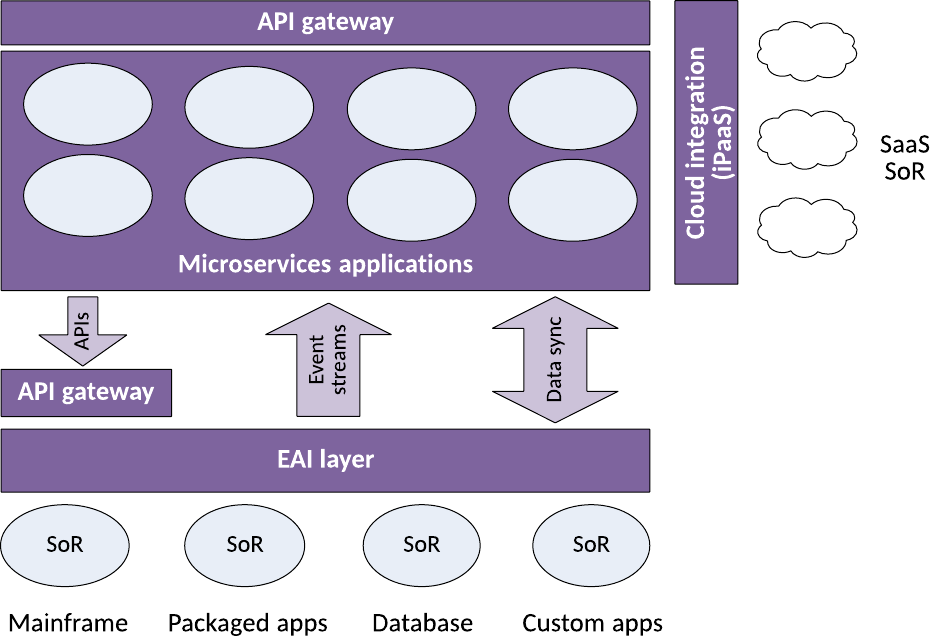
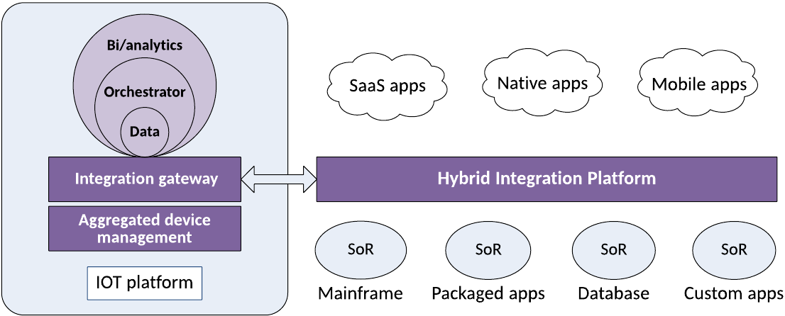
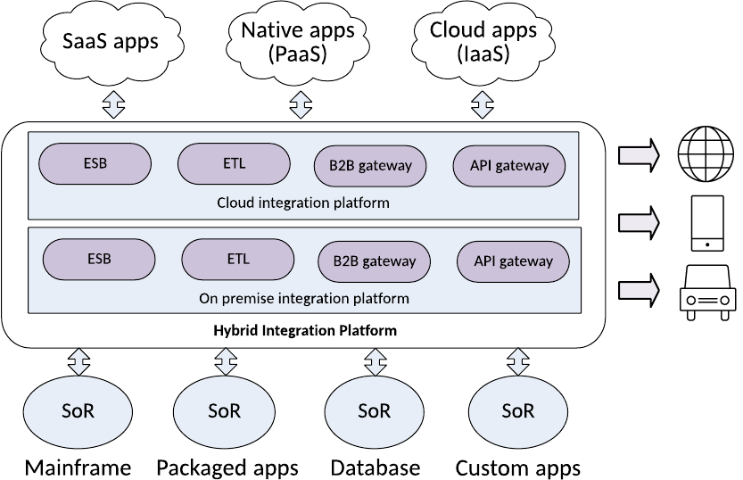
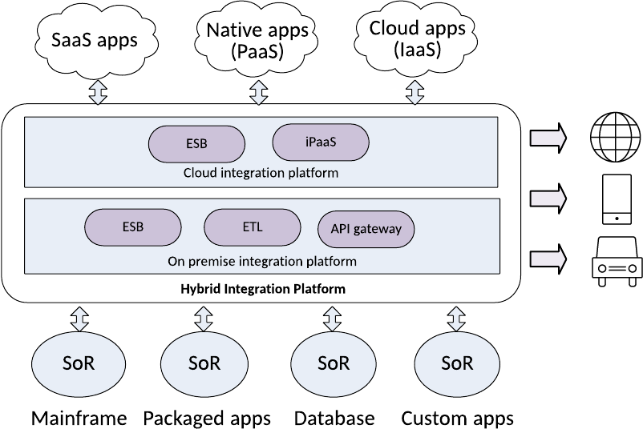

# 数字化企业中的混合集成平台
有助于定义合适的混合集成架构的用例和概念

**标签:** API 管理,IoT,云计算,平台即服务,本地

[原文链接](https://developer.ibm.com/zh/articles/mw-1705-mynampati/)

Prabhakar Mynampati

发布: 2017-09-06

* * *

## 简介

随着业务需求的增长，集成的外在形式（即企业数据、应用程序和服务）也会不断变化。它们必须适应新业务模型，才能在当今的数字化世界中保持对市场同行的竞争力。它们的需求也可能出于以下原因而发生改变：

- 使用新技术构建的应用程序的增加
- 迁移现有应用程序
- 向市场上各种类型的云托管服务引入第三方系统和服务
- 增加新的业务渠道、合作伙伴、供应商，以及其他业务部门和企业。
- 将这些企业应用程序与新兴普适计算（pervasive computing）设备和传感器相集成，以确保企业系统支持实时或近实时的业务需求

企业系统中的差异给系统集成者扩展组织中现有的稳固的集成平台带来巨大挑战。对于新的集成平台和工具，比如集成平台即服务 (iPaaS)、集成软件即服务 (iSaaS) 和应用编程接口 (API) 管理套件，这些差异使得它们有机会为现有集成平台提供补充。现有集成平台与新集成套件的这种组合被称为 _混合集成平台_ 。

解决方案主管和集成架构师现在面临的挑战是，为这种混合集成平台打造一种经过优化的解决方案设计。它们必须在预算限制下满足技术和业务服务等级协议 (SLA)，并与企业的数字化转型之旅一致。

本文将介绍 3 个部署混合集成平台的核心用例，并解释混合集成的实现概念。根据企业数字化转型战略，您必须为您的解决方案设计定义一种合适的混合集成架构。根据合适的混合架构结果，选择一个由单一供应商构建或您自行构建 (BIY) 且根据您的企业需求进行定制的平台。

## 用例 A：需要在云上托管应用程序、数据和服务

企业对云的适应已显著降低了企业技术成本。出于敏捷性、灵活性和创新的原因，企业开始将其现有应用程序、数据仓库、业务流程管理 (BPM) 平台、主数据管理 (MDM) 平台和移动应用程序迁移到云。对许多企业来讲，尽管希望实现云优先、云就绪或纯云的技术栈，但实际情况仍然是现有的企业内部技术栈与新的云应用程序和服务混在一起。因此，应用程序、数据和流程集成现在必须能够同时支持基于云的应用程序和企业内部系统。下图描绘了企业中目前的系统格局和它们的集成风格。

此图的左侧演示了如何将应用程序直接迁移到云，避免了集成到企业内部集成平台的复杂性，但又能迁移到 SaaS 企业应用程序。企业采用此战略的首要目的是减少成本。

此图的中间部分演示了在不重新设计的情况下减少开支的下一步。企业将数据和数据仓库工作负载的昂贵物理基础架构迁移到公有云。他们逐步淘汰一些部署在内部的过时的数据集市。

图的右侧演示了移动技术如何迫使新业务模型连接面向客户的应用程序功能。这项移动技术还必须使用正确的 API 与企业近实时的操作数据存储进行交互，从而公开移动应用程序。

应用程序分散在公有云环境、私有云环境，以及企业内部的数据中心服务器内。应用程序和数据服务通过传统集成平台进行集成，比如企业服务总线 (ESB)；提取、转换和加载 (ETL)；以及消息中间件平台。类似地，在云端，迁移的应用程序和第三方应用程序托管在自己的云上 (SaaS)。它们通过 iPaaS 工具进行集成，以实现一些应用程序用例功能。现在，需要直接或通过现有的企业内部的企业应用程序集成 (EAI) 层，将企业内部的应用程序与迁移到云的应用程序或 SaaS 应用程序相集成，以实现一些端到端业务流程功能。为了满足该需求，可以重新调整 iPaaS 平台或传统的企业内部 EAI 平台，或者将两个平台组合成所谓的 _混合集成平台_ 。

在数据前端，需要将来自企业内部的操作数据存储的数据同步或转移到云端上的数据库即服务 (DBaaS) 或数据仓库即服务 (DWHaaS)，或者进行反向同步或转移。要同步此数据，可以使用托管在云上的管理数据集成平台或者企业内部的集成平台来集成企业内部数据源和云数据源。

以前，移动应用程序是通过将它们连接到面向客户端的应用程序（比如 SaaS 应用程序）之上来构建的。现在，在将 iPaaS 平台部署到云上后，会从 SaaS 应用程序创建所需的 API，而且使用的企业数据由 SaaS 应用程序提供，或通过企业内部集成而直接由企业内部的数据存储提供。混合集成平台非常需要这 3 种类型的应用程序、数据和移动集成。

## 用例 B：适应数字化 API 经济

为了创造更多收入，许多企业正通过 API 以即用即付的服务形式向外部利益相关者公开其功能和数据，从而开辟新的数字化业务。在过去，这些 API 被锁在企业防火墙背后，仅供内部使用。这些 API 是针对特定领域的、可重复使用的业务功能，或者面向前端系统的可组合的交互式 API，前端系统包括 Web、移动和物联网 (IoT) 渠道等。这些数字化 API 是通过以下小节中介绍的两种方法来实现的。

### 通过交互式 API 公开记录系统

要实现数字化 API，可以通过构建可组合的 API 向客户公开应用程序数据，如下图所示。现有的应用程序架构没有发生改变。但是，它们的记录系统 (SOR) 已通过 SOAP 或 RESTful 服务从传统 EAI 平台提取出来。基于前端 GUI 向客户端呈现数据的需求，可以组合一个或多个系统 API。在此图中，对于前端 API，组合了一个或多个系统 API 的数据并呈现给前端设备。对于系统 API，核心系统数据被访问并汇集在 RESTful API JSON 或 XML 对象中。

### 使用微服务原则实现 API

使用微服务来实现 API，这是目前将现有系统转变为数字化平台的另一项计划，它通过适当地公开 API 来促进前端渠道的集成。银行、保险、电信和旅游等各行各业的企业已成功将其部分或所有业务迁移到在线自助模型中。为了以更直观的方式提升其业务，这些企业增添了新的数字化功能和特性，比如位置导航、现付和评分服务。这些新需求迫使 IT 部门快速开发新应用程序进行响应。应用程序是使用微服务构建的，微服务由企业内部的 IT 应用程序和部署在全球的合作伙伴系统组成。

微服务是一种重新设计复杂应用程序的新方法。它们是使用 DevOps 工具构建的，在企业内部的应用服务器或托管在云中的 Docker 容器中运行。这些复杂应用程序被分解为自成一体的微服务组件。这些组件的功能专注于一次执行一个具体操作。独立的、自成一体的微服务需要处理自己的数据副本，最好是 NoSQL 数据库。此数据必须与企业系统的操作数据库同步。数据同步是使用传统的数据集成模式来实现的，比如数据同步和事件流，如下图中的后端系统集成所示。通过公开使用最新的 API 网关技术的 API，这些微服务被集成到前端渠道和合作伙伴 SaaS 应用程序中。

## 用例 C：针对 IoT 来扩展企业

由 IoT 设备生成的数据必须与企业应用程序集成，然后才能用于制定实时决策。因为一些应用程序在云上，一些应用程序在企业内部，所以必须采用混合集成平台来连接 IoT 集成网关。IoT 平台有一个集成网关，该网关使用各种 IoT 标准渠道将所有设备互连起来，下面给出了一些示例：

- MQ 遥测传输 (MQTT)
- 受限应用协议 (CoaP)
- WebSockets
- 蓝牙
- ZigBee
- 近场通信 (NFC)
- 射频识别 (RFID)
- 通用串行总线 (USB)
- 串行外围接口 (SPI) 总线
- 内部集成电路 (I2C)

IoT 集成可以在现场过滤和聚合数据流，将错误和警报消息等相关信息发送到中央集成平台。下图演示了一个典型的 IoT 集成。

## 制定混合集成平台战略

引入混合集成平台时，必须有一个在企业中部署它的明确战略。您必须知道部署它的正确位置，以确保以最佳方式集成平台的功能组件并采用合适的治理措施。要成功实现混合集成平台，必须执行以下步骤：

1. **计划位置** 。计划在企业中的何处托管该基础架构。定位应用程序布局的 “重心”。考虑应用程序转型战略的 3 到 5 年计划，然后确定它的目标是云还是企业内部。此平台离应用程序和数据越近，就越能维护服务质量 (QoS) 需求。可以选择将集成平台托管在企业内部、云中，或者同时托管在二者中（混合云）。
2. **确定所有权** 。决定谁将控制和拥有此平台和 IT 应用程序。因为您能根据目前的云服务产品更灵活地控制 IT 系统，所以可以确定是私有/公有云集成、混合云集成，还是管理服务云集成最能满足您的需要。这些变体分别对平台提供了完整、部分和完全外包的控制。
3. **确定人员** 。确定将实现该平台的技术熟练人员。企业内部的应用程序集成需要精通供应商平台的高技能集成专家。对于云上的应用程序集成，开发人员就可以胜任，因为 iPaaS 平台配备了必要的工具。对于 iSaaS 平台，集成由称为 _大众集成者 (citizen integrator)_ 的业务分析师实现，因为他们使用平台 GUI 来映射系统。
4. **确保治理和控制** 。引入新集成选项和方法时，它们可能影响或破坏记录系统的数据质量。例如，开发人员可能没有关于记录系统的合适知识水平，而且可能无意间破坏该系统。确保只有授权用户才能访问应用程序数据，而且您拥有适当级别的治理和控制能力来减轻风险。

## 混合集成平台的架构组件

混合集成平台由许多组件构成，因为集成范围涵盖整个企业。

### API 管理套件

API 管理套件提供了一套完整的工具和服务器来开发和运行 API。API 管理过程包括创建和发布 API，执行它们的使用策略，控制访问，培养订阅者社区，以及收集和分析使用统计数据。

此套件的主要组件是 API 网关服务器。此服务器充当了一个前端，接收 API 请求，执行节流和安全策略，将调用传递到后端服务，然后将响应传回给调用方。网关拥有一定的转换引擎能力，能够编排请求和响应。它们还会收集分析数据，提供缓存等其他功能。

API 管理套件的其他组件是 API 发布工具。这些工具定义和管理 API 生命周期，针对社区用户的 API 订阅的开发门户，用于监视 API 使用情况的报告和分析工具，以及对商用 API 收费的货币化组件。

### 企业内部的应用程序集成套件

企业内部的应用程序集成套件是一种传统的供应商独有的应用程序集成套件。它是一种 ESB 套件，包含一组开发集成流的工具，一个运行集成流的运行时服务器，以及一组监视和调试中介模块的管理工具。这个套件适合对数据映射、协议、方法调用转换，以及提供者和使用者应用程序之间的请求路由进行应用程序集成。

### 数据集成工具

数据集成工具适合企业内部的或云上的数据存储。可使用变更数据捕获 (CDC)、ETL 和数据虚拟化等技术让独立的数据结构协同工作。不同供应商采用他们自己的技术来组合多个数据源，或者将来自一个实体的数据同步到其他实体。

### B2B 集成软件

B2B 网关（或管理文件传输 (MFT) 软件）集成来自后端系统的数据，后端系统为贸易合作伙伴之间的交易提供支持。B2B 网关还通过可互操作的标准为多个数据源提供了一个集中的转换点，可互操作的标准包括 XML、商务 XML (cXML) 和电子数据交换 (EDI) 等。此平台通常是企业中的面向服务架构 (SOA) 的组成部分。B2B 网关的其他功能包括贸易合作伙伴管理和贸易合作伙伴之间的安全控制。

### 集成平台即服务

iPaaS 平台是集成层的云版本，被广泛用于云应用程序和云数据源集成。因为 iPaaS 是作为云服务提供的，所以它仅托管在云环境中。不同于传统 ESB 平台，iPaaS 中的集成要简单得多。因此，临时集成者会尽力将解决方案与此套件集成。许多供应商通常会在此平台中提供 API 管理套件功能。

### 集成软件即服务

iSaaS 平台是云提供的、预先打包的云流，它们连接不同的 SaaS 应用程序作为云的接地端点。iSaaS 提供了一个容易使用的接口，以便允许业务用户（也称为 _大众集成者_ ）自行执行简单的集成任务，比如将他们的 Twitter 提要与他们的 Google 文档相集成。

### IoT 集成网关

IoT 集成网关是一种软件套件或 PaaS 云产品。它监视（甚至可能管理和控制）不同类型的端点，通常会使用用户在该平台上构建的应用程序来完成这些任务。它方便了涉及 IoT 端点的操作以及与企业资源的集成。

此平台是使用不同领域的集成技术来构造的。因此，现有集成技术的许多产品供应商将其他领域的集成特性整合到自己的产品中，并将它们投放到市场中。

## 混合集成平台的设计方法

在安全性和性能方面，在保持现有集成基础架构的同时设计混合集成平台会涉及许多挑战和风险。新开发的中介服务和迁移后的中介服务的部署，不得破坏业务连续性。为了顺利地过渡和部署到生产中，在自定义要部署到生产中的平台之前，需要构建并测试您的混合集成平台的主要概念证明 (PoC)。

要优化混合集成平台的设计，需要：

1. 识别集成类型。另外，确定每次部署中的集成接触点数量（即企业的企业内部、IaaS 或 PaaS）。
2. 识别从一个部署环境到其他环境的集成端点。在这些端点类型中，企业可以拥有企业内部到云、云到企业内部、SaaS 到 IaaS 应用程序、SaaS 到企业内部、企业云到第三方云，以及企业内部到企业内部等类型。
3. 识别使用的现有集成中间件和技术。例如，考虑使用点对点消息系统或文件传输、集成服务器（比如代理）、服务总线还是网关。
4. 将现有集成平台替换为表 1 和表 2 中提到的建议参考集成平台。
5. 优化或整合来自标准集成平台的初始设计的混合集成平台。
6. 最终使混合集成平台部署的合适程度尽可能接近应用程序和数据存储的重心。

下表基于集成类型和发生集成的部署环境，列出了最合适的集成平台。

##### 表 1\. 标准集成平台参考表

**集成类型****企业内部****IaaS****PaaS****A2A**ESB云 ESBiPaaS**数据集成**ETL云 ETLiPaaS**SOA 服务**ESB云 ESBiPaaS**流程集成**BPEL云 BPELPaaS BPEL**微服务**API 网关API 网关API 网关**IoT 渠道**IoT 网关IoT 网关IoT 网关

下表基于集成类型和它与目标系统部署环境的端点连接，重点给出了最合适的集成平台。

##### 表 2\. 集成端点的标准平台参考表

**集成类型****企业内部到 企业内部 （不同企业）****企业内部到云或云到企业内部****A2A**MFT 网关iPaaS**数据集成**供应商独有的工具iPaaS**B2B**B2B 网关iPaaS**SOA 服务**ESB 网关iPaaS**微服务**API 网关iPaaS**IoT 渠道**IoT 网关IoT 网关**SaaS 应用程序**不适用iPaaS

为了帮助理解设计原理，请考虑这个示例。一家公司聘用了一位负责研究公司的现有集成架构的集成架构师。企业设计团队向集成架构师解释了未来 3 到 5 年的应用程序格局转型战略。基于在公司架构上的发现，集成架构师从表 3 中列出的细节着手，规划未来的集成格局。

##### 表 3\. Acme 公司的集成细节

**集成类型****接触点数量： 企业内部****接触点 数量：IaaS****接触点数量：PaaS****A2A**大 （规模 >50）中 （50< 规模 >25）小 （规模 <25）**数据集成**中小小**B2B**小小小**SOA 服务**中中小**SaaS 应用程序**小小小**微服务**中大大**IoT 渠道**小小小

根据第 4 步的解释，现有集成平台被替换为建议的参考集成平台。下图给出了基于表 2 和表 3 中的信息的混合集成平台初始版本。

根据第 5 步的解释，从以下考虑因素对混合集成平台进行优化：

- 因为 IaaS 和 PaaS 云环境中的数据集成接触点都很少，所以建议的 ETL 云版本被替换为 iPaaS 解决方案。
- 因为两个环境中都有 B2B 网关，所以部署在云中的 iPaaS 同时处理两个 B2B 网关的功能。
- 在云中放入 API 网关可能是一个多余的解决方案，因为在引入 iPaaS 后又从原始设计中消除了它。
- 未涉及到企业内部的 API 网关，因为它对通过 ESB 层的企业内部系统集成具有很高的 QoS 需求。

下图演示了优化后的混合集成平台。

## 结束语

本文重点介绍了 3 个布局混合集成平台的核心用例，以及混合集成的实现概念。您了解到单一集成平台之所以无法满足企业的所有集成需求，是因为向现有设置中添加了各种各样的部署环境、操作模型和新技术。幸运的是，用于构建混合集成平台的单供应商产品栈满足互操作性标准，并避免了不同类型集成产品中的功能组件的冗余集成。

## 致谢

感谢 IBM 英国的集成产品组合架构师 Kim Clark 抽出时间评审本文并提供反馈。

本文翻译自： [DHybrid integration platform in the digital enterprise](https://developer.ibm.com/articles/mw-1705-mynampati/)（2017-05-09）