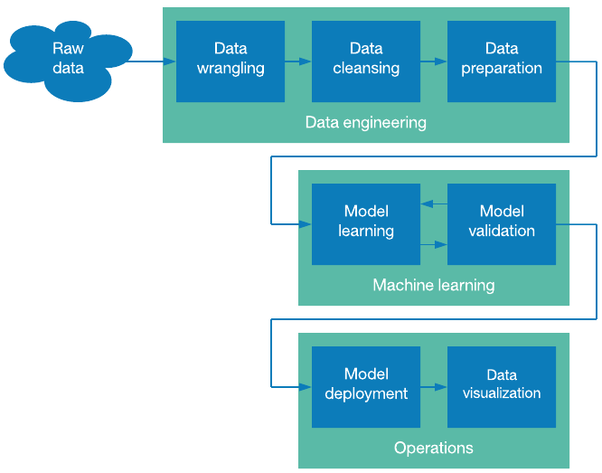
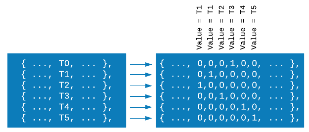
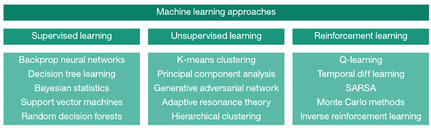
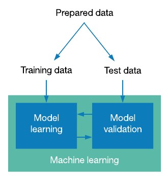

# 数据、结构和数据科学管道
Learn to transform data into value

**标签:** 数据科学

[原文链接](https://developer.ibm.com/zh/articles/ba-intro-data-science-1/)

M. Tim Jones

发布: 2018-03-28

* * *

数据是一种商品，但是，如果无法处理数据，数据的价值就值得怀疑。数据科学是一个多学科领域，其目的是从所有形式的数据中提取价值。本文从数据、数据结构以及可用于将数据转换为价值的高级流程方面来探讨数据科学领域。

数据科学是一个流程。这并不是说数据是机械的，缺乏创造力的。但是，当您深入到数据处理的各个阶段，从再加工数据源和清理数据到机器学习及最终的可视化，您就会看到将原始数据转换为洞察过程中涉及到一些独特步骤。

您采用的步骤可能也会有所不同（参见 [数据科学管道](#数据科学管道) ）。在探索性数据分析中，您可能有一个已清理好的、准备导入 R 中的数据集，您将您的结果可视化，但不会将模型部署到生产环境中。在另一个环境中，您可能处理真实的数据，除了数据扩展和准备之外，您还需要一个数据合并和清理流程，然后才能训练您的机器学习模型。

##### 图 1.数据科学管道

让我们首先分析一下数据科学管道的元素，以了解该流程。

## 数据及其结构

数据有多种形式，但总体上讲，它可以分为 3 类：结构化、半结构化和非结构化（参见 [数据模型](#数据模型) ）。结构化数据是组织结构严谨的数据，存在于诸如数据库（或逗号分隔值 [CSV] 文件）之类的存储库中。这类数据可以轻松访问，而且数据的格式使其适用于查询和计算（通过使用结构化查询语言 (SQL) 或 [Apache™ Hive™](https://hive.apache.org/) 等语言）。非结构化数据根本没有任何内容结构（例如音频流或自然语言文本）。介于它们之间的是半结构化数据，这些数据可能包括元数据，或者可通过使用语义标签比非结构化数据更轻松地进行处理的数据。这类数据不是完全结构化的，因为最低级的内容可能仍是需要经过某种处理才有用的数据。

##### 图 2.数据模型

结构化数据是最有用的数据形式，因为可以直接对它进行处理。根据约略的估计，结构化数据仅占总数据的 20%。全球的大部分数据（80% 的可用数据）是非结构化或半结构化数据。

请注意，定义为非结构化数据的大部分数据实际上都拥有结构（比如一个包含元数据和内容标签的文档），但内容本身缺乏结构，而且无法直接使用。因此，它们被视为非结构化数据。

## 数据工程

2016 年的一次调查发现，数据科学家花了 80% 的时间来收集、清理和准备要用在机器学习中的数据。剩余 20% 时间花费在使用机器学习算法来挖掘数据或为数据建模上。尽管这是该流程最无趣的部分，但这种数据工程非常重要，而且会影响从机器学习阶段得到的结果的质量。

我将数据工程分为 3 个部分：整理、清理和准备。考虑到此阶段涉及的工作单调乏味，一些人将此流程称为数据再加工 。

### 数据整理

数据整理流程的简单定义是，处理原始数据，让数据可用于数据分析或训练一个机器学习模型。数据工程的这部分可能包括从一个或多个数据集获取数据（并将数据集精简为所需的数据），规范化数据以便从多个数据集合并的数据能够保持一致，并将数据解析到某种结构或存储系统中供进一步使用。考虑来自一个联邦开放数据网站的公有数据集。此数据可能以电子表格文件形式存在，您需要将其导出为更容易被数据科学语言（CSV 或 JavaScript Object Notation）接受的格式。该数据源也可能是一个网站，自动化工具可从中抓取数据。最后，该数据可能来自多个来源，这要求您为结果数据集选择一种通用格式。

这个结果数据集可能需要进行后期处理，以便支持将其导入到分析应用程序中（比如 [R Project for Statistical Computing](https://www.r-project.org/) 、 [GNU Data Language](http://gnudatalanguage.sourceforge.net/) 或 [Apache Hadoop](http://hadoop.apache.org/) ）。然后，您可以通过数据整理流程来识别、收集、合并和预处理一个或多个数据集，为数据清理做好准备。

### 数据清理

收集和合并数据集后，下一步是清理数据。未经处理的数据集通常是杂乱的，存在许多常见问题，包括缺少值（或太多值）、糟糕的或错误的分隔符（用于分隔数据）、不一致的记录，或者不够充足的参数。在一些情况下，数据无法修复，因此必须删除数据；在其他情况下，可以手动或自动更正数据。

当数据集的语法正确时，下一步就是确保它的语义也正确。在包含数字数据的数据集中，有一些需要更仔细地检查的异常值。可以通过统计分析，查看均值、平均值，以及标准差来发现这些异常值。搜索异常值是一种辅助的清理方法，旨在确保数据统一且准确。

要获得关于数据清理的更多信息，请参阅 [处理杂乱数据](https://www.ibm.com/developerworks/cn/analytics/library/ba-cleanse-process-visualize-data-set-1/) 。

### 数据准备

数据工程中的最后一步是数据准备（或预处理）。这一步假设您有一个已清理的数据集，它可能未准备好供机器学习算法进行处理。下面给出了两个可以应用此准备的示例。

在某些情况下，数据规范化可能很有用。通过使用规范化，您可以转换一个输入特征，将数据均匀分布到一个机器学习算法可接受的范围内。此任务可以像线性扩展一样简单（从一个任意的范围，给定一个从 -1.0 到 1.0 的域最小值和最大值）。您也可以应用更复杂的统计方法。数据规范化可以帮您避免在训练过程中卡在局部最优值上（在神经网络环境中）。

另一种有用的数据准备技术是将类别数据转换为数字值。可以考虑这样一个数据集，其中包含一组表示某个特征的符号（比如 `{T0..T5}` ）。作为一个字符串，这无法用作神经网络的输入，但可以使用 one-of- _K_ 模式（也称为独热编码）来转换它。

在这种模式中（如 [将字符串转换为一个独热矢量](#将字符串转换为一个独热矢量) 所示），您识别特征的符号数量（在本例中为 6），然后创建 6 个特征来表示原始字段。对于每个符号，都只设置一个特征，这样就可以正确地表示该符号的不同元素。这样做的代价是增加了维度，但通过这么做，可以提供一个更适合机器学习算法的特征矢量。

##### 图 3.将字符串转换为一个独热矢量

一种替代方法是整数编码（其中 `T0` 可以为值 0，T1 为值 1，依此类推），但这种方法可能引入表示问题。例如，在实值输出中，0.5 表示什么？

## 机器学习

在此阶段，您将创建并验证一个机器学习模型。有时，机器学习模型是一款产品，它被部署在应用程序的上下文中来提供某种功能（比如分类或预测）。在其他情况下，机器学习算法只是一种实现目标的方法。在这些情况下，该产品不是经过训练的机器学习算法，而是它生成的数据。

本节将探讨机器学习模型的构造和验证。要进一步了解如何利用数据进行机器学习，请参阅 [从干净数据集中获取宝贵洞察](https://www.ibm.com/developerworks/cn/analytics/library/ba-cleanse-process-visualize-data-set-2) 。

### 模型学习

数据科学管道的精髓是数据处理步骤。在一种模型中，算法可以处理数据，提供一个新数据产品作为结果。但是，从生产意义上讲，机器学习模型就是产品本身，它被部署来提供洞察或增加价值（比如部署一个神经网络来为保险市场提供预测功能）。

机器学习方法多种多样，如 [机器学习方法](#机器学习方法) 所示。下面这个较小的机器学习算法列表（按学习模型分隔）演示了通过机器学习提供的功能的丰富程度。

##### 图 4.机器学习方法

顾名思义，监督学习由评价者驱动，提供了根据评论结果来修改模型的方法。给定一个包含某个类（即依赖变量）的数据集，训练该算法来生成正确的类，并在未生成正确的类时修改模型。训练模型，直到它达到一定的准确度，此时您可以部署它来为未见过的数据提供预测。

相比之下，无监督学习没有类；它检查数据并根据隐藏在数据中的某种结构来进行分组。您可以在推荐系统中应用这些类型的算法，根据查看或购买历史记录对客户进行分组。

最后，强化学习是一种半监督学习算法，在模型制定的一定数量的决策得到满意结果时提供奖励。这种模型用于创建能在某种状态/操作空间中进行合理操作的代理（比如扑克牌代理）。

### 模型验证

训练一个模型后，它在生产中会如何表现？理解模型行为的一种方法是利用模型验证。一种常见的模型验证方法是保留少量可用的训练数据，对最终模型进行测试（这些数据被称为测试数据）。您使用训练数据来训练机器学习模型，在模型完成时使用测试数据来验证它对未见过的数据的概括程度（参见 [用于模型验证的训练数据与测试数据](#用于模型验证的训练数据与测试数据) ）。

##### 图 5.用于模型验证的训练数据与测试数据

利用训练数据集构造一个测试数据集可能很复杂。随机采样可能很有效，但也有可能带来问题。例如，随机采样是否会对给定的类过度采样，或者随机采样是否很好地覆盖了该数据或其特征的所有潜在类？按照某种分布对数据类进行随机采样，这样可能有助于避免过拟合（即训练过于接近训练数据）或欠拟合（即没有建模训练数据，而且缺乏概括能力）。

## 操作

操作是指数据科学管道的最终目标。这个目标可以像创建一个可视化的数据产品一样简单，可以向一些受众讲述一个故事，或者回答在使用数据集训练一个模型之前创建的一些问题。或者，它可以像在生产环境中部署机器学习模型那样复杂，处理未见过的数据来提供预测或分类。本节将探讨这两种情况。

### 模型部署

当机器学习阶段的产品是一个您将用于未来数据的模型时，将该模型部署到一个生产环境，以便将它应用于新数据。此模型可以是一个预测系统，它接受历史财务数据（比如每月销量和收入）作为输入，并提供一个公司是否是合理的收购目标的分类。

在类似这样的场景中，部署的模型通常不再是学习和简单地应用数据进行预测。有充分的理由来避免在生产中学习。在深度学习环境中（深层神经网络），已确定对抗性攻击可能改变网络的结果。例如，在一个图像处理深度学习网络中，对图像应用摄动分析可以改变图像的预测功能，这样就不会”看到”一辆坦克，深度学习网络看到的是一辆汽车。随着深度学习的不断应用，对抗性攻击也在增加，新的攻击矢量是积极研究的一部分。

### 模型可视化

在较小规模的数据科学中，所寻求的产品是数据，而不一定是机器学习阶段产生的模型。此场景是数据科学管道中最常见的操作形式，其中的模型提供一种生产数据产品的方法，以回答关于原始数据集的某个问题。可视化选项丰富多样，而且可以用 R 编程语言、 [gnuplot](http://www.gnuplot.info/) 和 [D3.js](https://d3js.org/) （可以生成非常有吸引力的互动情节）生成这些选项。

您可以在本系列的下一篇文章中进一步了解可视化。

## 结束语

本文探讨了一种用于机器学习的通用数据管道，其中涵盖了数据工程、模型学习和操作。本系列的下一篇文章将探讨使用公有数据集进行预测的两种机器学习模型。

本文翻译自： [Data, structure, and the data science pipeline](https://developer.ibm.com/articles/ba-intro-data-science-1/)（2018-02-01）