# 数据准备
大数据下时间序列数据的数据准备

**标签:** 分析

[原文链接](https://developer.ibm.com/zh/articles/ba-cn-bigdata-time-series-analysis1/)

徐莹, 张小燕, 常鹏飞

发布: 2017-03-29

* * *

时间序列（Time Series）是我们在日常生活和社会工作中十分常见的一种数据，它是通过将一系列时间点上的观测值按等时间间隔测量来获取的数据集合，比如商业活动中，服装公司的年销售量，日股票的收盘价格； 气象学中某城市的年降水量，月平均气温等等，因此对时间序列的研究存在于各行各业。所谓时间序列分析（Time Series Analysis）是指一种动态数据处理的统计学方法，研究数据序列所遵从的统计规律，以用于解决具体行业的实际问题。本系列文章旨在对当前大数据环境下的时间序列数据的数据准备、探索、建模以及预测方法进行全面的介绍。

## 大数据下时间序列数据的数据准备（Data Preparation）

在实际工作中，时间序列分析的目的通常有两个，一是要发现产生观测序列的随机机制，即建立数据生成模型，就是我们通常所说的数据建模；二是基于序列的历史数据，以及可能对结果产生影响的其他相关序列，对序列未来的可能取值做出预测。然而在各行各业中实际采集到的时间序列可能由于设备、人员、时间、机制等各种因素产生各种各样的问题，比如数据缺失、数据不准确、数据冗余等等，这些问题会给时间序列建模带来各种困难，甚至使模型失效，因此在数据建模之前，我们通常需要对原始时间序列模型进行大量的数据准备工作，特别是在大数据环境中，数据的宽度和广度都达到了前所未有的程度，因此需要专门的算法对数据进行分析准备工作，比如对数据进行分组、聚合，对数据的分布进行探究，数据质量得到检验以及对缺失值的处理等等，这就是我们这篇文章要介绍的一种新的数据准备分析算法—-TSDP（Time Series Data Preparation）。

## 时间序列的数据准备算法（TSDP）介绍

数据准备是进行时间序列分析建模、预测工作之前尤为重要的一步，它不仅能够对数据的存储格式进行改变，以满足后续建模算法的要求，同时还将对数据进行分组、聚合、分散等处理，除此之外，还将对数据的质量以及缺失值进行全面的分析和处理，使得数据更适合于进行建模和预测。下面我们将详细的介绍时间序列数据准备算法（TSDP）可以对哪些数据格式、数据类型进行何种分析处理。

## 时间序列数据准备算法（TSDP）的相关定义

### 输入输出的数据格式

数据准备算法支持平整的多维数据作为其的输入，例如：Timestamp,D\_1,⋯,D\_m,V\_1,⋯,V\_n ，当 m 为 0 时, 该数据就退化成为了传统的基于列（column-based）的数据。如图 1 所示：

##### 图 1\. 平整的多维数据结构

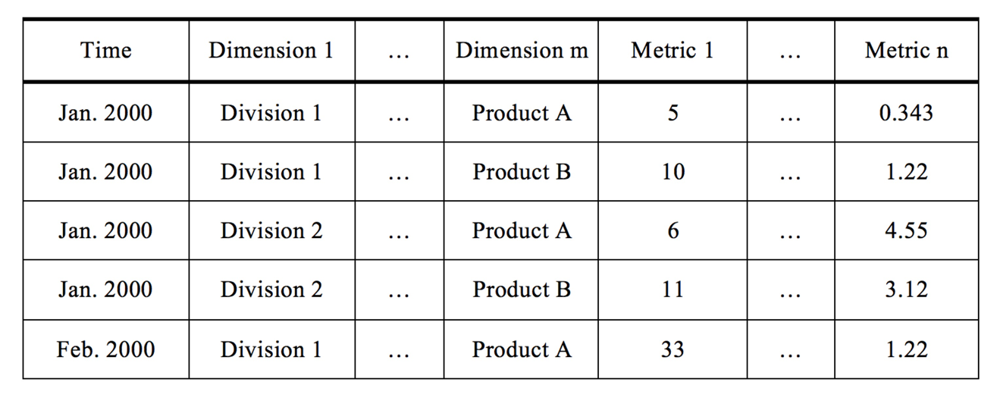

经过数据准备算法处理之后，输出的数据将转化为基于行（row-based）的数据格式， 这种数据格式将作为本系列后续介绍的数据探究、数据建模以及预测模型的唯一输入数据格式，如图 2 所示：

**图 2\. 基于列的数据格式**

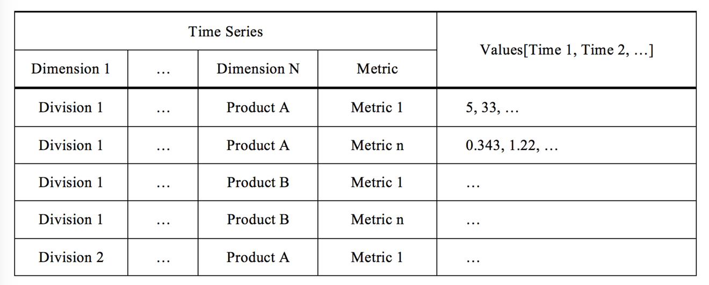

### 数据的时间间隔

时间间隔是指两个时间点之间的时间度量标准，时间序列数据准备算法（TSDP）支持 11 种时间间隔类型。对于第一到第十个类型的时间间隔，算法规定用一个时间变量来定义时间，而针对第十一类，则要求使用 k 个正整数时间变量来定义时间，其中值得说明的是，Null 类型专门用来为交易数据服务。具体的类型如图 3 所示：

**图 3\. 时间间隔类型**

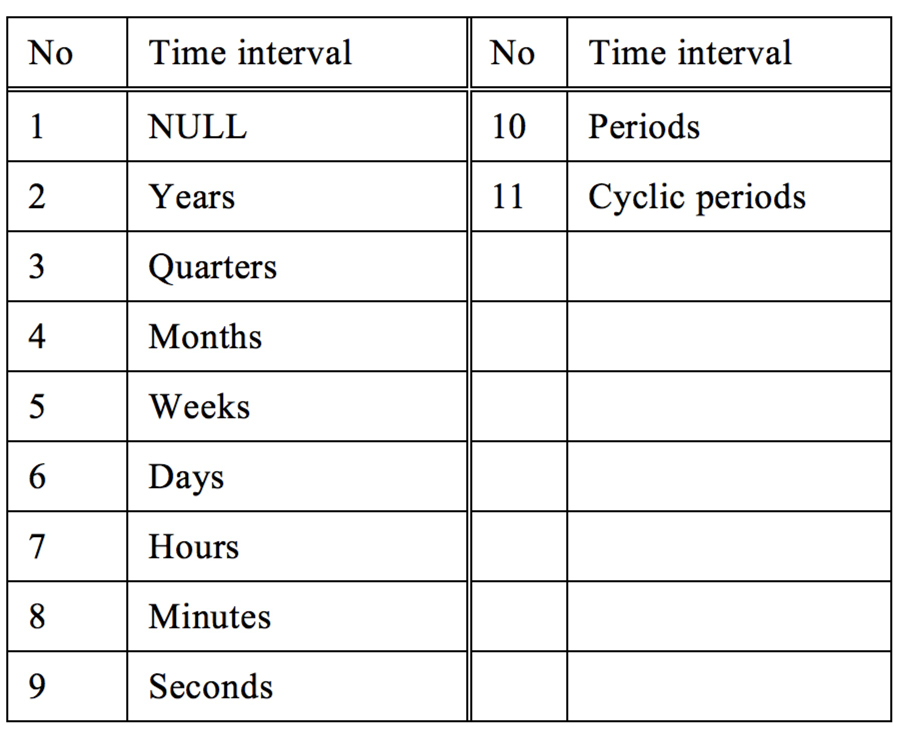

### 时间变量

从总体上分，时间序列数据准备算法（TSDP）支持两种数据格式：标准格式和非标准格式。标准时间格式支持三种类型，包含日期（date）、时间（time）以及时间戳（timestamp），涵盖年，月，日，时，分，秒等六种时间度量单位；而非标准时间格式则通过一个或者多个整数来定义时间序列，如果时间间隔为 Periods，则通过一个非负整数来定义时间顺序，如果时间间隔为 Cyclic periods，则通过 k 个正整数来定义时间顺序。

## 时间序列数据准备算法（TSDP）的功能特征

本章节将对时间序列数据准备算法（TSDP）的主要功能进行介绍，用户可以根据自己的数据处理需求自行选择各个功能或其组合进行处理。

### 数据分组

分组操作发生在对数据进行缺失值的处理之前，简单的说，它就是依据一定的准则和分组函数，将相关的数据分组为一系列的时间序列，是聚合操作的一种特例。例如当用户指定的时间间隔为月时，该功能将会对同一个月中的多个日期进行分组处理，时间序列数据准备算法（TSDP）支持五种分组函数，分别是均值（MEAN）,求和（ SUM）,众数（ MODE）,最小值（ MIN）以及最大值（ MAX）。对于交易型数据，默认的数据分组函数为求和函数（SUM），对于其他常规的数据类型，均值函数（MEAN）为默认函数。

### 数据聚合

当用户输入数据的输入时间间隔短于输出时间隔间或者用户输入的为交易型数据时，数据将会被进行聚合处理。例如用户的输入时间间隔为日，输出时间间隔为月。对于时间间隔为年类型的数据，时间将从每一年的一月一日开始；对于时间间隔为月类型的数据，时间将从该月的一日开始；对于时间间隔为日类型的数据，时间将从每一日的零时零分零秒开始；对于时间间隔为时类型的数据，时间将从每一小时的零分零秒开始；对于时间间隔为分类型的数据，时间将从每一分钟的零秒开始。当聚合操作发生后，数据本身的周期也将随着新的时间间隔而发生变化，同样的，聚合操作也支持 5 种聚合函数，分别是均值（MEAN），求和（ SUM ），众数（ MODE），最小值（ MIN）以及最大值（ MAX）函数。

### 数据分散

相反的，当用户输入数据的输入时间间隔长于输出时间间隔时，数据将会被分散到低一级的时间间隔。例如当用户的输入时间间隔为季，输出时间间隔为月时，数据将会被分散，分散操作支持两种函数，分别是均值（MEAN）以及求和（ SUM）函数。

### 数据质量检查

为了保证数据建模和预测更加的有效，该算法在对数据进行分组、聚合或者分散操作的基础上，进一步对数据的质量进行了有效的衡量和评价。具体来讲，时间序列数据准备算法（TSDP）会对每一个输入数据的有效记录，缺失值数据，零值数据的个数进行统计，并对输出数据的缺失值、空值、聚合单元数等进行统计，进而基于以上统计量对数据质量进行打分，依照打分结果对数据进行筛选。

### 缺失值处理

在通常的数据采集过程中，用户得到的数据往往并不完备，会存在大量的缺失值，缺失值的存在对时间序列的进一步分析有极大的影响，它会降低数据模型的准确性甚至令预测模型失效，所以缺失值处理是数准备算法中非常重要的一步。时间序列数据准备算法（TSDP）会基于对输入时间间隔的分组的结果进行缺失值处理，也就是说会在聚合和分散操作之前进行。数据准备算法支持五种对缺失值进行估算的方法:(1) Linear interpolation；(2) Series mean；(3) Mean of nearby points；(4) Median of nearby points；(5) Linear trend。

## 功能展示

此章节，我们将通过几种类型的数据来对时间序列数据准备算法（TSDP）的几个主要功能进行展开介绍。

### 实例一 对数据进行聚合处理

步骤一：选择数据集，数据如图 4 所示，该数据包含 4 个 Dimension 以及 5 个 Metric 的 18 个时间点，该算法支持对数据进行筛选，因此为了方便浏览处理结果，我们仅选择 Dimension3 的 C2 进行分析，如图 5 所示。

##### 图 4

##### 图 5

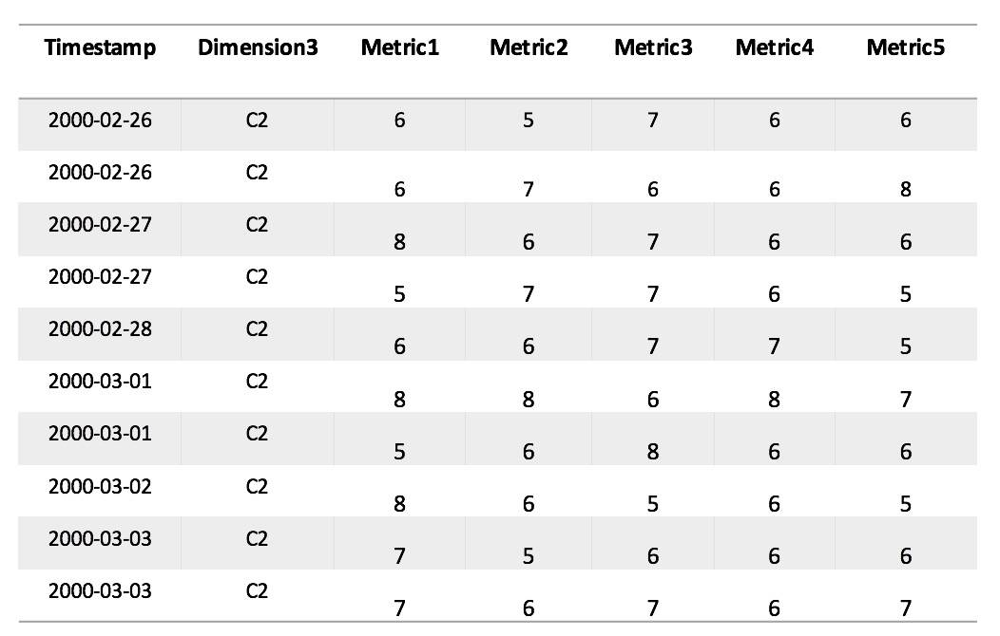

步骤二：设置 Time Interval。 当用户输入数据的输入时间间隔短于输出时间隔间时，数据将会被进行聚合处理。因此为了实现聚合操作，将 inputInterval 设置为 DAY，outputInterval 设置为 MONTH ，如图 6 所示:

##### 图 6

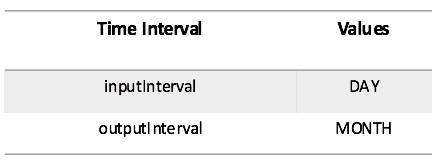

步骤三：设置聚合函数（Aggregate Function）类型和组函数（Group Function）类型，我们对数据中的五个 Metric 分别设置了 5 种不同的函数类型，如图 7 所示：

##### 图 7

步骤四：在对缺失值和数据质量不做处理的前提下，就可以得到时间序列数据准备算法（TSDP）对数据的处理结果，可以看到，该算法对同一个月的数据分别进行了聚合处理和分组处理，得到了用于后续时间序列建模的基于行的数据，如图 8 所示：

##### 图 8

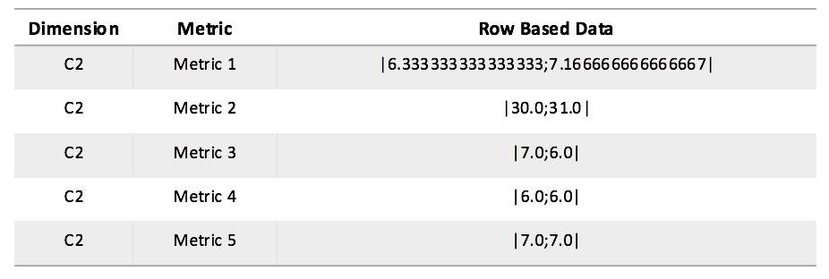

### 实例二 对数据进行分散处理

步骤一：选择数据集，数据如图 9 所示，该数据包含从 1968 年到 1972 的 100 个时间点，图 9 中显示了 前 18 个时间点：

##### 图 9

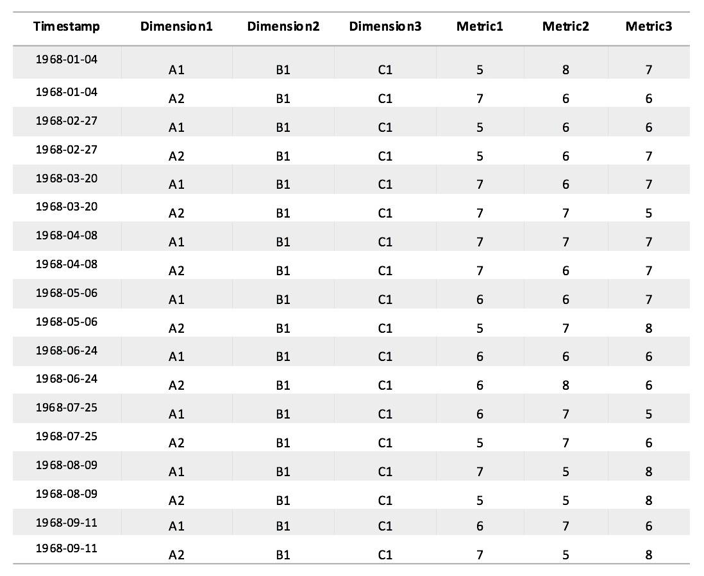

步骤二：设置 Time Interval。当用户输入数据的输入时间间隔长于输出时间隔间时，数据将会被进行分散处理。因此为了实现分散操作，将 inputInterval 设置为 YEAR，outputInterval 设置为 QUARTER，如图 10 所示:

##### 图 10

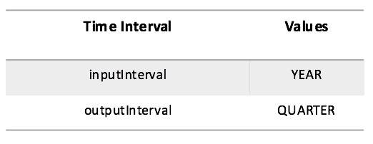

步骤三：对每一个时间序列设置分散函数（Distribution Function）类型和组函数（Group Function）类型，在这个例子中统一将函数类型设置为求和函数（SUM），如图 11 ：

##### 图 11

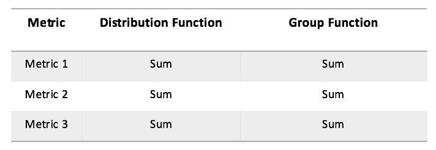

步骤四：同样的，在对缺失值和数据质量不做处理的前提下， 可以得到时间序列数据准备算法（TSDP）对数据的处理结果，可以看到，该算法对同一年度的数据进行了分散处理和分组处理，得到了用于后续时间序列建模的基于行的数据，如图 12 所示：

##### 图 12

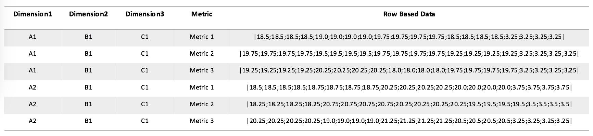

### 实例三 对缺失值进行处理

步骤一：选择数据集，数据如图 1 3 所示。该数据包含从 1968 年到 1972 的 47 个时间点，图 13 中同样显示了前 18 个时间点，可以看到数据的季度信息存在着缺失，时间序列数据准备算法（TSDP）将会对缺失数据信息进行估算处理：

##### 图 13

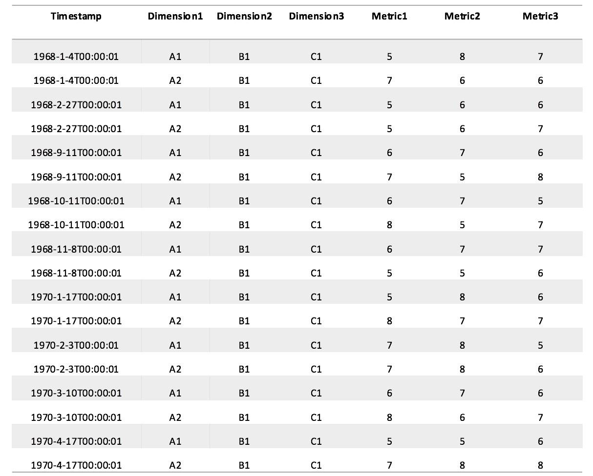

步骤二：设置 Time Interval。将 inputInterval 设置为 QUARTER，outputInterval 设置为 QUARTER，如图 14 所示:

##### 图 14

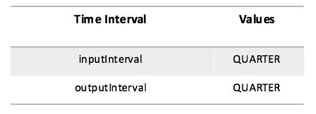

步骤三：设置对缺失值的估算方法，在本例中将其设置为 LINEAR\_INTERP，如图 15 所示：

##### 图 15

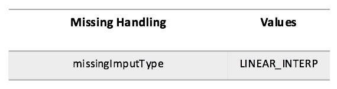

步骤四：基于以上的设置，用户就可以得到时间序列数据准备算法对该数据的缺失值的处理结果， 如图 16 所示：

##### 图 16

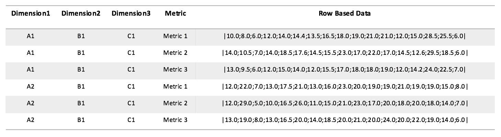

## 结束语

本文对时间序列数据准备算法（TSDP）的背景、功能以及应用做了简单介绍，同时通过三个有针对性的数据对该算法的主要功能进行了展示。在实际使用的过程中，用户不仅可以对大规模的数据集进行有效的处理，更重要的是能够针对采集到的时间类型复杂、数据质量较差，时间处理要求多样的数据集进行更加全面细致的分析，以达到对该数据进行有效的建模、预测的目的。

## 参考资料

- 了解关于 [IBM SPSS 产品](https://developer.ibm.com/zh/technologies/analytics/) 的更多信息，获取技术文档、文章、培训、下载、产品信息。