# 数据分析和平台管理
动手实践 IBM Cloud Private for Data

**标签:** 分析

[原文链接](https://developer.ibm.com/zh/articles/ba-lo-hands-on-icp-for-data2/)

吴 敏达

发布: 2018-08-28

* * *

在本系列第一篇中，介绍了 IBM Cloud Private for Data 的平台功能和架构，并熟悉了用户协作和统一用户体验。通过实践理解了 IBM Cloud Private for Data 端到端的数据收集和数据组织的能力，本文将从完成数据收集和组织以后的数据分析开始。

## 数据分析

### 分析仪表盘

IBM Cloud Private for Data 中的分析仪表板工具为业务线用户提供了一种开始调查模式和洞察数据的好方法，然后可以将仪表板交给数据科学家进行更深入的分析和预测建模。分析仪表板适用于数据分析师，不需要编程或使用 SQL 来探索数据，通过易于使用的拖放构建分析结果的可视化，分析结果可以轻松地与项目成员共享，也可以通过 URL 链接对外公开。

如图 1 从菜单中选择分析 > 分析仪表板 > 创建仪表板，选择项目和模板后，使用仪表板左侧窗格中的以下选项创建数据可视化：

- 数据源：选择数据源连接，数据源是项目的数据资产。
- 可视化：不同类型的图形显示方式。
- 小工具：将文本，媒体，网页，图像和形状等小部件添加到仪表板。

##### 图 1\. 仪表盘

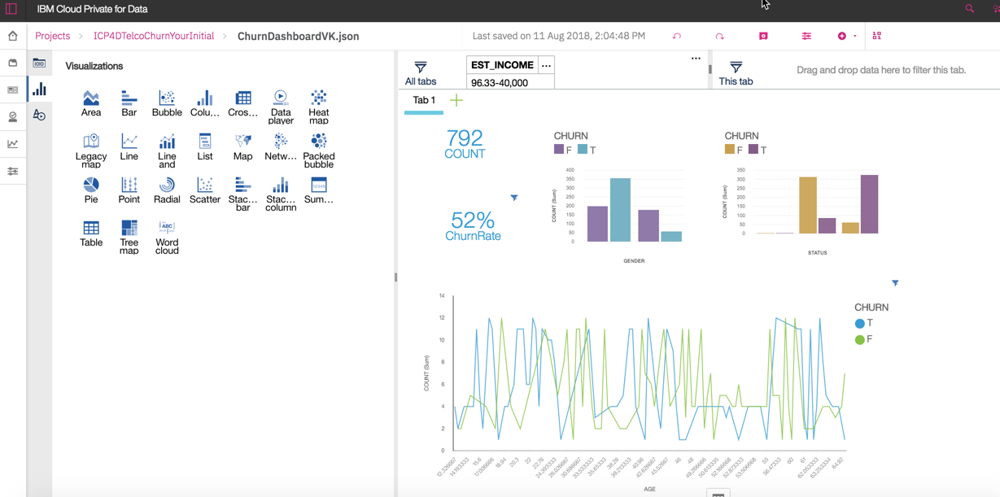

### 模型开发

IBM Cloud Private for Data 是将数据科学家所需要的所有内容汇集在一起的环境。 它包括最受欢迎的开源工具和具有社区和社会功能的 IBM 独特的增值功能，其价值体现在所有数据科学家的工具在一个地方。支持机器学习、深度学习各类框架，包括 SparkML、Scikit-learn、XGBoost、Keras、TensorFlow、Theano、Lasagne 等。并可以根据业务需要，引入最新的开源等算法，保证其先进性。

数据科学家可以三种方式建模，这些开发方式都通过数据分析项目整合起来并实现团队协作，如图 2 所示：

- 代码建模环境，IBM Cloud Private for Data 自带 Apache Spark 2.2.1 和 Spark 2.0.2：

    - Jupyter Notebook Server with Anaconda2 4.4, Python 2.7, Scala 2.11, R 3.4.1 (defaults to Spark 2.0.2)
    - Jupyter Notebook Server with Anaconda3 4.2, Python 3.5, Scala 2.11, R 3.4.1 (defaults to Spark 2.2.1)
    - Jupyter Notebook Server 4.4 with Python 3.5 for GPU (CUDA 8.0)
    - RStudio Server 1.0 with R 3.3.2
    - Zeppelin Notebook Server 0.7.3 with Anaconda2 4.4, Python 2.7
- 向导式建模环境：模型构建器引导构建模型，使用 Spark ML 算法来建立模型。
- 拖拽方式建模：支持导入 SPSS Modeler 构建的模型。

##### 图 2\. 数据分析项目

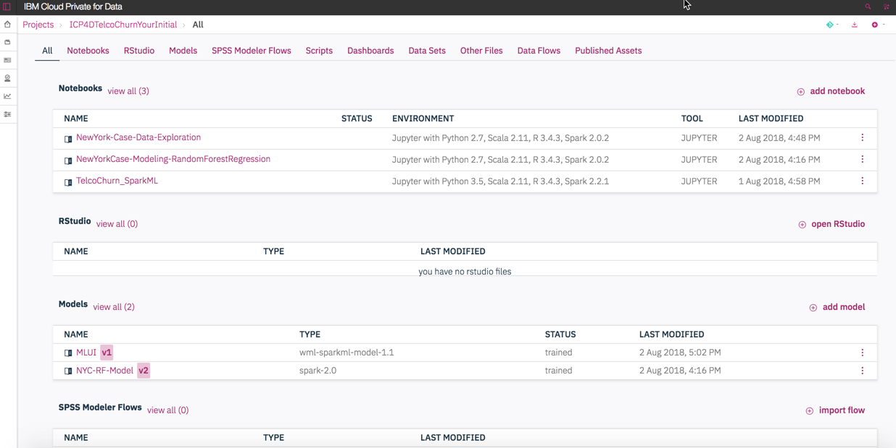

数据分析项目可以对本地数据通过清理和整形。在分析项目的资产数据集旁边的操作列表图标单击 Data Refiner 可以创建一个数据流，可以按希望的方式清理和整形数据，如图 3 所示：

- 清理数据：修复或删除不正确、不完整、格式不正确或重复的数据。
- 数据整形：筛选、排序、组合或删除列，并执行操作。

图形操作的数据流可以保存并生成 R 脚本，数据科学家可以在脚本继续修改并执行。

##### 图 3\. 数据精炼

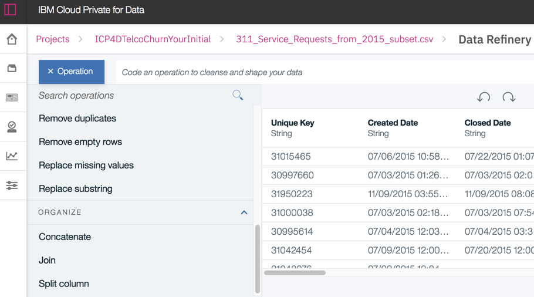

向导式建模可以通过在项目 > 资源 > 添加模型 \> 机器学习来创建，支持自动和手动两种方式创建。手动创建方式将提供数据准备面板，可以如图 4 添加特征工程的变换器。

##### 图 4\. 向导式建模选择特征工程

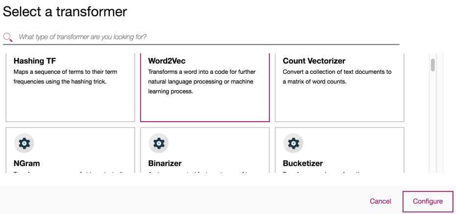

图 4 包含的特征工程变换器有：

- Hashing TF 通过散列把文本原始特征映射到索引
- Word2Vec 将单词转换为代码
- Count Vectorizer 将文本转换为字数统计矩阵
- NGram 将字符串转换为连续序列
- Binarizer 二值化将数值特征阈值化为二进制 0/1
- Bucketizer 将一列连续特征转换为一列特征桶
- Chi-Squared Selector 测试目标变量和其他特征变量之间的依赖关系
- DCT 离散余弦变换将时域中的长度为 N 的序列变换为频域中的另一序列
- ElementwiseProduct 通过标量乘数缩放数据集的每一列
- IndexToString 将一列标签索引映射回包含原始字符串的标签列
- Maximum Absolute Value Scaler 最大绝对值缩放器通过除以每个特征中最大的最大绝对值，将每个特征分别重新划分到 [-1,1] 范围
- Minimum Maximum Scaler 使用列摘要统计信息将每个要素重新缩放到 [0,1] 范围
- Normalizer 归一化将每个独立样本做尺度变换
- OneHotEncoder 将分类特征映射到二进制向量
- Principal Component Analysis (PCA) 主成分分析可以实现对特征向量的降维
- Polynomial Expansion 多项式展开是将现有特征扩展为多项式空间
- Quantile Discretizer 分位数离散化把连续的特征输出分类的特征
- Regular Expression (Regex) Tokenizer 正则表达式将文本转换为标记
- R Formula 根据 R 语言公式拟合数据集
- SQL Transformer 由 SQL 语句定义的转换
- Standard Scaler 将每个特征标准化为具有单位标准差或零均值
- Stop Words Remover 从输入序列中删除所有停用词
- String Indexer 将标签的字符串列编码为标签索引列
- Tokenizer 将文本分解为单词
- Vector Assembler 将列表组合到单个特征向量中
- Vector Indexer 索引数据集中的分类特征
- Vector Slicer 输出具有原始子阵列的新特征向量

IBM Cloud Private for Data 自带 CADS – Cognitive Assistant for Data Scientist 帮助数据科学家自动选择最优的算法训练模型，以及 HPO – Hyper Parameter Optimization 帮助数据科学家自动选取最优的超参数训练模型。通过选择要预测的列值，向导式建模会建议最佳算法，数据科学家可以添加多种算法来训练模型，最后选择最佳模型进行部署并用于预测。

##### 图 5\. 向导式建模选择算法

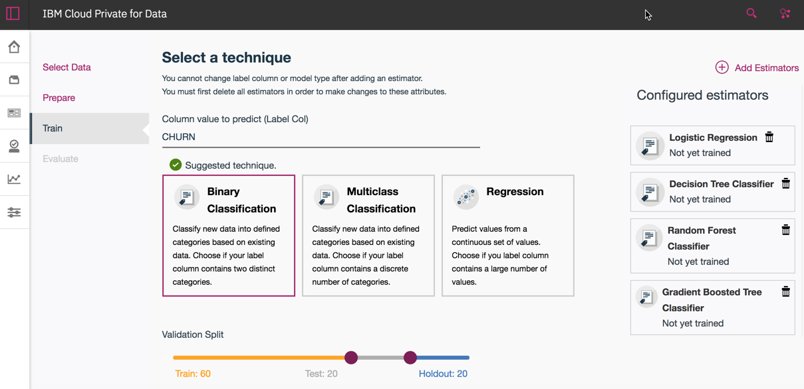

图 5 包含的算法有：

- Binary Classification 二分类

    - Logistic Regression 逻辑回归
    - Decision Tree Classifier 决策树分类
    - Random Forest Classifier 随机森林分类
    - Gradient Boosted Tree Classifier 梯度提升树
- Multiclass Classification 多分类

    - Decision Tree Classifier 决策树分类
    - Random Forest Classifier 随机森林分类
    - Naive Bayes 贝叶斯
- Regression 回归

    - Linear Regression 线性回归
    - Decision Tree Regressor 决策树回归
    - Random Forest Regressor 随机森林回归
    - Gradient Boosted Tree Regressor 梯度提升树
    - Isotonic Regression 保序回归

### 模型管理

IBM Cloud Private for Data 管理机器学习模型的完整生命周期，包括开发、部署和运维，可以管理以下类型的模型：

- Spark ML
- PMML with online scoring
- Custom models with batch scoring
- scikit-learn 0.19.1 (Python 2.7 and Python 3.5) – 0.19.1 (GPU-Python 3.5) with pickle or joblib format
- XGBoost 0.7.post3 (Python 2.7 and 3.5) – 0.71 (GPU-Python 3.5)
- Keras 2.1.3 (Python 2.7 and Python 3.5) – 2.1.5 (GPU-Python 3.5)
- TensorFlow 1.5.0 (Python 2.7 and Python 3.5) – 1.4.1 (GPU-Python 3.5)
- WML

数据科学家可以根据偏好，用多种方式生成 IBM Cloud Private for Data 管理的模型：

- 使用 API 创建模型

不论使用 Jupyter Notebook、Zeppelin Notebook 或 RStudio，IBM Cloud Private for Data 都提供 API 保存到内置的机器学习存储库进行管理，如图 6 所示。

##### 图 6\. 使用 API 保存模型

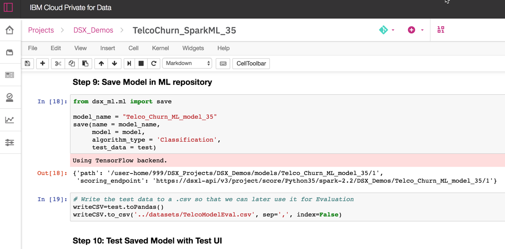

- 从文件导入创建模型

目前支持导入三种类型的模型：

- PMML：用 Predictive Model Markup Language 编写的 XML 文件。
- 自定义批处理作业模型，支持第三方 Carolina 移植的 SAS 模型。
- 自定义在线预测模型，支持第三方 Carolina 移植的 SAS 模型。
- 使用模型构建器创建模型，如图 5 所示。

IBM Cloud Private for Data 模型仪表盘实现端到端的模型管理，如图 7 所示，包含以下内容：

- 模型开发

    - 准备和分析数据
    - 创建分析资产（模型，Notebook，Shiny 应用程序等）
    - 即席分析
- 模型部署

    - 部署分析资产以进行批处理评分
    - 部署分析资产以进行实时评分
    - 与业务应用程序集成
    - 部署 Shiny 应用程序
- 模型运维

    - 监控分析资产性能
    - 使用新的历史数据刷新分析资产

##### 图 7\. 模型仪表盘

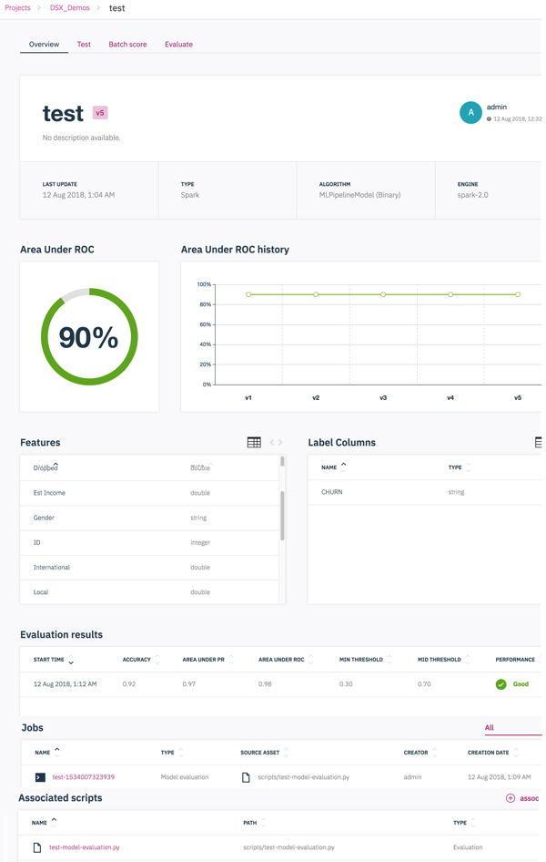

模型仪表盘可以比较模型每个版本的准确性。单击模型旁边的测试，可以输入数据并将其作为饼图或条形图模拟预测。选择模型旁边的批量评分，可以生成批量评分脚本，并可以修改运行。选择模型旁边的评估，可以自定义模型健康算法和阈值，并生成评估脚本并运行。

### 模型部署

IBM Cloud Private for Data 模型部署功能提供了开发和生产环境的分离。数据科学家在一个项目上进行合作，当他们完成开发和测试时，他们会通知管理员该项目已准备好在生产中部署。管理员进行项目发布，并配置部署到生产环境。管理员可以锁定该项目以防止未经授权的更改。启动项目时，已部署资产的 REST API 可用，并且所有计划作业将按配置运行。

整个模型部署包括以下功能：

- 部署在线评分模型
- 部署用于批量评分的模型、Notebook 和脚本
- 部署 Shiny 应用程序
- 定期进行模型评估
- 管理员部署资产到生产环境并进行更新
- 启动或锁定版本

首先，分析项目必须已经提交变更并具有变更标记，如图 6 所示。管理员单击分析 > 模型管理和部署，创建项目发布，如图 8。

##### 图 8\. 项目发布

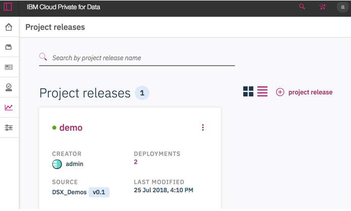

项目发布中的资产通过部署可以自动生成访问资产的永久链接 URL 或 REST API 链接：

- 作业：生成 REST API 链接可以启动、停止和获取该作业的状态。只有经过身份验证的用户可见。
- Web service：为外部应用程序生成 REST API 链接。 只有经过身份验证的用户可见。
- 应用：生成将资产代码和 Shiny 应用发布为运行的 URL。

如图 9，选择资产标签页，查看创建的部署类型和部署的版本，可以指定该部署的计算资源。对于 Web Service，可以选择多副本数实现负载平衡。

##### 图 9\. 模型部署

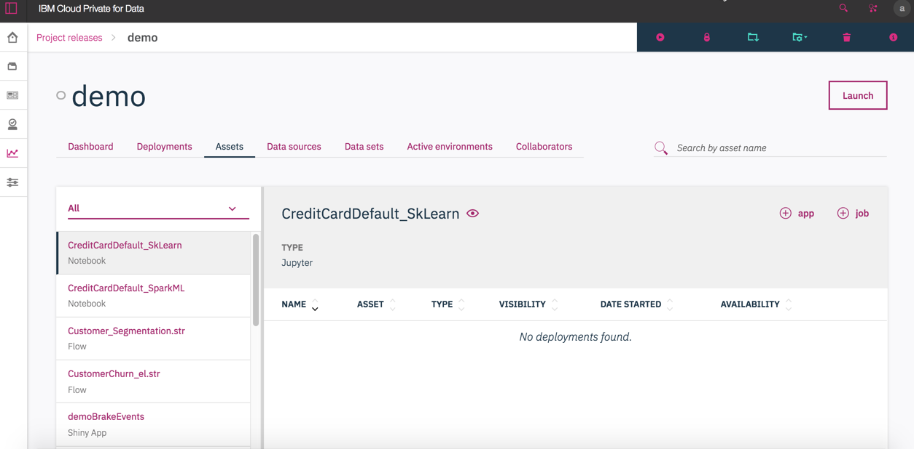

在部署选项卡中，可以单击部署以获取其详细信息，也可以启动、停止、删除或重新部署。 如果部署任何资产的新版本，URL 不会更改可以保证对应用透明。如图 10 所示的模型 Web Service 部署，可以看到左上方显示 REST API 链接，右上方可以获得授权的 Token，这样应用就能用 JSON 的数据输入获得模型的评分结果，点击 API 标签可以进行测试和获得应用示例代码。中间显示了被请求的次数和性能等指标，下方可以看到多副本的运行状况和日志。

##### 图 10\. 部署管理

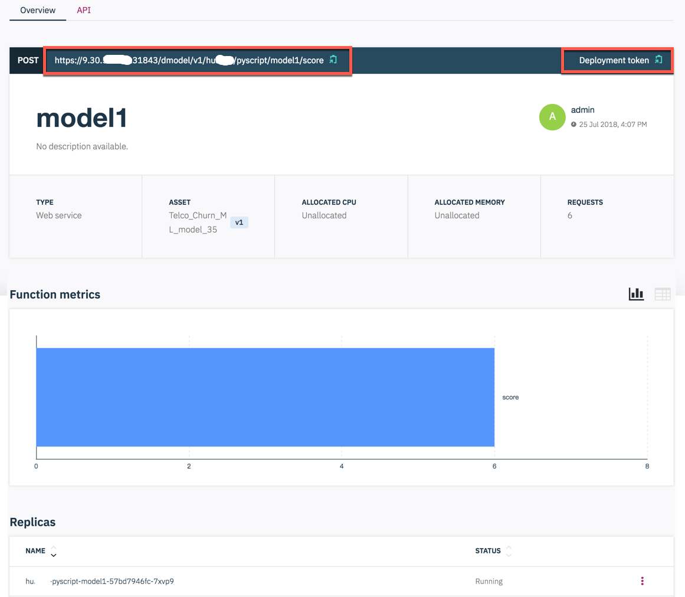

模型部署还支持 R 或 Python 脚本部署为 Web Service 或批处理作业，给物联网等应用开发带来极大的方便。

### 远程 Spark 调用

IBM Cloud Private for Data 的 Hadoop 集成服务是一种可以安装在 Hadoop 集群的边缘节点上的服务。 安装服务并注册 Hadoop 集群后，用户可以安全地访问 Hadoop 集群上存在的数据，提交远程 Spark 作业，构建模型以及发布在 YARN 上运行的作业。

从导航菜单中，选择管理 \> Hadoop 集成服务，如图 11 注册 Hadoop 集群，根据配置会自动创建 HDFS 和 Hive 数据源，还需要把 IBM Cloud Private for Data 的镜像推送到 Hadoop 集群。用户可以列出可与 Jupyter，RStudio 和 Zeppelin 一起使用的可用 Hadoop 集群 Livy 服务，就可以向 Hadoop 集群提交远程 Python 作业。

##### 图 11\. 部署管理

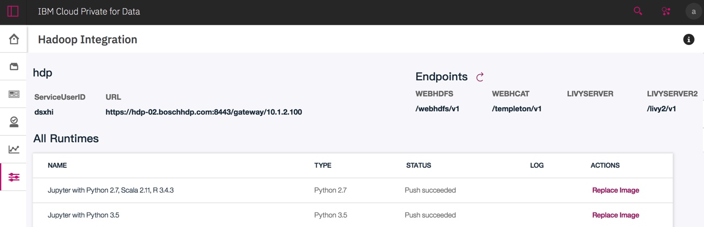

## 平台管理

IBM Cloud Private for Data 是作为私有云平台开发的，而不是工具的集聚。这是通过构建在把功能和数据暴露成微服务和 API 的容器体系结构实现的。作为私有云平台，配置管理由 Kubernetes 自动进行。

管理员可以从 IBM Cloud Private 管理控制台获得 IBM Cloud Private for Data 部署的详细使用情况指标。使用计量服务查看和下载应用程序和群集的详细使用指标。例如可以看到不同的工作负载如何使用容器资源。

IBM Cloud Private 管理控制台导航到平台 > 计量页面：

- 平台显示有关工作节点的信息，并显示可用处理器的数量以及在指定时间段内运行的容器数。
- 容器提供有关工作负载的信息，包括 CPU、内存等信息。通过选择 zen 命名空间可以查看 IBM Cloud Private for Data 的容器信息。

可以下载显示群集中所有容器的每月使用情况的报告（CSV 电子表格），该报告包括每个容器的使用情况。图 12 显示了数据库容器的工作负载情况。

##### 图 12\. 数据库容器的工作负载

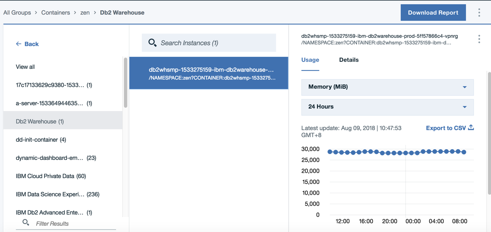

IBM Cloud Private for Data 是多租户的平台，不同项目和不同用户的资源是隔离的。对于要求高性能的分析项目，可以导航到分析 > 环境页面，设定保留的 CPU、内存和 GPU 资源，同时也可以关闭不需要的环境资源，如图 13 所示。

##### 图 13\. 环境配置

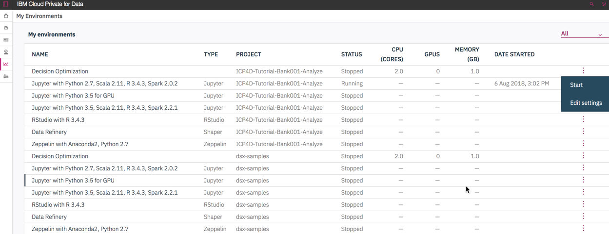

图 14 修改了开发环境容器的计算资源的分配，在生产环境的模型部署可以这样调整计算资源。

##### 图 14\. 容器的资源

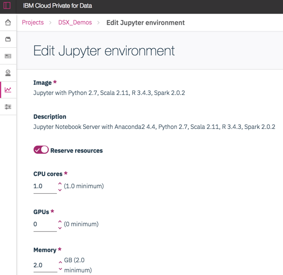

## 总结

IBM Cloud Private for Data 是一款专为数据科学，数据工程和应用程序构建而设计的解决方案。这是预先打包的企业级解决方案，具有高度集成的数据和分析服务以及简单的协作式任务驱动体验。不同角色都可以在单一的集成体验中找到相关数据，进行分析、构建模型并部署到生产环境中。

IBM Cloud Private for Data 可以实现：

- 数据库管理：配置数据库，联合数据访问。
- 数据科学：访问开源工具、框架和 IBM 增值工具。
- 数据探索：数据库模式和表的探查，元数据同步到企业数据资产目录。
- 分类与治理：自动分类目录中的数据资产，为资产分配业务术语、标记，以及基于机器学习的智能模式匹配。
- 清洗和转换：数据转换作业，使用数据源定义，ETL 流程管理。
- 规则管理：业务规则和数据资产验证，定义企业数据资产目录中的质量标准。
- 机器学习模型管理和部署：机器学习模型的部署，具有弹性和负载平衡，监控和管理生产模型。

##### 图 15\. 平台能力

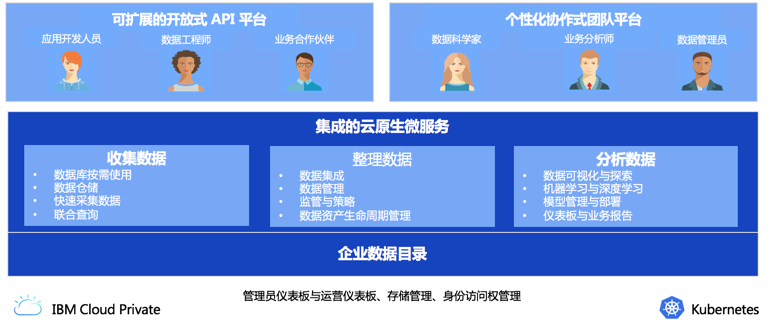

IBM Cloud Private for Data 的用户体验是具有基于角色，使用不同功能但通过企业数据资产目录在统一平台进行协作。例如：数据管理员可以管理数据目录和数据集分类和管理的业务词汇表。数据工程师可以访问诸如选择数据源，清洗转换以及运行 ETL 作业等功能。业务分析师可以访问他们熟悉的仪表板。数据科学家利用 Jupyter Notebook 开发模型，对模型从开发、测试、部署、运维整个生命周期进行管理。

##### 图 16\. 团队协作

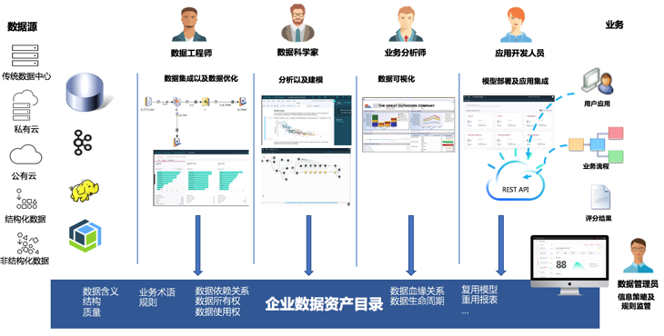

## 参考资源

- 参考 [IBM develop 中国](http://developer.ibm.com/zh/) 首页，查看 IBM 软件和开放技术的最新信息。
- 查看 [IBM Cloud Pak for Data](https://www.ibm.com/products/cloud-pak-for-data) 官网
- 免费试用 [IBM Cloud](https://cocl.us/IBM_CLOUD_GCG)