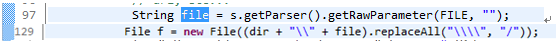
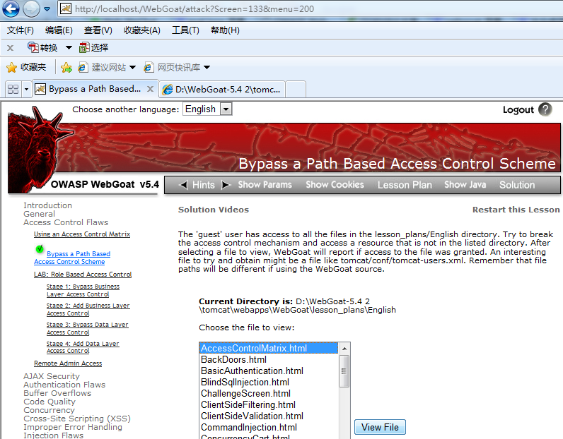
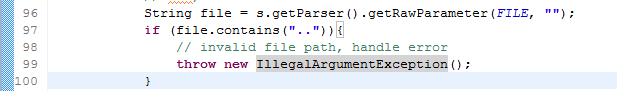
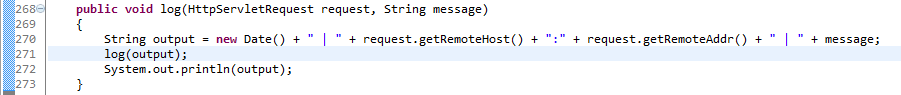
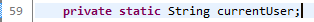
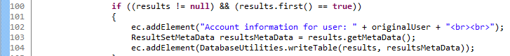
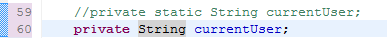
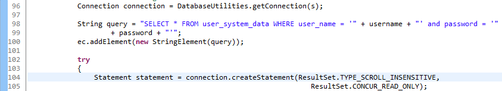

# 文件路径操纵、系统日志欺骗、线程安全和资源未释放
源码审计思路和攻防演练实战

**标签:** Java,Web 开发

[原文链接](https://developer.ibm.com/zh/articles/j-lo-audit-file-safe/)

叶林, 张东升, 贺新朋

发布: 2015-11-20

* * *

## 前言

本文是 JavaWeb 工程源代码安全审计实战的第 3 部分，基于 WebGoat 工程，讲解四种高危漏洞：文件路径操纵、系统日志欺骗、线程安全和资源未释放问题。重点讨论的是源码审计思路和攻防演练实战。

## Web 应用威胁之文件路径操纵

### 技术原理

当攻击者可以指定文件名、文件路径等文件操作的参数，就有可能越权访问正常情况下无法到达的系统资源。

### 问题分析 PathBasedAccessControl.java129

源代码审计发现 PathBasedAccessControl.java 第 129 行 File() 方法。攻击者有可能控制文件路径越权访问或者修改被保护的其他文件。该文件内容被作为页面元素显示。

##### 图 1\. 问题代码段



在已部署的 WebGoat 工程，启动生产环境。模拟攻击者登录，在左侧导航目录下点选”Access Control Flaws – Bypass a Path Based Access Control Scheme”, 任选一个 combox 中的 xx.html 文件，点击”View Profile”提交。

**攻击场景**

##### 图 2\. 文件路径操纵攻击场景



### 解决方案

**快速修复**

解决 WebGoat 工程的示例的文件路径操纵问题，可以在 PathBasedAccessControl.java 第 97 行方法，添加对文件路径的校验。代码片段如下：

##### 图 3\. 整改文件路径操纵的代码



部署整改后的代码，重新运行攻击场景，不可再现攻击。

### 举一反三

一般的，为防止文件路径操纵问题，开发者首先要使用正确的系统函数，其次可以自定义根据需要对文件操作参数进行过滤， 还可以利用服务器安全访问框架。提供以下五种思路：

1. 使用规范路径 getCanonicalPath()

     攻击者可以用包含 ../序列的参数来指定位于特定目录之外的文件，从而违反程序安全策略，引发路径遍历漏洞，攻击者可能向任意目录上传文件。

     Java 语言对路径的操作有 getAbsolutePath() 获取绝对路径和 getCannonicalPath() 获取规范路径。getCannonicalPath() 首先将路径名转换成绝对路径名，这与调用 getAbsolutePath() 方法的效果一样。然后用与系统相关的方式将它映射到其惟一路径名。这通常涉及到从路径名中移除多余的名称（比如 “.” 和 “..”）、分析符号连接（对于 UNIX 平台），以及将驱动器名转换成标准大小写形式（对于 Microsoft Windows 平台）。所以应该尽量使用规范路径，规避攻击者可能使用的多余的分析符号。

2. 开发者为使用到的文件操作参数进行输入验证，过滤字符（如”.”和”..”）

3. 针对应用场景，限制文件类型。比如使用的图片文件只能是后缀.png, .jpg 而不可能是.bat, .sh。 建议加强对文件的判断，要通过文件头而不仅仅是文件后缀来判断。

4. Java 安全管理器 permission Java.io.FilePermission

5. 服务器安全配置策略文件。能将所能读取的文件限定在特定的目录下。如何配置安全策略文件，和具体使用的服务器类型相关


## Web 应用威胁之系统日志 (Log) 欺骗和隐私泄露

当攻击者有可能写 Log 信息的时候，就有可能构造虚假信息，迷惑 Log 读者，迷惑系统运维调试人员调试系统故障。Log 欺骗可以协助攻击者开展大型可持续攻击 (APT)。

源代码审计发现 HammerHead.java 第 271 行记录未经校验的 message，代码片段如下：

##### 图 4\. 问题代码段



在已部署的 WebGoat 工程，启动生产环境。

模拟攻击者登录，在左侧导航目录下点选”Injection Flaws – Log Spoofing”, 在文本框输入”Smith%0d%0aLogin Succeeded for username： admin”, 提交后假定服务器 Log 这段文本，将会在 Log 文件中新的一行中写入虚假信息”Succeeded for username： admin”。攻击的小窍门在换行符号\\n，也就是转码后的 %0d%0a, 换行使 Log 中的欺骗信息看起来更真实。

WebGoat 的这个示例项目只是描述性展示，没有真正代码执行写服务器日志。

### 解决方案

1. 换行符”\\n”。Log 欺骗最关键的元素就是换行符，如果 Log 信息用黑名单过滤，”\\n”一定要出现在黑名单中。如果 Log 信息用白名单过滤，”\\n”一定不能出现在白名单中

2. 开发完成，在生产环境上线之前，要全部删除 System.out()

3. 分级 Log 开关。软件开发版本和发布版本，打开不同级别的 Log 开关，清晰记录的同时将危害降到最小范围

4. 控制 Log 内容。不以任何方式记录用户的敏感信息，哪怕是加密过的

5. 不记录隐私信息。当用户隐私信息被写到 Log 中时，就造成了隐私泄露。尤其是密码信息，即使是加密之后的密码信息，也不应该被存储到 Log 中。因为任何加密算法都有被破解的可能


WebGoat 工程演示了几十个 Web 问题案例，比如上传并执行恶意文件等等。本文篇幅有限，不一一列举其他案例。

以上谈论了 Web 高危漏洞的审计。下面讲述几个由于 Java 语言特性，容易引导开发者犯下的编程错误。这些代码缺陷使得工程不健壮，需要定点审计排查、整改。

## Java 和 JSP 代码缺陷之线程安全

线程同步问题的本质是全局共享静态变量，导致同一线程下的两个浏览器，互相影响对方。比如快速连续点击 A,B 两个不同浏览器端的提交按钮。如果 B 对静态变量的修改恰巧发生在 A 的对静态变量的修改之后、A 页面回复内容生成之前，那么 A 浏览器和共享全局变量相关的页面内容，可以被后提交的 B 浏览器页面内容所覆盖。这违背了开发者的本意。如果是电商网站，商品价格存在线程同步问题，可能导致 A 用户用低廉的总价购买到昂贵商品。

线程安全问题能隐藏的很深，一般单元测试无法发现。因为程序在机器时间级别执行，攻击者难在切合的时间点打断线程。但是如果设计高级攻击场景，先用拒绝服务攻击 DDoS 消耗系统资源，使得程序运行缓慢 (WebGoat 工程用 sleep 函数模拟)，这时问题就凸显了。线程安全问题亟需在安全开发和代码审计阶段被检查到。

源代码审计发现 ThreadSafetyProblem.java 第 59 行定义静态变量 currentUser，代码段如下：

##### 图 5\. 问题代码段之定义静态变量



ThreadSafetyProblem.java 第 92 行使用 currentUser 之前有 1.5 秒的休眠时间，这导致 currentUser 有可能被不同浏览器修改，进而得到违背开发者设想的污染数据 results。

##### 图 6\. 问题代码段之 sleep


ThreadSafetyProblem.java 第 104 行是爆发点，使用被污染的 results 构建页面元素。

##### 图 7\. 问题代码段之爆发点



**攻击场景**

部署 WebGoat 工程，启动生产环境。

开启两个浏览器 A 和 B. 在左侧导航目录下点选”Concurrency – Thread Safety Problems”。

A 浏览器输入用户名 Jeff，提交；

B 浏览器输入用户名 dave，快速提交；

可见 A 的页面内容更新为 B 的 dave 表格。

### 解决方案

ThreadSafetyProblem.java 第 59 行注释掉静态变量，改为局部变量 currentUser，代码段如下：

##### 图 8\. 整改线程安全的代码



以上整改代码编译部署后，WebGoat 生产环境的攻击场景不再出现。

线程同步问题有很多对策，根据应用场景，灵活采纳以下方法：

1. 首先推荐将变量定义为局部变量，而不是全局静态变量。

2. Java 语言本身对线程提供了原生支持 synchronized，通过同步一块代码或整个方法能够保证同时最多只有单个线程执行它，从而实现了线程安全。引入同步具有副作用，即阻塞。开发者应尽量避免使用同步。无论是 synchronized 关键字，还是那些同步类（Hashtable 或 Vector），应尽量避免使用。

3. 历史上曾经使用 JSP/Servlet 提供的 isThreadSafe 属性/SingleThreadModel 接口解决全局变量线程安全问题。SingleThreadModel 不能解决所有的线程安全问题。即便使用了 SingleThreadModel，会话 (session) 属性仍然可以被多线程的请求同时访问。SingleThreadModel 每个 Thread 都有自己的实例，比较消耗内存资源。Servlet API 2.4 版本不推荐使用 SingleThreadModel 接口。

4. 如果 Java Web 使用了框架，可以通过配置框架达到线程安全。如果使用 Struts2 框架，它的默认实现模式是 Prototype, 对每个请求 (request) 都新生成一个 Action 实例，所以这里不存在全局变量引起的线程安全问题。如果不仅仅用到 Struts2，而是 Spring + Struts2，用 Spring 去管理 Struts2 的 Action，那么要注意 Spring 默认使用的是单例模式，要修改 Spring 配置文件的 Scope 为 Prototype。


## Java 和 JSP 代码缺陷之资源未释放

WebGoat 工程，用 Fortify 工具扫描共发现 196 个资源未释放问题，其中 175 个数据库连接资源未释放问题，21 个流文件资源未释放。

一般而言，Java 语言的 JVM 的垃圾自动回收机制能处理很多资源释放问题，但是也会带来性能方面的负担，带来 DDoS 隐患。所以建议开发者主动释放不再使用的资源，而不是全盘依赖 JVM。

源代码审计发现 DOS\_Login.java 第 104 行 createContent() 方法得到的 statement 没有显式释放，这导致第 96 行 getConnection() 的系统资源被锁定。代码片段如下

##### 图 9\. 问题代码段



攻击场景：WebGoat 虽然没有对资源释放漏洞的示例工程，容易理解通过这个漏洞能进行 DDoS 拒绝服务攻击。

### 解决方案

在 finalize() 方法中显式释放 statement 代码段形如：

```
finally {
if ( null != statement) {
safeClose(statement);}
}

```

Show moreShow more icon

其他代码缺陷：源代码扫描还能发现 WebGoat 工程几十个代码缺陷（实际报告上百个代码缺陷问题，有些是交叉引用），硬编码，弱加密等等。理解和整改比较直白。篇幅有限，不一一列举。

## 结束语

本文是 JavaWeb 工程源代码安全审计实战的第 3 部分，主要针对文件路径操纵、系统日志欺骗、线程安全和资源未释放，讲解审计逻辑，用 WebGoat 工程实现攻防演练。JavaWeb 工程源代码安全审计实战的第四部分，将审计生产环境部署配置问题，欢迎阅读。