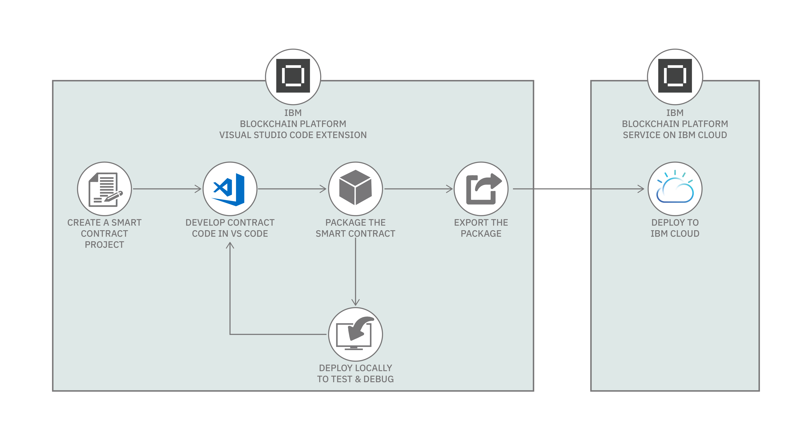
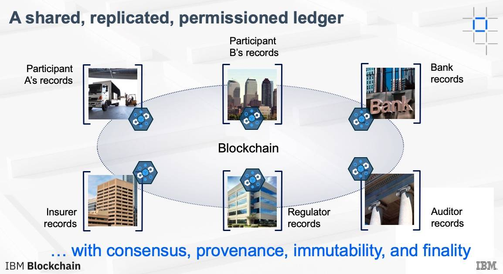
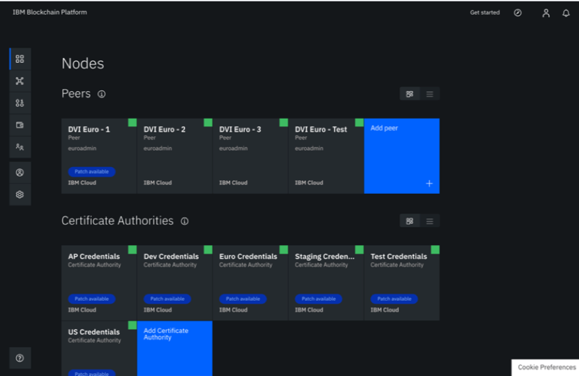
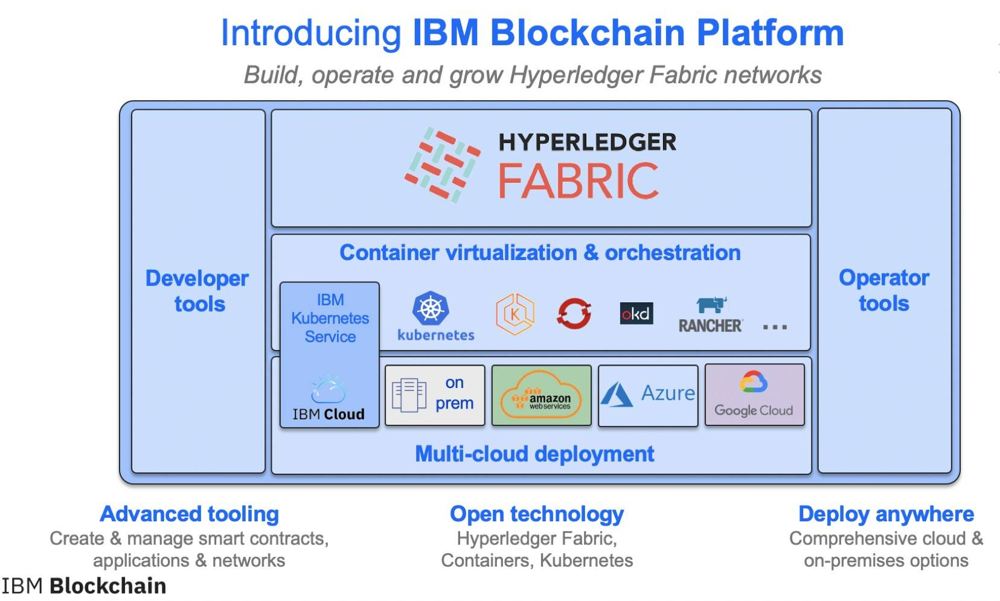

# 最佳实践：创建成功的区块链应用程序
开发首个正式区块链应用程序的技巧

**标签:** Hyperledger,Hyperledger Fabric,区块链

[原文链接](https://developer.ibm.com/zh/articles/from-vision-to-reality-creating-a-successful-blockchain-application/)

Lennart Frantzell

发布: 2020-01-08

* * *

Satoshi Nakamoto 在 2008 年发布了对革命性的点对点电子现金版本的构想“ [比特币：一种点对点的电子现金系统](https://bitcoin.org/bitcoin.pdf)”，这一构想迅速席卷了开发者社区。虽然比特币和加密货币的概念首先激发了世人的想象，但 Nakamoto 的论文还描述了第二个概念： **区块链**。这种基于账本的系统不仅可以用作比特币的传输机制，而且还可以用作任何数字对象的传输机制。

但是创建有效区块链应用程序的最佳实践有哪些？只是将数据放在区块链上并使用智能合约中包含的代码（也就是链码）进行操作还远远不够。为了取得成功，开发者需要熟悉许多架构领域和最佳实践。本文提供了一组关键的最佳实践，可以帮助您创建成功的区块链应用程序。

1

## 利用现有用例

在开始开发区块链应用程序之前，开发团队需要利用现有用例，这些用例描述了他们打算解决的业务问题的最佳实践。

此时，考虑 IBM 的三个区块链黄金法则很有用：

1. 必须解决一个业务问题
2. 必须具有可识别的业务网络
3. 必须要求信任网络

IBM 还提供了一个 [成功区块链用例](https://www.ibm.com/blockchain/use-cases/) 的详尽页面，开发者可以在开始开发之前使用该页面。

另一个重要资源是 IBM Blockchain Garage，它使用的是围绕 [设计思维](https://www.ibm.com/design/thinking/) 构建的方法，开发团队可以在此付费获得帮助来开发最小可行产品 (MVP)。

如果没有一个或多个用例作为指导，任何开发团队都不应开始开发。对于现有用例，供应链空间提供了迄今为止最流行的成功用例。

个有用的资源是 [面向区块链的 IBM Developer Code Pattern](https://developer.ibm.com/zh/technologies/blockchain/)，它提供了随时可用的开源代码，开发者可以即取即用。

2

## 克隆现有应用程序

区块链技术仍是相对较新的技术，许多开发团队使用起来可能都不会十分自如，除非他们已经有了相当丰富的经验。正因为如此，您会发现区块链应用程序会出现在一些明确界定的区域，例如供应链，更具体地说是咖啡供应链。一旦开发团队在某个业务领域（例如咖啡供应链）中取得成功，他们通常发现会冒出许多克隆，这些克隆将现有解决方案应用于新的和类似的业务领域，例如，不同地理区域的咖啡。

由于许多区块链应用都是开源的，尤其是那些使用 Hyperledger 不同方言（例如 Hyperledger Fabric）的应用，因此，对新成立的开发团队，建议第一步是克隆现有的区块链应用，并将其应用于略新的领域。在这里，咖啡供应链中的区块链应用提供了一个很好的起点。

谈到我们的区块链开发团队，它应该是什么样子？该团队应包含：

1. 一位经验丰富的首席架构师，对加密、性能和最佳实践区块链架构有着深入的了解
2. 一位领域专家，与架构师水平相当
3. 一些开发者和区块链操作者

一开始总共约有六位开发者，随着项目的推进，这个数字可能会增加。资金不在本文的讨论范围之内。

3

## 了解 Fabric 概念

“ [区块链基础知识：Hyperledger Fabric](https://www.ibm.com/developerworks/cn/cloud/library/cl-blockchain-hyperledger-fabric-hyperledger-composer-compared/index.html)”一文准确地概述了 Hyperledger Fabric 框架中嵌入的基本必知区块链概念。

以下是关键组件：

- **资产** — 使用智能合约在区块链上放置和搜索的内容。
- **共享账本** — 账本负责记录资产的状态和所有权。
- **智能合约（或链码）** — 链码是定义资产和相关交易的软件。
- **订购服务** — 订购服务将交易打包成块，并保证交易在网络中的传递。关键订购服务是 Raft 和 Kafka。

正如我之前提到的，开发团队快速掌握这些概念的最佳方法是重新实施现有的开源项目，例如 [Blockchain Bean](https://www.ibm.com/thought-leadership/blockchainbean/) 或其他成功的开源 Hyperledger Fabric 项目。

4

## 选择正确的平台

用于创建区块链应用程序的平台和开发工具有很多。本文重点介绍以下三个：

1. Hyperledger Fabric
2. Visual Studio Code
3. IBM Blockchain Platform

### Hyperledger Fabric

[Hyperledger Fabric](https://www.hyperledger.org/projects/fabric) 是一个开源项目，由 Linux 基金会管理。它旨在用作开发具有模块化架构的区块链应用程序或解决方案的基础。Hyperledger Fabric 支持组件即插即用。它的模块化通用设计满足了广泛行业用例的要求，并提供了一种独特的共识方法，可在保持隐私的同时实现大规模性能。此外，Hyperledger Fabric 还随附 [出色的文档](https://hyperledger-fabric.readthedocs.io/en/release-1.4/blockchain.html)。

### Visual Studio Code

具有 [Blockchain VSCode 扩展](https://github.com/IBM-Blockchain/blockchain-vscode-extension) 的 [Visual Studio Code](https://code.visualstudio.com) 可帮助开发者创建、测试和调试智能合约，连接到 Hyperledger Fabric 环境，并构建可在您的区块链网络上进行交易的应用程序。

在确定用例后，开发团队将 Hyperledger Fabric 与 VS Code 扩展一起使用，以使用智能合约创建区块链应用程序。VSCode 扩展随附一个教程库，该教程库易于遵循，并专注于使用智能合约处理区块链。

我们使用 VS Code 扩展来创建、打包、安装、实例化以及提交和评估智能合约。

**图 1\. VS Code 扩展流程流**

可以在 Code Pattern“ [创建和执行区块链智能合约](https://developer.ibm.com/zh/patterns/create-and-execute-a-blockchain-smart-contract-ibp-v20/)”中找到有关智能合约的更多信息。智能合约是创建区块链应用程序的主要方式。

VSCode 扩展教程库显然非常适合入门，介绍了如何在 Hyperledger Fabric 和 IBM Blockchain Platform 中使用智能合约创建区块链应用程序。

### IBM Blockchain Platform

[IBM Blockchain Platform](https://www.ibm.com/blockchain/platform) 是一个基于云的平台，用于在您选择的基础架构上创建和运行区块链企业应用程序。您现在可以将 IBM Blockchain Platform 部署到 IBM Cloud、AWS 或 Azure 等公共云，或者使用诸如 LinuxONE 之类的安全基础架构在私有云中进行内部部署。

尽管大多数开发团队都是从 Hyperledger Fabric 或因 Hyperledger 的某些其他便利而开始其开发旅程的，但几乎可以肯定的是，他们最终都会在公共云或不同配置的多个云中部署其应用。

5

## 账本和区块链

**图 2\. 区块链系统的核心**

一旦确定了有据可查的用例，开发团队便将重点放在架构业务网络上。该业务网络使用所有参与者都可以访问的共享账本。（我在上面的第 3 节中提到了账本。）作为管理业务交易的一种方式，业务账本已经存在很长时间了。但是，传统的账本始终需要将每个业务参与者的账本与业务网络中所有其他参与者的账本进行对账 — 这既费时费力又容易出错。

通过强制业务网络中的所有成员使用同一个共享账本来免除对账操作，是一项历史性的创新。放弃对账还意味着，共识在业务网络中占据重要地位。网络中的所有成员都必须先达成一致，然后才能将任何交易放入账本。

该账本使用具有以下特征的共享区块链：

- **共识机制**，例如 Raft 或 Kafka，有助于实现区块链的崩溃容错能力。
- **加密散列**，如 SHA256，用于标记对区块链上交易的任何更改。
- **数字签名** 确保交易并非源自冒名顶替者。
- **可溯源性** 用于跟踪区块链上某个项目的来源。
- **不变性** 确保放置在区块链上的数据无法更改。
- **最终性** 确保一旦将交易包含在区块中并添加到区块链中，便立即视为完成交易。

有关账本的更多信息，参阅“ [区块链基础知识：分布式账本简介](https://www.ibm.com/developerworks/cn/cloud/library/cl-blockchain-basics-intro-bluemix-trs/index.html)”。

### 链上和链下

但是，对于开发团队而言，这不仅仅是插入区块链并开始运行的问题。他们必须先确定哪些数据属于区块链，哪些数据不属于区块链。例如，如果您希望能够快速进行搜索（搜索是区块链提供的必备功能之一），那么将 GB 或 TB 级的数据放置在区块链上根本是不可行的。

同样，一些数据可能已经存在于量身定制的高效数据库中，无需推倒重来。最好是根据需要将关键数据保留在具有链下数据链接的区块链上，而不是使区块链逐渐停止运行。 [链下概念是开发成功区块链应用程序的关键。](https://www.ibm.com/blogs/blockchain/2019/02/storage-for-blockchain-and-modern-distributed-database-processing/) 这意味着您的区块链应用是现有应用程序的一部分，除非绝对必要，否则无需推倒重来。

最后，不要忘记，由于诸如欧盟通用数据保护条例 (GDPR) 之类的数据隐私法，个人数据必须先匿名后才能放在区块链上。

区块链的一大优势在于，能够搜索区块链并快速找到关键数据 — 对于纸质记录来说，这是不可能实现的，而令人十分惊讶的是，许多传统账本往往都在使用纸质记录。很多区块链解决方案都允许企业将硬拷贝形式数字化，通过区块链为这种形式提供证据并支持数字签名。

链下存储的另一个常见用例是，支持链上数据状态最新值的缓存，或者利用适用的技术（例如高级搜索和分析）来指导区块链应用程序与区块链网络的交互。

敏感数据通常必须在链下存储，因为根据定义，链上数据不能篡改，也不能删除。要了解有关此内容的更多信息，可参阅 Hyperledger Fabric 指南中的 [隐私数据集合](https://www.hyperledger.org/blog/2018/10/23/private-data-collections-a-high-level-overview) 概述。

链下和链上问题是开发团队架构师的工作领域，也触及到了可能成就或破坏区块链应用程序的区块链架构问题的核心。

6

## 智能合约和预言机

我们已经接触过智能合约（也称为链码），这是开发者在区块链上处理数据的方式。区块链可保证在未直接通知区块链上所有各方的情况下，无法修改或删除区块链上的任何数据。这是使区块链在数据世界中独一无二的优势。但是那些从外部导入的数据怎么样呢？毕竟，区块链必须与现实世界交互。

这就是 [预言机](https://developer.ibm.com/articles/oracles-common-architectural-patterns-for-fabric/) 的用武之地了。预言机是可信数据源，通过智能合约为区块链提供确定性信息 — _确定性_ 是关键。例如，汇率变化很快，外部数据源很容易就提供非确定性值，这样一来，（如今天上午发生的）一个数据源的 1 瑞典克朗可以兑 0.11 美元，而另一个数据源则可以兑 0.10 美元，具体取决于您所在位置以及查看汇率的时间。预言机用于管理区块链所依赖的数据源，确保它们提供固定值，从而使区块链可以确定地处理汇率。从第一天开始就应该在区块链解决方案中设计预言机，而不应以后再添加。

7

## 安全性

Hyperledger Fabric 和 IBM Blockchain Platform 本质上是安全的。为了确保全面安全性，谨慎的做法是使用 [IBM Secure Service Container](https://www.ibm.com/cn-zh/marketplace/secure-service-container) for IBM Cloud Private，该软件解决方案可托管适用于 IBM LinuxONE 和 IBM Z 服务器上混合云和私有云工作负载的基于容器的应用程序。

这个面向基于微服务的应用程序的安全计算环境无需更改代码即可部署，从而利用安全功能，同时还提供以下功能：

- 安装期间防篡改
- 受限的管理员访问权限，有助于防止滥用特权用户凭证
- 自动加密动态和静态数据

开发团队还需要了解 **联邦信息处理标准 (FIPS)**。这套标准描述了一些文档处理、加密算法和其他信息技术标准，可在非军事政府机构内部使用，也可以供与这些机构合作的政府承包商和供应商使用。FIPS 的 140 系列是美国政府的安全标准，指定了加密模块的要求。截至 2016 年 12 月，该标准的当前版本为 2001 年 5 月 25 日发布的 FIPS 140-2。它的后继版本 FIPS 140-3 于 2019 年 9 月 22 日生效。

安全级别 4 提供了最高级别的安全性。在此安全级别上，物理安全机制在加密模块周围提供了完整的保护包络，旨在检测并响应所有未经授权的物理访问尝试。从任何方向穿透加密模块外壳被检测到的概率都很高，这会导致立即删除所有纯文本关键安全参数 (CSP)。

显而易见，安全性决定了开发团队首个商业区块链应用程序的成败。虽然很少有开发团队需要全面的大型机安全性，但是了解 IBM LinuxONE 和 IBM Z 服务器提供的安全解决方案仍然十分有用。

8

## 避免使用实用拜占庭容错 (PBFT)

Hyperledger Fabric 和 IBM 区块链中的订购服务（例如 Kafka 和 Raft）提供了容错服务，因为典型的区块链实现是分布式的，需要保护其免受故障影响。

但是，如果一个或多个居心叵测之人渗入业务网络，会发生什么情况呢？毕竟，网络是由许多合作组织组成的，其中某个组织可能会突然被流氓所有者接管，他们继而可能会尝试接管整个区块链。

对于这种情况，目前提供了 [实用拜占庭容错 (PBFT)](http://pmg.csail.mit.edu/papers/osdi99.pdf)。但唯一的问题是，对于许可的区块链系统而言，PBFT 可能会占用大量资源，导致用力过猛。换句话说，PBFT 不一定是解决流氓团伙接管区块链联盟问题的最有效方法。

按照定义，许可的区块链系统受法律法规保护，如果违反了这些法律法规，最好在法庭上进行补救，而不是采用资源密集型技术解决方案。这就是 Hyperledger Fabric 尚不支持 PBFT 的原因所在。

9

## 云中的企业区块链

使用 Hyperledger Fabric 和 VS Code 扩展开发区块链应用程序简单而明了。启动 Hyperledger Fabric 实例并在区块链上运行链码很容易；唯一的限制是，区块链将在您自己的硬件上运行，而不是在云中运行。

要在云中运行，您可以使用 [IBM Blockchain Platform](https://www.ibm.com/blockchain/platform)，这是一个基于云的平台，用于在 IBM、AWS 和其他云中创建和运行区块链企业应用程序。（在 [此处](https://cloud.ibm.com/catalog/services/blockchain-platform#about?cm_sp=ibmdev-_-developer-articles-_-cloudreg) 了解更多信息。）在当今的混合云环境中，必须能够在多个云中运行（有时需同时运行）。最终，大多数区块链应用程序都将在一个或多个云中运行。

如图 3 所示，有了 IBM Blockchain Platform 控制台，就可以很方便地启动企业区块链应用程序。

**图 3\. IBM Blockchain Platform 控制台**

此外，IBM Cloud 中的 IBM Blockchain Platform 具有丰富的架构，可以轻松创建高级企业应用程序（参见图 4）。

**图 4\. IBM Blockchain Platform 架构**

## 结束语

区块链是近十年来出现的最激动人心、最有前途的新技术之一。全世界的开发者都在忙于学习区块链，并应用它来解决自己感兴趣的问题。借助 Hyperledger Fabric 和带有 Blockchain VS Code 扩展的 Visual Studio Code，可以轻而易举地开始编写区块链应用程序，并且无需付费。

要想斩获成功，关键是要了解您所处的领域、利用现有用例并学习区块链编程模型。快速入门的方法是复制现有的开源应用程序（例如 Blockchain Bean），然后在现有代码库上进行连续更改。

从业务和组织方面充分认识新区块链项目也很重要。当然，您需要一个具有密码学和安全性技能的架构师，以及一些程序员、领域专家和业务专家。 最终，您应该避免过于热衷区块链，而应专注于编写为您的第一位客户真正创造价值的应用程序。如今，几乎可以肯定的是，您会在供应链细分市场中找到自己的客户。

此外，您还应该确保阅读出色的 [Hyperledger Fabric 文档](https://hyperledger-fabric.readthedocs.io/en/release-1.4/whatis.html)。

这九个最佳实践可以帮助您和您的团队入门，避免在开发第一个正式的区块链应用程序时走错路。剩下的就全看你了。

本文翻译自： [Best practices: Creating a successful blockchain application](https://developer.ibm.com/articles/from-vision-to-reality-creating-a-successful-blockchain-application/)（2019-12-16）