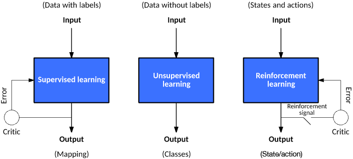
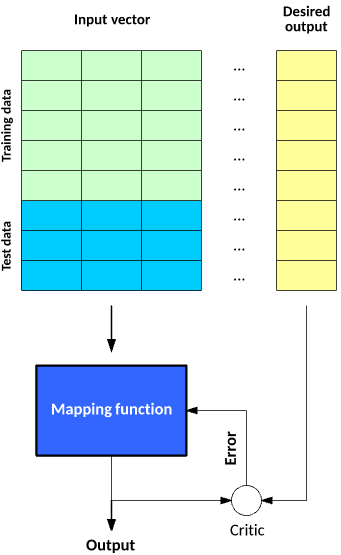
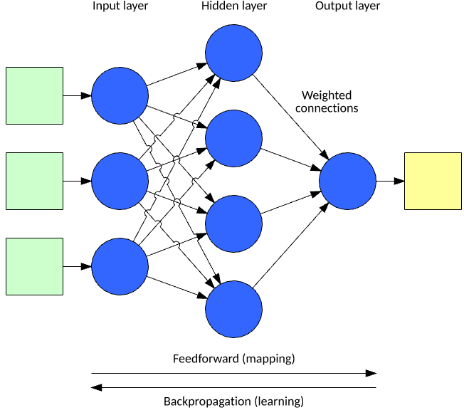
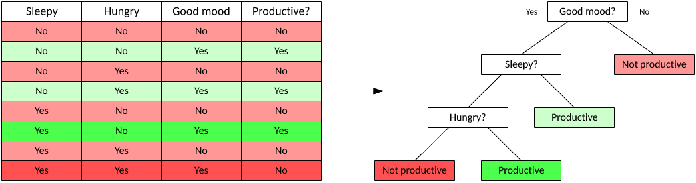
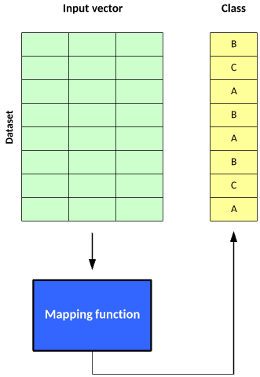
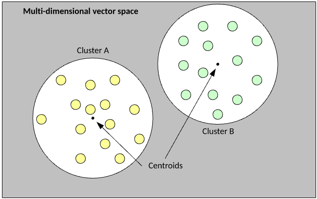
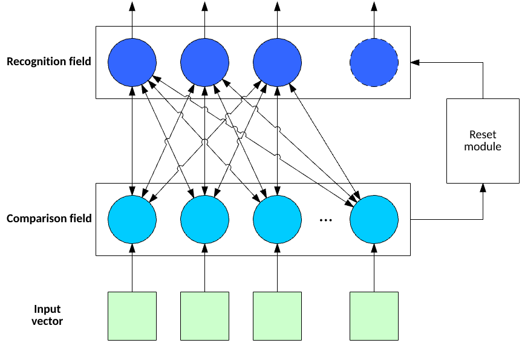
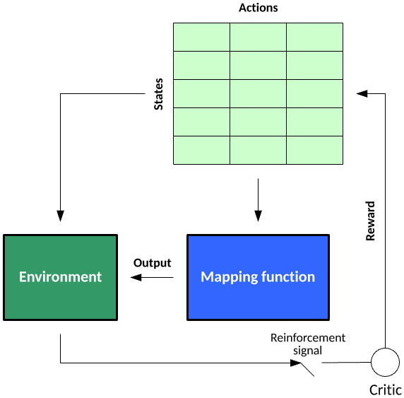

# 机器学习模型
探索机器学习模型背后的想法以及每种模型使用的一些关键算法

**标签:** 人工智能

[原文链接](https://developer.ibm.com/zh/articles/cc-models-machine-learning/)

M. Tim Jones

发布: 2018-01-17

* * *

机器学习中使用的算法大体分为 3 类：监督学习、无监督学习和强化学习。 _监督学习_ 提供了反馈来表明预测正确与否，而 _无监督学习_ 没有响应：算法仅尝试根据数据的隐含结构对数据进行分类。 _强化学习_ 类似于监督学习，因为它会接收反馈，但反馈并不是对每个输入或状态都是必要的。本教程将探索这些学习模型背后的理念，以及用于每种模型的一些关键算法。

机器学习算法不断在发展演变。但是，在大部分情况下，这些算法都倾向于适应 3 种学习模型之一。模型的存在，只是为了以某种方式进行自动调节，以便改进算法的操作或行为。

##### 算法的 3 种学习模型

在监督学习中，数据集包含其目标输出（或 _标签_），以便函数能够计算给定预测的误差。在做出预测并生成（实际结果与目标结果的）误差时，会引入监督来调节函数并学习这一映射。

在无监督学习中，数据集不含目标输出；因此无法监督函数。函数尝试将数据集划分为“类”，以便每个类都包含数据集的具有共同特征的一部分。

最后，在强化学习中，算法尝试学习一些操作，以便获得导致目标状态的一组给定状态。误差不会在每个示例后提供（就像监督学习一样），而是在收到强化信号（比如达到目标状态）后提供。此行为类似于人类学习，仅在给予奖励时为所有操作提供必要反馈。

现在，让我们深入分析一下每种模型，了解它们的方法和关键算法。

## 监督学习

监督学习是最容易理解的学习模型。监督模型中的学习需要创建一个函数，该函数可以使用一个训练数据集来训练，然后应用于未见过的数据来达到一定的预测性能。构建该函数的目的是为了将映射函数有效推广到从未见过的数据。

可通过两个阶段来构建和测试一个具有监督学习能力的映射函数。在第一阶段，将一个数据集划分为两种样本：训练数据和测试数据。训练数据和测试数据都包含一个测试矢量（输入），以及一个或多个已知的目标输出值。使用训练数据集训练映射函数，直到它达到一定的性能水平（一个衡量映射函数将训练数据映射到关联的目标输出的准确性的指标）。在监督学习的上下文中，会对每个训练样本都执行此过程，在此过程中，使用了（实际输出与目标输出的）误差来调节映射函数。在下一阶段，将会使用测试数据来测试训练的映射函数。测试数据表示未用于训练的数据，并为如何将映射函数有效推广到未见过的数据提供了一种很好的度量方法。

##### 构建并测试具有监督学习能力的映射函数的两个阶段

许多算法都属于监督学习类别，比如支持矢量机和朴素贝叶斯。让我们查看两种关键方法：神经网络和决策树。

### 神经网络

神经网络通过一个模型将输入矢量处理为结果输出矢量，该模型的灵感来源于大脑中的神经元和它们之间的连接。该模型包含一些通过权值相互连接的神经元层，权值可以调节某些输入相对于其他输入的重要性。每个神经元都包含一个用来确定该神经元的输出的激活函数（作为输入矢量与权矢量的乘积的函数）。计算输出的方式是，将输入矢量应用于网络的输入层，然后（采用前馈方式）计算网络中每个神经元的输出。

##### 典型神经网络的层

最常用于神经网络的监督学习方法之一是 _反向传播_。在反向传播中，会应用一个输入矢量并计算输出矢量。计算（实际输出与目标输出的）误差，然后从输出层向输入层执行反向传播，以便调节权值和偏差（作为对输出的贡献的函数，可以针对学习率进行调节）。要进一步了解神经网络和反向传播，请参阅“ [神经网络深入剖析](http://www.ibm.com/developerworks/cn/cognitive/library/cc-cognitive-neural-networks-deep-dive/index.html) ”。

### 决策树（Decision trees）

_决策树_ 是一种用于分类的监督学习方法。根据由数据的特征推断出的决策规则，这种算法会创建树来预测输入矢量的结果。决策树很有用，因为它们很容易可视化，使您能够理解导致结果的因素。

##### 一种典型的决策树

决策树有两种模型： _分类树_ 和 _回归树_。在分类树中，目标变量是一个离散值，树叶表示类标签（如示例树中所示）；在回归树中，目标变量可以接受连续值。您使用一个数据集来训练树，然后，该树利用数据构建一种模型。您随后可以使用该树，利用未见过的数据制定决策（通过基于当前的测试矢量遍历树，直到遇到树叶）。

有大量用于决策树学习的算法。最早的算法之一是迭代二叉树 3（Iterative Dichotomiser 3，ID3），它基于矢量中的一个字段，将数据集拆分为两个不同的数据集。通过计算字段的熵来选择字段（熵是对字段值的分布的一种度量）。该算法的目的是从矢量中选择一个字段，随着树的构建，这个字段会导致对数据集的后续拆分的熵下降。

除 ID3 外，还有一个名为 _C4.5_ 的改良算法（ID3 的换代算法）和多元自适应回归样条 (MARS)，后者构建的决策树改进了数字处理。

## 无监督学习

无监督学习也是一种相对简单的学习模型，但从名称可以看出，它缺乏评价，且无法度量性能。它的目的是构建一个映射函数，以便基于数据中隐藏的特征将数据划分为不同类。

与监督学习一样，无监督学习的使用也分为两个阶段。在第一阶段，映射函数将一个数据集划分为不同的类。每个输入矢量都包含在一个类中，但该算法无法对这些类应用标签。

##### 使用无监督学习的两个阶段

结果可能是数据被划分为不同的类（然后您可以从中得出有关结果类的结论），但您可以根据应用情况进一步使用这些类。推荐系统就是这类应用中的一种，其中的输入矢量可能表示用户的特征或购买行为，一个类中的用户表示具有类似兴趣的用户，然后可以对这些用户进行营销或推荐产品。

要实现无监督学习，可以采用各种各样的算法，比如 _k_ 均值集群或自适应共振理论，或者 ART（实现数据集的无监督集群的一系列算法）。

### K 均值集群（K-means clustering）

_k_ 均值集群起源于信号处理，是一种简单的流行集群算法。该算法的目的是将数据集中的示例划分为到 _k_ 个集群中。每个示例都是一个数字矢量，允许计算矢量间的距离作为欧几里德距离。

下面的简单示例直观地展示了如何将数据划分到 _k_ = 2 个集群中，其中的示例间的欧几里德距离是离集群的质心（中心）最近的距离，它表明了集群的成员关系。

##### _k_ 均值集群的简单示例

_k_ 均值算法非常容易理解和实现。首先将数据集中的每个示例随机分配到一个集群，计算集群的质心作为所有成员示例的均值，然后迭代该数据集，以确定一个示例离所属集群更近还是离替代集群更近（假设 _k_ = 2）。如果成员离替代集群更近，则将该示例移到新集群并重新计算它的质心。此过程一直持续到没有示例移动到替代集群为止。

如图所示，在对示例矢量中的特征一无所知（即没有监督）的情况下， _k_ 均值将示例数据集划分为 _k_ 个集群。

### 自适应共振理论（Adaptive resonance theory）

自适应共振理论 (ART) 是一系列提供模式识别和预测能力的算法。可以按无监督和监督模型来划分 ART，但这里将重点介绍无监督方面。ART 是一种自组织神经网络架构。该方法允许在维护现有知识的同时学习新映射。

像 _k_ 均值一样，可以使用 ART1 划分集群，但它有一个关键优势，因为无需在运行时定义 _k_ ，ART1 可以基于数据来调节集群数量。

ART1 包含 3 种关键特征：一个比较字段（用于确定一个新特征矢量有多适合现有类别）、一个识别字段（包含表示活动集群的神经元），以及一个重置模块。应用输入矢量后，比较字段会识别最适合它的集群。如果输入矢量与识别字段的匹配度高于某个警戒参数，则更新与识别字段中的神经元的连接，以便考虑这个新矢量。否则，在识别字段中创建一个新神经元，以便考虑一个新集群。创建新神经元后，不会更新现有神经元的权值，并允许它们保留现有知识。以这种方式应用数据集中的所有示例，直到没有示例输入矢量更改集群。此刻，训练才算完成。

##### ART1 的特性

ART 包含多个支持二进制输入矢量或实值矢量 (ART2) 的算法。预测 ART 是 ART1/2 的一种变体，但它依赖于监督式训练。

## 强化学习

强化学习是一个有趣的学习模型，不仅能学习如何将输入映射到输出，还能学习如何借助依赖关系将一系列输入映射到输出（例如 Markov 决策流程）。在环境中的状态和给定状态下的可能操作的上下文中，可以应用强化学习。在学习过程中，该算法随机探索某个环境中的状态-操作对（以构建一个状态-操作对表），然后应用所学信息来挖掘状态-操作对奖励，以便为给定状态选择能导致某个目标状态的最佳操作。要进一步了解强化学习，请参阅“ [通过强化学习训练软件代理来执行合理行为](http://www.ibm.com/developerworks/cn/cognitive/library/cc-reinforcement-learning-train-software-agent/index.html)”。

##### 强化学习模型

考虑一个玩 21点扑克游戏的简单代理。状态表示玩家的牌数。操作表示玩 21点扑克游戏的代理可以执行的操作 — 在本例中为拿牌或停牌。训练代理玩 21点扑克游戏涉及到多手牌，会针对获胜或失败为给定状态-操作联结提供奖励。例如，状态值 10 表示拿牌的奖励为 1.0，停牌的奖励为 0.0（表明拿牌是最佳选择）。对于状态 20，学到的奖励可能是：拿牌的奖励为 1.0，停牌的奖励为 0.0。对于一手不太明确的牌，状态 17 的操作值可能表示停牌奖励 0.95 和拿牌奖励 0.05。然后，此代理会根据概率在 95% 的时间停牌，在 5% 的时间拿牌。在出了许多手牌之后，这些奖励会变得明确，表明给定状态（或一手牌）的最佳选择。

在监督学习中，评价环节会对每个示例进行评分，而在强化学习中，评价环节仅在达到目标状态（拥有状态为 21 的一手牌）时提供评分。

### Q-learning

Q-learning 是一种强化学习方法，它合并了每个状态-操作对的 _Q_ 值来表明遵循给定状态路径的奖励。Q-learning 的一般算法是分阶段学习一个环境中的奖励。每个状态都包括为状态执行操作，直到达到目标状态。在学习期间，根据概率完成选择的操作（作为 _Q_ 值的函数），这允许探索状态-操作空间。在达到目标状态时，流程从某个初始位置再次开始。

为给定状态选择操作后，会针对每个状态-操作对来更新 _Q_ 值。对当前状态应用操作来达到新状态（应用了折扣系数）后，会使用可用于该新状态且具有最大 _Q_ 值的操作（可能什么也不做）所提供的奖励，对状态-操作对的 _Q_ 值进行更新。通过学习率，可以实现更新结果的进一步折扣，学习率可以确定宝贵的新信息已存在多长时间。折扣系数表明了未来奖励相较于短期奖励的重要性。请注意，环境中可能填入负值和正值奖励，或者只有目标状态可以表明奖励。

##### 一种典型的 Q-learning 算法

此算法用于许多达到目标状态的时间点，并允许基于状态的概率性操作选择来更新 _Q_ 值。完成时，可以自由使用 _Q_ 值（对给定状态使用具有最大 _Q_ 值的操作）来利用所获得的知识，以便采用最佳方式达到目标状态。

强化学习还包含其他具有不同特征的算法。状态-操作-奖励-状态-操作的循环类似于 Q-learning，但操作的选择不基于最大 _Q_ 值，而是包含一定的概率。强化学习是一种理想的算法，可以学习如何在不确定的环境中制定决策。

## 结束语

机器学习受益于满足不同需求的各种各样的算法。监督学习算法学习一个已经分类的数据集的映射函数，而无监督学习算法可基于数据中的一些隐藏特征对未标记的数据集进行分类。最后，强化学习可以通过反复探索某个不确定的环境，学习该环境中的决策制定策略。

本文翻译自： [Models for machine learning](https://developer.ibm.com/articles/cc-models-machine-learning/)（2017-12-05）