# 机器学习简介
理解基本概念

**标签:** Python,人工智能,数据科学,机器学习,深度学习

[原文链接](https://developer.ibm.com/zh/articles/introduction-to-machine-learning/)

[Samaya Madhavan](https://developer.ibm.com/zh/profiles/smadhava), [Mark Sturdevant](https://developer.ibm.com/zh/profiles/mark.sturdevant), [Romeo Kienzler](https://developer.ibm.com/zh/profiles/romeo.kienzler)

发布: 2019-12-04

* * *

本教程已纳入 [面向开发者的机器学习](https://developer.ibm.com/cn/blog/2019/learning-path-machine-learning-for-developers/) 这一学习路径。

级别主题类型100[机器学习简介](https://www.ibm.com/developerworks/cn/analytics/library/introduction-to-machine-learning/index.html)文章101[使用 Python 和 scikit-learn 构建并测试您的第一个机器学习模型](https://www.ibm.com/developerworks/cn/analytics/library/build-and-test-your-first-machine-learning-model-using-python-and-scikit-learn/index.html)教程+Notebook201[使用 Python 和 scikit-learn 学习回归算法](https://www.ibm.com/developerworks/cn/analytics/library/learn-regression-algorithms-using-python-and-scikit-learn/index.html)教程+Notebook202[使用 Python 和 scikit-learn 学习分类算法](https://www.ibm.com/developerworks/cn/analytics/library/learn-classification-algorithms-using-python-and-scikit-learn/index.html)教程+Notebook203[使用 Python 和 scikit-learn 学习聚类算法](https://www.ibm.com/developerworks/cn/analytics/library/learn-clustering-algorithms-using-python-and-scikit-learn/index.html)教程+Notebook

## 简介

机器学习是一门为了预测某个值而对系统应用算法来学习数据中模式的科学。利用足够的数据，在所有输入变量与待预测值之间建立关系。在给定其他输入变量的情况下，系统更容易预测一个新的值。这种方法不同于传统编程，在传统编程中，应用程序是基于先前设置的规则开发的。虽然机器学习的基本概念已经存在了一段时间，但这一领域最近才迅猛发展，这要归功于先进的处理器和丰富的可用数据，这两者都是实现精确预测的关键。因为介绍机器学习历史的内容很多，所以本文不再赘述。我们在这里为您提供了一种实用的方法来理解必要的概念，帮助您入门。

本文解释了以下概念：

- 机器学习基础知识
- 有监督学习与无监督学习的比较
- 构建模型
- 机器学习中的管道

## 机器学习基础知识

在本节中，我们将讨论在处理机器学习项目时使用的一些基本术语。

### 线性代数

线性代数是数学中处理变量之间相关性的一个领域。之所以称为线性，是因为输出变量可以用幂（指数）不大于 1 的输入变量来表示。了解线性代数的基础知识，对理解机器学习的一些基础知识大有帮助。在本节中，我们定义了一些经常使用的关键术语。

#### 什么是张量？

我们先从 _标量_ 讲起。标量基本上是任何数字，如 1、5、23.5 或 42。如果将多个标量组合在一起，最后就会得到一个 _矢量_。例如，(1, 5, 23, 2) 就是一个长度为 4 的矢量。在矢量中，所有元素都应该属于相同的数据类型，而在 _元组_ 中，可以混用类型。 _矩阵_ 是大小相等的矢量的列表。在矩阵中，行数可以不同于列数，但每个元素必须具有相同的类型。具有 _m_ 行和 _n_ 列的矩阵称为 _m x n_ 矩阵。

_张量_ 是在多维空间中表示的数据。张量是表示上述内容的通称。例如，零维张量就是标量，一维张量是矢量，二维张量则是矩阵。下图显示了一个三维张量的例子，它基本上是一个矩阵的扩展，但却是三维的。

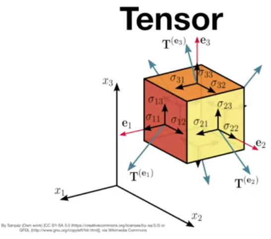

张量在某些方面使用起来很方便，比如图像处理。可以用一个维度表示高度，一个维度表示宽度，一个维度表示颜色。

### 高维矢量空间

理解高维矢量空间有助于为理解机器学习的工作原理打下坚实的基础。下图显示了一个包含三列的数据集。这些列被称为“维度”或“特征”。该表也称为三维数据集。在一个三维空间中绘制这些点时，我们观察到三个点云。

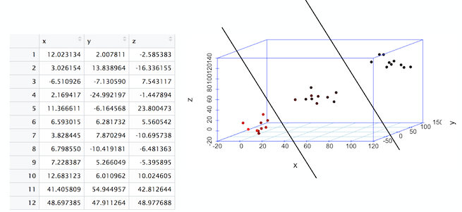

_线_ 是在二维空间中对点的基本分割。在前面的图像中，您看到了分割线，这标志着三维空间中点的分割。三维空间中的这条线称为 _平面_。如果从三维变为四维或者更高维，平面就变成了超平面。

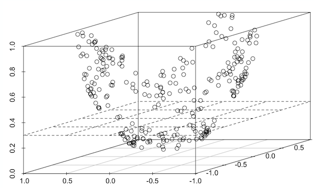

识别这些分割非常关键，因为在进行分割之后，预测新数据只不过是识别数据点位于分割的哪个部分。

## 有监督机器学习与无监督机器学习的比较

### 有监督机器学习

有监督机器学习是指数据集中的每条记录都包含一个标签或标志的一类问题。

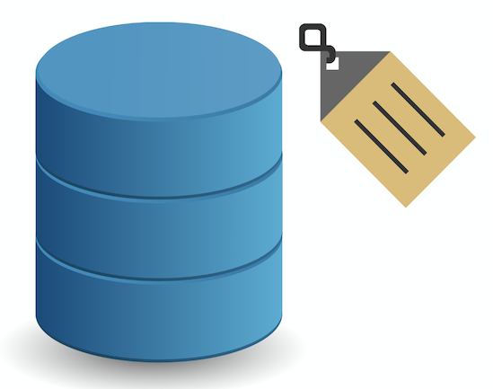

以下表为例，其中包含有关最高温度、最低温度和最大振动的信息。

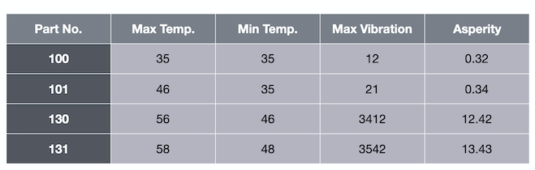

最后一列的 asperity（粗糙度）就是标签。在给定温度和振动数据的情况下，我们想要预测粗糙度。这是一个有标签的数据集。

使用这个包含标签的数据集，我们可以训练一个算法，为无标签的数据预测值。您可以将它放入算法中，算法现在就可以预测该数据的标签。这被称为有监督学习。有监督学习有两种类型： _回归_ 和 _分类_。

#### 回归

必须预测连续值的用例类型称为回归。例如，如果我们向算法传递值 35、35 和 12，它预测的粗糙度值为 0.32。

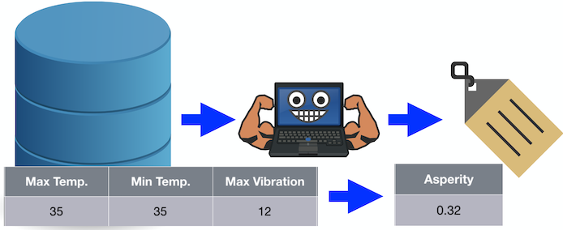

#### 分类

输出是二进制值或至少是离散值（而不是连续值）的用例类型称为分类。也就是说，该算法不会预测一个数字，而是预测一个类变量。

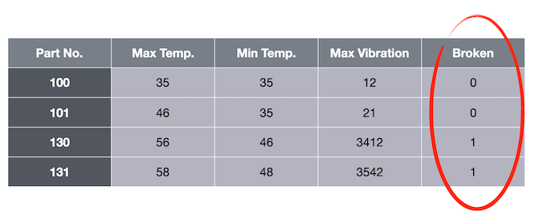

例如，如果我们向算法传递值 35、35 和 12，它会预测值 0 表示被破坏。

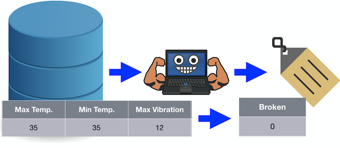

如果只有两个类，则称为二元分类。如果有两个以上的类，则称为多类分类。

### 无监督学习

无监督机器学习是指数据集中的记录都不包含任何标签或标志的一类问题。 _聚类_ 是一种无监督机器学习。

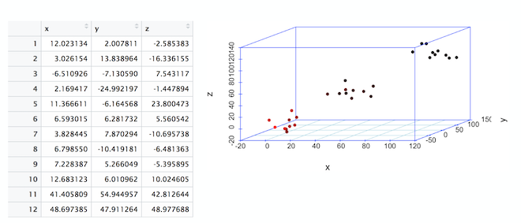

#### 聚类

在前面显示的三维图中，请注意 3 个数据簇或数据云。通过绘制表格，我们就可以看到数据以三个簇为中心。这个过程被称为聚类。

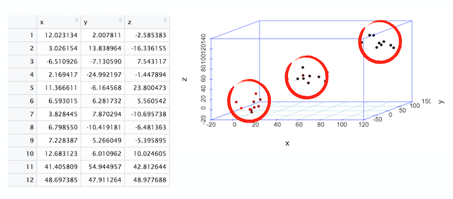

## 构建模型

机器学习 _模型_ 是指使用先前看到的数据建立的一种数学结构，为按照先前计算的一定精度来预测新数据而设置。

要从头开始构建模型，就需要按以下顺序来迭代执行步骤。

- 数据探索
- 数据预处理
- 拆分数据以用于训练和测试
- 准备一个分类模型
- 使用管道组装所有这些步骤
- 训练模型
- 对模型运行预测
- 评估模型性能并使之可视化

[使用 Python 和 scikit-learn 构建并测试您的第一个机器学习模型](https://www.ibm.com/developerworks/cn/analytics/library/build-and-test-your-first-machine-learning-model-using-python-and-scikit-learn/index.html) 中详细介绍了构建模型的动手实践方法。

## 管道

在机器学习流程中设计数据处理时，管道是一个非常方便的过程。数据预处理是一个单调乏味的步骤，无论应用何种算法，在每次开始训练之前都必须对数据进行预处理。下图显示了每次开始数据建模之前应用的一系列典型的预处理步骤。

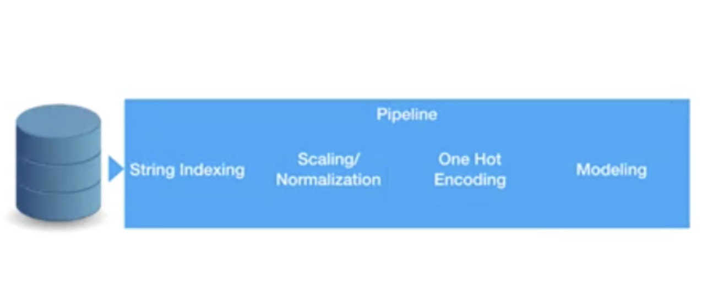

当使用管道时，您可以保留预处理，只切换不同的建模算法或建模算法的不同参数集。总体思路是，您可以将完整的数据处理流程融入单一管道中，而这个管道可以在下游使用。

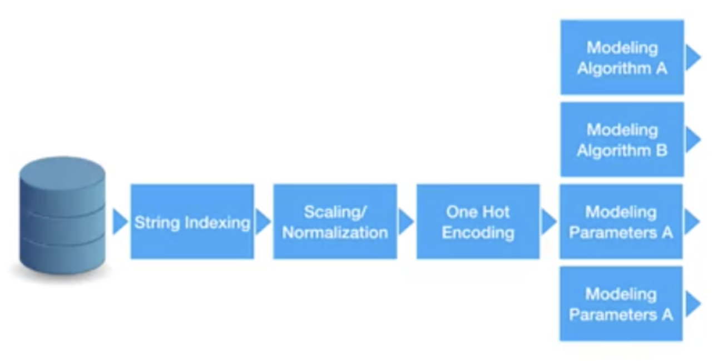

与机器学习算法类似，管道具有“拟合”、“评估”和“评分”这些方法。基本上，“拟合”用于开始训练，“评分”则返回预测值。

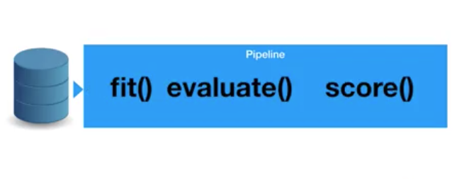

使用管道的最大优势之一就是 _交叉验证_。它指的是使用同一个管道改变或调整几个超参数的过程，这可以加速算法的优化。可以调整几个超参数来改善模型的性能。有关这些主题的详细信息将在以后的文章中加以介绍。

## 结束语

本教程介绍了机器学习的一些基本概念。本教程已纳入 [面向开发者的机器学习](https://developer.ibm.com/cn/blog/2019/learning-path-machine-learning-for-developers/) 这一学习路径。要继续这一学习路径，可参阅下一个教程 [使用 Python 和 scikit-learn 构建并测试您的第一个机器学习模型](https://www.ibm.com/developerworks/cn/analytics/library/build-and-test-your-first-machine-learning-model-using-python-and-scikit-learn/index.html)。

本教程翻译自： [Introduction to machine learning](https://developer.ibm.com/articles/introduction-to-machine-learning/)（2019-12-04）。