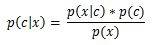
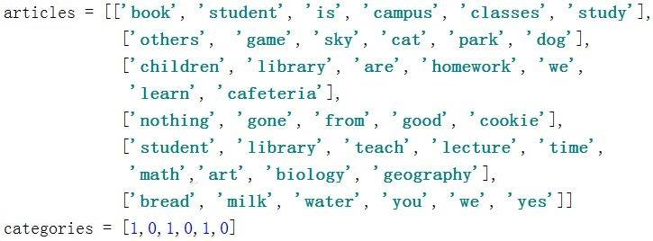

# 机器学习系列之手把手教你实现一个 naiveBayes
深入了解机器学习

**标签:** 分析

[原文链接](https://developer.ibm.com/zh/articles/machine-learning-hands-on3-naivebayes/)

韩笑琳

发布: 2018-01-09

* * *

## 朴素贝叶斯简介

在本系列的前面两篇文章中，分别介绍了 SVM 模型和 FP-growth 模型。其中 SVM 模型主要用于分类，FP-growth 模型用于挖掘频繁项集和关联规则。本文将介绍 naiveBayes 模型，即朴素贝叶斯模型。朴素贝叶斯模型主要用来分类，但是与 SVM 模型不同的的是，朴素贝叶斯模型不需要针对目标变量建立模型，而是借助贝叶斯公式计算样本属于各个类别的概率，然后取概率值大的类别作为分类类别。之所以称之为朴素，是因为朴素贝叶斯模型假设各属性之间是条件独立的，该假设极大得简化了运算，使得朴素贝叶斯模型变得非常简单。

朴素贝叶斯模型主要应用在文本分类方面。这里需要用到向量空间模型，即将文本转换成词向量。词向量的每一项是该词出现的频数。在朴素贝叶斯中会将频数进一步转换成频率。这样就完成了文本到数值上的转化，方便后期计算条件概率和先验概率。

朴素贝叶斯模型也有它的优缺点，优点是模型简单，计算快；缺点是依赖于属性之间条件独立这一假设，但是现实场景下很多情况并不满足这一假设，使得朴素贝叶斯的准确率受到影响。这种情况需要考虑半朴素贝叶斯，即放松属性之间条件独立这一假设，一定程度上考虑属性之间的依赖关系。由于篇幅有限，对半朴素贝叶斯感兴趣的话可自行参照文末参考资源学习，本文重点介绍朴素贝叶斯的原理和实现。

## 朴素贝叶斯原理

**朴素贝叶斯** 模型主要利用贝叶斯公式进行展开。贝叶斯公式如下：

##### 图 1\. 贝叶斯公式



公式中 P(C\|X)表示 X 属于类别 C 的概率， _P_ (X\|C)表示类别 C 中 X 出现的概率， _P_ (C)表示类别 C 出现的概率。其中 P(C)称为先验概率， _P_ (X\|C)是条件概率， _P_ (C\|X)称为后验概率，将后验概率最大的类作为 X 的类别输出。假设有 C0 和 C1 两个类，由于 P(X)都是一样的，所以不需要考虑 P(X),只需考虑如下：

1. 如果 _P_ (X\|C0) _P (C0) > P (X\|C1)_ _P_ (C1)，则 P(C0\|X) > _P_ (C1\|X)，可得 X 属于 C0 类；
2. 如果 _P_ (X\|C0) _P (C0) < P (X\|C1)_ _P_ (C1)，则 P(C0\|X) < _P_ (C1\|X)，可得 X 属于 C1 类。

由上述可知，需要计算 P(X\|C)和 P(C)。朴素贝叶斯假设属性之间条件独立，可得：

_P_ (X\|C) = _P_ (X0\|C) _P (X1\|C)_ _P_ (X2\|C) _P (X3\|C)_… \\* _P_ (Xn\|C)

令 Dc 表示训练集 D 中第 C 类样本组成的集合，可得：

_P_ (Xi\|C) = \|Dc,xi\| / \|Dc,x\|，表示类别为 C 的样本在第 i 个属性上频数总和除以类别为 C 的样本集合中所有属性频数总和。为了避免 P(Xi\|C)为 0 造成 P(X\|C)为 0 而影响分类结果，在此引入拉普拉斯平滑，本文分别给分子和分母加上 1 和 2，即 P(Xi\|C) = (\|Dc,xi\| + 1) / (\|Dc,x\| + 2)。

又有 P(C) = \|Dc\| / \|D\|， 表示类别为 C 的样本集合大小除以数据集 D 的样本集合大小。

至此，通过 P(X\|C0) _P (C0) 和 P (X\|C1)_ _P_ (C1)的大小比较，可得 X 所属类别。但是小数连乘会造成所得值几乎等于 0 的结果，从而无法比较大小。鉴于此，往往在实际运算中，会借助 log 函数，比较 log( _P_ (X\|C0) _P (C0)) 和 log(P (X\|C1)_ _P_ (C1))的大小来判断 X 所属类别。从而得：

log( _P_ (X\|C0) \* _P_ (C0) ) = log( _P_ (X\|C0)) + log( _P_ (C0)) = log( _P_ (X0\|C0)) + log( _P_ (X1\|C0)) + log( _P_ (X2\|C0)) +…+ log( _P_ (Xn\|C0)) + log( _P_ (C0)),

同理可得 log( _P_ (X\|C1) \* _P_ (C1) ) = log( _P_ (X\|C1)) + log( _P_ (C1)) = log( _P_ (X0\|C1)) + log( _P_ (X1\|C1)) + log( _P_ (X2\|C1)) +…+ log( _P_ (Xn\|C1)) + log( _P_ (C1))。

## 用朴素贝叶斯进行文本分类

利用朴素贝叶斯模型进行文本分类，首先需要将文本表示成词向量，再从词向量中计算得到条件概率 P(X\|C)和先验概率 P(C)，然后利用条件概率 P(X\|C)与先验概率 P(C)计算后验概率 P(C0\|X)、 _P_ (C1\|X)。最终比较 P(C0\|X)、 _P_ (C1\|X)大小得到 X 属于 C0 类还是 C1 类。下面用表 1 所示训练数据和表 2 所示测试数据展开介绍。

##### 表 1\. 示例训练数据集

类别训练文本1‘book’, ‘student’, ‘campus’, ‘study’0‘others’, ‘game’, ‘sky’1‘campus’, ‘ book ‘0‘others’, ‘yes’

##### 表 2\. 示例测试数据集

类别测试文本？‘book’, ‘campus’, ‘study’

### 从文本到词向量

首先需要将文本表示成词向量，去掉重复的词。将表 1 中示例数据集表示成词向量如下：

[ ‘book’, ‘student’, ‘campus’, ‘study’, ‘others’, ‘game’, ‘sky’, ‘yes’ ]

可以看出，重复的’campus’, ‘book’, ‘others’都只出现了一次。

然后，需要将文本列表转换成词向量列表，文本中的词在词向量中出现为 1，未出现为 0, 如表 3,4 所示：

##### 表 3\. 训练文本词向量列表

类别训练文本1[1, 1, 1, 1, 0, 0, 0, 0]0[0, 0, 0, 0, 1, 1, 1, 0]1[1, 0, 1, 0, 0, 0, 0, 0]0[0, 0, 0, 0, 1, 0, 0, 1]

##### 表 4\. 测试文本词向量列表

类别测试文本？[1, 0, 1, 1, 0, 0, 0, 0]

### 从词向量到条件概率和先验概率

由上一章知，

条件概率 P(X\|C) = _P_ (X0\|C) _P (X1\|C)_ _P_ (X2\|C) _P (X3\|C)_… \\* _P_ (Xn\|C),

为防止概率为 0 影响结果，加入拉普拉斯平滑后 P(Xi\|C) = (\|Dc,xi\| + 1) / (\|Dc,x\| + 2),

先验概率 P(C) = \|Dc\| / \|D\|。

为防止小数连乘造成结果几乎为 0，引入 log 函数，由于测试文本只包含 X0, X2, X3, 得:

log( _P_ (X\|C0) \* _P_ (C0) ) = log( _P_ (X0\|C0)) + log( _P_ (X2\|C0)) + log( _P_ (X3\|C0)) + log( _P_ (C0))

log( _P_ (X\|C1) \* _P_ (C1) ) = log( _P_ (X0\|C1)) + log( _P_ (X2\|C1)) + log( _P_ (X3\|C1)) + log( _P_ (C1))

代入数据，得

_P_ (X0\|C0) = _P_ (X2\|C0) = _P_ (X3\|C0) = (0 + 1) / (5 + 2) = 1/7,

_P_ (C0) = _P_ (C1) = 2 / 4,

_P_ (X0\|C1) = _P_ (X2\|C1) = (2 + 1) / (6 + 2) = 3/8,

_P_ (X3\|C1) = (1 + 1) / (6 + 2) = 2/8,

故可得:

log( _P_ (X\|C0) \* _P_ (C0) ) = log(1/7) + log(1/7) + log(1/7) + log(2/4) = -2.84

log( _P_ (X\|C1) \* _P_ (C1) ) = log(3/8) + log(3/8) + log(2/8) + log(2/4) = -1.76

### 根据后验概率分类

由上一章知，


因此后验概率 P(C0\|X)只需考虑 P(X\|C0) _P (C0) ，同理后验概率 P(C1\|X)只需考虑 P(X\|C1)_ _P_ (C1)。

已知：

如果 log( _P_ (X\|C0) _P (C0) ) > log(P (X\|C1)_ _P_ (C1) )，则 P(C0\|X) > _P_ (C1\|X)，可得 X 属于 C0 类；

如果 log( _P_ (X\|C0) _P (C0) ) < log(P (X\|C1)_ _P_ (C1) )，则 P(C0\|X) < _P_ (C1\|X)，可得 X 属于 C1 类。

又由于-1.76 > -2.84, 所以 log( _P_ (X\|C1) _P (C1) ) > log(P (X\|C0)_ _P_ (C0) ), 即 P(C1\|X) > _P_ (C0\|X)，可得测试文本{‘book’, ‘campus’, ‘study’}属于类别 1。

## 实现步骤：自己动手实现朴素贝叶斯

本节将介绍使用朴素贝叶斯进行文本分类的实现过程。自己动手实现朴素贝叶斯主要从三个方面展开，分别是从文本到词向量，从词向量到先验概率和条件概率，以及推断测试文本的类别。

##### 清单 1\. 从文本到词向量

```
def word2vector(words, article):
    article2Vector = zeros(len(words))
    for word in article:
        if word in words:
            article2Vector[words.index(word)] += 1
    return article2Vector

```

Show moreShow more icon

清单 1 完成了将文本表示成词向量的过程。words 是统计出的所有文本中的词列表，即所有文本中不重复的词列表，如清单 2 所示，计算 words 的过程用到了集合的并操作。对于文本 article 中的每个词，如果词在 words 列表中，就将词向量中对应下标的元素加一。

##### 清单 2\. 从词向量到先验概率

```
def calcProb(articles, categories):
    p1 = sum(array(categories)) / len(categories)
    p0 = 1 - p1
    words = set([])

    for i in range(len(articles)):
        words = words | set(articles[i])
    words = list(words)
    p0words, p1words = calcWordsProbInCateg(words, articles, categories)

    return p0,p1,p0words,p1words,words

```

Show moreShow more icon

清单 2 完成了从词向量中计算先验概率 p0 和 p1 的过程。p1 的计算过程为首先统计类别列表 categories 中所有类别为 1 的向量集合大小，然后对其除以所有文本总数。P0 由 1 减去 p1 即可得到, 这是因为 P0 + P1 = 1。

##### 清单 3\. 从词向量到条件概率

```
def calcWordsProbInCateg(words, articles, categories):
    articlesMatrix = []
    for article in articles:
        article2Vector = word2vector(words, article)
        articlesMatrix.append(article2Vector)

    sumWords0 = 2
    sumWords1 = 2
    p0words = ones(len(words))
    p1words = ones(len(words))
    for i in range(len(articles)):
        if categories[i] == 0:
            p0words += articlesMatrix[i]
            sumWords0 += sum(articlesMatrix[i])
        else:
            p1words += articlesMatrix[i]
            sumWords1 += sum(articlesMatrix[i])
    p0words = p0words / sumWords0
    p1words = p1words / sumWords1

    return p0words, p1words

```

Show moreShow more icon

清单 3 完成了从词向量中计算条件概率 p0words 和 p1words 的过程。p0words 表示类别 0 中所有词出现的概率向量，p1words 表示类别 1 中所有词出现的概率向量。代码一开始先将文本列表 articles 转换成文本词概率矩阵 articelsMatrix, 然后对每篇文本，对该文本所属的类别，统计每个词的出现总次数和所有词的出现总次数。最后对每个类别，用每个词在该类别中的出现总次数除以所有词的出现总次数，得到类别 0 中所有词出现的概率向量和类别 1 中所有词出现的概率向量。注意此处利用拉普拉斯平滑避免了概率为 0 的出现，方便后续概率计算。

##### 清单 4\. 推断测试文本的类别

```
def inferCategory(words, testArticle, p0, p1, p0words, p1words):
    category = 0
    testArticle2Vector = word2vector(words, testArticle)

    p0temp = sum(log(p0words) * testArticle2Vector)
    p1temp = sum(log(p1words) * testArticle2Vector)

    pwords0 = p0temp + log(p0)
    pwords1 = p1temp + log(p1)
    if pwords0 < pwords1:
        category = 1
    return category

```

Show moreShow more icon

清单 4 用 inferCategory 函数推断测试文本 testArticle 所属的类别。首先，将 testArticle 转化成词向量 testArticle2Vector，然后利用贝叶斯公式分别计算 testArticle 属于类别 0 的概率和 testArticle 属于类别 1 的概率，取概率值大的类别作为 testArticle 所属的类别。注意此处利用了 log 函数避免了连乘造成的结果几乎等于 0 的后果。

### 代码下载 (code downloads)

本文所有朴素贝叶斯实现代码可在文末下载。

## 本文数据集简介

##### 图 2\. 数据集样例



训练数据集有 6 条文本数据，分为教育类和非教育类，第 1,3,5 条文本数据[‘book’, ‘student’, ‘is’, ‘campus’, ‘classes’, ‘study’]、[‘children’, ‘library’, ‘are’, ‘homework’, ‘we’, ‘learn’, ‘cafeteria’]、[‘student’, ‘library’, ‘teach’, ‘lecture’, ‘time’, ‘math’,’art’, ‘biology’, ‘geography’]，代表教育类的文本；第 2,4,6 条文本数据[‘others’, ‘game’, ‘sky’, ‘cat’, ‘park’, ‘dog’]、[‘nothing’, ‘gone’, ‘from’, ‘good’, ‘cookie’]、[‘bread’, ‘milk’, ‘water’, ‘you’, ‘we’, ‘yes’]，代表非教育类的文本。教育类用类别 1 表示，非教育类用类别 0 表示。

## 应用示例: 应用实现的朴素贝叶斯解决实际问题

##### 清单 5\. 用朴素贝叶斯解决实际问题

```
if __name__ == '__main__':
articles, categories = loadDataSet()
p0, p1, p0words, p1words, words = calcProb(articles, categories)
testArticle1 = ['student', 'study', 'campus']
category1 = inferCategory(words, testArticle1, p0, p1, p0words, p1words)
print("test article:", testArticle1, ",category is: ", category1)
testArticle2 = ['other', 'no']
category2 = inferCategory(words, testArticle2, p0, p1, p0words, p1words)
    print("test article:", testArticle2, ",category is: ", category2)

```

Show moreShow more icon

测试数据集有 2 条文本数据，分别为[‘student’, ‘study’, ‘campus’]和[‘other’, ‘no’]。清单 5 首先调用 loadDataSet 函数加载文本列表和类别列表，接着调用 calcProb 函数计算类别 0 概率、类别 1 概率、类别 0 中所有词的概率向量、类别 1 中所有词的概率向量，然后调用 inferCategory 函数计算测试文本 testArticle 所属的类别。

运行结果如下：

test article: [‘student’, ‘study’, ‘campus’] ,category is: 1

test article: [‘other’, ‘no’] ,category is: 0

可以看出测试文本[‘student’, ‘study’, ‘campus’]属于类别 1，即教育类；测试文本[‘other’, ‘no’]属于类别 0，即非教育类。

## 总结

本文首先介绍了朴素贝叶斯的应用场景和优缺点，接着详细介绍了朴素贝叶斯的原理，然后介绍了如何用朴素贝叶斯进行文本分类，并通过代码样例详细介绍如何自己动手实现朴素贝叶斯。最后，用教育类数据展示了如何应用朴素贝叶斯模型解决实际问题。需要注意的是朴素贝叶斯模型认为属性之间是条件独立的，这也就是朴素这个词的来源，表达了简化的含义。但是实际场景中，属性之间是条件独立的这个假设不一定总是成立的。这就引申出了半朴素贝叶斯，即放松了属性之间条件独立这一假设。半朴素贝叶斯考虑了一部分属性之间的相互依赖关系。由于篇幅有限，对于半朴素贝叶斯感兴趣的话可以参考文末列出的第三个参考资源（周志华著《机器学习》）了解详细原理。

## 参考资源

本文用到的参考文献如下：

- 参考 Peter Harrington 著《机器学习实战》，了解朴素贝叶斯模型基本原理。
- 参考李航著《统计学习方法》，了解拉普拉斯平滑原理。
- 参考周志华著《机器学习》，了解半朴素贝叶斯原理。

## Download

[naiveBayesDiy\_code](/developerworks/cn/analytics/library/machine-learning-hands-on3-naivebayes/naiveBayesDiy_code.zip): 样例代码