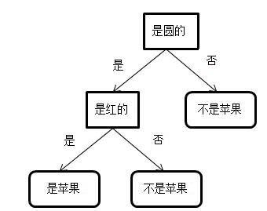
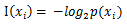
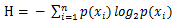
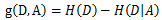
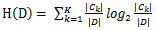
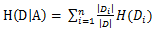
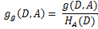
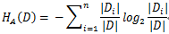
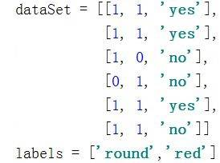

# 机器学习系列之手把手教你实现一个决策树
深入了解机器学习

**标签:** 分析

[原文链接](https://developer.ibm.com/zh/articles/machine-learning-hands-on4-decision-tree/)

韩笑琳

发布: 2018-01-15

* * *

## 决策树简介

在前面三篇文章中，分别介绍了 _支持向量机_ ， _FP-growth_ 和 _朴素贝叶斯_ 。其中支持向量机和朴素贝叶斯是分类模块中的经典算法。本文将介绍分类中的另一种常用算法，决策树 (decision tree)。决策树算法又分很多种，常用的有 **ID3，C4.5 和 CART 决策树** 。其中 ID3 和 C4.5 决策树更倾向于处理类别型的离散属性值，对于连续型属性值，则需要额外利用连续属性离散化技术将其划分成离散型属性值。而 CART 决策树，即分类回归树，直接支持连续型属性值。由于篇幅限制 CART 树会放在下一篇文章进行介绍，本文主要详细介绍 ID3 和 C4.5 决策树。

决策树利用了树型结构进行决策，是经典的 if-then 结构。叶节点存储类别，内部节点代表特征或属性。注意本文中提到的特征和属性是同一个概念。为了让读者有一个感性的认识，请看图1所示决策树。

##### 图1\. 决策树示例



图1所示决策树用来将数据分为两类，是苹果和非苹果。如图中所示，圆的和红的，就是苹果。不圆的不是苹果。圆的但不红的不是苹果。

本文将着重介绍 **ID3** 和 **C4.5** 两种决策树。决策树需要选择最优特征划分数据集。这两种决策树的不同之处是划分数据集的最优特征选择方法不同。用最优特征划分数据会使得数据集趋于更纯，即数据集的类别数更单一，这样的数据会更有序。衡量数据的混乱程度就必须提到信息和信息熵的概念。

待分类的事物可能划分在多个类别中，则符号 Xi 的 **信息** 是:



可知 _P_ (Xi) 越大，则 I(Xi) 越小，即 Xi 的概率越大，则 Xi 包含的信息越少。

我们都知道物理中的熵用来衡量混乱程度，熵越大说明越混乱，熵越小说明越单一。同样， **信息熵** 用来衡量信息中的混乱程度。用所有类别所有可能值包含的信息期望值表示信息熵，计算方法如下：



ID3 决策树利用了 **信息增益** 来选择最优特征，用这种方法选择的特征是使得信息熵增益最大的特征。而 C4.5 决策树利用了 **信息增益比** 来选择最优特征。用这种方法选择的特征是使得信息增益比最大的特征。

为什么要提出信息增益比呢？这是因为只考虑信息增益来划分数据集是有缺陷的。这种缺陷体现在信息增益对选择属性取值多的特征更有利。因为按属性取值多的特征划分数据集后，划分后的各个子数据集的类别更单一，即更趋于有序，这就使得划分后的信息熵更小，那么信息增益就会更大。信息增益比可以很好的解决这个问题。信息增益比通过引入类似惩罚因子的概念，对属性取值多的特征会有一定惩罚。

## 决策树原理

### 选择最优特征

决策树通过不断选择最优特征划分数据集，对划分后的子数据集不断迭代得选择最优特征划分，直到所有的数据集属于同一个类别，或者没有特征可以选择为止。选择最优特征的算法有很多种，ID3 决策树用信息增益选择最优特征，C4.5 决策树用信息增益比选择最优特征。

### 信息增益 – 用于 ID3 决策树

信息增益，顾名思义就是原数据集的信息熵比划分后数据集的信息熵大的程度。信息增益越大，说明划分后的数据集信息熵更小，即该数据集类别更趋于一致。

特征 A 对数据集 D 的 **信息增益 g(D,A)** 为 D 的信息熵与按特征 A 进行划分后 D 的信息熵之差，即



其中，





### 信息增益比 – 用于 C4.5 决策树

信息增益比为了避免倾向于选择属性值多的特征作为最优特征这个问题，在信息增益的基础上引入了类似惩罚因子的概念。

特征 A 对数据集 D 的 **信息增益比 g g (D,A)** 为信息增益 g(D,A) 与数据集 D 关于特征 A 的取值的熵 HA(D) 的比值，即



其中,



其中，n 是特征 A 取值的个数。HA(D) 就类似惩罚因子，对于属性值多的特征，虽然信息增益 g(D,A) 会比较大，但是数据集 D 关于特征 A 的取值的熵 HA(D) 会比较大，因而两者的比值信息增益比 gg(D,A) 会比较小。

除了可以使用信息增益和信息增益比来选择最优划分特征之外，基尼指数也可以用来实现这个目的。基尼指数主要用于 CART 树(即分类回归树)的分类树中的特征选择。关于基尼指数的详细内容会在下一篇文章介绍。

## 用 ID3 决策树进行分类

本节主要介绍用 ID3 决策树进行分类。为了便于理解，用表1所示数据集进行详细说明。利用 C4.5 决策树进行分类的过程会在下节介绍。

##### 表 1\. 示例数据集

**圆的****红的****分类**111100010000100

### ID3 决策树选择最优特征

表1数据集的信息熵为:

-1/5 _log(1/5) – 4/5_ log(4/5) = 0.217

1. 按特征”圆的”划分数据集，则信息熵为：

     3/5 _H(D1) + 2/5_ H(D0)

     = 3/5 _[-1/3_ log(1/3) – 2/3 _log(2/3)] + 2/5_ [-2/2 \* log(2/2)]

     = 0.166

     则信息增益为：0.217 – 0.166 = 0.051

2. 按特征”红的”划分数据集，则信息熵为：

     2/5 _H(D1) + 3/5_ H(D0)

     = 2/5 _[-1/2_ log(1/2) – 1/2 _log(1/2)] + 3/5_ [-3/3 \* log(3/3)]

     = 0.120

     则信息增益为：0.217 – 0.120 =0.097


综上所述，由于按特征”红的”比按特征”圆的”划分的信息增益大，所以特征”红的”为最优划分特征。

### 按最优特征划分数据集

按特征”红的”划分数据集后，有两种情况，第一种为如果是红的:0,则分类:0; 第二种为如果是红的:1, 则得到如下数据子集 {圆的:1,分类：1; 圆的:0, 分类:0}

接下来需要对数据子集{圆的:1,分类：1; 圆的:0, 分类:0}继续划分。由于剩下一个特征，故按特征”圆的”划分数据子集。划分后，如果是圆的:1，则分类:1；如果是圆的:0, 则分类:0。

返回的决策树用字典表示为：

{‘红的’: {0: ‘类别0’, 1: {‘圆的’: {0: ‘类别0’, 1: ‘类别1’}}}}

## 用 C4.5 决策树进行分类

为了让读者对 ID3 和 C4.5 决策树的不同之处有更好的理解，本节介绍用 C4.5 决策树进行分类。为了便于理解，仍然使用表1所示数据集进行说明。

### C4.5 决策树选择最优特征

表1数据集的信息熵为:

-1/5 _log(1/5) – 4/5_ log(4/5) = 0.217

1.按特征”圆的”划分数据集，则信息熵为：

```
3/5 * H(D1) + 2/5 * H(D0)

= 3/5 * [-1/3 * log(1/3) – 2/3 * log(2/3)] + 2/5 * [-2/2 * log(2/2)]

= 0.166

则信息增益为：0.217 – 0.166 = 0.051

数据集关于特征"圆的"的取值的熵为:

-3/5 * log(3/5) – 2/5 * log(2/5) = 0.29

则信息增益比为0.051 / 0.29 = 0.176

```

Show moreShow more icon

2.按特征”红的”划分数据集，则信息熵为：

```
2/5 * H(D1) + 3/5 * H(D0)

= 2/5 * [-1/2 * log(1/2) – 1/2 * log(1/2)] + 3/5 * [-3/3*log(3/3)]

= 0.120

则信息增益为：0.217 – 0.120 =0.097

数据集关于特征"红的"的取值的熵为：

-2/5 * log(2/5) – 3/5 * log(3/5) = 0.29

则信息增益比为 0.097 / 0.29 = 0.334

```

Show moreShow more icon

综上所述，由于按特征”红的”比按特征”圆的”划分的信息增益比大，所以特征”红的”为最优划分特征。

### 按最优特征划分数据集

C4.5 决策树按最优特征划分数据集方法与上节 ID3 决策树方法相同。

## 实现步骤: 自己动手实现 ID3 和 C4.5 决策树

本节将介绍如何自己动手实现一个 ID3 和 C4.5 决策树。由上文的介绍我们已经知道，ID3 决策树利用信息增益选择最优划分特征，从而使划分后的数据集更加有序。而 C4.5 决策树利用信息增益比选择最优划分特征。两者除了选择最优划分特征的算法不同之外，其余代码可以共用。

#### 清单 1\. 计算熵

```
def calcEntropy(dataSet):
totalNum = len(dataSet)
labelNum = {}
entropy = 0
for data in dataSet:
label = data[-1]
if label in labelNum:
labelNum[label] += 1
else:
labelNum[label] = 1
for key in labelNum:
p = labelNum[key] / totalNum
entropy -= p * log2(p)
return entropy

```

Show moreShow more icon

清单 1 用来计算信息熵。先统计不同类别出现的次数，然后除以数据集大小就可得到不同类别的出现频率 p。最后代入信息熵的计算公式即可计算熵。

#### 清单 2\. ID3 决策树选择最优特征

```
def chooseBestFeatureID3(dataSet, labels):
bestFeature = 0
initialEntropy = calcEntropy(dataSet)
biggestEntropyG = 0
for i in range(len(labels)):
currentEntropy = 0
feature = [data[i] for data in dataSet]
subSet = splitDataSetByFeature(i, dataSet)
totalN = len(feature)
for key in subSet:
prob = len(subSet[key]) / totalN
currentEntropy += prob * calcEntropy(subSet[key])
entropyGain = initialEntropy - currentEntropy
if(biggestEntropyG < entropyGain):
    biggestEntropyG = entropyGain
bestFeature = i
return bestFeature

```

Show moreShow more icon

清单 2 用于 ID3 决策树选择最优特征。选择时需要利用信息熵增益。首先计算数据集的初始信息熵，然后循环计算按不同的特征划分后的数据集的信息熵，前一个信息熵减去后一个信息熵的差值就是信息增益。选择信息增益最大的那个特征作为最优特征。

#### 清单 3\. 按特征划分数据集

```
def splitDataSetByFeature(i, dataSet):
subSet = {}
feature = [data[i] for data in dataSet]
for j in range(len(feature)):
if feature[j] not in subSet:
subSet[feature[j]] = []
splittedDataSet = dataSet[j][:i]
splittedDataSet.extend(dataSet[j][i + 1:])
subSet[feature[j]].append(splittedDataSet)
return subSet

```

Show moreShow more icon

清单 3 用来按数据集的某个特征划分数据集。先统计该特征的取值，然后按不同取值划分数据集。注意划分后的数据集中将不再包含该特征。

#### 清单 4\. 结束条件

```
def checkIsOneCateg(newDataSet):
flag = False
categoryList = [data[-1] for data in newDataSet]
category = set(categoryList)
if(len(category) == 1):
flag = True
return flag
def majorityCateg(newDataSet):
categCount = {}
categList = [data[-1] for data in newDataSet]
for c in categList:
if c not in categCount:
       categCount[c] = 1
else:
       categCount[c] += 1
sortedCateg = sorted(categCount.items(), key = lambda x:x[1], reverse =
True)
return sortedCateg[0][0]

```

Show moreShow more icon

清单 4 是 ID3 决策树的两个结束条件的函数。出现两种条件则需要结束对数据集的划分。其一，划分后的数据集属于同一类别；其二，没有特征值可继续划分。

#### 清单 5\. 创建决策树

```
def createDecisionTreeID3(decisionTree, dataSet, labels):
bestFeature = chooseBestFeatureID3(dataSet, labels)
decisionTree[labels[bestFeature]] = {}
currentLabel = labels[bestFeature]
subSet = splitDataSetByFeature(bestFeature, dataSet)
del(labels[bestFeature])
newLabels = labels[:]
for key in subSet:
newDataSet = subSet[key]
flag = checkIsOneCateg(newDataSet)
if(flag == True):
decisionTree[currentLabel][key] = newDataSet[0][-1]
else:
if (len(newDataSet[0]) == 1): #无特征值可划分
       decisionTree[currentLabel][key] = majorityCateg(newDataSet)
else:
       decisionTree[currentLabel][key] = {}
createDecisionTreeID3(decisionTree[currentLabel][key], newDataSet,
newLabels)

```

Show moreShow more icon

清单5用来递归创建决策树。首先选择最优划分特征，然后按最优特征划分数据集。对于划分后的数据集，先判断是否达到结束条件，如果是，则返回类别，并停止对数据子集的划分；如果不是，则继续递归构建决策树。

#### 清单 6\. 将测试数据分类

```
def classifyTestData(decisionTree, testData):
result1 = decisionTree['round'][testData[0]]
if(type(result1) == str):
category = result1
else:
category = decisionTree['round'][testData[0]]['red'][testData[1]]
return category

```

Show moreShow more icon

清单 6 用来对测试数据分类。如果到达叶节点，则返回该分类；否则，继续尝试其他特征，直到到达叶节点为止，然后返回该分类。

#### 清单 7\. C4.5 决策树选择最优特征

```
def chooseBestFeatureC45(dataSet, labels):
bestFeature = 0
initialEntropy = calcEntropy(dataSet)
biggestEntropyGR = 0
for i in range(len(labels)):
currentEntropy = 0
feature = [data[i] for data in dataSet]
entropyFeature = calcEntropyForFeature(feature)
subSet = splitDataSetByFeature(i, dataSet)
totalN = len(feature)
for key in subSet:
prob = len(subSet[key]) / totalN
currentEntropy += prob * calcEntropy(subSet[key])
entropyGain = initialEntropy - currentEntropy
entropyGainRatio = entropyGain / entropyFeature
if(biggestEntropyGR < entropyGainRatio):
biggestEntropyGR = entropyGainRatio
bestFeature = i
return bestFeature

```

Show moreShow more icon

清单 7 用于 C4.5 决策树选择最优特征。选择时需要选信息增益比最大的特征作为最优特征。首先计算数据集的初始信息熵，然后循环计算按不同的特征划分后的数据集的信息熵，前一个信息熵减去后一个信息熵的差值就是信息增益。信息增益除以数据集关于某特征取值的熵就是信息增益比。最后将信息增益比最大的那个特征作为最优特征。

### 代码下载 (code downloads)

本文所有 ID3 和 C4.5 决策树实现代码可在文末下载。

## 本文数据集简介

##### 图2\. 数据集样例



数据集是关于判断某水果是否为苹果的6条数据。数据集前两列分别代表两个特征，分别是圆的和红的。数据集第三列代表类别。拿第一条数据为例，指的是圆的和红的水果是苹果。

## 应用示例: 应用实现的决策树解决实际问题

#### 清单 8\. 用决策树解决实际问题

```
if __name__ == '__main__':
dataSetID3, labelsID3 = createDataSet()
testData1 = [0, 1]
testData2 = [1, 1]
bestFeatureID3 = chooseBestFeatureID3(dataSetID3, labelsID3)
decisionTreeID3 = {}
createDecisionTreeID3(decisionTreeID3, dataSetID3, labelsID3)
print("ID3 decision tree: ", decisionTreeID3)
category1ID3 = classifyTestData(decisionTreeID3, testData1)
print(testData1 , ", classified as by ID3: " , category1ID3)
category2ID3 = classifyTestData(decisionTreeID3, testData2)
print(testData2 , ", classified as by ID3: " , category2ID3)
dataSetC45, labelsC45 = createDataSet()
bestFeatureC45 = chooseBestFeatureC45(dataSetC45, labelsC45)
decisionTreeC45 = {}
createDecisionTreeC45(decisionTreeC45, dataSetC45, labelsC45)
print("C4.5 decision tree: ", decisionTreeC45)
category1C45 = classifyTestData(decisionTreeC45, testData1)
print(testData1 , ", classified as by C4.5: " , category1C45)
category2C45 = classifyTestData(decisionTreeC45, testData2)
print(testData2 , ", classified as by C4.5: " , category2C45)

```

Show moreShow more icon

清单 8 用上一节实现的 ID3 和 C4.5 决策树解决实际问题。先创建数据集，然后选择最优划分特征，接着创建决策树。该清单中有两条测试数据，分别是[0, 1]和[1, 1]，代表非圆的和红的、圆的和红的两条数据。

运行结果：

ID3 decision tree: {’round’: {0: ‘no’, 1: {‘red’: {0: ‘no’, 1: ‘yes’}}}}

[0, 1] , classified as by ID3: no

[1, 1] , classified as by ID3: yes

C4.5 decision tree: {’round’: {0: ‘no’, 1: {‘red’: {0: ‘no’, 1: ‘yes’}}}}

[0, 1] , classified as by C4.5: no

[1, 1] , classified as by C4.5: yes

ID3 和 C4.5 两种决策树的测试结果都表明，非圆的和红的水果不是苹果，圆的和红的水果是苹果。

## 结束语

本文首先介绍了ID3和C4.5两种决策树的优缺点、信息及信息熵的衡量方式，接着从选择最优特征、信息增益、信息增益比三方面详细深入地讲解了决策树的原理。接着用例子介绍ID3和C4.5决策树的分类过程。然后通过代码样例，介绍了自己动手实现ID3和C4.5决策树的思路。最后，利用苹果数据展示了如何应用ID3和C4.5决策树解决实际问题。决策树具有很强的可解释性。但是在实际应用中，决策树往往面临着过拟合的问题。为了避免过拟合问题就需要考虑剪枝技术。剪枝的过程会将不重要的结点删除，具体技术请阅读文末参考资源。ID3.0和C4.5很简单实用，但是它们也有缺点，那就是不直接支持数值型数据，需要借助连续属性离散化技术将连续的数值型数据离散化。尽管这个方法可行，但是对于特征划分多的情况，ID3.0和C4.5仍然存在问题。而CART树(即分类回归树)可以很好地解决这些问题，其中分类树利用基尼指数来划分数据集，而回归树利用平方误差最小化准则划分数据集。关于分类回归树的内容会在下一篇中介绍，欢迎读者继续关注。

## 参考资源

本文用到的参考文献如下：

- 参考李航著《统计学习方法》，了解信息增益、信息增益比、树剪枝、分类回归树的概念。
- 参考Peter Harrington著《机器学习实战》，了解决策树代码框架。
- 参考周志华著《机器学习》，了解连续属性离散化技术。

## 下载{: \#下载}

[decisionTreeDiy\_code](/developerworks/cn/analytics/library/machine-learning-hands-on4-decision-tree/decisionTreeDiy_code.zip): 样例代码