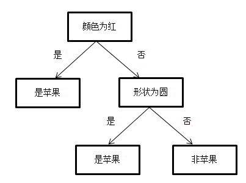
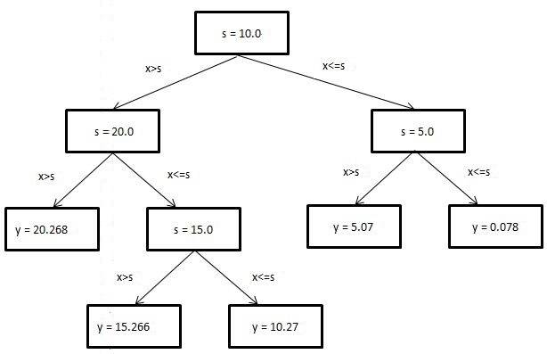
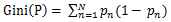
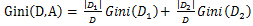
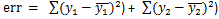
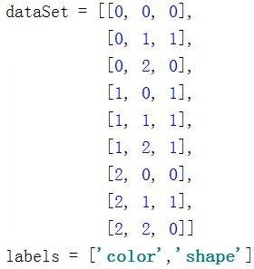
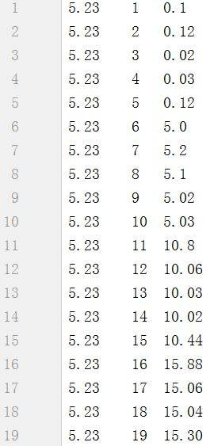

# 机器学习系列之手把手教你实现一个分类回归树
深入了解机器学习

**标签:** 分析

[原文链接](https://developer.ibm.com/zh/articles/machine-learning-hands-on5-cart-tree/)

韩笑琳

发布: 2018-01-22

* * *

## CART 树简介

在上一篇文章中，主要介绍了 ID3 和 C4.5 决策树。它们利用信息增益和信息增益比划分数据集。但是这两种决策树是有缺陷的，即按某特征划分后，该特征将不会在后面的划分中出现。这就导致了划分过于迅速，从而影响分类结果。在这篇文章中将要介绍的 CART（Classification And Regression Tree）树，即分类回归树利用二分策略，有效地避免了划分过于迅速这一问题。而且二分策略可以直接处理连续型属性值。

CART 树（分类回归树）分为分类树和回归树。顾名思义，分类树用于处理分类问题；回归树用来处理回归问题。我们知道分类和回归是机器学习领域两个重要的方向。分类问题输出特征向量对应的分类结果，回归问题输出特征向量对应的预测值。

分类树和 ID3、C4.5 决策树相似，都用来处理分类问题。不同之处是划分方法。分类树利用基尼指数进行二分。如图 1 所示就是一个分类树。

##### 图 1\. 分类树示例



回归树用来处理回归问题。回归将已知数据进行拟合，对于目标变量未知的数据可以预测目标变量的值。如图 2 所示就是一个回归树，其中 s 是切分点，x 是特征，y 是目标变量。可以看出图 2 利用切分点 s 将特征空间进行划分，y 是在划分单元上的输出值。回归树的关键是如何选择切分点、如何利用切分点划分数据集、如何预测 y 的取值。

##### 图 2\. 回归树示例



## CART 树原理

### 分类树

**二分**

分类树利用二分划分数据。将特征值等于切分点值的数据划分为左子树，将特征值不等于切分点值的数据划分为右子树。

**基尼指数：同信息增益、信息增益比作用类似，不过基尼指数相对更快**

假设有 N 个类，样本属于第 n 类的概率为 P _n_,则基尼指数为：



若数据集按特征 A 取值是否等于切分点值划分为 D1 和 D2 两部分，则在特征 A 下，集合 D 的基尼指数为：



### 回归树

**二分**

回归树也利用二分划分数据。与分类树不同的是，回归树将特征值大于切分点值的数据划分为左子树，将特征值小于等于切分点值的数据划分为右子树。

**平方误差**

不同于分类树，回归树用平方误差选择切分点。若数据集按特征取值是否大于切分点值划分为两部分，则在特征 A 下，集合 D 的平方误差为：



## 用 CART 树进行分类和回归

本节主要用示例数据详细说明如何用 CART 树进行分类和回归。

### 分类树

##### 表 1\. 示例数据集

**圆的****红的****分类**111100010000100

**选择最优特征**

1. 按特征”圆的” = 1 划分数据集，则 Gini 为：

3/5 _Gini(D1) + 2/5_ Gini(D0)

= 3/5 _[1/3_ 2/3 + 2/3 _1/3] + 2/5_ [0]

= 0.266

1. 按特征”红的” = 1 划分数据集，则 Gini 为：

2/5 _Gini(D1) + 3/5_ Gini(D0)

= 2/5 _[1/2_ 1/2 + 1/2 _1/2] + 3/5_ [0]

= 0.2

综上所述，由于按特征”红的”比特征”圆的”划分的基尼指数小，所以特征”红的” = 1 为切分点。

**按最优特征划分数据集**

按特征”红的”划分数据集后，有两种情况，第一种为如果是红的:0,则分类:0; 第二种为如果是红的:1, 则有如下数据子集 {圆的:1,分类：1; 圆的:0, 分类:0}

接下来需要对数据子集{圆的:1,分类：1; 圆的:0, 分类:0}继续划分。由于剩下一个特征，故按特征”圆的”划分数据集。划分后，如果是圆的:1，则分类:1；如果是圆的:0, 则分类:0。

返回的决策树为：

{‘红的’: {0: ‘类别 0’, 1: {‘圆的’: {0: ‘类别 0’, 1: ‘类别 1’}}}}

### 回归树

##### 表 2\. 示例数据集

**面积/平米****价格/万**2040.12140.33570.43670.2

**选择最优特征**

1.按特征”面积” = 20 划分数据集，

y1 均值为 40.1，

y2 均值为(40.3 + 70.4 + 70.2) / 3 = 60.3,

则平方误差为：

0 + （40.3 – 60.3）2\+ （70.4 – 60.3）2+（70.2 – 60.3）2

= 600.02

2.按特征”面积” = 21 划分数据集，则平方误差为：

y1 均值为(40.1 + 40.3)/ 2 = 40.2，

y2 均值为(70.4 + 70.2) / 2 = 70.3,

则平方误差为：

（40.1 –40.2）2\+ （40.3 –40.2）2\+ （70.4 –70.3）2+（70.2 –70.3）2

= 0.04

3.按特征”面积” = 35 划分数据集，则平方误差为：

y1 均值为(40.1 + 40.3 + 70.4) / 3 = 50.27，

y2 均值为 70.2,

则平方误差为：

（40.1 –50.27）2\+ （40.3 –50.27）2+（70.4 –50.27）2\+ 0

= 608.05

综上所述，由于按特征”面积” = 21 比特征”面积” = 20、”面积” = 35 划分的平方误差小，所以特征”面积” = 21 为切分点。

**按最优特征划分数据集**

以特征”面积” = 21 为切分点，将数据切分为{面积 = 20,价格 = 40.1; 面积 = 21, 价格 = 40.3}， {面积 = 35,价格 = 70.4; 面积 = 36, 价格 = 70.2}两个子集。

其中子集{面积 = 20,价格 = 40.1; 面积 = 21, 价格 = 40.3}的目标变量非常接近，故不继续划分，得叶节点值(40.1 + 40.3) / 2 = 40.2； 同理得子集{面积 = 35,价格 = 70.4; 面积 = 36, 价格 = 70.2}的叶节点值为 (70.4 + 70.2) / 2 = 70.3。

## 实现步骤: 自己动手实现 CART 树

本节将介绍分类树和回归树的代码实现细节。两者都是二分类划分数据。分类树利用基尼指数选择最优特征和最优特征对应的划分属性值。回归树利用平方误差选择最优特征和最优特征对应的划分属性值。

### 分类树

读者应该还记得上篇介绍的 ID3 和 C4.5 决策树，它们利用信息增益和信息增益比划分数据，且创建出来的树可以有任意多的分支数，分支数取决于特征值的多少。本节介绍的分类树与前两种决策树不同之处在于，它是二分类，即创建出来的树最多只有两个分支，而且是利用基尼指数划分数据。分类回归树分为两种树，分类树和回归树。本节先介绍分类树，回归树会在下一小节继续介绍。

#### 清单 1\. 计算基尼指数

```
def calcGini(dataSet):
    totalNum = shape(dataSet)[0]
    labelNum = {}
    gini = 0
    for data in dataSet:
        label = data[-1]
        if label in labelNum:
            labelNum[label] += 1
        else:
            labelNum[label] = 1

    for key in labelNum:
        p = labelNum[key] / totalNum
        gini += p * (1 - p)
    return gini

```

Show moreShow more icon

清单 1 介绍了基尼指数的实现代码。基尼指数的计算过程详见本文第二节内容。

#### 清单 2\. 选择最优特征

```
def chooseBestFeatVal2Split(dataSet):
    #如果没有可划分的特征或所有目标变量相等，停止
    if(len(dataSet[0]) == 1): return None, None
    if(len(set([d[-1] for d in dataSet])) == 1): return None, None
    bestFeature = 0
    bestValue = 0
    lowestGini = 100000
    totalGini = calcGini(dataSet)
    totalNum = shape(dataSet)[0]
    for feature in range(shape(dataSet)[1] - 1):
        allValues = [d[feature] for d in dataSet]
        values = set(allValues)
        for value in values:
            leftChild, rightChild = splitByFeatVal(feature, value, dataSet)
            if(shape(leftChild)[0] == 0 or shape(rightChild)[0] == 0): continue
            leftNum = shape(leftChild)[0]
            rightNum = shape(rightChild)[0]
            curGini = leftNum / totalNum * calcGini(leftChild) + \
                      rightNum / totalNum * calcGini(rightChild)
            if(curGini < lowestGini):
                bestFeature = feature
                bestValue = value
                lowestGini = curGini
    #如果 gini 减少很小，停止
    if(totalGini - lowestGini < 0.00001): return None, None
    return bestFeature, bestValue

```

Show moreShow more icon

清单 2 介绍了分类树选择最优特征的过程。对所有特征及特征下的所有属性值，计算按其划分的子数据集的基尼指数，选择最小的基尼指数对应的特征和属性值为最优特征及最优特征对应的最优属性。注意分类树的结束条件。如果没有可以划分的特征或者所有目标变量都相等，则停止继续划分数据集；如果基尼指数减小很少，也停止继续划分数据集。

#### 清单 3\. 按特征划分数据集

```
def splitByFeatVal(feature, value, dataSet):
    #左子树的值大于根节点的值
    dataSet = mat(dataSet)
    leftChild = dataSet[nonzero(dataSet[:,feature] == value)[0], :].tolist()
    #右子树的值小于等于根节点的值
    rightChild = dataSet[nonzero(dataSet[:,feature] != value)[0], :].tolist()
    return leftChild, rightChild

```

Show moreShow more icon

清单 3 用来给分类树划分数据集。如果 feature 对应的属性值等于 value 值，则将该条数据划分到左子树；如果 feature 对应的属性值不等于 value 值，则将该条数据划分到右子树。

#### 清单 4\. 结束条件

```
def checkIsOneCateg(newDataSet):
    flag = False
    categoryList = [data[-1] for data in newDataSet]
    category = set(categoryList)
    if(len(category) == 1):
        flag = True
    return flag

def majorityCateg(newDataSet):
    categCount = {}
    categList = [data[-1] for data in newDataSet]
    for c in categList:
        if c not in categCount:
            categCount[c] = 1
        else:
            categCount[c] += 1
    sortedCateg = sorted(categCount.items(), key = lambda x:x[1], reverse = True)

    return sortedCateg[0][0]

```

Show moreShow more icon

清单 4 介绍了分类树用来结束的条件。checkIsOneCateg 函数用来判断数据集的目标变量是否为一个分类结果。majorityCateg 函数用来选出目标变量中的大多数值作为输出变量。

#### 清单 5\. 创建分类树

```
def createClassifTree(dataSet):
    feature, value = chooseBestFeatVal2Split(dataSet)
    #如果无法分割，那么返回叶节点的值。如果业界点钟所有目标变量相同则为此值，不同则为多数值
    if feature == None and checkIsOneCateg(dataSet):
        return dataSet[0][-1]
    if feature == None and not checkIsOneCateg(dataSet):
        return majorityCateg(dataSet)
    #如果可以继续分割，那么继续创建新的子树
    classifTree = {}
    classifTree['featIndex'] = feature
    classifTree['value'] = value
    leftChild, rightChild = splitByFeatVal(feature, value, dataSet)
    classifTree['leftChild'] = createClassifTree(leftChild)
    classifTree['rightChild'] = createClassifTree(rightChild)
    return classifTree

```

Show moreShow more icon

清单 5 用来创建分类树。首先判断是否可以继续分割。如果无法分割，则出现叶节点。若所有目标变量值相同，则叶节点值就是此目标变量的值；否则，选出大多数值作为叶节点的值。如果可以继续分割，则创建子树 classifTree。这是一个 python 中的字典结构，存储四个键值对。featIndex 存储特征的下标，value1 存储特征的值；leftChild 存储左子树；rightChild 存储右子树。对左右子树继续递归调用 createClassifTree 函数，直到达到结束条件为止。

### 回归树

回归树与分类树的不同之处体现在选择最优特征的方法、划分数据集的方法、叶节点取值的方法上。

#### 清单 6\. 计算平方误差

```
def calcErr(dataSetMat):
    error = var(dataSetMat[:,-1]) * shape(dataSetMat)[0]
    return error

```

Show moreShow more icon

清单 6 介绍了平方误差的计算方法。具体方法详见本文第二节内容。

#### 清单 7\. 选择最优特征

```
def chooseBestFeatVal2Split(dataSetMat):
    #如果所有目标变量相等，停止
    if(len(set(dataSetMat[:,-1].T.tolist()[0])) == 1): return None, None
    bestFeature = 0
    bestValue = 0
    lowestErr = 100000
    totalErr = calcErr(dataSetMat)
    for feature in range(shape(dataSetMat)[1] - 1):
        allValues = [d[feature] for d in dataSetMat.tolist()]
        values = set(allValues)
        for value in values:
            leftChild, rightChild = splitByFeatVal(feature, value, dataSetMat)
            if(shape(leftChild)[0] == 0 or shape(rightChild)[0] == 0): continue
            curErr = calcErr(leftChild) + calcErr(rightChild)
            if(curErr < lowestErr):
                bestFeature = feature
                bestValue = value
                lowestErr = curErr
    #如果误差减少很小，停止
    if(totalErr - lowestErr < 1): return None, None
    return bestFeature, bestValue

```

Show moreShow more icon

清单 7 用来为回归树选择最优特征。对每个特征的每个属性值，计算按该属性值二分后的两个子数据集的平方误差和，选择平方误差和最小的特征作为最优特征。除了用平方误差代替基尼指数之外，其他过程和分类树基本相同。

#### 清单 8\. 按特征划分数据集

```
def splitByFeatVal(feature, value, dataSetMat):
    #左子树的值大于根节点的值
    leftChild = dataSetMat[nonzero(dataSetMat[:,feature] > value)[0], :]
    #右子树的值小于等于根节点的值
    rightChild = dataSetMat[nonzero(dataSetMat[:,feature] <= value)[0], :]
    return leftChild, rightChild

```

Show moreShow more icon

清单 8 介绍了回归树划分数据集的方法。与分类树不同的是，回归树将 feature 属性值大于 value 的数据归入 leftChild 左子树，将 feature 属性值小于等于 value 的数据归入 rightChild 右子树。

#### 清单 9\. 创建回归树

```
def createRegTree(dataSetMat):
    feature, value = chooseBestFeatVal2Split(dataSetMat)
    #如果无法分割，那么返回叶节点的值，即所有 dataSetMat 的均值
    if feature == None: return mean(dataSetMat[:,-1])
    #如果可以继续分割，那么继续创建新的子树
    regTree = {}
    regTree['featIndex'] = feature
    regTree['value'] = value
    leftChild, rightChild = splitByFeatVal(feature, value, dataSetMat)
    regTree['leftChild'] = createRegTree(leftChild)
    regTree['rightChild'] = createRegTree(rightChild)
    return regTree

```

Show moreShow more icon

清单 9 是创建回归树的代码。与分类树不同之处在于，如果无法继续划分数据集，那么返回子数据集的所有目标变量的均值作为叶节点的值。其他部分和分类树基本相同。

### 代码下载

本文所有 CART 树实现代码可在文末下载。

## 本文数据集简介

##### 图 3\. 分类树数据集样例



数据集有 9 条数据。其中第一列数据代表颜色，取值范围是 0,1,2。其中 0 代表青色，1 代表红色，2 代表黄色。第二列数据代表形状，取值范围是 0,1,2。其中 0 代表扁的，1 代表圆的，2 代表椭圆的。第三列代表分类，取值范围是 0,1。其中 0 代表不是苹果，1 代表是苹果。

##### 图 4\. 回归树数据集样例



数据集共 25 条数据。第一列数据代表房子的评价得分，此数据集中所有数据的评价得分都是 5.23。第二列数据代表房子的平方数，第三列数据代表房子的价格，以万为单位。

## 应用示例: 应用实现的 CART 树解决实际问题

#### 清单 10\. 用分类树解决实际问题

```
if __name__ == '__main__':
    dataSet, labels = loadDataSet()
    classifTree = createClassifTree(dataSet)
    print(classifTree)

```

Show moreShow more icon

清单 10 列出调用分类树进行建模的代码。

运行结果：

{‘value’: 1, ‘featIndex’: 0, ‘leftChild’: 1, ‘rightChild’: {‘value’: 1, ‘featIndex’: 1, ‘leftChild’: 1, ‘rightChild’: 0}}

运行结果中的树用 python 中的字典结构表示。featIndex 表示 feature 的下标，其中 feature 指颜色和形状。value 指 feature 的取值，取值范围是 0, 1, 2。leftChid 表示左子树，左子树是等于父节点值的子集合数据。rightChild 表示右子树，右子树是不等于父节点值的子集合数据。如果左子树和右子树是叶节点，则叶节点的值就是最终的分类结果。其中叶节点的取值范围是 0 和 1。0 代表是苹果，1 代表不是苹果。运行结果含义为：如果颜色是红的，则是苹果；如果颜色不是红的，但形状是圆的，则是苹果；如果颜色不是红的，且形状不是圆的，则不是苹果。该运行结果与图 1 所示分类树相同。

#### 清单 11\. 用回归树解决实际问题

```
if __name__ == '__main__':
    dataSetMat = loadDataSet()
    regTree = createRegTree(dataSetMat)
    print(regTree)

```

Show moreShow more icon

清单 11 列出了调用回归树进行建模的代码。

运行结果：

{‘featIndex’: 1, ‘value’: 10.0, ‘rightChild’: {‘featIndex’: 1, ‘value’: 5.0, ‘rightChild’: 0.078, ‘leftChild’: 5.0700000000000003}, ‘leftChild’: {‘featIndex’: 1, ‘value’: 20.0, ‘rightChild’: {‘featIndex’: 1, ‘value’: 15.0, ‘rightChild’: 10.27, ‘leftChild’: 15.266}, ‘leftChild’: 20.268000000000001}}

运行结果中的树同样用 python 中的字典结构表示。featIndex 和 value 的含义和分类树中的相同。在回归树中，leftChild 代表的左子树的值比父节点值大，rightChild 代表的右节点的值小于等于父节点值。运行结果含义是：第一个特征的值小于 5.0 时，目标变量为 0.078；第一个特征的值大于 5.0 且小于 10.0 时，目标变量为 5.07；第一个特征的值大于 15.0 且小于 20.0 时，目标变量为 15.266；第一个特征的值大于 10.0 且小于 15.0 时，目标变量为 10.27；第一个特征的值大于 20.0 时，目标变量为 20.268。该运行结果与图 2 所示回归树相同。

## 总结

本文首先介绍了分类回归树及预剪枝、后剪枝的概念，接着从二分、基尼指数、平方误差等入手详细深入地讲解了 CART 树的原理。接着用例子介绍分类树与回归树的算法过程。然后通过代码样例，介绍了自己动手实现分类树与回归树的思路。最后，利用数据展示了如何应用 CART 树解决实际问题。通过上面介绍，读者已经知道回归树用来进行分段回归，每段输出的目标变量为该段所有目标变量的均值。这种方法简单易实现，但是也有局限。如果每段的目标变量并非一个常数，而是一个线性模型，用回归树拟合就会造成误差过大的后果。这时，就需要考虑模型树。同回归树一样，模型树也是对特征空间进行划分，但在每个划分内部建立线性模型，而非一个常数。关于模型树的详细介绍请参考下方所列文献。由于分类回归树对特征空间不断划分，这很容易造成过拟合的问题。处理过拟合不仅需要预剪枝，还需要后剪枝。预剪枝是在建立模型阶段通过制定终止条件来提早完成划分。后剪枝则是在模型建立后，利用测试数据计算剪除部分叶节点是否会造成模型误差减少，如果是，则剪除对应的叶节点。当然，后剪枝时不仅要考虑误差是否减少，还需考虑正则项，即模型的大小。最后综合选择模型误差较小且模型简单的分类回归树。由于篇幅有限，对后剪枝感兴趣的读者请参考下文所列文献。

## 参考资源

本文用到的参考文献如下：

- 参考李航著《统计学习方法》，了解后剪枝概念。
- 参考 Peter Harrington 著《机器学习实战》，了解 CART 树代码框架及模型树概念。

## Download

[cartTreeDiy\_code](/developerworks/cn/analytics/library/machine-learning-hands-on5-cart-tree/cartTreeDiy_code.zip): 样例代码