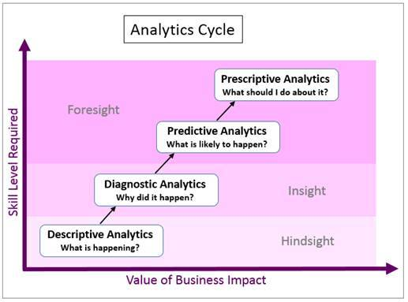

# 机器学习，深度学习 101
IBM Power Systems 入门

**标签:** IBM Power Systems,机器学习

[原文链接](https://developer.ibm.com/zh/articles/l-machine-learning-deep-learning-trs/)

Beth Hoffman, Rupashree Bhattacharya

发布: 2017-07-04

* * *

## 当今世界中各种分析的现实意义

未经处理的原始数据没有太大价值，但借助正确的分析技术可以获取丰富的洞察，为生活的各个方面提供帮助，比如制定业务决策、竞选活动和推动医学发展。

如图 1 所示，分析周期大致可分为 4 个类别或阶段：描述、诊断、预测和规范分析。机器学习是一种数据分析方法，它自动化了分析模型的构建，所有 4 种分析类型中都会用到它。

**4 种分析类型**

- 描述分析：此类分析会根据现有数据确定 _正在发生的事件_ 。
- 诊断分析：此类分析更进一步，确定为什么会出现某种特定情况。
- 预测分析：此类分析会考虑跨越更长时间的更大数据集，查看趋势和示例，然后使用该历史信息预测未来发生概率。
- 规范分析：此类分析超越了预测，提供了关于如何最恰当地改变未来情况来满足您的目标的建议。

##### 分析周期的 4 个阶段

2016 年美国总统竞选中各种分析的广泛应用证实了，在分析中使用机器学习的现实意义及其越来越广泛的应用环境。可获得的有用信息的空前增长，再加上技术的进步，共同促进了分析的使用，进而构建并实现了一个更具吸引力的竞选活动。竞选团队会分析投票者情绪、人口细分类别和历史投票模式，使用此信息更有效地计划将竞选工作的重点放在哪些州和哪些投票者身上，以确保获得最高票数。机器学习是实现此目标的关键。由于这一新趋势，所有政治运动中的实际资产都快速从资金转变成了投票者数据，这些数据收集自民意调查者、资金筹集者、现场调查员、用户数据库、私营公司，竞选网站上的 cookie 和跟踪程序，以及社交媒体应用。机器学习算法在这个包含投票者数据的庞大存储库上的应用，改变了竞选的形势，提供了以行动为导向的洞察：对每位投票者的预测。这些洞察在竞选中得到使用，以便采取战略性的方法来筹集资金，更有效地定位广告，建立摇摆州投票者的详细模型。通过计算候选人在投票中胜出的可能性，未坚持投票的支持者这次主动投票的可能性，以及如何通过各种竞选接触途径说服某个人，机器学习能够提高竞选工作的效率。最终，机器学习使得指标对竞选的推动作用更为显著。

## 机器学习概述

机器学习算法反复从数据中学习，使得无需为计算机明确规划要查看的位置，它就能找到隐藏的洞察。基本上讲，机器学习指导计算机创建算法来解决问题，这些算法是从数百或数千个示例中学到的，然后使用学到的经验解决新情况中的相同问题。根据可供学习系统使用的学习 _信号_ 或 _反馈_ 的性质，机器学习任务通常分为以下 3 大类：

- **监督式学习** ：该算法使用带标签的历史数据进行训练，学习将输入 [映射](https://en.wikipedia.org/wiki/Map_(mathematics))到输出/目标的通用规则。例如，根据投票者历史数据（标记了前几年的选票（标签）的投票者细节），总统竞选可以预测哪些类型的投票者可能投给某位既定候选人，或者哪些类型的投票者能够通过竞选手段来说服，并使用此信息更有效地规划资源利用。

    在监督式学习中，通过一个训练集来发现输入变量（例如年龄和收入等投票者细节）和标签/目标变量（例如特定投票者在上次选举中的选票）之间的关系。计算机/机器从训练数据中 _学习_ 。

    使用测试集来评估所发现的关系是否有效，并通过为模型提供测试数据输入变量，对比模型所预测的标签与数据的实际标签，从而评估预测关系的强度和实用性。

    确定 _训练数据_ 与 _测试数据_ 之间的划分比例，通常被认为是一件很棘手的事情。将更大比例的数据划分为 _测试数据_ ，可确保模型性能得到更好的验证。如果训练数据太少，提供给模型供其学习的数据就会更少。一般情况下，训练数据与测试数据采用 60:40 到 80:20 的比例被认为是良好的划分比例。

    最广泛使用的监督式学习算法包括 [支持矢量机](https://en.wikipedia.org/wiki/Support_Vector_Machines) 、 [线性回归](https://en.wikipedia.org/wiki/Linear_regression) 、 [逻辑回归](https://en.wikipedia.org/wiki/Logistic_regression) 、 [朴素贝叶斯](https://en.wikipedia.org/wiki/Naive_Bayes_classifier) 和 [神经网络](https://en.wikipedia.org/wiki/Artificial_neural_network)（ [多层感知](https://en.wikipedia.org/wiki/Multilayer_perceptron)）。

- **无监督学习：** 算法使用无标签的数据进行训练。这些算法的目标是探索数据并寻找其中的某种结构。例如，通过使用这些算法，总统竞选可以识别具有类似属性的投票者的细分类别，然后，通过为每个群体定制竞选策略，可以在竞选中为这些投票者采用类似的处理方式。最广泛使用的无监督学习算法包括集群分析和市场篮分析。
- **强化学习：** 该算法通过一个反馈系统进行学习。该算法会执行相应的操作，并接收有关其操作的适宜性的反馈，然后根据反馈修改策略，采取会在给定时间范围内获得最大预期回报的进一步操作。强化学习最常用于自动驾驶汽车、无人机和其他机器人应用程序中。

## 深度学习概述

深度学习是一种特殊的机器学习类型，涉及更深层的自动化。机器学习的重大挑战之一是 _特征提取_ ，程序员需要告诉算法应该寻找哪些种类的信息来帮助制定决策，仅为算法提供原始数据很少会起作用。特征提取给程序员带来了巨大负担，尤其是在复杂问题中，比如物体识别。算法的有效性高度依赖于程序员的技能。深度学习模型能解决此问题，因为它们能自己学会专注于正确的特征，只需程序员提供很少的指导，得到的分析结果比人类获得的还要好。深度学习模型在复杂任务中非常有效，比如情绪分析和计算机视觉。但是，深度学习算法通常需要极高的计算能力，因为学习过程与从低层到高层的学习数据抽象和表示的深层分层结构相关，所以该过程非常缓慢。

## IBM Power Systems 上的机器学习入门

使用机器学习需要各种各样的技术和工程技能。要在公司使用机器学习，可能需要一个拥有不同数据和分析领域的知识和技能的专家团队。这些技能包括理解和访问要使用的数据，了解如何使用数据清理工具，理解机器学习概念和算法，拥有分析工具使用经验，编写应用程序，并对实现和部署机器学习处理环境的必要软硬件进行设置。

下面是使用机器学习的常用步骤介绍：

1. 通过设置和配置 IBM Power Systems 服务器，开始运行机器学习工作负载。
2. 确定要解决的业务问题。
3. 识别和收集要使用的数据，预处理数据，以便将它们清理和转换为实用状态，并在使用监督式学习算法时将它们划分为 _训练数据_ 和 _测试数据_ 。
4. 确定要使用的机器学习算法。算法是根据需要回答的业务问题来确定的。例如，可使用神经网络执行预测分析，而对于客户细分，可以使用集群分析。要使用的最合适算法还取决于可用数据的状态。例如，如果数据中有部分是缺失值，决策树可能是首选的算法，因为它们可以更好地处理这些缺失值。
5. 选择分析工具并将其安装在 IBM Power Systems 上。每个分析工具都支持一种或多种编程语言。所以，用于构建模型的编程语言通常取决于所选的工具。工具示例包括 SPSS、SAS、开源工具和 Spark MLlib。语言示例包括 R、Java™ 和 Python。
6. 编写代码，以便使用所选的机器学习算法构建一个或多个模型，并使用 _训练数据_ 训练这些模型。如果已经构建了一个监督式学习模型，则使用 _测试数据_ 测试它，并执行必要的配置调优来实现更高的准确度。如果有多个模型，可以根据处理 _测试数据_ 的性能来选择最佳模型。
7. 在 IBM Power Systems 上运行模型。
8. 使用 Apache Spark 提高性能，在分布式模式中或跨一个基于 IBM POWER8® 处理器的服务器集群节点来运行模型。
9. 在分析工具中可视化结果，比如 IBM Power Systems 上的 IBM Cognos® Business Intelligence。

### 为什么要使用 IBM Power Systems 执行机器学习应用程序？

在 IBM Power Systems 上运行机器学习和深度学习工作负载有许多好处。这些工作负载可能需要大量浮点计算，需要大量内存和 I/O 带宽，因此可以利用图形处理单元 (GPU) 加速来提高性能。IBM Power 服务器具有更大缓存，而且能将数据推送到数值协处理器或 GPU，所以适合运行这些工作负载。深度学习框架还提供了预先构建的开源选项，以便在基于 POWER8 处理器的服务器上轻松安装 GPU。因为 IBM Power® 平台能将大数据和深度学习融合到同一个平台上，因此这些工作负载能直接在 IBM Power 服务器上的大数据/Hadoop 基础架构附近运行，而无需执行提取、转换和加载 (ETL)。

### IBM Power Systems 上提供的与机器学习相关的分析工具

要在 IBM Power Systems 上使用机器学习和深度学习，有多种选择。

**POWER / Linux 或 AIX 上的 IBM SPSS**

IBM SPSS® 支持多种机器学习算法。可使用 SPSS Modeler 创建和测试模型，并使用 SPSS Collaboration and Deployment Services 运行模型。请参阅介绍 [如何在基于 IBM POWER8 处理器的服务器上运行和调节 SPSS Modeler，以实现卓越性能](https://www.ibm.com/developerworks/community/blogs/f0f3cd83-63c2-4744-9021-9ff31e7004a9/entry/IBM_products_are_so_flexible_2_5x_performance_gains_after_tuning?) 的相关博客。

**POWER / AIX 上的 SAS**

SAS 支持 IBM Power Systems 上的众多分析工具。Enterprise Miner 支持使用多种机器学习算法来构建和测试模型。

有关更多信息，请访问： [http://www.sas.com](http://www.sas.com/)

**POWER / Linux 上提供的开源机器学习和深度学习库**

许多 [开源机器学习库](http://www.infoworld.com/article/2853707/machine-learning/11-open-source-tools-machine-learning.html#slide2) 变得越来越流行。一些开源机器学习和深度学习库可在 IBM Power Systems 上运行，包括 Caffe、Torch 和 Theano，未来还会出现其他许多库。

- 可参阅 Micheal Gschwind 的博客，进一步了解如何 [开始在 Power Systems 上使用开源机器学习和深度学习](https://www.ibm.com/developerworks/community/blogs/fe313521-2e95-46f2-817d-44a4f27eba32/entry/Major_Deep_Learning_Frameworks_Now_Available_as_Simple_Distributions_on_the_OpenPower_Platform?) 。
- 可参阅 Michael Gschwind 的博客，进一步了解新的 [用于深度学习的 OpenPOWER 软件发行版](http://openpowerfoundation.org/blogs/openpower-deep-learning-distribution/) 。
- 请参阅 [OpenPOWER 深度学习产品简介](http://ibm.co/1YpWn5h) ，其中介绍了 Power Systems 机器学习和深度学习参考架构。

**POWER / Linux 上的 Apache Spark MLlib**

Apache Spark 是一个分布式处理环境。Spark 的一个重要组件是 MLlib，这是一个机器学习库。该库可供 Spark 支持的编程语言使用：Java、Scala、Python 和 SparkR。MLlib 支持数十种算法和实用工具，这些资源可在 [Spark MLlib 指南](http://spark.apache.org/docs/latest/mllib-guide.html) 中找到。

可参阅 Raj Krishnamurthy 和 Randy Swanberg 的博客，了解 [Apache Spark 如何在 IBM POWER8 上以 2 倍的速度运行](https://www.ibm.com/developerworks/community/blogs/f0f3cd83-63c2-4744-9021-9ff31e7004a9/entry/Apache_Spark_Runs_2X_Faster_on_IBM_s_POWER8?) 。

该博客总结了 3 种关键的机器学习工作负载（逻辑回归、支持矢量机和矩阵因子分解），以及在基于 x86 处理器的 IBM POWER8 上实现卓越性能的推荐配置。

## 立即行动

OpenPOWER 曾有一场名为 OpenPOWER Developer’s Challenge 的黑客马拉松。其中一个专题是通过 OpenPOWER 上的 Apache Spark 实现深度学习 (The Accelerated Spark Rally)。这是试验深度学习的绝佳机会！可以在 [此处](http://openpower.devpost.com/) 获取更多信息。

## 资源

IBM 还有更多机器学习产品。以下是两个附加资源：

- [IBM 海法研究实验室](http://www.research.ibm.com/haifa/dept/vst/ml.shtml)
- [IBM Developer 网站机器学习专区](http://www.ibm.com/developerworks/topics/machine__learning/)

本文翻译自： [Machine Learning, Deep Learning 101](https://developer.ibm.com/articles/l-machine-learning-deep-learning-trs/)（2017-07-04）