# 构建基于 Docker + Jenkins + Sahi 的 Web UI 自动化测试环境
自动化测试环境入门

**标签:** DevOps,Web 开发,持续集成

[原文链接](https://developer.ibm.com/zh/articles/os-cn-jenkinsdockersahi/)

沈锐

发布: 2015-04-29

* * *

## Docker 介绍

Docker 号称是下一代的虚拟机，它在启动和创建速度、性能、移植性等方面均优于传统虚拟机。Docker 是 PaaS 提供商 dotCloud 开源的一个基于 LXC 的高级容器引擎。它能够让开发者打包他们的应用以及依赖包到一个可移植的容器中，然后发布到任何流行的 Linux 机器上，也可以实现虚拟化。目前，通过 Boot2Docker 已能使 Docker 运行在 Windows 和 OS X 中。Docker 容器完全使用沙箱机制，相互之间没有任何接口。Docker 几乎没有性能开销，可以很容易地在机器和数据中心中运行。最重要的是, 他们不依赖于任何语言、框架或系统。

Docker 在其网站上明确地提到的 Docker 的典型应用场景如下：

- 对应用进行自动打包和部署
- 创建轻量、私有的 PAAS 环境
- 自动化测试和持续整合与部署
- 部署和扩展 Web 应用、数据库和后端服务

在自动化测试领域，Docker 大有取代传统虚拟机技术的趋势，原因如下：

1. 自动化测试依赖的是测试所需要的应用，而并非整个操作系统。因此，传统的虚拟机技术存在资源浪费。
2. Docker 构建于 LXC 之上。借助 LXC 轻量级的特性，相比于目前的虚拟机技术，Docker 启动更快、资源占用更小。
3. Docker 比虚拟机轻量、灵活，便于管理。
4. Docker 标准化的构建方法 (Dockerfile) 和良好的 REST API，使得自动测试和持续集成/部署能够很好的集成进来。

## Sahi 介绍

Sahi 是一个开源的 Web UI 自动化测试框架。尽管它的知名度不及 Selenium，用户群也不及 Selenium 庞大，但它确有它独特的魅力，例如：

1. 基于上下文的页面元素识别机制。
2. 隐式页面加载响应等待机制。
3. 良好的浏览器支持。
4. 优秀的跨浏览器录制回放调试工具 Sahi Controller。

这些特性都大大地加快了自动化测试脚本的开发速度，并降低了维护成本。

Sahi 通过一个用 Java 编写的代理服务器，将用户的脚本转换为 JavaScript 后注入往返的 HTTP 请求及响应中，从而驱动浏览器事件。编程语言方面，除 Sahi 脚本（其本质是一个 JavaScript 库）以外，还支持 Java 和 Ruby。Sahi 有开源和收费两个版本。虽然收费版本提供了很多开源版本不具备的高级特性，不过开源版本已经能够满足大部分的功能要求。 [点此查看](https://sahipro.com/) 开源版本与收费版本的差异。

## Jenkins 介绍

Jenkins 是一种开源的基于 Java 开发的持续集成工具，前身称作 Hudson。Jenkins 提供了用于监控持续重复工作的软件平台。它支持丰富的插件，用户可以按照需求进行选择安装和配置，以实现生成执行状态表格，自动部署、更新自动化测试包等高级功能。本文将要介绍 Jenkins 的 Docker 插件，它能够动态地创建 Docker 容器作为 Jenkins Slave 节点，并在执行任务后，自动关闭容器。另外，它还支持一些额外功能，比如当构建任务成功完成后自动将容器保存为镜像、自动将镜像上传到资源库等。

## 实例演示

该实例演示如何制作一个运行 Sahi 的镜像以及如何在 Jenkins 上配置 Docker 插件以运行 Sahi 测试脚本。

### 准备 Docker 镜像

本实例需要准备三个镜像：一个运行 Jenkins，一个运行 Subversion，另外一个运行 Sahi。

首先，制作运行 Sahi 的镜像。 [Docker Hub](https://hub.docker.com/) 是一个用于分享 Docker 镜像的资源库。目前，该资源库还没有运行 Sahi 的镜像，所以必须自己创建 Dockerfile 来构建镜像。下图是用来制作 Sahi 镜像的目录。

##### 图 1\. 制作 Sahi 镜像的目录

下图是 Dockerfile 的文件内容。

##### 图 2\. Dockerfile文件内容

整个过程大体分为八个步骤：

1. 指定基础镜像

    我们使用的是 evarga/jenkins-slave。该镜像基于 Ubuntu，安装了 SSH 服务，并创建了用户 Jenkins。

2. 替换系统默认更新源。把系统更新源替换为 163 的，后面的软件安装速度会比较快一些。
3. 安装必要的软件（不包括 Oracle Java 和 Sahi）：Firefox, Unzip 以及 Xvfb。删除 Open JDK 是为了后面安装 Oracle Java 做准备。Firefox 不用多说，因为该镜像用于 Web UI 自动化测试，所以安装了最新版本的 Firefox。安装 Unzip 是因为后面安装 Sahi 需要用到它。Xvfb（X virtual framebuffer）是一个 X11 显示服务器的实现。它不是将图形在屏幕上显示出来，而是在内存中运行所有的图形操作。对客户端来说，除了无法看到真正的图形显示，没有其他分别。一般称这种运行方式为 headless。
4. 安装 Oracle Java 8。理论上 Sahi 应当也支持 Open JDK，所以安装 Oracle Java 不是必须的。
5. 安装 Sahi。上传了 zip 文件后，用 Unzip 解压，Sahi 是基于 Java 的，所以解压后即已安装好 Sahi。之后，替换了几个文件，它们的作用如下：

    **Userdata.properties**

    userdata.properties 中有个属性叫 proxy\_alert.disabled，默认值为 false。用户第一次启动 Sahi Dashboard 的时候，会弹出一个如下图所示的对话框。用户勾选了”Do no show this message again”并点击 Continue 按钮之后，Sahi 修改该属性值为 true。之后就不会在跳出这个对话框了。由于用 headless 的方式运行 Sahi 无法点击该对话框，所以必须事先用一个已将该属性设置为 true 的文件替换 Sahi 默认的 userdata.properties。

    图 3\. Dockerfile文件内容 {: #图-3-sahi-代理问题对话框}

    **sahi\_example\_com**

    这是一个证书文件。用户第一次在 Sahi Dashboard 中打开 Firefox 时的页面如下图所示。用户需要点击 SSL Manager 链接手动接受 SSL 证书。此时，文件 sahi\_example\_com 被生成到 userdata/certs 目录下。之后，就不需要再进行该操作了。所以，复制的 sahi\_example\_com 目的也是为了自动完成这步需要在图形界面下才能完成的操作。

    图 4\. Sahi 启动页 {: #图-4-sahi-启动页}

    图 5\. SSLManager 的非信任连接页面 {: #图-5-sslmanager-的非信任连接页面}

    **browser\_types.xml**

    替换该文件是为了使 Sahi 以 headless 的方式工作。在该文件中，事先添加了一个名字为 firefox-xvfb 的浏览器配置信息。之后，测试脚本就可以指向该浏览器运行。 [具体配置 Sahi 和 Xvfb 的步骤参考](http://sahipro.com/docs/using-sahi/configuring-sahi-with-xvbf.html) 。

6. 添加 init.sh 文件

    init.sh 文件用于启动 Xvfb 和 Sahi。其内容如下。

    图 6\. init.sh 文件内容 {: #图-6-init-sh-文件内容}

    “sleep 5”是因为 Sahi 启动需要一点时间，若立即运行测试脚本会导致失败。

7. 修改权限

    最终运行的容器是作为 Jenkins Slave 节点用 Jenkins 用户运行，因此将整个/usr/local 目录及子目录的所有人修改为 Jenkins，并给 Shell 文件添加执行权限。Jenkins 用户是在基础镜像 evarga/jenkins-slave 中创建的，所以在这个 Dockerfile 里没有创建 Jenkins 用户的语句。

8. 指定默认执行的命令

CMD [“/usr/sbin/sshd”,”-D”] – 该语句令镜像默认启动 SSH 服务。事实上，这条语句也可以不添加，因为 evarga/jenkins-slave 的 Dockerfile 中已包含该语句。

一切就绪之后，在该目录中执行 “docker build -t shenrui/sahi –rm=true”。命令成功执行后，通过 “docker images” 应当可以查看到名为 “shenrui/sahi” 的镜像。该镜像已经上传到 Docker Hub，有需要的读者可以自行拉取。

Sahi 镜像构建好之后，接下来准备 Jenkins 容器。Docker Hub 上已有官方的 Jenkins 镜像，直接用命令 “docker pull jenkins” 拉取。在 Docker 主机上，创建一个目录（例如，/data/jenkins\_home），并修改权限（chmod 777）以便 Jenkins 容器能读写该目录，然后用命令”docker run -d -t –name myjenkins -p 8080:8080 -v /data/jenkins\_home:/var/jenkins\_home jenkins” 启动。此时，打开 `http://<Docker Host IP>:8080` 应当可以看到 Jenkins 的管理页面。 同样地，直接拉取 Docker Hub 的 Subversion 的镜像（docker pull bsboiko/subversion）。不过，还需要做进一步的配置。步骤如下：

1. 用命令 “docker run -i -t bsboiko/subversion /bin/bash” 以交互的方式启动 Subversion 容器。
2. 在容器中创建目录 /var/svn/repos（mkdir -p /var/svn/repos），并基于该目录创建 Subversion 资源库（svnadmin create /var/svn/repos）。
3. 在资源库目录下的 svnserve.conf 文件中删除 “password-db = passwd” 前面的注释符 #，并在 passwd 文件中添加一行 “shenrui = password”。
4. 用命令 “docker commit  mysvn” 把上面所做的修改保存下来创建一个新镜像 mysvn。
5. 最后，用命令 “docker run -t -d -p 3690:3690 –name mysvn mysvn svnserve -d –foreground -r /var/svn/repos” 启动 mysvn 容器。启动时，添加容器到主机的端口映射 “-p 3690:3690” 以便之后直接通过主机 IP 提交测试脚本。

至此，Docker 上有两个正在运行的容器（docker ps），名字分别是 myjenkins 和 mysvn。

### 准备 Sahi 测试脚本

为实例编写的 Sahi 测试脚本是针对 [developerWorks 中国网站(现已更名为 IBM Developer)](http://www.ibm.com/developerworks/cn/) 做的一些简单测试。目录结构如下图。Downloads.sah 和 topics.sah 分别点击首页上的”软件下载”和”技术主题”链接，然后验证跳转后的页面的标题。Search.sah 在首页的搜索框中输入 docker 并对搜索结果页面进行简单验证。Mytest.suite 是一个测试套件文件，用来包含其他三个测试脚本。

##### 图 7\. Sahi 测试脚本目录

run\_tests.sh 的文件内容如下。它首先调用 init.sh 启动 Xvfb 和 Sahi，然后触发测试脚本的运行。命令中指定了 JUnit 报表的输出路径和 Sahi 自身的 HTML 报表的输出路径。

##### 图 8\. run\_tests.sh 文件内容

将测试脚本提交到 Docker 的 Subversion 容器（svn://172.17.42.1/mytest）。

### 配置 Jenkins

首先，安装两个 Jenkins 插件：

- [Docker Plugin](https://wiki.jenkins-ci.org/display/JENKINS/Docker+Plugin%20)

该插件能够集成 Jenkins 与 Docker。其功能前文已有描述。

- [HTML Publisher Plugin](https://wiki.jenkins-ci.org/display/JENKINS/HTML+Publisher+Plugin)

该插件用以发布构建生成 HTML 报表，方便日后查看。

接下来，要开启 Docker 的 TCP 监听端口。开启的方法在不同的系统上有所不同。本实例 Docker 主机为 RHEL 6.5。开启的方法是在/etc/sysconfig/docker 中设置 other\_args=”-H tcp://0.0.0.0:4243 -H unix:///var/run/docker.sock”，然后运行”service docker restart”重启 Docker 服务。CoreOS 上的开启方法请参见 [Customizing docker](https://coreos.com/docs/launching-containers/building/customizing-docker/) 。

进入 Jenkins 的系统配置页面（Manager Jenkins>Configure System），在最底部比之前增加了一个 Cloud 的部分。点击 Add a new cloud，选择 Docker 添加一个 Docker 主机。这里，因为 Jenkins 运行在 Docker 的容器里，直接用私有 IP（ifconfig 里 docker0 对应的 IP）加端口 4243 填写 Docker URL 输入域。

##### 图 9\. Docker Cloud 配置

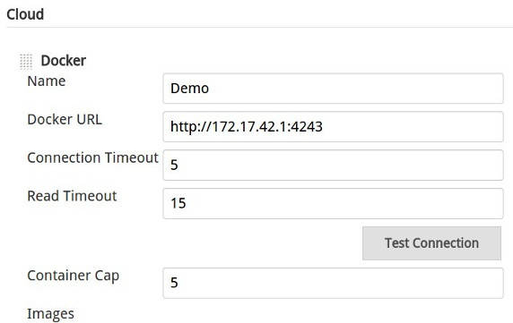

接下来，添加 Docker 镜像。

##### 图 10\. Docker 镜像配置

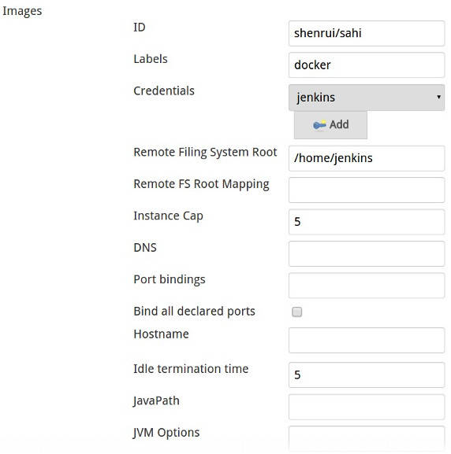

建议将 Jenkins Slave 的 workspace 目录映射到 Docker 主机的一个文件夹，这样 workspace 的内容才能持久保存，并且从 Subversion 或者其他版本控制软件更新代码的时候才会以增量方式更新。在该实例中，配置如下。

##### 图 11\. Docker 镜像 Volumes 配置

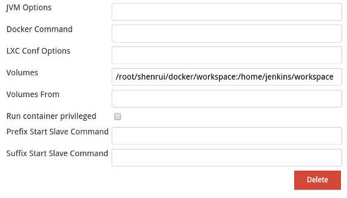

同之前在启动 Jenkins 容器部分讲到的一样，必须修改主机上的目录的权限，以确保容器能够对其读写。

现在，可以创建 Jenkins Job 了。

##### 图 12\. Job 配置 – Docker 容器部分

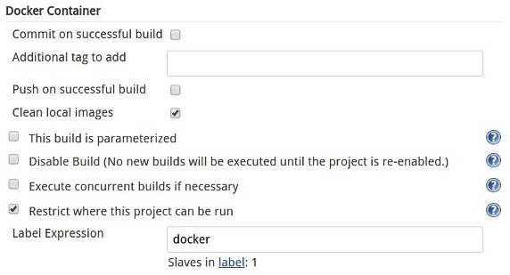

此时，Job 配置的页面里比之前增加了一个 Docker Container 的部分。在 Label Expression 里输入 “docker” 与之前定义的 shenrui/sahi 镜像绑定 (该输入域的值与镜像配置里的 Labels 输入域值相同)。

Source Code Management 部分，选择 Subversion，并填入之前在 Subversion 容器上创建的资源库 URL。

##### 图 13\. Job 配置 – 源代码管理部分

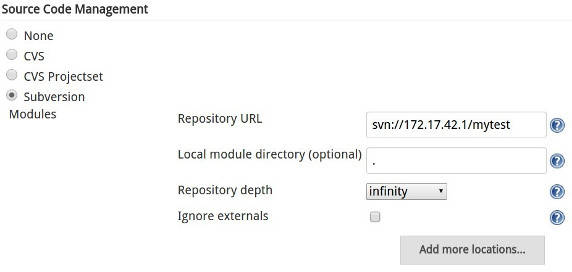

Build 部分直接运行 run\_tests.sh。

##### 图 14\. Job 配置 – 构建部分

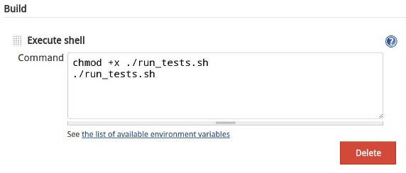

Post-build Actions 部分将 Sahi 测试脚本运行后生成的 JUnit 报表和 HTML 报表发布。

##### 图 15\. Job 配置 – 构建后操作部分

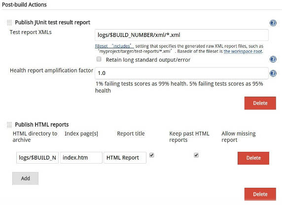

保存之后，我们就可以开始运行测试了。

## 运行测试

Job 启动后，Docker 插件在 Docker 上启动一个 shenrui/sahi 容器，并调用 [SSH Slaves 插件](https://wiki.jenkins-ci.org/display/JENKINS/SSH+Slaves+plugin) 将 slaves.jar 拷贝到容器上并启动，接着就依次运行 Job 里配置的构建步骤。

##### 图 16\. Job 运行

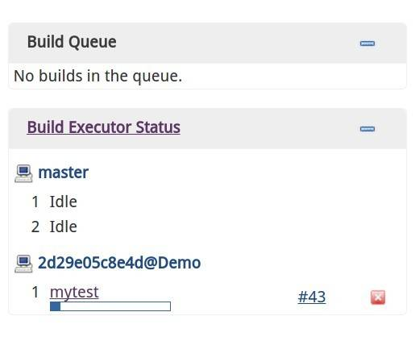

Job 运行结束后生成的 JUnit 报表和 Sahi 的 HTML 报表如下图。

##### 图 17\. 运行结果 – JUnit 报表

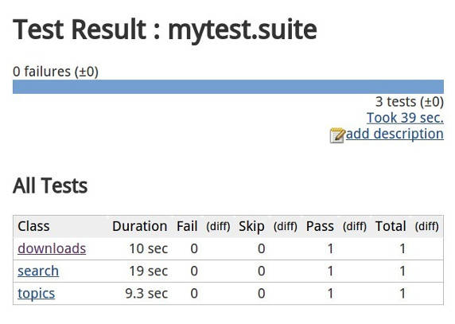

##### 图 18\. 运行结果 – HTML 报表

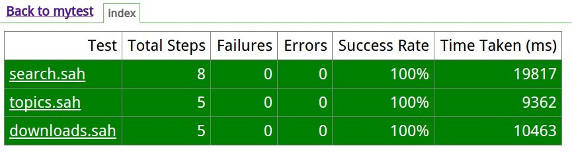

点击每个测试用例的链接可以显示更为详细的测试步骤，结果以及错误信息。

##### 图 19\. 运行结果 – HTML 报表详情{: \#图-19-运行结果-–-html-报表详情}

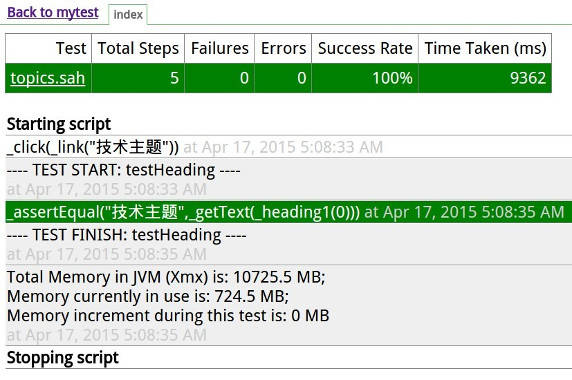

## 结束语

本文通过一个实例演示了配置 Sahi+Jenkins+Docker 的 Web UI 自动化测试环境的过程。Sahi 的 Docker 镜像读者可以直接从 Docker Hub 拉取使用。该实例仅以演示为目的，因此设计的比较简单，实际的项目情形要比这复杂得多，读者朋友（包括作者本人）都还要不断地的摸索和学习。希望本文对读者们能有所帮助。