# 构建基于 OpenShift 面向生产的分布式消息和数据流平台
ActiveMQ 和 Kafka 在 OpenShift 上的实现

**标签:** Apache Kafka,云计算,消息传递

[原文链接](https://developer.ibm.com/zh/articles/cl-lo-building-distributed-message-platform-based-on-openshift/)

魏 新宇

发布: 2019-08-28

* * *

## 前言

随着容器和 Kubernetes 的兴起，微服务逐渐受到很多企业客户的关注。与此同时，微服务之间的通信也成为了企业必要考虑的问题。本文将着重分析 ActiveMQ 和 Kafka 这两款优秀的消息中间件的架构以及在 OpenShift 上的实现。在正式介绍之前，我们先简单介绍服务之间的通信机制。

## 服务之间的通信

### 通信方式的划分

服务之间的通信遵循 IPC 标准（Inter-Process Communication，进程间通信）。它们之间的通信方式，可以按照以下两个维度进行分析：

- 同步通信或异步通信
- 一对一通信或一对多通信

服务之间同步通信，可以采取基于 gRPC 的方式或 http 的 Rest 方式，如下图 1 所示。在 Rest 方式中，调用 http 的方法进行同步访问，如：GET、POST、PUT、DELETE。

服务之间异步通信，需要借助于标准消息队列或数据流平台。

##### 图 1\. 服务之间通信

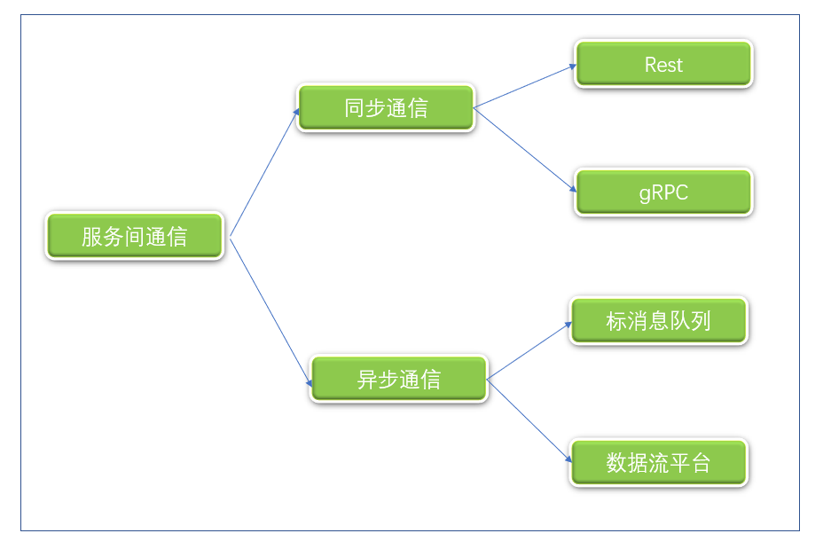

从同步或异步方式分析了服务之间的通信方式后，我们从另外一个维度来看服务间的通信，即一对一或一对多，如下图 2 所示：

##### 图 2\. 服务之间通信

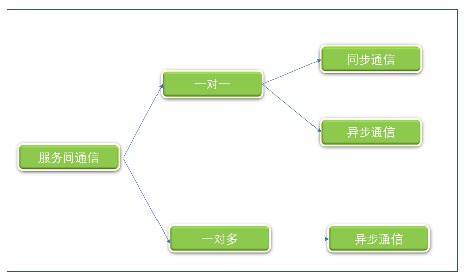

程序之间一对一通信的情况下，有同步和异步两种通信方式：

- 同步通信时：一个客户端向服务器端发起请求，等待响应，这也是阻塞模式。可通过上文提到的 Rest 或 gRPC 方式实现。
- 异步通信：客户端请求发送到服务端，但是并不强制需要服务端立即响应，服务端对请求可以进行异步响应。一对一的异步通信主要通过消息队列（Queue）实现。

程序之间一对多的通信，只有异步通信的方式，主要通过发布/订阅模式实现。即：客户端发布通知消息，被一个或者多个相关联（订阅了主题）的服务消费。

接下来，我们介绍服务之间异步通信的实现方式。

### 异步通信实现

在一个分布式系统中，服务之间相互异步通信最常见的方式是发送消息。我们把负责将发送方的正式消息传递协议转换为接收方的正式消息传递协议的工具叫做 Message Broker（消息代理）。市面上有不少 Message Broker 软件，如 ActiveMQ、RabbitMQ、Kafka 等。

服务之间消息传递主要有两种模式：队列（Queue）和主题（Topic）。

- Queue 模式是一种一对一的传输模式。在这种模式下，消息的生产者（Producer）将消息传递的目的地类型是 Queue。Queue 中一条消息只能传递给一个消费者（Consumer），如果没有消费者在监听队列，消息将会一直保留在队列中，直至消息消费者连接到队列为止，消费者会从队列中请求获得消息。
- Topic 是一种一对多的消息传输模式。在这种模式下，消息的生产者（Producer）将消息传递的目的地类型是 Topic。消息到达 Topic 后，消息服务器将消息发送至所有订阅此主题的消费者。

### 消息的分类

严格意义上讲，服务之间发送的消息通常有三种：普通 Messages（消息）、Events（事件）、Commands（命令），如下图 3 所示：

##### 图 3\. 消息的分类

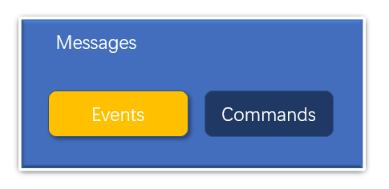

Messages 是服务之间沟通的基本单位，消息可以是 ID、字符串、对象、命令、事件等。消息是通用的，它没有特殊意图，也没有特殊的目的和含义。也正是由于这个原因，Events 和 Commands 才应运而生。

Events 是一种 Messages，它的目的是向监听者（Listeners）通知发生了什么事情。Events 由 Producer 发送，Producer 不关心 Events 的 Consumers，如下图 4 所示。

##### 图 4\. Event 的传递

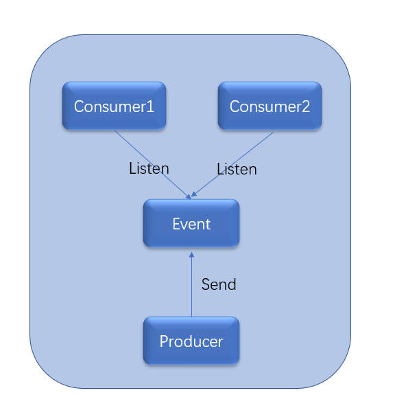

举例说明：有一个电商系统，当消费者下订单时电商平台会发布 OrderSubmittedEvent，以通知其他系统（例如物流系统）新订单的信息。此时，电商平台作为 Event 的 Producer，并不关心 Event 的 Consumer。只有订阅了此 Topic 的消费者才能获取到这个 OrderSubmittedEvent。

Commands 是 Producer 给 Consumer 发送的一对一的指令。Producer 会将 Command 发送到消息队列，然后 Consumer 主动从队列获取 Commands。与 Events 不同，Commands 触发将要发生的事情，如下图 5 所示：

##### 图 5\. Command 的传递

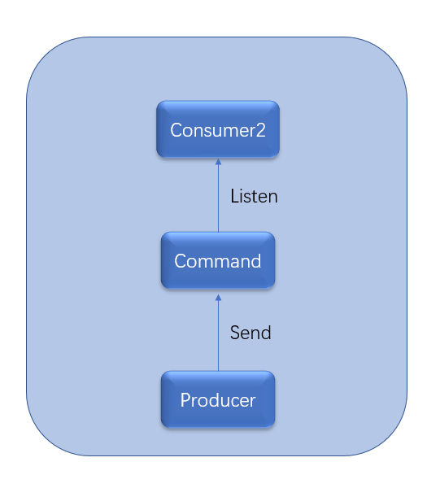

举例说明 Events：在电商系统中客户下订单后，电商将 BillCustomerCommand 命令发送到计费系统以触发发送发票动作。

在介绍了服务之间的异步通信实现和消息的分类后，我们接下来介绍一种消息中间件 ActiveMQ。

## AMQ 在 OpenShift 上的企业级实现

在本小节中，我们先介绍标准消息中间件的规范，然后介绍 ActiveMQ 在 RHEL 操作系统和 OpenShift 上的企业级实现。

### 标准消息中间件规范

目前业内主要的异步消息传递协议有：

- Java 消息传递服务（Java Messaging Service (JMS)），它面向 Java 平台的标准消息传递 API。
- 面向流文本的消息传输协议（Streaming Text Oriented Messaging Protocol (STOMP)）： WebSocket 通信标准。
- 高级消息队列协议（Advanced Message Queueing Protocol (AMQP)）：独立于平台的底层消息传递协议，用于集成多平台应用程序。

- 消息队列遥测传输（Message Queueing Telemetry Transport (MQTT)）：为小型无声设备之间通过低带宽发送短消息而设计。使用 MQTT 可以管理 IOT 设备。


目前市面上消息中间件的种类很多，Apache ActiveMQ Artemis 是最流行的开源、基于 Java 的消息服务器。ActiveMQ Artemis 支持点对点的消息传递(Queue)和订阅/发布模式（Topic）。

ActiveMQ Artemis 支持标准 Java NIO（New I/O，同步非阻塞模式）和 Linux AIO 库（Asynchronous I/O，异步非阻塞 I/O 模型）。AMQ 支持多种协议，包括 MQTT、STOMP、AMQP 1.0、JMS 1.1 和 TCP。

红帽 JBoss AMQ 7 Broker 是基于 Apache ActiveMQ Artemis 项目的企业级消息中间件，在客户生产系统被大量使用。功能上 JBoss AMQ 7 Broker 与 Apache ActiveMQ Artemis 是一一对应的，其支持的协议如下图 6 所示。因为本文主要是面向生产环境的进行介绍，因此下文我们使用 JBoss AMQ 7 Broker 进行功能验证，部署过程不进行赘述。

##### 图 6\. AMQ 支持的协议

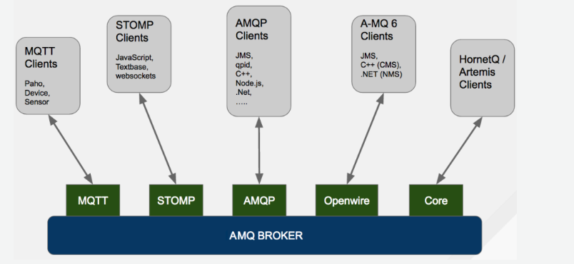

### 在 RHEL 中配置 AMQ7

接下来，我们在 RHEL 上配置 JBoss AMQ7。

首先创建目录：

```
$sudo mkdir -p /opt/install/amq7
$sudo chown -R jboss:jboss /opt/install/amq7

```

Show moreShow more icon

创建名为 broker0 的 JBoss AMQ Broker 实例，并指定 guest 用户和角色的凭据，执行结果如下图 7 所示：

```
$ ./bin/artemis create \
> --user jboss --password jboss --role amq --allow-anonymous \
> /opt/install/amq7/broker0

```

Show moreShow more icon

##### 图 7\. 创建 AMQ Broker

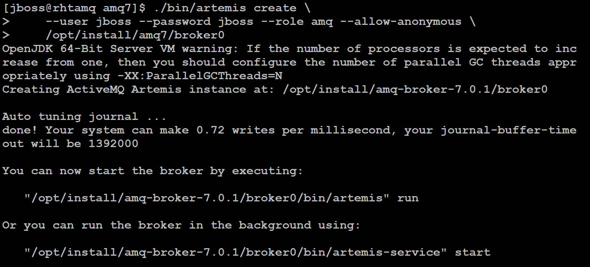

执行完上述所述命令后，RHEL 中/opt/install/amq7/broker0 目录中有一个 broker instance ，其中包含运行 JBoss AMQ 7 所需的库，配置和实用程序，如下图 8 所示：

##### 图 8\. AMQ Broker 目录结构

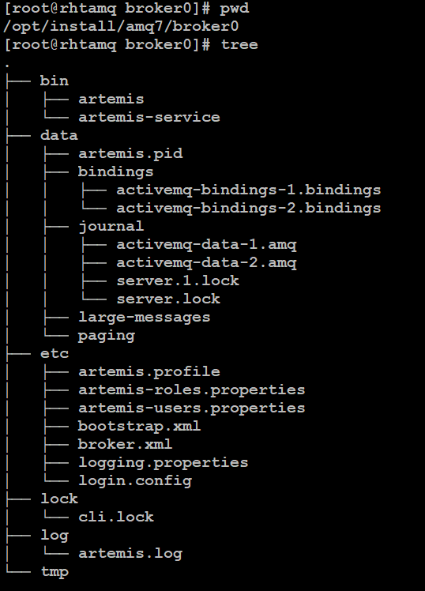

执行命令启动 broker0：

```
$ "/opt/install/amq7/broker0/bin/artemis-service" start
Starting artemis-service
artemis-service is now running (20240)

```

Show moreShow more icon

通过 ps 命令行确认 Broker 已经启动，如下图 9 所示：

##### 图 9\. 确认 Broker 已经启动

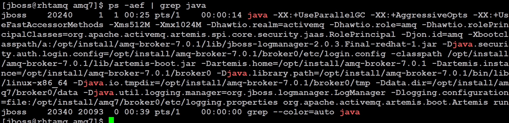

在上图的执行结果中，我们需要到如下参数：

- -Ddata.dir=/opt/install/amq7/broker0/data，这是 Broker 文件系统的绝对路径。
- -Xms512M -Xmx1024M 表示确定为 Broker 分配的内存的最小值和最大值。

### 查看 AMQ 的多协议支持

AMQ Broker 默认启动多种协议侦听与其通信的客户端连接（CORE、MQTT、AMQP、STOMP、HORNETQ 和 OPENWIRE）。

首先查看系统的 Java 监听端口，如下图 10 所示：

##### 图 10\. 查看 AMQ 的监听端口

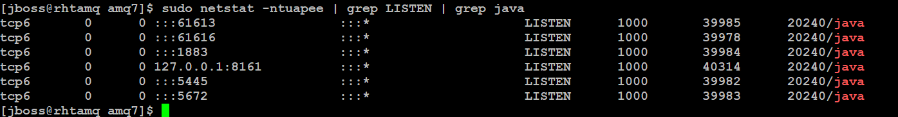

从上图可以看出，Broker 正在监听如下端口：61613、61616、1883、8161、5445 和 5672。

通过查看 Broker 日志文件，确认每个端口侦听对应的协议。例如 AMQP 的监听端口是 5672，如清单 1 所示：

##### 清单 1\. 查看 AMQ 日志

```
$ cat /opt/install/amq7/broker0/log/artemis.log
00:25:40,638 INFO  [org.apache.activemq.artemis.core.server] AMQ221020: Started EPOLL Acceptor at 0.0.0.0:61616 for protocols [CORE,MQTT,AMQP,STOMP,HORNETQ,OPENWIRE]
00:25:40,640 INFO  [org.apache.activemq.artemis.core.server] AMQ221020: Started EPOLL Acceptor at 0.0.0.0:5445 for protocols [HORNETQ,STOMP]
00:25:40,664 INFO  [org.apache.activemq.artemis.core.server] AMQ221020: Started EPOLL Acceptor at 0.0.0.0:5672 for protocols [AMQP]
00:25:40,666 INFO  [org.apache.activemq.artemis.core.server] AMQ221020: Started EPOLL Acceptor at 0.0.0.0:1883 for protocols [MQTT]
00:25:40,668 INFO  [org.apache.activemq.artemis.core.server] AMQ221020: Started EPOLL Acceptor at 0.0.0.0:61613 for protocols [STOMP]
00:25:40,671 INFO  [org.apache.activemq.artemis.core.server] AMQ221007: Server is now live
00:25:40,672 INFO  [org.apache.activemq.artemis.core.server] AMQ221001: Apache ActiveMQ Artemis Message Broker version 2.0.0.amq-700008-redhat-2 [0.0.0.0, nodeID=3b75e2e5-c170-11e9-a53c-080027f33d64]

```

Show moreShow more icon

### 创建持久队列

接下来，使用 JBoss AMQ 7 提供的 artemis 建持久的消息传递地址和队列。

如前文所述：AMQ 支持队列和主题模式。JBOSS AMQ7 中的 Topic 是用 Queue 实现的。在创建 Queue 时通过可以指定参数实现。Multicast 方式是 Topic，Anycast 就是 Queue。

创建名为 DavidAddress 的 Anycast 地址，执行结果如下图 11 所示：

```
$ ./bin/artemis address create --name DavidAddress --anycast --no-multicast

```

Show moreShow more icon

##### 图 11\. 创建 AMQ Anycast 消息队列

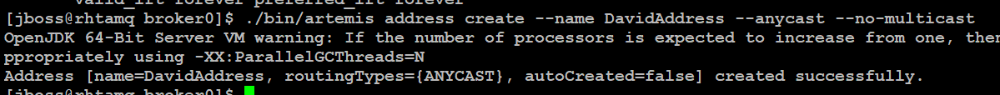

接下来，创建持久的 Anycast 队列与此前创建的 Anycast 地址相关联：

```
$ ./bin/artemis queue create --name gpteQueue --address DavidAddress --anycast --durable
        --purge-on-no-consumers --auto-create-address

```

Show moreShow more icon

Queue 创建成功以后，可以在 AMQ7 管理控制台中查看新创建的 Address 和 Queue，如下图 12 所示：

##### 图 12\. AMQ Console 查看消息队列


截止到目前，我们已经创建了消息地址和队列。我们关注队列的几个数值。

- Consumer Count：访问此队列 Consumer 的数量
- Message Count：队列中的消息数。
- Messages Acknowledged：队列中的消耗的消息数。
- Messages Added：队列中被添加消息数。

目前这几个数值均为零，如下图 13 所示：

##### 图 13\. AMQ Console 查看消息队列

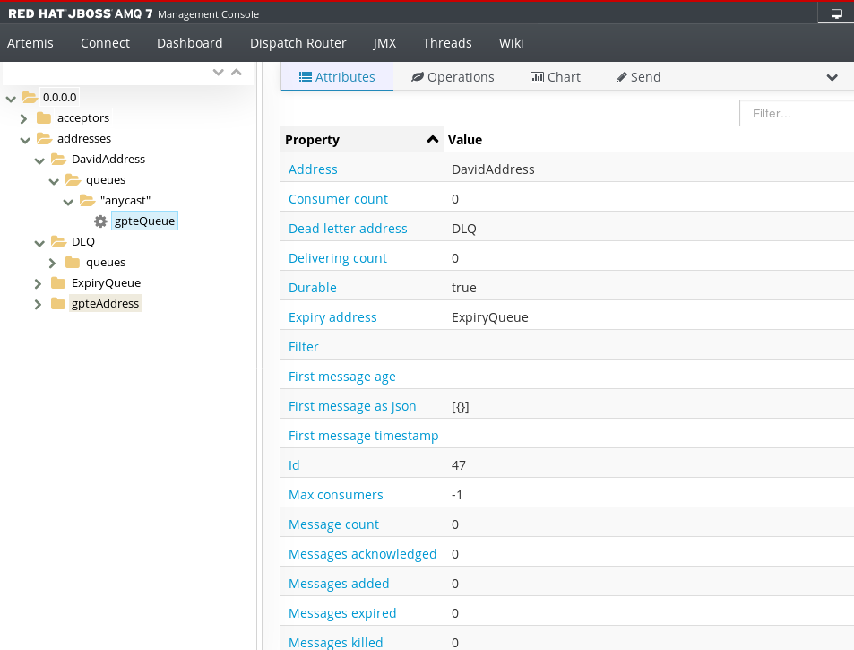

接下来，使用 artemis 创建两个并行线程，向消息队列发送总共 20 个 10 字节消息，每条消息之间有一秒休眠，执行结果如下图 14 所示:

```
$./bin/artemis producer --destination gpteAddress --message-count 10 --message-size 10
--sleep 1000 --threads 2 --url tcp://localhost:61616

```

Show moreShow more icon

##### 图 14\. 向队列发送 20 条消息

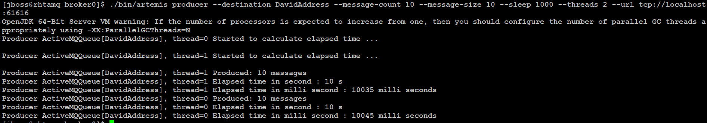

启动两个 Consumer，第一个 Consumer 读取队列中一条消息，第二个 Consumer 读取队列中其余的消息，执行结果如下图 15 所示：

启动第一个 Consumer，执行结果如下图所示，获取到一条消息后 Consumer 程序退出。

```
$ ./bin/artemis consumer --destination gpteQueue --url tcp://localhost:61616
--message-count 1

```

Show moreShow more icon

##### 图 15\. 启动第一个 Consumer


启动第二个 Consumer，执行结果如下图 16 所示，获取到 19 条消息后 Consumer 程序退出。

```
$ ./bin/artemis consumer --destination gpteQueue --url tcp://localhost:61616

```

Show moreShow more icon

##### 图 16\. 启动第二个 Consumer

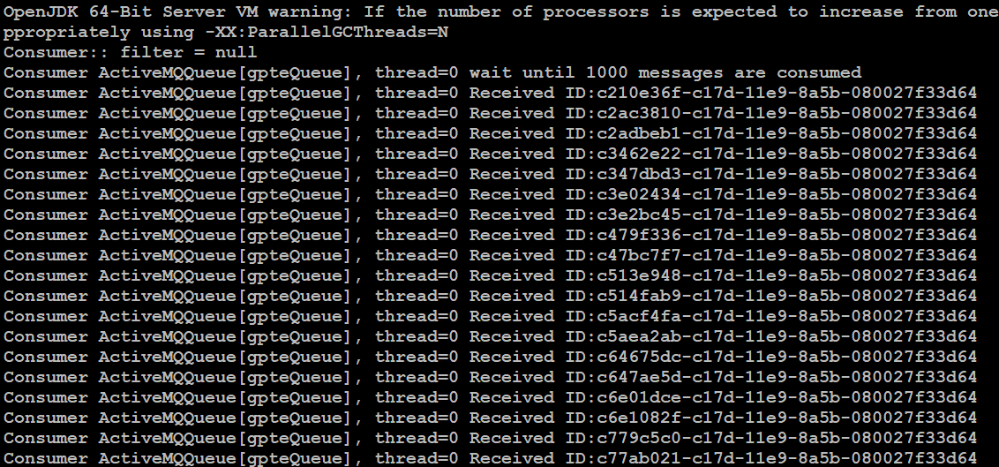

我们再次查看 AMQ Console，如下图 17 所示：

- Consumer Count: 访问此队列 Consumer 的数量，数值为 2；
- Message Count：队列中的消息数，数值为 0，因为消息已经被读取；
- Messages Acknowledged：队列中的消耗的消息数，数值为 20，队列中被消耗了 20 条消息；
- Messages Added：队列中被添加消息数，数值为 20，队列中被发送了 20 条消息。

##### 图 17\. AMQ Console 查看消息队列

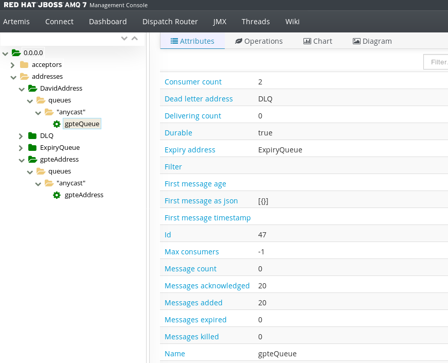

从 AMQ Console 我们得到的反馈结果，符合我们的预期。

### AMQ 在 OpenShift 上的部署

在 OpenShift 上我们可以直接用现成的模板部署 AMQ7。针对生产环境我们需要注意以下三点：

1. AMQ HA 的实现

    在 OpenShift 中，AMQ 的高可用是通过对一个 AMQ 创建多个 pod 来实现的，而无需通过 AMQ 本身的 HA 机制。当 AMQ 的一个 pod 出现问题，OpenShift 的 scaledown controller 可以实现 AMQ 的 HA。

    在 OpenShift 中，StatefulSet 用于保证有状态应用。当 StatefulSet 发生 scaled down，有状态 pod 实例时会被删除，与被删除 pod 关联的 PersistentVolumeClaim 和 PersistentVolume 将保持不变。当 pod 新创建以后，PVC 会被重新挂在到 Pod 中，之前的数据可以访问。

    但如果 AMQ 使用 Queue sharding，StatefulSet 的这种方式就不太合适。使用 sharding 的应用，当出现应用实例减少时，会要求将数据重新分发到剩余的应用程序实例上，而不是一直等待故障 pod 的重启。这种情况下就需要用到 StatefulSet Scale-Down Controller。StatefulSet Scale-Down Controller 允许我们在 StatefulSet 规范中指定 cleanup pod 的 template，该模板将用于创建一个新的 cleanup pod，该 cleanup pod 将挂在被删除的 pod 释放的 PersistentVolumeClain。cleanup pod 可以访问已删除的 pod 实例的数据，并且可以执行 app 所需的任何操作。cleanup pod 完成任务后，控制器将删除 pod 和 PersistentVolumeClaim，释放 PersistentVolume。

2. AMQ 的访问方式

如果访问 AMQ 的客户端在 OpenShift 内部，那么使用 AMQ 的 Service IP 和端口号即可。如果访问 AMQ 的客户端在 OpenShift 外部，则需要考虑使用 NodePort 的方式。

### 在 OpenShift 上部署一个 AMQ 单实例

首先，我们先基于一个基础模板部署一个单实例的 AMQ。这种部署方式适合于测试环境。

使用模板创建 AMQ：

```
# oc new-app --template=amq-broker-72-basic -e
AMQ_PROTOCOL=openwire,amqp,stomp,mqtt,hornetq -e AMQ_QUEUES=demoQueue -e
AMQ_ADDRESSES=demoTopic -e AMQ_USER=amq-demo-user -e ADMIN_PASSWORD=password

```

Show moreShow more icon

查看 pod，AMQ Broker 已经创建成功：

```
[root@workstation-46de ~]# oc get pods
NAME READY STATUS RESTARTS AGE
broker-amq-1-94zkz 1/1 Running 0 4m

```

Show moreShow more icon

登陆 AMQ pod，通过 Producer 向队列中发送消息，可以成功，如清单 2 所示：

##### 清单 2\. 向队列发送消息

```
# oc rsh broker-amq-1-94zkz
sh-4.2$  ./broker/bin/artemis producer
OpenJDK 64-Bit Server VM warning: If the number of processors is expected to increase from one, then you should configure the number of parallel GC threads appropriately using -XX:ParallelGCThreads=N
Producer ActiveMQQueue[TEST], thread=0 Started to calculate elapsed time ...

Producer ActiveMQQueue[TEST], thread=0 Produced: 1000 messages
Producer ActiveMQQueue[TEST], thread=0 Elapsed time in second : 2 s
Producer ActiveMQQueue[TEST], thread=0 Elapsed time in milli second : 2072 milli seconds

```

Show moreShow more icon

AMQ Console 用于图形化管理。我们为 AMQ Console 在 OpenShift 中创建路由，首先创建路配置文件，如清单 3 所示：

##### 清单 3\. AMQ Console 路由配置文件

```
# cat console.yaml
apiVersion: v1
kind: Route
metadata:
labels:
    app: broker-amq
    application: broker-amq
name: console-jolokia
spec:
port:
    targetPort: console-jolokia
to:
    kind: Service
    name: broker-amq-headless
    weight: 100
wildcardPolicy: Subdomain
host: star.broker-amq-headless.amq-demo.svc

```

Show moreShow more icon

应用配置如下：

```
[root@workstation-46de ~]# oc apply -f console.yaml
route.route.openshift.io/console-jolokia created

```

Show moreShow more icon

查看新创建的 Console 路由：

```
# oc get route
NAME HOST/PORT PATH SERVICES PORT TERMINATION WILDCARD
amq console-amq-demo.apps-46de.generic.opentlc.com broker-amq-amqp <all> passthrough
None

```

Show moreShow more icon

通过浏览器可以访问 Console，如下图 18 所示：

##### 图 18\. AMQ Console 查看消息队列

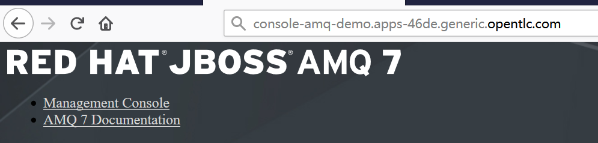

### 在 OpenShift 上部署 AMQ Cluster

OpenShift 提供面向生产的 AMQ Cluster 部署模板，这个模板创建的 AMQ 包含持久化存储：

查看 [模板](https://raw.githubusercontent.com/jboss-container-images/jboss-amq-7-broker-openshift-image/72-1.2.GA/templates/amq-broker-72-persistence-clustered.yaml) ：

```
# oc get template
      NAME DESCRIPTION PARAMETERS OBJECTS
      amq-broker-72-persistence-clustered Application template for Red Hat AMQ brokers. This
        template doesn't feature S... 21 (6 blank) 6

```

Show moreShow more icon

接下来，通过命令行或者 OpenShift UI 界面，使用模板创建 AMQ 集群。以使用 OpenShift UI 为例如下图 19 所示：

##### 图 19\. 选择 AMQ Cluster 模板

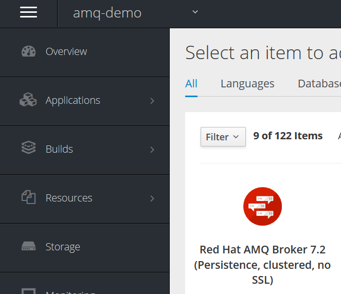

填写 AMQ 集群相应的参数，如下图 20 所示：

##### 图 20\. 输入 AMQ 集群参数

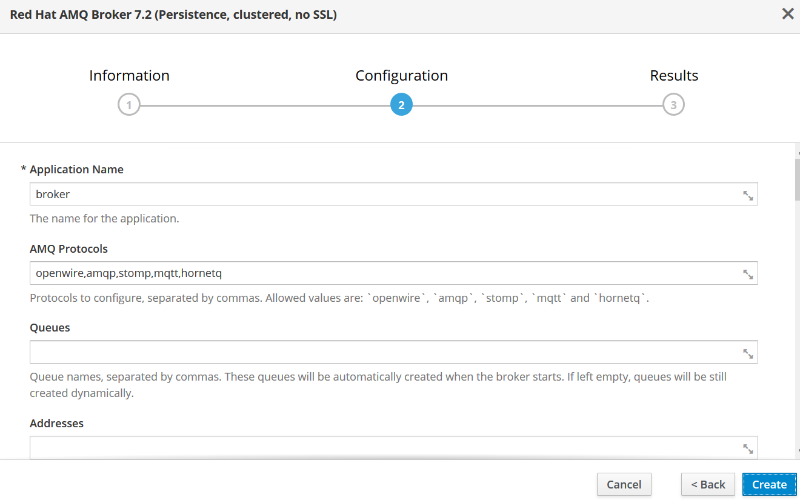

部署成功以后，将 AMQ 的 statefulset 增加到 3 个，设置完成后，OpenShift 中会部署 3 个 AMQ Broker 的 pod，如下图 21 所示：

```
# oc scale statefulset broker-amq --replicas=3
statefulset.apps/broker-amq scaled

```

Show moreShow more icon

##### 图 21\. 查看 AMQ Pod

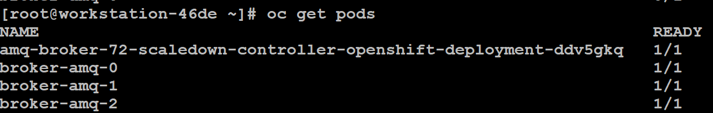

为了让 AMQ 集群能够被外部客户端访问，我们为 AMQ Broker 配置 NodePort。配置文件如清单 4 所示：

##### 清单 4\. AMQ Console 路由配置文件

```
# cat port.yaml
apiVersion: v1
kind: Service
metadata:
annotations:
    description: The broker's OpenWire port.
    service.alpha.openshift.io/dependencies: >-
      [{"name": "broker-amq-amqp", "kind": "Service"},{"name":
      "broker-amq-mqtt", "kind": "Service"},{"name": "broker-amq-stomp", "kind":
      "Service"}]
creationTimestamp: '2018-08-29T14:46:33Z'
labels:
    application: broker
    template: amq-broker-72-statefulset-clustered
    xpaas: 1.4.12
name: broker-external-tcp
namespace: amq-demo
resourceVersion: '2450312'
selfLink: /api/v1/namespaces/amq-demo/services/broker-amq-tcp
uid: 52631fa0-ab9a-11e8-9380-c280f77be0d0
spec:
externalTrafficPolicy: Cluster
ports:
   -  nodePort: 30001
      port: 61616
      protocol: TCP
      targetPort: 61616
selector:
    deploymentConfig: broker-amq
sessionAffinity: None
type: NodePort
status:
loadBalancer: {}

```

Show moreShow more icon

应用配置文件：

```
# oc apply -f port.yaml
service/broker-external-tcp created

```

Show moreShow more icon

在 AMQ 的 pod 中发起 Producer，向 demoQueue 中发送消息：

```
artemis producer --url tcp:// 129.146.152.123:30001 --message-count 300 --destination
queue://demoQueue

```

Show moreShow more icon

客户端启动 Consumer，连接 demoQueue，可以读取到消息。如清单 5 所示。

##### 清单 5\. Consumer 读取消息队列信息

```
#./artemis consumer --url tcp://129.146.152.123:30001 --message-count 100 --destination queue://demoQueue
Consumer:: filter = null
Consumer ActiveMQQueue[demoQueue], thread=0 wait until 100 messages are consumed
Consumer ActiveMQQueue[demoQueue], thread=0 Consumed: 100 messages
Consumer ActiveMQQueue[demoQueue], thread=0 Consumer thread finished

```

Show moreShow more icon

至此，ActiveMQ 在 OpenShift 上成功实现。

接下来，我们介绍 Kafka 的架构以及在 OpenShift 上的实现。

### 从分布式消息平台到数据流平台

在本小节中，我们主要介绍了 ActiveMQ 的架构以及其在 OpenShift 上的实现。我们知道，传统的应用大多使用 Java EE 架构。这种框架下开发的应用之间的异步通信大多采用 JMS 的方式、以一对一通信为主，因此使用 ActiveMQ Queue 的方式被大量使用。

随着微服务的兴起，一个单体应用被拆分成多个微服务、服务之间的调用骤然增多、服务之间交换的信息量也迅速增加，要求的吞吐量比传统模式下高的多。例如，在常见的日志收集系统 EFK 中，Fluentd 作为数据收集器会收集多个对象（如操作系统、容器等）的大量日志，然后然后将数据传递到 Elasticsearch 集群。多个 Fluentd 收集的大量日志，在向 Elasticsearch 传递时往往就会造成大量阻塞，这时我们使用 ActiveMQ 的消息队列就不是很合适，就需要使用到数据流平台。而在数据流平台中，Kafka 是性能很高、被大量使用的一个开源解决方案。

## Kafka 在 OpenShift 上的实现

### Kafka 的基本概念

Kafka 是一个分布式数据流平台，开发它的目的是使微服务和其他应用程序组件尽可能快地交换大量数据，以进行实时事件处理。

Kafka 是提供了发布/订阅功能的分布式数据流平台。它适用于两类应用：

- 构建实时流式数据管道，在系统或应用程序之间可靠地获取数据
- 构建对数据流进行转换或响应的实时流应用程序

Kafka 有四个核心 API，他们的作用如下：

- Producer API：应用将记录流发布到一个或多个 Topic 上。
- Consumer API：应用订阅一个或多个 Topic 并处理生成的记录流。
- Streams API：应用程序充当流处理器，消耗来自一个或多个 Topic 的输入流并生成到一个或多个输出 Topic 的输出流，从而有效地将输入流转换为输出流。
- Connector API：允许将 Kafka Topic 连接到现有应用程序或数据系统的、可重用 Producer 或 Consumer。例如，关系数据库的 Connector 可以捕获对表的每个更改。

Kafka 中每个 topic 可以有一个或多个 partition（分区）。不同的分区对应着不同的数据文件，不同的数据文件可以存放到不同的节点上，以实现数据的高可用。此外，Kafka 使用分区支持物理上的并发写入和读取，从而大大提高了吞吐量，如下图 22 所示：

##### 图 22\. Kafka 的 partition

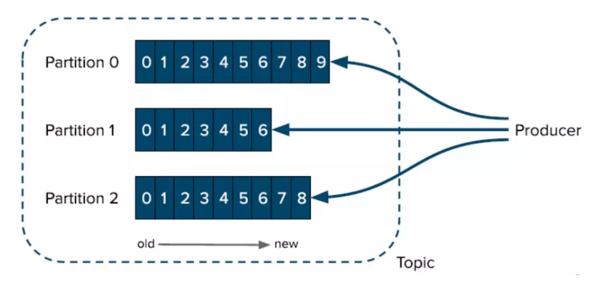

### Kafka 集群在 OpenShift 集群上的实现方式

随着越来越多的应用程序部署到 OpenShift 上，Kafka 集群运行 OpenShift 的场景也越来越多。将 Kafka 部署到 OpenShift 集群上主要有如下两个好处：

- 可以为 event-driven microservices 提供服务
- 可以利用到 OpenShift 平台的功能，如弹性伸缩、高可用等。

Topic 是本身无状态的，但 Kafka 作为分布式数据流平台，需要实现状态保持。因此需要实现以下几点：

- Kafka 集群中多个 Broker 之间的通信
- Broker 的状态持久化（即消息）
- Broker 出现问题后可以快速恢复

原生 Kubernetes 实现 Kafka 的有状态化较为繁琐，需要使用 Stateful Sets 和 Persistent Volumes。在 OpenShift 中可以通过 Operator 来方便地管理 Kafka 集群，实现状态化。

OpenShift 通过 Operator 管理 Kafka 集群会用到 Strimzi。Strimzi 是一个开源项目，它为在 Kubernetes 和 OpenShift 上运行 Kafka 提供了 Container Image 和 Operator。

Kafka 使用 Zookeeper：

- 对管理 Kafka Broker 和 Topic Partition 的 Leader 选举。
- 管理构成集群的 Kafka Brokers 服务发现。
- 将拓扑更改发送到 Kafka，因此集群中的每个节点都知道新 Broker 何时加入、退出；Topic 被删除或被添加等。

如下图 23 所示：

##### 图 23\. 在 OpenShift 集群上实现 Kafka 集群

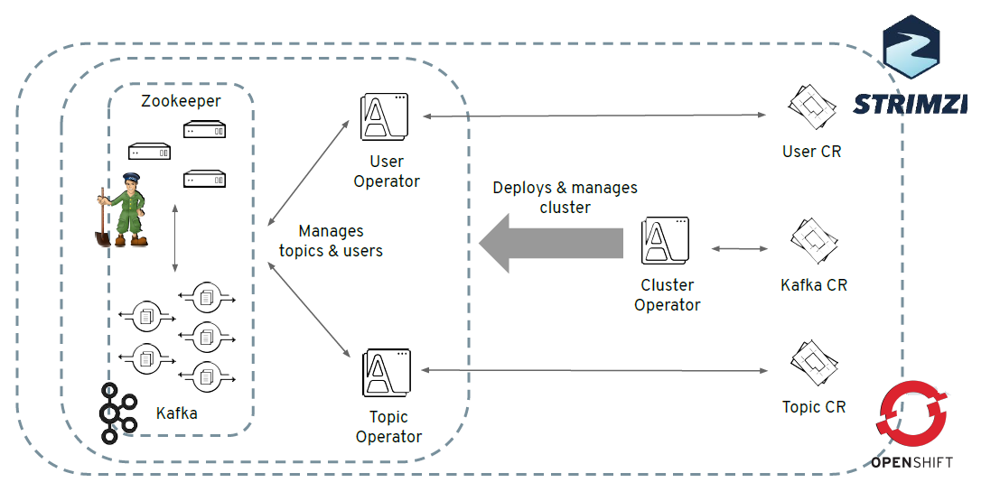

一个 Kafka 集群可以配置很多个 Broker。生产环境中，至少部署 3 个 Broker。接下来，我们展示在 OpenShift 上部署 Kafka 集群。

### 在 OpenShift 上部署 Kafka 集群

首先下载 Kafka 在 OpenShift 上的 [安装文件](https://access.redhat.com/node/3596931/423/1) ，解压缩后如下图 24、25 所示：

##### 图 24\. Kafka 安装包


##### 图 25\. Kafka 安装包

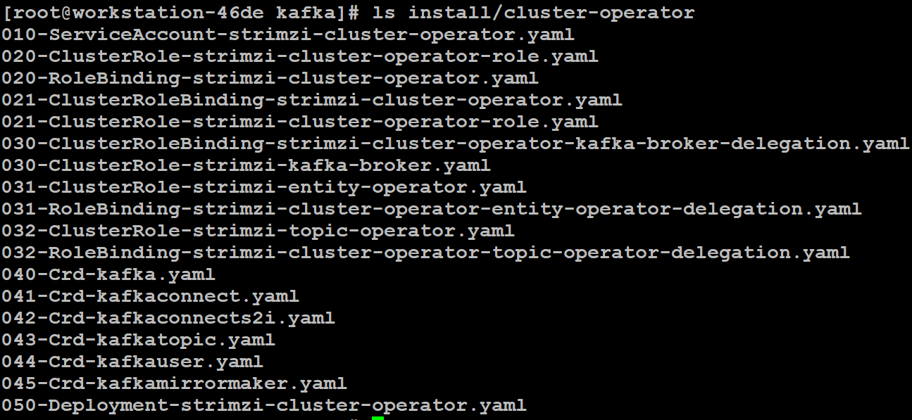

由于篇幅有限，我们不会详细介绍配置文件的内容。这些配置文件是在 OpenShift 集群上设置 AMQ Streams 所需的完整资源集合。文件包括：

- Service Account
- cluster roles and and bindings
- 一组 CRD（自定义资源定义），用于 AMQ Streams 集群 Operators 管理的对象
- Operator 的 Deployment

在安装集群 Operator 之前，我们需要配置它运行的 Namespace。我们将通过修改 RoleBinding.yaml 文件以指向新创建的项目 amq-streams 来完成此操作。只需通过 sed 编辑所有文件即可完成此操作。

```
[root@workstation-46de kafka]# sed -i 's/namespace: .*/namespace: amq-streams/'
        install/cluster-operator/*RoleBinding*.yaml

```

Show moreShow more icon

确认更改生效，如清单 6 所示：

##### 清单 6\. Consumer 读取消息队列信息

```
# more install/cluster-operator/020-RoleBinding-strimzi-cluster-operator.yaml
apiVersion: rbac.authorization.k8s.io/v1beta1
kind: RoleBinding
metadata:
name: strimzi-cluster-operator
labels:
    app: strimzi
subjects:
- kind: ServiceAccount
name: strimzi-cluster-operator
namespace: amq-streams
roleRef:
kind: ClusterRole
name: strimzi-cluster-operator-namespaced
apiGroup: rbac.authorization.k8s.io

```

Show moreShow more icon

接下来，部署 Kafka Operator，执行结果如下图 26 所示：

```
# oc new-project amq-demo
# oc apply -f install/cluster-operator

```

Show moreShow more icon

##### 图 26\. 部署 Kafka Operator

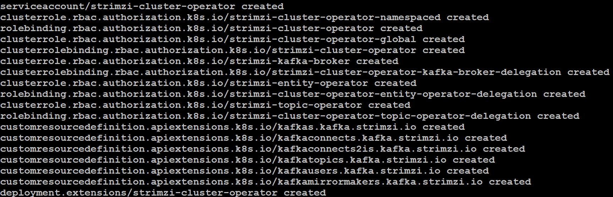

查看部署结果，如下图 27 所示：

##### 图 27\. 确认部署 Kafka Operator 部署成功

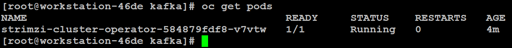

我们通过配置文件部署 Kafka 集群，如清单所示。

配置文件中包含如下设置：

- 3 个 Kafka broker- 这是生产部署的最小建议数值
- 3 ZooKeeper 节点 – 这是生产部署的最小建议数量
- 持久声明存储，确保将持久卷分配给 Kafka 和 ZooKeeper 实例

##### 清单 7\. Kafka 集群配置

```
# cat production-ready.yaml
apiVersion: kafka.strimzi.io/v1alpha1
kind: Kafka
metadata:
name: production-ready
spec:
kafka:
    replicas: 3
    listeners:
      plain: {}
      tls: {}
    config:
      offsets.topic.replication.factor: 3
      transaction.state.log.replication.factor: 3
      transaction.state.log.min.isr: 2
    storage:
      type: persistent-claim
      size: 3Gi
      deleteClaim: false
zookeeper:
    replicas: 3
    storage:
      type: persistent-claim
      size: 1Gi
      deleteClaim: false
entityOperator:
    topicOperator: {}
    userOperator: {}

```

Show moreShow more icon

应用配置，查看部署结果如下图 28 所示：

```
# oc apply -f production-ready.yaml
kafka.kafka.strimzi.io/production-ready created

```

Show moreShow more icon

##### 图 28\. Kafka 集群部署成功

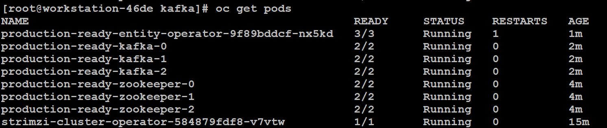

通过配置文件创建 Kafka Topic，配置文件如清单 8 所示：

##### 清单 8\. Topic 配置文件

```
# cat lines.yaml
apiVersion: kafka.strimzi.io/v1alpha1
kind: KafkaTopic
metadata:
name: lines
labels:
    strimzi.io/cluster: production-ready
spec:
partitions: 2
replicas: 2
config:
    retention.ms: 7200000
    segment.bytes: 1073741824

```

Show moreShow more icon

在上面的配置中：

- metadata.name，这是 topic 的名称
- metadata.labels [strimzi.io/cluster]是 topic 的目标集群
- spec.partitions 是 topic 的分区数
- spec.replicas，即每个分区的副本数
- spec.config 包含其他配置选项，例如保留时间和段大小

应用配置：

```
# oc apply -f lines.yaml
kafkatopic.kafka.strimzi.io/lines created

```

Show moreShow more icon

我们来获取 Topic 信息。

首先登陆 Kafka 的 pod，然后利用 kafka-topics.sh 脚本查看 Topic 的信息，如清单 9 所示，我们可以看到分区是两个：

##### 清单 9\. 查看 Topic 信息

```
# oc rsh production-ready-kafka-0
Defaulting container name to kafka.
Use 'oc describe pod/production-ready-kafka-0 -n amq-streams' to see all of the containers in this pod.

sh-4.2$ cat bin/kafka-topics.sh
#!/bin/bash
exec $(dirname $0)/kafka-run-class.sh kafka.admin.TopicCommand "$@"

sh-4.2$  bin/kafka-topics.sh --zookeeper localhost:2181 --topic lines –describe
OpenJDK 64-Bit Server VM warning: If the number of processors is expected to increase from one, then you should configure the number of parallel GC threads appropriately using -XX:ParallelGCThreads=N
Topic:lines     PartitionCount:2        ReplicationFactor:2     Configs:segment.bytes=1073741824,retention.ms=7200000
        Topic: lines    Partition: 0    Leader: 2       Replicas: 2,1   Isr: 2,1
        Topic: lines    Partition: 1    Leader: 0       Replicas: 0,2   Isr: 0,2

```

Show moreShow more icon

增加 Partition 数量，首先需要修改配置文件，如清单 10 所示

##### 清单 10\. 修改 Topic 配置文件

```
# cat lines-10.yaml
apiVersion: kafka.strimzi.io/v1alpha1
kind: KafkaTopic
metadata:
name: lines
labels:
    strimzi.io/cluster: production-ready
spec:
partitions: 10
replicas: 2
config:
    retention.ms: 14400000
segment.bytes: 1073741824

```

Show moreShow more icon

应用配置：

```
# oc apply -f lines-10.yaml
      kafkatopic.kafka.strimzi.io/lines configured

```

Show moreShow more icon

首先登陆 Kafka 的 pod，然后利用 kafka-topics.sh 脚本查看 Topic 的信息，分区数量已经从两个增加到了十个，如清单 11 所示

##### 清单 11\. 查看 Topic 信息

```
[root@workstation-46de kafka]# oc rsh production-ready-kafka-0
Defaulting container name to kafka.
Use 'oc describe pod/production-ready-kafka-0 -n amq-streams' to see all of the containers in this pod.
sh-4.2$ bin/kafka-topics.sh --zookeeper localhost:2181 --topic lines --describe
OpenJDK 64-Bit Server VM warning: If the number of processors is expected to increase from one, then you should configure the number of parallel GC threads appropriately using -XX:ParallelGCThreads=N
Topic:lines     PartitionCount:10       ReplicationFactor:2     Configs:segment.bytes=1073741824,retention.ms=14400000
        Topic: lines    Partition: 0    Leader: 2       Replicas: 2,1   Isr: 2,1
        Topic: lines    Partition: 1    Leader: 0       Replicas: 0,2   Isr: 0,2
        Topic: lines    Partition: 2    Leader: 1       Replicas: 1,2   Isr: 1,2
        Topic: lines    Partition: 3    Leader: 2       Replicas: 2,1   Isr: 2,1
        Topic: lines    Partition: 4    Leader: 0       Replicas: 0,2   Isr: 0,2
        Topic: lines    Partition: 5    Leader: 1       Replicas: 1,0   Isr: 1,0
        Topic: lines    Partition: 6    Leader: 2       Replicas: 2,0   Isr: 2,0
        Topic: lines    Partition: 7    Leader: 0       Replicas: 0,1   Isr: 0,1
        Topic: lines    Partition: 8    Leader: 1       Replicas: 1,2   Isr: 1,2
        Topic: lines    Partition: 9    Leader: 2       Replicas: 2,1   Isr: 2,1

```

Show moreShow more icon

接下来，通过 kafka-console-producer.sh 脚本启动 Producer，如清单所示：

##### 清单 12\. 启动 Producer

```
sh-4.2$ cat  bin/kafka-console-producer.sh
if [ "x$KAFKA_HEAP_OPTS" = "x" ]; then
    export KAFKA_HEAP_OPTS="-Xmx512M"
fi
exec $(dirname $0)/kafka-run-class.sh kafka.tools.ConsoleProducer "$@"

启动一个 Producer：
sh-4.2$  bin/kafka-console-producer.sh --broker-list localhost:9092 --topic test-topic
OpenJDK 64-Bit Server VM warning: If the number of processors is expected to increase from one, then you should configure the number of parallel GC threads appropriately using -XX:ParallelGCThreads=N
>

```

Show moreShow more icon

我们发送信息到到 Topic 中，第一次发送”david wei”，第二次发送”is doing the test!!!”如下图 29 所示：

##### 图 29\. 向 Topic 中发送信息

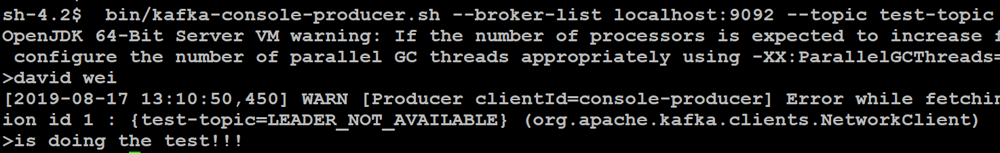

接下来，使用 kafka-console-consumer.sh 脚本启动 Consumer 监听 Topic，如清单 13 所示：

##### 清单 13 启动 Producer

```
sh-4.2$ cat bin/kafka-console-consumer.sh
if [ "x$KAFKA_HEAP_OPTS" = "x" ]; then
    export KAFKA_HEAP_OPTS="-Xmx512M"
fi

exec $(dirname $0)/kafka-run-class.sh kafka.tools.ConsoleConsumer "$@"

sh-4.2$ bin/kafka-console-consumer.sh --bootstrap-server localhost:9092 --topic test-topic --from-beginning

```

Show moreShow more icon

Consumer 可以读取到 Topic 中此前 Producer 发送的消息，如图 30 所示：

##### 图 30\. Consumer 读取 Topic 信息

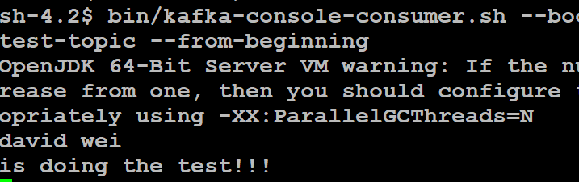

### 配置 Kafka 外部访问

在某些情况下，需要从外部访问部署在 OpenShift 中的 Kafka 群集。接下来我们介绍配置的方法。首先，使用包含外部 Listener 配置内容的文件重新部署 Kafka 集群，如清单 14 所示：

##### 清单 14\. Kafka 集群配置文件

```
[root@workstation-46de ~]# cat production-ready-external-routes.yaml
apiVersion: kafka.strimzi.io/v1alpha1
kind: Kafka
metadata:
name: production-ready
spec:
kafka:
    replicas: 3
    listeners:
      plain: {}
      tls: {}
      external:
        type: route
    config:
      offsets.topic.replication.factor: 3
      transaction.state.log.replication.factor: 3
      transaction.state.log.min.isr: 2
    storage:
      type: persistent-claim
      size: 3Gi
      deleteClaim: false
zookeeper:
    replicas: 3
    storage:
      type: persistent-claim
      size: 1Gi
      deleteClaim: false
entityOperator:
    topicOperator: {}
userOperator: {}

```

Show moreShow more icon

应用配置文件：

```
# oc apply -f production-ready-external-routes.yaml
kafka.kafka.strimzi.io/production-ready configured

```

Show moreShow more icon

应用配置文件以后，Operator 会对 Kafka 集群上启动滚动更新，逐个重新启动每个代理以更新其配置，如图 31 所示，以便在 OpenShift 中的每个 Broker 都有一个路由。

##### 图 31\. Kafka 集群滚动升级

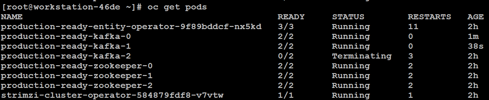

查看 Kafka Broker 的路由，如清单 15 所示：

##### 清单 15\. Kafka 集群路由

```
[root@workstation-46de ~]# oc get routes
NAME                               HOST/PORT                                                                    PATH      SERVICES                                    PORT      TERMINATION   WILDCARD
production-ready-kafka-0           production-ready-kafka-0-amq-streams.apps-46de.generic.opentlc.com                     production-ready-kafka-0                    9094      passthrough   None
production-ready-kafka-1           production-ready-kafka-1-amq-streams.apps-46de.generic.opentlc.com                     production-ready-kafka-1                    9094      passthrough   None
production-ready-kafka-2           production-ready-kafka-2-amq-streams.apps-46de.generic.opentlc.com                     production-ready-kafka-2                    9094      passthrough   None
production-ready-kafka-bootstrap   production-ready-kafka-bootstrap-amq-streams.apps-46de.generic.opentlc.com             production-ready-kafka-external-bootstrap   9094      passthrough   None

```

Show moreShow more icon

接下来，我们在 OpenShift 集群外部配置代理与 OpenShift 中的 Kafka 进行交互，外部客户端必须使用 TLS。首先，我们需要提取服务器的证书。

```
# oc extract secret/production-ready-cluster-ca-cert --keys=ca.crt --to=-
        >certificate.crt
      # ca.crt

```

Show moreShow more icon

然后，我们需要将其安装到 Java keystore。

```
# keytool -import -trustcacerts -alias root -file certificate.crt -keystore keystore.jks
        -storepass password -noprompt
      Certificate was added to keystore

```

Show moreShow more icon

使用此证书 Producer 和 Consumer 两个应用，下载两个 JAR。

```
#wget -O log-consumer.jar
        https://github.com/RedHatWorkshops/workshop-amq-streams/blob/master/bin/log-consumer.jar?raw=true
      #wget -O timer-producer.jar
        https://github.com/RedHatWorkshops/workshop-amq-streams/blob/master/bin/timer-producer.jar?raw=true

```

Show moreShow more icon

使用新的配置设置启动两个应用程序。

首先启动 Consumer 应用，访问 OpenShift 内部的 Kafka Broker，执行结果如下所示：

```
java -jar log-consumer.jar \
--camel.component.kafka.configuration.brokers=production-ready-kafka-bootstrap-amq-streams.apps-46de.generic.opentlc.com:443 \
--camel.component.kafka.configuration.security-protocol=SSL \
--camel.component.kafka.configuration.ssl-truststore-location=keystore.jks \
--camel.component.kafka.configuration.ssl-truststore-password=password

```

Show moreShow more icon

启动 Producer 应用：

```
java -jar timer-producer.jar \
--camel.component.kafka.configuration.brokers=production-ready-kafka-bootstrap-amq-streams.apps-46de.generic.opentlc.com:443 \
--camel.component.kafka.configuration.security-protocol=SSL \
--camel.component.kafka.configuration.ssl-truststore-location=keystore.jks \
--camel.component.kafka.configuration.ssl-truststore-password=password --server.port=0

```

Show moreShow more icon

两个应用都启动后，我们观察日志可以看到，Producer 从外部通过 OpenShift 上 Kafka 的路由向 Topic 中发送消息，Consumer 应用从外部通过 OpenShift 上 Kafka 的路由监听 Topic，获取到 Topic 中的信息。如下图 32、33 所示：

##### 图 32\. Consumer 应用

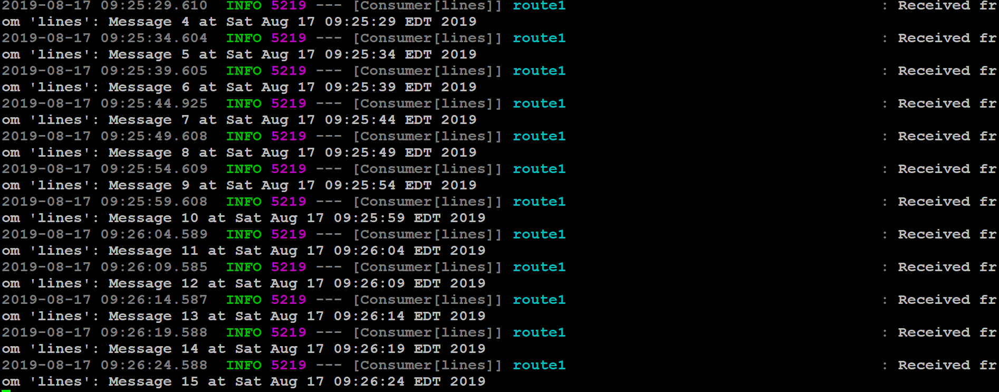

##### 图 33\. Producer 应用

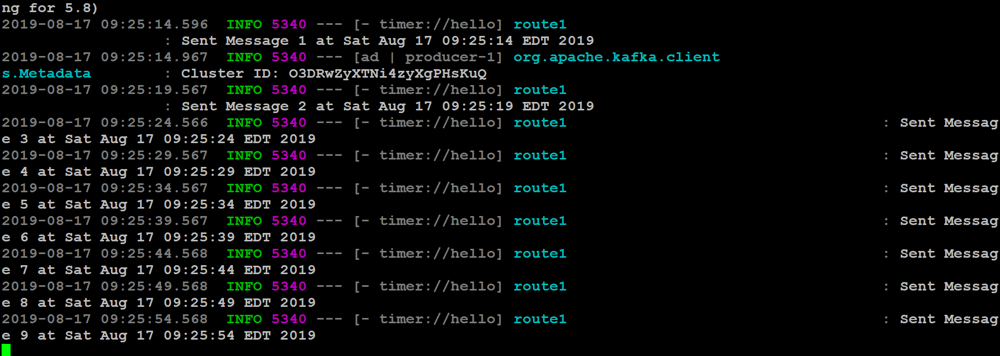

在 OpenShift 集群中启动 Consumer 监听 Topic，可以看到结果如图 34 所示，与外部 Consumer 看到信息一致：

```
sh-4.2$ bin/kafka-console-consumer.sh --bootstrap-server localhost:9092 --topic lines
--from-beginning

```

Show moreShow more icon

##### 图 34\. 获取 Topic 中消息

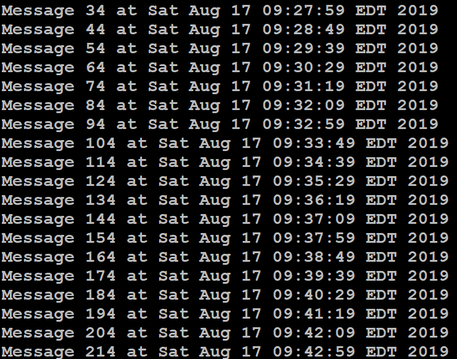

### 配置 Mirror Maker

很多情况下，应用程序需要跨 Kafka 集群在彼此之间进行通信。数据可能在数据中心的 Kafka 中被摄取并在另一个数据中心中被消费。接下来，我们将展示如何使用 MirrorMaker 在 Kafka 集群之间复制数据，如图 35 所示：

##### 图 35\. Kafka 集中的 MirrorMaker

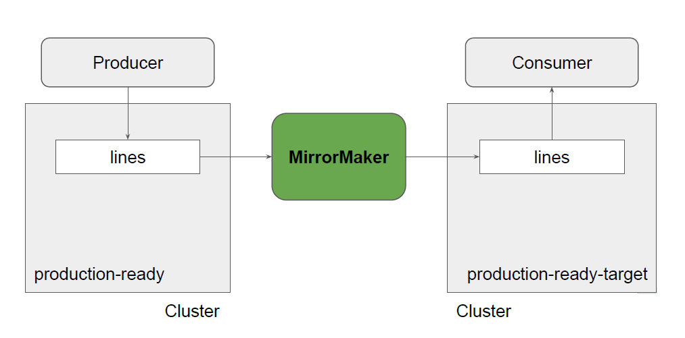

部署第二套 Kafka 集群：Production-ready-target，作为现有 Production-ready Kafka 集群的目标端。集群部署配置文件如清单 16 所示：

##### 清单 16\. Kafka 集群配置文件

```
# cat production-ready-target.yaml
apiVersion: kafka.strimzi.io/v1alpha1
kind: Kafka
metadata:
name: production-ready-target
spec:
kafka:
    replicas: 3
    listeners:
      plain: {}
      tls: {}
    config:
      offsets.topic.replication.factor: 3
      transaction.state.log.replication.factor: 3
      transaction.state.log.min.isr: 2
    storage:
      type: persistent-claim
      size: 3Gi
      deleteClaim: false
zookeeper:
    replicas: 3
    storage:
      type: persistent-claim
      size: 1Gi
      deleteClaim: false
entityOperator:
    topicOperator: {}
userOperator: {}

```

Show moreShow more icon

应用配置文件，执行结果如下图 36 所示：两个 Kafka 集群已经部署成功：

```
# oc apply -f production-ready-target.yaml

```

Show moreShow more icon

##### 图 36\. Kafka 集群部署成功

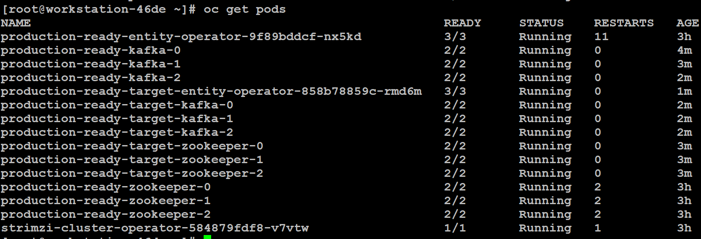

接下来，timer-producer 应用程序在主 Kafka 集群上创建 Producer，Consumer 应用程序将从目标 Kafka 集群 Topic 中读取消息。

首先部署 Mirror Maker，配置文件如清单 17 所示，它创建了两个 Kafka 集群 SVC 的联系。

##### 清单 17\. Mirror Maker 配置文件

```
# cat mirror-maker-single-namespace.yaml
apiVersion: kafka.strimzi.io/v1alpha1
kind: KafkaMirrorMaker
metadata:
name: mirror-maker
spec:
image: strimzi/kafka-mirror-maker:latest
replicas: 1
consumer:
    bootstrapServers: production-ready-kafka-bootstrap.amq-streams.svc:9092
    groupId: mirror-maker-group-id
producer:
    bootstrapServers: production-ready-target-kafka-bootstrap.amq-streams.svc:9092
whitelist: "lines|test-topic"

```

Show moreShow more icon

应用配置如下，执行结果下图 37 所示，mirror maker pod 创建成功：

```
[root@workstation-46de ~]# oc apply -f mirror-maker-single-namespace.yaml
kafkamirrormaker.kafka.strimzi.io/mirror-maker created

```

Show moreShow more icon

##### 图 37\. Mirror Maker Pod 创建成功

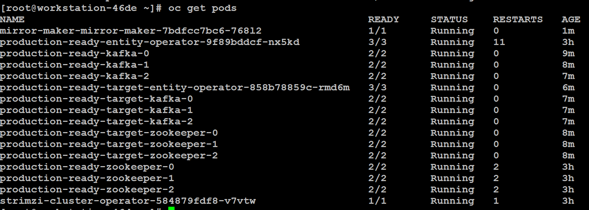

现在从目标 Kafka 集群中部署 Consumer，如清单 18 所示：

##### 清单 18\. Consumer 配置文件

```
    # cat log-consumer-target.yaml
apiVersion: extensions/v1beta1
kind: Deployment
metadata:
name: log-consumer
labels:
    app: kafka-workshop
spec:
replicas: 1
template:
    metadata:
      labels:
        app: kafka-workshop
        name: log-consumer
    spec:
      containers:
        - name: log-consumer
          image: docker.io/mbogoevici/log-consumer:latest
          env:
            - name: CAMEL_COMPONENT_KAFKA_CONFIGURATION_BROKERS
              value: "production-ready-target-kafka-bootstrap.amq-streams.svc:9092"
            - name: CAMEL_COMPONENT_KAFKA_CONFIGURATION_GROUP_ID
              value: test-group

```

Show moreShow more icon

应用配置文件：

```
# oc apply -f log-consumer-target.yaml
      deployment.extensions/log-consumer created

```

Show moreShow more icon

将 timer-producer 应用程序写入主 Kafka 集群，配置文件如清单 19 所示：

##### 清单 19\. timer-producer 配置文件

```
# cat timer-producer.yaml
apiVersion: extensions/v1beta1
kind: Deployment
metadata:
name: timer-producer
labels:
    app: kafka-workshop
spec:
replicas: 1
template:
    metadata:
      labels:
        app: kafka-workshop
        name: timer-producer
    spec:
      containers:
        - name: timer-producer
          image: docker.io/mbogoevici/timer-producer:latest
          env:
            - name: CAMEL_COMPONENT_KAFKA_CONFIGURATION_BROKERS
              value: "production-ready-kafka-bootstrap.amq-streams.svc:9092"

```

Show moreShow more icon

应用配置如下，执行结果如下图 38 所示：

```
# oc apply -f timer-producer.yaml
deployment.extensions/timer-producer created

```

Show moreShow more icon

##### 图 38\. timer-producer pod 部署成功

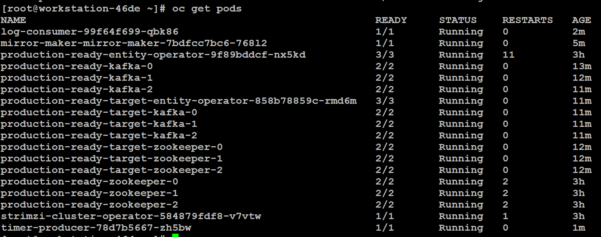

接下来我们查看 timer-producer 和 log-consumer pod 的日志，可以看到消息之间的正常交互，如下图 39、40 所示。

##### 图 39\. timer-producer pod 日志

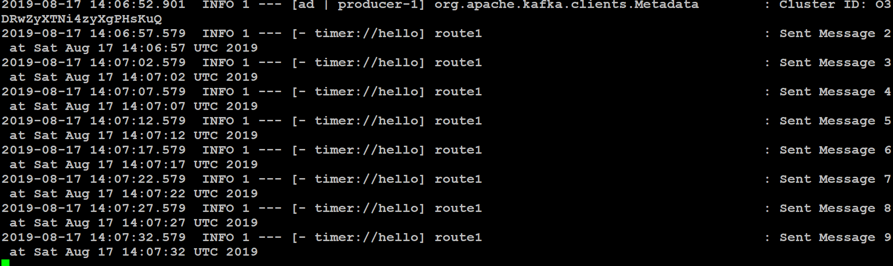

##### 图 40\. log-consumer pod 日志

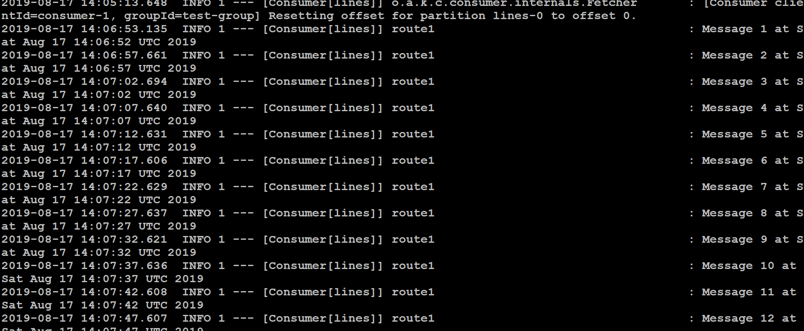

由此可以证明，Mirror Maker 配置成功。至此，Kafka 集群在 OpenShift 集群上成功实现。

## 结束语

通过本文，相信您对 AMQ、Kafka 的架构以及在 OpenShift 上的实现有了较为清晰的了解。随着微服务在 OpenShift 集群上的大量部署，AMQ 和 Kafka 必将会在 OpenShift 上发挥重要的作用。

## 参考资源

- [ActiveMQ 开源社区](https://github.com/apache/activemq)
- [Kafka 开源社区](https://github.com/apache/kafka)