# 模型开发及部署
SPSS 产品套件风电行业齿轮箱轴承故障预测解决方案

**标签:** 分析

[原文链接](https://developer.ibm.com/zh/articles/ba-lo-spss-failure-prediction2/)

艾 华

发布: 2018-08-15

* * *

## 引言

在本系列第一篇中，我们进行了业务分析以及设备的特点，基于原生数据生成了衍生数据。另外通过对数据的观察得到数据的特点，得到对数据处理的思路。通过对数据的处理，提高数据质量，为本章建模建立非常良好的数据基础。

## 模型开发

### 相关性分析

根据第一部分中的数据初探，可以觉察到数据的相关性。那么在这个步骤统一观测数据。来决定数据的去留： 使用特征选择节点，分析数据重要性。只保留重要的数据变量。

##### 图1：所有变量与故障相关性分析

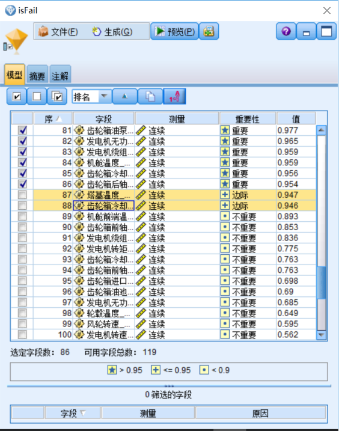

##### 图2：去除变量：

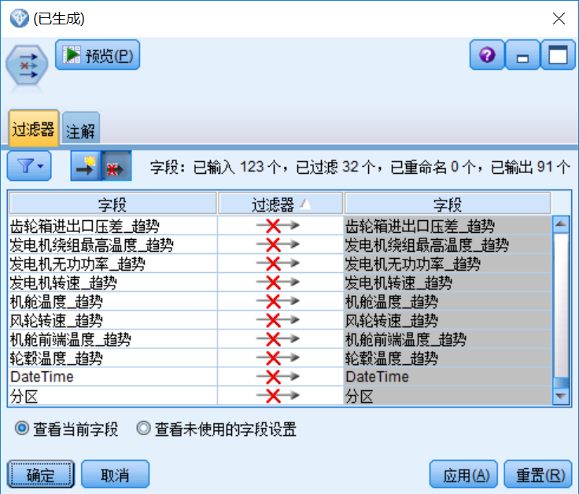

### 训练模型

本次模型开发属于分类模型，下面尝试多种分类模型建模，并综合所有模型的结果对结果进行判断。

- 逻辑回归：逻辑回归是应用非常广泛的一个分类机器学习算法，它将数据拟合到一个 logit 函数（或者叫做 logistic 函数）中，从而能够完成对事件发生的概率进行预测。
- SVM：SVM（Support Vector Machine）指的是 [支持向量机](https://baike.baidu.com/item/支持向量机)，是常见的一种判别方法。在机器学习领域，是一个有监督的学习模型，通常用来进行模式识别、分类以及回归分析。其原理也从线性可分说起，然后扩展到线性不可分的情况。甚至扩展到使用非线性函数中去，这种分类器被称为支持向量机。支持向量机的提出有很深的理论背景。支持 [向量](https://baike.baidu.com/item/向量) 机方法是在后来提出的一种新方法。SVM 的主要思想可以概括为两点：

    - 它是针对线性可分情况进行分析，对于线性不可分的情况，通过使用非线性 [映射](https://baike.baidu.com/item/映射) 算法将低维输入空间线性不可分的样本转化为 [高维](https://baike.baidu.com/item/高维) 特征空间使其线性可分，从而使得高维特征空间采用线性算法对样本的非线性特征进行线性分析成为可能。
    - 它基于结构风险最小化理论之上在特征空间中构建最优超平面，使得学习器得到全局最优化，并且在整个样本空间的期望以某个概率满足一定上界。
- 神经网络：人工神经网络（Artificial Neural Networks，简写为 ANNs）也简称为神经网络（NNs）或称作连接模型（Connection Model），它是一种模仿动物神经网络行为特征，进行分布式并行信息处理的算法数学模型。这种网络依靠系统的复杂程度，通过调整内部大量节点之间相互连接的关系，从而达到处理信息的目的。

##### 图3：训练模型

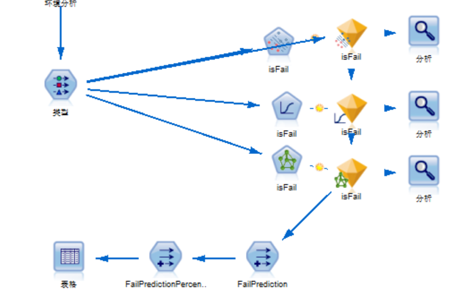

采用选举法对是否发生故障进行决断：是否发生故障选举：如果有超过一半的模型认为是故障那么，就认为风机要发生故障。

##### 图4：选举法

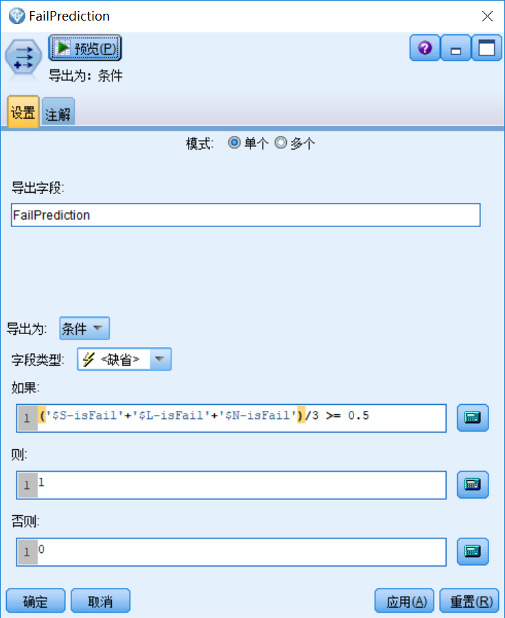

处理发生故障的概率：本预测主题主要关注的是发生故障的概率。所以需要处理模型的预测结果。如果模型预测风机要发生故障了，那么预测的概率就是故障概率。如果预测出来不会发生故障，那么故障的概率就是1不发生故障的概率。

综合3个模型风机发生故障的概率：每个模型都会针对本身对风机故障做出概率判断，最终结果需要综合所有模型。由于模型没有偏重，那么直接取3个模型平均值：

##### 图5：计算故障概率

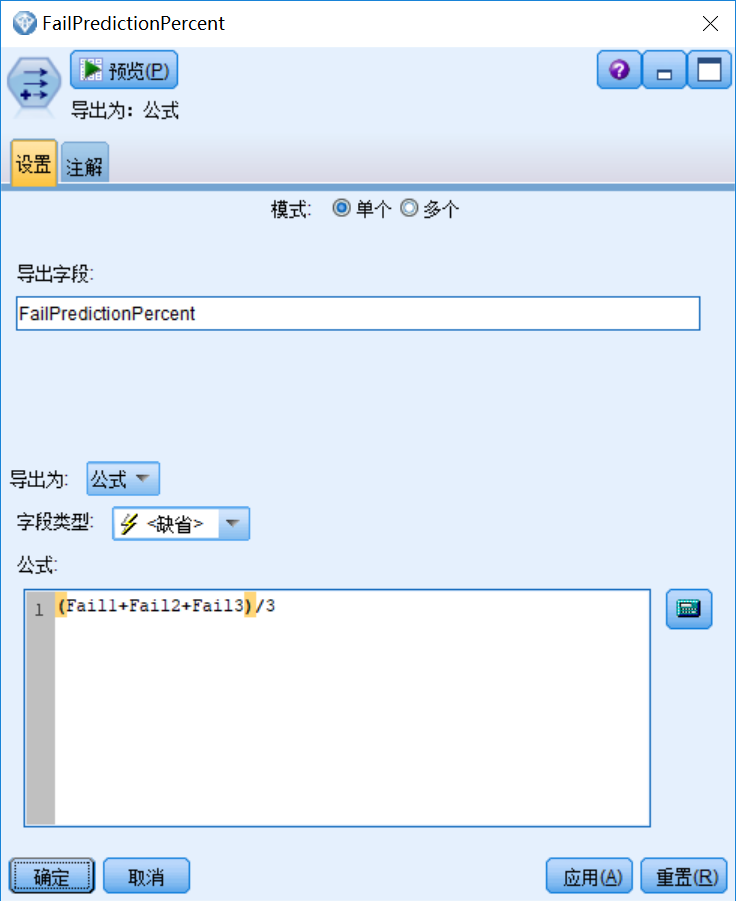

### 处理异常数据

由于种种原因，实时运行数据会发生一定的缺失或者异常，针对全部缺失的数据和异常数据，模型不进行预测。例如如下情况：当塔基温度小于-50或者大于100度时。那么预测分值设置为-1.并且设置 Summery 为相关说明。

##### 图6：处理异常数据


##### 图7：异常数据原因写入

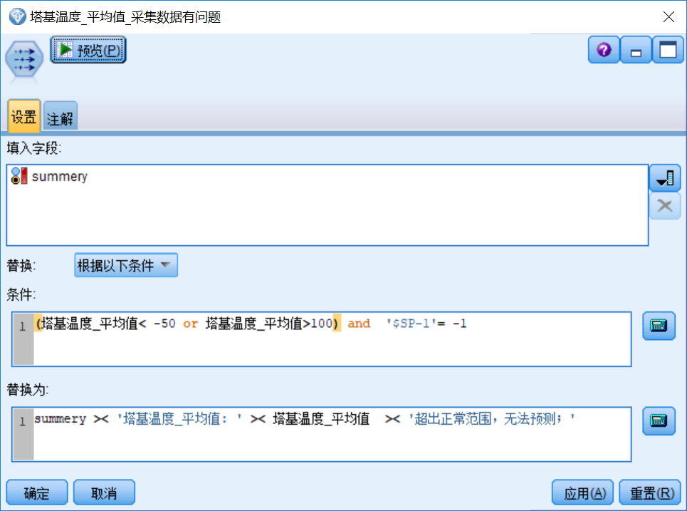

当数据全部缺失的时候，依然不做预测，设置出现故障的分值为-1，并且在 summery 内进行说明。

##### 图8：处理缺失数据


##### 图9：缺失数据原因写入


针对所有数据变量做类似处理。

##### 图10：所有字段异常处理

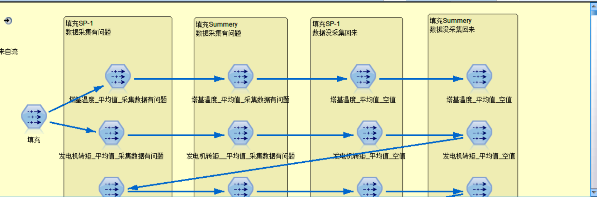

由于数据采集过程中会出现多因素叠加的现象，导致 Summery 字段过长，而不能写入到数据库，所以对描述做相应的截断处理：

##### 图11：处理原因过长时数据库写入问题

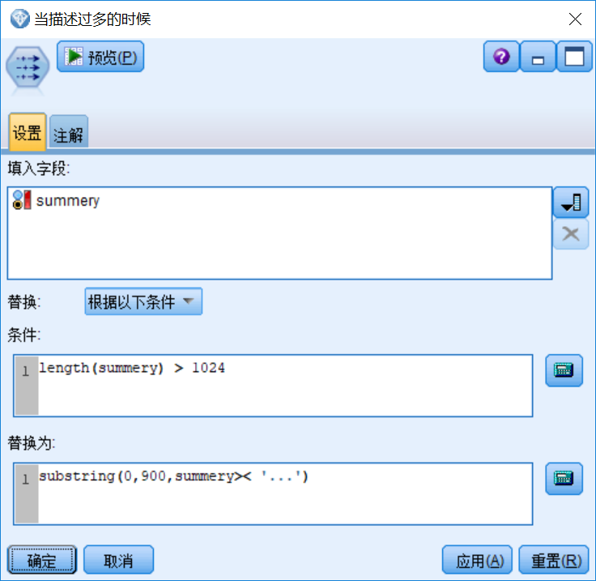

## 模型部署

模型部署过程，是把实时数据接入模型得到实际预测结果的过程。在这个过程中首先需要把数据源设置成为数据集市中的实时数据源，对数据进行处理，预测，然后需要把预测结果写入到数据库。第二步骤需要部署到 CADS 上，定时运行。第三步，需要门户开发进行配合，从结果表中，取得数据在门户进行展示。

#### 数据填充

无论是实时数据和历史数据，由于采集数据库的数据不能直接使用，需要经过一定的预处理来保证数据的完整性。在数据处理过程中，由于 modeler 的限制不能直接操作数据库，需要写入到中间结果数据库中。本次数据填充，只针对限功率进行填充，其他部分的数据不做填充。下面使用循环针对每个风机进行限功率填充：

##### 图12：数据填充

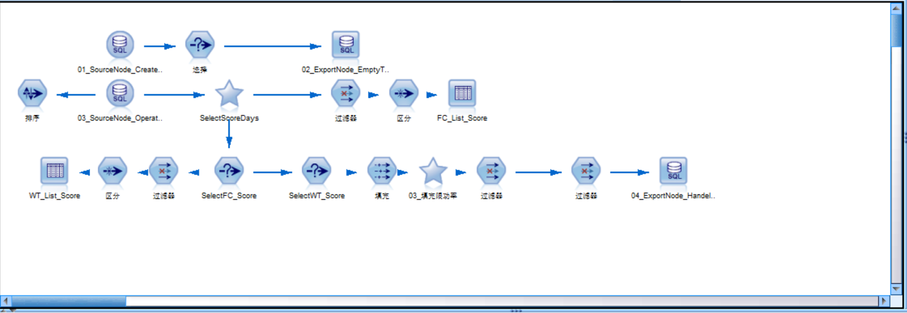

执行如下代码针对每个风场，每个风机进行填充，并且写入到中间数据库：

```
execute 'FC_List_Score'
set IMT_no='FC_List_Score'.output.row_count
for line_IMT from 1 to IMT_no
set IMT=value 'FC_List_Score'.output at line_IMT 1
set 'SelectFC_Score':selectnode.mode = Include
set 'SelectFC_Score':selectnode.condition = "EXT_WF_ID='" >< IMT >< "'"
println  "风场:  " >< IMT

execute 'WT_List_Score'
set WT_no='WT_List_Score'.output.row_count
for line_WT from 1 to WT_no
set IWT=value 'WT_List_Score'.output at line_WT 1
set 'SelectWT_Score':selectnode.mode = Include
set 'SelectWT_Score':selectnode.condition = "EXT_WT_ID='" >< IWT >< "'"
println  "风机编码:  " >< IWT

var Score_Result_exportNode
set Score_Result_exportNode=get node '04_ExportNode_HandelData_His_Bak':databaseexportnode
execute ^Score_Result_exportNode
#execute Excel_result
endfor
#endfor
Endfor

var FinalData_exportNode
set FinalData_exportNode=get node '06_ExportNode_FinalData_His_Bak':databaseexportnode
execute ^FinalData_exportNode

```

Show moreShow more icon

历史数据和实时数据的区别在于数据选取以及时间选取不同。时间均可以在 job 中进行更改。

#### 数据处理

把数据源置换为中间数据库。把结果数据写入最终结果数据库。

##### 图13：数据源处理

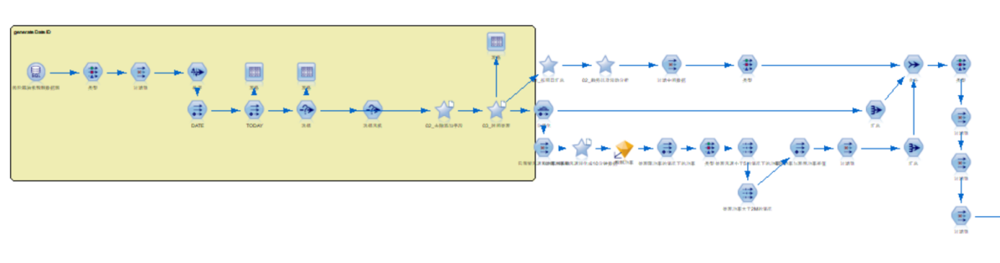

##### 图14：数据导出节点处理

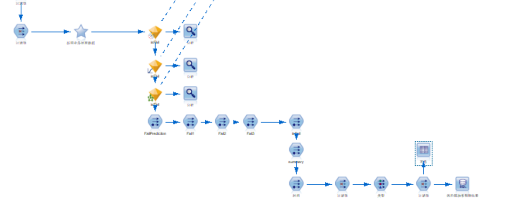

### 模型运行

- 创建 job：把 stream 退拽到job中。并且在 job 之间建立“通过”的关系；

##### 图15：创建 job

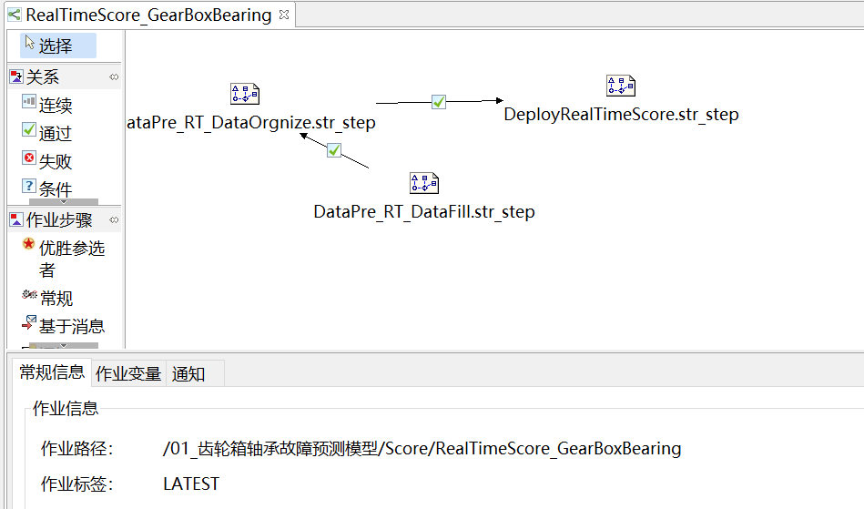

- 配置 job：配置 job 运行时需要的 Modeler 服务器，Modeler 服务器的登录信息，CADS 服务器，CADS 登录信息，数据读入和输出的数据库配置；

##### 图16：配置 job

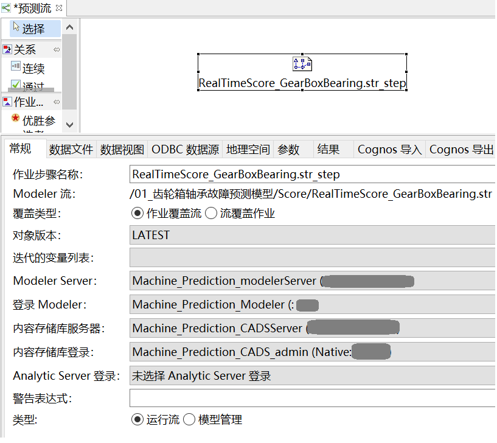

- 运行 job 并检查 job 运行结果。

##### 图17：运行 job

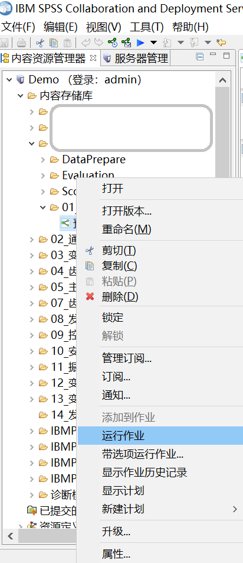

- 配置 job 运行周期

##### 图18：配置运行周期

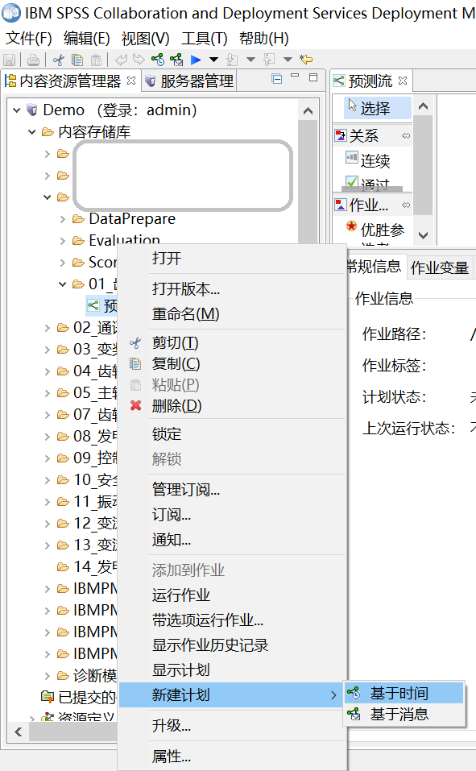

### 模型刷新

#### 基于时间周期刷新

由于受到样本不平衡的现状限制，所以在数据集市积累到一定量的数据之后，需要刷新模型。模型刷新有2种方式，一个是基于时间维度的定期刷新，一个是基于评估结果的刷新。

##### 图19：以刷新方式部署模型

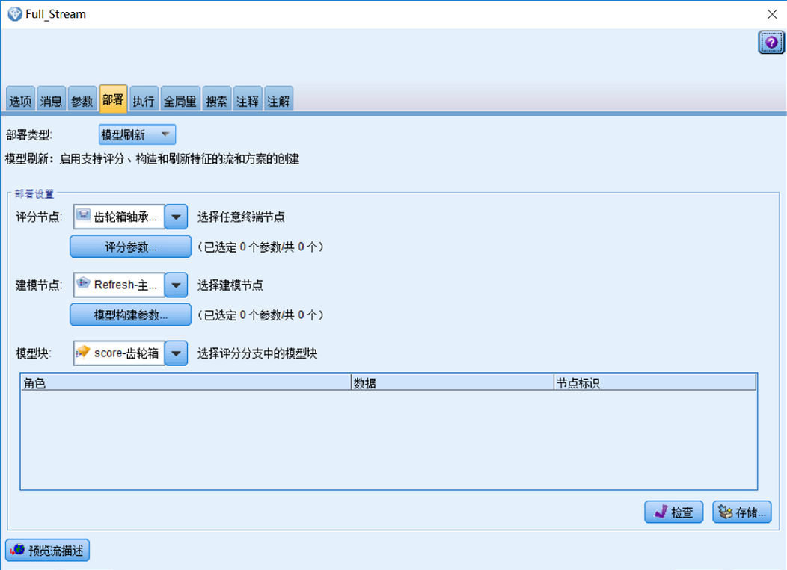

在模型部署的时候，有两种方式：模型评分和模型刷新。以模型评分的方式部署到 CADS，模型只能用于模型预测，以模型刷新的方式部署进入 CADS 的话，可以用于模型评估，模型预测和模型的刷新。所以在部署的时候，我们选择以模型刷新的方式部署进入 CADS。

在选择类型的时候，选择刷新，然后选择需要刷新的所有模型对。在本次刷新中，所有模型对全部需要刷新。所以选择所有的模型对。

##### 图20：在 CADS 中选择刷新对

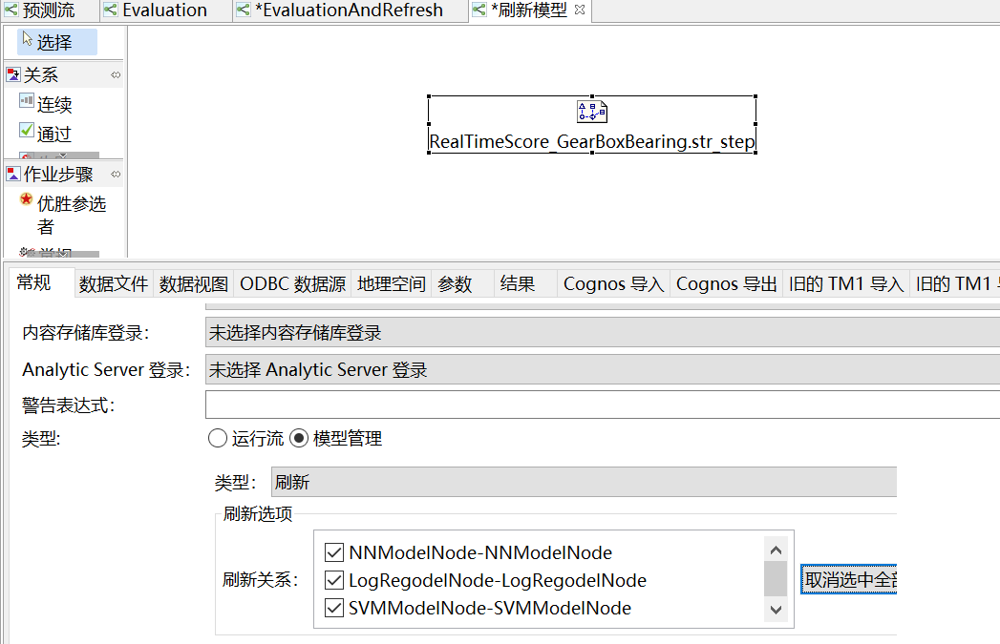

为工作流创建基于时间的 Schedule。如何创建基于时间的 Schedule 已经在前面章节介绍过了，在本节不在累述。

#### 基于模型评估结果刷新

本主题用到3个模型，需要分别对不同的模型进行评估。针对不同的模型，分别以“刷新”的方式部署到 CADS 上。

##### 图21：分别部署模型

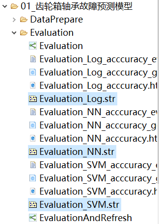

- 创建 Evaluation job。把数据准备流文件拉入 job。把评估模型拉入 job。设置评估->准确性。
- 设置模型，差，好，较好的分值。
- 把 RealTimeScore\_GearBoxBearing.str 拖入到 job。设置刷新。设置刷新条件: completion\_code==200 \|\| completion\_code==100。
- 当所有模型执行评估结果都是好或者差的时候，就执行 score job 的刷新过程。当 Score job 执行完，执行 Evaluation job 的刷新过程，以及 Data 准备相关的模型刷新。

##### 图22：创建刷新流

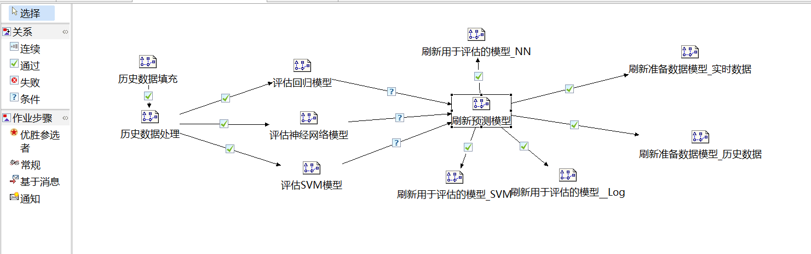

## 项目总结

本文通过一个风电行业的一个特定的场景，梳理数据挖掘项目实施的整体过程：从需求理解，到数据采集，数据理解，数据建模以及到实施应用。读者可以了解到如何应用 IBM SPSS 产品快速的实现从业务到项目交付的整个过程。本文是针对风电行业的解决方案，其实无论是任何的工业场景，都可以复用整个交付流程，只是数据的特点不一样。通过本文介绍的数据理解的办法，以不变应万变，从业务角度出发，深刻理解数据的特点并加以利用，实现场景的迁移。