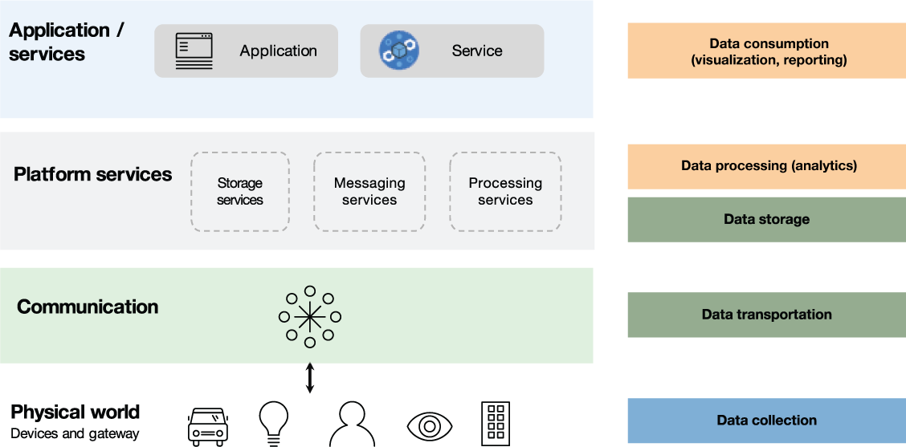
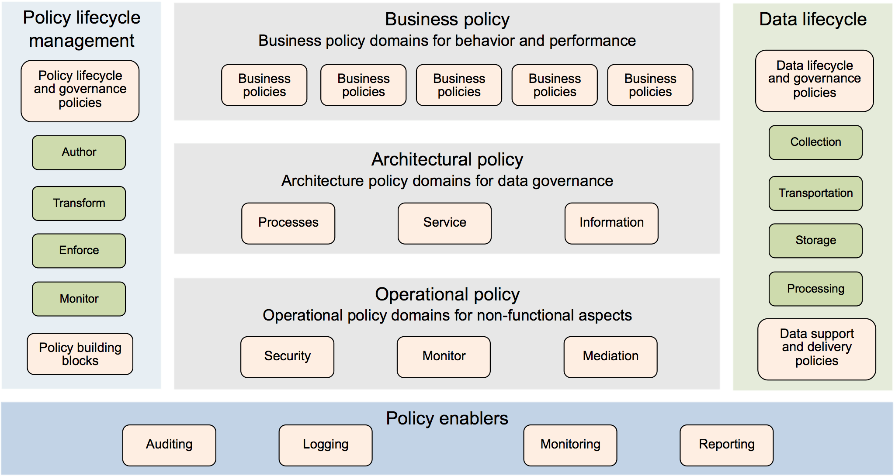

# 治理您的 IoT 数据
如何管理整个企业的 IoT 计划

**标签:** IoT,数据管理,治理

[原文链接](https://developer.ibm.com/zh/articles/iot-governance-03/)

Joy Patra, Amitranjan Gantait, Ayan Mukherjee

发布: 2018-05-03

* * *

IoT 解决方案治理涉及合理规划策略、架构、团队和流程，进而开发、交付并维护成功的 IoT 解决方案。本系列的 [第一部分](http://www.ibm.com/developerworks/cn/iot/library/iot-governance-01/) 帮助您定义了整体的 IoT 治理实践。不论是何种 IoT 解决方案，设备和数据都是两大重要组件。本系列的 [第二部分](http://www.ibm.com/developerworks/cn/iot/library/iot-governance-02/) 主要关注如何治理设备，第三部分则将重点放在了如何治理数据上。

IoT 设备会生成大量数据，并通过互联网来传输这些数据。企业和平台都亟需建立一个有效的治理机制，确保这些数据可供预期的利益相关方有效利用，而不会惨遭其他人滥用。

IoT 中的数据治理与企业中的数据治理有着相同的特性，如数据收集、数据质量、数据存储、数据处理和数据消费。然而，IoT 解决方案还需要处理数据生命周期中的其他一些领域：

- 决定通过传感器或设备收集正确的数据
- 通过网络将数据发送到云端，然后存储到云平台上。
- 分析数据以预测或优化结果
- 将数据分配给消费者或其他应用
- 管理整个生命周期中数据的隐私性和安全性

在定义 IoT 数据治理实践时，您必须考虑到 IoT 环境或用例，例如，管理大型基础设施（智慧城市）、管理公用事业基础设施（能源网格），或者管理生产或生产线。

## 在整个 IoT 数据生命周期内治理 IoT 数据

IoT 架构的每一层都必须在整个 IoT 数据生命周期内管理 IoT 数据。IoT 数据生命周期始于收集数据的物理层（设备和网关），然后进入传输数据的通信层，接着进入存储和处理数据的平台服务层，最后在实现数据可视化或数据报告的应用层终结。

IoT 数据管理不仅与传感器有关，还会牵涉到制动器和边缘网关。举个例子，可视门锁可能具有一个拍摄访问者照片的照相机，可以在边缘网关上根据一组预先核准的面部图片来处理该照片，从而自动识别访问者并启动门锁，打开大门。因此，您必须管理收集到的传感器数据，管理用来处理或过滤传感器数据的参考数据，并最终管理发送到制动器的控制数据。

为了处理数据（实时数据或历史数据），来自传感器的数据必须存储在合适的存储设备中。根据数据格式、数据频率和处理需求，确定合适的存储需求，并将数据安全传输到该存储平台。端到端的 IoT 数据管理解决方案需要安全地传输、存储和消费数据。

后续部分将提供更多关于 IoT 数据生命周期管理的详细信息。

### 数据收集

IoT 数据收集过程从数百个抑或是数千个传感器开始。这些传感器可能被纳入到烟雾报警器等静态设备中，或者是导航设备等移动设备中。这些传感器可能是由各种不同的制造商所生产，因此，数据格式和协议标准可能千差万别。这些传感器可能需要定期校准。根据传感器标准，可能需要聚合或过滤数据，然后再发送到服务器。

您需要根据 IoT 解决方案的具体需要，对这些不同来源的数据进行建模以保证数据统一，还必须确保数据符合所需的质量要求，以便将“原始”数据转换为“可用”数据。这一阶段通常被视为第一道关口，由此从未知、不可见或无组织的 IoT 数据世界，演变为后续生命周期阶段中的结构化、有意义或可用的输入。

#### 数据建模

您需要从标准元数据着手，使其满足 IoT 解决方案环境的需要，也可能是满足企业环境的需求，为整个企业定义想要执行的数据结构。尽管对于解决方案而言，在您的整个工厂或工厂某个部分的传感器元数据标准可能是独一无二的，但您可能会希望为供应链（可能跨越不同大陆）建立企业级的元数据标准。

由于设备和业务解决方案的性质存在差异，因此，以适当的详尽程度建立一个合适的元数据标准极具挑战性。您可能会因过于统一或不够统一而告终。因此，千万不可采用”一刀切”的方法。根据业务环境和解决方案环境，选择设备和制造商之间可行的粒度，同时还支持您执行治理策略。

对您而言，确保传感器经过良好校准至关重要，尤其是在要求苛刻的工业场合或高度敏感的仪器中。您将希望以足够的粒度和频率收集数据，从而能够确定（至少是推断）是否未校准传感器。如果无法确定是否未经过校准，您可能需要设置策略，定期进行手动验证，这可能更加昂贵。

[IBM Watson IoT Platform 支持定义逻辑设备模式](https://console.bluemix.net/docs/services/IoT/im_schemas.html)，从而化繁为简，并将 IoT 应用与特定供应商的设备细节隔离开来。在设备模式中，您可以为来自不同设备（特别是来自不同供应商的设备）的不同数据，使用有意义的属性名。一旦定义了相关模式，就可以根据该逻辑设备模式创建数据规则和相应的操作。

#### 数据质量

除数据建模外，您必须从一致性、完整性、时效性和可靠性方面斟酌数据质量。

- **一致性：** 数据的一致性是指同一传感器在短时间内报告的一系列数据点之间的相关性。例如，在几秒范围内，温度传感器应该不会报告差异很大的温度读数，不会显示出温度的剧烈变化。再或者，在几秒范围内，地理定位传感器应该也不会报告相距数千米远的不同位置。如果发生这种情况，很可能是传感器出错。若未经校准，传感器报告的读数虽然有可能一致，但却不正确。在重要用例中，您可能会包括多个传感器，然后统计相关读数，由此确定不一致的读数。对于所报告数据经常与其他传感器读数不一致的传感器，可能会自动报告为需要检查运行状况。
- **完整性：** 数据的完整性是指所有的支持数据点是否均可用；例如，支持预测事件的原始数据或连续的时间序列数据。对于高质量数据，在提供了更加详细的数据点时，这些数据可追溯到特定时间点的特定传感器。在适当情况下，完整性是指能够将来自多个传感器，甚至是其他信息系统的数据进行组合和关联。
- **时效性：** 由于很多 IoT 数据都是实时数据或近乎实时的数据，确定传感器数据或派生数据是否按时到达网络中的所需位置就显得至关重要。您希望能够及时处理数据，从而防患于未然。在务必要关联多个传感器的读数的情况下，时效性可能包括能够同步这些传感器的数据。
- **可靠性：** 可靠性无疑是最重要的，对于关键任务应用而言尤为重要。就可靠性而言，在传感器的给定生命周期内，其测量结果必须具有精确性和可重复性。读数的精确性是指传感器必须达到的测量精度。可重复性是指在相同场景中，传感器是否会以同样的精度产生相同的测量结果。例如，如果将地理定位传感器带回到相同的街角，该传感器需要产生相同的位置读数，达到所需的精度。

### 数据传输

查看 [IoT 网络指南](https://www.ibm.com/developerworks/cn/iot/library/iot-lp101-connectivity-network-protocols/index.html)，获取更多关于传输协议的信息。此外，您还可以阅读“设计并构建安全 IoT 解决方案”这一系列的第 2 部分： [通过网络保护 IoT 数据](https://www.ibm.com/developerworks/cn/iot/library/iot-trs-secure-iot-solutions2/index.html)，了解更多相关信息。

IoT 原始数据来自不同的异构数据源，这些数据的格式、结构和重要性各不相同。如果在网络上实时传输大量原始数据并进行存储，成本非常高昂。通常情况下，会使用有线或无线协议，将数据从一个步骤发送到下一步骤。在设计 IoT 系统时，必须根据数据和 IoT 设备的性质，仔细选择合适的传输方法。传输协议多种多样，不仅有标准协议 HTTP 和 MQTT，还有许多专用协议。

请参考 [Watson IoT Platform](https://cloud.ibm.com/docs/services/IoT?topic=iot-platform-getting-started#gettingstartedtemplate) 和 [IBM Event Streams](https://cloud.ibm.com/docs/services/EventStreams?topic=eventstreams-getting_started#getting_started)，获取更多关于 IoT 消息传输和转换的信息。

### 数据存储

关于 IoT 数据存储和分析的更多详细信息，请阅读“ [理解 IoT 数据的含义](https://www.ibm.com/developerworks/cn/iot/library/iot-lp301-iot-manage-data/index.html)”一文。

当我们开始讨论 IoT 数据存储时，必须在 IoT 治理中解决几个有趣的问题：

1. **IoT 数据存储在哪里？IoT 数据应如何存储？** 云端始终是存储数据的恰当位置？那可不一定。就拿行驶中的车辆产生的图像或收集水下图像的潜水艇来说吧。即使是超高速互联网连接，也不足以在云中实现实时数据传输和保存。在这样的场景中，就需要一个本地中间存储，然后定期将过滤后的数据（通过对数据进行预处理、聚合或融合）发送到中央数据库，用于进一步分析。在 IoT 系统中，使用中间数据库是一种常见的策略。此外，该技术也会因 IoT 数据的大小、类型和速度而发生变化。在选择 IoT 数据库时，请勿对数据库有任何先入为主的想法。这里有很多选择，如 SQL、NoSQL、对象/文档数据库和文件存储等等，不一而足。根据存储和访问要求，可以选择一项或多项数据库技术。即使存储成本日益下降，由于 IoT 数据量十分庞大，成本仍是一个重要因素。
2. **应存储多少 IoT 数据？** 毫无疑问，大多数 IoT 系统的目标都不包括存储精确的预定义数据集这一方面。有时，在存储数据之前，我们并不了解数据，而是将它输入到无人监督的机器学习算法中，从而发现任何有意义的模式。可以允许一定量的冗余，但所需的磁盘空间应在可接受的范围内。

### 数据处理（分析）

设备和传感器产生大量需要处理的原始数据，以便为用户和应用提取有意义的信息，供其消费或使用。您可能需要先执行以下操作，然后才能对（不同供应商的）不同设备所产生的不同格式的数据应用高级分析技术：

- 转换所有数据，使之标准化，并以应用所能理解的统一格式进行存储
- 过滤无用的重复数据，提高分析的准确性
- 通过集成其他来源的各种结构化或非结构化数据来丰富数据，比如，企业信息系统数据、天气数据或交通数据

若要处理 IoT 解决方案的数据，您就需要满足以下条件：

- 可管理需要实时存储和分析的海量数据。
- 提供超快的数据访问速度，因为延迟会使数据过时，或无法帮助您作出适当的决策（以人们驾驶联网汽车的场景为例）。
- 处理错误和遗漏的读数。
- 制定数据标准化和互操作性计划，并确保顺利实现。组合多种数据格式和聚合不同设备及格式的数据时，会产生多个协议和数据格式问题，需要您一一解决。
- 根据您的用例为需要的分析处理类型设计 IoT 解决方案，如实时处理、机器学习、认知能力或边缘分析。例如，机器学习模型非常有助于实施资产管理解决方案，根据过去的数据和故障模型检测出可能发生的设备故障。

因此，IoT 治理团队必须通过这些 IoT 数据治理策略来着重关注计算能力：

- **数据收集策略** ，决定了如何收集数据、发送数据，以供进一步处理。数据可以作为原始数据发送，也可以在初步处理后发送，这取决于业务需求和设备功能。这些策略还建立了安全协议，确保收到的数据有效。
- **数据过滤策略** ，定义了收集数据之后的数据管理方式。并不是每个数据点都需要一直发送到数据中心。在将传感器数据发送到网络中的下一个节点之前，通常会处理传感器数据，实现聚合。由于大多数 IoT 设备都是低功耗设备（在本文发布之时），通常有一个网关或一个聚合点被分配到某个区域，用来管理和收集该区域内的传感器数据。例如，电梯中的高度传感器可能会收集数据，并将每隔 100 毫秒收集到的原始数据发送到控制器网关，该控制器网关可能决定电梯是否在楼层之间上下移动，还可能将数据发送到另一个聚合器上，报告多个电梯发生的故障事件。
- **数据上传策略** ，定义了应进一步处理和长期存储哪些数据。在 IoT 设备生成的海量数据中，只有数据点支持的相关事件才需要上传到云端进行处理和长期存储。所以，一般情况下，只会上传经过处理和过滤的数据。很少会发送原始数据点以便长期存储。然而，网络中的每个节点可能都会存储一些相关数据，以便进行详细审计、缺陷识别或运行状况检查。在上述有关电梯的示例中，控制器网关可能会存储过去 24 小时的原始高度数据，以便在检测到故障事件时，用于进一步诊断。

[IBM Watson IoT Platform 提供了一套丰富的分析服务](https:/developer.ibm.com/iotplatform/2017/03/15/watson-iot-platform-analytics-covering-iot-analytics-needs)，可分析各种各样的设备产生的 IoT 数据。根据具体应用的需求，开发人员可以从基本的实时处理开始，使用相关规则和操作来创建高级机器学习模型，根据设备发送的数据预测可能产生的结果。

### 数据消费（可视化和报告）

数据消费阶段涉及数据选择、充实、清理、报告和可视化，以及其他内务处理活动。在很高层面上，有两大策略推动这一阶段向前发展。

- 已知数据的处理 – 系统已经熟悉了数据，过滤、预处理、分析、后处理等处理步骤也已经得到定义。报告要求也十分明确，并且系统的设计和执行都定义了具体的目标，阐述了如何处理这些数据。
- 未知数据的处理 – 在这种情况下，“如何处理数据”部分一开始并没有给出明确的定义，后来，在初步分析数据之后才衍生出来。这种情况下的数据消费量也更多。但由于生成的报告在本阶段可能并没有意义或用处，因而报告要求较低。

为实现 IoT 解决方案的价值，就需要以一种安全的方式向外部用户和其他应用提供原始数据或经过处理的数据（通过 IoT 应用）。本阶段的主要目标和相关治理策略如下：

- 数据选择

    - 推送/拉取策略 – 用于定义是否连续轮询设备，访存数据或设计设备，以便在没有任何提示的情况下将数据发送到服务器。
    - 过滤策略 – 有助于优化数据吞吐量，定义传感器设备必须如何将过滤标准应用于数据更新事件，以便仅在需要时使用这些策略。
- 数据共享

    - 数据共享策略 – 用于指定一项协议，明确谁可以查看或使用 IoT 数据，以及访问机制未来的发展。
    - 通道使用策略 – 用于决定数据的消费方式是使用私有通道还是公共通道。
- 使用

    - 消费 QoS 策略 – 用于确定和定义 IoT 数据的 QoS 参数，如数据的性能、吞吐量、可靠性和可用性。
    - 使用跟踪策略 – 用于定义 IoT 数据的使用方法。数据收集程序和过滤标准可以相应进行调优。
    - 货币化策略 – 用于定义 IoT 数据和模式、分析和洞察是否具有货币价值。货币化是指利用 IoT 数据实现经济效益。
    - 保留策略 – 用于定义可维护的数据量。即使是大数据，最终也会过于庞大而产生高昂的维护成本。

IBM Watson IoT Platform 与生俱来即支持 [通过使用各类面板和卡片实现实时数据可视化](https://cloud.ibm.com/docs/services/IoT?topic=iot-platform-sim_device_data)。开发人员可以基于 Watson IoT Platform 中存储的数据来构建自定义可视化，使用该平台提供的安全 API 访问数据。

## 管理 IoT 数据隐私性和安全性

数据由不同的 IoT 设备、服务和系统收集与存储，监管机构和政府对数据的审查也日趋严格。在保护敏感数据和个人数据方面，各种严苛的法律法规不断颁布实施。对于开发人员和设计人员来说，确切地知道存储的数据以及存储的原因变得越来越重要。此外，有些国家或地区还会制定专门的立法或规定，使 IoT 数据的物理位置成为一项重要的考虑因素。美国即颁布了 [《健康保险携带和责任法案》(HIPPA)](https://en.wikipedia.org/wiki/Health_Insurance_Portability_and_Accountability_Act)。而在欧盟， [《一般数据保护条例》(GDPR)](https://en.wikipedia.org/wiki/General_Data_Protection_Regulation) 也于 2016 年 4 月正式通过，并于 2018 年 5 月开始生效。除此之外，如果您的 IoT 解决方案使用到无人机，那么 [以色列制定了无人机的网络法律](https://www.or-hof.com/drones-regulation/)。

您可以阅读“设计并构建安全 IoT 解决方案”这一系列的第 2 部分： [通过网络保护 IoT 数据](https://www.ibm.com/developerworks/cn/iot/library/iot-trs-secure-iot-solutions2/index.html)，了解更多相关信息。

在设计 IoT 解决方案时，务必要牢记这些 IoT 数据隐私和安全指导方针：

- **根据敏感程度进行数据分类 。** 数据定义需要从以下几个方面对数据进行明确分类：个人身份信息 (PII)、敏感个人信息 (SPI)、安全信息和公开信息。考虑以下示例：

    - 个人的健康监测数据可被视为 SPI
    - 任何可以追溯至个人的数据都可被视为 PII
    - 公共场所的闭路电视录像可能需要确保安全，防范黑客以假乱真。
- **控制和验证上传的数据 。** 数据上传完成后，应确保数据安全，防止未经授权的访问和操作。必须为每一类数据确立必要的控制措施。
- **从设计源头保障数据隐私 。** 必须从头开始设计解决方案，确保数据的隐私性。解决方案必须采用数据分区、假名化、匿名化或数据加密等技术，降低数据意外泄露的风险，并防止消费者能够关联数据，由此掌握敏感信息。
- **访问控制 。** 通过利用数据定义粒度，IoT 治理团队应对每一部分数据建立基于角色的细粒度访问控制。访问控制必须防止通过通用登录访问数据，并且必须要求每位用户的各项访问都使用个人凭证。
- **在多租户环境中实施保护 .** 鉴于几乎所有 IoT 数据都是在云端存储和管理的，确保多租户安全性已成为第一要务。负责数据处理的人员必须实现隐私设计和控制，为每个数据使用人员划出一个单独的数据工作空间，防止在备份和恢复 IoT 数据等情况下，出现任何数据交叉重叠现象。

## 定义 IoT 数据治理策略

IoT 数据治理需要建立完备的策略，确保 IoT 解决方案生成和使用的数据符合所有要求和标准。数据治理需要重点关注安全策略，允许数据的有效消费。

数据策略参考模型（请参阅下图）可以帮助企业理解并创建一组完整的数据治理策略。该模型由以下部分组成：

- **策略生命周期管理** – 管理策略的编写、转换、执行和监视。

- **数据策略层** – 这是纵向维度的策略分类，从抽象层面上概括了包括业务、架构和运营在内的各种策略。

- **数据策略领域** – 这是横向维度的策略分类，确定了每个策略层必须处理或至少要考虑的策略领域。这包括业务、流程、服务、信息和非功能性需求。

- **数据策略的推动者** – 协助对策略生命周期进行适当管理，包括策略审计和记录（实现可追溯性、分发和转换）、监视以及报告。

- **数据生命周期管理** – 涵盖了与数据收集、传输、存储和处理相关的策略。

IoT 数据治理的指示性策略包括以下策略：

- 业务策略：

    - 隐私和安全策略

        - 无论是动态数据还是静态数据，所有的消费者信息都必须加密。
        - 除患者的治疗医生之外，任何人都不能查看患者数据。
    - 行业监管政策

        - 如果交易金额超过 10000 美元，交易记录将被发送到政府税务机关。
- 架构策略：

    - 在维护流程中，可以使用业务规则来提供所有权决策，根据部件类型或状况路由到单独的流程路径。
    - 当达到相应的阈值时，启动预防措施。
    - 例如，对于数据传输，“如果底层网络不支持安全传输，就使用支持自定义加密的设备”。或者，对于数据存储来说，“所有存在时间超过 15 天的数据都必须移到备份存储设备中”。
- 运营策略：

    - 访问控制策略：规定谁可以在运行时访问哪些数据。例如，“任何人都可以查看公共传感器的数据，但测量私人资产状况的传感器数据只能由相关授权人员查看”。
    - 消息保护策略：如果传输层未得到安全保护，那么在传输之前，请确保消息数据已经加密。
    - 数据完整性策略：可以在多长时间内一直信任或使用这些数据。

## 结束语

在本文中，我们探讨了在 IoT 解决方案的设计和运作过程中，数据治理至关重要的具体原因。我们还描述了数据生命周期的主要阶段，例如，如何收集数据、如何传输和存储数据，以及如何在 IoT 解决方案中处理数据。数据安全是数据治理解决方案的一个重要维度，在数据生命周期的各个阶段，都必须慎重处理数据安全问题。最后，我们提出了一套通用的 IoT 数据治理策略。

本文翻译自： [Governing your IoT data](https://developer.ibm.com/articles/iot-governance-03/)（2018-04-04）