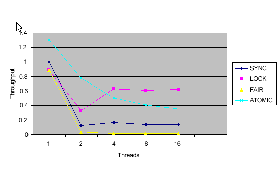

# 流行的原子
新原子类是 java.util.concurrent 的隐藏精华

**标签:** Java

[原文链接](https://developer.ibm.com/zh/articles/j-jtp11234/)

Brian Goetz

发布: 2004-11-23

* * *

十五年前，多处理器系统是高度专用系统，要花费数十万美元（大多数具有两个到四个处理器）。现在，多处理器系统很便宜，而且数量很多，几乎每个主要微处理器都内置了多处理支持，其中许多系统支持数十个或数百个处理器。

要使用多处理器系统的功能，通常需要使用多线程构造应用程序。但是正如任何编写并发应用程序的人可以告诉你的那样，要获得好的硬件利用率，只是简单地在多个线程中分割工作是不够的，还必须确保线程确实大部分时间都在工作，而不是在等待更多的工作，或等待锁定共享数据结构。

## 问题：线程之间的协调

如果线程之间 _不_ 需要协调，那么几乎没有任务可以真正地并行。以线程池为例，其中执行的任务通常相互独立。如果线程池利用公共工作队列，则从工作队列中删除元素或向工作队列添加元素的过程必须是线程安全的，并且这意味着要协调对头、尾或节点间链接指针所进行的访问。正是这种协调导致了所有问题。

### 标准方法：锁定

在 Java 语言中，协调对共享字段的访问的传统方法是使用同步，确保完成对共享字段的所有访问，同时具有适当的锁定。通过同步，可以确定（假设类编写正确）具有保护一组给定变量的锁定的所有线程都将拥有对这些变量的独占访问权，并且以后其他线程获得该锁定时，将可以看到对这些变量进行的更改。弊端是如果锁定竞争太厉害（线程常常在其他线程具有锁定时要求获得该锁定），会损害吞吐量，因为竞争的同步非常昂贵。（Public Service Announcement：对于现代 JVM 而言，无竞争的同步现在非常便宜。

基于锁定的算法的另一个问题是：如果延迟具有锁定的线程（因为页面错误、计划延迟或其他意料之外的延迟），则 _没有_ 要求获得该锁定的线程可以继续运行。

还可以使用可变变量来以比同步更低的成本存储共享变量，但它们有局限性。虽然可以保证其他变量可以立即看到对可变变量的写入，但无法呈现原子操作的读-修改-写顺序，这意味着（比如说）可变变量无法用来可靠地实现互斥（互斥锁定）或计数器。

### 使用锁定实现计数器和互斥

假如开发线程安全的计数器类，那么这将暴露 `get()`、 `increment()` 和 `decrement()` 操作。清单 1 显示了如何使用锁定（同步）实现该类的例子。注意所有方法，甚至需要同步 `get()`，使类成为线程安全的类，从而确保没有任何更新信息丢失，所有线程都看到计数器的最新值。

##### 清单 1\. 同步的计数器类

```
public class SynchronizedCounter {
    private int value;
    public synchronized int getValue() { return value; }
    public synchronized int increment() { return ++value; }
    public synchronized int decrement() { return --value; }
}

```

Show moreShow more icon

`increment()` 和 `decrement()` 操作是原子的读-修改-写操作，为了安全实现计数器，必须使用当前值，并为其添加一个值，或写出新值，所有这些均视为一项操作，其他线程不能打断它。否则，如果两个线程试图同时执行增加，操作的不幸交叉将导致计数器只被实现了一次，而不是被实现两次。（注意，通过使值实例变量成为可变变量并不能可靠地完成这项操作。）

许多并发算法中都显示了原子的读-修改-写组合。清单 2 中的代码实现了简单的互斥， `acquire()` 方法也是原子的读-修改-写操作。要获得互斥，必须确保没有其他人具有该互斥（ `curOwner = Thread.currentThread()` ），然后记录您拥有该互斥的事实（ `curOwner = Thread.currentThread()` ），所有这些使其他线程不可能在中间出现以及修改 `curOwner field` 。

##### 清单 2\. 同步的互斥类

```
public class SynchronizedMutex {
    private Thread curOwner = null;
    public synchronized void acquire() throws InterruptedException {
        if (Thread.interrupted()) throw new InterruptedException();
        while (curOwner != null)
            wait();
        curOwner = Thread.currentThread();
    }
    public synchronized void release() {
        if (curOwner == Thread.currentThread()) {
            curOwner = null;
            notify();
        } else
            throw new IllegalStateException("not owner of mutex");
    }
}

```

Show moreShow more icon

清单 1 中的计数器类可以可靠地工作，在竞争很小或没有竞争时都可以很好地执行。然而，在竞争激烈时，这将大大损害性能，因为 JVM 用了更多的时间来调度线程，管理竞争和等待线程队列，而实际工作（如增加计数器）的时间却很少。您可以回想 [上月专栏](https://www.ibm.com/developerworks/cn/java/j-jtp02277.html) 中的图，该图显示了一旦多个线程使用同步竞争一个内置监视器，吞吐量将如何大幅度下降。虽然该专栏说明了新的 `ReentrantLock` 类如何可以更可伸缩地替代同步，但是对于一些问题，还有更好的解决方法。

### 锁定问题

使用锁定，如果一个线程试图获取其他线程已经具有的锁定，那么该线程将被阻塞，直到该锁定可用。此方法具有一些明显的缺点，其中包括当线程被阻塞来等待锁定时，它无法进行其他任何操作。如果阻塞的线程是高优先级的任务，那么该方案可能造成非常不好的结果（称为 _优先级倒置_ 的危险）。

使用锁定还有一些其他危险，如死锁（当以不一致的顺序获得多个锁定时会发生死锁）。甚至没有这种危险，锁定也仅是相对的粗粒度协调机制，同样非常适合管理简单操作，如增加计数器或更新互斥拥有者。如果有更细粒度的机制来可靠管理对单独变量的并发更新，则会更好一些；在大多数现代处理器都有这种机制。

## 硬件同步原语

如前所述，大多数现代处理器都包含对多处理的支持。当然这种支持包括多处理器可以共享外部设备和主内存，同时它通常还包括对指令系统的增加来支持多处理的特殊要求。特别是，几乎每个现代处理器都有通过可以检测或阻止其他处理器的并发访问的方式来更新共享变量的指令。

### 比较并交换 (CAS)

支持并发的第一个处理器提供原子的测试并设置操作，通常在单位上运行这项操作。现在的处理器（包括 Intel 和 Sparc 处理器）使用的最通用的方法是实现名为 _比较并转换_ 或 CAS 的原语。（在 Intel 处理器中，比较并交换通过指令的 cmpxchg 系列实现。PowerPC 处理器有一对名为”加载并保留”和”条件存储”的指令，它们实现相同的目地；MIPS 与 PowerPC 处理器相似，除了第一个指令称为”加载链接”。）

CAS 操作包含三个操作数 —— 内存位置（V）、预期原值（A）和新值(B)。如果内存位置的值与预期原值相匹配，那么处理器会自动将该位置值更新为新值。否则，处理器不做任何操作。无论哪种情况，它都会在 CAS 指令之前返回该位置的值。（在 CAS 的一些特殊情况下将仅返回 CAS 是否成功，而不提取当前值。）CAS 有效地说明了”我认为位置 V 应该包含值 A；如果包含该值，则将 B 放到这个位置；否则，不要更改该位置，只告诉我这个位置现在的值即可。”

通常将 CAS 用于同步的方式是从地址 V 读取值 A，执行多步计算来获得新值 B，然后使用 CAS 将 V 的值从 A 改为 B。如果 V 处的值尚未同时更改，则 CAS 操作成功。

类似于 CAS 的指令允许算法执行读-修改-写操作，而无需害怕其他线程同时修改变量，因为如果其他线程修改变量，那么 CAS 会检测它（并失败），算法可以对该操作重新计算。清单 3 说明了 CAS 操作的行为（而不是性能特征），但是 CAS 的价值是它可以在硬件中实现，并且是极轻量级的（在大多数处理器中）：

##### 清单 3\. 说明比较并交换的行为（而不是性能）的代码

```
public class SimulatedCAS {
     private int value;

     public synchronized int getValue() { return value; }

    public synchronized int compareAndSwap(int expectedValue, int newValue) {
         int oldValue = value;
         if (value == expectedValue)
             value = newValue;
         return oldValue;
     }
}

```

Show moreShow more icon

### 使用 CAS 实现计数器

基于 CAS 的并发算法称为 _无锁定_ 算法，因为线程不必再等待锁定（有时称为互斥或关键部分，这取决于线程平台的术语）。无论 CAS 操作成功还是失败，在任何一种情况中，它都在可预知的时间内完成。如果 CAS 失败，调用者可以重试 CAS 操作或采取其他适合的操作。清单 4 显示了重新编写的计数器类来使用 CAS 替代锁定：

##### 清单 4\. 使用比较并交换实现计数器

```
public class CasCounter {
    private SimulatedCAS value;
    public int getValue() {
        return value.getValue();
    }
    public int increment() {
        int oldValue = value.getValue();
        while (value.compareAndSwap(oldValue, oldValue + 1) != oldValue)
            oldValue = value.getValue();
        return oldValue + 1;
    }
}

```

Show moreShow more icon

## 无锁定且无等待算法

如果每个线程在其他线程任意延迟（或甚至失败）时都将持续进行操作，就可以说该算法是 _无等待_ 的。与此形成对比的是， _无锁定_ 算法要求仅 _某个_ 线程总是执行操作。（无等待的另一种定义是保证每个线程在其有限的步骤中正确计算自己的操作，而不管其他线程的操作、计时、交叉或速度。这一限制可以是系统中线程数的函数；例如，如果有 10 个线程，每个线程都执行一次 `CasCounter.increment()` 操作，最坏的情况下，每个线程将必须重试最多九次，才能完成增加。）

再过去的 15 年里，人们已经对无等待且无锁定算法（也称为 _无阻塞算法_ ）进行了大量研究，许多人通用数据结构已经发现了无阻塞算法。无阻塞算法被广泛用于操作系统和 JVM 级别，进行诸如线程和进程调度等任务。虽然它们的实现比较复杂，但相对于基于锁定的备选算法，它们有许多优点：可以避免优先级倒置和死锁等危险，竞争比较便宜，协调发生在更细的粒度级别，允许更高程度的并行机制等等。

### 原子变量类

在 JDK 5.0 之前，如果不使用本机代码，就不能用 Java 语言编写无等待、无锁定的算法。在 `java.util.concurrent.atomic` 包中添加原子变量类之后，这种情况才发生了改变。所有原子变量类都公开比较并设置原语（与比较并交换类似），这些原语都是使用平台上可用的最快本机结构（比较并交换、加载链接/条件存储，最坏的情况下是旋转锁）来实现的。 `java.util.concurrent.atomic` 包中提供了原子变量的 9 种风格（ `AtomicInteger` ； `AtomicLong` ； `AtomicReference` ； `AtomicBoolean` ；原子整型；长型；引用；及原子标记引用和戳记引用类的数组形式，其原子地更新一对值）。

原子变量类可以认为是 `volatile` 变量的泛化，它扩展了可变变量的概念，来支持原子条件的比较并设置更新。读取和写入原子变量与读取和写入对可变变量的访问具有相同的存取语义。

虽然原子变量类表面看起来与清单 1 中的 `SynchronizedCounter` 例子一样，但相似仅是表面的。在表面之下，原子变量的操作会变为平台提供的用于并发访问的硬件原语，比如比较并交换。

### 更细粒度意味着更轻量级

调整具有竞争的并发应用程序的可伸缩性的通用技术是降低使用的锁定对象的粒度，希望更多的锁定请求从竞争变为不竞争。从锁定转换为原子变量可以获得相同的结果，通过切换为更细粒度的协调机制，竞争的操作就更少，从而提高了吞吐量。

##### ABA 问题

因为在更改 V 之前，CAS 主要询问”V 的值是否仍为 A”，所以在第一次读取 V 以及对 V 执行 CAS 操作之前，如果将值从 A 改为 B，然后再改回 A，会使基于 CAS 的算法混乱。在这种情况下，CAS 操作会成功，但是在一些情况下，结果可能不是您所预期的。（注意， [清单 1](#清单-1-同步的计数器类) 和 [清单 2](#清单-2-同步的互斥类) 中的计数器和互斥例子不存在这个问题，但不是所有算法都这样。）这类问题称为 _ABA 问题_，通常通过将标记或版本编号与要进行 CAS 操作的每个值相关联，并原子地更新值和标记，来处理这类问题。 `AtomicStampedReference` 类支持这种方法。

### java.util.concurrent 中的原子变量

无论是直接的还是间接的，几乎 `java.util.concurrent` 包中的所有类都使用原子变量，而不使用同步。类似 `ConcurrentLinkedQueue` 的类也使用原子变量直接实现无等待算法，而类似 `ConcurrentHashMap` 的类使用 `ReentrantLock` 在需要时进行锁定。然后， `ReentrantLock` 使用原子变量来维护等待锁定的线程队列。

如果没有 JDK 5.0 中的 JVM 改进，将无法构造这些类，这些改进暴露了（向类库，而不是用户类）接口来访问硬件级的同步原语。然后，java.util.concurrent 中的原子变量类和其他类向用户类公开这些功能。

## 使用原子变量获得更高的吞吐量

[上月](https://www.ibm.com/developerworks/cn/java/j-jtp02277.html) ，我介绍了 `ReentrantLock` 如何相对于同步提供可伸缩性优势，以及构造通过伪随机数生成器模拟旋转骰子的简单、高竞争示例基准。我向您显示了通过同步、 `ReentrantLock` 和公平 `ReentrantLock` 来进行协调的实现，并显示了结果。本月，我将向该基准添加其他实现，使用 `AtomicLong` 更新 PRNG 状态的实现。

清单 5 显示了使用同步的 PRNG 实现和使用 CAS 备选实现。注意，要在循环中执行 CAS，因为它可能会失败一次或多次才能获得成功，使用 CAS 的代码总是这样。

##### 清单 5\. 使用同步和原子变量实现线程安全 PRNG

```
public class PseudoRandomUsingSynch implements PseudoRandom {
    private int seed;
    public PseudoRandomUsingSynch(int s) { seed = s; }
    public synchronized int nextInt(int n) {
        int s = seed;
        seed = Util.calculateNext(seed);
        return s % n;
    }
}
public class PseudoRandomUsingAtomic implements PseudoRandom {
    private final AtomicInteger seed;
    public PseudoRandomUsingAtomic(int s) {
        seed = new AtomicInteger(s);
    }
    public int nextInt(int n) {
        for (;;) {
            int s = seed.get();
            int nexts = Util.calculateNext(s);
            if (seed.compareAndSet(s, nexts))
                return s % n;
        }
    }
}

```

Show moreShow more icon

下面图 1 和图 2 中的图与上月那些图相似，只是为基于原子的方法多添加了一行。这些图显示了在 8-way Ultrasparc3 和单处理器 Pentium 4 上使用不同数量线程的随机发生的吞吐量（以每秒转数为单位）。测试中的线程数不是真实的；这些线程所表现的竞争比通常多得多，所以它们以比实际程序中低得多的线程数显示了 `ReentrantLock` 与原子变量之间的平衡。您将看到，虽然 `ReentrantLock` 拥有比同步更多的优点，但相对于 `ReentrantLock` ，原子变量提供了其他改进。（因为在每个工作单元中完成的工作很少，所以下图可能无法完全地说明与 ReentrantLock 相比，原子变量具有哪些可伸缩性优点。）

##### 图 1\. 8-way Ultrasparc3 中同步、ReentrantLock、公平 Lock 和 AtomicLong 的基准吞吐量



##### 图 2\. 单处理器 Pentium 4 中的同步、ReentrantLock、公平 Lock 和 AtomicLong 的基准吞吐量


大多数用户都不太可能使用原子变量自己开发无阻塞算法 — 他们更可能使用 `java.util.concurrent` 中提供的版本，如 `ConcurrentLinkedQueue` 。但是万一您想知道对比以前 JDK 中的相类似的功能，这些类的性能是如何改进的，可以使用通过原子变量类公开的细粒度、硬件级别的并发原语。

开发人员可以直接将原子变量用作共享计数器、序号生成器和其他独立共享变量的高性能替代，否则必须通过同步保护这些变量。

## 结束语

JDK 5.0 是开发高性能并发类的巨大进步。通过内部公开新的低级协调原语，和提供一组公共原子变量类，现在用 Java 语言开发无等待、无锁定算法首次变为可行。然后， `java.util.concurrent` 中的类基于这些低级原子变量工具构建，为它们提供比以前执行相似功能的类更显著的可伸缩性优点。虽然您可能永远不会直接使用原子变量，还是应该为它们的存在而欢呼。