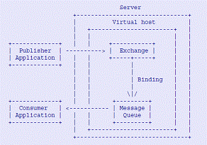
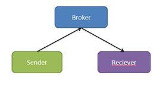

# 消息中间件 Apache Qpid 简介，第 1 部分
基本概念和示例

**标签:** 消息传递

[原文链接](https://developer.ibm.com/zh/articles/os-cn-qpid1/)

刘明

发布: 2011-12-12

* * *

## 引子，Qpid 使用场景

通信是一个基本的需求，正如人与人之间需要交流一样，比较大型的软件系统也往往需要内部或者外部通信。

在系统间通信最基础的通信方式是 socket，但 socket 比较底层。使用起来非常不易。如果需要一些高级特性，需要很多的编程负担。

与 socket 的原始对应，企业级的应用软件往往有着各种各样从简单到复杂的通信需求，表现为不同的通信模型。常见的有：

- 点对点：A 发消息给 B。
- 广播：A 发给所有其他人的消息
- 组播：A 发给多个但不是所有其他人的消息。
- Requester/response：类似访问网页的通信方式，客户端发请求并等待，服务端回复该请求
- Pub-sub：类似杂志发行，出版杂志的人并不知道谁在看这本杂志，订阅的人并不关心谁在发表这本杂志。出版的人只管将信息发布出去，订阅的人也只在需要的时候收到该信息。
- Store-and-forward：存储转发模型类似信件投递，写信的人将消息写给某人，但在将信件发出的时候，收信的人并不一定在家等待，也并不知道有消息给他。但这个消息不会丢失，会放在收信者的信箱中。这种模型允许信息的异步交换。
- 其他通信模型。。。

除了各类不同的通信模型之外，系统间的通信还有其他一些需要考虑的问题。比如企业级应用往往有巨量的数据需要交换，对可靠性的要求也比较高。比如一个分布式的财务处理软件，每时每刻都有成千上万的用户在使用，需要产生难以想象的海量消息，每个消息可能都关乎某人的银行账户等关键信息，如果丢失将带来巨大损失。编写这样一个通信中间件不是一件容易的事情，即使编写出来，假如需要和其他的软件系统交互信息，又需要大量的格式转换，接口迁移等工作。

为了解决以上这些问题，人们开发出了很多的软件产品和协议。从早期的 RPC，到复杂的面向消息的中间件 (MOM)，再到 JMS，人们取得了很多的进步，但是这些技术还是存在各自的问题。

RPC,Corba 等技术是同步的，即调用者必须等待对方的回复，这意味着调用者必须了解接收者，是一种紧耦合的模型。紧耦合意味着不灵活，而在软件行业唯一不变的就是变化，当需求和环境发生变化时，紧耦合的应用修改代价非常高。

为此众多的消息中间件产品应运而生，打破了消息生产者和消费者之间的紧耦合关系。但中间件产品是由各个厂商自行定义和实现的，在整合企业级应用的时候，人们发现各种应用往往采用了不同的技术和中间件产品，要想让这些产品互通消息，又是一件非常困难的事情。

JMS 是标准化的一种努力，但其缺点在于 JMS 是 J2EE 的标准，假如不是采用 Java 技术实现的产品，想使用 JMS 还是比较麻烦的。

因此即便到了今天人们还是希望有一款功能强大，平台 / 语言无关，标准化的面向消息的中间件产品。

假如这正是您时时刻刻所想的问题，那么 Qpid 便是您值得了解的一款开源软件。它实现了可靠复杂的通信中间件，支持多种通信模型，效率高，平台语言无关，而且实现了业界的通信标准 AMQP。

## AMQP 和 Qpid

AMQP 是 Advanced Message Queuing Protocol，即高级消息队列协议。和前面罗列的技术不同，AMQP 是一个标准化的消息中间件协议。她的理想是让不同语言，不同系统的应用互相通信，并提供一个简单统一的模型和编程接口。这样，人们就可以采用各种语言和平台来实现自己的应用，当需要和其他系统通信时，只要承认 AMQP 协议即可。

举个不太自然的例子吧。。。

世界各地的人们由于地理和历史的原因，使用着各种不同的语言，相互交流十分不易。AMQP 类似一架自动翻译机，当我用中文对它说了什么之后，假如一个英语世界的人想听的话，可以听到 **英文版** 的 **精确的** 一字不差的翻译。

此外这个翻译机还提供其他很多好处，比如中国和美国有 12 小时的时差，假如我现在希望和某个美国人通话，他必须半夜爬起来，或者我必须等到他起床，但通过这台机器，我说完就行了，那个美国人起床后就会听到的。我很放心，这句话绝不会丢掉，也绝不会走样；

我其实可以不关心有多少人来听，假如有更多的人都想听，那么他们也可以随时听到。

假如我只想让部分人听到，还可以加密认证；

假如有些人不想听，有些人想听，那么这台翻译机也能知道谁想听，而不会将我的声音发给不想听到的人。

这种交流方式和体验，作为一个人类我还不曾享受过，但是 AMQP 已经为 众多的计算机软件提供了这种服务。

AMQP 来自 JPMorgon，最初只是这个财大气粗的投行内部使用的消息中间件。发起人 John O’Hara 很有气魄，他说”从 1996 年开始到 2003 我一直在等这样一个标准，但始终没有等到，我已经等不下去了”，并且”投行对这类标准的需求最迫切，而银行又从来不缺乏技术专家” ，所以他自己开发了一个。我想一个人如果想成就什么事，就需要这样的英雄气概吧。

因为他的努力，AMQP 从金融界迅速推广到整个计算机行业，参与者包括了很多 IT 巨头。虽然今天 AMQP 依旧是一个草案，但值得我们拭目以待。

AMQP 的基本构架如下：

##### 图 1\. AMQP 系统构架



在 AMQP 模型中，消息的 producer 将 Message 发送给 Exchange，Exchange 负责交换 / 路由，将消息正确地转发给相应的 Queue。消息的 Consumer 从 Queue 中读取消息。

这个过程是异步的，Producer 和 Consumer 没有直接联系甚至可以不知道彼此的存在。

Exchange 如何进行路由的呢？

这便依靠 Routing Key，每个消息都有一个 routing Key，而每个 Queue 都可以通过一个 Binding 将自己所感兴趣的 Routing Key 告诉 Exchange，这样 Exchange 便可以将消息正确地转发给相应的 Queue。下表列出了这几个关键概念的定义。

##### 表 1\. AMQP 的几个概念

概念描述ProducerA program that writes messages to an _Exchange_. To do this, the program creates a message, fills the message with content, gives the message a _Routing Key_, and sends the message to an _Exchange_.Routing KeyA string that the _Exchange_ can use to determine to which _Queues_ the message should be delivered.ExchangeAccepts messages from _Producers_ and routes them to _Queues_ if the message meets the criteria expressed in a binding.BindingDefines the relationship between an _Exchange_ and a _Queue_, specifying which messages should be routed to a given _Queue_QueueHolds messages and delivers them to the _Consumers_ that subscribe to the _Queue_.ConsumerA program that reads messages from a _Queue_. A _Consumer_ can create, subscribe to, share, use, or destroy _Queue_ and their _Bindings_ (as long as it has have permission to do so).

为了支持各种常见的通信模型，AMQP 定义了不同的 Exchange 类型，如下表所示 :

##### 表 2\. AMQP 定义的 Exchange 类型

Exchange 类型路由行为Fan-OutMessages are routed to every Queue bound to the Exchange, ignoring the Routing KeyDirectA message is routed only if a _Queue’s Binding Key_ is the same as the message’s _Routing Key_TopicSimilar to a Direct Exchange, but it supports multipart keys that contain multiple words separated by the “.” delimiter; for instance, a message Producer can create messages with Routing Keys like usa.news, usa.weather, europe.news, and europe.weather.

AMQP 目前还是一个草案，最新版本是 0.10。

QPID 是 Apache Foundation 的一个开源项目，是一个 AMQP 实现。它提供了 C++ 和 Java 两个版本的 broker，并支持多种语言的客户端，它还包括一个配置工具集。

除了完全实现了 AMQP 的基本功能之外，Qpid 还提供了一些额外的特性：

- 采用 Corosync 来保证了集群环境下的 Fault-tolerant 特性
- 支持 XML 类型的 Exchange，当消息格式为 XML 时，可以利用 Xquery 进行过滤
- 支持 plugin，用户可以方便地增加新的功能，比如新的 exchange 类型
- 提供了安全认证特性，任何 producer/consumer 需要和 broker 通信时，都需要提供身份认证，以便防止恶意的不相干的程序进入消息体系。QPID 的安全认证使用 SSL 协议。

## 使用 Qpid 编程

目前 Qpid 的最新版本是 0.10。从 0.6 版本开始，Qpid 的编程接口有了很大变化，之前的编程接口虽然继续支持但已经过时。所以本文将掠过 0.5 的 API，直接介绍 Qpid Messaging API。

首先需要搭建一个实验环境。

### 安装

第一次看到 Qpid 的下载主页时，我有点儿不知所措。过去，当我需要试用一个开源软件时，在它的下载页面上通常会看到一个 tar 包，最多不过是根据目标操作系统的不同，分成几个 tar 包，只管下载相应的便可。但是 Qpid 的下载页面却有些让我困惑，竟有众多的按编程语言分类的 tar 包，一时之间也不知道下载哪个好。。。

如今似乎有些明白了，Qpid 是一个消息中间件，它大体分为两部分：broker 和 client 库。

先来看 Client 库，不同的编程语言，比如 Python，Ruby 等都需要其单独的 client 包。这个很容易理解。

但 broker，Qpid 竟也有两种实现 :C++ 和 Java。

Client 的选择比较容易，您熟悉哪种语言便选择哪个。但选择 Java 的 Broker 还是 C++ 的 broker 却会让新手有些犹豫，相比之下选择 KFC 还是麦当劳竟然是一件容易的事了。

java 版 broker 和 C++ 版 broker 各有优缺点，选择也是因人而异。他们之间大部分特性相同，但也有不同，比如 Java 版的支持更多的 AMQP 版本；而 C++ 版本则支持 RDMA。QPID 社区将逐渐消除这些差异，但正如可口可乐和百事可乐共同存在这个世界上一样，这两个 broker 也终究会各有个的拥趸。Qpid 社区的资深开发者 Gordon Sim 回答某初学者的帖子对此应该很有帮助： [http://fossplanet.com/f13/re-why-use-c-broker-versus-java-broker-71322/](http://fossplanet.com/f13/re-why-use-c-broker-versus-java-broker-71322/)

本人对 java 基本上没有什么了解，对 C++ 和 python 则非常偏爱，所以打算使用 C++ 版本的 broker，client 端则采用 C++ 和 Python。

下载 Qpid broker 的安装包，解压，编译，安装：

```
tar xzvf
./configure
make
make install

```

Show moreShow more icon

经过以上几步折腾，我们已经有了 C++ 的 broker 和 C++ 的 client 库了。如果您想用 Python 编写应用，那还需要下载 pyhonn 客户端的 tar 包。

可喜的是 Python 无需编译，因此所谓安装只是设置一些环境变量而已。

这里要提一下：如果您下载的是那个 full package，恐怕又需要费一点儿周折。该 package 包含了所有的东西 ( 各种语言的 broker 和 client)，其中虽然也有 C++ 的 broker，但竟然和单独下载的 C++ 包有所不同。到 cpp 目录下，您看不到 configure 可执行文件。需要首先运行 bootstrap，初始化 autotools。

Bootstrap 之后，autoconfig 所需的条件便准备好了，之后便是常规的几条安装命令，总的来说如下：

```
./bootstrap
./configure
make
make install

```

Show moreShow more icon

希望您的安装一切顺利。

### 启动 broker

最简单的启动方式为

```
qpidd --port=60302 --no-data-dir --auth=no

```

Show moreShow more icon

以上启动方式指定了三个主要的选项

–port 参数指定了 qpidd 监听的端口号，默认为 5672。

–no-data-dir 说明不需要指定数据持久化的目录；当然您也可以指定一个目录来存放持久化消息。

–auth=no 说明 qpidd 对所有的链接请求都不进行安全验证。

其他的启动参数在此不做详细说明，读者可以自行阅读 help 信息。

### 管理 qpid

默认情况下，Broker 启动之后，会自动创建一些 Exchange（交换器），对应 AMQP 标准定义的那几个标准的 exchange 类型。分别叫做

- amp.topic
- amp.direct
- amp.fanout

应用程序可以建立 queue 并绑定到这些默认的 exchange 上进行信息收发。不过在真实的应用环境下，人们往往需要更多的 exchange，queue 以及 binding 来满足各种各样的需求。或者在一些复杂的网络中还需要配置 broker 的联邦，即一个相互路由的 broker 网络。

凡此种种都需要对 broker 进行各种配置，比如添加新的 exchange，queue，添加 broker 路由等等，这些便需要使用 Qpid 提供的各种管理工具。除配置管理之外，Qpid 的管理工具还提供了监控功能。常用的工具有三个：

- Qpid-config
- Qpid-route
- Qpid-tool

Qpid-config 用来完成诸如添加 / 删除 Queue，添加 / 删除 Exchange 等关于 broker 内部的配置工作；Qpid-route 用来配置 broker Federation；Qpid-tool 用来对 Qpid Broker 进行实时监控。罗列他们的 help 信息对读者没有意义，我将在后面的例子中演示他们的一些用法。

### 程序代码的基本框架

在一个采用了消息中间件的通信体系中有三个基本的角色，一个是发送消息的进程，一个是接受消息的进程，他们彼此之间通过 broker 连接起来，传递消息。

##### 图 2\. 基本 Qpid 通信系统的几个组件



Broker 无需编写，如前所述，Qpid 实现了两种 Broker，您只需要根据需要启动其中之一既可。Sender 和 Receiver 则是需要用户编写的应用程序。这两类程序都有一些基本的框架，在此简要介绍一下。

首先他们都是 client，需要和 broker 进行连接。链接成功后便生成一个会话 Session。基本代码如下：

##### 清单 1\. 基本的 Qpid 程序框架

```
Connection connection(broker, connectionOptions);
    try {
        connection.open();
        Session session = connection.createSession();

。。。

        connection.close();
        return 0;
    } catch(const std::exception& error) {
        std::cerr << error.what() << std::endl;
        connection.close();
        return 1;
    }

```

Show moreShow more icon

在 0.5 版本之前，QPID 编程接口和 AMQP 的基本概念一一对应，比如需要创建 queue,exchange，用 routing key 进行绑定，等等。必须对 AMQP 的模型完全理解才能自如地动手写程序。

新的 Messaging API 将复杂的 AMQP 的细节全部都隐藏了起来，极大地简化了编程。

应用程序从而可以将注意力专注于如何处理他们接收到或者将要发出的消息本身，将 AMPQ 模型处理的细节交给 Qpid 库。如图 2 所示，在一个消息通信系统中只有 3 个基本角色，除了 broker 之外，就只有一个 Sender 一个 Receiver。应用程序看不到 Exchange 或者 Queue 这些细节。与此相应，在 Qpid 的 Messaging API 编程接口中，只有两个基本对象：Sender 和 Receiver。Sender 类，或者叫 Producer 生产者。即消息的发送方。Receiver 类自然就是信息的接收者，也叫做 Consumer。

这种抽象带来更好的功能可扩展性：各种各样的通信模型都经由修改 Sender 和 Receiver 的地址来实现，当需要修改通信模型时，也只需要修改 Address 和 broker 的配置，而无需修改应用的代码。

下面将详细介绍 Address 类。

### Address 地址

写信的时候，人们需要地址。类似地在 Qpid 中，表示消息的目的地，或者源。

Qpid Address 表示一个节点，有两种节点：一种是 queue，另外一种是 topic。Queue 节点能够缓存消息，直到被读取走为止；而 topic 节点则即时进行转发，比如假如有 4 个 consumer 对某消息感兴趣，当消息到达节点时，有 3 个 consumer 正在运行，那么 topic 节点会将消息转发给这 3 个 consumer，然后就将该消息丢弃。剩下的那个 consumer 再运行时，则收不到这个消息。

Qpid 的地址 Address 是一个带格式的字符串，其语法如下：

```
address_string ::= <address> [ / <subject> ] [ ; <options> ]
options ::= { <key> : <value>, ... }

```

Show moreShow more icon

其中 address，subject 和 key 都是字符串。

Subject 类似 email 的主题。每个消息都可以有一个主题，接收者可以通过主题对消息进行过滤。

Option 的具体含义有点儿复杂，可以参考 Qpid 的编程手册获取完整的描述。

了解了以上这些概念，就可以开始具体的编程了。和学习其他技术一样，我们从研究例子程序开始。Qpid 源代码包的 example 目录下有大量的例子程序，Messaging 目录下面是新的 Message API。我们主要研究 Message API 提供的 Spout 和 Drain 这两个例子程序。

### Spout 和 Drain 的代码

将 Spout 的主要代码精简一下如下：

##### 清单 2\. Spout 代码

```
int main(int argc, char** argv)
{
    Connection connection(options.url, options.connectionOptions);
    connection.open();
    Session session = connection.createSession();
    Sender sender = session.createSender(options.address);
    sender.send(message);
    session.sync();
    connection.close();
    return 0;
}

```

Show moreShow more icon

可以看到 spout 首先用命令行参数 Address 初始化一个 Sender 对象，然后用 Sender 的 send 方法发送消息。

对 Drain 做一些类似的事情：

##### 清单 3\. Drain 代码

```
int main(int argc, char** argv)
{
        Connection connection(options.url, options.connectionOptions);
        connection.open();
        Session session = connection.createSession();
        Receiver receiver = session.createReceiver(options.address);
        receiver.fetch(message, timeout))
        session.acknowledge();
        receiver.close();
        session.close();
        connection.close();
        return 0;
}

```

Show moreShow more icon

Drain 接收消息，用命令行参数中的 Address 初始化一个 Receiver 对象，然后调用 Receiver 的 fetch() 方法接收消息。收到消息后需要调用 session 的 acknowledge() 方法确认。

### 点对点通信小例子

PTP 通信类似写信。

其一，这种通信是异步的，人们把信发出去之后并不清楚何时能送到收信人的手中。在 Qpid 中，Sender 将消息发给 Broker，并不要求 Receiver 在消息发送的时候也有一个和 Broker 的链接并准备接受该消息。Sender 只管将消息发给 Broker，就可以放手去做其他的事情了；

其二，信是唯一的，您写给朋友的信一定不希望其他人也收到吧。在 Qpid 的 PTP 通信中，一个 Receiver 收到消息后，该消息就被消除，其他 Receiver 不能再收到。

下面用例子来说明这种通信模型。首先要建立一个 Queue 节点。如之前在 Address 一节所讲，Qpid 目前有两种 Address，一种叫做 Queue，一种叫做 Topic，我们这里就要用 Queue 这种节点。Queue 节点满足前面所说的两个重要的 PTP 通信的特征，存储转发和只接收一次。

创建一个 queue：

```
qpid-config add queue hello-world

```

Show moreShow more icon

现在我们建立了一个叫做 hello-world 的 queue。

用 spout 发送消息给地址 hello-world：

```
./spout hello-world

```

Show moreShow more icon

这就相当于将信发给了 hello-world。您已经看到，此时接收者 drain 还没有启动，但 Queue 的存储转发特性保证 drain 还是可以收到这条消息：

```
./drain hello-world
Message(properties={spout-id:fbb93f3... :0... )

```

Show moreShow more icon

当我们打开另外一个 shell 窗口执行 drain，会发现不会再收到这条消息了。

### Browse 模式 vs Consume 模式

一个有趣的的例子是如果我们修改一下 Address 的 Option，上面的通信模型就变成另外一种样子。之前我们看到，第二次执行 ./drain hello-world 将得不到任何信息，因为信息已经被第一次执行 ./drain 消费掉了。或者说这个 message 已经从 queue 里面移除了。这在 Qpid 中被称为消费模式 (Consume)。

有时候人们可能需要另外一种模式，叫做 Browse，即浏览。正如我们浏览网页上的新闻一样，一条新闻并不会因为第一个人阅读了它之后就被消费掉，从网页中消失了。而是一直在那里供人浏览。假如我们希望实现类似这种通信模式，不需要修改 spout 和 Drain 的代码，只需要稍微修改 Address 即可。Address 的选项 mode 可以用来设置 Browse 和 Consume 模式。如下例所示：

```
$ qpid-config add queue my-queue

```

Show moreShow more icon

建立一个 queue。

```
$ ./spout my-queue --content one
$ ./spout my-queue --content two
$ ./spout my-queue --content three

```

Show moreShow more icon

发送了三条消息，接着我们用 drain 来接收这些消息吧。请注意，我们对 Address 字符串进行了小小的修改，在名字之后加了一个分号，后面用花括号添加了一个 mode 选项，并设置该地址为 Browse 模式。

```
$ ./drain 'my-queue; {mode: browse}'
Message(properties={spout-id:fbb93f3... :0}, content='one')
Message(properties={spout-id:ab9e7c3... :0}, content='two')
Message(properties={spout-id:ea75d6e... :0}, content='three')

再运行一次：

$ ./drain 'my-queue; {mode: browse}'
Message(properties={spout-id:fbb93f... :0}, content='one')
Message(properties={spout-id:ab9e76... :0}, content='two')
Message(properties={spout-id:ea75d6... :0}, content='three')

```

Show moreShow more icon

`仅仅修改了` Address `的` Option `，我们就发现用` spout `和` Drain `可以实现另外一种通信模型了，这真是非常令人着迷的一个特性啊。`

### 编写 sub-pub 通信的例子

Pub-sub 是另一种很有用的通信模型。恐怕它的名字就源于出版发行这种现实中的信息传递方式吧，publisher 就是出版商，subscriber 就是订阅者。

这种模型的特点在于：其一，消息可以根据订阅的信息而转发给不同的订阅者；其二，消息并不存储，broker 收到消息后立即将其转发给当时正在注册的订阅者，假如某个订阅者当时并没有链接到 broker，那么它就不能再收到该消息了。没有多少人愿意购买几天前的旧报纸吧？这是和 Queue 的一个区别。

创建一个 Topic 节点：

```
qpid-config add exchange topic hello-world

```

Show moreShow more icon

还是用 spout 和 drain 来演示，先运行 spout：

```
./spout hello-world

```

Show moreShow more icon

再运行 drain

```
./drain hello-world

```

Show moreShow more icon

哦，什么也没有收到。这说明消息没有被 broker 缓存。

Pub-sub 的主要优点在于订阅消息的灵活性，broker 会根据消息的主题分发给不同的 subscriber。比如我们创建一个 news-service 的 exchange：

```
qpid-config add exchange topic hello-world

```

Show moreShow more icon

打开两个 shell 窗口，一个运行 drain 并订阅 news-service/sport，体育新闻；另一个订阅 news-service/ent 娱乐新闻：

```
$ ./drain -t 30 news-service/#.news
$ ./drain -t 30 news-service/#.ent

$ ./spout news-service/news
$ ./spout news-service/sports
$ ./spout news-service/usa.news
$ ./spout news-service/usa.sports
$ ./spout news-service/usa.faux.news
$ ./spout news-service/usa.faux.sports

```

Show moreShow more icon

可以看到不同的消息被自动分发给不同的订阅者。第一个 shell 接收 sport 的 drain 将打印：

```
Message(properties={qpid.subject:news, spout-id:cbd42b0f...
Message(properties={qpid.subject:usa.news, spout-id:234a78d7...
Message(properties={qpid.subject:usa.faux.news, spout-id:6029...

```

Show moreShow more icon

可另外一个接收 news 的 drain 程序将打印 :

```
Message(properties={qpid.subject:sports, spout-id:cbd42b0f...
Message(properties={qpid.subject:usa.sports, spout-id:234a78d7...

```

Show moreShow more icon

### 编写 Request/Response 模型的应用

在很多 P2P 和 Pub-Sub 应用中，Sender 和 Reciever 可以见面也不相识。他们多数情况下根本不关心对方是否存在。然而在现实中还有一种典型的通信模型：Request/Response。这种模型由 client 和 server 两部分组成，即人们常说的 C/S 模型。

Server 必须知道是谁发送了请求，以便回复给正确的 Requester。这是通过解析 Requester 发过来的消息中的 ReplyTo 字段得到的。

代码清单 4 展示的是 Server 的例子代码。

##### 清单 4\. Server 代码

```
Sender sender = session.createSender("service_queue");
Address responseQueue("#response-queue; {create:always, delete:always}");
Receiver receiver = session.createReceiver(responseQueue);
Message request;
request.setReplyTo(responseQueue);
request.setContent("ping");
sender.send(request);
Message response = receiver.fetch();
std::cout << request.getContent() << " -> " << response.getContent() << std::endl;

```

Show moreShow more icon

代码清单 5 展示的是 Client 的例子代码。

##### 清单 5\. Client 代码

```
Sender sender = session.createSender("service_queue");
Address responseQueue("#response-queue; {create:always, delete:always}");
Receiver receiver = session.createReceiver(responseQueue);
Message request;
request.setReplyTo(responseQueue);
request.setContent("ping");
sender.send(request);
Message response = receiver.fetch();
std::cout << request.getContent() << " -> " << response.getContent() << std::endl;

```

Show moreShow more icon

在 client 代码中，我们需要调用 Message 的 setReplyTo 方法，设置回复的地址。

代码清单展示的是 Client 的例子代码。

## 结束语

至此，我们看到了 Qpid 最基本的一些使用方法。演示了人们通常所使用的两类通信模式，传统的面向消息的中间件就实现了这两个通信模型。但 Qpid 提供了一种更简洁灵活的编程接口，仅通过修改 Address，无需修改代码就可以改变应用程序的通信模型。

Qpid 是一个 AMQP 的实现，这意味这它不是一个私有的产品，使用 Qpid，您可以和其他任何符合 AMQP 协议的软件系统进行通信。

不过假如这就是 Qpid 的全部，相信您一定也不以为然，如果这些还不足以打动您，那么我力图在下一部分中向您介绍 Qpid 的一些高级特性。