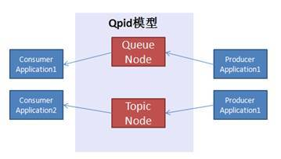
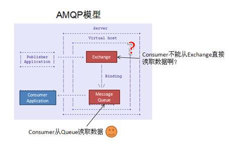
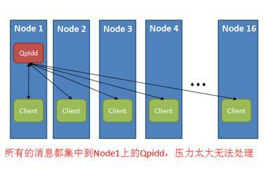
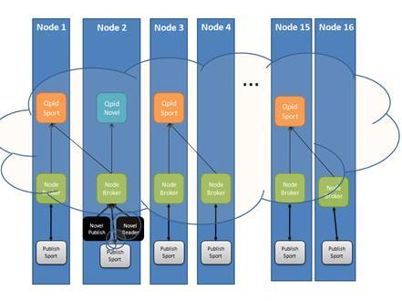
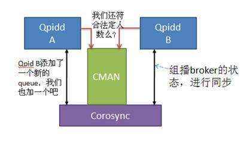
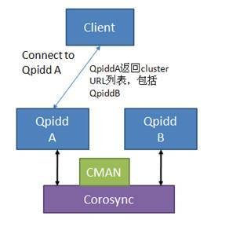
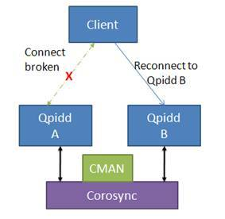

# 消息中间件 Apache Qpid 简介，第 2 部分
理解 Qpid 细节及高级特性

**标签:** 消息传递

[原文链接](https://developer.ibm.com/zh/articles/os-cn-qpid2/)

刘明

发布: 2011-12-22

* * *

## 引子

前一部分介绍了 Qpid 的概括，希望您已经了解什么是 Qpid，可以下载安装它，并自己亲手实验几个小例子。在第二部分，我想稍微深入 Qpid 内部，澄清一些概念，加深理解，并介绍 Qpid 的几个高级特性。

作为一个消息中间件，最重要的就是性能（吞吐量）和可靠性。

为了提高性能，Qpid 可以建立 Broker Federation 来进行负载均衡，C++ 版本的 Broker 还可以利用 RDMA 来提高信息传输的性能。

Qpid 采用了很多种技术来提高可靠性。比如将消息持久化，采用 broker 集群等。

这些特性使得 Qpid 成为集群环境下的一个高性能，高可靠性的消息中间件。

## 查看 Queue 节点和 Topic 节点的背后

首先，我打算澄清几个概念。

如前所述，使用 Qpid 编程时，使用两类地址节点：一种是 Queue，另外一种是 Topic。假如您没有使用过 Qpid0.5 版本的 API，可能对此并没有什么特别的疑问。但对于 Qpid 的老用户，熟悉了 AMQP 模型的人来说，可能会在这里有些困惑。在介绍一些高级特性之前，我觉得应该首先澄清这个困扰我很久的问题，因为它或许也是您的疑问吧。但假如您对此不感兴趣或没有疑问，请跳过本节。

Qpid 的文档中有如下介绍：Queue 映射到 AMQP 概念就是 Queue；而 Topic 则映射到 Exchange。

不知道您如何感觉，反正我花了很长的时间来理解这句话。因为按照 AMQP，Consumer 程序总是绑定到一个 Queue 上的，而不应该直接从 Exchange 接收消息。

语言有点儿贫乏，不如画张图吧，Qpid 的模型如下图所示：

##### 图 1\. Qpid 模型



在这个模型中，假如您想和 AMPQ 模型相比较对应，就会发现 Qpid 的 Queue 节点和 AMQP 的 Queue 相对应，这尚可以理解，

但 Topic 节点和 Exchange 对应就让人费解。在 AMQP 术语中，Topic 只是 Exchange 的一种，况且 Application 也不应该直接从 Exchange 中收发消息。难道 Qpid 不符合 AMQP 么？、

##### 图 2\. AMQP 模型



可以通过 Qpid-tool 来查看这两种 Node 背后的具体实现，进而理解 Qpid 的术语和 AMQP 术语的对应关系，因为毕竟 Qpid 是 AMQP 的一个实现。

先创建一个叫做 Hello-world 的 Queue：

```
bash-3.2$ ./qpid-config add queue hello-world

```

Show moreShow more icon

再用 Qpid-tool 查看到底新创建了什么东西？

```
bash-3.2$ qpid-tool

qpid: list queue
Object Summary:
    ID   Created   Destroyed  Index
    ================================================================
。。。在此省略一些输出
    148  05:30:22  05:30:24   135.topic-sqws29.23936.1
    160  05:30:24  -          135.hello-world
。。。在此省略一些输出

```

Show moreShow more icon

可以看到名为”hello-world”的 Queue 被建立了。再查看 binding 的情况：

```
qpid: list binding active
Object Summary:
    ID   Created   Destroyed  Index
    ==============================================================
    。。。在此省略一些输出
    301  05:40:31  -          115.314.hello-world

```

Show moreShow more icon

用 show 命令查看 bind ID 为 301 的详细情况：

```
qpid: show 301
    Attribute    301
    ==========================
    exchangeRef  115
    queueRef     314
    bindingKey   hello-world
    arguments    {}
    origin       None
    msgMatched   0

```

Show moreShow more icon

可以看到 Queue Hello-World 绑定到了 Exchange ID 为 115 的 Exchange。用 show 命令看看这个 exchange 吧：

```
qpid: show 115
    Attribute          115
    ===========================
    vhostRef           135
    name
    type               direct
    durable            False
    。。。在此省略一些输出

```

Show moreShow more icon

这是一个 direct 类型的 exchange。

至此，对于 Qpid 的 Queue 节点我们有了一个完整的认识。当创建一个 Queue 节点时，Qpid 会创建一个 AMQP Queue，和一个 Binding。缺省情况下用 Queue 的名字作为 RouteKey 和一个 Direct Exchange 进行绑定。

应用程序通过 Queue 进行消息收发操作。

这样我们就把 Qpid 的 Queue 和 AMQP 完全对应了起来。

那么 Topic 节点是怎么回事儿呢？

首先建立一个 Topic Exchange。看看会发生什么？

```
$qpid-config add exchange topic hello-world

```

Show moreShow more icon

用 qpid-tool 查看 exchange 的列表：

```
qpid: list exchange acrive
Object Summary:
    ID   Created   Destroyed  Index
    ==================================================
    115  05:25:13  -          135.
    116  05:25:13  -          135.amq.direct
    。。。在此省略一些输出
    123  05:33:14  -          135.hello-world

```

Show moreShow more icon

可以看到此时多了一个新的名字为 hello-world 的 exchange。

但假如您用 list queue，会发现并没有新的 queue 建立起来。难道应用程序真的直接和 Exchange 通信么？

当然不可能，启动一个应用程序看看吧：

```
./drain – t 60 hello-world

```

Show moreShow more icon

启动一个 Consumer 应用 Drain，其 Address 是一个 Topic 节点 hello-world。因为我们不发送消息，因此用 -t 选项指定了 60 秒的 timeout 时间，否则 Drain 会立即返回，我们没有时间查看 queue 和 exchange 的情况了。

在 drain 没有返回之前，我再次用 qpid-tool 查看了 queue 的情况：

```
qpid: list queue
Object Summary:
    ID   Created   Destroyed  Index
    ================================================================
。。。在此省略一些输出
    148  05:30:22  05:30:24   135.topic-sqws29.23936.1
    160  05:30:24  -          135.hello-world
    146  05:48:07  -          142.hello-world_4be25。。。d27b569
。。。在此省略一些输出

```

Show moreShow more icon

可以看到在 drain 运行期间，Qpid 建立了一个临时的 queue（上图的最后一行）。

并绑定到了 hello-world 这个 exchange 上。

```
qpid: list binding active
Object Summary:
    ID   Created   Destroyed  Index
    ===================================
    143  05:48:07  -          118.146.hello-world_4be25022-5956-4873-886d-76d59d27b569
    144  05:48:07  -          123.146.#
。。。在此省略一些输出

```

Show moreShow more icon

Binding 信息显示 Qpid 将 ID 为 123 的 exchange 和 ID 为 146 的 queue 通过 # 作为 RouteKey 绑定到了一起。

这下问题清楚了，当使用所谓 Topic 节点作为 Address 时，在底层，Qpid Client 库会自动建立所需要的 AMQP Queue 和 Binding。其底层依然符合 AMQP 的模型。只不过类似建立 binding，创建 Queue 等工作由 Qpid 的 client 库代劳了，应用程序无需考虑这些。

此外，通过这个例子，希望您也已经对 Qpid-tool 的使用有了一定的认识，在实践中，它将是 troubleshooting 的首要工具。

顺便说一下，这些工具都是 python 写的，在使用之前，需要配置 PYTHONPATH：

```
export PYTHONPATH=$qpid_dir/python: =$qpid_dir/extras/qmf/src/py

```

Show moreShow more icon

## Broker Federation

最简单的情况下，一个系统中有一个 broker 和众多的 producer 以及 consumer，这很简单。不过当 client 的数目增加，消息的数目增加，或者网络的复杂性增加之后，一个中心的 broker 可能会有很多问题：

- 比如负载过重，一个 broker 已经无法支撑众多的 client 和大量的消息
- 比如通信组件所在的网络在地理上分布很广，而人们希望本地消息可以被本地的 consumer 接受，以便更快速地有所反馈
- 等等

这些问题都可以采用 Federation 来解决。

Federation 就是一个 broker 的”云”，消息在 broker 云内部路由和分发负载，从而提高了吞吐率，也能够灵活配置路由达到消息分区的目的。

在本文中，我打算构建如下这样一个 Broker Federation:

在这个集群中，一共有 16 个节点。每个节点都将发送以下两类消息：

- 关于体育 Sport 的消息：这类消息的数量很多，订阅者 (Consumer) 也很多
- 关于文学欣赏的消息：这类消息的数量非常少，订阅者极少

我们可以采用单个 Broker 来处理转发所有的消息：

##### 图 3\. 单一 Broker 的构架



这么做的缺点在于 Node1 上的 Qpidd 将非常繁忙，如果消息继续增加，将出现丢包甚至停止服务的情况。这种情况下，我们可以采用 Federation 来均衡负载。

均衡负载的第一件事情是要详细分析这个消息系统，看看如何将消息处理均衡负载，划分出小的通信系统，将消息控制在小系统的合理范围内。

经过一些分析，人们会发现一些有趣的现象，比如消息本身的性质有很大不同：关于体育的消息非常多，而且每个 Node 上都有该消息的发布和接收者；而关于文学的则非常少，且只有少数节点上有对文学感兴趣的读者。让我们假设只有 Node2 上有对文学感兴趣的读者，也只有 Node2 上有对文学感兴趣的发送消息者。

针对这样一个系统，我们可以设计一个 Broker Federation 来均衡消息负载。

假设一个 Qpid Broker 能处理 2 个节点上的所有 sport 消息，那么我们可以让每两个 Node 共享一个处理 sport 消息的 broker。对于文学类的消息，则可以只在对文学感兴趣的 Node2 上启动 broker。这样就将负载均衡到多个不同的 Broker 上了。

但这样一个 Broker 的分布结构对 16 个节点上的 client 来说是不容易管理的，因为这意味这每个应用程序都必须知道相应的 broker 在哪个节点上。

一个通常的解决方法是在每个节点上设置一个 local node，client 只需要将消息发给 local node。而无需知道诸如文学 broker 在节点 2 上这样的条件。

Local node 通过 Federation 配置，将消息路由到正确的 broker。假如某一天网络拓扑需要改变，各个 client 程序无需修改。只需要重新配置路由即可。

这样的一个 Federation 如下图所示：

##### 图 4\. Broker Federation 的配置



底层灰白色的小方框代表对 Sport 感兴趣的应用程序，他们分布在所有的节点上。他们和同节点的 Node Broker 进行信息收发。Node broker 会把关于 Sport 的消息路由到相应的 Sport Broker 上。在这个 Federation 中，每两个节点共用一个 Sport broker，换句话说，一个 Sport broker 需要处理来自两个 Node 上的 Sports 消息，这比处理 16 个 Node 上所有的消息来说负载轻了很多。黑色的小方块代表少数几个对文学感兴趣的应用程序，他们目前都分布在 Node2 上。

采用这样的 Federation，可以实现各种各样的功能和网络拓扑，最终所有的 Broker 组成了一个 Broker 云为各种各样的应用提供消息转发服务。

设置 federation 的命令叫 Qpid-route。

Qpid 支持两类路由：Queue routes 和 Exchange Routes。

Queue route：目的地必须是 Exchange，源是一个 Queue。此类路由将源地址 Queue 收到的所有消息都转发到目的 Exchange 去

Exchange Route：目的地依然必须是一个 Exchange，源也是一个 Exchange。此类路由允许将源 Exchange 上收到的，拥有指定 RouteKey 的消息转发到目的 Exchange 上去。

Qpid 路由是单向的，但是可以配置为”pull route”或者”push route”。如果是”pull route”，那么实际上是目的地 Broker 需要不断地主动接收 (receive) 源 Broker 的消息；反之就是源 Broker 主动将消息发送 (Send) 到目的 Broker 去。这取决于谁更加空闲，因为主动发送 / 接收的一方需要更多的资源。在上面的例子中，每个 Node 上的 Broker 相对于处理 Sports 的 Broker 负载更低，因此应该选择”push route”，由 Node broker 主动将消息转发给 Sports broker。

为了配置上图所示的 Federation，我们需要运行下面这些假想的命令：

```
$ qpid-route – s route add node1:10001 node1:10002 amq.topic sports.#
$ qpid-route – s route add node2:10001 node1:10002 amq.topic sports.#
$ qpid-route – s route add node3:10001 node3:10002 amq.topic sports.#
...
$ qpid-route – s route add node16:10001 node15:10002 amq.topic sports.#

```

Show moreShow more icon

配置关于文学的路由：

```
$ qpid-route – s route add node2:10001 node2:10003 amq.topic novel.#

```

Show moreShow more icon

以上配置假设 Node broker 运行在端口 10001 上；Sports broker 运行在端口 10002 上；Novel Broker 运行在端口 10003 上。我们采用 Exchange 路由，采用源地址为 node broker 的”push route”方式。

## RDMA

RDMA 全称为”Remote Direct Memory Access”，它是一种协议，将数据从一台计算机的内存直接传输到另外一台计算机的内存中，而无需 CPU 的参与。类似 CPU 与外设之间的 DMA 传输，RDMA 将 DMA 的概念扩展到了网络。

显然 RDMA 技术将提高节点间信息传输的效率。采用 TCP/IP 进行网络传输时，数据需要在用户态和内核 buffer 之间进行拷贝，还需要经过很多协议处理，大量的 CPU 计算之后再到网络硬件上进行传输，而 RDMA 采用零拷贝技术将 CPU 解放出来，避免了内核 / 用户态的内存拷贝，从而提高了传输的吞吐量。

Qpid 作为消息中间件，需要大量的网络信息通信。C++ 版本的 Qpid broker 除了使用传统的 TCP/IP 作为网络通信机制之外，在拥有 infiniband 设备的集群上 Qpid 还可以使用 RDMA 进行网络通信。

目前，Qpid 基于 OFED 来实现 RDMA。当底层硬件支持 infiniband 等 RDMA 技术时，Qpid 便可以直接使用 RDMA 来进行网络信息传递。

利用 Qpid 使用 RDMA 非常简单，在启动 Broker 的时候需要 load rdma.so 这个模块，而客户端程序则需要修改环境变量来加载 rdmaconnector.so，

```
export QPID_LOAD_MODULE=<path to rdmaconnector.so>

```

Show moreShow more icon

此后客户端程序便可以修改连接字符串来使用 rdma 进行通信了，比如：

```
url = "n001:5672”;
Connection connection(url, ""{protocol: rdma}”);

```

Show moreShow more icon

使用 RDMA 需要在 Linux 中预留相当大的固定内存，因为 RDMA 要求 DMA 的 buffer 必须存在在 RAM 中，不能被交换到磁盘 swap 空间上去。

每一个 RDMA 连接需要 8M 的固定内存，假如您的 broker 需要支持 64 个连接，则需要在 /etc/security/limits.conf 中加入类似如下的配置行：

```
qpidd soft memlock 524288
     qpidd hard memlock 52428

```

Show moreShow more icon

目前 Qpid 采用 IPoIB 的方式提供 RDMA 通信，因此您必须为 Infiniband 卡配置 IP 地址。

## 持久化消息

消息从一个 client 发送出来，交给 Broker，然后 Broker 将其转发给相应的接收者。在这个过程中，假如 broker 进程被中断，那么保存在 Queue 中的消息就会丢失。为了避免这类信息丢失，人们可以选择将消息持久化。Broker 将收到的消息暂存在磁盘等可以永久保存信息的地方备用，这样，即使 Broker 因为某种意外而中断，当其再次重新启动之后，还是可以将保持在永久存储介质中的消息读出来并继续进行转发。

在我写这篇文章的时候，Qpid 正式版本为 0.8 版本。在这个版本的源代码中，还没有实现 persistent 存储的 plugin。必须从第三方下载相应的 plug-in。

在 Linux 下，可以使用 QpidComponents 项目提供的 plugin。这个插件，采用 Berkeley DB 作为后台数据库存储 Qpid 需要持久化的数据，在 License 方面和 Qpid 有所冲突，因此不能随 Qpid 一同发布。根据 Qpid 邮件列表中的讨论，已经有开发人员采用 MS SQL 写了插件，并将随 Qpid 源代码一同发布，让我们拭目以待吧。

但现在，我们必须先用 SVN 将代码 checkout 出来，然后编译，编译的前提条件是系统已经安装了以下几个软件：

```
- libaio-devel libs
 - qpid broker headers and libraries (see below)
 - all prerequisites for qpid (see qpid's cpp/INSTALL file)
 - berkeley db4  (tested with version 4.3.29)
 - python (to run system tests)

```

Show moreShow more icon

其中 2 和 3 在本文的第一部分介绍过安装方法，其他的几个第三方软件的安装则超出了本文的范围，您可以自行搜索。

```
svn checkout http://anonsvn.jboss.org/repos/rhmessaging/store/ -r 4411
./bootstrap
./configure --with-qpid-checkout=qpid-dir
make

```

Show moreShow more icon

其中 qpid-dir 就是完全版本 qpid 的顶层源代码目录。

现在我们就可以做实验了：

首先启动 Broker：

```
qpidd --load-module=/$path/msgstore.so --data-dir=/$pathd/store-files ...

```

Show moreShow more icon

创建一个 durable 的 Queue。就叫做 abc 吧。

```
./qpid-config add queue abc --durable

```

Show moreShow more icon

除了 Queue 需要 durable 之外，我们还必须保证发送的消息有 durable 属性。为此我们必须对 spout 例子程序进行一点儿修改，假如下面这一行代码，将消息设置为 durable 消息。

```
message.setDurable(true);

```

Show moreShow more icon

用 spout 发送数据。

```
[lm@ovispoly messaging]$ ./spout abc

```

Show moreShow more icon

现在将 qpidd 进程杀掉。然后重新启动 broker，最后再运行 drain 接受数据。

```
[lm@ovispoly messaging]$ ./drain abc
Message(properties={spout-id:cece972c-f194-4597-b0f4-7131f7bcb768:0,\
x-amqp-0-10.routing-key:abc}, content='')

```

Show moreShow more icon

可以看到，数据在 Qpidd 重启之后没有丢失。

持久化消息，提供了某种程度上的可靠性，但是在真正的 HA 环境下，这种简单的保护还无法满足要求。因为通信恢复的前提条件是被中断的 Broker 又重新启动。在生产环境中，有 HA 要求的系统往往对 downtime 也有很高的要求，对于用户来说 Broker 的中断应该是透明的。这便需要 Qpid 的 HA 特性，Broker 集群。

## 采用集群 broker 提供高可用性

作为消息中间件，Qpid broker 能高效地完成信息的转发任务，并提供极高的吞吐量，它采用多种设计来提高信息系统的可用性。然而，假如运行 Broker 的物理节点发生故障，比如掉电或者网络中断等事故，那么自然在该节点上运行的 broker 也无法继续提供服务了。

对于追求 HA 的用户，可以考虑采用 Qpid broker 集群来避免这类故障导致的服务中断。在一个 Qpid broker 集群中，所有的 broker 都互相备份，进行 fail over 的必要准备工作。每个 broker 的内部对象都同步到其他集群中的 Broker，保持一致，这样在单一 Broker 无法工作的情况下，client 可以切换到其他 Broker，而避免信息的丢失和服务中断。

Qpid 采用 Corosync 作为通信层，利用 Corosync，集群中的每一个 broker 都采用组播通信将自己的状态同步给集群中的其他 broker。

此外，Qpid 和 RHCS 紧密集成，它可以采用 CMAN 防止集群中的”脑裂”问题，也可以使用 rgmanager 自动重启 failed 的 Qpid。当然，不一定非要使用 RHCS 来搭建您的集群，也可以使用其他的 CRM 集群管理软件来管理 Qpidd。Qpidd 本身只是使用了 Corosync 来完成同步通信，可以使用 CMAN 来防止”脑裂”问题。

工作模式如下：

##### 图 5\. Qpid 和 Corosync 的工作模式



Qpidd A 和 QpiddB 通过 Corsync 同步，假如 Qpidd B 新建了一个 Queue，那么这个状态改变将通过 Corosync 发送给集群中的其他 broker，上图中的 Qpidd A 收到 Qpidd B 的状态改变消息，于是也添加一个新的 queue，保证和 Qpidd B 同步。这样，假如 Qpidd B 停止工作了，Qpidd A 可以继续提供同样的服务。

Qpid 还通过 CMAN 来防止集群中的”split brain”问题，CMAN 提供了 quorum 算法，Qpidd 利用 CMAN 的接口，知道自己是否能够达到法定人数，是否能够加入集群工作。

在一个 Qpid 集群中，每个 Qpid broker 都有自己独立的存储空间，并不像某些集群方案那样共享存储。Queue，Exchange 等都保存在每个 Broker 自己的存储空间中，通过 Corosync 同步彼此的状态。因为不需要共享存储，因此在 broker 集群中并不需要 Fence Device。

Qpid 集群是一个 Active/Active 模式的集群。客户端可以使用任意一个 broker。如下图所示：

##### 图 6\. Client 连接一个 Broker



当 client 连接到一个集群中的 broker 时，该 broker 返回给 Client 相应的 Broker URL 列表。在上图中，Client 将得到 [QpiddA,QpiddB] 这样一个列表。当 QpiddA 的连接断开时，客户端可以自动重新连接到 QpiddB 继续服务：

##### 图 7\. Client failover



**在集群中启动一个 broker**

启动集群中的 broker 只需要多设置几个命令行参数即可：

–cluster-name：指定 cluster 的名字，即 Corosync 中的 CPG 的名字。每个参加集群的 broker 都必须用同一个 cluster-name，以便假如同一个集群。

–cluster-size：指定 cluster 中节点的数目，假如指定了这个数字，在 broker 数目未达到的情况下，所有的 broker 都不能开始工作。

–cluster-url：返回给 client 端的 broker 列表。缺省情况下，broker 将返回集群中所有 broker 的列表，但假如指定了本参数，那么将只返回这里指定的 broker 列表。

–cluster-cman：指定使用 CMAN 来防止”split-brain”

**让 client 支持 failover**

让 client 支持 failover 十分容易，只需要在初始化的时候加入以下几行代码即可，Qpid 的客户端代码库，能够自动从 server 返回的消息中知道其他 active broker 的 url，当正在连接的 broker 失效时，Qpid 客户端能够自动连接其他的 broker。

##### 清单 1\. failover 代码

```
#include <qpid/messaging/FailoverUpdates.h>
...
Connection connection("localhost:5672");
connection.setOption("reconnect", true);
try {
connection.open();
std::auto_ptr<FailoverUpdates> updates(new FailoverUpdates(connection));

```

Show moreShow more icon

修改 Client 端代码，设置连接属性 reconnect，并构造一个 FailoverUpdates 对象。这样当一个 node 失效后，client 能够自动连接到其他的 broker 上。从而保证服务的连续。

## 结束语

本文并非编程手册，也不是一部傻瓜书。我只是想写下自己在学习 Qpid 过程中的一些心得，因为我困惑过，放弃过，经历了漫长的过程终于开始慢慢理解，这过程中的一些迷茫便促使我写下了这些东西。假如您想学习 Qpid，还须找一个 Qpid 的教程进行参考，不过在学习过程中，假如您遇到了相似的困惑，或许会觉得本文还有一点儿帮助。

写文章也有松耦合的优点，我就是一个 producer，将这篇文章发送出去，但绝不可能强迫您来读它。作为一个 subscriber，假如您不喜欢，便不需要读它，可以丢到垃圾桶里面。但假如您喜欢，那么我将非常欣慰！