# 深入了解 ActiveMQ Artemis 和 Qpid 以在企业中应用
ActiveMQ 和 Qpid 在 OpenShift 上的实现

**标签:** 云计算,消息传递

[原文链接](https://developer.ibm.com/zh/articles/cl-lo-activemq-artemis-and-qpid-to-apply-in-the-enterprise/)

魏新宇

发布: 2020-08-20

* * *

## 前言

笔者在《 [构建基于 OpenShift 面向生产的分布式消息和数据流平台](https://developer.ibm.com/zh/articles/cl-lo-building-distributed-message-platform-based-on-openshift/)》一文中，介绍了 ActiveMQ Artemis 和 Kafka 的基本架构、使用场景，并对两者的特点进行了对比。在本文中，我们将针对 ActiveMQ Artemis 和 Qpid 的具体特性展开更为深入的介绍。

## ActiveMQ Artemis 在企业中的应用

### 消息中间件在传统应用中的使用

传统 Java EE 的中包含 Java Messaging Service (JMS) API。在 Java EE 中，Message Driven Bean（简称 MDB）用于 Java EE 应用程序中各组件之间的异步通信，可用于接收与 Java 消息传递服务（JMS）兼容的消息，并根据接收消息的内容采取一些操作。

一旦 MDB 部署在应用程序服务器上，它将监听 JMS 消息，并为每个收到的消息执行一个操作（调用 MDB 的 onMessage 方法）。MDB 为应用程序开发提供事件驱动的松散耦合模型。MDB 最主要的目的是解耦系统，让两个系统可以通过以异步方式传递消息来进行通信，这确保了两个系统可以独立进化而不会相互影响。

ActiveMQ Artemis 作为消息中间件，其在分布式应用中主要是为了应用之间解耦。除此之外，ActiveMQ Artemis 支持客户端和 Broker 之间的 JMS 事务和 XA 事务，保证消息发送的事务一致性。

### ActiveMQ Artemis 企业级软件

红帽 JBoss AMQ 7 是一个轻量级，灵活且可靠的消息传递平台，可简化应用程序组件的集成以及工作负载扩展。AMQ 7 主要基于红帽主导的上游项目 Apache ActiveMQ 和 Apache Qpid。

JBoss AMQ 7 的关键组件包括：AMQ Clients、AMQ Interconnect、AMQ Broker、AMQ Console（基于 Hawtio），如下图 1 所示：

**图 1\. AMQ7 的架构**

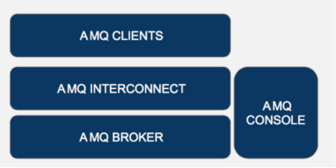

JBoss AMQ Client 支持如下方式：

- AMQ JMS：AMQ JMS 是一个客户端库，用于使用 Java 消息服务（JMS）2.0 在应用程序中发送和接收 AMQP 消息。
- AMQ JavaScript：AMQ JavaScript 是基于 Rhea 消息库的事件驱动的 Node.js 消息传递 API，允许用户编写客户端和服务器应用程序以交换 AMQP 消息。
- AMQ C ++：AMQ C ++消息传递库是一个事件驱动的 API，用于创建客户端、代理、路由器、网桥和代理。该库支持 AMQP 和本机数据类型之间的转换。与 AMQ JavaScript 一样，它支持点对点和代理消息传递样式以及自动重新连接，从而为标准网络协议提供可靠的网络连接。
- AMQ .Net：AMQ .Net 是.Net 框架的 API。与其他任何 AMQ 客户端一样，.Net 库支持以下功能：对标准协议的支持、对等和代理消息传递样式以及 AMQP 与本机数据类型之间的数据转换。
- AMQ Python：AMQ Python 是基于 Apache Qpid Proton API 的事件驱动的 AMQP 消息传递 API。

在介绍了 AMQ7 的架构后，接下来我们介绍 AMQ Broker 的 HA 和 Cluster。HA 解决的是 Broker 实例的高可用问题，比如在一个主 Broker 实例出现故障，由备用 Broker 接管客户端访问，继续工作。Cluster 解决的是多个 Broker 的负载均衡和分布式问题，HA 和 Cluster 可以结合使用。

### AMQ Broker 的 HA

AMQ Broker 的 HA 实现有两种：网络复制和共享消息存储两种。如下图 2 所示：

**图 2\. AMQ Broker 的两种 HA 模式**

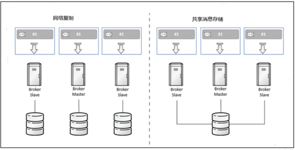

在网络复制模式下：Broker 之间的数据同步通过网络完成。在这种模式下，Master Broker 接受到的所有持久数据都将复制到 Slave Broker 中。当 Master Broker 出现故障时，Slave Broker 将会检测到 Master Broker 的故障，并开始运行。

在共享消息存储模式下，通过共享存储实现主从架构消息的存储落地，当 Master 节点出现故障时，应用切换到 Slave 节点，之前的消息通过共享存储仍可访问，不会丢失。

默认情况下，我们在一个 AMQ Broker 实例中创建 Queue，消息 Producer 可以将消息发送到 Queue 中，我们通常称这种为 Physical Queue。在 AMQ 中还存在 Logical Queue 的概念。也就是说，在多个 Physical queues 上创建一个 Logical Queue。我们将这个工作模式称为：Sharded Queues。在配置文件 BROKER\_INSTANCE\_DIR/etc/broker.xml，如清单 1 所示：

**清单 1\. Sharded Queue 配置**

```
<configuration ...>
<core ...>
    ...
    <addresses>
       <address name="sharded">
          <anycast>
             <queue name="q1" />
             <queue name="q2" />
             <queue name="q3" />
          </anycast>
       </address>
    </addresses>
</core>
</configuration>

```

Show moreShow more icon

这样，发送给 Shared Queue 的消息在 q1，q2 和 q3 之间平均分配。
在介绍了 AMQ Broker 的 HA 以后，接来下我们介绍 AMQ Broker 的 Cluster。

### AMQ Broker 的 Cluster

使用 AMQ Broker，群集使 Broker 可以组合在一起并共享消息处理负载。集群有许多好处：

- 多个 Broker 可以用不同的拓扑方式连在一起。
- 客户端连接可以在整个群集之间保持平衡。
- 可以重新分发消息以便 Broker 之间做大负载均衡。
- 客户端和 Broker 可以使用最少的信息连接到集群。

AMQ Broker 集群有两种模式：对称集群和链状集群。在对称群集中，群集中的每个节点都连接到群集中的每个其他节点。这意味着群集中的每个节点与其他每个节点相距不超过一跳。如下图 3 所示：

**图 3\. 对称集群**

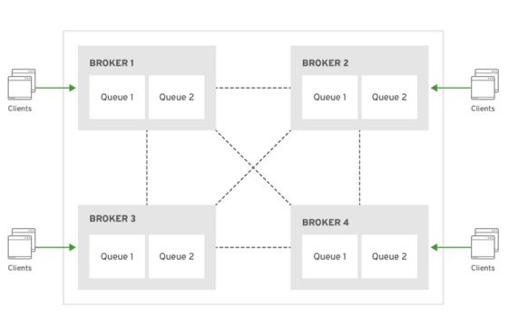

对称群集中的每个 Broker 都知道群集中，其它 Broker 上存在的所有队列，以及正在侦听这些队列的使用者。 因此，对称集群比链状集群能够更好地负载平衡和重新分配消息。

链状集群比对称集群配置复杂一些，但是当 Broker 位于单独的网络上且无法直接连接时，链状集群很有用。通过使用链状集群，中间 Broker 可以间接连接两个 Broker，以使消息在它们之间流动，即使两个 Broker 没有直接连接也是如此，如下图 4 所示：

**图 4\. 链状集群**

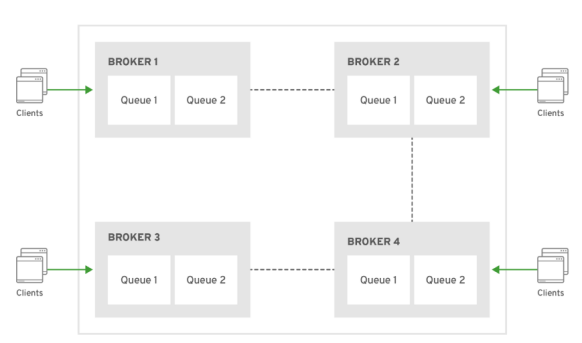

介绍了 AMQ Broker 的 HA 和 Cluster，接下来我们介绍在 OpenShift 上部署 AMQ Broker 的要点。

### 在 OpenShift 上部署 AMQ Broker

在 OpenShift 中，如果 AMQ 项目中正在运行两个或多个 Broker Pod，则 Pod 会自动形成一个 Broker Cluster。集群配置使 Broker 可以相互连接并根据需要重新分发消息，以实现负载平衡。具体的配置步骤可以参考红帽官网。

在 OpenShift 上部署 AMQ Broker，传统的 HA 模式无法实现。OpenShift 中，AMQ 的高可用是通过对一个 AMQ 创建多个 pod 来实现的，而无需通过 AMQ 本身的 HA 机制。当 AMQ 的一个 pod 出现问题，OpenShift 的 scaledown controller 可以实现 AMQ 的 HA。

在 OpenShift 中，StatefulSet 用于保证有状态应用。当 StatefulSet 发生 scaled down，有状态 pod 实例时会被删除，与被删除 pod 关联的 PersistentVolumeClaim 和 PersistentVolume 将保持不变。当 pod 新创建以后，PVC 会被重新挂在到 Pod 中，之前的数据可以访问。

但如果 AMQ 使用 Queue sharding，StatefulSet 的这种方式就不太合适。使用 sharding 的应用，当出现应用实例减少时，会要求将数据重新分发到剩余的应用程序实例上，而不是一直等待故障 pod 的重启。这种情况下就需要用到 StatefulSet Scale-Down Controller。StatefulSet Scale-Down Controller 允许我们在 StatefulSet 规范中指定 cleanup pod 的 template，该模板将用于创建一个新的 cleanup pod，该 cleanup pod 将挂在被删除的 pod 释放的 PersistentVolumeClain。cleanup pod 可以访问已删除的 pod 实例的数据，并且可以执行 app 所需的任何操作。cleanup pod 完成任务后，控制器将删除 pod 和 PersistentVolumeClaim，释放 PersistentVolume。如下图 5 所示：

**图 5\. AMQ Broker 在 OpenShift 上部署架构图**

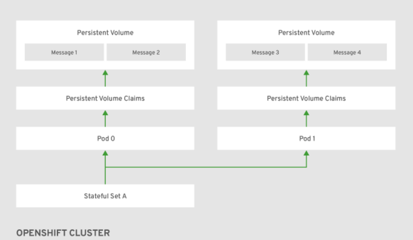

AMQ Broker 的部署在 OpenShift 3.11 中可以使用模板安装，在 OpenShift4 可以通过 Operator 部署。红帽 OpenShift 的 Operator Hub 提供 AMQ 的 Operator，如下图 6 所示：

**图 6\. 安装 AMQ Broker Operator**

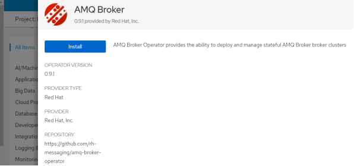

选择此前创建的 amq 项目，然后点击 Subscribe，如下图 7 所示：

**图 7\. 部署 AMQ Broker Operator**

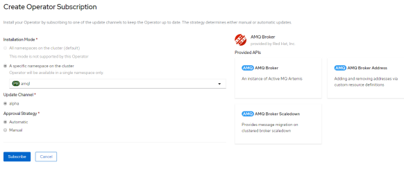

Operator 安装成功以后，会部署三个 API：AMQ Broker、AMQ Broker Address、AMQ Broker Scaledown，如下图 8 所示：

**图 8\. AMQ Operator 提供的三个 API**

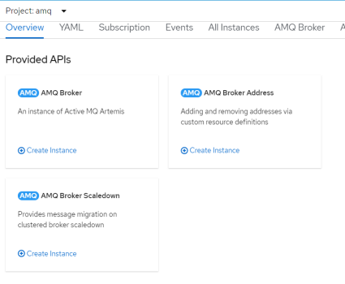

我们创建 AMQ Broker Instance，如下图 9 所示：

**图 9\. 创建 AMQ Broker 实例**

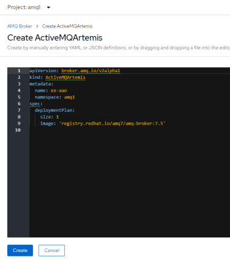

创建成功以后，可以看到 AMQ Broker 的实例，如下图 10 所示：

**图 10\. AMQ Broker 创建成功**

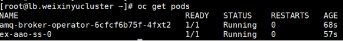

查看 AMQ Broker 的日志，如清单 2 所示：
`#oc logs -f ex-aao-ss-0`

**清单 2\. 查看 AMQ Broker 的日志**

```
2020-02-23 09:22:30,847 INFO  [io.hawt.web.RBACMBeanInvoker] Using MBean [hawtio:type=security,area=jmx,rank=0,name=HawtioDummyJMXSecurity] for role based access control
2020-02-23 09:22:30,976 INFO  [io.hawt.system.ProxyWhitelist] Probing local addresses ...
2020-02-23 09:22:30,978 INFO  [io.hawt.system.ProxyWhitelist] Initial proxy whitelist: [localhost, 127.0.0.1, 10.130.0.60, ex-aao-ss-0.ex-aao-hdls-svc.amq1.svc.cluster.local]
2020-02-23 09:22:31,289 INFO  [org.apache.activemq.artemis] AMQ241001: HTTP Server started at http://ex-aao-ss-0.ex-aao-hdls-svc.amq1.svc.cluster.local:8161
2020-02-23 09:22:31,290 INFO  [org.apache.activemq.artemis] AMQ241002: Artemis Jolokia REST API available at http://ex-aao-ss-0.ex-aao-hdls-svc.amq1.svc.cluster.local:8161/console/jolokia
2020-02-23 09:22:31,290 INFO  [org.apache.activemq.artemis] AMQ241004: Artemis Console available at http://ex-aao-ss-0.ex-aao-hdls-svc.amq1.svc.cluster.local:8161/console

```

Show moreShow more icon

查看 AMQ Broker 的 Statefulset，如下所示：

```
# oc get statefulset
NAME        READY   AGE
ex-aao-ss   1/1     4h49m

```

Show moreShow more icon

我们 ActiveMQArtemisScaledowns API，创建 Scaledown Controller，创建结果如下图 11 所示：

**图 11\. ActiveMQArtemisScaledowns 创建成功**

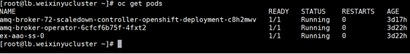

在介绍了 AMQ Broker 在 OpenShift 4 上的部署方式以后，接下来我们介绍 AMQ Interconnect。

## AMQ Interconnect

### AMQ Interconnect 的基本概念

AMQ Interconnect 是一种高速、低延迟的、用于 AMQP 协议的消息路由器（message router），用于构建大型消息网络。它可以通过网络中继和传输消息，并且具有很高的性能。AMQ Interconnect 通过允许发送方和接收方直接建立通讯来支持直接消息传递。AMQ Interconnect 允许通过部署多个路由器来形成路由网络，我们可以设置多种路由规则。

如果应用程序需要实时消息传递而无需 broker 来存储消息，则首选 Interconnect 消息传递模式。Interconnect 是一种轻型通道，可以直接连接两个终结点，然后转发消息。而 broker 是先存储消息然后转发。

AMQ Interconnect 主要有四种使用场景：Anycast、Multicast、Message Routed、Link Routed。
单波（Anycast）模式：消息发送者将消息发送给 router，速度快的接受者接收到消息，如下图 12 所示，这也是 Queue 的模式。

**图 12\. Anycast 模式**

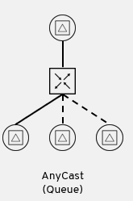

多播（Multicast）模式下：消息发送到路由器后，每个消费者收到一条消息，这是 Topic 的模式，如下图 13 所示：

**图 13\. Multicast 模式**

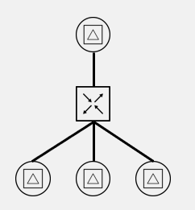

消息路由（Message Routed）模式下：当消息由发送者传递到第一个路由器时，路由器将从传递的消息接收者字段中提取地址，并在其路由表中查找该地址。查找将导致多个地址链接，消息将重新发送到该链接上，如下图 14 所示：

**图 14\. 消息路由**

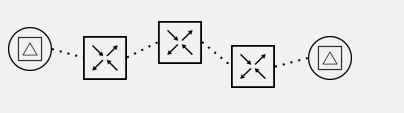

链接路由（Link Routed）模式下：链接路由使用与消息路由相同的路由表。区别在于路由发生在链接附加操作期间，并且链接附加沿着适当的路径传播到目标。最终消息传递的效果是：从源到目的地的、端到端连接的链接链，如下图 15 所示:

**图 15\. 消息路由**

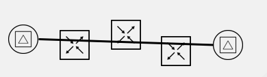

那么，AMQ Interconnect 和 AMQ Broker 有什么区别呢？详细对比如表 1 所示：

**表 1\. Broker 与 Interconnect 对比**

\BrokerRouter运行时JVMLinux支持协议AMQP、MQTT、STOMP、Openwire、HornetQAMQP一对一消息传递QueueAnycast一对多消息传递TopicMulticast保证消息传递由 Broker 保证由接受者保证消息所有权Broker 所有无所有权，直接路由消息高可用实现HA 或集群冗余拓扑

在介绍了 AMQ Interconnect，接下来我们通过具体的场景展示 AMQ Broker 和 Interconnect 的功能。

### 聚合消息

我们首先介绍聚合消息的使用场景。这种模式通常用于客户端很多，但 Broker 仅允许有限数量的连接的场景，如下图 16 所示。这种模式的优势在于：

- Interconnect 与 Broker 的单一连接保证了 broker 的安全
- 到 Router 网络的客户端连接数量不受限制
- Broker 可以对远程客户端保持匿名。
- 通过最小化连接减少 Broker 的负载

**图 16\. 聚合消息**

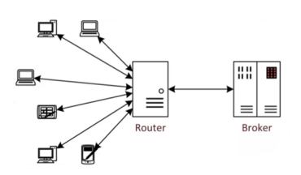

接下来，我们展示消息聚合场景。我们会先克隆测试代码，然后先部署和配置 Broker，再配置 Interconnect。

```
$  git clone https://github.com/gpe-mw-training/amqp-dispatch-workshop
Cloning into 'amqp-dispatch-workshop'...

$ cd /opt/amqp-dispatch-workshop

```

Show moreShow more icon

进行编译源代码，生成演示环境，如下图 17 所示：

**图 17\. 编译演示环境**

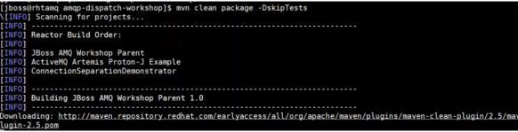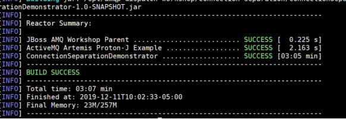

在开始使用 router 功能之前，首先通过使用 AMQP 二进制通信和 JBoss AMQ Broker 使两个 JMS 客户端异步交互，从而进行简单的 AMQP 有线协议通信。

转到 JBoss AMQ 7 安装目录：
`cd /opt/install/amq7`

创建一个名为 broker0 的 JBoss AMQ Broker 实例，并为访客用户和角色指定凭证：

```
$ ./bin/artemis create \
>     --user jboss --password jboss --role amq --allow-anonymous \
>     /opt/install/amq7/broker0
Creating ActiveMQ Artemis instance at: /opt/install/amq-broker-7.0.1/broker0

```

Show moreShow more icon

现在，我们在/opt/install/amq7/broker0 拥有一个 Broker 实例，该实例包含运行 JBoss AMQ 7 所需的库、配置和实用程序，执行结果如下图 18 所示：
`"/opt/install/amq7/broker0/bin/artemis-service" start`

**图 18\. 启动 AMQ Broker**

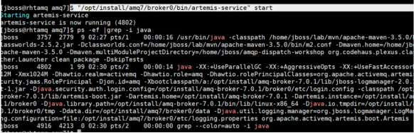

使用 JBoss AMQ 7 提供的 artemis 实用程序创建一个名为 gpteQueue 的持久队列。远程 JMS 客户端向该队列发送 JMS 消息并从中使用 JMS 消息。

创建一个名为 gpteAddress 的 Anycast 地址，执行结果如下图 19 所示：
`/opt/install/amq7/broker0/bin/artemis address create --name gpteAddress --anycast --no-multicast`

**图 19\. 创建 Anycast 地址**

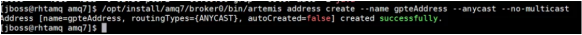

将持久性 anycast 队列与先前创建的地址相关联，执行结果如下图 20 所示：
`/opt/install/amq7/broker0/bin/artemis queue create  --name gpteQueue  --address gpteAddress  --anycast --durable --purge-on-no-consumers  --auto-create-address`

**图 20\. 队列绑定 Anycast 地址**

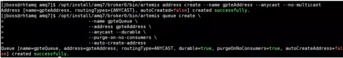

截止到目前，我们已经完成了 AMQ Broker 的创建。接下来，我们部署 Interconnect。

通过在 JBoss AMQ Broker 前面插入一个独立的 Interconnect Router 来实现连接聚合消息传递模式。这样，与后端 Broker 的就只有 router 这一个链接，以便支持大量的客户端连接。

我们在 RHEL 系统上执行以下命令，验证已经安装了 Qpid 的相关软件包，执行结果如下图 21 所示：`#yum list qpid-\* | more`

**图 21\. 查看 qpid 软件包**

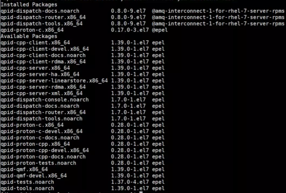

接下来，配置路由器配置文件：/etc/qpid-dispatch/qdrouterd.conf
配置文件的内容如清单所示，配置字段的解释以注释的方式写在了配置文件中。

配置文件第一段内容如清单 3 所示，其含义如下：

- mode 字段： 在[standalone, interior]两种中选其一，默认是 standalone 模式。
    在 standalone 模式下，路由器作为单个组件运行，并且不参与路由协议，这意味着它无法与其他路由器配合使用。在 interior 模式下，路由器与互连网络中的其他 router 协作运行。
- id 字段：路由的名称，本路由器取名为 exampleRoute。

**清单 3\. 路由配置第一段**

```
router {
mode: standalone
id: exampleRoute
workerThreads: 4
}

```

Show moreShow more icon

配置文件第二段内容如清单 4 所示，其含义如下：

- host 和 port 字段：router 用于监听 client connections 的端口
- role 字段：建立的连接可以是三种模式 [normal, inter-router, route-container]，默认是 normal。在 normal 角色中，假定该连接用于通过该连接进行正常消息传递的 AMQP 客户端。在 inter-router 的角色中，假定连接是与网络中的另一路由器的连接，并且路由器间的发现和路由协议只能在路由器间的连接上使用。route-container 角色可用于 router-container，例如，路 router-container 连接。

**清单 4\. 路由配置第二段**

```
listener {
    host: 0.0.0.0
    port: 2009
    authenticatePeer: no
    role: normal
    saslMechanisms: ANONYMOUS
}

```

Show moreShow more icon

配置文件第三段内容如清单 5 所示，其含义如下：

- prefix 字段：新 AMQP 地址的名称。
- waypoint 在 router 和 AMQ Broker 之间转发消息。可以在任一方向上建立连接，并且 waypoint 可以创建到外部过程中地址的多个发送方和/或接收方链接。

**清单 5\. 路由配置第三段**

```
address {
    prefix: closest
    distribution: closest
}

address {
    prefix: multicast
    distribution: multicast
}

address {
    prefix: unicast
    distribution: closest
}

address {
    prefix: exclusive
    distribution: closest
}

address {
    prefix: broadcast
    distribution: multicast
}

address {
    prefix: exampleAddress
    waypoint: yes
}

```

Show moreShow more icon

配置文件第四段内容如清单 6 所示，其作用是在调度路由器和 JBoss AMQ Broker 之间定义代理连接。name 是与 broker 连接的名字 host and port 是 JBoss AMQ Broker 的地址和端口号。role 设置成 route-container。

**清单 6\. 路由配置第四段**

```
connector {
    name: brokerConnector
    host: localhost
    port: 5672
    role: route-container
    allowRedirect: no
}

```

Show moreShow more icon

配置文件第五段内容如清单 7 所示，其作用是添加由 JBoss AMQ Broker 管理的 gpteAddress 的链接的 in 和 out：

**清单 7\. 路由配置第五段**

```
autoLink {
    addr: exampleAddress
    dir: in
    connection: brokerConnector
}

autoLink {
    addr: exampleAddress
    dir: out
    connection: brokerConnector
}

```

Show moreShow more icon

配置完毕后，启动路由器，执行结果如图 22 所示：
`systemctl restart qdrouterd.service`

**图 22\. 启动路由**

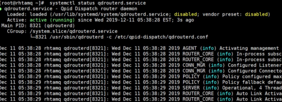

执行以下命令，以确保 dispatch-router 正在侦听所需的 socket （0.0.0.0:2009）：

```
# netstat -ntuapee | grep LISTEN | grep 2009
tcp        0      0 0.0.0.0:2009            0.0.0.0:*               LISTEN      996        106215     8321/qdrouterd

```

Show moreShow more icon

查看正在运行的 qdrouterd 服务的连接状态和统计信息，命令执行结果如图 23 所示：
`#qdstat -b 0.0.0.0:2009 -c`

**图 23\. 查看路由状态信息**

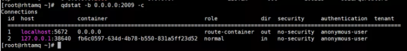

查看和跟踪来自 qdrouterd 服务的最新日志，命令执行结果如图 24 所示：
`#journalctl -u qdrouterd -n 200 -f`

**图 24\. 查看 qdrouterd 服务的最新日志**

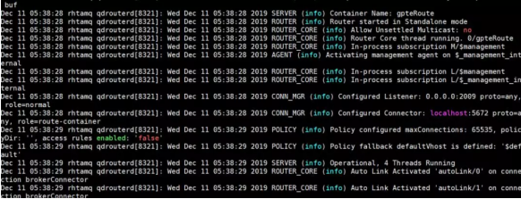

AMQ 7 管理控制台提供了一个界面，用于查看 AMQP 调度路由器网络的详细信息，例如您新启动的独立连接聚合路由器。AMQ 7 管理控制台中的调度路由器功能使用 WebSocket 与 AMQP 调度路由器网络进行通信。

启动一个 WebSocket 代理，以介于浏览器中运行的 WebSocket 客户端和分派路由器之间，命令执行结果如图 25 所示：

```
#websockify 0.0.0.0:5673 0.0.0.0:2009 &

```

Show moreShow more icon

**图 25\. 启动 WebSocket 代理**

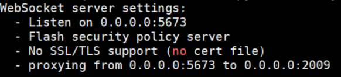

在 JBoss AMQ 7 管理控制台中，单击 Dispatch Router 选项，端口输入 5673，登录后如图 26 所示：

**图 26\. 查看拓扑**

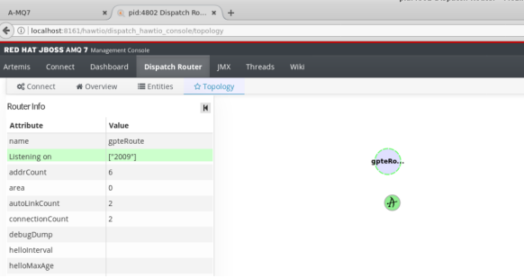

通过 AMQP 与侦听 `0.0.0.0:2009` 的调度路由器通信，通过 JMS 创建连接。修改源码：

```
vi
/opt/amqp-dispatch-workshop/simple-jms-request-response/src/main/java/org/apache/activemq/artemis/jms/example

```

Show moreShow more icon

将端口号改成 2009，如下图 27 所示：

**图 27\. 修改 JMS 连接**

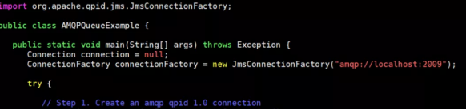

编译客户端：

```
#cd /opt/amqp-dispatch-workshop/simple-jms-request-response
#mvn clean package exec:java           -Dexec.mainClass="org.apache.activemq.artemis.jms.example.AMQPQueueExample"               -Dexec.cleanupDaemonThreads=false

```

Show moreShow more icon

需要注意的是，编译以后客户端访问的端口为 router 2009，不是访问 broker 的 5672，命令执行结果如下图 28 所示：

**图 28\. 通过 JMS 连接 router**

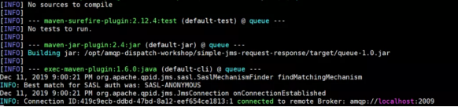

此时查看 AMQ console，可以看到 JMS client 已经到了 router 上，router 连接到了 Broker 上，实现了消息聚合的效果，如下图 29 所示：

**图 29\. 查看路由拓扑**

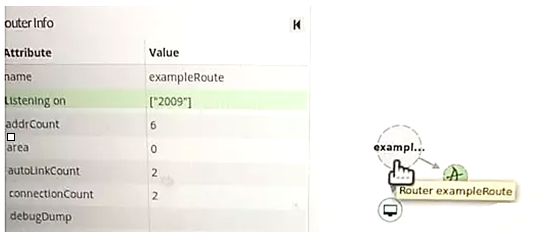

在介绍了消息聚合后，接下来我们介绍链式路由。

### 链状路由

链状路由架构如下图 30 所示，其特点为：

- 路由网络保证冗余和高可用。
- 路由网络在客户端之间提供智能路由。
- 路由器在设计上可以水平扩展。

**图 30\. 链状路由**

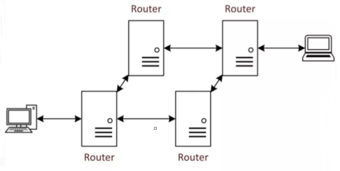

查看路由配置文件，如下图 31 所示：
`cd /opt/amqp-dispatch-workshop/router-network`

**图 31\. 查看路由配置目录**

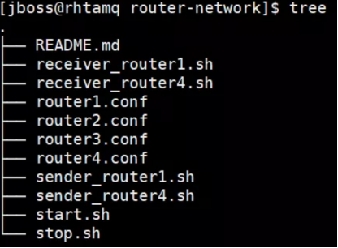

- 该项目包括所有四个调度路由器节点的和配置文件。
- 该项目包括两个用于启动 AMQP 消息使用方的 shell 脚本和另一个用于发送 AMQP 消息的 shell 脚本。
- 该项目包括启动分派路由器网络的 Shell 脚本。
- 没有 AMQP 代理的配置文件-这很有意义，因为该项目实现了路由器网络模式。

查看路由配置文件，我们接下来解读一下这个配置文件，如清单 8 所示。

**清单 8\. 查看 router1 配置文件**

```
# cat  router1.conf
router {
mode: interior
id: Router1
workerThreads: 4
}
#interior 代表这个 router 会跟其他的 router 通讯。

listener {
role: normal
host: 0.0.0.0
port: 5672
linkCapacity: 1000
}

listener {
role: inter-router
host: 0.0.0.0
port: 10001
}

listener {
role: normal
host: 0.0.0.0
port: 2009
linkCapacity: 1000
}

log {
module: DEFAULT
enable: trace+
timestamp: true
}

connector {
    role: inter-router
    host: router2
    port: 10002
    saslMechanisms: ANONYMOUS
}
#定义本 router 的下一个连接，仍然是个 router，router2
connector {
    role: inter-router
    host: router3
    port: 10003
    saslMechanisms: ANONYMOUS
}
#定义本 router 的下一个连接，仍然是个 router，router3
address {
     prefix: /myAddress
     distribution: closest
}

```

Show moreShow more icon

查看路由器启动脚本，start.sh 脚本作为 Docker 容器启动 AMQP 调度路由器网络的每个节点，如下图 32 所示：

- 该脚本将 ROUTER1\_OPTIONS 属性的值设置为所提供的 router1.conf 文件中所有内容的值。
- 它将 router1 的常规侦听器在其 Docker 容器（端口 2009）中绑定到主机 Red Hat Enterprise Linux 操作系统的端口 2009。
- 这允许您的 WebSocket 代理绑定到 router1 并收集管理数据以显示在 AMQ 7 管理控制台的“调度路由器”选项卡中。
- 它使 router1 可以形成与调度 router2 和 3 的连接。
- 它将 QDROUTERD\_CONFIG\_OPTIONS 设置为 ROUTER1\_OPTIONS 变量。
- 此配置将写入容器的/etc/dispatch-router.conf 文件。
- 它为 Docker Hub 中的自定义 qpid-dispatch Docker 映像设置了路径。

**图 32\. 查看路由器启动脚本**

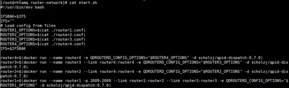

确保您的 WebSocket 代理仍在运行，然后启动路由器网络，如下图 33 所示：

**图 33\. 启动路由器**

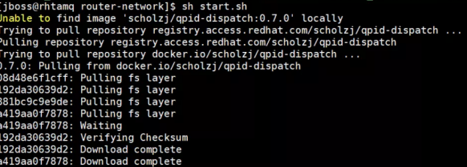

用相同的方式，启动其余的几个路由器。
使用 docker ps -a 命令查看正在运行的 Docker 容器，如下图 34 所示：

**图 34\. 查看启动的四个路由器**

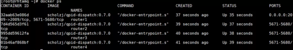

确保将 router1 绑定到主机操作系统的端口 2009，如下图 35 所示：

**图 35\. 查看 router1 绑定的主机端口**

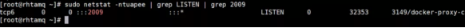

查看调度路由器网络拓扑，如下图 36 所示：

**图 36\. 查看路由拓扑**

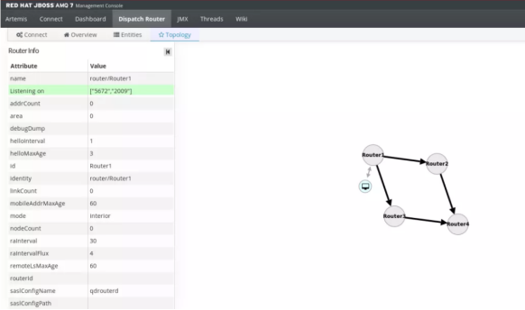

通过 AMQP 客户端发送和使用消息，这些客户端通过调度路由器网络从 qpid-cpp 生产者开始相互交互。

查看 sender\_router1.sh Shell 脚本，该脚本使消息发送者链接 router1，并向 router4 发送消息，命令执结果如下图 37 所示：

```
docker run \
       -e QPID_LOG_ENABLE=trace+ \
       --link router4:router4 \
       -t -i \
       scholzj/qpid-cpp:latest \
       qpid-send \
       -b router4:5672 --connection-options "{protocol: amqp1.0}" -a "myQueue1; {node: { type: queue }, create: never, assert: never}" -m 1 --content-string "Hello world on broker 1"

```

Show moreShow more icon

**图 37\. 查看消息发送**

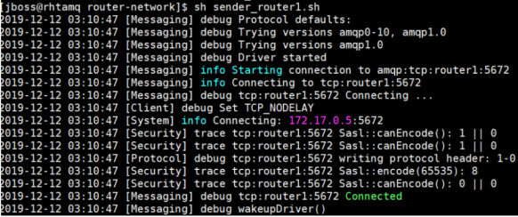

然后启动收消息的脚本，从 router4 接受消息。我们可以看到，发送给 router1 的消息可以从 router4 收到，证明链式路由配置成功，如下图 38 所示：

**图 38\. 查看 router4 接收消息**

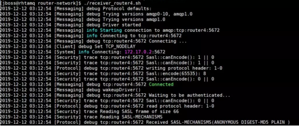

截止到目前，我们验证了链状路由。

### 在 OpenShift 上部署 AMQ Interconnect

在前文我们提到过，Interconnect 的运行时是 Linux。因此在 OpenShift 部署 Interconnect 的镜像的 Base Image 是 Linux。如下图所示 AMQ Interconnect 的 Docker File，如下图 39 所示：

**图 39\. AMQ Interconnect docker file**


在 OpenShft4 中，可以通过 Operator 的方式部署 AMQ Interconnect，如下图 40 所示：

**图 40\. 安装 AMQ Interconnect Operator**


具体的安装方式较为简单，不再展开说明。

我们可以使用模板的方式不是 AMQ Interconnect，具体步骤参考 [红帽官网](https://access.redhat.com/documentation/en-us/red_hat_amq/7.5/html/deploying_amq_interconnect_on_openshift/index)。

## 结束语

通过本文，相信您对 AMQ Broker 和 Interconnect 有了较为清晰的认识。随着分布式应用的普及，相信 AMQ 使用的将会越来越多。