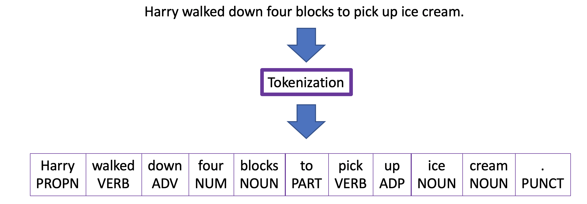
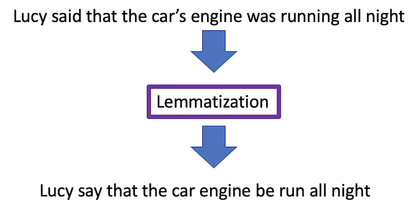
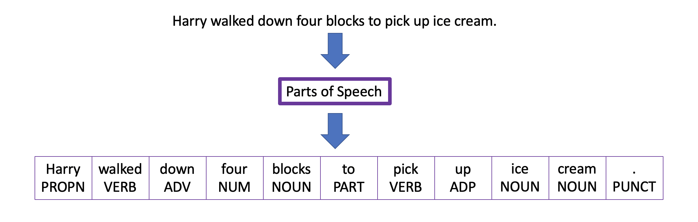
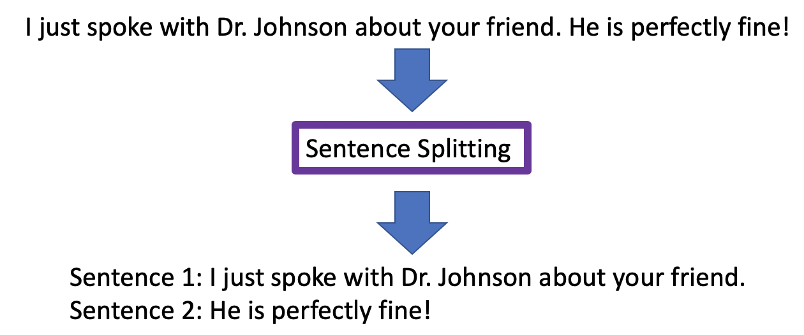

# 深入了解 Watson Natural Language Understanding 中的语法 API 功能
通过使用标记化、词形还原、词性和句子拆分从内容中提取更符合语义的信息

**标签:** Watson APIs,Watson Discovery,人工智能,机器学习,深度学习,自然语言处理

[原文链接](https://developer.ibm.com/zh/articles/a-deeper-look-at-the-syntax-api-feature-within-watson-nlu/)

Sean Sodha

发布: 2020-08-24

* * *

本文是 [自然语言处理入门](https://developer.ibm.com/zh/series/learning-path-get-started-with-natural-language-processing) 学习路径的一部分。

级别主题类型100[Watson 自然语言处理简介](https://developer.ibm.com/zh/articles/introduction-to-watson-natural-language-processing/)文章**101****[深入了解 Watson Natural Language Understanding 中的语法 API 功能](https://developer.ibm.com/zh/articles/a-deeper-look-at-the-syntax-api-feature-within-watson-nlu)**文章201[使用 Watson Natural Language Understanding 呈现非结构化数据](https://developer.ibm.com/zh/patterns/visualize-unstructured-text/)Code Pattern

## 自然语言处理简介

自然语言处理是指文本的解析和语义解释，让计算机能够学习、分析和理解人类语言。这些功能可以应用于某些用例，例如，文本挖掘、笔迹识别以及执行情感分析。Watson™ Natural Language Understanding 提供了高级文本分析功能。

Watson Natural Language Understanding 可以分析文本，并返回内容的五级分类体系以及概念、情感、情绪、实体和关系。使用新发布的语法 API 功能，用户可以通过使用标记化、词性、词形还原和句子拆分从内容中提取更符合语义的信息。下面我们来介绍一下这些子功能。

## 标记化

标记化是指将句子分为单词、短语或符号（统称为“标记”）的过程。这是在进行任何数据处理之前都必须执行的一个关键步骤。标记化实际上是对个人数据进行预处理，从而确定需要处理的基本单元。如果没有这些基本单元，就很难进行内容分析。



在大多数语言中，单词通常由空格分隔。标记化可以将单词和标点符号分开，并提供文本的基本结构。

## 词形还原

在文档内容中，可能存在同一个单词的多个形式，例如，run 和 running。这类单词及其各种形式只有在还原为最简单形式时才具有相似的含义。词形还原的目的是降低这类单词的复杂度，并将其分解为最简单的形式。



通过词形还原，可以将单词的较复杂版本分解为较简单的含义，同时仍传达相同的意思。利用词形还原，用户可通过将单词简化为最简单的形式来降低算法的复杂性。

## 词性

对短语进行标记化后，各个标记会按照特定的词性进行分类。Watson Natural Language Understanding 会使用所有语言的通用词性，包括名词、动词、形容词、代词、标点和专有名词。在执行自然语言处理时，词性非常重要，它可用于消除单词歧义，并有助于理解句子中每个单词背后的含义。



## 句子拆分

在许多情况下，用户必须知道句子在哪里结束以及下一句从哪里开始，从而避免与句子中的专用名词（如“Mr.”或“Mrs.”）相混淆。Watson Natural Language Understanding 可以确定句子在何种情况下表达了完整的意思，并可以判断该句在哪里结束以及下一句从哪里开始。



## 语法 API 请求示例

要使用 curl 命令调用语法 API，可使用您的 API 授权令牌来复制并粘贴以下代码。如果您不知道如何创建 API 授权令牌，则可以遵循 [这些说明](https://cloud.ibm.com/apidocs/natural-language-understanding/natural-language-understanding#authentication)。

```
curl --request POST \
  --url 'https://api.us-south.natural-language-understanding.watson.cloud.ibm.com/api/v1/analyze?version=2019-01-27' \
  --header "Authorization: Bearer {your token here}" \
  --header 'content-type: application/json' \
  --data '{
        "text": "Mr. Earl wasn't looking for his wallet.He's searching for his new scarf to fit his look.",
        "features": {
                "syntax": {
                        "sentences": true,
                        "tokens": {
                                "lemma": true,
                                "part_of_speech": true
                        }
                }
        },
        "language": "en"
}'

```

Show moreShow more icon

该 API 返回以下输出：

```
{
"usage": {
    "text_units": 1,
    "text_characters": 89,
    "features": 0
},
"syntax": {
    "tokens": [
      {
        "text": "Mr.",
        "part_of_speech": "PROPN",
        "location": [
          0,
          3
        ],
        "lemma": "Mr."
      },
      {
        "text": "Earl",
        "part_of_speech": "PROPN",
        "location": [
          4,
          8
        ],
        "lemma": "earl"
      },
      {
        "text": "was",
        "part_of_speech": "AUX",
        "location": [
          9,
          12
        ],
        "lemma": "be"
      },
      {
        "text": "n't",
        "part_of_speech": "PART",
        "location": [
          12,
          15
        ],
        "lemma": "not"
      },
      {
        "text": "looking",
        "part_of_speech": "VERB",
        "location": [
          16,
          23
        ],
        "lemma": "look"
      },
      {
        "text": "for",
        "part_of_speech": "ADP",
        "location": [
          24,
          27
        ],
        "lemma": "for"
      },
      {
        "text": "his",
        "part_of_speech": "PRON",
        "location": [
          28,
          31
        ],
        "lemma": "his"
      },
      {
        "text": "wallet",
        "part_of_speech": "NOUN",
        "location": [
          32,
          38
        ],
        "lemma": "wallet"
      },
      {
        "text": ".",
        "part_of_speech": "PUNCT",
        "location": [
          38,
          39
        ]
      },
      {
        "text": "He",
        "part_of_speech": "PRON",
        "location": [
          40,
          42
        ],
        "lemma": "he"
      },
      {
        "text": "'s",
        "part_of_speech": "AUX",
        "location": [
          42,
          44
        ],
        "lemma": "be"
      },
      {
        "text": "searching",
        "part_of_speech": "VERB",
        "location": [
          45,
          54
        ],
        "lemma": "search"
      },
      {
        "text": "for",
        "part_of_speech": "ADP",
        "location": [
          55,
          58
        ],
        "lemma": "for"
      },
      {
        "text": "his",
        "part_of_speech": "PRON",
        "location": [
          59,
          62
        ],
        "lemma": "his"
      },
      {
        "text": "new",
        "part_of_speech": "ADJ",
        "location": [
          63,
          66
        ],
        "lemma": "new"
      },
      {
        "text": "scarf",
        "part_of_speech": "NOUN",
        "location": [
          67,
          72
        ],
        "lemma": "scarf"
      },
      {
        "text": "to",
        "part_of_speech": "PART",
        "location": [
          73,
          75
        ],
        "lemma": "to"
      },
      {
        "text": "fit",
        "part_of_speech": "VERB",
        "location": [
          76,
          79
        ],
        "lemma": "fit"
      },
      {
        "text": "his",
        "part_of_speech": "PRON",
        "location": [
          80,
          83
        ],
        "lemma": "his"
      },
      {
        "text": "look",
        "part_of_speech": "NOUN",
        "location": [
          84,
          88
        ],
        "lemma": "look"
      },
      {
        "text": ".",
        "part_of_speech": "PUNCT",
        "location": [
          88,
          89
        ]
      }
    ],
    "sentences": [
      {
        "text": "Mr. Earl wasn't looking for his wallet.",
        "location": [
          0,
          39
        ]
      },
      {
        "text": "He's searching for his new scarf to fit his look.",
        "location": [
          40,
          89
        ]
      }
    ]
},
"language": "en"
}

```

Show moreShow more icon

## 结束语

语法 API 与 Watson Natural Language Understanding 中的其他功能（例如，实体、类别等）兼容。您可以将更多精力放在要执行自然语言处理的业务需求上，而不必担心语言模型的复杂性。目前，仅在实验版本中提供了语法 API。此功能可免费使用。

您可以在 [API 文档](https://cloud.ibm.com/apidocs/natural-language-understanding#syntax) 中阅读有关语法 API 的更多信息，然后试用 Watson Natural Language Understanding 的新语法功能。

本文是 [自然语言处理入门](https://developer.ibm.com/zh/series/learning-path-get-started-with-natural-language-processing) 学习路径的一部分。要继续学习，可以试用 [使用 Watson Natural Language Understanding 呈现非结构化数据](https://developer.ibm.com/zh/patterns/visualize-unstructured-text/) Code Pattern。

本文翻译自： [Look deeper into the Syntax API feature within Watson Natural Language Understanding](https://developer.ibm.com/articles/a-deeper-look-at-the-syntax-api-feature-within-watson-nlu/)（2019-03-04）