# 深入分析 Java I/O 的工作机制
Java 的 I/O 类库的基本架构、磁盘 I/O、网络 I/O 和 NIO 的工作机制等

**标签:** Java

[原文链接](https://developer.ibm.com/zh/articles/j-lo-javaio/)

许令波

发布: 2011-10-31

* * *

## Java 的 I/O 类库的基本架构

I/O 问题是任何编程语言都无法回避的问题，可以说 I/O 问题是整个人机交互的核心问题，因为 I/O 是机器获取和交换信息的主要渠道。在当今这个数据大爆炸时代，I/O 问题尤其突出，很容易成为一个性能瓶颈。正因如此，所以 Java 在 I/O 上也一直在做持续的优化，如从 1.4 开始引入了 NIO，提升了 I/O 的性能。关于 NIO 我们将在后面详细介绍。

Java 的 I/O 操作类在包 java.io 下，大概有将近 80 个类，但是这些类大概可以分成四组，分别是：

1. 基于字节操作的 I/O 接口：InputStream 和 OutputStream
2. 基于字符操作的 I/O 接口：Writer 和 Reader
3. 基于磁盘操作的 I/O 接口：File
4. 基于网络操作的 I/O 接口：Socket

前两组主要是根据传输数据的数据格式，后两组主要是根据传输数据的方式，虽然 Socket 类并不在 java.io 包下，但是我仍然把它们划分在一起，因为我个人认为 I/O 的核心问题要么是数据格式影响 I/O 操作，要么是传输方式影响 I/O 操作，也就是将什么样的数据写到什么地方的问题，I/O 只是人与机器或者机器与机器交互的手段，除了在它们能够完成这个交互功能外，我们关注的就是如何提高它的运行效率了，而数据格式和传输方式是影响效率最关键的因素了。我们后面的分析也是基于这两个因素来展开的。

### 基于字节的 I/O 操作接口

基于字节的 I/O 操作接口输入和输出分别是：InputStream 和 OutputStream，InputStream 输入流的类继承层次如下图所示：

##### 图 1\. InputStream 相关类层次结构（ [查看大图](image002.png) ）

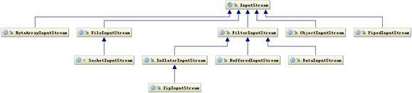

输入流根据数据类型和操作方式又被划分成若干个子类，每个子类分别处理不同操作类型，OutputStream 输出流的类层次结构也是类似，如下图所示：

##### 图 2\. OutputStream 相关类层次结构（ [查看大图](image004.png) ）

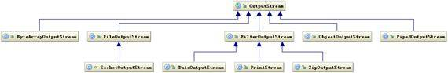

这里就不详细解释每个子类如何使用了，如果不清楚的话可以参考一下 JDK 的 API 说明文档，这里只想说明两点，一个是操作数据的方式是可以组合使用的，如这样组合使用

`OutputStream out = new BufferedOutputStream(new ObjectOutputStream(new FileOutputStream("fileName"))` ；

还有一点是流最终写到什么地方必须要指定，要么是写到磁盘要么是写到网络中，其实从上面的类图中我们发现，写网络实际上也是写文件，只不过写网络还有一步需要处理就是底层操作系统再将数据传送到其它地方而不是本地磁盘。关于网络 I/O 和磁盘 I/O 我们将在后面详细介绍。

### 基于字符的 I/O 操作接口

不管是磁盘还是网络传输，最小的存储单元都是字节，而不是字符，所以 I/O 操作的都是字节而不是字符，但是为啥有操作字符的 I/O 接口呢？这是因为我们的程序中通常操作的数据都是以字符形式，为了操作方便当然要提供一个直接写字符的 I/O 接口，如此而已。我们知道字符到字节必须要经过编码转换，而这个编码又非常耗时，而且还会经常出现乱码问题，所以 I/O 的编码问题经常是让人头疼的问题。关于 I/O 编码问题请参考另一篇文章 [《深入分析 Java 中的中文编码问题》](https://www.ibm.com/developerworks/cn/java/j-lo-chinesecoding/) 。

下图是写字符的 I/O 操作接口涉及到的类，Writer 类提供了一个抽象方法 write(char cbuf[], int off, int len) 由子类去实现。

##### 图 3\. Writer 相关类层次结构（ [查看大图](image006.png) ）

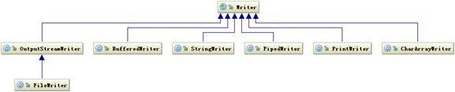

读字符的操作接口也有类似的类结构，如下图所示：

##### 图 4.Reader 类层次结构（ [查看大图](image008.png) ）

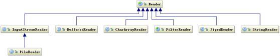

读字符的操作接口中也是 int read(char cbuf[], int off, int len)，返回读到的 n 个字节数，不管是 Writer 还是 Reader 类它们都只定义了读取或写入的数据字符的方式，也就是怎么写或读，但是并没有规定数据要写到哪去，写到哪去就是我们后面要讨论的基于磁盘和网络的工作机制。

### 字节与字符的转化接口

另外数据持久化或网络传输都是以字节进行的，所以必须要有字符到字节或字节到字符的转化。字符到字节需要转化，其中读的转化过程如下图所示：

##### 图 5\. 字符解码相关类结构

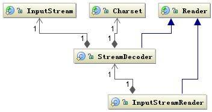

InputStreamReader 类是字节到字符的转化桥梁，InputStream 到 Reader 的过程要指定编码字符集，否则将采用操作系统默认字符集，很可能会出现乱码问题。StreamDecoder 正是完成字节到字符的解码的实现类。也就是当你用如下方式读取一个文件时：

##### 清单 1.读取文件

```
try {
            StringBuffer str = new StringBuffer();
            char[] buf = new char[1024];
            FileReader f = new FileReader("file");
            while(f.read(buf)>0){
                str.append(buf);
            }
            str.toString();
} catch (IOException e) {}

```

Show moreShow more icon

FileReader 类就是按照上面的工作方式读取文件的，FileReader 是继承了 InputStreamReader 类，实际上是读取文件流，然后通过 StreamDecoder 解码成 char，只不过这里的解码字符集是默认字符集。

写入也是类似的过程如下图所示：

##### 图 6\. 字符编码相关类结构

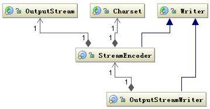

通过 OutputStreamWriter 类完成，字符到字节的编码过程，由 StreamEncoder 完成编码过程。

## 磁盘 I/O 工作机制

前面介绍了基本的 Java I/O 的操作接口，这些接口主要定义了如何操作数据，以及介绍了操作两种数据结构：字节和字符的方式。还有一个关键问题就是数据写到何处，其中一个主要方式就是将数据持久化到物理磁盘，下面将介绍如何将数据持久化到物理磁盘的过程。

我们知道数据在磁盘的唯一最小描述就是文件，也就是说上层应用程序只能通过文件来操作磁盘上的数据，文件也是操作系统和磁盘驱动器交互的一个最小单元。值得注意的是 Java 中通常的 File 并不代表一个真实存在的文件对象，当你通过指定一个路径描述符时，它就会返回一个代表这个路径相关联的一个虚拟对象，这个可能是一个真实存在的文件或者是一个包含多个文件的目录。为何要这样设计？因为大部分情况下，我们并不关心这个文件是否真的存在，而是关心这个文件到底如何操作。例如我们手机里通常存了几百个朋友的电话号码，但是我们通常关心的是我有没有这个朋友的电话号码，或者这个电话号码是什么，但是这个电话号码到底能不能打通，我们并不是时时刻刻都去检查，而只有在真正要给他打电话时才会看这个电话能不能用。也就是使用这个电话记录要比打这个电话的次数多很多。

何时真正会要检查一个文件存不存？就是在真正要读取这个文件时，例如 FileInputStream 类都是操作一个文件的接口，注意到在创建一个 FileInputStream 对象时，会创建一个 FileDescriptor 对象，其实这个对象就是真正代表一个存在的文件对象的描述，当我们在操作一个文件对象时可以通过 getFD() 方法获取真正操作的与底层操作系统关联的文件描述。例如可以调用 FileDescriptor.sync() 方法将操作系统缓存中的数据强制刷新到物理磁盘中。

下面以清单 1 的程序为例，介绍下如何从磁盘读取一段文本字符。如下图所示：

##### 图 7\. 从磁盘读取文件

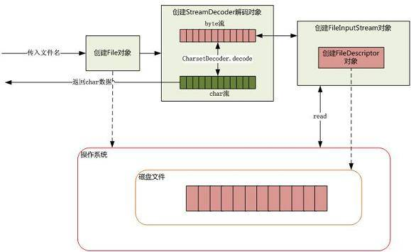

当传入一个文件路径，将会根据这个路径创建一个 File 对象来标识这个文件，然后将会根据这个 File 对象创建真正读取文件的操作对象，这时将会真正创建一个关联真实存在的磁盘文件的文件描述符 FileDescriptor，通过这个对象可以直接控制这个磁盘文件。由于我们需要读取的是字符格式，所以需要 StreamDecoder 类将 byte 解码为 char 格式，至于如何从磁盘驱动器上读取一段数据，由操作系统帮我们完成。至于操作系统是如何将数据持久化到磁盘以及如何建立数据结构需要根据当前操作系统使用何种文件系统来回答，至于文件系统的相关细节可以参考另外的文章。

## Java Socket 的工作机制

Socket 这个概念没有对应到一个具体的实体，它是描述计算机之间完成相互通信一种抽象功能。打个比方，可以把 Socket 比作为两个城市之间的交通工具，有了它，就可以在城市之间来回穿梭了。交通工具有多种，每种交通工具也有相应的交通规则。Socket 也一样，也有多种。大部分情况下我们使用的都是基于 TCP/IP 的流套接字，它是一种稳定的通信协议。

下图是典型的基于 Socket 的通信的场景：

##### 图 8.Socket 通信示例

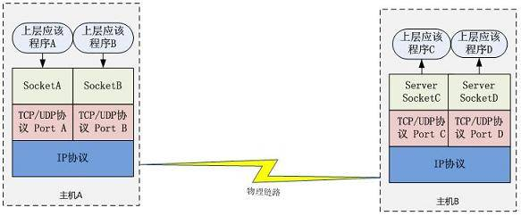

主机 A 的应用程序要能和主机 B 的应用程序通信，必须通过 Socket 建立连接，而建立 Socket 连接必须需要底层 TCP/IP 协议来建立 TCP 连接。建立 TCP 连接需要底层 IP 协议来寻址网络中的主机。我们知道网络层使用的 IP 协议可以帮助我们根据 IP 地址来找到目标主机，但是一台主机上可能运行着多个应用程序，如何才能与指定的应用程序通信就要通过 TCP 或 UPD 的地址也就是端口号来指定。这样就可以通过一个 Socket 实例唯一代表一个主机上的一个应用程序的通信链路了。

### 建立通信链路

当客户端要与服务端通信，客户端首先要创建一个 Socket 实例，操作系统将为这个 Socket 实例分配一个没有被使用的本地端口号，并创建一个包含本地和远程地址和端口号的套接字数据结构，这个数据结构将一直保存在系统中直到这个连接关闭。在创建 Socket 实例的构造函数正确返回之前，将要进行 TCP 的三次握手协议，TCP 握手协议完成后，Socket 实例对象将创建完成，否则将抛出 IOException 错误。

与之对应的服务端将创建一个 ServerSocket 实例，ServerSocket 创建比较简单只要指定的端口号没有被占用，一般实例创建都会成功，同时操作系统也会为 ServerSocket 实例创建一个底层数据结构，这个数据结构中包含指定监听的端口号和包含监听地址的通配符，通常情况下都是”\*”即监听所有地址。之后当调用 accept() 方法时，将进入阻塞状态，等待客户端的请求。当一个新的请求到来时，将为这个连接创建一个新的套接字数据结构，该套接字数据的信息包含的地址和端口信息正是请求源地址和端口。这个新创建的数据结构将会关联到 ServerSocket 实例的一个未完成的连接数据结构列表中，注意这时服务端与之对应的 Socket 实例并没有完成创建，而要等到与客户端的三次握手完成后，这个服务端的 Socket 实例才会返回，并将这个 Socket 实例对应的数据结构从未完成列表中移到已完成列表中。所以 ServerSocket 所关联的列表中每个数据结构，都代表与一个客户端的建立的 TCP 连接。

### 数据传输

传输数据是我们建立连接的主要目的，如何通过 Socket 传输数据，下面将详细介绍。

当连接已经建立成功，服务端和客户端都会拥有一个 Socket 实例，每个 Socket 实例都有一个 InputStream 和 OutputStream，正是通过这两个对象来交换数据。同时我们也知道网络 I/O 都是以字节流传输的。当 Socket 对象创建时，操作系统将会为 InputStream 和 OutputStream 分别分配一定大小的缓冲区，数据的写入和读取都是通过这个缓存区完成的。写入端将数据写到 OutputStream 对应的 SendQ 队列中，当队列填满时，数据将被发送到另一端 InputStream 的 RecvQ 队列中，如果这时 RecvQ 已经满了，那么 OutputStream 的 write 方法将会阻塞直到 RecvQ 队列有足够的空间容纳 SendQ 发送的数据。值得特别注意的是，这个缓存区的大小以及写入端的速度和读取端的速度非常影响这个连接的数据传输效率，由于可能会发生阻塞，所以网络 I/O 与磁盘 I/O 在数据的写入和读取还要有一个协调的过程，如果两边同时传送数据时可能会产生死锁，在后面 NIO 部分将介绍避免这种情况。

## NIO 的工作方式

### BIO 带来的挑战

BIO 即阻塞 I/O，不管是磁盘 I/O 还是网络 I/O，数据在写入 OutputStream 或者从 InputStream 读取时都有可能会阻塞。一旦有线程阻塞将会失去 CPU 的使用权，这在当前的大规模访问量和有性能要求情况下是不能接受的。虽然当前的网络 I/O 有一些解决办法，如一个客户端一个处理线程，出现阻塞时只是一个线程阻塞而不会影响其它线程工作，还有为了减少系统线程的开销，采用线程池的办法来减少线程创建和回收的成本，但是有一些使用场景仍然是无法解决的。如当前一些需要大量 HTTP 长连接的情况，像淘宝现在使用的 Web 旺旺项目，服务端需要同时保持几百万的 HTTP 连接，但是并不是每时每刻这些连接都在传输数据，这种情况下不可能同时创建这么多线程来保持连接。即使线程的数量不是问题，仍然有一些问题还是无法避免的。如这种情况，我们想给某些客户端更高的服务优先级，很难通过设计线程的优先级来完成，另外一种情况是，我们需要让每个客户端的请求在服务端可能需要访问一些竞争资源，由于这些客户端是在不同线程中，因此需要同步，而往往要实现这些同步操作要远远比用单线程复杂很多。以上这些情况都说明，我们需要另外一种新的 I/O 操作方式。

### NIO 的工作机制

我们先看一下 NIO 涉及到的关联类图，如下：

##### 图 9.NIO 相关类图

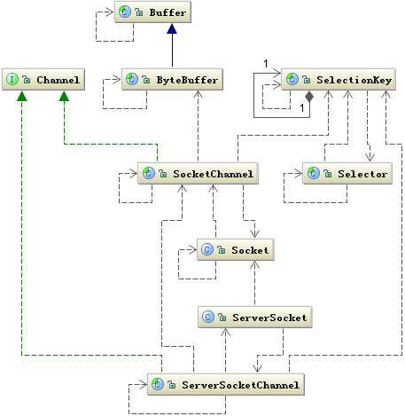

上图中有两个关键类：Channel 和 Selector，它们是 NIO 中两个核心概念。我们还用前面的城市交通工具来继续比喻 NIO 的工作方式，这里的 Channel 要比 Socket 更加具体，它可以比作为某种具体的交通工具，如汽车或是高铁等，而 Selector 可以比作为一个车站的车辆运行调度系统，它将负责监控每辆车的当前运行状态：是已经出战还是在路上等等，也就是它可以轮询每个 Channel 的状态。这里还有一个 Buffer 类，它也比 Stream 更加具体化，我们可以将它比作为车上的座位，Channel 是汽车的话就是汽车上的座位，高铁上就是高铁上的座位，它始终是一个具体的概念，与 Stream 不同。Stream 只能代表是一个座位，至于是什么座位由你自己去想象，也就是你在去上车之前并不知道，这个车上是否还有没有座位了，也不知道上的是什么车，因为你并不能选择，这些信息都已经被封装在了运输工具（Socket）里面了，对你是透明的。NIO 引入了 Channel、Buffer 和 Selector 就是想把这些信息具体化，让程序员有机会控制它们，如：当我们调用 write() 往 SendQ 写数据时，当一次写的数据超过 SendQ 长度是需要按照 SendQ 的长度进行分割，这个过程中需要有将用户空间数据和内核地址空间进行切换，而这个切换不是你可以控制的。而在 Buffer 中我们可以控制 Buffer 的 capacity，并且是否扩容以及如何扩容都可以控制。

理解了这些概念后我们看一下，实际上它们是如何工作的，下面是典型的一段 NIO 代码：

##### 清单 2\. NIO 工作代码示例

```
public void selector() throws IOException {
        ByteBuffer buffer = ByteBuffer.allocate(1024);
        Selector selector = Selector.open();
        ServerSocketChannel ssc = ServerSocketChannel.open();
        ssc.configureBlocking(false);//设置为非阻塞方式
        ssc.socket().bind(new InetSocketAddress(8080));
        ssc.register(selector, SelectionKey.OP_ACCEPT);//注册监听的事件
        while (true) {
            Set selectedKeys = selector.selectedKeys();//取得所有key集合
            Iterator it = selectedKeys.iterator();
            while (it.hasNext()) {
                SelectionKey key = (SelectionKey) it.next();
                if ((key.readyOps() & SelectionKey.OP_ACCEPT) == SelectionKey.OP_ACCEPT) {
                    ServerSocketChannel ssChannel = (ServerSocketChannel) key.channel();
                 SocketChannel sc = ssChannel.accept();//接受到服务端的请求
                    sc.configureBlocking(false);
                    sc.register(selector, SelectionKey.OP_READ);
                    it.remove();
                } else if
                ((key.readyOps() & SelectionKey.OP_READ) == SelectionKey.OP_READ) {
                    SocketChannel sc = (SocketChannel) key.channel();
                    while (true) {
                        buffer.clear();
                        int n = sc.read(buffer);//读取数据
                        if (n <= 0) {
                            break;
                        }
                        buffer.flip();
                    }
                    it.remove();
                }
            }
        }
}

```

Show moreShow more icon

调用 Selector 的静态工厂创建一个选择器，创建一个服务端的 Channel 绑定到一个 Socket 对象，并把这个通信信道注册到选择器上，把这个通信信道设置为非阻塞模式。然后就可以调用 Selector 的 selectedKeys 方法来检查已经注册在这个选择器上的所有通信信道是否有需要的事件发生，如果有某个事件发生时，将会返回所有的 SelectionKey，通过这个对象 Channel 方法就可以取得这个通信信道对象从而可以读取通信的数据，而这里读取的数据是 Buffer，这个 Buffer 是我们可以控制的缓冲器。

在上面的这段程序中，是将 Server 端的监听连接请求的事件和处理请求的事件放在一个线程中，但是在实际应用中，我们通常会把它们放在两个线程中，一个线程专门负责监听客户端的连接请求，而且是阻塞方式执行的；另外一个线程专门来处理请求，这个专门处理请求的线程才会真正采用 NIO 的方式，像 Web 服务器 Tomcat 和 Jetty 都是这个处理方式，关于 Tomcat 和 Jetty 的 NIO 处理方式可以参考文章《 Jetty 的工作原理和与 Tomcat 的比较》。

下图是描述了基于 NIO 工作方式的 Socket 请求的处理过程：

##### 图 10\. 基于 NIO 的 Socket 请求的处理过程

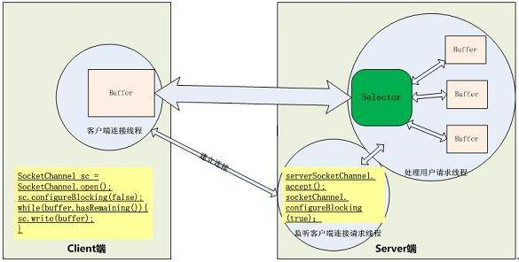

上图中的 Selector 可以同时监听一组通信信道（Channel）上的 I/O 状态，前提是这个 Selector 要已经注册到这些通信信道中。选择器 Selector 可以调用 select() 方法检查已经注册的通信信道上的是否有 I/O 已经准备好，如果没有至少一个信道 I/O 状态有变化，那么 select 方法会阻塞等待或在超时时间后会返回 0。上图中如果有多个信道有数据，那么将会将这些数据分配到对应的数据 Buffer 中。所以关键的地方是有一个线程来处理所有连接的数据交互，每个连接的数据交互都不是阻塞方式，所以可以同时处理大量的连接请求。

### Buffer 的工作方式

上面介绍了 Selector 将检测到有通信信道 I/O 有数据传输时，通过 selelct() 取得 SocketChannel，将数据读取或写入 Buffer 缓冲区。下面讨论一下 Buffer 如何接受和写出数据？

Buffer 可以简单的理解为一组基本数据类型的元素列表，它通过几个变量来保存这个数据的当前位置状态，也就是有四个索引。如下表所示：

##### 表 1.Buffer 中的参数项

**索引****说明**capacity缓冲区数组的总长度position下一个要操作的数据元素的位置limit缓冲区数组中不可操作的下一个元素的位置，limit<=capacitymark用于记录当前 position 的前一个位置或者默认是 0

在实际操作数据时它们有如下关系图：

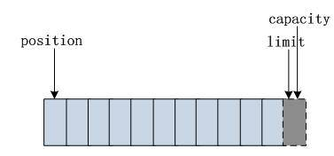

我们通过 ByteBuffer.allocate(11) 方法创建一个 11 个 byte 的数组缓冲区，初始状态如上图所示，position 的位置为 0，capacity 和 limit 默认都是数组长度。当我们写入 5 个字节时位置变化如下图所示：

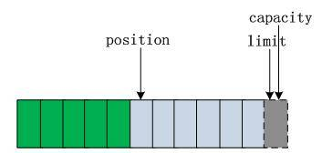

这时我们需要将缓冲区的 5 个字节数据写入 Channel 通信信道，所以我们需要调用 byteBuffer.flip() 方法，数组的状态又发生如下变化：

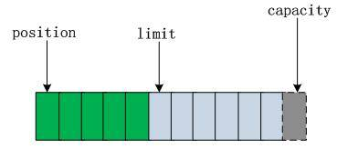

这时底层操作系统就可以从缓冲区中正确读取这 5 个字节数据发送出去了。在下一次写数据之前我们在调一下 clear() 方法。缓冲区的索引状态又回到初始位置。

这里还要说明一下 mark，当我们调用 mark() 时，它将记录当前 position 的前一个位置，当我们调用 reset 时，position 将恢复 mark 记录下来的值。

还有一点需要说明，通过 Channel 获取的 I/O 数据首先要经过操作系统的 Socket 缓冲区再将数据复制到 Buffer 中，这个的操作系统缓冲区就是底层的 TCP 协议关联的 RecvQ 或者 SendQ 队列，从操作系统缓冲区到用户缓冲区复制数据比较耗性能，Buffer 提供了另外一种直接操作操作系统缓冲区的的方式即 ByteBuffer.allocateDirector(size)，这个方法返回的 byteBuffer 就是与底层存储空间关联的缓冲区，它的操作方式与 linux2.4 内核的 sendfile 操作方式类似。

## I/O 调优

下面就磁盘 I/O 和网络 I/O 的一些常用的优化技巧进行总结如下：

### 磁盘 I/O 优化

**性能检测**

我们的应用程序通常都需要访问磁盘读取数据，而磁盘 I/O 通常都很耗时，我们要判断 I/O 是否是一个瓶颈，我们有一些参数指标可以参考：

如我们可以压力测试应用程序看系统的 I/O wait 指标是否正常，例如测试机器有 4 个 CPU，那么理想的 I/O wait 参数不应该超过 25%，如果超过 25% 的话，I/O 很可能成为应用程序的性能瓶颈。Linux 操作系统下可以通过 iostat 命令查看。

通常我们在判断 I/O 性能时还会看另外一个参数就是 IOPS，我们应用程序需要最低的 IOPS 是多少，而我们的磁盘的 IOPS 能不能达到我们的要求。每个磁盘的 IOPS 通常是在一个范围内，这和存储在磁盘的数据块的大小和访问方式也有关。但是主要是由磁盘的转速决定的，磁盘的转速越高磁盘的 IOPS 也越高。

现在为了提高磁盘 I/O 的性能，通常采用一种叫 RAID 的技术，就是将不同的磁盘组合起来来提高 I/O 性能，目前有多种 RAID 技术，每种 RAID 技术对 I/O 性能提升会有不同，可以用一个 RAID 因子来代表，磁盘的读写吞吐量可以通过 iostat 命令来获取，于是我们可以计算出一个理论的 IOPS 值，计算公式如下所以：

(磁盘数 _每块磁盘的 IOPS)/( 磁盘读的吞吐量 +RAID 因子_ 磁盘写的吞吐量 )=IOPS

这个公式的详细信息请查阅参考资料 [Understanding Disk I/O](http://blog.scoutapp.com/articles/2011/02/10/understanding-disk-i-o-when-should-you-be-worried) 。

**提升 I/O 性能**

提升磁盘 I/O 性能通常的方法有：

1. 增加缓存，减少磁盘访问次数
2. 优化磁盘的管理系统，设计最优的磁盘访问策略，以及磁盘的寻址策略，这里是在底层操作系统层面考虑的。
3. 设计合理的磁盘存储数据块，以及访问这些数据块的策略，这里是在应用层面考虑的。如我们可以给存放的数据设计索引，通过寻址索引来加快和减少磁盘的访问，还有可以采用异步和非阻塞的方式加快磁盘的访问效率。
4. 应用合理的 RAID 策略提升磁盘 IO，每种 RAID 的区别我们可以用下表所示：

##### 表 2.RAID 策略

**磁盘阵列****说明**RAID 0数据被平均写到多个磁盘阵列中，写数据和读数据都是并行的，所以磁盘的 IOPS 可以提高一倍。RAID 1RAID 1 的主要作用是能够提高数据的安全性，它将一份数据分别复制到多个磁盘阵列中。并不能提升 IOPS 但是相同的数据有多个备份。通常用于对数据安全性较高的场合中。RAID 5这中设计方式是前两种的折中方式，它将数据平均写到所有磁盘阵列总数减一的磁盘中，往另外一个磁盘中写入这份数据的奇偶校验信息。如果其中一个磁盘损坏，可以通过其它磁盘的数据和这个数据的奇偶校验信息来恢复这份数据。RAID 0+1如名字一样，就是根据数据的备份情况进行分组，一份数据同时写到多个备份磁盘分组中，同时多个分组也会并行读写。

### 网络 I/O 优化

网络 I/O 优化通常有一些基本处理原则：

1. 一个是减少网络交互的次数：要减少网络交互的次数通常我们在需要网络交互的两端会设置缓存，比如 Oracle 的 JDBC 驱动程序，就提供了对查询的 SQL 结果的缓存，在客户端和数据库端都有，可以有效的减少对数据库的访问。关于 Oracle JDBC 的内存管理可以参考《 Oracle JDBC 内存管理》。除了设置缓存还有一个办法是，合并访问请求：如在查询数据库时，我们要查 10 个 id，我可以每次查一个 id，也可以一次查 10 个 id。再比如在访问一个页面时通过会有多个 js 或 css 的文件，我们可以将多个 js 文件合并在一个 HTTP 链接中，每个文件用逗号隔开，然后发送到后端 Web 服务器根据这个 URL 链接，再拆分出各个文件，然后打包再一并发回给前端浏览器。这些都是常用的减少网络 I/O 的办法。
2. 减少网络传输数据量的大小：减少网络数据量的办法通常是将数据压缩后再传输，如 HTTP 请求中，通常 Web 服务器将请求的 Web 页面 gzip 压缩后在传输给浏览器。还有就是通过设计简单的协议，尽量通过读取协议头来获取有用的价值信息。比如在代理程序设计时，有 4 层代理和 7 层代理都是来尽量避免要读取整个通信数据来取得需要的信息。
3. 尽量减少编码：通常在网络 I/O 中数据传输都是以字节形式的，也就是通常要序列化。但是我们发送要传输的数据都是字符形式的，从字符到字节必须编码。但是这个编码过程是比较耗时的，所以在要经过网络 I/O 传输时，尽量直接以字节形式发送。也就是尽量提前将字符转化为字节，或者减少字符到字节的转化过程。
4. 根据应用场景设计合适的交互方式：所谓的交互场景主要包括同步与异步阻塞与非阻塞方式，下面将详细介绍。

**同步与异步**

所谓同步就是一个任务的完成需要依赖另外一个任务时，只有等待被依赖的任务完成后，依赖的任务才能算完成，这是一种可靠的任务序列。要么成功都成功，失败都失败，两个任务的状态可以保持一致。而异步是不需要等待被依赖的任务完成，只是通知被依赖的任务要完成什么工作，依赖的任务也立即执行，只要自己完成了整个任务就算完成了。至于被依赖的任务最终是否真正完成，依赖它的任务无法确定，所以它是不可靠的任务序列。我们可以用打电话和发短信来很好的比喻同步与异步操作。

在设计到 IO 处理时通常都会遇到一个是同步还是异步的处理方式的选择问题。因为同步与异步的 I/O 处理方式对调用者的影响很大，在数据库产品中都会遇到这个问题。因为 I/O 操作通常是一个非常耗时的操作，在一个任务序列中 I/O 通常都是性能瓶颈。但是同步与异步的处理方式对程序的可靠性影响非常大，同步能够保证程序的可靠性，而异步可以提升程序的性能，必须在可靠性和性能之间做个平衡，没有完美的解决办法。

**阻塞与非阻塞**

阻塞与非阻塞主要是从 CPU 的消耗上来说的，阻塞就是 CPU 停下来等待一个慢的操作完成 CPU 才接着完成其它的事。非阻塞就是在这个慢的操作在执行时 CPU 去干其它别的事，等这个慢的操作完成时，CPU 再接着完成后续的操作。虽然表面上看非阻塞的方式可以明显的提高 CPU 的利用率，但是也带了另外一种后果就是系统的线程切换增加。增加的 CPU 使用时间能不能补偿系统的切换成本需要好好评估。

**两种的方式的组合**

组合的方式可以由四种，分别是：同步阻塞、同步非阻塞、异步阻塞、异步非阻塞，这四种方式都对 I/O 性能有影响。下面给出分析，并有一些常用的设计用例参考。

##### 表 3\. 四种组合方式

**组合方式****性能分析**同步阻塞最常用的一种用法，使用也是最简单的，但是 I/O 性能一般很差，CPU 大部分在空闲状态。同步非阻塞提升 I/O 性能的常用手段，就是将 I/O 的阻塞改成非阻塞方式，尤其在网络 I/O 是长连接，同时传输数据也不是很多的情况下，提升性能非常有效。 这种方式通常能提升 I/O 性能，但是会增加 CPU 消耗，要考虑增加的 I/O 性能能不能补偿 CPU 的消耗，也就是系统的瓶颈是在 I/O 还是在 CPU 上。异步阻塞这种方式在分布式数据库中经常用到，例如在网一个分布式数据库中写一条记录，通常会有一份是同步阻塞的记录，而还有两至三份是备份记录会写到其它机器上，这些备份记录通常都是采用异步阻塞的方式写 I/O。 异步阻塞对网络 I/O 能够提升效率，尤其像上面这种同时写多份相同数据的情况。异步非阻塞这种组合方式用起来比较复杂，只有在一些非常复杂的分布式情况下使用，像集群之间的消息同步机制一般用这种 I/O 组合方式。如 Cassandra 的 Gossip 通信机制就是采用异步非阻塞的方式。 它适合同时要传多份相同的数据到集群中不同的机器，同时数据的传输量虽然不大，但是却非常频繁。这种网络 I/O 用这个方式性能能达到最高。

虽然异步和非阻塞能够提升 I/O 的性能，但是也会带来一些额外的性能成本，例如会增加线程数量从而增加 CPU 的消耗，同时也会导致程序设计的复杂度上升。如果设计的不合理的话反而会导致性能下降。在实际设计时要根据应用场景综合评估一下。

下面举一些异步和阻塞的操作实例：

在 Cassandra 中要查询数据通常会往多个数据节点发送查询命令，但是要检查每个节点返回数据的完整性，所以需要一个异步查询同步结果的应用场景，部分代码如下：

##### 清单 3.异步查询同步结果

```
class AsyncResult implements IAsyncResult{
    private byte[] result_;
    private AtomicBoolean done_ = new AtomicBoolean(false);
    private Lock lock_ = new ReentrantLock();
    private Condition condition_;
    private long startTime_;
    public AsyncResult(){
        condition_ = lock_.newCondition();// 创建一个锁
        startTime_ = System.currentTimeMillis();
    }
/*** 检查需要的数据是否已经返回，如果没有返回阻塞 */
public byte[] get(){
        lock_.lock();
        try{
            if (!done_.get()){condition_.await();}
        }catch (InterruptedException ex){
            throw new AssertionError(ex);
        }finally{lock_.unlock();}
        return result_;
}
/*** 检查需要的数据是否已经返回 */
    public boolean isDone(){return done_.get();}
/*** 检查在指定的时间内需要的数据是否已经返回，如果没有返回抛出超时异常 */
    public byte[] get(long timeout, TimeUnit tu) throws TimeoutException{
        lock_.lock();
        try{            boolean bVal = true;
            try{
                if ( !done_.get() ){
           long overall_timeout = timeout - (System.currentTimeMillis() - startTime_);
                    if(overall_timeout > 0)// 设置等待超时的时间
                        bVal = condition_.await(overall_timeout, TimeUnit.MILLISECONDS);
                    else bVal = false;
                }
            }catch (InterruptedException ex){
                throw new AssertionError(ex);
            }
            if ( !bVal && !done_.get() ){// 抛出超时异常
                throw new TimeoutException("Operation timed out.");
            }
        }finally{lock_.unlock();      }
        return result_;
}
/*** 该函数拱另外一个线程设置要返回的数据，并唤醒在阻塞的线程 */
    public void result(Message response){
        try{
            lock_.lock();
            if ( !done_.get() ){
                result_ = response.getMessageBody();// 设置返回的数据
                done_.set(true);
                condition_.signal();// 唤醒阻塞的线程
            }
        }finally{lock_.unlock();}
    }
}

```

Show moreShow more icon

## 结束语

本文阐述的内容较多，从 Java 基本 I/O 类库结构开始说起，主要介绍了磁盘 I/O 和网络 I/O 的基本工作方式，最后介绍了关于 I/O 调优的一些方法。