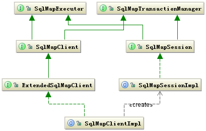
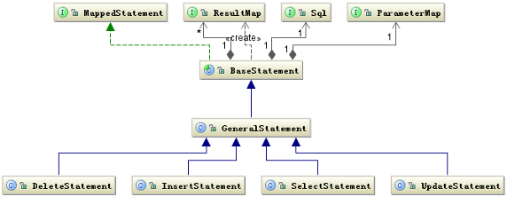
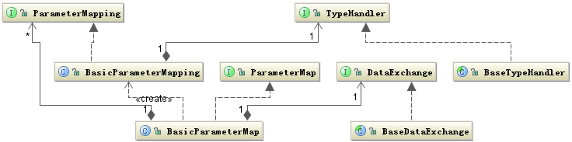
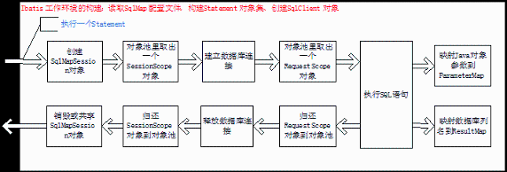
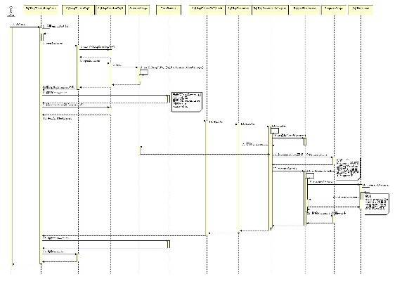
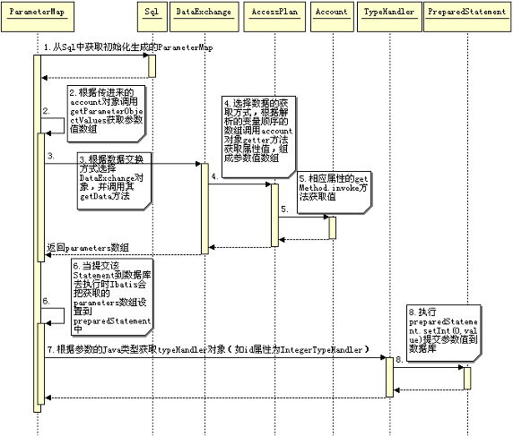
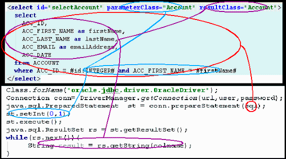

# 深入分析 iBATIS 框架之系统架构与映射原理
通过实例了解 iBATIS 框架的体系结构和运行流程

**标签:** Java

[原文链接](https://developer.ibm.com/zh/articles/j-lo-ibatis-principle/)

许令波

发布: 2010-11-08

* * *

## iBATIS 框架主要的类层次结构

总体来说 iBATIS 的系统结构还是比较简单的，它主要完成两件事情：

1. 根据 JDBC 规范建立与数据库的连接；
2. 通过反射打通 Java 对象与数据库参数交互之间相互转化关系。

iBATIS 的框架结构也是按照这种思想来组织类层次结构的，其实它是一种典型的交互式框架。先期准备好交互的必要条件，然后构建一个交互的环境，交互环境中还划分成会话，每次的会话也有一个环境。当这些环境都准备好了以后，剩下的就是交换数据了。其实涉及到网络通信，一般都会是类似的处理方式。

图 1 是 iBATIS 框架的主要的类层次结构图：

##### 图 1\. iBATIS 框架的主要的类层次结构图



上面的类图中左边 SqlMapClient 接口主要定义了客户端的操作行为包括 select、insert、update、delete。而右边主要是定义了当前客户端在当前线程的执行环境。SqlMapSession 可以共享使用，也可以自己创建，如果是自己创建在结束时必须要调用关闭接口关闭。

当使用者持有了 SqlMapClientImpl 对象就可以使用 iBATIS 来工作了。这里还要提到另外一个类 SqlMapExecutorDelegate 这个类从名字就可以看出他是执行代理类。这个类非常重要，重要是因为他耦合了用户端的执行操作行为和执行的环境，他持有执行操作的所需要的数据，同时提供管理着执行操作依赖的环境。所以他是一个强耦合的类，也可以看做是个工具类。

## iBATIS 框架的设计策略

iBATIS 主要的设计目的还是为了让我们执行 SQL 时对输入输出的数据管理更加方便，所以如何方便的让我们写出 SQL 和方便的获取 SQL 的执行结果才是 iBATIS 的核心竞争力。那么 iBATIS 是怎么实现它的核心竞争力的呢？

iBATIS 框架的一个重要组成部分就是其 SqlMap 配置文件，SqlMap 配置文件的核心是 Statement 语句包括 CIUD。 iBATIS 通过解析 SqlMap 配置文件得到所有的 Statement 执行语句，同时会形成 ParameterMap、ResultMap 两个对象用于处理参数和经过解析后交给数据库处理的 Sql 对象。这样除去数据库的连接，一条 SQL 的执行条件已经具备了。

图 2 描述了 Statement 有关的类结构图：

##### 图 2\. Statement 有关的类结构图



图 2 给出了围绕 SQL 执行的基本的结构关系，但是还有一个关键的部分就是，如何定义 SQL 语句中的参数与 Java 对象之间的关系，这其中还涉及到 Java 类型到数据库类型的转换等一系列问题。

数据的映射大体的过程是这样的：根据 Statement 中定义的 SQL 语句，解析出其中的参数，按照其出现的顺序保存在 Map 集合中，并按照 Statement 中定义的 ParameterMap 对象类型解析出参数的 Java 数据类型。并根据其数据类型构建 TypeHandler 对象，参数值的复制是通过 DataExchange 对象完成的。

图 3 是参数映射相关的类结构图：

##### 图 3\. 参数映射相关的类结构图



图 3 是输入参数的映射结构情况，返回结果 ResultMap 的映射情况也是类似的。主要就是要解决 SQL 语句中的参数与返回结果的列名与 Statement 中定义的 parameterClass 和 resultClass 中属性的对应关系。

## iBATIS 框架的运行原理

前面大体分析了 iBATIS 框架的主要类的结构，这里主要看一下这些类是如何串联起来、如何工作的。图 4 描述了整个过程的主要执行步骤。

##### 图 4.iBATIS 运行的主要执行步骤



上图中描述的 SqlMapSession 对象的创建和释放根据不同情况会有不同，因为 SqlMapSession 负责创建数据库的连接，包括对事务的管理，iBATIS 对管理事务既可以自己管理也可以由外部管理，iBATIS 自己管理是通过共享 SqlMapSession 对象实现的，多个 Statement 的执行时共享一个 SqlMapSession 实例，而且都是线程安全的。如果是外部程序管理就要自己控制 SqlMapSession 对象的生命周期。

图 5 是通过 Spring 调用 iBATIS 执行一个 Statement 的一个详细的时序图：

##### 图 5\. Spring 调用 iBATIS 执行一个 Statement 的时序图



iBATIS 的主要工作连接、交互，所以必须根据不同的交易成本设计不同的交易环境。

## 示例

下面我们将根据一个具体的实例解析一个 Statement 如何完成映射的，我们用一个典型的查询语句看看 Java 对象中的数据时如何赋给 SQL 中的参数的，再看看 SQL 的查询结果是如何转成 Java 对象的。

先看一下示例的部分代码和配置文件，完整的代码请看附件。

Spring 的 applicationContext 配置文件：

##### 清单 1\. applicationContext.xml

```
<beans>
    <bean id="sqlMapTransactionManager"
        class="org.springframework.jdbc.datasource.DataSourceTransactionManager">
        <property name="dataSource" ref="dataSource"/>
    </bean>
    <bean id="sqlMapTransactionTemplate"
        class="org.springframework.transaction.support.TransactionTemplate">
        <property name="transactionManager" ref="sqlMapTransactionManager"/>
    </bean>
    <!--sql map -->
    <bean id="sqlMapClient"
        class="org.springframework.orm.ibatis.SqlMapClientFactoryBean">
        <property name="configLocation" value="com/mydomain/data/SqlMapConfig.xml"/>
        <property name="dataSource" ref="dataSource"/>
    </bean>
    <bean id="dataSource" name="dataSource"
        class="org.apache.commons.dbcp.BasicDataSource" destroy-method="close">
        <property name="driverClassName" value="oracle.jdbc.driver.OracleDriver"/>
        <property name="url" value="jdbc:oracle:thin:@10.1.5.11:1521:XE"/>
        <property name="username" value="junshan"/>
        <property name="password" value="junshan"/>
        <property name="maxActive" value="20"/>
    </bean>
    <bean id="accountDAO" class="com.mydomain.AccountDAO">
        <property name="sqlMapClient" ref="sqlMapClient"/>
        <property name="sqlMapTransactionTemplate" ref="sqlMapTransactionTemplate"/>
    </bean>
</beans>

```

Show moreShow more icon

下面是 Account.xml 的一个 Statement：

##### 清单 2\. Account.xml 中一个 Statement

```
<select id="selectAccount" parameterClass="Account" resultClass="Account">
    select
      ACC_ID,
      ACC_FIRST_NAME as firstName,
      ACC_LAST_NAME as lastName,
      ACC_EMAIL as emailAddress,
      ACC_DATE
    from ACCOUNT
    where ACC_ID = #id:INTEGER# and ACC_FIRST_NAME = #firstName#
</select>

```

Show moreShow more icon

下面是 Java 的测试类：

##### 清单 3\. SimpleTest

```
public class SimpleTest {
    public static void main(String[] args) {
        ApplicationContext factory =
        new ClassPathXmlApplicationContext("/com/mydomain/data/applicationContext.xml");
        final AccountDAO accountDAO = (AccountDAO) factory.getBean("accountDAO");
        final Account account = new Account();
        account.setId(1);
        account.setFirstName("tao");
        account.setLastName("bao");
        account.setEmailAddress("junshan@taobao.com");
        account.setDate(new Date());
        try {
            accountDAO.getSqlMapTransactionTemplate().execute(new TransactionCallback(){
                    public Object doInTransaction(TransactionStatus status){
                        try{
                            accountDAO.deleteAccount(account.getId());
                            accountDAO.insertAccount(account);
                            //account.setLastName("bobo");
                            //accountDAO.updateAccount(account);
                            Account result = accountDAO.selectAccount(account);
                            System.out.println(result);
                            return null;
                        } catch (Exception e) {
                            status.setRollbackOnly();
                            return false;
                        }
                    }
                });
            //accountDAO.getSqlMapClient().commitTransaction();
         } catch (Exception e) {
             e.printStackTrace();
         }
     }
}

```

Show moreShow more icon

## iBATIS 对 SQL 语句的解析

这里所说的 SQL 解析只是针对 iBATIS 配置文件中所定义的 SQL 语句，如前一节中清单 2 中所示的查询语句。和标准的 SQL 语句不同的是，参数的赋值是”#”包裹的变量名。如何解析这个变量就是 iBATIS 要完成的工作。当然 SQL 的表达形式还有很多其他的形式如动态 SQL 等。

现在我们关心的是当我们执行：

##### 清单 4\. 执行查询方法

```
accountDAO.selectAccountById(account)

```

Show moreShow more icon

iBATIS 将会选择清单 2 这条 Statement 来解析，最终会把它解析成一个标准的 SQL 提交给数据库执行，并且会设置两个选择条件参数。这个过程中参数映射的细节是什么样子呢？

在前面的第二小节中已经说明了，iBATIS 会把 SqlMap 配置文件解析成一个个 Statement，其中包括 ParameterMap、ResultMap，以及解析后的 SQL。当 iBATIS 构建好 RequestScope 执行环境后，要做的工作就是把传过来的对象数据结合 ParameterMap 中信息提取出一个参数数组，这个数组的顺序就是对应于 SQL 中参数的顺序，然后会调用 preparedStatement.setXXX(i, parameter) 提交参数。

在清单 3 中，我们给 account 对象的 id 属性和 firstName 属性分别赋值为 1 和”tao”，当执行清单 4 中的这段代码时，iBATIS 必须把这两个属性值传给清单 2 中 SQL 语句中对象的参数。这个是怎么做到的，其实很简单，在图 3 中描述了与 ParameterMap 相关的类的关系，这些类中都保存了在 SqlMap 配置文件初始化是解析清单 2 中 Statement 的所有必要的信息，具体的信息是这样的：

最终的 SQL 语句是：

##### 清单 5\. 解析后的 SQL

```
select
    ACC_ID,
    ACC_FIRST_NAME as firstName,
    ACC_LAST_NAME as lastName,
    ACC_EMAIL as emailAddress,
    ACC_DATE
from ACCOUNT
where ACC_ID = ? and ACC_FIRST_NAME = ?

```

Show moreShow more icon

`#id:INTEGER#` 将被解析成 JDBC 类型是 INTEGER，参数值取 Account 对象的 id 属性。`#firstName#` 同样被解析成 Account 对象的 firstName 属性，而 parameterClass=”Account” 指明了 Account 的类类型。注意到清单 5 中 `#id:INTEGER#` 和 `#firstName#` 都被替换成”？”，iBATIS 如何保证它们的顺序？在解析清单 2 过程中，iBATIS 会根据”#”分隔符取出合法的变量名构建参数对象数组，数组的顺序就是 SQL 中变量出现的顺序。接着 iBATIS 会根据这些变量和 parameterClass 指定的类型创建合适的 dataExchange 和 parameterPlan 对象。parameterPlan 对象中按照前面的顺序保存了变量的 setter 和 getter 方法列表。

所以 parameter 的赋值就是根据 parameterPlan 中保存的 getter 方法列表以及传进来的 account 对象利用反射机制得到清单 5 对应的参数值数组，再将这个数组按照指定的 JDBC 类型提交给数据库。以上这些过程可以用图 6 的时序图清楚的描述：

##### 图 6\. 映射参数值到数据库过程时序图



上图 4 中在 8 步骤中如果 value 值为空时会设置 preparedStatement.setNull(i , jdbcType) 如果在清单 2 中的变量没有设置 jdbcType 类型时有可能会出错。

## 数据库字段映射到 Java 对象

数据库执行完 SQL 后会返回执行结果，在第 4 小节的例子中满足 id 为 1、firstName 为”tao”的信息有两条，iBATIS 如何将这两条记录设置到 account 对象中呢？

和 ParameterMap 类似，填充返回信息需要的资源都已经包含在 ResultMap 中。当有了保存返回结果的 ResultSet 对象后，就是要把列名映射到 account 对象的对应属性中。这个过程大体如下：

根据 ResultMap 中定义的 ResultClass 创建返回对象，这里就是 account 对象。获取这个对象的所有可写的也就是 setter 方法的属性数组，接着根据返回 ResultSet 中的列名去匹配前面的属性数组，把匹配结果构造成一个集合（resultMappingList），后面是选择 DataExchange 类型、AccessPlan 类型为后面的真正的数据交换提供支持。根据 resultMappingList 集合从 ResultSet 中取出列对应的值，构成值数组（columnValues），这个数组的顺序就是 SQL 中对应列名的顺序。最后把 columnValues 值调用 account 对象的属性的 setter 方法设置到对象中。这个过程可以用下面的时序图来表示：

##### 图 7\. 映射返回对象时序图


## 示例运行的结果

前两个小节主要描述了输入参数和输出结果的映射原理，这里再结合第 4 小节的示例分析一下执行清单 3 代码的结果。

执行清单 3 所示代码打印的结果为：

##### 清单 6\. 示例程序的运行结果

```
Account{id=0, firstName='tao', lastName='bobo', emailAddress='junshan@taobao.com'}

```

Show moreShow more icon

上面的结果和我们预想的结果似乎有所不同，看代码我们插入数据库的 account 对象各属性值分别为 {1，”tao”，”bao”，”junshan@taobao.com”，”时间”}，后面调用清单 2 的查询，返回应该是一样的结果才对。id 的结果不对、date 属性值丢失。再仔细看看清单 2 这个 Statement 可以发现，返回结果的列名分别是 {ACC\_ID,firstName,lastName,emailAddress,ACC\_DATE} 其中 id 和 date 并不能映射到 Account 类的属性中。id 被赋了默认数字 0，而 date 没有被赋值。

还有一个值得注意的地方是变量 id 后面跟上 JDBC 类型，这个 JDBC 类型有没有用？通常情况下都没有用，因此你可以不设，iBATIS 会自动选择默认的类型。但是如果你要这个这个值可能为空时如果没有指定 JDBC 类型可能就有问题了，在 Oracle 中虽然能正常工作但是会引起 Oracle 这当前这个 SQL 有多次编译现象，因此会影响数据库的性能。还有当同一个 Java 类型如果对应多个 JDBC 类型（如 Date 对应 JDBC 类型有 java.sql.Date、java.sql.Timestamp）就可以通过指定 JDBC 类型保存不同的值到数据库。

## 总结

如果用最简洁的话来总结 iBATIS 主要完成那些功能时，我想下面几个代码足够概括。

##### 清单 7\. 典型的 Java 操作数据库代码

```
Class.forName("oracle.jdbc.driver.OracleDriver");
Connection conn= DriverManager.getConnection(url,user,password);
java.sql.PreparedStatement  st = conn.prepareStatement(sql);
st.setInt(0,1);
st.execute();
java.sql.ResultSet rs =  st.getResultSet();
while(rs.next()){
    String result = rs.getString(colname);
}

```

Show moreShow more icon

iBATIS 就是将上面这几行代码分解包装，但是最终执行的仍然是这几行代码。前两行是对数据库的数据源的管理包括事务管理，3、4 两行 iBATIS 通过配置文件来管理 SQL 以及输入参数的映射，6、7、8 行是 iBATIS 获取返回结果到 Java 对象的映射，他也是通过配置文件管理。

配置文件对应到相应代码如图所示：

##### 图 8\. 配置文件与相应代码对应关系



iBATIS 要达到目的就是把用户关心的和容易变化的数据放到配置文件中配置，方便用户管理。而把流程性的、固定不变的交给 iBATIS 来实现。这样是用户操作数据库简单、方便，这也是 iBATIS 的价值所在。

## 下载示例代码

[code\_example.rar](https://www.ibm.com/developerworks/cn/java/j-lo-ibatis-principle/code_example.rar): 本文示例代码