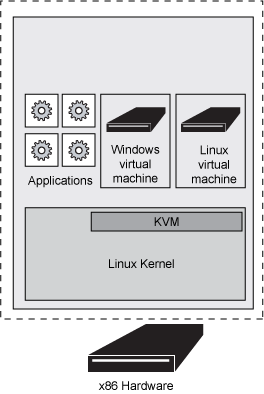

# 深入剖析 KVM 虚拟机管理程序
管理程序，虚拟化和云

**标签:** 云计算

[原文链接](https://developer.ibm.com/zh/articles/cl-hypervisorcompare-kvm/)

Bhanu P Tholeti

发布: 2011-12-23

* * *

##### 关于本系列

本系列文章首先介绍虚拟机管理程序类型和系统虚拟化的背景知识，然后介绍 5 个虚拟机管理程序的功能、它们的部署流程，以及您可能遇到的管理问题。

- [简介](http://www.ibm.com/developerworks/cn/cloud/library/cl-hypervisorcompare/)
- [PowerVM](/developerworks/cn/cloud/library/cl-hypervisorcompare-powervm/)
- [VMware ESX Server](/developerworks/cn/cloud/library/cl-hypervisorcompare-vmwareesx/)
- [Xen](/developerworks/cn/cloud/library/cl-hypervisorcompare-xen/)
- KVM
- [z/VM](/developerworks/cn/cloud/library/cl-hypervisorcompare/cl-hypervisorcompare-zvm.html)

将本系列文章可作为理解虚拟机管理程序在云中的虚拟化过程中所扮演的角色的一个简单起点，或者您可以参阅本系列的各篇文章，帮助您确定哪个虚拟机管理程序最能满足您的云需求。

## 预备知识

基于内核的虚拟机 (KVM) 是针对包含虚拟化扩展（Intel VT 或 AMD-V）的 x86 硬件上的 Linux 的完全原生的虚拟化解决方案。对半虚拟化（paravirtualization）的有限支持也可以通过半虚拟网络驱动程序的形式用于 Linux 和 Windows Guest 系统。

KVM 目前设计为通过可加载的内核模块连接内核。支持的操作系统版本包括广泛的操作系统，比如 Linux、BSD、Solaris、Windows、Haiku、ReactOS 和 AROS Research Operating System。一个添加了补丁的 KVM 版本 (qemu) 能够在 Mac OS X 上运行。

注意：KVM 本身不执行任何模拟，一个用户空间程序会使用 /dev/kvm 接口设置一个 Guest 虚拟服务器的地址空间，向它提供模拟的 I/O，并将它的视频显示映射回宿主的显示屏。

图 1 显示了 KVM 架构。

##### 图 1\. KVM 架构

##### 半虚拟化（Paravirtualization）

半虚拟化是一种虚拟化技术，它向虚拟机提供一个软件接口，这个软件接口类似但不等同于底层硬件的接口。这个修改的接口的目的是减少 Guest 操作系统用于执行一些操作的执行时间，相对于非虚拟化的环境，这些操作在虚拟环境中的运行困难得多。

有一些专门定义的 hooks 允许 Guest 和宿主请求和接受这些困难的任务，这些任务也可以在虚拟域中执行，但执行性能更低。

在 KVM 架构中，虚拟机实现为常规的 Linux 进程，由标准 Linux 调度程序进行调度。事实上，每个虚拟 CPU 显示为一个常规的 Linux 进程。这使 KVM 能够享受 Linux 内核的所有功能。

设备模拟由提供了模拟的 BIOS、PCI 总线、USB 总线和一组标准的设备（比如 IDE 和 SCSI 磁盘控制器、网络卡等）的修改的 qemu 版本来模拟。

## 功能特性

以下功能对于 KVM 至关重要。

### 安全

因为虚拟机实现为一个 Linux 进程，所以它利用标准的 Linux 安全模型来提供隔离和资源控制。Linux 内核使用 SELinux（安全增强的 Linux）来添加强制访问控制、多级和多类别安全，以及处理策略的执行。SELinux 为在 Linux 内核中运行的进程提供了严格的资源隔离和限制。

SVirt 项目是一项社区工作，尝试集成强制访问控制 (MAC) 安全和基于 Linux 的虚拟化 (KVM)。它构建于 SELinux 之上，提供一个基础架构来使管理员能够定义虚拟机隔离策略。SVirt 可以开箱即用地确保一个虚拟机资源无法供任何其他进程（或虚拟机）访问，这可由 sysadmin 扩展来定义细粒度的权限，例如将虚拟机分组到一起以共享资源。

### 内存管理

KVM 从 Linux 继承了强大的内存管理功能。一个虚拟机的内存与任何其他 Linux 进程的内存一样进行存储，可以以大页面的形式进行交换以实现更高的性能，也可以磁盘文件的形式进行共享。NUMA 支持（非一致性内存访问，针对多处理器的内存设计）允许虚拟机有效地访问大量内存。

KVM 支持来自 CUP 供应商的最新的内存虚拟化功能，支持 Intel 的扩展页面表 (EPT) 和 AMD 的快速虚拟化索引 (RVI)，以实现更低的 CPU 利用率和更高的吞吐量。

内存页面共享通过一项名为内核同页合并 (Kernel Same-page Merging, KSM) 的内核功能来支持。KSM 扫描每个虚拟机的内存，如果虚拟机拥有相同的内存页面，KSM 将这些页面合并到一个在虚拟机之间共享的页面，仅存储一个副本。如果一个 Guest 尝试更改这个共享页面，它将得到自己的专用副本。

### 存储

KVM 能够使用 Linux 支持的任何存储来存储虚拟机镜像，包括具有 IDE、SCSI 和 SATA 的本地磁盘，网络附加存储 (NAS)（包括 NFS 和 SAMBA/CIFS），或者支持 iSCSI 和光线通道的 SAN。多路径 I/O 可用于改进存储吞吐量和提供冗余。

再一次，由于 KVM 是 Linux 内核的一部分，它可以利用所有领先存储供应商都支持的一种成熟且可靠的存储基础架构；它的存储堆栈在生产部署方面具有良好的记录。

KVM 还支持全局文件系统 (GFS2) 等共享文件系统上的虚拟机镜像，以允许虚拟机镜像在多个宿主之间共享或使用逻辑卷共享。磁盘镜像支持 _瘦配置_，支持通过仅在虚拟机需要时分配存储空间，而不是提前分配整个存储空间，提高存储利用率。KVM 的原生磁盘格式为 QCOW2，它支持快照，允许多级快照、压缩和加密。

### 实时迁移

KVM 支持实时迁移，这提供了在物理宿主之间转移正在运行的虚拟机而不中断服务的能力。实时迁移对用户是透明的，虚拟机保持打开，网络连接保持活动，用户应用程序也持续运行，但虚拟机转移到了一个新的物理宿主上。

除了实时迁移，KVM 支持将虚拟机的当前状态保存到磁盘，以允许存储并在以后恢复它。

### 设备驱动程序

KVM 支持混合虚拟化，其中半虚拟化的驱动程序安装在 Guest 操作系统中，允许虚拟机使用优化的 I/O 接口而不使用模拟的设备，以为网络和块设备提供高性能的 I/O。

KVM 虚拟机管理程序为半虚拟化的驱动程序使用 IBM 和 Red Hat 联合 Linux 社区开发的 VirtIO 标准；它是一个与虚拟机管理程序独立的、构建设备驱动程序的接口，允许为多个虚拟机管理程序使用一组相同的设备驱动程序，能够实现更出色的 Guest 互操作性。

VirtIO 驱动程序包含在现代 Linux 内核中（2.6.25 以后的版本），包含在 Red Hat Enterprise Linux 4.8+ 和 5.3+ 中，可用于 Red Hat Enterprise Linux 3。Red Hat 为 Microsoft Windows Guest 系统开发了 VirtIO 驱动程序，以实现经过 Microsoft 的 Windows 硬件质量实验室认证计划 (WHQL) 认证的优化网络和磁盘 I/O。

### 性能和可伸缩性

KVM 也继承了 Linux 的性能和可伸缩性，支持拥有最多 16 个虚拟 CPU 和 256GB RAM 的虚拟机，以及拥有 256 个 CPU 核心和超过 1TB RAM 的宿主系统。它可提供

- 对于 SAP、Oracle、LAMP 和 Microsoft Exchange 等真实企业工作负载，相对于裸机 95 到 135% 的性能。
- 在运行标准服务器的虚拟机中每秒超过 100 万条消息的速度和低于 200 毫秒的延迟。
- 最高的整合率，将超过 600 个运行企业工作负载的虚拟机整合到单个服务器上。

这意味着 KVM 允许虚拟化任何要求苛刻的应用程序工作负载。

## 部署虚拟化

部署 KVM 比较复杂，涉及大量配置考虑因素，关于更多信息，请参阅 参考资料 。

## 管理您的虚拟机

有多个虚拟机管理器可用，包括：

- Univention Virtual Manager。
- qemu/KVM：您可以在 KVM 机器中直接从命令行运行。
- Virsh：管理 VM 的最简单的 shell。
- Virtual Machine Manager：也称为 virt-manager，一个管理 VM 的桌面用户接口。

## 选择 KVM

优点：

- 尽管 KVM 是一个相对较新的虚拟机管理程序，但这个随主流 Linux 内核发布的轻量型模块提供了简单的实现和对 Linux 重要任务的持续支持。
- KVM 是灵活的，因为 Guest 操作系统与集成到 Linux 内核中的虚拟机管理程序通信，所以它们始终可以直接寻址硬件，无需修改虚拟化的操作系统。这使 KVM 成为了更快的虚拟机解决方案。
- KVM 的补丁与 Linux 内核兼容。KVM 在 Linux 内核本身内实现，这进而简化了对虚拟化进程的控制。

缺点：

- 没有成熟的工具可用于管理 KVM 服务器和 VM。
- KVM 仍然需要改进虚拟网络支持、虚拟存储支持、增强的安全、高可用性、容错、电源管理、HPC/实时支持、虚拟 CPU 可伸缩性、跨供应商兼容性、VM 可移植性，并构建于一个既有的云服务生态系统之上。

本文翻译自： [Dive into the KVM hypervisor](https://developer.ibm.com/articles/cl-hypervisorcompare-kvm/)（2011-09-24）