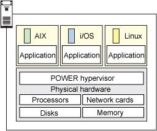

# 深入剖析 PowerVM 虚拟机管理程序
管理程序，虚拟化和云

**标签:** 云计算

[原文链接](https://developer.ibm.com/zh/articles/cl-hypervisorcompare-powervm/)

Bhanu P Tholeti

发布: 2012-01-04

* * *

##### 关于本系列

本系列文章首先介绍虚拟机管理程序类型和系统虚拟化的背景知识，然后介绍 5 个虚拟机管理程序的功能、它们的部署流程，以及您可能遇到的管理问题。

- [简介](https://www.ibm.com/developerworks/cn/cloud/library/cl-hypervisorcompare/)
- PowerVM
- [VMware ESX Server](https://www.ibm.com/developerworks/cn/cloud/library/cl-hypervisorcompare-vmwareesx/)
- [Xen](https://www.ibm.com/developerworks/cn/cloud/library/cl-hypervisorcompare-xen/)
- [KVM](https://www.ibm.com/developerworks/cn/cloud/library/cl-hypervisorcompare-kvm/)
- [z/VM](https://www.ibm.com/developerworks/cn/cloud/library/cl-hypervisorcompare-zvm/)

使用此系列作为理解虚拟机管理程序在云中的虚拟化过程中扮演的角色的一个简单起点，或者您可以参阅本系列的各篇文章，帮助您确定哪个虚拟机管理程序最能满足您的云需求。

## 预备知识

Power 是没有限制的虚拟化。一些企业打算依靠 PowerVM 虚拟化将多个工作负载整合到较少系统上，从而提高服务器利用率，降低成本。Power VM 为基于 Power Systems 平台的高级 RAS 功能和领先性能为 AIX、IBM i 和 Linux 应用程序提供了一个安全的、可扩展的虚拟化环境。

支持的操作系统版本：

- AIX 5.3、AIX 6.1 和 AIX 7
- IBM i 6.1 和 IBM i 7.1
- Red Hat Enterprise Linux 5 和 Red Hat Enterprise Linux 6（当 Red Hat 发布时）
- SUSE Linux Enterprise Server 10 和 SUSE Linux Enterprise Server 11

支持的硬件平台：

- 配备了 POWER5、POWER6 和 POWER7 处理器的 IBM Power Systems

图 1 显示了 PowerVM 虚拟机管理程序的架构：

## 功能

PowerVM Enterprise 拥有两项行业领先的新功能，分别名为 _活动内存共享 (Active Memory Sharing)_ 和 _动态分区迁移 (Live Partition Mobility)_：

- 在工作负载需求变化时，活动内存共享智能地将系统内存从一个分区转移到另一个分区。
- 动态分区迁移支持将正在运行的分区从一个服务器迁移到另一个服务器，且不会发生应用程序中断，从而提高了系统利用率、应用程序可用性并节省了能源。有了动态分区迁移，由于定期服务器维护而发生的计划应用程序中断就会成为过去。

以下是 PowerVM 的其他功能。

**微分区支持：** 微分区技术允许对系统进行调节，整合多种独立的工作负载，这有助于降低成本。可将微分区的大小定义为一个处理器的 1/10，并以小到一个处理器的 1/100 的增量更改它。可以为每个核心创建最多 10 个微分区。

**集成虚拟化管理器（IVM）：** 集成虚拟化管理器 (IVM) 允许您使用一个基于浏览器的易用界面来管理工作负载。

**虚拟 I/O 服务器（VIO）：** 支持您共享 I/O 资源。虚拟 I/O 服务器是一个提供特殊用途的分区，向客户端分区提供虚拟 I/O 资源。虚拟 I/O 服务器拥有与客户端共享的资源。为一个分区分配的物理适配器可分享给一个或多个其他分区。虚拟 I/O 服务器消除了针对专用的网络适配器、磁盘适配器和磁盘驱动器的需求。

**PowerVM Lx86 支持：** 您可以在 POWER 上运行 x86 Linux 应用程序，此功能支持动态执行 x86 Linux 指令，将它们映射到基于 POWER 的系统上的指令，并缓存映射的指令以优化性能。

**共享专用容量（Shared dedicated capacity）：** 获取专用资源的优势，不会产生资源浪费。此功能允许“捐赠”专用处理器分区的空闲 CPU 周期，将它们提供给共享池使用，进而提高整体系统性能。专用分区维持着对专用 CPU 周期的绝对优先权，共享仅在专用分区没有使用其所有资源时发生。在基于 POWER6 和 POWER7 处理器的服务器上，支持使用此功能。

**多个共享处理器池（Multiple shared processor pools）：** 使用此功能，系统几乎为您执行了所有管理工作。您只需向分区分配优先级，虚拟机管理程序便会根据您应用程序的需要分配处理能力。此功能支持在分配给共享池的分区之间执行自动、非破坏性的处理能力平衡。这会提供更高的吞吐量以及减少基于处理器的软件授权成本的潜力。

**NPIV ：** NPIV 支持从多个客户端分区直接访问光纤通道适配器，从而简化光纤通道 SAN 环境的管理。PowerVM Express、Standard 和 Enterprise Edition 中都提供了 NPIV 支持，以便支持所有基于 POWER6 和 POWER7 的服务器（包括刀片服务器）上的 AIX V5.3、AIX V6.1、IBM i 6.1.1 和 SUSE Linux Enterprise Server 11 分区。

**虚拟磁带：** PowerVM 拥有两种在基于 POWER6 和 POWER7 处理器的服务器上使用磁带设备的虚拟化方法，这些方法简化了备份和还原操作。两种方法都受 Power VM Express、Standard 或 Enterprise Edition 支持：

- 对于基于 POWER6 和 POWER7 处理器的服务器上的 AIX V5.3、AIX V6.1 和 SUSE Linux Enterprise Server 11 分区，NPIV 支持 PowerVM LPAR 使用共享物理 HBA 资源访问 SAN 磁带库。
- 对于基于 POWER6 和 POWER7 处理器的服务器上的 AIX V5.3、AIX V6.1 和 SUSE Linux Enterprise Server 11 分区，虚拟磁带支持允许顺序共享所选的 SAS 磁带设备。

**动态分区迁移：** 将一个正在运行的 AIX 或 Linux 分区从一个物理 Power Systems 服务器迁移到另一个服务器，且不会发生应用程序中断，动态分区迁移可以帮助客户端避免针对计划的系统维护、配置和工作负载管理的应用程序中断。也可以将分区从一个基于 POWER6 处理器的服务器迁移到一个基于 POWER7 处理器的服务器，以简化向较新平台的升级。

PowerVM 动态分区迁移现在可用于配备了两个硬件管理控制台 (HMC)、支持更大且更灵活的配置的环境。 PowerVM 分区同时支持物理和虚拟 I/O，还支持动态、异构的多路径 I/O。凭借此支持功能，分区可拥有一个同时包含物理（比如专用 FC 适配器）和虚拟（比如 NPIV）适配器的存储设备的路径。在基于 POWER6 和 POWER7 处理器的服务器上具有 AIX V5.3 和 AIX V6.1 分区的动态分区迁移环境支持多路径 I/O。

**活动内存共享：** 支持系统内存的更有效利用，PowerVM 的高级内存共享能力可基于不断变化的工作负载需求，向正在运行的虚拟分区动态重新分配内存。

**部署：** 部署您的虚拟化配置包含以下任务：

1. 安装虚拟 I/O 服务器。
2. 创建逻辑分区并向它们分配虚拟或物理资源。
3. 在逻辑分区中安装操作系统。
4. 按需部署容量。

可用于部署虚拟化配置的工具如下：

- **硬件管理控制台 (HMC)：** 将一个系统计划（使用 SPT 创建）导入 HMC，HMC 可将该计划部署到托管的系统。HMC 基于系统计划中指定的逻辑分区配置来创建逻辑分区。
- **虚拟 I/O 服务器：** 虚拟 I/O 服务器是一种在自己的逻辑分区中运行的软件，向托管系统上的客户端逻辑分区提供虚拟 I/O 资源。虚拟 I/O 服务器支持一个或多个客户端逻辑分区与附加的磁盘或光学设备共享物理适配器。
- **集成虚拟化管理器：** 集成虚拟化管理器是未由 HMC 管理的托管系统上的管理分区（虚拟 I/O 服务器）的用户界面。您可以使用集成虚拟化管理器在托管系统上创建 AIX 和 Linux 客户端逻辑分区。您也可以在托管系统上配置虚拟存储和虚拟以太网。

## 使用硬件管理控制台部署虚拟化

您可以创建逻辑分区，安装操作系统，并按需为硬件管理控制台 (HMC) 管理的系统部署容量。

要使用 HMC 部署虚拟化配置，请完成以下任务：

- 可选：输入虚拟化引擎技术的激活代码。
- 可选：创建虚拟 I/O 服务器逻辑分区。
- 可选：安装虚拟 I/O 服务器。
- 创建 AIX 和 Linux 逻辑分区，向它们分配资源。
- 在逻辑分区中安装 AIX 和 Linux。

## 使用集成虚拟化管理器部署虚拟化

您可以在一个由集成虚拟化管理器管理的系统上创建逻辑分区和安装操作系统。要使用 IVM 部署虚拟化配置，请完成以下任务：

- 输入虚拟 I/O 服务器的激活代码。
- 安装虚拟 I/O 服务器。
- 准备虚拟 I/ l服务器管理分区。
- 创建 AIX 和 Linux 逻辑分区，向它们分配资源。
- 在逻辑分区中安装 AIX 和 Linux。

## 管理您的虚拟机

PowerVM 使用 IVM 管理虚拟机：IVM 可帮助您：

- 支持将众多计算机资源作为一项资源来看待和执行，从而简化 IT 管理。
- 提高灵活性，使您的组织可使用共享容量同时满足预料之中和预料之外的服务器需求峰值。

IVM 不需要使用 HMC 管理单一系统上的 LPAR。使用 IVM，客户端可创建 LPAR 来对单一系统进行分区，提供虚拟存储和虚拟以太网的管理。

## 选择 PowerVM

在决定使用 PowerVM 作为您的虚拟化工具之前，考虑以下优缺点。

优点：

- PowerVM 在单一系统上支持多个操作环境。
- 支持每个处理器核心最多 10 个 VM。
- 处理器、内存和 I/O 资源可在 VM 之间动态迁移。
- VM 可使用专用或共享（受限制或不受限制）的处理器资源。
- 处理器资源可基于工作负载需求在 VM 之间自动转移。
- 一组 VM 的处理器资源可受到限制，减少软件授权成本。
- Power Systems 服务器和 VIOS 的存储资源可集中化到池中，以优化资源利用率。
- 简化入门级 Power Systems 服务器和刀片服务器的 VM 创建和管理。
- 支持在 Linux on PowerVM 上运行许多 x86 Linux 应用程序。
- 活动的 AIX 和 Linux VM 可在服务器之间迁移，从而消除了计划的中断。
- 智能地将内存从一个 VM 转移到另一个 VM，以提高内存利用率。
- 简化光纤通道 SAN 环境的管理并提高性能。

缺点：

- 在需求高峰时期，性能可能受到影响。PowerVM 的 Linux 虚拟化实现拥有支持极细粒度的资源管理和控制的机制，但在高峰时期，仍然存在性能降级的可能。
- 使用 IBM PowerVM，您可以虚拟化 10 个逻辑分区 (LPAR) 来共享一个 CPU，甚至共享 NIC，这种做法对性能（太少的硬件上具有太多活动）和可用性（考虑一个 CPU 失败的后果）具有负面影响。虚拟化的灵活性和可配置性可能导致产生设计很糟糕的系统，进而导致公司放弃其整个虚拟化战略。
- 安全：在过去，如果一台服务器受到破坏，可以将漏洞限制于该服务器。使用虚拟化，物理服务器内的每个逻辑分区或虚拟环境都可能受到破坏。尽管系统管理员有能力确保物理机器内的逻辑分区无法彼此访问，但您不应该忽视物理安全。
- 举例来说，尽管在许多情况下不需要使用专用的硬件管理控制台 (HMC) ，大部分 IBM System p 使用者仍会使用 HMC 来执行其 Linux 逻辑分区和虚拟化配置。如果管理员离开他的办公桌并打开着控制台，入侵者就有可能获得对物理服务器内每个逻辑环境的访问。

本文翻译自： [Dive into the PowerVM hypervisor](https://developer.ibm.com/articles/cl-hypervisorcompare-powervm/)（2011-09-24）