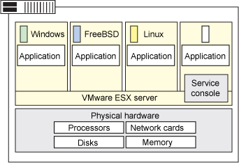

# 深入剖析 VMware ESX Server 虚拟机管理程序
管理程序，虚拟化和云

**标签:** 云计算

[原文链接](https://developer.ibm.com/zh/articles/cl-hypervisorcompare-vmwareesx/)

Bhanu P Tholeti

发布: 2011-12-28

* * *

##### 关于本系列

本系列文章首先介绍虚拟机管理程序类型和系统虚拟化的背景知识，然后介绍 5 个虚拟机管理程序的功能、它们的部署流程，以及您可能遇到的管理问题。

- [简介](http://www.ibm.com/developerworks/cn/cloud/library/cl-hypervisorcompare/)
- [PowerVM](http://www.ibm.com/developerworks/cn/cloud/library/cl-hypervisorcompare-powervm/)
- VMware ESX Server
- [Xen](http://www.ibm.com/developerworks/cn/cloud/library/cl-hypervisorcompare-xen/)
- [KVM](http://www.ibm.com/developerworks/cn/cloud/library/cl-hypervisorcompare-kvm/)
- [z/VM](http://www.ibm.com/developerworks/cn/cloud/library/cl-hypervisorcompare-zvm/)

使用此系列作为理解虚拟机管理程序在云中的虚拟化过程中所扮演的角色的一个简单起点，或者您可以参阅本系列的各篇文章，帮助您确定哪个虚拟机管理程序最能满足您的云需求。

## 预备知识

ESX Server 是一种类型 1 虚拟机管理程序，它创建系统资源的逻辑池，使许多虚拟机可共享相同的物理资源。

ESX Server 是一种操作系统，它的功能类似于虚拟机管理程序，直接在系统硬件上运行。ESX Server 在系统硬件与虚拟机之间插入一个虚拟化层，将系统硬件转换为一个逻辑计算资源池，ESX Server 可将其中的资源动态地分配给任何操作系统或应用程序。在虚拟机中运行的 Guest 操作系统与虚拟资源交互，就好象它们是物理资源一样。

下图显示了一个运行虚拟机的 ESX Server 系统。ESX Server 运行一个具有服务控制台的虚拟机和 3 个额外的虚拟机。每个额外的虚拟机与其他虚拟机都独自运行一个操作系统和应用程序，同时共享相同的物理资源。

## 功能

ESX Server 架构的关键组件包括：

- **ESX Server 虚拟化层**：将底层物理资源与虚拟机分离。
- **资源管理器**：创建虚拟机，向它们提供处理单元、内存、网络带宽和磁盘带宽。它将物理资源有效地映射到虚拟资源。
- **服务控制台**：控制 ESX Server 的安装、配置、管理、故障排除和维护。服务控制位于自己的虚拟机中。ESX Server 在您安装 ESX Server 时自动配置服务控制台虚拟机。服务控制台提供一个位置来安装系统软件，比如 Tivoli® 产品和 IBM Director。
- **硬件接口组件，包括设备驱动程序**：提供特定于硬件的服务，同时隐藏与系统的其他部分的硬件区别。

ESX Server 调用以下先进的资源管理控件来帮助保证服务水平：

- 当多个虚拟机争用相同的资源时，ESX Server 使用一种按比例共享机制来分配处理器、内存和磁盘资源。
- ESX Server 可以通过分时使用方式来分配处理能力，避免任何一个虚拟机独占处理器资源。
- ESX Server 基于虚拟机工作负载和定义的最低值来分配内存。例如，如果一个虚拟机中内存不足，ESX Server 可临时从另一个虚拟机借用内存，将此内存租借给内存不足的虚拟机，并在需要时将该内存还给原来的虚拟机。
- ESX Server 使用网络流量成型来控制网络带宽。网络共享通过分配或使用令牌来确定，基于虚拟机的平均或最大带宽需求。

当与 VMware VirtualCenter 相结合时，ESX Server 提供了以下额外的功能：

- VMware VMotion：将正在运行的虚拟机从一个物理服务器迁移到另一个，而不影响最终用户。
- VMware Distributed Resource Scheduler (DRS)：基于定义的业务目标，自动分配和平衡资源池中的计算资源。
- VMware HA：持续监控资源池中的所有物理服务器，在相同资源池中不同的物理服务器上自动重新启用受服务器故障影响的虚拟机。

ESX Server 3.0 支持以下配置：

- 配备了多达 128 个虚拟机、64GB RAM 和多达 32 个逻辑处理器的宿主系统。
- 位于网络文件系统和 iSCSI 适配器上的虚拟机。
- 具有 4 个虚拟机处理器的虚拟机。

ESX Server 支持 Linux® 、Windows® 、FreeBSD（仅限 ESX Server 2.5）、NetWare 和 Solaris（仅限 ESX Server 3.0） Guest 操作系统。

## 部署虚拟化

要部署虚拟化：

- 将 ESX Server 安装在服务器上。
- 创建和配置虚拟机。IBM Tivoli Provisioning manager 可用于完成此任务。
- 将 Guest 操作系统安装在每个虚拟机中。

（参见参考资料了解部署虚拟化的更多信息。）

## 管理您的虚拟机

VMware vSphere 客户端用于管理虚拟机。使用 vSphere 客户端，您可以在托管虚拟机的桌面上打开一个控制台。从控制台，您可以更改操作系统设置，使用应用程序，浏览文件系统，监控系统性能等，就像您在操作一个物理系统一样。

您也可以使用快照，捕获虚拟机在您获取快照时的整体状态。

将 vSphere 客户端直接连接到一个 ESX/ESXi 主机，仅使用可用于该主机的虚拟机和物理资源。通过将您的 vSphere 客户端连接到一个 vCenter Server，可以管理虚拟机和集合到池中的多个主机的物理资源。

可将多个 vCenter Server 系统合并到一个 vCenter Server Connected Group 中，从而允许使用一个 vSphere Client 连接来管理它们。

以下活动可以使用 vSphere Client VM 管理器管理：

- 编辑虚拟机启动和关闭设置。
- 打开虚拟机的一个控制台。
- 添加和删除 VM。
- 使用快照来管理 VM。
- 管理现有快照。
- 还原快照。
- 将虚拟磁盘从瘦（thin）磁盘转换为厚（thick）磁盘。
- 查看现有硬件配置，访问 Add Hardware 向导添加或删除硬件。
- 查看和配置众多虚拟机属性，比如 Guest 操作系统和虚拟机、VMware Tools 设置之间的电源管理交互。
- 配置 CPU、CPU 超线程资源、内存和磁盘。

## 选择 VMware ESX Server

在您决定使用 VMware ESX Server 作为您的虚拟化工具之前，请考虑以下优缺点。

优点：

- VMware ESX/ESXi 4.0 具有极小的、非常紧凑的系统规模，仅占用了 70MB 的磁盘空间。
- 基础架构可伸缩性支持为虚拟机使用 255GB RAM，为大规模服务器整合和灾难恢复项目使用高达 1TB RAM，每个 VMware ESX/ESXi 支持多达 256 个开启的虚拟机。
- 存储系统非破坏性地向正在运行的虚拟机添加和扩展虚拟磁盘，以增加可用的资源。vSphere 客户端存储管理工具提供了可自定义的报告和拓扑图。
- 对于高可用性和灾难恢复，VMware ESX 提供了用于数据保护的 vStorage API、一个从 VMware ESX/ESXi 安装删除负载的备份代理服务器，以及文件级完整和增量备份。
- 借助 VMware Fault Tolerance，VMware 的高可用性和容错功能提供了物理服务器故障期间的零宕机时间、零数据丢失和持续的可用性。
- VMware 的 vCenter Server 提供了一个中央控制点来实现虚拟化管理，vCenter Server 是一个可伸缩和可扩展的管理服务器，用于管理基础架构和应用程序服务，提供虚拟基础架构的每个方面的深入洞察。vCenter Server 支持基于事件的警报、性能图，一个 vCenter Server 可管理多达 300 个主机和 3,000 个虚拟机。此外，使用 vCenter Server 链接（Linked）模式，您可以从单一控制台管理多达 10,000 个虚拟机。

缺点：

- 相比 Xen 或 KVM，VMware 需要更多的补丁和更新。
- vSphere 仅提供了文件级备份和恢复，没有提供应用程序级备份和恢复。
- VMware vCenter 需要第三方数据库来执行主机系统配置的信息存储和管理。
- VMware Distributed Resource Scheduler (DRS) 功能的使用可能更广泛，它仅基于 CPU 和内存利用率。
- VMware 中有许多安全漏洞（例如内存膨胀问题）。

本文翻译自： [Dive into the VMware ESX Server hypervisor](https://developer.ibm.com/articles/cl-hypervisorcompare-vmwareesx/)（2011-09-24）