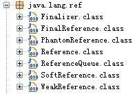
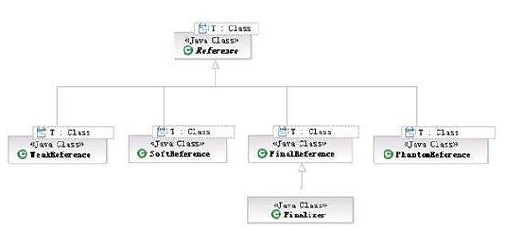

# 深入探讨 java.lang.ref 包
结合实验分析包内不同类的表现并深入分析该包在不同 Java 虚拟机上的表现

**标签:** Java

[原文链接](https://developer.ibm.com/zh/articles/j-lo-langref/)

周祥, 蔡敏, 张嘉鸣

发布: 2011-04-28

* * *

## 概述

Java.lang.ref 是 Java 类库中比较特殊的一个包，它提供了与 Java 垃圾回收器密切相关的引用类。这些引用类对象可以指向其它对象，但它们不同于一般的引用，因为它们的存在并不防碍 Java 垃圾回收器对它们所指向的对象进行回收。其好处就在于使者可以保持对使用对象的引用，同时 JVM 依然可以在内存不够用的时候对使用对象进行回收。因此这个包在用来实现与缓存相关的应用时特别有用。同时该包也提供了在对象的”可达”性发生改变时，进行提醒的机制。本文通过对该包进行由浅入深的介绍与分析，使读者可以加深对该包的理解，从而更好地利用该包进行开发。

## java.lang.ref 包的介绍

我们可以先来看一下 java.lang.ref 这个包的结构，如图 1 所示

##### 图 1\. java.lang.ref 包结构



该包中各类的继承关系如图 2 所示

##### 图 2\. java.lang.ref 包中类的继承关系 :



Reference 是一个抽象类，而 SoftReference，WeakReference，PhantomReference 以及 FinalReference 都是继承它的具体类。

接下来我们来分别介绍和分析强引用以及 java.lang.ref 包下各种虚引用的特性及用法。

## StrongReference, SoftReference, WeakReference 以及 PhantomReference 的特性及用法

### StrongReference：

我们都知道 JVM 中对象是被分配在堆（heap）上的，当程序行动中不再有引用指向这个对象时，这个对象就可以被垃圾回收器所回收。这里所说的引用也就是我们一般意义上申明的对象类型的变量（如 String, Object, ArrayList 等），区别于原始数据类型的变量（如 int, short, long 等）也称为强引用。

在了解虚引用之前，我们一般都是使用强引用来对对象进行引用。如：

##### 清单 1\. StrongReference usage

```
String tag = new String("T");

```

Show moreShow more icon

此处的 tag 引用就称之为强引用。而强引用有以下特征：

- 强引用可以直接访问目标对象。
- 强引用所指向的对象在任何时候都不会被系统回收。
- 强引用可能导致内存泄漏。

我们要讨论的这三种 Reference 较之于强引用而言都属于”弱引用”，也就是他们所引用的对象只要没有强引用，就会根据条件被 JVM 的垃圾回收器所回收，它们被回收的时机以及用法各不相同。下面分别来进行讨论。

### SoftReference：

SoftReference 在”弱引用”中属于最强的引用。SoftReference 所指向的对象，当没有强引用指向它时，会在内存中停留一段的时间，垃圾回收器会根据 JVM 内存的使用情况（内存的紧缺程度）以及 SoftReference 的 get() 方法的调用情况来决定是否对其进行回收。（后面章节会用几个实验进行阐述）

具体使用一般是通过 SoftReference 的构造方法，将需要用弱引用来指向的对象包装起来。当需要使用的时候，调用 SoftReference 的 get() 方法来获取。当对象未被回收时 SoftReference 的 get() 方法会返回该对象的强引用。如下：

##### 清单 2\. SoftReference usage

```
SoftReference<Bean> bean = new SoftReference<Bean>(new Bean("name", 10));
System.out.println(bean.get());// "name:10”

```

Show moreShow more icon

软引用有以下特征：

- 软引用使用 get() 方法取得对象的强引用从而访问目标对象。
- 软引用所指向的对象按照 JVM 的使用情况（Heap 内存是否临近阈值）来决定是否回收。
- 软引用可以避免 Heap 内存不足所导致的异常。

当垃圾回收器决定对其回收时，会先清空它的 SoftReference，也就是说 SoftReference 的 get() 方法将会返回 null，然后再调用对象的 finalize() 方法，并在下一轮 GC 中对其真正进行回收。

### WeakReference：

WeakReference 是弱于 SoftReference 的引用类型。弱引用的特性和基本与软引用相似，区别就在于弱引用所指向的对象只要进行系统垃圾回收，不管内存使用情况如何，永远对其进行回收（get() 方法返回 null）。

完全可以通过和 SoftReference 一样的方式来操作 WeakReference，这里就不再复述。

弱引用有以下特征：

- 弱引用使用 get() 方法取得对象的强引用从而访问目标对象。
- 一旦系统内存回收，无论内存是否紧张，弱引用指向的对象都会被回收。
- 弱引用也可以避免 Heap 内存不足所导致的异常。

### PhantomReference：

PhantomReference 是所有”弱引用”中最弱的引用类型。不同于软引用和弱引用，虚引用无法通过 get() 方法来取得目标对象的强引用从而使用目标对象，观察源码可以发现 get() 被重写为永远返回 null。

那虚引用到底有什么作用？其实虚引用主要被用来 **跟踪对象被垃圾回收的状态** ，通过查看引用队列中是否包含对象所对应的虚引用来判断它是否 **即将** 被垃圾回收，从而采取行动。它并不被期待用来取得目标对象的引用，而目标对象被回收前，它的引用会被放入一个 ReferenceQueue 对象中，从而达到跟踪对象垃圾回收的作用。

所以具体用法和之前两个有所不同，它必须传入一个 ReferenceQueue 对象。当虚引用所引用对象被垃圾回收后，虚引用会被添加到这个队列中。如：

##### 清单 3\. PhantomReference usage

```
public static void main(String[] args) {
ReferenceQueue<String> refQueue = new ReferenceQueue<String>();
PhantomReference<String> referent = new PhantomReference<String>(
     new String("T"), refQueue);
System.out.println(referent.get());// null

System.gc();
System.runFinalization();

System.out.println(refQueue.poll() == referent); //true
}

```

Show moreShow more icon

值得注意的是，对于引用回收方面，虚引用类似强引用不会自动根据内存情况自动对目标对象回收，Client 需要自己对其进行处理以防 Heap 内存不足异常。

虚引用有以下特征：

- 虚引用永远无法使用 get() 方法取得对象的强引用从而访问目标对象。
- 虚引用所指向的对象在被系统内存回收前，虚引用自身会被放入 ReferenceQueue 对象中从而跟踪对象垃圾回收。
- 虚引用不会根据内存情况自动回收目标对象。

另外值得注意的是，其实 SoftReference, WeakReference 以及 PhantomReference 的构造函数都可以接收一个 ReferenceQueue 对象。当 SoftReference 以及 WeakReference 被清空的同时，也就是 Java 垃圾回收器准备对它们所指向的对象进行回收时，调用对象的 finalize() 方法之前，它们自身会被加入到这个 `ReferenceQueue 对象` 中，此时可以通过 ReferenceQueue 的 poll() 方法取到它们。而 PhantomReference 只有当 Java 垃圾回收器对其所指向的对象真正进行回收时，会将其加入到这个 `ReferenceQueue 对象` 中，这样就可以追综对象的销毁情况。

### 各种引用类型总结：

下表对于各种引用类型的特征进行了小结：

##### 表 1\. 引用类型特性总结

**引用类型****取得目标对象方式****垃圾回收条件****是否可能内存泄漏**强引用直接调用不回收可能软引用通过 get() 方法视内存情况回收不可能弱引用通过 get() 方法永远回收不可能虚引用无法取得不回收可能

**注意：** 如果想使用这些相对强引用来说较弱的引用来进行对象操作的时候，就必须保证没有强引用指向被操作对象。否则将会被视为强引用指向，不会具有任何的弱引用的特性。

下一章我们将做 2 个实验来佐证上面这些总结的内容。

### StrongReference, SoftReference, WeakReference 以及 PhantomReference 的各种特性实验分析

为了更好的描述它们的特性，先以表格进行归纳，再以示例程序加以说明。

- JVM 使用 Oracle 的 Java SE6
- 首先将 JVM 运行环境的初始以及最大 Heap 数设到最低以便更明显的看出结果：

##### 图 3\. 设置 JVM 运行环境初始值


接下来就开始我们的实验。

##### 表 2：各个引用在 GC 后是否被回收？

**类型****GC 后是否回收****示例代码****运行结果**StrongReference不回收见清单 3name:10SoftReference不回收见清单 4name:10WeakReference回收见清单 5name:10PhantomReferenceN/AN/AN/A

##### 清单 4

```
public static void main(String[] args) {
Bean bean = new Bean("name", 10);
System.gc();
System.runFinalization();

System.out.println(bean);// "name:10”
}

```

Show moreShow more icon

总结：强引用所指向的对象在任何时候都不会被系统回收。结果输入

##### 清单 5

```
public static void main(String[] args) {
SoftReference<Bean> bean = new SoftReference<Bean>(new Bean("name", 10));
System.gc();
System.runFinalization();

System.out.println(bean.get());// "name:10”
}

```

Show moreShow more icon

总结：软引用所指向的对象会根据内存使用情况来决定是否回收，这里内存还充足，所以不会被回收。

##### 清单 6

```
public static void main(String[] args) {
WeakReference<Bean> bean = new WeakReference<Bean>(new Bean("name", 10));
System.gc();
System.runFinalization();

System.out.println(bean.get());// "null”
}

```

Show moreShow more icon

总结：弱引用所指向的对象只要进行 GC，就会自动进行回收，get() 返回 null。

##### 表 3：各个引用创建大量对象时是否导致 Heap 不足异常？

**类型****是否抛出异常****示例代码****运行结果**StrongReference抛出异常见清单 6Exception in thread “main” java.lang.OutOfMemoryError: Java heap spaceSoftReference不抛异常，之前的引用自动清空并返回 null见清单 7nullWeakReference同上见清单 8nullPhantomReference抛出异常见清单 9Exception in thread “main” java.lang.OutOfMemoryError: Java heap space

##### 清单 7

```
public static void main(String[] args) {
Bean[] referent = new Bean[100000];
for (int i=0;i<referent.length;i++){
referent[i] = new Bean("mybean:" + i,100);// 抛 Exception
}
}

```

Show moreShow more icon

总结：在新开辟 100000 个 Bean 对象时，由于强引用永远不会被系统回收，当最大 Heap 阈值达到 2m 时，系统就会报出 Heap 不足的异常。

##### 清单 8

```
public static void main(String[] args) {
Reference<Bean>[] referent = new SoftReference[100000];
for (int i=0;i<referent.length;i++){
referent[i] = new SoftReference<Bean>(new Bean("mybean:" + i,100));
}

System.out.println(referent[100].get());// "null”
}

```

Show moreShow more icon

总结：在新开辟 100000 个 Bean 对象时，由于软引用会视内存使用情况来判断是否自动回收，所以当最大 Heap 阈值达到 2m 时，系统自动回收最前面开辟的对象，取第 100 个对象时，返回为 null。

##### 清单 9

```
public static void main(String[] args) {
Reference<Bean>[] referent = new WeakReference[100000];
for (int i=0;i<referent.length;i++){
referent[i] = new WeakReference<Bean>(new Bean("mybean:" + i,100));
}

System.out.println(referent[100].get());// "null”
}

```

Show moreShow more icon

总结：WeakReference 与 SoftReference 具有相同的特性，也会视内存使用情况来判断是否自动回收。取第 100 个对象时，返回为 null。

##### 清单 10

```
public static void main(String[] args) {
Reference<Bean>[] referent = new PhantomReference[100000];
ReferenceQueue<Bean> queue = new ReferenceQueue<Bean>();
for (int i=0;i<referent.length;i++){
referent[i] = new PhantomReference<Bean>(new Bean("mybean:" + i,100),
queue);// throw Exception
}

System.out.println(referent[100].get());
}

```

Show moreShow more icon

总结：PhantomReference 类似强引用，它不会自动根据内存情况自动对目标对象回收，所以这里在 Heap 里不断开辟新空间，当达到 2m 阈值时，系统报出 OutOfMemoryError 异常。

## FinalReference 以及 Finzlizer

FinalReference 作为 java.lang.ref 里的一个不能被公开访问的类，又起到了一个什么样的作用呢？作为他的子类， Finalizer 又在垃圾回收机制里扮演了怎么样的角色呢？

实际上，FinalReference 代表的正是 Java 中的强引用，如这样的代码 :

Bean bean = new Bean();

在虚拟机的实现过程中，实际采用了 FinalReference 类对其进行引用。而 Finalizer，除了作为一个实现类外，更是在虚拟机中实现一个 FinalizerThread，以使虚拟机能够在所有的强引用被解除后实现内存清理。

让我们来看看 Finalizer 是如何工作的。首先，通过声明 FinalizerThread，并将该线程实例化，设置为守护线程后，加入系统线程中去。

##### 清单 11

```
static {
        ThreadGroup tg = Thread.currentThread().getThreadGroup();
        for (ThreadGroup tgn = tg;
             tgn != null;
             tg = tgn, tgn = tg.getParent());
Thread finalizer = new FinalizerThread(tg);
finalizer.setPriority(Thread.MAX_PRIORITY - 2);
finalizer.setDaemon(true);
finalizer.start();
}

```

Show moreShow more icon

在 GC 的过程中，当一个强引用被释放，由系统垃圾收集器标记后的对象，会被加入 Finalizer 对象中的 ReferenceQueue 中去，并调用 Finalizer.runFinalizer() 来执行对象的 finalize 方法。

##### 清单 12

```
private void runFinalizer() {
synchronized (this) {
    if (hasBeenFinalized()) return;
    remove();
}
try {
    Object finalizee = this.get();
    if (finalizee != null && !(finalizee instanceof java.lang.Enum)) {
invokeFinalizeMethod(finalizee);
/* 注意，这里需要清空栈中包含该变量的的 slot,
                   ** 从而来减少因为一个保守的 GC 实现所造成的变量未被回收的假象 */
finalizee = null;
    }
} catch (Throwable x) { }
super.clear();
}

```

Show moreShow more icon

注意，标记处所调用的 invokeFinalizeMethod 为 native 方法，由于 finalize 方法在 Object 类中被声明为 protected，这里必须采用 native 方法才能调用。随后通过将本地强引用设置为空，以便使垃圾回收器清理内存。

可以看到，通过这样的方法，Java 将四种引用对象类型：软引用 (SoftReference)，弱引用 (WeakReference)，强引用 (FinalReference)，虚引用 (PhantomReference) 平等地对待，并在垃圾回收器中进行统一调度和管理。

## 不同 Java 虚拟机上的表现与分析

让我们来回顾一下四种引用类型的表现以及在垃圾回收器回收清理内存时的表现 .

1. 软引用 (SoftReference), 引用类型表现为当内存接近满负荷 , 或对象由 SoftReference.get() 方法的调用没有发生一段时间后 , 垃圾回收器将会清理该对象 . 在运行对象的 finalize 方法前 , 会将软引用对象加入 ReferenceQueue 中去 .
2. 弱引用 (WeakReference), 引用类型表现为当系统垃圾回收器开始回收时 , 则立即会回收该对象的引用 . 与软引用一样 , 弱引用也会在运行对象的 finalize 方法之前将弱引用对象加入 ReferenceQueue.
3. 强引用 (FinalReference), 这是最常用的引用类型 . JVM 系统采用 Finalizer 来管理每个强引用对象 , 并将其被标记要清理时加入 ReferenceQueue, 并逐一调用该对象的 finalize() 方法 .
4. 虚引用 (PhantomReference), 这是一个最虚幻的引用类型 . 无论是从哪里都无法再次返回被虚引用所引用的对象 . 虚引用在系统垃圾回收器开始回收对象时 , 将直接调用 finalize() 方法 , 但不会立即将其加入回收队列 . 只有在真正对象被 GC 清除时 , 才会将其加入 Reference 队列中去 .

这里比较两个比较典型的 JVM 环境，Oracle Java SE6 和 IBM JDK 6。采用了如下的测试代码 :

##### 清单 13\. 类 RefTestObj

```
public class RefTestObj {
private int id;

public int getId() {
return id;
}

public void setId(int id) {
this.id = id;
}

@Override
public int hashCode() {
return super.hashCode();
}

@Override
public String toString() {
return super.toString() + "[id=" + this.id + "]";
}

@Override
protected void finalize() {
System.out.println("Object [" + this.hashCode() + "][
id=" + this.id + "] come into finalize");
try {
super.finalize();
} catch (Throwable e) {
e.printStackTrace();
}
}
}

```

Show moreShow more icon

##### 清单 14\. 类 RefMainThread

```
import java.lang.ref.PhantomReference;
import java.lang.ref.Reference;
import java.lang.ref.ReferenceQueue;
import java.lang.ref.SoftReference;
import java.lang.ref.WeakReference;

public class RefMainThread {
public static void main(String[] args) {
// 创建三种不同的引用类型所需对象
RefTestObj softRef = new RefTestObj();
RefTestObj weakRef = new RefTestObj();
RefTestObj phanRef = new RefTestObj();

softRef.setId(1);
weakRef.setId(2);
phanRef.setId(3);

ReferenceQueue<RefTestObj> softRefQueue = new ReferenceQueue<RefTestObj>();
ReferenceQueue<RefTestObj> weakRefQueue = new ReferenceQueue<RefTestObj>();
ReferenceQueue<RefTestObj> phanRefQueue = new ReferenceQueue<RefTestObj>();

SoftReference<RefTestObj> softRefObj =
new SoftReference<RefTestObj>(softRef, softRefQueue);
WeakReference<RefTestObj> weakRefObj =
new WeakReference<RefTestObj>(weakRef, weakRefQueue);
PhantomReference<RefTestObj> phanRefObj =
new PhantomReference<RefTestObj>(phanRef, phanRefQueue);

// 打印正常情况下三种对象引用
print(softRefObj);
print(weakRefObj);
print(phanRefObj);

// 将对象清空
softRef = null;
weakRef = null;
phanRef = null;

// 打印引用队列及 get() 方法所能取到的对象自身
if (softRefObj != null) {
System.out.println("Soft Reference Object run get():" + softRefObj.get());
System.out.println("Check soft queue:" + softRefQueue.poll());
}

if (weakRefObj != null) {
System.out.println("Weak Reference Object run get():" + weakRefObj.get());
System.out.println("Check weak queue:" + weakRefQueue.poll());
}

if (phanRefObj != null) {
System.out.println("Phantom Reference Object run get():" + phanRefObj.get());
System.out.println("Check Phantom queue:" + phanRefQueue.poll());
}

// 开始执行垃圾回收
System.gc();
System.runFinalization();

// 检查队列，是否已经被加入队列，是否还能取回对象
if (softRefObj != null) {
System.out.println("Soft Reference Object run get():" + softRefObj.get());
System.out.println("Check soft queue:" + softRefQueue.poll());
}

if (weakRefObj != null) {
System.out.println("Weak Reference Object run get():" + weakRefObj.get());
System.out.println("Check weak queue:" + weakRefQueue.poll());
}

if (phanRefObj != null) {
System.out.println("Phantom Reference Object run get():" + phanRefObj.get());
System.out.println("Check Phantom queue:" + phanRefQueue.poll());
}

// 对于虚引用对象，在经过多次 GC 之后， 才会加入到队列中去
Reference<? extends RefTestObj> mynewphan = null;
int refCount = 1;
while (mynewphan == null) {
mynewphan = phanRefQueue.poll();
System.gc();
System.runFinalization();
if (mynewphan != null) {
System.out.println("Check Phantom queue:" + mynewphan);
System.out.println("Count for " + refCount + " times");
break;
}
refCount ++;
}
}

public static void print(Reference<RefTestObj> ref) {
RefTestObj obj = ref.get();
System.out.println("The Reference is " + ref.toString() + " and with object " + obj +
      " which is " + (obj == null ? "null" : "not null"));
}
}

```

Show moreShow more icon

通过执行 RefMainThread, 我们可以清晰地根据打印结果看到对象在内存中被加入队列 , 以及调用 finalize 方法的顺序及过程 .

为了测试不同的 JVM 环境并消除其他因素的印象 , 本例采用的背景环境均为 Windows2003 下的 32bit JVM.

首先采用了环境为 Oracle Java SE 6 update 23 进行测试 , 结果如下 :

##### 清单 15\. Oracle Java SE 6 update 23 下测试结果

```
The Reference is java.lang.ref.SoftReference@c17164 and
with object RefTestObj@1fb8ee3[id=1] which is not null
The Reference is java.lang.ref.WeakReference@61de33 and
with object RefTestObj@14318bb[id=2] which is not null
The Reference is java.lang.ref.PhantomReference@ca0b6 and with object null which is null
Soft Reference Object run get():RefTestObj@1fb8ee3[id=1]
Check soft queue:null
Weak Reference Object run get():RefTestObj@14318bb[id=2]
Check weak queue:null
Phantom Reference Object run get():null
Check Phantom queue:null
Object [27744459][id=3] come into finalize
Object [21174459][id=2] come into finalize
Soft Reference Object run get():RefTestObj@1fb8ee3[id=1]
Check soft queue:null
Weak Reference Object run get():null
Check weak queue:java.lang.ref.WeakReference@61de33
Phantom Reference Object run get():null
Check Phantom queue:null
Check Phantom queue:java.lang.ref.PhantomReference@ca0b6
Count for 2 times

```

Show moreShow more icon

可以看到 , 当运行了系统回收后 , 虚引用与弱引用被回收 , 由于内存并不吃紧 , 软引用依然保持原样 . 弱引用立即被加入了队列 , 而虚引用则在循环两次的手动调用 GC 后被加入了队列 . 其次 , 采用的环境是 IBM JDK 6, 结果如下 :

##### 清单 16\. IBM JDK 6 下测试结果

```
The Reference is java.lang.ref.SoftReference@3a2c3a2c and
with object RefTestObj@391e391e[id=1] which is not null
The Reference is java.lang.ref.WeakReference@3a303a30 and
with object RefTestObj@39203920[id=2] which is not null
The Reference is java.lang.ref.PhantomReference@3a353a35
and with object null which is null
Soft Reference Object run get():RefTestObj@391e391e[id=1]
Check soft queue:null
Weak Reference Object run get():RefTestObj@39203920[id=2]
Check weak queue:null
Phantom Reference Object run get():null
Check Phantom queue:null
Object [958544162][id=3] come into finalize
Object [958413088][id=2] come into finalize
Soft Reference Object run get():RefTestObj@391e391e[id=1]
Check soft queue:null
Weak Reference Object run get():null
Check weak queue:java.lang.ref.WeakReference@3a303a30
Phantom Reference Object run get():null
Check Phantom queue:null
Object [958282014][id=1] come into finalize
............

```

Show moreShow more icon

程序运行到这里进入了无限循环，必须手动终止。比对上下两份结果可以看到，当多次运行系统垃圾回收后，IBM JVM 将软引用一并加入了回收队列中，并运行了其 finalize 方法。另外，即使经过很多次系统垃圾回收，虚引用也没有被加入到队列中去。不知道这是不是 IBM JVM 的一个小小的 BUG 所在。

### 结论

- SoftReference 中 Oracle JVM 的表现满足规范，只当内存不足时才进行回收。而 IBM JVM 的策略则更为积极，在内存尚且充足的情况下也进行了回收，值得注意。
- PhantomReference 中 Oracle JVM 的表现满足规范，执行 finalize 后若干次 GC 就被添加到了 Queue 中。而 IBM JVM 则始终没有被添加到 Queue 中导致了死循环。所以在使用 PhantomReference 时出现类似的情况时，可以考虑是否是因为使用了不同 JVM 所导致。

## 结束语

本文深入地介绍了 java.lang.ref 包使用方法，并结合实验分析了包内不同类的表现。同时对该包在不同 Java 虚拟机上的表现进行了深入地分析。