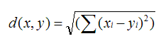
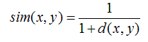
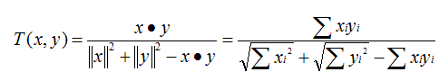
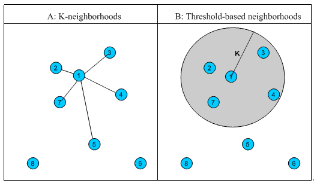
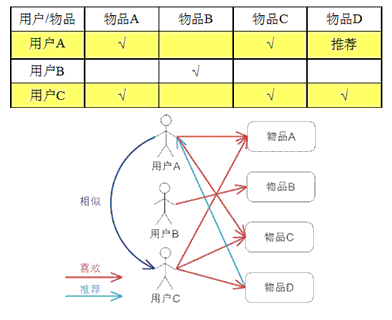
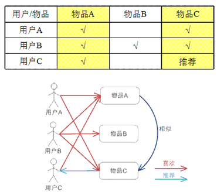
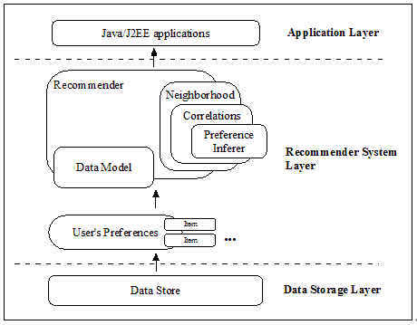
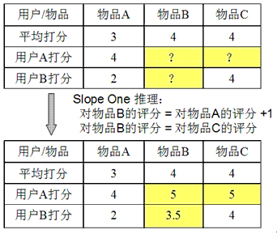

# 深入推荐引擎相关算法 – 协同过滤
深入了解推荐引擎机制

**标签:** Web 开发

[原文链接](https://developer.ibm.com/zh/articles/1103-zhaoct-recommstudy2/)

赵 晨婷, 马 春娥

发布: 2011-03-21

* * *

## 集体智慧和协同过滤

### 什么是集体智慧

集体智慧 (Collective Intelligence) 并不是 Web2.0 时代特有的，只是在 Web2.0 时代，大家在 Web 应用中利用集体智慧构建更加有趣的应用或者得到更好的用户体验。集体智慧是指在大量的人群的行为和数据中收集答案，帮助你对整个人群得到统计意义上的结论，这些结论是我们在单个个体上无法得到的，它往往是某种趋势或者人群中共性的部分。

Wikipedia 和 Google 是两个典型的利用集体智慧的 Web 2.0 应用：

- Wikipedia 是一个知识管理的百科全书，相对于传统的由领域专家编辑的百科全书，Wikipedia 允许最终用户贡献知识，随着参与人数的增多，Wikipedia 变成了涵盖各个领域的一本无比全面的知识库。也许有人会质疑它的权威性，但如果你从另一个侧面想这个问题，也许就可以迎刃而解。在发行一本书时，作者虽然是权威，但难免还有一些错误，然后通过一版一版的改版，书的内容越来越完善。而在 Wikipedia 上，这种改版和修正被变为每个人都可以做的事情，任何人发现错误或者不完善都可以贡献他们的想法，即便某些信息是错误的，但它一定也会尽快的被其他人纠正过来。从一个宏观的角度看，整个系统在按照一个良性循环的轨迹不断完善，这也正是集体智慧的魅力。
- Google：目前最流行的搜索引擎，与 Wikipedia 不同，它没有要求用户显式的贡献，但仔细想想 Google 最核心的 PageRank 的思想，它利用了 Web 页面之间的关系，将多少其他页面链接到当前页面的数目作为衡量当前页面重要与否的标准；如果这不好理解，那么你可以把它想象成一个选举的过程，每个 Web 页面都是一个投票者同时也是一个被投票者，PageRank 通过一定数目的迭代得到一个相对稳定的评分。Google 其实利用了现在 Internet 上所有 Web 页面上链接的集体智慧，找到哪些页面是重要的。

### 什么是协同过滤

协同过滤是利用集体智慧的一个典型方法。要理解什么是协同过滤 (Collaborative Filtering, 简称 CF)，首先想一个简单的问题，如果你现在想看个电影，但你不知道具体看哪部，你会怎么做？大部分的人会问问周围的朋友，看看最近有什么好看的电影推荐，而我们一般更倾向于从口味比较类似的朋友那里得到推荐。这就是协同过滤的核心思想。

协同过滤一般是在海量的用户中发掘出一小部分和你品位比较类似的，在协同过滤中，这些用户成为邻居，然后根据他们喜欢的其他东西组织成一个排序的目录作为推荐给你。当然其中有一个核心的问题：

- 如何确定一个用户是不是和你有相似的品位？
- 如何将邻居们的喜好组织成一个排序的目录？

协同过滤相对于集体智慧而言，它从一定程度上保留了个体的特征，就是你的品位偏好，所以它更多可以作为个性化推荐的算法思想。可以想象，这种推荐策略在 Web 2.0 的长尾中是很重要的，将大众流行的东西推荐给长尾中的人怎么可能得到好的效果，这也回到推荐系统的一个核心问题：了解你的用户，然后才能给出更好的推荐。

### 深入协同过滤的核心

前面作为背景知识，介绍了集体智慧和协同过滤的基本思想，这一节我们将深入分析协同过滤的原理，介绍基于协同过滤思想的多种推荐机制，优缺点和实用场景。

首先，要实现协同过滤，需要一下几个步骤

- 收集用户偏好
- 找到相似的用户或物品
- 计算推荐

### 收集用户偏好

要从用户的行为和偏好中发现规律，并基于此给予推荐，如何收集用户的偏好信息成为系统推荐效果最基础的决定因素。用户有很多方式向系统提供自己的偏好信息，而且不同的应用也可能大不相同，下面举例进行介绍：

##### 表 1\. 用户行为和用户偏好

**用户行为****类型****特征****作用**评分显式整数量化的偏好，可能的取值是 [0, n]；n 一般取值为 5 或者是 10通过用户对物品的评分，可以精确的得到用户的偏好投票显式布尔量化的偏好，取值是 0 或 1通过用户对物品的投票，可以较精确的得到用户的偏好转发显式布尔量化的偏好，取值是 0 或 1通过用户对物品的投票，可以精确的得到用户的偏好。 如果是站内，同时可以推理得到被转发人的偏好（不精确）保存书签显示布尔量化的偏好，取值是 0 或 1通过用户对物品的投票，可以精确的得到用户的偏好。标记标签 (Tag)显示一些单词，需要对单词进行分析，得到偏好通过分析用户的标签，可以得到用户对项目的理解，同时可以分析出用户的情感：喜欢还是讨厌评论显示一段文字，需要进行文本分析，得到偏好通过分析用户的评论，可以得到用户的情感：喜欢还是讨厌点击流 ( 查看 )隐式一组用户的点击，用户对物品感兴趣，需要进行分析，得到偏好用户的点击一定程度上反映了用户的注意力，所以它也可以从一定程度上反映用户的喜好。页面停留时间隐式一组时间信息，噪音大，需要进行去噪，分析，得到偏好用户的页面停留时间一定程度上反映了用户的注意力和喜好，但噪音偏大，不好利用。购买隐式布尔量化的偏好，取值是 0 或 1用户的购买是很明确的说明这个项目它感兴趣。

以上列举的用户行为都是比较通用的，推荐引擎设计人员可以根据自己应用的特点添加特殊的用户行为，并用他们表示用户对物品的喜好。

在一般应用中，我们提取的用户行为一般都多于一种，关于如何组合这些不同的用户行为，基本上有以下两种方式：

- 将不同的行为分组：一般可以分为“查看”和”购买”等等，然后基于不同的行为，计算不同的用户 / 物品相似度。类似于当当网或者 Amazon 给出的“购买了该图书的人还购买了 …”，“查看了图书的人还查看了 …”
- 根据不同行为反映用户喜好的程度将它们进行加权，得到用户对于物品的总体喜好。一般来说，显式的用户反馈比隐式的权值大，但比较稀疏，毕竟进行显示反馈的用户是少数；同时相对于”查看”，”购买”行为反映用户喜好的程度更大，但这也因应用而异。

收集了用户行为数据，我们还需要对数据进行一定的预处理，其中最核心的工作就是：减噪和归一化。

- 减噪：用户行为数据是用户在使用应用过程中产生的，它可能存在大量的噪音和用户的误操作，我们可以通过经典的数据挖掘算法过滤掉行为数据中的噪音，这样可以是我们的分析更加精确。
- 归一化：如前面讲到的，在计算用户对物品的喜好程度时，可能需要对不同的行为数据进行加权。但可以想象，不同行为的数据取值可能相差很大，比如，用户的查看数据必然比购买数据大的多，如何将各个行为的数据统一在一个相同的取值范围中，从而使得加权求和得到的总体喜好更加精确，就需要我们进行归一化处理。最简单的归一化处理，就是将各类数据除以此类中的最大值，以保证归一化后的数据取值在 [0,1] 范围中。

进行的预处理后，根据不同应用的行为分析方法，可以选择分组或者加权处理，之后我们可以得到一个用户偏好的二维矩阵，一维是用户列表，另一维是物品列表，值是用户对物品的偏好，一般是 [0,1] 或者 [-1, 1] 的浮点数值。

### 找到相似的用户或物品

当已经对用户行为进行分析得到用户喜好后，我们可以根据用户喜好计算相似用户和物品，然后基于相似用户或者物品进行推荐，这就是最典型的 CF 的两个分支：基于用户的 CF 和基于物品的 CF。这两种方法都需要计算相似度，下面我们先看看最基本的几种计算相似度的方法。

**相似度的计算**

关于相似度的计算，现有的几种基本方法都是基于向量（Vector）的，其实也就是计算两个向量的距离，距离越近相似度越大。在推荐的场景中，在用户 – 物品偏好的二维矩阵中，我们可以将一个用户对所有物品的偏好作为一个向量来计算用户之间的相似度，或者将所有用户对某个物品的偏好作为一个向量来计算物品之间的相似度。下面我们详细介绍几种常用的相似度计算方法：

- 欧几里德距离（Euclidean Distance）

最初用于计算欧几里德空间中两个点的距离，假设 x，y 是 n 维空间的两个点，它们之间的欧几里德距离是：



可以看出，当 n=2 时，欧几里德距离就是平面上两个点的距离。

当用欧几里德距离表示相似度，一般采用以下公式进行转换：距离越小，相似度越大



- 皮尔逊相关系数（Pearson Correlation Coefficient）

皮尔逊相关系数一般用于计算两个定距变量间联系的紧密程度，它的取值在 [-1，+1] 之间。


sx, sy是 x 和 y 的样品标准偏差。

- Cosine 相似度（Cosine Similarity）

Cosine 相似度被广泛应用于计算文档数据的相似度：


- Tanimoto 系数（Tanimoto Coefficient）

Tanimoto 系数也称为 Jaccard 系数，是 Cosine 相似度的扩展，也多用于计算文档数据的相似度：



**相似邻居的计算**

介绍完相似度的计算方法，下面我们看看如何根据相似度找到用户 – 物品的邻居，常用的挑选邻居的原则可以分为两类：图 1 给出了二维平面空间上点集的示意图。

- 固定数量的邻居：K-neighborhoods 或者 Fix-size neighborhoods

不论邻居的”远近”，只取最近的 K 个，作为其邻居。如图 1 中的 A，假设要计算点 1 的 5- 邻居，那么根据点之间的距离，我们取最近的 5 个点，分别是点 2，点 3，点 4，点 7 和点 5。但很明显我们可以看出，这种方法对于孤立点的计算效果不好，因为要取固定个数的邻居，当它附近没有足够多比较相似的点，就被迫取一些不太相似的点作为邻居，这样就影响了邻居相似的程度，比如图 1 中，点 1 和点 5 其实并不是很相似。

- 基于相似度门槛的邻居：Threshold-based neighborhoods

与计算固定数量的邻居的原则不同，基于相似度门槛的邻居计算是对邻居的远近进行最大值的限制，落在以当前点为中心，距离为 K 的区域中的所有点都作为当前点的邻居，这种方法计算得到的邻居个数不确定，但相似度不会出现较大的误差。如图 1 中的 B，从点 1 出发，计算相似度在 K 内的邻居，得到点 2，点 3，点 4 和点 7，这种方法计算出的邻居的相似度程度比前一种优，尤其是对孤立点的处理。

##### 图 1.相似邻居计算示意图



### 计算推荐

经过前期的计算已经得到了相邻用户和相邻物品，下面介绍如何基于这些信息为用户进行推荐。本系列的上一篇综述文章已经简要介绍过基于协同过滤的推荐算法可以分为基于用户的 CF 和基于物品的 CF，下面我们深入这两种方法的计算方法，使用场景和优缺点。

**基于用户的 CF（User CF）**

基于用户的 CF 的基本思想相当简单，基于用户对物品的偏好找到相邻邻居用户，然后将邻居用户喜欢的推荐给当前用户。计算上，就是将一个用户对所有物品的偏好作为一个向量来计算用户之间的相似度，找到 K 邻居后，根据邻居的相似度权重以及他们对物品的偏好，预测当前用户没有偏好的未涉及物品，计算得到一个排序的物品列表作为推荐。图 2 给出了一个例子，对于用户 A，根据用户的历史偏好，这里只计算得到一个邻居 – 用户 C，然后将用户 C 喜欢的物品 D 推荐给用户 A。

##### 图 2.基于用户的 CF 的基本原理



**基于物品的 CF（Item CF）**

基于物品的 CF 的原理和基于用户的 CF 类似，只是在计算邻居时采用物品本身，而不是从用户的角度，即基于用户对物品的偏好找到相似的物品，然后根据用户的历史偏好，推荐相似的物品给他。从计算的角度看，就是将所有用户对某个物品的偏好作为一个向量来计算物品之间的相似度，得到物品的相似物品后，根据用户历史的偏好预测当前用户还没有表示偏好的物品，计算得到一个排序的物品列表作为推荐。图 3 给出了一个例子，对于物品 A，根据所有用户的历史偏好，喜欢物品 A 的用户都喜欢物品 C，得出物品 A 和物品 C 比较相似，而用户 C 喜欢物品 A，那么可以推断出用户 C 可能也喜欢物品 C。

##### 图 3.基于物品的 CF 的基本原理



**User CF vs. Item CF**

前面介绍了 User CF 和 Item CF 的基本原理，下面我们分几个不同的角度深入看看它们各自的优缺点和适用场景：

- 计算复杂度

Item CF 和 User CF 是基于协同过滤推荐的两个最基本的算法，User CF 是很早以前就提出来了，Item CF 是从 Amazon 的论文和专利发表之后（2001 年左右）开始流行，大家都觉得 Item CF 从性能和复杂度上比 User CF 更优，其中的一个主要原因就是对于一个在线网站，用户的数量往往大大超过物品的数量，同时物品的数据相对稳定，因此计算物品的相似度不但计算量较小，同时也不必频繁更新。但我们往往忽略了这种情况只适应于提供商品的电子商务网站，对于新闻，博客或者微内容的推荐系统，情况往往是相反的，物品的数量是海量的，同时也是更新频繁的，所以单从复杂度的角度，这两个算法在不同的系统中各有优势，推荐引擎的设计者需要根据自己应用的特点选择更加合适的算法。

- 适用场景

在非社交网络的网站中，内容内在的联系是很重要的推荐原则，它比基于相似用户的推荐原则更加有效。比如在购书网站上，当你看一本书的时候，推荐引擎会给你推荐相关的书籍，这个推荐的重要性远远超过了网站首页对该用户的综合推荐。可以看到，在这种情况下，Item CF 的推荐成为了引导用户浏览的重要手段。同时 Item CF 便于为推荐做出解释，在一个非社交网络的网站中，给某个用户推荐一本书，同时给出的解释是某某和你有相似兴趣的人也看了这本书，这很难让用户信服，因为用户可能根本不认识那个人；但如果解释说是因为这本书和你以前看的某本书相似，用户可能就觉得合理而采纳了此推荐。

相反的，在现今很流行的社交网络站点中，User CF 是一个更不错的选择，User CF 加上社会网络信息，可以增加用户对推荐解释的信服程度。

- 推荐多样性和精度

研究推荐引擎的学者们在相同的数据集合上分别用 User CF 和 Item CF 计算推荐结果，发现推荐列表中，只有 50% 是一样的，还有 50% 完全不同。但是这两个算法确有相似的精度，所以可以说，这两个算法是很互补的。

关于推荐的多样性，有两种度量方法：

第一种度量方法是从单个用户的角度度量，就是说给定一个用户，查看系统给出的推荐列表是否多样，也就是要比较推荐列表中的物品之间两两的相似度，不难想到，对这种度量方法，Item CF 的多样性显然不如 User CF 的好，因为 Item CF 的推荐就是和以前看的东西最相似的。

第二种度量方法是考虑系统的多样性，也被称为覆盖率 (Coverage)，它是指一个推荐系统是否能够提供给所有用户丰富的选择。在这种指标下，Item CF 的多样性要远远好于 User CF, 因为 User CF 总是倾向于推荐热门的，从另一个侧面看，也就是说，Item CF 的推荐有很好的新颖性，很擅长推荐长尾里的物品。所以，尽管大多数情况，Item CF 的精度略小于 User CF， 但如果考虑多样性，Item CF 却比 User CF 好很多。

如果你对推荐的多样性还心存疑惑，那么下面我们再举个实例看看 User CF 和 Item CF 的多样性到底有什么差别。首先，假设每个用户兴趣爱好都是广泛的，喜欢好几个领域的东西，不过每个用户肯定也有一个主要的领域，对这个领域会比其他领域更加关心。给定一个用户，假设他喜欢 3 个领域 A,B,C，A 是他喜欢的主要领域，这个时候我们来看 User CF 和 Item CF 倾向于做出什么推荐：如果用 User CF, 它会将 A,B,C 三个领域中比较热门的东西推荐给用户；而如果用 ItemCF，它会基本上只推荐 A 领域的东西给用户。所以我们看到因为 User CF 只推荐热门的，所以它在推荐长尾里项目方面的能力不足；而 Item CF 只推荐 A 领域给用户，这样他有限的推荐列表中就可能包含了一定数量的不热门的长尾物品，同时 Item CF 的推荐对这个用户而言，显然多样性不足。但是对整个系统而言，因为不同的用户的主要兴趣点不同，所以系统的覆盖率会比较好。

从上面的分析，可以很清晰的看到，这两种推荐都有其合理性，但都不是最好的选择，因此他们的精度也会有损失。其实对这类系统的最好选择是，如果系统给这个用户推荐 30 个物品，既不是每个领域挑选 10 个最热门的给他，也不是推荐 30 个 A 领域的给他，而是比如推荐 15 个 A 领域的给他，剩下的 15 个从 B,C 中选择。所以结合 User CF 和 Item CF 是最优的选择，结合的基本原则就是当采用 Item CF 导致系统对个人推荐的多样性不足时，我们通过加入 User CF 增加个人推荐的多样性，从而提高精度，而当因为采用 User CF 而使系统的整体多样性不足时，我们可以通过加入 Item CF 增加整体的多样性，同样同样可以提高推荐的精度。

- 用户对推荐算法的适应度

前面我们大部分都是从推荐引擎的角度考虑哪个算法更优，但其实我们更多的应该考虑作为推荐引擎的最终使用者 — 应用用户对推荐算法的适应度。

对于 User CF，推荐的原则是假设用户会喜欢那些和他有相同喜好的用户喜欢的东西，但如果一个用户没有相同喜好的朋友，那 User CF 的算法的效果就会很差，所以一个用户对的 CF 算法的适应度是和他有多少共同喜好用户成正比的。

Item CF 算法也有一个基本假设，就是用户会喜欢和他以前喜欢的东西相似的东西，那么我们可以计算一个用户喜欢的物品的自相似度。一个用户喜欢物品的自相似度大，就说明他喜欢的东西都是比较相似的，也就是说他比较符合 Item CF 方法的基本假设，那么他对 Item CF 的适应度自然比较好；反之，如果自相似度小，就说明这个用户的喜好习惯并不满足 Item CF 方法的基本假设，那么对于这种用户，用 Item CF 方法做出好的推荐的可能性非常低。

通过以上的介绍，相信大家已经对协同过滤推荐的各种方法，原则，特点和适用场景有深入的了解，下面我们就进入实战阶段，重点介绍如何基于 Apache Mahout 实现协同过滤推荐算法。

## 基于 Apache Mahout 实现高效的协同过滤推荐

Apache Mahout 是 Apache Software Foundation (ASF) 旗下的一个开源项目，提供一些可扩展的机器学习领域经典算法的实现，旨在帮助开发人员更加方便快捷地创建智能应用程序，并且，在 Mahout 的最近版本中还加入了对 Apache Hadoop 的支持，使这些算法可以更高效的运行在云计算环境中。

关于 Apache Mahout 的安装和配置请参考《基于 Apache Mahout 构建社会化推荐引擎》，它是笔者 09 年发表的一篇关于基于 Mahout 实现推荐引擎的 developerWorks 文章，其中详细介绍了 Mahout 的安装步骤，并给出一个简单的电影推荐引擎的例子。

Apache Mahout 中提供的一个协同过滤算法的高效实现，它是一个基于 Java 实现的可扩展的，高效的推荐引擎。图 4 给出了 Apache Mahout 中协同过滤推荐实现的组件图，下面我们逐步深入介绍各个部分。

##### 图 4.组件图



### 数据表示：Data Model

**Preference**

基于协同过滤的推荐引擎的输入是用户的历史偏好信息，在 Mahout 里它被建模为 Preference（接口），一个 Preference 就是一个简单的三元组 < 用户 ID, 物品 ID, 用户偏好 >，它的实现类是 GenericPreference，可以通过以下语句创建一个 GenericPreference。

GenericPreference preference = new GenericPreference(123, 456, 3.0f);

这其中， 123 是用户 ID，long 型；456 是物品 ID，long 型；3.0f 是用户偏好，float 型。从这个例子我们可以看出，单单一个 GenericPreference 的数据就占用 20 bytes，所以你会发现如果只简单实用数组 Array 加载用户偏好数据，必然占用大量的内存，Mahout 在这方面做了一些优化，它创建了 PreferenceArray（接口）保存一组用户偏好数据，为了优化性能，Mahout 给出了两个实现类，GenericUserPreferenceArray 和 GenericItemPreferenceArray，分别按照用户和物品本身对用户偏好进行组装，这样就可以压缩用户 ID 或者物品 ID 的空间。下面清单 1 的代码以 GenericUserPreferenceArray 为例，展示了如何创建和使用一个 PreferenceArray。

##### 清单 1\. 创建和使用 PreferenceArray

```
PreferenceArray userPref = new GenericUserPreferenceArray(2); //size = 2

userPref.setUserID(0, 1L);

userPref.setItemID(0, 101L);  //<1L, 101L, 2.0f>
userPref.setValue(0, 2.0f);
userPref.setItemID(1, 102L);  //<1L, 102L, 4.0f>
userPref.setValue(1, 4.0f);

Preference pref = userPref.get(1);   //<1L, 102L, 4.0f>

```

Show moreShow more icon

为了提高性能 Mahout 还构建了自己的 HashMap 和 Set：FastByIDMap 和 FastIDSet，有兴趣的朋友可以参考 Mahout 官方说明。

**DataModel**

Mahout 的推荐引擎实际接受的输入是 DataModel，它是对用户偏好数据的压缩表示，通过创建内存版 DataModel 的语句我们可以看出：

DataModel model = new GenericDataModel(FastByIDMap map);

他保存在一个按照用户 ID 或者物品 ID 进行散列的 PreferenceArray，而 PreferenceArray 中对应保存着这个用户 ID 或者物品 ID 的所有用户偏好信息。

DataModel 是用户喜好信息的抽象接口，它的具体实现支持从任意类型的数据源抽取用户喜好信息，具体实现包括内存版的 GenericDataModel，支持文件读取的 FileDataModel 和支持数据库读取的 JDBCDataModel，下面我们看看如何创建各种 DataModel。

##### 清单 2\. 创建各种 DataModel

```
//In-memory DataModel - GenericDataModel
FastByIDMap<PreferenceArray> preferences = new FastByIDMap<PreferenceArray>();

PreferenceArray prefsForUser1 = new GenericUserPreferenceArray(10);
prefsForUser1.setUserID(0, 1L);
prefsForUser1.setItemID(0, 101L);
prefsForUser1.setValue(0, 3.0f);
prefsForUser1.setItemID(1, 102L);
prefsForUser1.setValue(1, 4.5f);
... (8 more)
preferences.put(1L, prefsForUser1);   //use userID as the key
... (more users)

DataModel model = new GenericDataModel(preferences);

//File-based DataModel - FileDataModel
DataModel dataModel = new FileDataModel(new File("preferences.csv");

//Database-based DataModel - MySQLJDBCDataModel
MysqlDataSource dataSource = new MysqlDataSource();
dataSource.setServerName("my_user");
dataSource.setUser("my_password");
dataSource.setPassword("my_database_host");
JDBCDataModel dataModel = new MySQLJDBCDataModel(dataSource, "my_prefs_table",
"my_user_column", "my_item_column", "my_pref_value_column");

```

Show moreShow more icon

支持文件读取的 FileDataModel，Mahout 没有对文件的格式做过多的要求，只要文件的内容满足以下格式：

- 每一行包括用户 ID, 物品 ID, 用户偏好
- 逗号隔开或者 Tab 隔开
- _.zip 和_.gz 文件会自动解压缩（Mahout 建议在数据量过大时采用压缩的数据存储）

支持数据库读取的 JDBCDataModel，Mahout 提供一个默认的 MySQL 的支持，它对用户偏好数据的存放有以下简单的要求：

- 用户 ID 列需要是 BIGINT 而且非空
- 物品 ID 列需要是 BIGINT 而且非空
- 用户偏好列需要是 FLOAT

建议在用户 ID 和物品 ID 上建索引。

### 实现推荐：Recommender

介绍完数据表示模型，下面介绍 Mahout 提供的协同过滤的推荐策略，这里我们选择其中最经典的三种，User CF, Item CF 和 Slope One。

**User CF**

前面已经详细介绍了 User CF 的原理，这里我们着重看怎么基于 Mahout 实现 User CF 的推荐策略，我们还是从一个例子入手：

##### 清单 3\. 基于 Mahout 实现 User CF

```
DataModel model = new FileDataModel(new File("preferences.dat"));
UserSimilarity similarity = new PearsonCorrelationSimilarity(model);
UserNeighborhood neighborhood = new NearestNUserNeighborhood(100, similarity, model);
Recommender recommender = new GenericUserBasedRecommender(model,
neighborhood, similarity);

```

Show moreShow more icon

1. 从文件建立 DataModel，我们采用前面介绍的 FileDataModel，这里假设用户的喜好信息存放在 preferences.dat 文件中。
2. 基于用户偏好数据计算用户的相似度，清单中采用的是 PearsonCorrelationSimilarity，前面章节曾详细介绍了各种计算相似度的方法，Mahout 中提供了基本的相似度的计算，它们都 UserSimilarity 这个接口，实现用户相似度的计算，包括下面这些常用的：

3. PearsonCorrelationSimilarity：基于皮尔逊相关系数计算相似度

4. EuclideanDistanceSimilarity：基于欧几里德距离计算相似度
5. TanimotoCoefficientSimilarity：基于 Tanimoto 系数计算相似度
6. UncerteredCosineSimilarity：计算 Cosine 相似度

ItemSimilarity 也是类似的：

1. 根据建立的相似度计算方法，找到邻居用户。这里找邻居用户的方法根据前面我们介绍的，也包括两种：”固定数量的邻居”和”相似度门槛邻居”计算方法，Mahout 提供对应的实现：

    - NearestNUserNeighborhood：对每个用户取固定数量 N 的最近邻居
    - ThresholdUserNeighborhood：对每个用户基于一定的限制，取落在相似度门限内的所有用户为邻居。
2. 基于 DataModel，UserNeighborhood 和 UserSimilarity 构建 GenericUserBasedRecommender，实现 User CF 推荐策略。

**Item CF**

了解了 User CF，Mahout Item CF 的实现与 User CF 类似，是基于 ItemSimilarity，下面我们看实现的代码例子，它比 User CF 更简单，因为 Item CF 中并不需要引入邻居的概念：

##### 清单 4\. 基于 Mahout 实现 Item CF

```
DataModel model = new FileDataModel(new File("preferences.dat"));
ItemSimilarity similarity = new PearsonCorrelationSimilarity(model);
Recommender recommender = new GenericItemBasedRecommender(model, similarity);

```

Show moreShow more icon

**Slope One**

如前面介绍的，User CF 和 Item CF 是最常用最容易理解的两种 CF 的推荐策略，但在大数据量时，它们的计算量会很大，从而导致推荐效率较差。因此 Mahout 还提供了一种更加轻量级的 CF 推荐策略：Slope One。

Slope One 是有 Daniel Lemire 和 Anna Maclachlan 在 2005 年提出的一种对基于评分的协同过滤推荐引擎的改进方法，下面简单介绍一下它的基本思想。

图 5 给出了例子，假设系统对于物品 A，物品 B 和物品 C 的平均评分分别是 3，4 和 4。基于 Slope One 的方法会得到以下规律：

- 用户对物品 B 的评分 = 用户对物品 A 的评分 + 1
- 用户对物品 B 的评分 = 用户对物品 C 的评分

基于以上的规律，我们可以对用户 A 和用户 B 的打分进行预测：

- 对用户 A，他给物品 A 打分 4，那么我们可以推测他对物品 B 的评分是 5，对物品 C 的打分也是 5。
- 对用户 B，他给物品 A 打分 2，给物品 C 打分 4，根据第一条规律，我们可以推断他对物品 B 的评分是 3；而根据第二条规律，推断出评分是 4。当出现冲突时，我们可以对各种规则得到的推断进行就平均，所以给出的推断是 3.5。

这就是 Slope One 推荐的基本原理，它将用户的评分之间的关系看作简单的线性关系：

Y = mX + b;

当 m = 1 时就是 Slope One，也就是我们刚刚展示的例子。

##### 图 5\. Slope One 推荐策略示例



Slope One 的核心优势是在大规模的数据上，它依然能保证良好的计算速度和推荐效果。Mahout 提供了 Slope One 推荐方法的基本实现，实现代码很简单，参考清单 5.

##### 清单 5\. 基于 Mahout 实现 Slope One

```
//In-Memory Recommender
DiffStorage diffStorage = new MemoryDiffStorage(model, Weighting.UNWEIGHTED, false,
Long.MAX_VALUE));
Recommender recommender = new SlopeOneRecommender(model, Weighting.UNWEIGHTED,
Weighting.UNWEIGHTED, diffStorage);

//Database-based Recommender
AbstractJDBCDataModel model = new MySQLJDBCDataModel();
DiffStorage diffStorage = new MySQLJDBCDiffStorage(model);
Recommender recommender = new SlopeOneRecommender(model, Weighting.WEIGHTED,
Weighting.WEIGHTED, diffStorage);

```

Show moreShow more icon

1. 根据 Data Model 创建数据之间线性关系的模型 DiffStorage。

2. 基于 Data Model 和 DiffStorage 创建 SlopeOneRecommender，实现 Slope One 推荐策略。


## 结束语

Web2.0 的一个核心思想就是”集体智慧”，基于协同过滤的推荐策略的基本思想就是基于大众行为，为每个用户提供个性化的推荐，从而使用户能更快速更准确的发现所需要的信息。从应用角度分析，现今比较成功的推荐引擎，比如 Amazon，豆瓣，当当等都采用了协同过滤的方式，它不需要对物品或者用户进行严格的建模，而且不要求物品的描述是机器可理解的，是中领域无关的推荐方法，同时这个方法计算出来的推荐是开放的，可以共用他人的经验，很好的支持用户发现潜在的兴趣偏好。基于协同过滤的推荐策略也有不同的分支，它们有不同的实用场景和推荐效果，用户可以根据自己应用的实际情况选择合适的方法，异或组合不同的方法得到更好的推荐效果。

除此之外，本文还介绍了如何基于 Apache Mahout 高效实现协同过滤推荐算法，Apache Mahout 关注海量数据上的机器学习经典算法的高效实现，其中对基于协同过滤的推荐方法也提供了很好的支持，基于 Mahout 你可以轻松的体验高效推荐的神奇。

作为深入推荐引擎相关算法的第一篇文章，本文深入介绍了协同过滤算法，并举例介绍了如何基于 Apache Mahout 高效实现协同过滤推荐算法，Apache Mahout 作为海量数据上的机器学习经典算法的高效实现，其中对基于协同过滤的推荐方法也提供了很好的支持，基于 Mahout 你可以轻松的体验高效推荐的神奇。但我们也发现了在海量数据上高效的运行协同过滤算法以及其他推荐策略这样高复杂的算法还是有很大的挑战的。在面对这个问题的过程中，大家提出了很多减少计算量的方法，而聚类无疑是其中最优的选择。所以本系列的下一篇文章将详细介绍各类聚类算法，它们的原理，优缺点和实用场景，并给出基于 Apache Mahout 的聚类算法的高效实现，并分析在推荐引擎的实现中，如何通过引入聚类来解决大数据量造成的海量计算，从而提供高效的推荐。

最后，感谢大家对本系列的关注和支持。