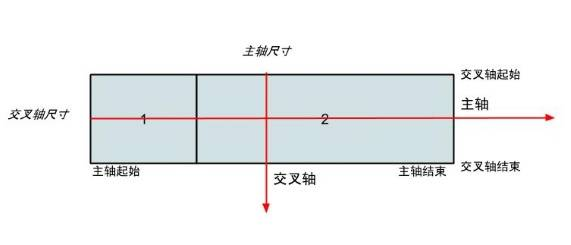
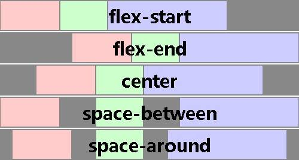
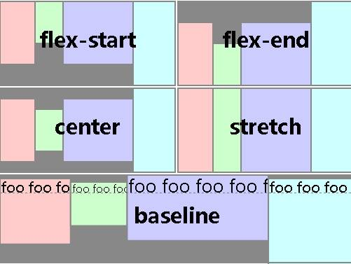
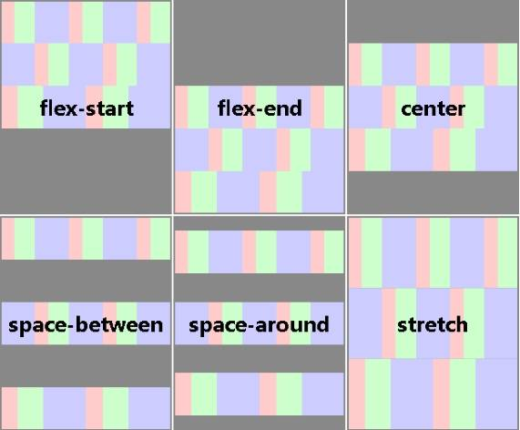

# 深入理解 CSS3 弹性盒布局模型
在具体开发中应用该布局模型来简化常见的页面布局场景

**标签:** Web 开发

[原文链接](https://developer.ibm.com/zh/articles/1409-chengfu-css3flexbox/)

成富

发布: 2014-09-04

* * *

## 深入理解 CSS3 弹性盒布局模型

Web 应用的样式设计中，布局是非常重要的一部分。布局用来确定页面上不同组件和元素的尺寸和位置。随着响应式用户界面的流行，Web 应用一般都要求适配不同的设备尺寸和浏览器分辨率。响应式用户界面设计中最重要的一环就是布局。需要根据窗口尺寸来调整布局，从而改变组件的尺寸和位置，以达到最佳的显示效果。这也使得布局的逻辑变得更加复杂。本文介绍的是 CSS3 规范中引入的新布局模型：弹性盒模型（flex box）。弹性盒模型可以用简单的方式满足很多常见的复杂的布局需求。它的优势在于开发人员只是声明布局应该具有的行为，而不需要给出具体的实现方式。浏览器会负责完成实际的布局。该布局模型在主流浏览器中都得到了支持。

## 简介

引入弹性盒布局模型的目的是提供一种更加有效的方式来对一个容器中的条目进行排列、对齐和分配空白空间。即便容器中条目的尺寸未知或是动态变化的，弹性盒布局模型也能正常的工作。在该布局模型中，容器会根据布局的需要，调整其中包含的条目的尺寸和顺序来最好地填充所有可用的空间。当容器的尺寸由于屏幕大小或窗口尺寸发生变化时，其中包含的条目也会被动态地调整。比如当容器尺寸变大时，其中包含的条目会被拉伸以占满多余的空白空间；当容器尺寸变小时，条目会被缩小以防止超出容器的范围。弹性盒布局是与方向无关的。在传统的布局方式中，block 布局是把块在垂直方向从上到下依次排列的；而 inline 布局则是在水平方向来排列。弹性盒布局并没有这样内在的方向限制，可以由开发人员自由操作。

在深入到弹性盒布局模型的细节之前，首先了解几个相关的重要概念，具体如 [图 1](#图-1-弹性盒布局模型相关的概念) 所示。

##### 图 1\. 弹性盒布局模型相关的概念



弹性盒布局的容器（flex container）指的是采用了弹性盒布局的 DOM 元素，而弹性盒布局的条目（flex item）指的是容器中包含的子 DOM 元素。图中的最外围的边框表示的是容器，而编号 1 和 2 的边框表示的是容器中的条目。

从图中可以看到，弹性盒布局中有两个互相垂直的坐标轴：一个称之为主轴（main axis），另外一个称之为交叉轴（cross axis）。主轴并不固定为水平方向的 X 轴，交叉轴也不固定为垂直方向的 Y 轴。在使用时，通过 CSS 属性声明首先定义主轴的方向（水平或垂直），则交叉轴的方向也相应确定下来。容器中的条目可以排列成单行或多行。主轴确定了容器中每一行上条目的排列方向，而交叉轴则确定行本身的排列方向。可以根据不同的页面设计要求来确定合适的主轴方向。有些容器中的条目要求从左到右水平排列，则主轴应该是水平方向的；而另外一些容器中的条目要求从上到下垂直排列，则主轴应该是垂直方向的。

确定主轴和交叉轴的方向之后，还需要确定它们各自的排列方向。对于水平方向上的轴，可以从左到右或从右到左来排列；对于垂直方向上的轴，则可以从上到下或从下到上来排列。对于主轴来说，排列条目的起始和结束位置分别称为主轴起始（main start）和主轴结束（main end）；对于交叉轴来说，排列行的起始和结束位置分别称为交叉轴起始（cross start）和交叉轴结束（cross end）。在容器进行布局时，在每一行中会把其中的条目从主轴起始位置开始，依次排列到主轴结束位置；而当容器中存在多行时，会把每一行从交叉轴起始位置开始，依次排列到交叉轴结束位置。

弹性盒布局中的条目有两个尺寸：主轴尺寸和交叉轴尺寸，分别对应其 DOM 元素在主轴和交叉轴上的大小。如果主轴是水平方向，则主轴尺寸和交叉轴尺寸分别对应于 DOM 元素的宽度和高度；如果主轴是垂直方向，则两个尺寸要反过来。与主轴和交叉轴尺寸对应的是主轴尺寸属性和交叉轴尺寸属性，指的是 CSS 中的属性 width 或 height。比如，当主轴是水平方向时，主轴尺寸属性是 width，而 width 的值是主轴尺寸的大小。

弹性盒布局模型中的 CSS 样式声明分别适用于容器或条目。在下面的内容中会详细的介绍相关的 CSS 属性。首先介绍如何使用弹性盒布局模型进行基本的页面布局。在本文的所有代码示例中，容器的 CSS 类名统一为 flex-container，而条目的 CSS 类名则为 flex-item。所有的示例都可以在 [CodePen](http://codepen.io/) 上进行预览。

## 基本布局

首先从最基本的布局开始介绍弹性盒布局模型。要实现的布局效果是一个简单的图片缩略图预览页面。页面的基本 HTML 如清单 1 所示。

##### 清单 1\. 简单的图片缩略图预览页面的 HTML 代码

```
<ul class="flex-container">
<li class="flex-item"></li>
<li class="flex-item"></li>
<li class="flex-item"></li>
<li class="flex-item"></li>
<li class="flex-item"></li>
<li class="flex-item"></li>
</ul>

```

Show moreShow more icon

该页面的基本 HTML 是很简单的。在一个

元素下面有 6 个- 元素。每个
- 元素中包含一个大小为 300×300 的缩略图图片。
    元素作为弹性盒布局的容器，而- 元素则是容器中的条目。实现基本布局的 CSS 如清单 2 所示。

##### 清单 2\. 简单的图片缩略图预览页面的 CSS 代码

```
.flex-container {
list-style: none;

display: flex;
flex-direction: row;
flex-wrap: wrap;
}

.flex-item {
padding: 5px;
}

```

Show moreShow more icon

在代码清单 2 中，对于弹性盒布局的容器，使用 “display: flex” 声明使用弹性盒布局。CSS 属性声明 “flex-direction” 用来确定主轴的方向，从而确定基本的条目排列方式。“flex-direction” 属性的可选值及其含义如表 1 所示。

##### 表 1\. “flex-direction” 属性的可选值及其含义

属性值含义row（默认值）主轴为水平方向。排列顺序与页面的文档顺序相同。如果文档顺序是 ltr，则排列顺序是从左到右；如果文档顺序是 rtl，则排列顺序是从右到左。row-reverse主轴为水平方向。排列顺序与页面的文档顺序相反。column主轴为垂直方向。排列顺序为从上到下。column-reverse主轴为垂直方向。排列顺序为从下到上。

默认情况下，弹性盒容器中的条目会尽量占满容器在主轴方向上的一行。当容器的主轴尺寸小于其所有条目总的主轴尺寸时，会出现条目之间互相重叠或超出容器范围的现象。CSS 属性 “flex-wrap” 用来声明当容器中条目的尺寸超过主轴尺寸时应采取的行为。“flex-wrap” 属性的可选值及其含义如表 2 所示。

<h5 id=”表-2-” flex-wrap”属性的可选值及其含义>表 2. “flex-wrap” 属性的可选值及其含义

属性值含义nowrap（默认值）容器中的条目只占满容器在主轴方向上的一行，可能出现条目互相重叠或超出容器范围的现象。wrap当容器中的条目超出容器在主轴方向上的一行时，会把条目排列到下一行。下一行的位置与交叉轴的方向一致。wrap-reverse与 wrap 的含义类似，不同的是下一行的位置与交叉轴的方向相反。

可以使用 “flex-flow” 属性把 “flex-direction” 和 “flex-wrap” 结合起来，如清单 3 所示。

<h5 id=”清单-3-” flex-flow”属性的使用示例>清单 3. “flex-flow” 属性的使用示例

```
flex-flow: row wrap;

```

Show moreShow more icon

## 容器中的条目

除了弹性盒布局模型中的容器之外，容器中的条目也可以通过 CSS 属性来改变其布局行为。下面介绍容器中的条目可以使用的 CSS 属性声明。

### 条目的顺序

默认情况下，容器中条目的顺序取决于它们在 HTML 标记代码中的出现顺序。可以通过 “order” 属性来改变条目在容器中的出现顺序。对于代码中的 HTML 标记添加 清单 4 中的 CSS 声明，运行之后的效果是最后一个

- 元素出现在了其他
- 元素的最前面。预览的页面见 [这里](http://codepen.io/alexcheng/full/gLEHe) 。

<h5 id=”清单-4-” order”属性的使用示例>清单 4. “order”属性的使用示例

```
.flex-item:last-child {
order: -1;
}

```

Show moreShow more icon

“order” 属性的主要作用是兼顾页面的样式和可访问性。支持可访问性的设备，如屏幕阅读器，都是按照 HTML 中代码的顺序来读取元素的。这就要求一些相对重要的文本出现在 HTML 标记的前面。而对于使用浏览器的一般用户来说，在某些情况下把一些相对不重要的图片显示在前面是更好的选择。比如在一个商品的展示页面中，在源代码中把商品描述的文本放在商品图片之前。这样可以方便屏幕阅读器的读取；而在 CSS 中使用”order”属性把图片放在文本的前面。这样可以让用户首先看到图片。

### 条目尺寸的弹性

弹性盒布局模型的核心在于容器中条目的尺寸是弹性的。容器可以根据本身尺寸的大小来动态地调整条目的尺寸。当容器中有空白空间时，条目可以扩展尺寸以占据额外的空白空间；当容器中的空间不足时，条目可以缩小尺寸以防止超出容器范围。条目尺寸的弹性由 3 个 CSS 属性来确定，分别是 “flex-basis”、“flex-grow” 和 “flex-shrink”。

“flex-basis” 属性声明接受的值与 “width” 属性是一样的，用来确定弹性条目的初始主轴尺寸。这是条目的尺寸被容器调整之前的初始值。如果 “flex-basis” 的值为 auto，则实际使用的值是主轴尺寸属性的值，即 width 或 height 属性的值。如果主轴尺寸属性的值也是 auto，则使用的值由条目内容的尺寸来确定。

“flex-grow” 属性的值是一个没有单位的非负数，默认值是 1。“flex-grow” 属性的值表示的是当容器有多余的空间时，这些空间在不同条目之间的分配比例。比如，一个容器中有 3 个条目，其 “flex-grow” 属性的值分别为 1，2 和 3，那么当容器中有空白空间时，这 3 个条目所获得的额外空白空间分别占全部空间的 1/6、1/3 和 1/2，如清单 5 所示。预览的页面见 [这里](http://codepen.io/alexcheng/full/fpyHC) 。

<h5 id=”清单-5-” flex-grow”属性的使用示例>清单 5. “flex-grow” 属性的使用示例

```
.flex-item:nth-child(1) {
flex-grow: 1;
}

.flex-item:nth-child(2) {
flex-grow: 2;
}

.flex-item:nth-child(3) {
flex-grow: 3;
}

```

Show moreShow more icon

“flex-shrink” 属性在使用上类似于 “flex-grow”。该属性的值也是无单位的，表示的是当容器的空间不足时，各个条目的尺寸缩小的比例。在进行尺寸缩小时，条目的缩小比例与 “flex-basis” 的值相乘之后，就得到了应该缩小的尺寸的实际值。例如，在容器中有 3 个条目，其 “flex-shrink” 属性的值分别为 1，2 和 3。每个条目的主轴尺寸均为 200px。当容器的主轴尺寸不足 600px 时，比如变成了 540px 之后， 则需要缩小的尺寸 60px 由 3 个条目按照比例来分配。3 个条目分别要缩小 10px、20px 和 30px，主轴尺寸分别变为 190px、180px 和 170px。预览的页面见 [这里](http://codepen.io/alexcheng/full/izbxc) 。

使用属性 “flex” 可以同时声明 “flex-basis”、“flex-grow” 和 “flex-shrink” 的值，格式是 “none \| [ <‘flex-grow’> <‘flex-shrink’>? \|\| <‘flex-basis’> ]”。该属性的值的 3 个组成部分的初始值分别是 “0 1 auto”。当属性 “flex” 的值为 none 时，相当于 “0 0 auto”。当组成部分 “flex-basis” 被省略时，其值为 0%。清单 6 给出了属性 “flex” 的使用示例。

<h5 id=”清单-6-属性” flex”的使用示例>清单 6. 属性 “flex” 的使用示例

```
.flex-item:nth-child(1) {
flex: 1 1 auto;
}

flex: 1;  // flex-grow 的值为 1，flex-shrink 的值为 1，flex-basis 的值为 0%。

```

Show moreShow more icon

需要注意的是，在容器分配额外空间时是以“行”为单位的。容器先根据 “flex-wrap” 的属性值来确定是单行布局或多行布局，然后把条目分配到对应的行中，最后在每一行内进行空白空间的分配。如清单 7 中的 CSS 声明示例，在容器中有 4 个条目。

##### 清单 7\. 多行布局的 CSS 声明

```
.flex-container {
width: 990px;
}

.flex-item {
width: 300px;
flex: auto;
}

```

Show moreShow more icon

由于容器的宽度只有 990px，所以在一行中只能排列 3 个条目，而剩下的 1 个条目则会被排列到单独的一行中。在 3 个条目的行中，多余的空间 90px 被平均分配给 3 个条目；而在一个条目单独的行中，多余的 690px 被该条目完全占据。

### 条目对齐

当容器中的条目的尺寸确定之后，可以设置这些条目在容器中的对齐方式。对齐条目的方式有 3 种。

第一种方式是使用自动空白边，即 “margin: auto”。在使用自动空白边时，容器中额外的空白空间会被声明为 auto 的空白边占据，如清单 8 所示。CSS 声明 profile 中通过 “margin-left: auto” 使得该条目左边的空白边会占据额外的空间，从而 “Profile” 文本会靠右显示。预览的页面见 [这里](http://codepen.io/alexcheng/full/xtDJu) 。

##### 清单 8\. 使用自动空白边进行条目对齐

```
<div class="flex-container">
<div class="logo">Logo</div>
<div class="profile">Profile</div>
</div>
.flex-container {
display: flex;
}
.profile {
margin-left: auto;
}

```

Show moreShow more icon

第二种方式是在主轴方向上的对齐。这是通过容器上的 “justify-content” 属性来进行设置，可以调整条目在主轴方向上的对齐方式。这种条目对齐方式的调整发生在修改条目的弹性尺寸和处理自动空白边之后。当容器中的一行中的条目没有弹性尺寸，或是已经达到了它们的最大尺寸时，在这一行上可能还有额外的空白空间。使用 “justify-content” 属性可以分配这些空间。该属性还可以控制当条目超出行的范围时的对齐方式。“justify-content” 属性的可选值和含义如表 3所示，实际的布局效果见图 2。

<h5 id=”表-3-” justify-content”属性的可选值和含义>表 3. “justify-content”属性的可选值和含义

属性值含义flex-start条目集中于该行的起始位置。第一个条目与其所在行在主轴起始方向上的边界保持对齐，其余的条目按照顺序依次排列。flex-end条目集中于该行的结束方向。最后一个条目与其所在行在主轴结束方向上的边界保持对齐，其余的条目按照顺序依次排列。center条目集中于该行的中央。条目都往该行的中央排列，在主轴起始方向和结束方向上留有同样大小的空白空间。如果空白空间不足，则条目会在两个方向上超出同样的空间。space-between第一个条目与其所在行在主轴起始方向上的边界保持对齐，最后一个条目与其所在行在主轴结束方向上的边界保持对齐。空白空间在条目之间平均分配，使得相邻条目之间的空白尺寸相同。space-around类似于 space-between，不同的是第一个条目和最后一个条目与该行的边界之间同样存在空白空间，该空白空间的尺寸是条目之间的空白空间的尺寸的一半。

<h5 id=”图-2-” justify-content”属性不同值的布局效果>图 2. “justify-content”属性不同值的布局效果



第三种方式是交叉轴方向上的对齐。除了在主轴方向上对齐之外，条目也可以在交叉轴方向上对齐。容器上的属性 “align-items” 用来设置容器中所有条目在交叉轴上的默认对齐方向，而条目上的属性 “align-self” 用来覆写容器指定的对齐方式。属性 “align-items” 的可选值和含义如表 4 所示，实际的布局效果见图 3。

<h5 id=”表-4-属性” align-items”的可选值和含义>表 4. 属性 “align-items” 的可选值和含义

属性值含义flex-start条目与其所在行在交叉轴起始方向上的边界保持对齐。flex-end条目与其所在行在交叉轴结束方向上的边界保持对齐。center条目的空白边盒子（margin box）在交叉轴上居中。如果交叉轴尺寸小于条目的尺寸，则条目会在两个方向上超出相同大小的空间。baseline条目在基准线上保持对齐。在所有条目中，基准线与交叉轴起始方向上的边界距离最大的条目，它与所在行在交叉轴方向上的边界保持对齐。stretch如果条目的交叉轴尺寸的计算值是”auto”，则其实际使用的值会使得条目在交叉轴方向上尽可能地占满。

属性 “align-self” 的可选值除了表中列出的之外，还可以设置为 “auto”。当 “align-self” 的值为 auto 时，其计算值是父节点的属性 “align-items” 的值。如果该节点没有父节点，则计算值为 “stretch”。

<h5 id=”图-3-属性” align-items”不同值的布局效果>图 3. 属性 “align-items” 不同值的布局效果



### 交叉轴空白处理

当容器在交叉轴方向上有空白空间时，属性 “align-content” 用来对齐容器中的行。该属性的作用类似于 “justify-content”，只不过 “justify-content” 是在主轴方向上对齐行中的条目。当容器中只有单行时，该属性不起作用。属性 “align-content” 的可选值和含义如表 5 所示，实际的布局效果见图 4。

<h5 id=”表-5-属性” align-content”的可选值和含义>表 5. 属性”align-content”的可选值和含义

属性值含义flex-start行集中于容器的交叉轴起始位置。第一行与容器在交叉轴起始方向上的边界保持对齐，其余行按照顺序依次排列。flex-end行集中于容器的交叉轴结束位置。第一行与容器在交叉轴结束方向上的边界保持对齐，其余行按照顺序依次排列。center行集中于容器的中央。行都往容器的中央排列，在交叉轴起始方向和结束方向上留有同样大小的空白空间。如果空白空间不足，则行会在两个方向上超出同样的空间。space-between行在容器中均匀分布。第一行与容器在交叉轴起始方向上的边界保持对齐，最后一行与容器在交叉轴结束方向上的边界保持对齐。空白空间在行之间平均分配，使得相邻行之间的空白尺寸相同。space-around类似于 space-between，不同的是第一行条目和最后一个行目与容器行的边界之间同样存在空白空间，而该空白空间的尺寸是行目之间的空白空间的尺寸的一半。stretch伸展行来占满剩余的空间。多余的空间在行之间平均分配，使得每一行的交叉轴尺寸变大。

<h5 id=”图-4-属性” align-content”的不同值的布局效果>图 4. 属性 “align-content” 的不同值的布局效果



## 应用示例

下面通过一个示例来具体说明弹性盒布局在实际开发中的应用。该示例是一个博客帖子的典型页面布局。在展示一个博客帖子时，页面上通常包括标题、发表者、日期和时间、评论数量、正文、插图、评论列表等元素。这些元素基本上按照从上到下的顺序依次排列。清单 9和清单 10 中给出了示例的 HTML 和 CSS 代码。预览页面见 [这里](http://codepen.io/alexcheng/full/alpwA) 。

##### 清单 9\. 博客页面的 HTML 代码

```
<div class="post">
<h1>This is my first blog post</h1>
<div class="post-meta">
    <div class="author">Alex Cheng</div>
    <div class="datetime">2014-07-02 10:10 am</div>
    <div class="comments-count">2 comments</div>
</div>
<div class="post-body">
My first blog post.

</div>
<div class="post-image">
    
</div>
<div class="post-comments">
    <h3>Comments</h3>
    <ul>

<li><div class="author">Bob</div><div>This is a good post.</div></li>
<li><div class="autho">David</div><div>Good post.</div></li>

    </ul>
</div>
</div>

```

Show moreShow more icon

##### 清单 10\. 博客页面的 CSS 代码

```
.post {
display: flex;
flex-flow: column wrap;
}
.post-meta {
display: flex;
flex-flow: row wrap;
order: 1;
}
.post-body {
order: 3;
}
.post-comments {
order: 4;
}
.comments-count {
margin-left: auto;
}
.post-image {
order: 2;
align-self: center;
}

```

Show moreShow more icon

该示例中主要使用了 “order” 属性来改变条目的显示位置，以及使用 “align-self” 来使得图片居中显示。

## 浏览器支持

由于弹性盒模型规范本身有过多个不同的版本，因此浏览器对于该规范的支持也存在一些不一致。浏览器一共支持 3 个不同版本规范的语法：

- 新规范：最新版本规范的语法，即 “display: flex”。
- 中间版本：2011 年的非官方规范的语法，即 “display: flexbox”。
- 老规范：2009 年的规范的语法，即 “display: box”。

浏览器的支持情况如下表 6 所示。

##### 表 6\. 弹性盒布局模型的浏览器支持

ChromeSafariFirefoxOperaIEAndroidiOS21+（新规范） 20-（老规范）6.1+（新规范） 3.1+（老规范）22+（新规范） 2-21（老规范）12.1+（新规范）11+（新规范） 10（中间版本）4.4+（新规范） 2.1+（老规范）7.1+（新规范） 3.2+（老规范）

从表 6 中可以看到，弹性盒布局模型已经被主流的浏览器所支持。不过为了支持不同版本的浏览器，在使用时除了规范中定义的属性之外，还需要添加相应的浏览器前缀形式，如清单 11 所示。

##### 清单 11\. 弹性盒布局模型的浏览器前缀形式

```
.flex-container {
display: -webkit-box;
display: -moz-box;
display: -ms-flexbox;
display: -webkit-flex;
display: flex;
}

.flex-item {
 -webkit-box-flex: auto;

-moz-box-flex: auto;
-webkit-flex: auto;
-ms-flex: auto;
flex: auto;
}

.flex-item {
 -webkit-box-ordinal-group: 1;
 -moz-box-ordinal-group: 1;
 -ms-flex-order: 1;
 -webkit-order: 1;
order: 1;
}

```

Show moreShow more icon

对于这些浏览器相关的前缀，最好使用 autoprefixer 这样的工具来进行处理。

## 结束语

作为 CSS3 规范的一部分，弹性盒布局模型可以在很多典型的场景中简化完成布局所需的 CSS 代码。该布局模型也提供了很多实用的特性来满足常见的布局要求，包括对容器中条目的排列、对齐、调整大小和分配空白空间等。弹性盒布局模型可以作为 Web 开发人员工具箱中的一个很好的工具。