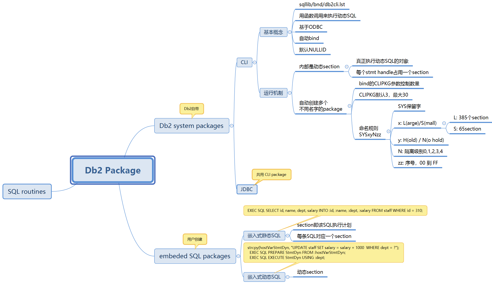

# 深入理解 Db2 package 的概念和机制
将 Db2 package 应用到你的工作中

**标签:** 数据管理

[原文链接](https://developer.ibm.com/zh/articles/ba-lo-improve-oltp-performance1/)

郝 庆运

发布: 2018-11-13

* * *

## 引言

最近几个月参与了一些 Db2 性能优化项目，时不时会遇到 Db2 package 相关的问题。回想起前两年遇到的那次银行关键渠道类系统数据库 hang 的问题，最后发现是 package 上竞争导致的。因此认为有必要结合自己的实际经验，把 Db2 package 相关内容梳理一下，也给读者做个参考。

Db2 package 很容易被忽略，但其实无处不在，无论什么编程语言，无论 SQL 类型是动态的还是静态的，都离不开 package。这样一个重要的对象，它也会有锁，也会有竞争，也会影响性能。本文第一部分将介绍 Db2 package 的基本概念，接着逐步讨论各种类型的 package，然后从 Db2 内部机制上理解 package 的作用和重要性，本文的第二部分来介绍 OLTP 系统中可能出现的与 package 相关的问题以及性能优化方法。

本文所讲的 Db2 package 并不是 PL/SQL package，而是指应用程序连接到数据库服务器执行请求时所要用到的 package，例如 CLI package，SQC 程序编译绑定后的 package 等。”package”翻译过来是”程序包”，本文仍然使用 package。

## 准备工作

要理解本文的内容，需要我们除了 Db2 基本知识和技能之外，还需要了解一些 Db2 应用程序开发相关的基本知识，了解不同的编程语言连接 Db2 的方式，例如 C/C++使用 CLI 方式，Java 语言的 JDBC 方式，嵌入式 C（.sqc）和嵌入式 Java（.sqlj）使用的嵌入 SQL 方式等，需要了解对于 sqc 文件的编译还额外需要预编译（db2 prep）和绑定（bind）的过程，不过不用担心，本文尽量隐藏这部分的细节，用一种比较简单的方式进行实验。

本文操作过程用了两台 SuSE 12 服务器作为 Db2 服务器和客户端，安装的 Db2 v11.1.3.3，利用 db2sampl 工具创建的 SAMPLE 数据库，并在客户端上进行数据库编目（catalog），如清单 1 所示。如果使用其他操作系统如 AIX 或者 Windows，在使用一些命令或者脚本时可能会比较麻烦。

##### 清单 1\. 创建 sample 数据库

```
#服务器端，用实例用户 db2inst1 执行
db2sampl -dbpath /ssddata/DB2/MYDB
#客户端
db2 catalog tcpip node server30 remote 197.3.xx.xx server 60000
db2 terminate
db2 catalog db sample as sample at node server30
db2 terminate

```

Show moreShow more icon

## Db2 package 是什么

Db2 知识中心似乎没有专门介绍 package 相关概念的文档，只是在一些文档零散的提到，结合多个文档的信息我们可以得知，package 是通过绑定（bind）命令，根据绑定文件（bnd 文件）的信息，在数据库中创建的对象；对于嵌入式 SQL 来说，储存的是 SQL 语句被解析编译后的” _解释效率更高的操作数字符串_ ”，当应用程序执行的时候 package 中存储的信息将被执行。

这个描述还是很模糊，那再结合一个我们已经都很熟悉的图，如图 1 所示，这是 Db2 编译 SQL 的内部过程，应用程序的 SQL 在 DB2 服务器内大致经过了 SQL 解析、语义检查、重写和优化、生成执行计划等几个过程，最后被 DB2 付诸执行。可被执行的是执行计划，结合起来可以得出这样的结论：Db2 package 中存储的是 SQL 语句的执行计划。

##### 图 1\. SQL 编译过程


这个结论还是无法让人满意，上述参考的信息更像是嵌入式 SQL 的场景，嵌入式 SQL 还分为嵌入式静态 SQL 和嵌入式动态 SQL，还有非嵌入式的 SQL 例如 CLI 方式、JDBC 方式等，这些不同的类型是否都是一致的 package 机制？

下文将对不同类型的 package 进行探索，如果迫不及待的想看 package 基本知识的总结，可以跳到本文最后的“Db2 package 总结”，那儿有个简单的思维导图。

## 嵌入式 SQL 的 package

首先以 sqc 程序为入口，来探索一下嵌入式 SQL 语句的 package。为了避免陷入 c 语言编程以及开发编译环境等细节，可以直接使用 Db2 自带的示例程序，这些示例程序都分门别类的放在 sqllib/samples 目录中。我们选择其中比较简单的表查询的 sqc 程序 sqllib/samples/c/tbread.sqc。

### 编译 sqc 程序并分析 package

在客户端机器上编译 tbread.sqc，步骤如清单 2 所示。

##### 清单 2\. 编译示例程序 tbread.sqc

```
# 在客户端，用 root 用户执行
# chmod -R 777 ~db2inst1/sqllib/samples/c   //修改权限
       # su - db2inst1
       > cd sqllib/samples/c

> vi makefile    //修改 UID 和 PWD 为 Db2 服务器相应的用户名和密码
       ALIAS=sampleUID=db2inst1PWD=passw0rd

> export PATH=.:$PATH   //将当前目录加入 PATH 环境变量
       > make tbread
       bldapp tbread SAMPLE db2inst1 passw0rd
      ......
       DB20000I The TERMINATE command completed successfully.
       # 在服务器端
       > db2 connect to sample
       > db2 list packages for all
       Bound Total Isolation
       Package Schema Version by sections Valid Format level Blocking
       ------- -------- -------- --------- -------- ----- ------ ---------
         --------

TBREAD   DB2INST1                    26  Y     0        CS         U

```

Show moreShow more icon

清单 2 中的 make tbread 命令，完成了对 tbread.sqc 的预编译、绑定、编译等过程，在当前目录生成了 tbread.bnd，tbread.c，tbread.o 以及可执行文件 tbread，这其中的细节不再赘述。同时 Db2 服务器端发现数据库中相应的出现了名为 “TBREAD” 的 package。

我们知道 package 是根据 bnd 文件创建的，那先来看看 tbread.bnd 文件的内容，可以使用 db2bfd 工具查看，如清单 3 所示。

##### 清单 3\. bnd 文件中内容

```
> db2bfd -s tbread.bnd  > /tmp/bnd.out
tbread.bnd: SQL Statements = 129
Line Sec Typ Var Len SQL statement text
---- --- --- --- --- ---------------------------------------------
57 0 5 0 21 BEGIN DECLARE SECTION
84 0 2 0 19 END DECLARE SECTION
155 1 15 0 56 DECLARE C0 CURSOR FOR SELECT deptnumb, deptname FROM org
158 1 4 0 7 OPEN C0
162 1 7 2 34 FETCH C0 INTO :H00001 , :H00003
168 1 7 2 34 FETCH C0 INTO :H00001 , :H00003
173 1 6 0 8 CLOSE C0

> vi tbread.sqc
int TbSelectUsingFetchIntoHostVariables(void)
{
EXEC SQL DECLARE c0 CURSOR FOR SELECT deptnumb, deptname FROM org;
EXEC SQL OPEN c0;
EXEC SQL FETCH c0 INTO :deptnumb, :deptname;
while (sqlca.sqlcode != 100)
{
EXEC SQL FETCH c0 INTO :deptnumb, :deptname;
}
EXEC SQL CLOSE c0;

```

Show moreShow more icon

在清单 3 中还查看了 tbread.sqc 的源代码片段，会发现 tbread.bnd 中 dump 出来的 SQL 信息和和源码中的嵌入式 SQL 是一一对应的。另外，还可以用 db2expln 工具从 package 中获取 SQL 的执行计划，命令和结果如清单 4 所示。

##### 清单 4\. 用 db2expln 工具获取 package 中执行计划

```
# 在 Db2 服务器端执行
            > db2expln -d sample -u db2inst1 -p tbread -o /tmp/expln.out
-------------------- SECTION ---------------------------------------
Section = 1
Statement:
DECLARE C0 CURSOR
FOR
SELECT deptnumb, deptname
FROM org
Section Code Page = 1208
Estimated Cost = 6.823210
Estimated Cardinality = 8.000000
Access Table Name = DB2INST1.ORG ID = 2,14
......
Return Data Completion
            End of section

```

Show moreShow more icon

在清单 4 中可以看到，利用 db2expln 获取了相应 SQL 语句的执行计划，这个命令是在 Db2 服务器端执行的，这时编译完成的 tbread 可执行文件还没有被执行过，仅仅是在 db2expln 命令的参数中指定了 package 的名字，这说明在客户端对 sqc 源码文件进行编译过程中，在数据库中创建了 package，package 中包含了相关语句的执行计划。

在 db2expln 的结果中，还注意到执行计划被标记为一个个的 SECTION，一共有 26 个 SECTION，与清单 2 中 db2 list packages for all 结果中”Total sections”的值相符，也与源代码文件中的 SQL 语句数量相符。我们可能会问，tbread.sqc 里每个语句放在一个 C 语言函数中，怎么确定不是每个函数对应一个 SECTION 呢，这个问题可以快速的验证，在任意一个函数里增加一个 SQL 语句（注意不是 FETCH 之类的操作符），重复上面的编译步骤和 db2expln 命令，得到的结果中会多一个 SECTION。

继续观察 db2expln 的结果，结合源代码文件和 db2bfd 结果文件，例如分别用 grep -i “DECLARE c”过滤三个文件，会发现部分源代码中的 SQL 语句在 db2expln 中没有出现，如 CURSOR C3 和 C4 相关的语句，部分结果如清单 5 所示。

##### 清单 5\. 源代码文件、db2bfd 结果和 db2expln 结果的差异

```
# 源码
    strcpy(strStmt, "SELECT deptnumb, deptname FROM org");
    EXEC SQL PREPARE stmt1 FROM :strStmt;
    EXEC SQL DECLARE c3 CURSOR FOR stmt1;
    EXEC SQL OPEN c3;
    EXEC SQL FETCH c3 INTO :deptnumb, :deptname;
    EXEC SQL FETCH c3 INTO :deptnumb, :deptname;
    EXEC SQL CLOSE c3;

# bnd 文件
    394 4 3 0 27 DECLARE C3 CURSOR FOR STMT1
    397 4 4 0 7 OPEN C3
    401 4 7 2 34 FETCH C3 INTO :H00001 , :H00003
    408 4 7 2 34 FETCH C3 INTO :H00001 , :H00003
    413 4 6 0 8 CLOSE C3

# db2expln 结果
> grep -i "DECLARE C" /tmp/expln.out
    DECLARE C0 CURSOR
    DECLARE C1 CURSOR
    DECLARE C2 CURSOR
    DECLARE C5 CURSOR
......

```

Show moreShow more icon

对比发现，游标 C3 和 C4 使用的是 PREPARE stmt -> DECLARE CURSOR FOR stmt 的方式，而其他的语句使用的是 DECLARE CURSOR FOR SELECT…的方式，这正是动态 SQL 和静态 SQL 的区别，即前者是动态 SQL，SQL 语句是作为参数传进去，在真正执行的时候才进行 SQL 编译，后者是静态 SQL，在应用程序编译时的预编译步骤进行了 SQL 编译并生成执行计划，提前存放在数据库服务器的 package（SECTION）中。

接下来的问题是，当应用程序执行时，SQL 语句是否还需要每次发送给服务器？package 中的 SECTION 即执行计划又是如何被执行的呢？

### sqc 程序的 package 是如何被执行的

当应用程序在客户端执行时，服务器端的 package 里的执行计划是如何被调用的，这可以借助 db2trc 工具来分析。为了减少 db2trc 结果的大小，这里对 tbread.sqc 进行了裁剪，只保留其中一个函数 TbSelectUsingFetchIntoHostVariables()，也就是清单 3 中看到的那部分源代码，然后重新进行了编译，这样可以使分析的过程更加容易和清晰。db2trc 命令如清单 6 所示。

##### 清单 6\. 用 db2trc 工具分析 package 执行过程

```
# 在服务器端
> db2trc on -f tbread.dmp
# 在客户端
> ./tbread  sample  db2inst1  passw0rd
# 在服务器端
> db2trc off
    > db2trc flw tbread.dmp tbread.flw
    > db2trc fmt tbread.dmp tbread.fmt
    > less tbread.fmt
    51925 data DB2 UDB common communication tcprecv fnc (3.3.43.22.0.2)
     Data3 (PD_TYPE_DEFAULT,272) Hexdump:
     0012 D041 0001 000C 1041 0008 1404 14CC ...A.....A......
     04B8 004E D051 0002 0048 2014 0044 2113 ...N.Q...H ..D!.
     5341 4D50 4C45 2020 2020 2020 2020 2020 SAMPLE
     2020 4442 3243 4950 5320 2020 2020 2020 DB2INST1

    2020 2020 5442 5245 4144 2020 2020 2020        TBREAD

```

Show moreShow more icon

在 db2trc format 的结果中查看 tcprecv 函数的相关记录，这个函数用于 Db2 服务器与应用客户端之间的通讯，在 db2trc 中能够以 HEX 格式打印出 Db2 服务器所收到的请求和数据。搜索之后发现，应用程序执行了 SQL 并获得了结果，但这个过程 Db2 收到的请求中并没有包含 SQL 语句，而是只有 package 相关的信息。在清单 6 中找到了 Db2 接收到请求的函数顺序号是 51925，然后在 db2trc flw 结果中看这之后 Db2 是如何处理请求的，部分结果如清单 7 所示。

##### 清单 7\. 理解 package 调用过程

```
> less tbread.flw
    52049 | | | | | | | sqlrr_open
    52050 | | | | | | | | sqlrr_sql_request_pre
    52163 | | | | | | | | | sqlra_get_section
    52164 | | | | | | | | | | sqlra_load_pkg
    52165 | | | | | | | | | | | sqlra_search_for_pkg
    52175 | | | | | | | | | | | sqlra_open_pkg
    52178 | | | | | | | | | | | | sqlra_find_pkg
    52179 | | | | | | | | | | | | | sqlra_pkg_lock
    52182 | | | | | | | | | | | | | | sqlrr_get_lock
    52191 | | | | | | | | | | | | | sqlra_cache_find_pkg_latch_anchor
    52199 | | | | | | | | | | | | | sqlra_cache_ins_pkg
    52211 | | | | | | | | | | | | | sqlrr_get_lock
    52215 | | | | | | | | | | | | | sqlra_cache_fill_pkg
    52307 | | | | | | | | | | | | | | sqlrlCatalogScan::fetch
    52596 | | | | | | | | | | sqlra_find_sect
    53273 | | | | | | | | | | sqlra_sqlW_get_static_section
    53301 | | | | | | | | | | | sqlriSectSetup
    53314 | | | | | | | | | | | | sqlnxPlanActuals::initialize
    53330 | | | | | | | | sqlrr_process_open_request
    53435 | | | | | | | | sqlrr_process_fetch_request
    53474 | | | | | | | | | | | sqlriFetch
    53475 | | | | | | | | | | | | sqldRowFetch

> less tbread.fmt
    53314 DB2 UDB SW- explain sqlnxPlanActuals::initialize fnc
        (1.3.70.475.0)
     ....
     Data2 (PD_TYPE_STRINGN,54) String with size:

    SELECT Q1.DEPTNUMB, Q1.DEPTNAME FROM DB2INST1.ORG AS Q1

```

Show moreShow more icon

在清单 7 中列出了梳理之后的函数调用关系，会发现 DB2 收到应用程序（tbread）的请求之后，直接去找 SECTION（sqlra\_get\_section），这个过程中大致经历了加载 package -> 搜索 package -> 打开 package -> 锁定 package -> 从 catalog 中获取 package -> 找到 SECTION -> setup SECTION 等步骤，其中最后一步 setup 时可以看到实际的执行计划（sqlnxPlanActuals::initialize 对应的信息）中重写后的 SQL 语句。在找到 SECTION 也就是执行计划之后，紧接着是调用底层 DMS 模块相关的函数例如 sqldRowFetch 去获取数据。这个过程中确实没有去调用 SQL 编译器相关的函数（sqlnn，sqlno 等开头的函数）。另外需要说明的是，这部分的内容太过于底层，没有公开的信息，作者也是根据函数名结合相关知识进行的粗略分析，我们不必太过于关注这些函数的准确含义。

至此，我们可以这样理解，每个嵌入式 C 程序都在数据库中对应一个 package，package 内是由 SECTION 组成，SECTION 就是执行计划，应用程序的每个静态 SQL 都分别对应一个 SECTION。当应用程序执行时不需要把静态 SQL 发送到服务器，而是传递了 package（和 SECTION）等信息，服务器从 catalog 中加载 package 以及 SECTION 即执行计划，然后直接执行相应的执行计划。

嵌入式 SQL 是这样的工作机制，那对于非嵌入式 SQL 例如 CLI、JDBC 方式等，又是怎样的机制呢？

## Db2 CLI 程序的 package

与嵌入式 SQL 相比，Db2 CLI（Call Level Interface）可能应用的更广泛一些，Db2 CLI 是 Db2 服务器提供的可调用接口，使应用程序可以通过调用 API 函数来执行动态 SQL，而且不需要像嵌入式 SQL 那样需要预编译和绑定。

看起来 Db2 CLI 方式更加直接和方便，开发人员也不需要考虑 package 的问题，只需要把 C 语言文件正常编译之后就能够运行。再用 DBA 的视角来看，Db2 CLI 应用程序建立到数据库的连接之后，Db2 服务器为每个连接分配一个 coordinator agent，应用程序把要执行的动态 SQL 发送到 Db2 服务器即 coordinator agent，该 agent 负责对收到的 SQL 进行编译（即图 1 的过程）并执行，然后将结果返回给应用程序。似乎这个过程没有 package 什么事情，但显而易见这不是事实，因为我们已经或多或少的知道 CLI package 的存在，在文档里，在命令里，在 snapshot 里……

### 重新认识 CLI package

Db2 CLI package 不为人所知，是因为太低调、太默默无闻了。当 Db2 创建数据库时 CLI package 就被自动的绑定，甚至在做 fix pack 升级时，新版本的 CLI package 也会被自动的绑定。在 Db2 知识中心的” [CLI bind files and package names](https://www.ibm.com/support/knowledgecenter/en/SSEPGG_11.1.0/com.ibm.db2.luw.apdv.cli.doc/doc/r0007866.html)“中有更多的介绍，CLI package 可以通过 sqllib/bnd/db2cli.lst 来绑定或重新绑定，CLI package 包括 SYSSHxyy，SYSSNxyy，SYSLHxyy，SYSLNxyy 等不同类型，其命名规则是，SYS 是保留字，后续依次 S/L 代表 Small 或者 Large，H/N 代表 WITH HOLD 或者 NOT WITH HOLD 也就是说 package 里有游标（cursor），x 代表隔离级别（0=NC, 1=UR, 2=CS, 3=RS, 4=RR），yy 代表同类型 package 的序号（取值 00 到 FF）。还提到，一个大 package 内有 385 个 SECTION，一个小 package 中有 65 个 SECTION。

接下来从 Db2 环境中实际看一下 CLI package，如清单 8 所示（因篇幅考虑，对结果进行了裁剪）。

##### 清单 8 查看 CLI package

```
# 在服务器端
> db2 connect to sample
    > db2 list packages for all | egrep 'SYSL|SYSS'
     Bound Total Isolation
    Package Schema by sections Valid level Blocking
    ----------- -------- --------- -------- ------- --------- --------
    SYSLH100 NULLID SYSIBM 385 Y UR B
    SYSLH101 NULLID SYSIBM 385 Y UR B
    SYSLH102 NULLID SYSIBM 385 Y UR B
    SYSLH200 NULLID SYSIBM 385 Y CS B
    ...
    SYSLN100 NULLID SYSIBM 385 Y UR B
    SYSLN101 NULLID SYSIBM 385 Y UR B
    SYSLN102 NULLID SYSIBM 385 Y UR B
    SYSLN200 NULLID SYSIBM 385 Y CS B
    ...
    SYSSH100 NULLID SYSIBM 65 Y UR B
    SYSSH101 NULLID SYSIBM 65 Y UR B
    SYSSH102 NULLID SYSIBM 65 Y UR B
    SYSSH200 NULLID SYSIBM 65 Y CS B
    ...
    SYSSN100 NULLID SYSIBM 65 Y UR B
    SYSSN101 NULLID SYSIBM 65 Y UR B
    SYSSN102 NULLID SYSIBM 65 Y UR B
    SYSSN200 NULLID SYSIBM 65 Y CS B
    ...

    SYSSTAT     NULLID   SYSIBM          40 Y        UR        B

```

Show moreShow more icon

原来这些默默存在的、甚至 schema 都是”NULLID”的 package 就是与 sqllib/bnd/db2cli.lst 相对应的 CLI package。在清单 8 中可以看到，除了 SYSSTAT 之外的每一种类型（相同的 size、HOLD 属性、隔离级别）的 CLI package 都是三个，例如 SYSLH100/101/102（为什么是 3 个呢？），还看到不同大小的 package 分别包含了 385 个和 65 个 SECTION，以及所有 package 的 Blocking 属性都是 B（这又是什么意思？）。

同样的，用 db2bfd 工具查看 CLI package 的 bnd 文件，如清单 9 所示，可以看到 db2clipk.bnd 里里面只有一个 INCLUDE SQLCA 语句，另一个文件 db2clist.bnd 中有一系列的基本的操作语句，没有看到嵌入式静态 SQL 那种应用程序的 SQL 语句。

##### 清单 9 查看 CLI package 的 bnd 文件

```
> cd ~/sqllib/bnd; cat db2cli.lst
    db2clipk.bnd+
    db2clist.bnd
> db2bfd -s db2clipk.bnd
    db2clipk.bnd: SQL Statements = 1
    Line Sec Typ Var Len SQL statement text
    ---- --- --- --- ---
        ---------------------------------------------------------
     52 0 10 0 13 INCLUDE SQLCA
> db2bfd -s db2clist.bnd
    db2clist.bnd: SQL Statements = 42
    Line Sec Typ Var Len SQL statement text
    ---- --- --- --- ---
        ---------------------------------------------------------
     126 0 5 0 21 BEGIN DECLARE SECTION
     183 0 2 0 19 END DECLARE SECTION
     189 1 22 1 15 CALL :H00001
     192 2 22 2 41 CALL :H00001 USING DESCRIPTOR :H00028
     195 3 0 5 78 VALUES(SUBSTR(:H00002 ,:H00016,:H00017 ))

```

Show moreShow more icon

到这里，我们会有这样的理解，CLI 程序的执行需要通过 CLI package，package 里也有多个 SECTION，这和嵌入式 SQL 的 package 都很像，不同的是，CLI package 是 Db2 自动绑定的，和应用程序无关的，还包括很多不同类型的，而且其 SECTION 应该不是编译优化之后的执行计划，因为连 SQL 语句都没有。

### CLI package 在应用程序执行时的工作机制

重新认识了 CLI package 基本概念之后，接下来探索一下 CLI package 在应用程序执行时的工作机制。首先需要准备一个 CLI 应用程序，同样的可以使用 Db2 自带的示例程序 tbread.c，其代码功能与 tbread.sqc 是类似的，编译过程如清单 10 所示。

##### 清单 10 编译 CLI 示例程序

```
# 在客户端，用 root 用户执行
# chmod -R 777 ~db2inst1/sqllib/samples/cli   //修改权限
# su - db2inst1
> cd sqllib/samples/cli

> export PATH=.:$PATH   //将当前目录加入 PATH 环境变量

> make tbread

> ./tbread sample  db2inst1 passw0rd

```

Show moreShow more icon

有了应用程序，同样的利用 db2trc 工具理解应用程序执行时 Db2 服务器端的工作机制。为了便于抓取 trace 结果，以及控制 trace 结果的大小，对 tbread.c 稍作修改，增加了 sleep 时间，这样便于我们从容的切换命令行终端窗口进行操作。代码修改和 db2trc 命令如清单 11 所示。

##### 清单 11 用 db2trc 工具分析 CLI package 执行过程

```
# 在客户端
> vi tbread.c    //为便于分析只执行第一个函数，sleep 是为了便于切换终端来收集 trace
    printf("\nbegin to sleep 15s.\n");
    sleep(15);
    rc = TbBasicSelectUsingFetchAndBindCol(hdbc);
    sleep (600);
> rm tbread; make tbread

> ./tbread sample  db2inst1 passw0rd
# 在服务器端，等待客户端输出"begin to sleep 15s"启动 trace，稍后关闭。
> db2trc on -f tbread.dmp2
> db2trc off
> db2trc flw tbread.dmp2 tbread.flw2
> db2trc fmt tbread.dmp2 tbread.fmt2

> less tbread.fmt2
     20689 data DB2 UDB common communication tcprecv fnc (3.3.43.22.0.2)

     2020 2020 2020 2020 2020 2020 4E55 4C4C                NULL
     4944 2020 2020 2020 2020 2020 2020 5359    ID            SY
     5353 4832 3030 2020 2020 2020 2020 2020    SSH200
     5359 534C 564C 3031 0004 0005 2116 F100 SYSLVL01....!...
     1AD0 5300 0200 1424 5000 0000 000A 5749 ..S....$P.....WI
     5448 2048 4F4C 4420 FF00 32D0 4300 0200 TH HOLD ..2.C...

     2C24 1400 0000 0022 5345 4C45 4354 2064    ,$....."SELECT d
     6570 746E 756D 622C 206C 6F63 6174 696F    eptnumb, location
> less tbread.flw

```

Show moreShow more icon

与之前同样的方法，在 db2trc format 的结果中查看 tcprecv 函数的相关记录，与清单 6 的结果不同，在清单 11 中可以看到，CLI 应用程序向服务器发送的请求中包含了 SQL 语句，同时也包含了 package 信息（NULLID SYSSH200）等。这里的 SYSSH200，根据命名规则可以知道，这是一个 Small package（里面有 65 个 SECTION）， WITH HOLD 属性的 cursor，隔离级别是 2 即 CS，编号 00 即同类型 pacakge 的第一个。

在 db2trc flw 结果中，因为有了前面的经验，直接搜索函数 sqlra\_get\_section，果然找到了该函数，并且随后还会看到与清单 7 中嵌入式 SQL 场景 trace 结果中类似的 package 相关的函数调用，以及不太一样的 SECTION 相关函数。再往后看却会发现更明显不同之处，这次的结果出现了 sqlnn，sqlno，sqlnp，sqlnq 等函数调用，这些函数是 SQL 编译和优化的过程用到的，说明应用程序发送过来的动态 SQL 请求在服务器进行编译过程然后付诸执行。具体的函数调用关系比较长，文中不再列出。

通过以上的探索，我们对 CLI package 有了重新的认识，CLI package 和嵌入式 SQL 的 package 总体上是一样的机制，package 里面也是 SECTION，CLI 应用程序执行也是需要通过 package 和 SECTION，这里的 SECTION 可以理解为动态的 SECTION（对应嵌入式静态 SQL 的静态 SECTION），是在 SQL 语句现场编译之后生成的执行计划。对于 CLI package 先探索到这里，其中还有很多细节限于篇幅便不再展开。

## Db2 package 总结

上文主要介绍了嵌入式 SQL 的 package 和 CLI package，包括基本概念以及比较底层的工作机制等。关于 Db2 package 也还有很多内容，例如还有主流的 JDBC 方式对应的 package，简单提一句 JDBC 用的也是 CLI package。更多内容不再展开，用一张比较简陋的思维导图作为 Db2 package 内容的总结，如图 2 所示。

##### 图 2\. Db2 package 思维导图



以上是本系列的第一部分，基本上全是理论，没有与实践相结合的理论都是无用的理论，因此在本文第二部分将与实践相结合，介绍与 Db2 package 相关的性能问题以及如何优化。

最后，本文仅代表笔者观点，不代表 IBM Db2 官方观点。

## 参考资料

**学习**

- [DB2 packages: Concepts, examples, and common problems](https://www.ibm.com/developerworks/data/library/techarticle/dm-0606chun/index.html) ，这是 2006 年 developerWorks 英文网站的文章，虽然很老且少量内容不准确，但非常有帮助，其介绍了基本概念和常见使用上的问题，而本文关注点是内部机制和性能优化。
- [Precompilation of embedded SQL applications with the PRECOMPILE command](https://www.ibm.com/support/knowledgecenter/en/SSEPGG_11.1.0/com.ibm.db2.luw.apdv.embed.doc/doc/c0005528.html) ，了解嵌入式 SQL 的预编译。
- [Binding embedded SQL packages to a database](https://www.ibm.com/support/knowledgecenter/SSEPGG_11.1.0/com.ibm.db2.luw.apdv.embed.doc/doc/c0005563.html) ，了解如何绑定 package。
- 通过 [The SQL and XQuery compiler process](https://www.ibm.com/support/knowledgecenter/en/SSEPGG_11.1.0/com.ibm.db2.luw.admin.perf.doc/doc/c0005292.html) 学习和了解 DB2 中 SQL 是如何编译以及生成执行计划的。
- [Application, bind file, and package relationships](https://www.ibm.com/support/knowledgecenter/en/SSEPGG_11.1.0/com.ibm.db2.luw.apdv.embed.doc/doc/c0005563.html) ，介绍了三者之间的关系。
- [CLI bind files and package names](https://www.ibm.com/support/knowledgecenter/en/SSEPGG_11.1.0/com.ibm.db2.luw.apdv.cli.doc/doc/r0007866.html) ，介绍了 CLI package 的 bnd 文件和 package name。
- [Package recreation using the BIND command and an existing bind file](https://www.ibm.com/support/knowledgecenter/en/SSEPGG_11.1.0/com.ibm.db2.luw.apdv.embed.doc/doc/c0005532.html) ，如何用 bind 命令重新绑定 package。
- [db2bfd – Bind file description tool command](https://www.ibm.com/support/knowledgecenter/zh/SSEPGG_11.1.0/com.ibm.db2.luw.admin.cmd.doc/doc/r0002044.html) ，一个比较有用的工具。
- [db2trc – Trace command](https://www.ibm.com/support/knowledgecenter/SSEPGG_10.5.0/com.ibm.db2.luw.admin.cmd.doc/doc/r0002027.html) ，db2trc 工具不仅在分析数据库 HANG 问题时非常有用，应该说各种场景都非常有帮助，尤其是想要理解 Db2 内部工作机制。
- [What are “Internal Plan Lock” and “Internal Variation Lock” objects ?](http://www-01.ibm.com/support/docview.wss?uid=swg21503717) ，简要介绍了 package lock。
- 通过 [DB2 知识中心](https://www.ibm.com/support/knowledgecenter/en/SSEPGG_11.1.0/com.ibm.db2.luw.apdv.embed.doc/doc/c0005532.html) ，了解 DB2 的详细产品信息和相关技术等全面的内容。
- 随时关注 developerWorks [技术活动](http://www.ibm.com/developerworks/cn/offers/techbriefings/) 。

**获得产品和技术**

- 使用可直接从 developerWorks 下载的 [IBM 产品评估试用软件](http://www.ibm.com/developerworks/cn/downloads/) 构建您的下一个开发项目。