# 深入理解 Vue 全家桶
Vue 系列全面应用

**标签:** JavaScript,Web 开发,软件开发

[原文链接](https://developer.ibm.com/zh/articles/understanding-vue-family/)

杨卓

发布: 2020-08-11

* * *

Vue 是一个 MVVM 框架，是一套用于构建用户界面的渐进式框架，不同于其他框架，是自底向上的逐层应用框架。它不再关注于其他层，只关注视图，使得 Vue 极为容易上手且便于第三方库相整合。

本文所要介绍的是 Vue 的全家桶，即 Vue+Vuex+Vue Router+axios+UI 库。具体来说包括：Vue 作为整体框架，通过 Vue CLI 构建项目；Vuex 即 Vue 的中心化管理方案来集中存储、管理应用的所有组件状态；Vue Router 即 Vue 的路由管理器来管理组件路由；axios 作为基于 Promise 的 HTTP 库负责浏览器端即服务器端的数据传输；ElementUI、Bootstrap 等 UI 组件库作为 UI 框架库。

## Vue 框架基本导览

首先我们来回顾一下 Vue 的核心知识点。

### Vue 的特点

前文提到 Vue 的设计是自底向上增量开发的渐进式框架。您不免疑惑什么是渐进式，简单来说，所谓的渐进式框架就是不需要多强大，而是术业专攻，只做需要做的事情。对于 Vue 来说，渐进式就是只关注于视图层，也就是它的使用方式：声明式渲染 – 组件系统 – 客户端路由 – 大规模状态管理 – 构建工具。

- 声明式渲染：声明式渲染与命令式渲染最大的区别在于声明式渲染不再去指示程序怎样做，而是只关心最后的运行结果，将结果告知程序即可。
- 组件式开发也是 Vue 的一个核心点：Vue 会将页面最后映射成为一个组件树，通过向根组件加载子组件生成一个页面：

    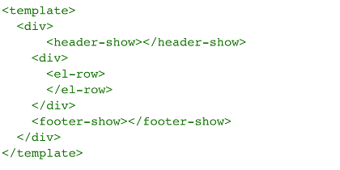

    我们可以将一个网页视作一个树，每个组件都是树的一个分支，下图展示了网页到组件树的转换：

    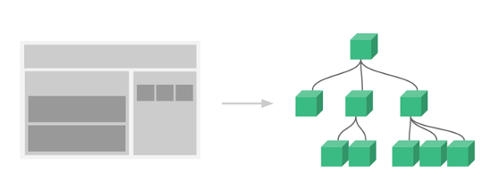

- 客户端路由则是我们后面要介绍的 Vue Router，大规模状态管理则为 Vuex，构建工具 Vue CLI。

- Vue 最核心的特点则是它的数据双向绑定，通过 `Object.definedProperty` 中的 `setter/getter` 对数据进行监听，达到数据响应式绑定的效果。当监听到数据变化时，Vue 能够快速更改 DOM 数据（得益于 Diff 算法）。

### 生命周期

相比于传统 HTML5+JavaScript 页面，Vue 引入了生命周期的概念，因为每个 Vue 实例在被创建的时候都要经过一些列的初始化过程（数据监听、模板编译、实例挂载、DOM 更新、组件销毁等）。通过为不同阶段添加运行函数（包括 `beforeCreate`, `created`, `beforeMount`, `mounted`, `beforeUpdate`, `updated`, `beforeDestroy`, `destroyed`），满足用户在实例的不同阶段添加不同动作的需求。具体流程为：

1. 通过构造函数生成 Vue 实例，而后事件和生命周期钩子初始化，`beforeCreate` 在 `s` 数据初始化前调用。
2. 数据会被初始化但此时 DOM 并未被挂载；判断是否已经存在 `el` 对象，如果还未生成则挂载则检查是否有 template，有则通过将 template 转化为 `render` 函数渲染创建 DOM 树，无则将最外层的 HTML 作为 template，此时 `beforeMount` 在 `mounted` 之前调用并生成虚拟 DOM。
3. 创建 `$el` 并转化为真正的 DOM，此时完成挂载，来到 `mounted`，至此 DOM 已经生成，并可进行 DOM 操作；而当数据有更新的时候则调用 `beforeUpdated`。
4. 通过 Diff 算法计算虚拟 DOM 的变化，并以最小的消耗来更新 DOM 并渲染；
5. 当 `$destroy` 被调用时，则会清除所有的事件、监听等，在此之前 `beforeDestroy` 还是可以访问 DOM 的，执行了此方法后则组件销毁，无法再次访问。

下图展示了 Vue 生命周期示意图：

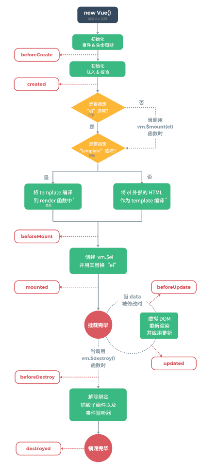

### 模板语法

Vue 遵循了 HTML 的模板语法，对于前端开发者很友好，比如：对于文本直接使用 `{{}}` 即可插入，通过加入 `v-html` 指令则可以输出 HTML，甚至可以在 `{{}}` 中输入 JavaScript 语句。

说到 Vue 的模板语法不得不提的就是指令了，下面总结一下 Vue 的内部指令，它们的使用方法相似：`

`，就不一一都加示例了。

- `v-if/else`, `v-else-if`, `v-show/if`：这几个作用相似，都是用来显示或隐藏某些元素。通过绑定 boolean 变量来控制元素的显示与隐藏。
    其中，`v-if` 与 `v-show` 都是在绑定值为 `true` 时显示，区别在于，`v-if` 在切换时 DOM 会被销毁、重建，开销相对比较高，用于少量的改变；而 `v-show` 则是通过改变 CSS 的 display 属性来进行改变相对来说开销较小。
- `v-for`：用来对对象进行遍历来渲染列表，使用的时候为指令绑定一个数组或对象通过 item in items 的形式。注意，由于 `v-for` 的就地更新策略，一旦组件依赖子组件，当数据项的顺序被改变时，临时 DOM 状态就会出问题，所以需要通过绑定 key 来支持 Vue 跟踪每个节点。因此，要尽可能在使用 `v-for` 的时候提供 key，它能够帮助虚拟 DOM 算法来对比新旧节点。
- `v-text/html`：`v-text` 与 `{{}}` 的作用相同，但是更加稳定； `v-html` 前文也提过，可以输出 HTML 代码。
- `v-on`：此指令也可以写作 `@`，如 `v-on: click=””` 等同于 `@click=””`。用于绑定事件，如 `click`、`change`、`input` 等。
- `v-model`：此指令主要用来对 `input` 的数据进行监控，值要预先在 data 中声明。
- `v-bind`：用于处理 html 标签的动态赋值，也可简写为`:`, 如：`v-bind: src=””` 等同于 `:src=””`。
- `v-pre`,`v-cloak`, `v-once`：此三个指令使用相对较少。`v-pre` 用于跳过编辑，直接输出原始值，`v-cloak` 则是在 Vue 渲染完整个 DOM 才会渲染，与 CSS 一同使用（如下图），`v-once` 则是只有 DOM 第一次渲染，而后不改变。

    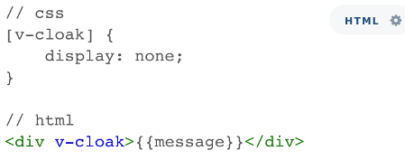

## 快速搭建 Vue 项目

下面我将介绍如何搭建一个 Vue 项目，这也是分情况的：对于比较简单的系统只要引入 Vue 就可以了，不推荐脚手架（即 Vue CLI，用来创建新项目并自动生成 Vue 和 webpack 的项目模板。）搭建，因为反而会显得项目很繁杂；而对于中大型项目可以采用 Vue CLI 的方式搭建。下面展示如何使用 Vue CLI 的方式搭建一个项目：

1. 首先要安装 npm，确保具有 Node 环境，可以通过 `npm -v` 来检查。
2. 通过 `vue -V` 检查 Vue 版本，因为 Vue 3.0 的很多操作会有不同。
3. 安装 Vue CLI，全局安装即可：`npm install vue-cli -g` （Mac 系统需要在前面加上 `sudo` 来确认权限）。
4. 出来 `+ vue-cli@2.9.6` 则表示安装成功了
5. 然后通过 `vue init webpack my-project` 来创建项目，`my-project` 是项目名。
6. 通过引导填写项目相关信息，则可以自动生成项目。

    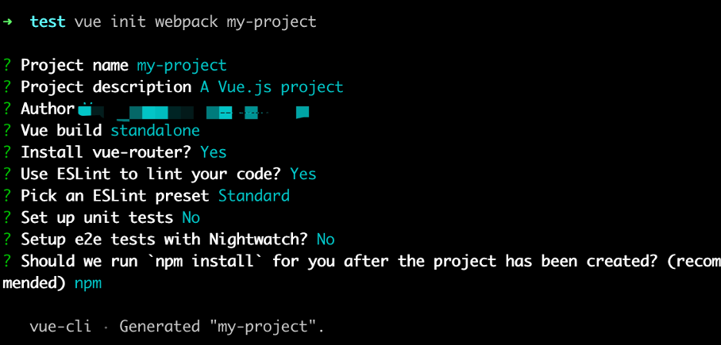

7. 当出现 `Project initialization finished` 表示项目搭建完成。

    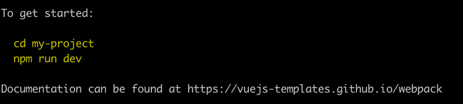

    通过以上图中两个命令即可进入项目。

## Vue 状态管理模式

还记得前文介绍渐进式时提到的大规模状态管理吗？对应的管理工具就是 Vuex。它采用的是集中式存储管理所有组件状态，并保证状态按照规定变化。同脚手架 Vue CLI 相同，Vuex 并不适用于所有类型的项目，当构建的项目为中大型时，可以通过 Vuex 来管理组件状态，对于小型项目反而显得冗余。

讲到状态管理，首先要提单项数据流，即要求数据流只能通过一个方向来修改。Vue 所用的双向绑定（即 model 可以直接修改状态，以及用户交互也可以修改状态）使得代码难以预测。相比而言，单向数据流需要修改状态时则需要重新走流程使得状态更加可预测。Vuex 就是实现了单项数据流：通过 `state` 存储状态，`getters` 来获取 `state`，`mutations` 来改变状态，`actions` 来调用 `mutations` 改变状态。所虽然 Vuex 中状态依旧是双向绑定的，但是我们不能够直接改变 store 中的状态，而是通过提交 `mutation` 来改变，强制变成了单向数据流。如下图，左侧为单向数据流的简易图，右侧为 Vuex 实现的单向数据流。

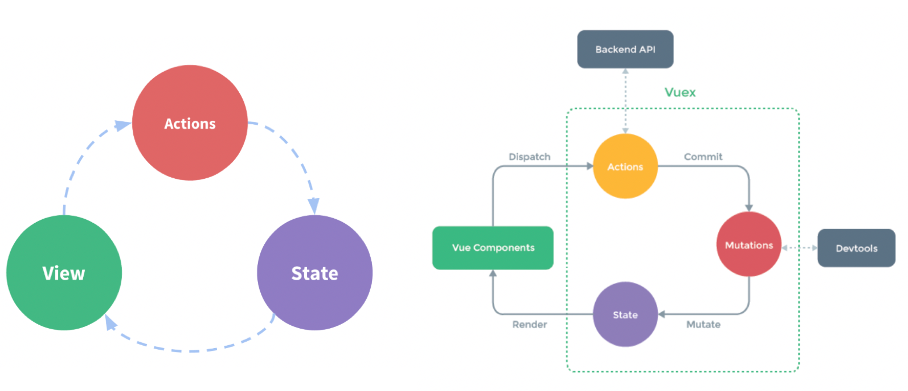

### 安装 Vuex

- `npm install vuex –save` 或 `` 或 `yarn add vuex`。
- 在 vue-cli 系统中，`import Vuex from ‘vuex’`; 并通过 `Vue.use (Vuex)` 引入。

### 创建 Store

完成安装后，我们就可以创建 store 了，需要的仅仅是提供一个初始 `state` 对象和 `mutation`。在 Vue 项目结构中的目录如下图所示：

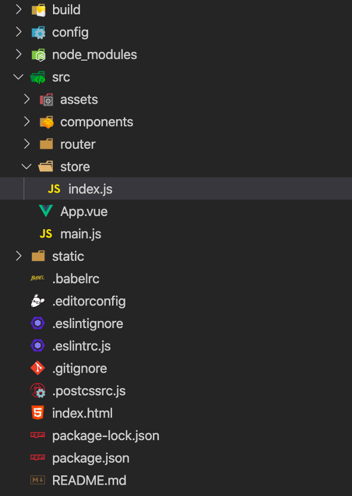

首先在 `store/index.js` 中创建 store：

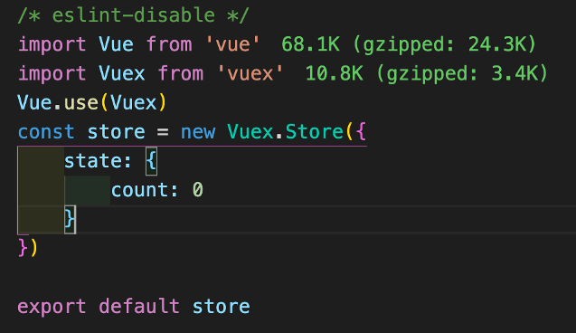

并在 `main.js` 中引用：

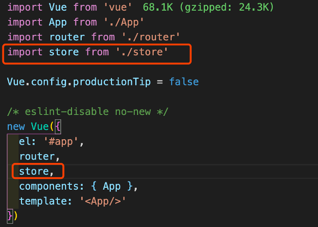

而后就可以在 `.vue` 文件中引用创建好的 store 了：

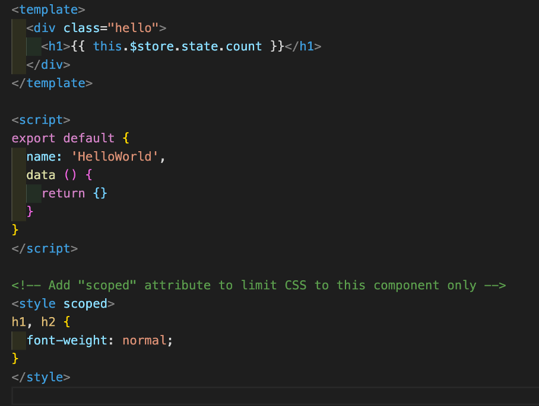

在此之后便可以开始业务代码的编写。

### 编写业务代码管理状态

- `state`：在组件中展示，在组件中无需引用、注册等步骤，只需通过 `this.$store.state` 即可获取。当组件中需要获取多个状态的时候，可以采用 mapState 辅助函数来帮助我们生成计算属性。但是要引入 `import {mapState} from ‘vuex’`，并在 computed 中使用。

    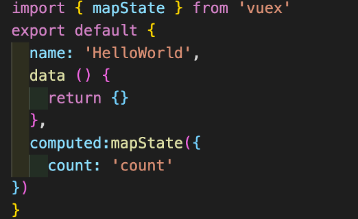

- `getters`：同 Vue 一样，Vuex 也具有计算属性 `getter`，`getter` 也会根据依赖缓存返回值，当依赖变化时重新计算，使用 `getter` 能够解决当多个组件都需要用到某个属性时要反复复制函数或抽取共有函数的问题。`getter` 需要将 `state` 作为第一个参数来运行：在 `index.js` 中定义 `getters`：

    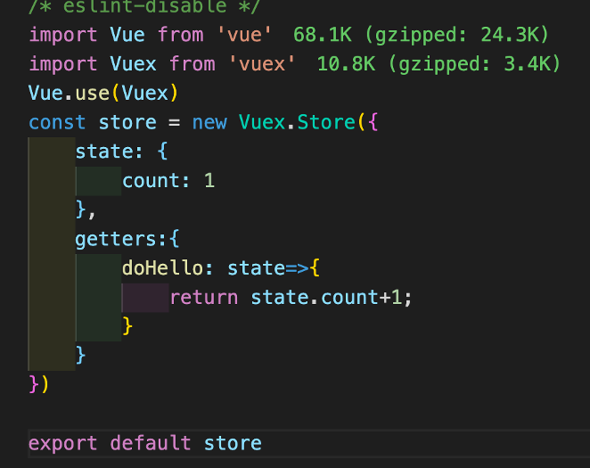

    然后，即可直接在 Vue 页面通过 `this.$store.getters.xx` 引用。

    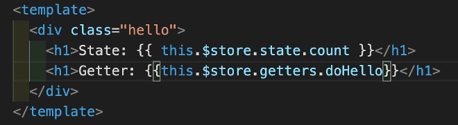

     同样的 `getters` 也有辅助函数 `mapGetters`，用法与 `mapStates` 相同。

- `mutations`：如果我们需要动态改变 `state` 中的状态要怎么办呢？`mutation` 是唯一改变 Vuex 状态的方法，每个 `mutation` 都接受 `state` 作为第一个参数，一个字符串的事件类型并有一个回调函数。下图展示了如何创建 `mutation`：

    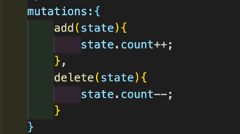

但是即使我们已经完成 `mutation` 的定义，也不能够直接调用它，我们需要 `store.commit(‘add’)` 来调用 `mutation handler`。当然，也不是只能传入一个参数，可以传入多个参数，称为载荷。注意，`mutation` 只能是同步函数，否则会导致当 `mutation` 被触发时可能回调函数还未被调用。

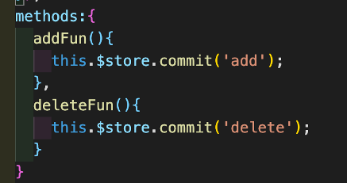

- actions：与 `mutation` 很相似，但是略有不同，区别在于 `action` 可以提交 `mutation` 而非直接改变状态，并且可以包含一步操作。`action` 的使用也是包括注册和调用。注册时，向 `action` 中传入一个参数 `context`，通过调用 `context.commit` 来提交一个 `mutation`，也可以通过 `context.state` 和 `context.getters` 来获取 `state` 和 `getters`。

    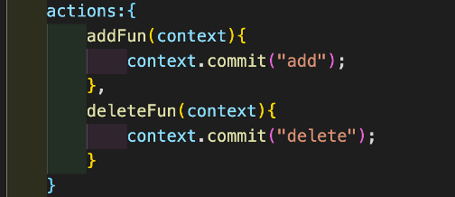

    注册成功后，`action` 要通过 `store.dispatch` 来触发，这样 `action` 就可以异步操作了。也可以对比一下 `mutation` 和 `action` 的调用方法：

    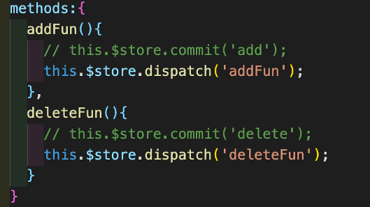

- `module`：为了解决在大的项目中，使用状态树会使得整个 store 对象很臃肿，Vuex 引入了 `module` 的概念，能够将整个 store 分割成模块，给每个模块赋予自己的 `state`、`mutations`、`actions`、`getters`。

## 嵌套路由

在页面之间我们需要做到跳转，而 Vue 是单页面应用，那么做到视觉上的页面间跳转就要依赖 Vue Router 了。而 Vue Router 的功能并不仅仅局限于此，它的功能包含：嵌套的路由/视图表、模块化的、基于组件的路由配置、导航控制、HTML5 历史模式或 hash 模式等。

### 安装 Vue Router

Vue Router 的安装使用很简单，只需在 HTML 页面引入 `vue-router.js` 即可。
如果使用 Vue CLI 构建应用，导入 Vue 和 Vue Router，而后通过 `Vue.use(VueRouter)` 即可使用 Vue Router，而后我们就可以通过 `this.$router` 访问当前路由器了。下图展示了如何安装使用 Vue Router：

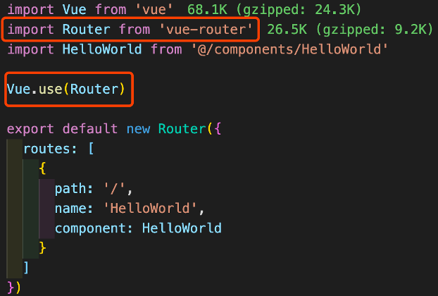

### 路由的使用

在 Vue 项目中，因为单页面的特性，一个页面时有很多层嵌套的组件构成的，所以 URL 中的各段路由也是按照相应结构来来对应嵌套的组件。如下图 `router-view` 是最顶层的节点：

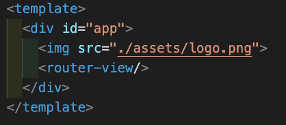

如果需要同时展示多个视图呢？则可以采用命名视图，通过给 `router-view` 添加 `name` 属性来对组件进行命名，注意，要保证组件的正确使用。

我们可以在嵌套的出口渲染组件，在 `router` 文件夹中的 `index.js` 中进行配置，在配置路由的时候更推荐为每个路由命名（如下图所示），这样链接路由的时候便也可以通过路由名称来链接了。如 `router.push({ name: 'user', params: { userId: 123 }})`。另外在编写程序时，我们常会需要通过 URL 对某些值进行传递，我们可以通过 `{path: ‘/user/:id', component: User}` 来进行传值，通过 `this.$route.params` 来获取参数。

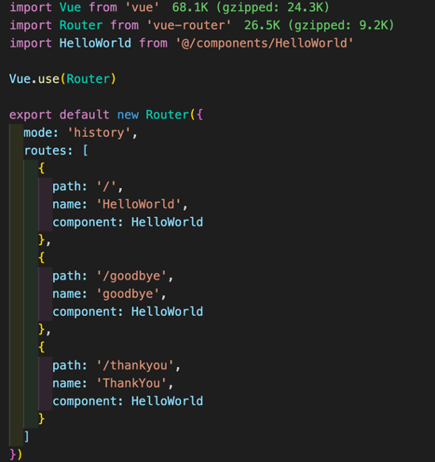

您会发现还有一个参数 `mode`，在 Vue Router 中我们有两种 mode 可选，即 `history` 和 `hash` 模式，您可能会发现，默认的我们的程序 URL 会带有 `#`，如：`http://localhost:8080/#/`，这就是默认的 `hash` 模式，这与我们平时所见的网站 URL 不是很相似，带有 `#` 会显得网站不是很正规，那么改成 `history` 模式就可以解决了。

## 标签跳转及内部跳转

在页面的 HTML 中如果需要进行路由跳转，可以通过 `<router-link>` 来设置跳转，它会被渲染成为我们所熟知的 `<a>` 标签。而且 `<router-link>` 也可以通过绑定 to 来在导航中填写需传递的参数：`<router-link :to="{name: 'one', params:{username:'test'}}">` 子页面 `</router-link>`。如果需要在 Vue 实例内部来控制跳转呢？Vue 具有一个栈用来对 URL进行保存即 `history` 栈，因此可以通过 `$router` 来进行 URL 访问，通过 `this.$router.push` 可以向 `history` 栈添加新的 URL 记录，还有一种方法是 `this.$router.replace`，可以用来替换 `history` 记录。

### 过渡动画

Vue Router 还设计了过渡动画，通过在 `<router-view>` 外部添加 `<transition>` 标签，并为其添加 `name` 属性即可实现。

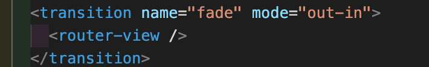

然后只要加上相应的 CSS 就可以了，通过向四个 class 添加 CSS 属性即可。

- `.fade-enter-active{}` 在元素插入时即刻生效，对应进入过渡的结束状态，炳辉在过渡过程结束后移除。
- `.fade-enter{}` 也是在元素插入时即刻生效，对应于元素进入过渡时的状态，应用一帧后便会被移除。
- `.fade-leave{}` 为元素被删除时的动作，用于离开过渡的开始时，应用一帧后删除。
- `.fade-leave-active{}` 也是元素移除时的操作，在结束离开时作用，并在完成离开后移除。

    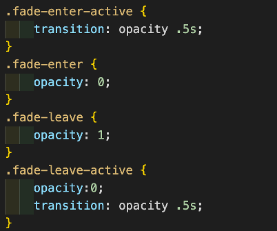

上面例子中我们采用了 `mode=”out-in”`，也可以反过来，即 `mode=”in-out”`。前者指的是当前元素先过渡离开，新的元素再过渡进来；后者是默认模式，也就是新元素过渡进入后当前元素再过渡离开。

### 路由钩子

在 Vue 中有生命周期的概念，Vue Router 有路由拦截器——路由钩子，包括全局钩子、路由单独钩子和组件内钩子。每个钩子都分别接受三个参数，代表路由的不同状态：`to`, `from`, `next`。`to` 指的是即将进入的路由对象，`from` 指的是当前导航正要离开的路由，`next` 则是继续执行函数，`next` 通过接收不同的参数，做出不同动作，包括继续执行、终断当前导航和跳转新页面。

#### 全局钩子

全局钩子在 `src/router/index.js` 中使用，其中 `beforeEach()` 用于进入页面之前，在其中可以加入是否登录判断，`afterEach()` 用于结束动画，它不能够接受 `next` 参数，因为是全局后置钩子没有 `next`。

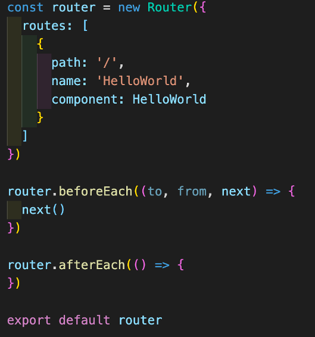

#### 路由单独钩子

同样的路由单独钩子也是在 `src/router/index.js` 中使用，函数 `beforeEnter()` 同样接收 `to`, `from`, `next` 三个参数。

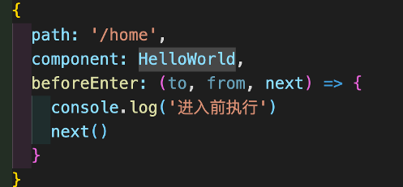

#### 组件内钩子

最后是组件内钩子，它相对于以上的两种类型钩子较为复杂，涉及三个钩子函数，并在组件内定义。`beforeRouteEnter()` 在进入页面前调用，`beforeRouteUpdate()` 在路由改变时用，`beforeRouteLeave()` 离开时使用，三个函数都可接收 `to`, `from`, `next` 三个参数。

## 数据传输

Vue 项目的前后端联调方案采取的往往是基于 Promise 的 HTTP 库 axios。

### 安装 axios

安装极为方便：通过 npm 或浏览器进行安装 `npm install axios –save` 即可，或通过 `script` 标签引入。使用时通过 `import axios from ‘axios’` 来引入，并通过 `Vue.prototype.$axios=axios` 将 axios 赋给 Vue 原型，即可在项目中通过 `this.$axios` 来使用 axios 了。axios 能够兼容于所有主流浏览器，如 Chrome、Firefox、Safari、Opera、IE 等。

### axios 功能

- 支持从浏览器创建 `XMLHttpRequest` 请求
- 支持从 Node.js 创建 HTTP 请求
- 支持 Promise API
- 拦截请求和响应
- 转换请求及响应
- 取消请求
- 自动转换 JSON
- 客户端支持 XSRF 保护

### axios 用法

axios 采取链式编程，通过 `then` 来控制执行顺序。

Get 方法：

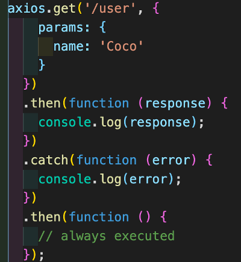

Post 方法：

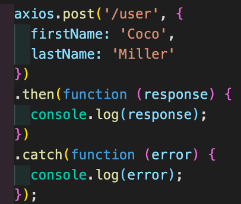

## UI 组件库

最后要简要介绍一下 Vue 的 UI 组件库，一个好的 UI 组件库能够为前端开发者省去很多开发时间并且兼容性较强。基于 Vue 最常用的 UI 组件库有 ElementUI、Bootstrap Vue 等。它们的使用也比较简单，比如 ElementUI，直接通过 `npm I element-ui -S` 即可完成安装，并在 `main.js` 通过 `import ElementUI from 'element-ui'` 引入，`Vue.use(ElementUI)` 使用 ElementUI，如果嫌弃全局引用过于臃肿也可以单独引入部分插件。ElementUI 具有 [详细的文档与使用 demo](https://element.eleme.cn/#/zh-CN)，包含大量已封装好的组件能够简单上手使用。

## 结束语

综上，就是 Vue 的全家桶的介绍，通过本文希望您能够了解 Vue 的核心知识与特点，并了解如何快速基于脚手架搭建一个 Vue 的工程，以及如何集中管理状态与数据传输等知识，对 Vue 有进一步的认识。