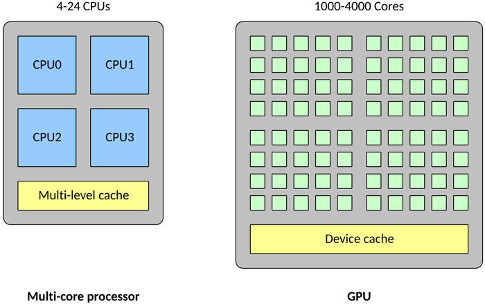
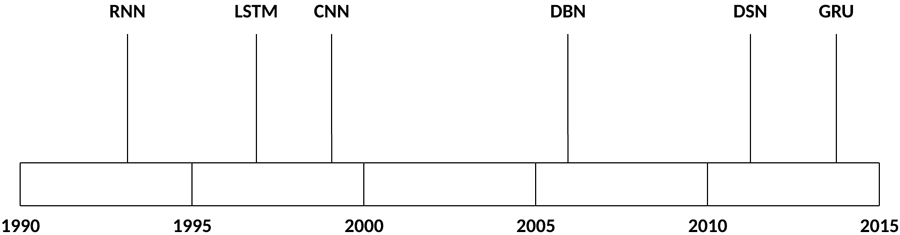
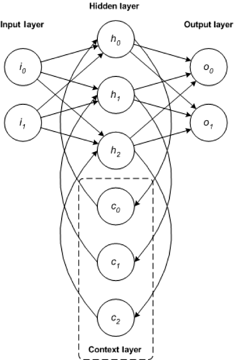
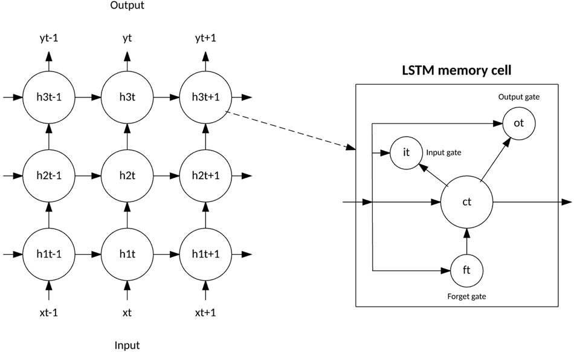
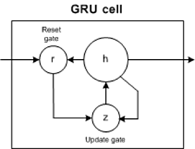
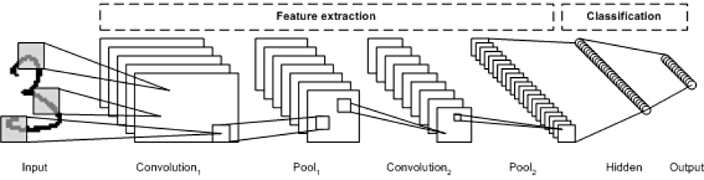
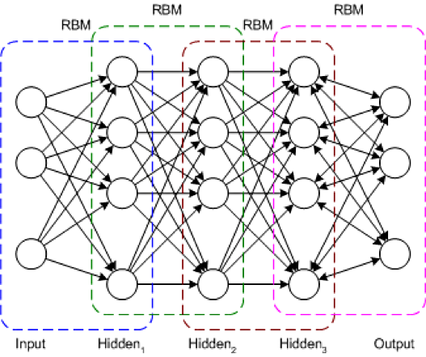
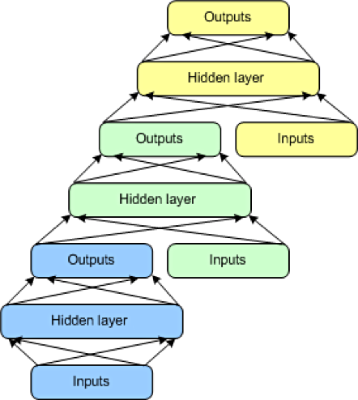

# 深度学习架构
人工智能的兴起

**标签:** 人工智能,金融

[原文链接](https://developer.ibm.com/zh/articles/cc-machine-learning-deep-learning-architectures/)

M. Tim Jones

发布: 2017-11-20

* * *

连接主义体系结构已存在 70 多年，但新的架构和图形处理单元 (GPU) 将它们推到了人工智能的前沿。深度学习架构是最近 20 年内诞生的，它显著增加了神经网络可以解决的问题的数量和类型。本文将介绍 5 种最流行的深度学习架构：递归神经网络 (RNN)、长短期记忆 (LSTM)/门控递归单元 (GRU)、卷积神经网络 (CNN)、深度信念网络 (DBN) 和深度叠加网络 (DSN)，然后探讨用于深度学习的开源软件选项。

深度学习不是单个方法，而是一类可用来解决广泛问题的算法和拓扑结构。深度学习显然已不是新概念，但深度分层神经网络和 GPU 的结合使用加速了它们的执行，深度学习正在突飞猛进地发展。大数据也助推了这一发展势头。因为深度学习依赖于监督学习算法（这些算法使用示例数据训练神经网络并根据成功水平给予奖惩），所以数据越多，构建这些深度学习结构的效果就越好。

## 深度学习与 GPU 的兴起

深度学习由不同拓扑结构的深度网络组成。神经网络已存在很长一段时间，但多层网络（每个层提供一定的功能，比如特征提取）的开发让它们变得更加实用。增加层数意味着各层之间和层内有更多相互联系和更多权值。在这里，GPU 可为深度学习带来助益，使训练和执行这些深度网络成为可能（原始处理器在这方面的效率不够高）。

GPU 在一些关键方面与传统多核处理器不同。首先，一个传统处理器可能包含 4 – 24 个通用 CPU，但一个 GPU 可能包含 1,000 – 4,000 个专用数据处理核心。

与传统 CPU 相比，高密度的核心使得 GPU 变得高度并行化（也就是说，它可以一次执行许多次计算）。这使得 GPU 成为大型神经网络的理想选择，在这些神经网络中，可以一次计算许多个神经元（传统 CPU 可以并行处理的数量要少得多）。GPU 还擅长浮点矢量运算，因为神经元能执行的运算不止是矢量乘法和加法。所有这些特征使得 GPU 上的神经网络达到所谓的 _高度并行_（也就是完美并行，几乎不需要花精力来并行化任务）。

## 深度学习架构

深度学习中使用的架构和算法数量丰富多样。本节将探讨过去 20 年来存在的深度学习架构中的 5 种。显然，LSTM 和 CNN 是此列表中最古老的两种方法，但也是各种应用中使用最多的两种方法。

这些架构被应用于广泛的场景中，但下表仅列出了它们的一些典型应用。

架构应用RNN语音识别、手稿识别LSTM/GRU 网络自然语言文本压缩、手稿识别、语音识别、手势识别、图像说明CNN图像识别、视频分析、自然语言处理DBN图像识别、信息检索、自然语言理解、故障预测DSN信息检索、持续语音识别

现在，让我们了解一下这些架构和用于训练它们的方法。

### 递归神经网络

RNN 是一种基础网络架构，其他一些深度学习架构是基于它来构建的。典型多层网络与递归网络之间的主要差别是，递归网络没有完整的前馈连接，它可能拥有反馈到前几层（或同一层）的连接。这种反馈使 RNN 能保留对过去的输入的记忆并按时间为问题建模。

RNN 包含丰富的架构（接下来我们将分析一种名为 LSTM 的流行拓扑结构）。关键区别在于网络中的反馈，这可以在隐藏层、输出层或二者的某种组合中体现出来。

RNN 可以按时间展开并通过标准反向传播进行训练，或者使用一种沿时间反向传播 (BPTT) 的反向传播变形来训练。

### LSTM/GRU 网络

LSTM 是 Hochreiter 和 Schimdhuber 于 1997 年共同创建的，最近几年，作为一种用于各种用途的 RNN 架构，LSTM 变得越来越受欢迎。您可以在每天使用的产品（比如智能手机）中发现 LSTM。IBM 在 IBM Watson® 中应用了 LSTM，在对话语音识别上取得了里程碑式的成就。

LSTM 脱离了基于典型神经元的神经网络架构，引入了记忆细胞的概念。记忆细胞可以作为输入值的函数，短时间或长时间地保留自身的运算值，这使得该细胞能记住重要的信息，而不只是它最后计算的值。

LSTM 记忆细胞包含 3 个控制信息如何流进或流出细胞的门。输入门控制新信息何时能流入记忆中。遗忘门控制何时遗忘一段现有信息，使细胞能记忆新数据。最后，输出门控制细胞中包含的信息何时用在来自该细胞的输出中。记忆细胞还包含控制每个门的权值。训练算法（通常为 BPTT）基于得到的网络输出错误来优化这些权值。

2014 年，推出了 LSTM 的一个简化版本，叫做门控递归单元。此模型有两个门，抛弃了 LSTM 模型中存在的输出门。对于许多应用，GRU 拥有类似于 LSTM 的性能，但更简单意味着更少的权值和更快的执行速度。

GRU 包含两个门：更新门和重置门。更新门指示保留多少以前细胞的内容。重置门定义如何将新输入与以前的细胞内容合并。GRU 可以通过将重置门设置为 1 并将更新门设置为 0 来模拟标准 RNN。

GRU 比 LSTM 更简单，能更快地训练，而且执行效率更高。但是，LSTM 更富于表达，有更多的数据，能带来更好的结果。

### 卷积神经网络

CNN 是一种多层神经网络，该网络的创作灵感来自动物的视觉皮质。该架构在图像处理应用中特别有用。第一个 CNN 是由 Yann LeCun 创建的，当时，该架构专注于手稿字符识别，比如邮政编码解释。作为一种深度网络，早期的层主要识别各种特征（比如边缘），后来的层将这些特征重新组合到输入的更高级属性中。

LeNet CNN 架构包含多个层，这些层实现了特征提取，然后实现了分类（参见下图）。图像被分成多个接受区，其中注入了随后可从输入图像中提取特征的卷积层。下一步是池化，它可以（通过降采样）降低提取的特征的维度，同时保留最重要的信息（通常通过最大池化）。然后执行另一个卷积和池化步骤，将结果注入一个完全连接的多层感知器中。此网络的最终输出层是一组节点，这些节点标识了图像的特征（在本例中，每个节点对应一个识别出的数字）。您可以使用反向传播训练该网络。

深层处理、卷积、池化和完全连接的分类层的使用，为深度学习神经网络的各种新应用开启了一扇门。除了图像处理之外，CNN 还成功应用到了视频识别和各种自然语言处理任务中。

人们最近应用 CNN 和 LSTM 来生成图像和视频说明系统，使用自然语言总结图像或视频内容。CNN 实现了图像或视频处理，LSTM 经过训练可以将 CNN 输出转换为自然语言。

### 深度信念网络

DBN 是一种典型的网络架构，但它包含一种新颖的训练算法。DBN 是一种多层网络（通常是深度网络，包含许多隐藏层），其中的每对连接的层都是一个受限玻尔兹曼机 (RBM)。通过这种方式，将 DBN 表示为一些叠加的 RBM。

在 DBN 中，输入层表示原始感知输入，每个隐藏层都学习此输入的抽象表示。输出层的处理方式与其他层稍有不同，它实现了网络分类。训练分两步进行：无监督预训练和监督调优。

在无监督预训练过程中，会训练每个 RBM 来重构它的输入（例如，第一个 RBM 将输入层重构到第一个隐藏层）。用类似方式训练下一个 RBM，但将第一个隐藏层视为输入（或可视）层，通过使用第一个隐藏层的输出作为输入来训练 RBM。此过程一直持续到完成每一层的预训练。完成预训练后，开始进行调优。在此阶段，可对输出节点使用标签来提供它们的含义（它们在网络的上下文中表示的含义）。然后使用梯度下降学习或反向传播来应用整个网络训练，从而完成训练过程。

### 深度叠加网络

最后要介绍的一种架构是 DSN，也称为深凸网络。DSN 不同于传统的深度学习框架，因为尽管它包含一个深度网络，但它实际上是各个网络的深度集合，每个网络都有自己的隐藏层。此架构是对一个深度学习问题的一种回应：训练的复杂性。深度学习架构中的每一层的训练复杂性都呈指数级增长，所以 DSN 未将训练视为单一问题，而将它视为单独训练问题的集合。

DSN 包含一组模块，每个模块都是 DSN 的整体分层结构中的一个子网。在此架构的一个实例中，为 DSN 创建了 3 个模块。每个模块都包含一个输入层、一个隐藏层和一个输出层。模块彼此堆叠，一个模块的输入包含前一层的输出和原始输入矢量。这种分层使整个网络能学习比单个模块更复杂的分类。

DSN 允许隔离训练各个模块，这使得它们能并行训练，因而具有很高的效率。监督训练实现为每个模块上的反向传播，而不是在整个网络上的反向传播。对于许多问题，DSN 表现得都比典型 DBN 更好，这使它们成为了一种流行且高效的网络架构。

## 开源框架

这些深度学习架构肯定是可以实现的，但从头开始可能很耗时，而且也需要时间来优化它们并让它们变得成熟。幸运的是，可以利用一些开源框架来更轻松地实现和部署深度学习算法。这些框架支持 Python、C/C++ 和 Java® 等语言。让我们看看 3 种最流行的框架和它们的优缺点。

### Caffe

Caffe 是最流行的深度学习框架之一。Caffe 最初是在一篇博士论文中发布的，但现在已依据 Berkeley Software Distribution 许可进行发布。Caffe 支持许多深度学习架构，包括 CNN 和 LSTM，但它明显不支持 RBM 或 DBM（不过即将发布的 Caffe2 将会支持它们）。

图像分类和其他视觉应用中已采用 Caffe，而且 Caffe 支持通过 NVIDIA CUDA Deep Neural Network 库实现基于 GPU 的加速。Caffe 支持采用开放多处理 (Open Multi-Processing, OpenMP) 在一个系统集群上并行执行深度学习算法。为了保证性能，Caffe 和 Caffe2 是用 C++ 编写的，它们还为深度学习的训练和执行提供了 Python 和 MATLAB 接口。

### Deeplearning4j

Deeplearning4j 是一种流行的深度学习框架，它专注于 Java 技术，但包含适用于其他语言的应用编程接口，比如 Scala、Python 和 Clojure。该框架依据 Apache 许可而发布，支持 RBM、DBN、CNN 和 RNN。Deeplearning4j 还包含兼容 Apache Hadoop 和 Spark（大数据处理框架）的分布式并行版本。

人们已应用 Deeplearning4j 来解决众多问题，包括金融领域中的欺诈检测、推荐系统、图像识别或网络安全（网络入侵检测）。该框架集成了 CUDA 来实现 GPU 优化，而且可通过 OpenMP 或 Hadoop 进行分发。

### TensorFlow

TensorFlow 是 Google 开发的一个开源库，是从闭源 DistBelief 衍生而来。可以使用 TensorFlow 训练和部署各种神经网络（CNN、RBM、DBN 和 RNN），TensorFlow 是依据 Apache 2.0 许可而发布的。人们已应用 TensorFlow 来解决众多问题，比如图像说明、恶意软件检测、语音识别和信息检索。最近发布了一个专注于 Android 的堆栈，名为 TensorFlow Lite。

可以在 Python、C++、Java 语言、Rust 或 Go（但 Python 最稳定）中使用 TensorFlow 开发应用程序，并通过 Hadoop 分散执行它们。除了专业的硬件接口之外，TensorFlow 还支持 CUDA。

### Distributed Deep Learning

IBM Distributed Deep Learning (DDL) 被称为“深度学习的喷气式引擎”，这个库链接到了 Caffe 和 TensorFlow 等领先框架中。可在服务器集群和数百个 GPU 上使用 DDL 来加速深度学习算法。DDL 通过定义最终路径来优化神经元计算的通信，最终的数据必须在 GPU 之间进行。通过轻松完成 Microsoft 最近设置的一个图像识别任务，证明深度学习集群的瓶颈能够得以解决。

## 结束语

深度学习是通过一系列架构来表示的，这些架构可为各种各样的问题领域构建解决方案。这些解决方案可以专注于前馈的网络，或者是允许考虑以前的输入的递归网络。尽管构建这些类型的深度架构可能很复杂，但可以使用各种开源解决方案（如 Caffe，Deeplearning4j，TensorFlow 和 DDL）来快速启动和运行。

本文翻译自： [Deep learning architectures](https://developer.ibm.com/articles/cc-machine-learning-deep-learning-architectures/)（2017-09-08）