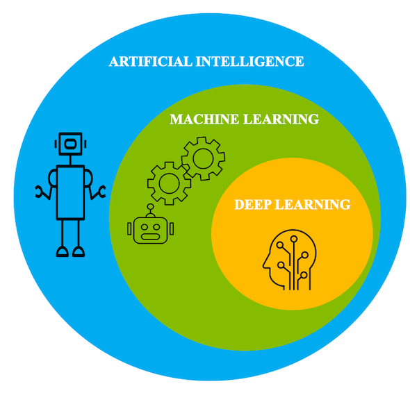
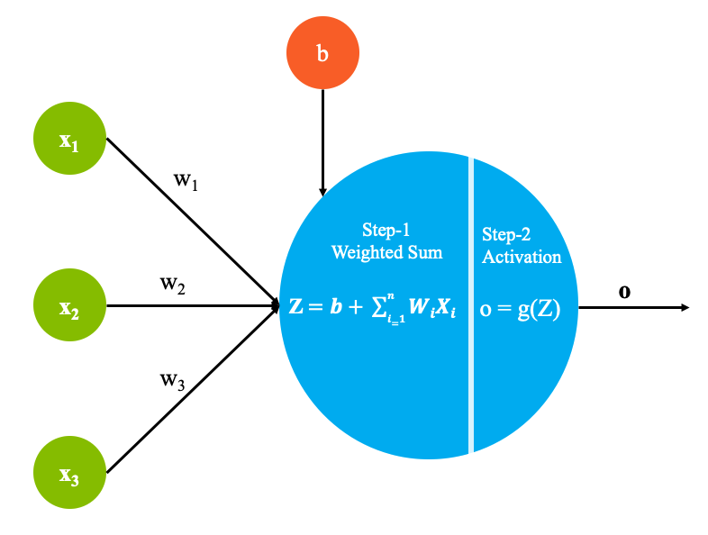
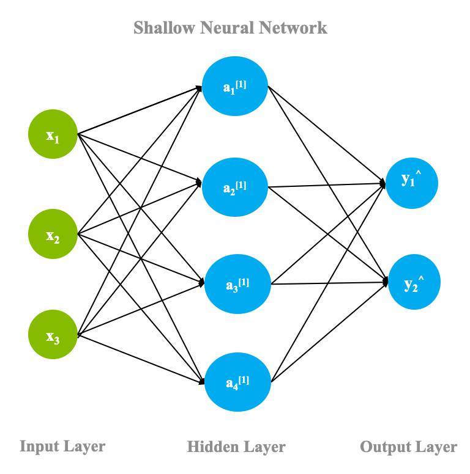

# 深度学习简介
探索机器学习中的一个分支，该分支基于大量的数据进行了训练，并且协同处理计算单元，从而执行预测

**标签:** Watson Machine Learning Accelerator,人工智能,机器学习,深度学习

[原文链接](https://developer.ibm.com/zh/articles/an-introduction-to-deep-learning/)

Piyush Madan, [Samaya Madhavan](https://developer.ibm.com/zh/profiles/smadhava)

发布: 2020-12-10

* * *

人工智能 (AI) 在初期曾经极度专注于基于规则的系统，这种系统必须使用由主题专家提供的预定义规则集进行预测。但是，这些系统很脆弱，并且依赖于这些“专家意见”，最终导致它们被淘汰。随着数据规模和数据量的增加，更具数据驱动性的方法 _机器学习_ 取代了上述方法。

## 机器学习与深度学习

机器学习是算法和工具的集合，可帮助机器理解数据中的模式并使用此底层结构来执行有关给定任务的推理。机器有多种方式来理解这些底层模式。但是机器学习与深度学习之间有什么关系？在本文中，我们概述了深度学习如何适应该领域，并讨论了它的一些应用和挑战。

越来越多的误解是，深度学习是机器学习领域的一项竞争技术。在本文中，我们讨论了其中的一些谬误，并解释了深度学习与机器学习之间的关系，以及在某些应用中使用深度学习算法所带来的优势。

客观来说，深度学习是机器学习的一个子领域。借助加速的计算能力和大型数据集，深度学习算法能够自学习数据中的隐藏模式以进行预测。

从本质上讲，您可以将深度学习视为机器学习的一个分支，深度学习是依靠大量数据来进行训练的，并且使用很多协同工作的计算单元来执行预测。

## 深度学习和人脑

为了创建以类似于人类学习的方式进行学习的系统，深度学习的底层架构受到了人脑结构的启发。因此，可以将深度学习中的相当一部分基本术语映射回神经学科。与神经元形成大脑的基本组成部分类似，深度学习架构也包含一个计算单元，用于支持对称为 _感知器_ 的非线性函数进行建模。

深度学习的魔力始于不起眼的感知器。与人脑中的“神经元”在整个神经系统中传输电脉冲的方式类似，感知器可以接收一系列输入信号并将其转换为输出信号。

感知器旨在通过将多层堆叠在一起来理解数据表示，其中每一层负责理解输入的某个部分。可以将一层视为计算单元的集合，它们学习检测值的重复出现。

感知器的每一层负责解释数据中的特定模式。这些感知器的网络模仿大脑中神经元形成网络的方式，因此这种架构被称为神经网络（或人工神经网络）。

## 人工神经网络

本节概述了深度学习、人工神经网络 (ANN) 背后的架构，并讨论了一些关键术语。

如下图所示，每个感知器均由以下部分组成：

### 第 1 步 – 计算加权和

- 输入 x1 到 xn，这也可用矢量 X 来表示。Xi 表示数据集中的第 i 个条目。数据集中的每个条目都包含 _n_ 个因变量。
- 权重 w1 到 wn，这可以用矩阵 W 来表示。
- 偏置项 b，这是一个常数。

### 第 2 步 – 激活函数

现在，第 1 步的输出通过 _激活函数_ 来传递。激活函数 _g_ 是一种数学函数，可在将输出发送到下一层之前将输出转换为所需的非线性格式。激活函数可将求和结果映射到所需范围。这有助于确定是否需要触发神经元。

例如，sigmoid 函数将值映射到 [0,1] 范围，在您希望系统预测概率时，这非常有用。通过此操作，您可以对复杂的非线性决策边界建模。

### 浅层神经网络

在上一节中，您了解了在每个感知器中进行的计算。现在，您将看到这些感知器在网络内部如何适应以及如何完成流程。

神经网络最基本的形式包含三层： _输入层_、 _隐藏层_ 和 _输出层_。如下图所示，只有一个隐藏层的网络称为 _浅层神经网络_。

前面几节中讨论的计算适用于包括输出层在内的神经网络中的所有神经元，这样一个传递称为 _正向传播_。一个正向传递完成后，输出层必须将其结果与实际的参考标准标签进行比较，并根据参考标准与预测值之差来调整权重。这个过程是通过神经网络的反向传递，称为 _反向传播_。尽管反向传播背后的数学原理不在本文讨论范围之内，但可以概述该过程的基本情况，如下所示：

- 网络致力于使目标函数最小化，例如，数据样本中所有数据点产生的误差。

- 在输出层，网络必须计算所有数据点的总误差（实际值与预测值之差），并取其相对于该层权重的导数。误差函数相对于权重的导数称为该层的 _梯度_。

- 然后根据梯度来更新该层的权重。这一更新可以是梯度本身，也可以是梯度的一个因数。这个因数被称为 _学习率_，它用于控制您要改变权重而需要完成的步骤数。

- 然后对该层之前的一层重复此过程，直至到达第一层为止。

- 在此过程中，可以复用前面几层中的梯度值，从而提高梯度计算的效率。

一次正向传播和反向传播的结果是改变了网络层的权重，让系统朝着为提供的数据集进行建模的方向更进一步。因为此过程使用梯度来最小化总误差，所以将神经网络参数收敛到最佳值的过程称为 _梯度下降_。

### 深度神经网络

深度神经网络就是一个浅层神经网络加上多个隐藏层。隐藏层中的每个神经元都与许多其他神经元相连。每个箭头都附加了权重属性，该属性控制神经元的激活在多大程度上影响与其连接的其他神经元。

深度学习中的“深度”一词归结于这些深层的隐藏层，并从中获得效果。选择隐藏层的数量取决于问题的性质和数据集的大小。下图显示了具有两个隐藏层的深度神经网络。

在本节中，我们涵盖了人工神经网络工作原理的高级别概述。要了解更多信息，请参阅有关 [从零开始神经网络](https://developer.ibm.com/articles/neural-networks-from-scratch/) 的文章。您还可以在 [神经网络深入剖析](https://developer.ibm.com/zh/articles/cc-cognitive-neural-networks-deep-dive/) 中更深入地研究神经网络。

## 应用

深度学习在医疗、金融和图像识别等几乎所有领域都有大量应用。在本节中，我们来看几种应用。

- 医疗：由于能够更轻松地访问加速 GPU 并且有大量数据可用，医疗用例已成为应用深度学习的理想之选。利用图像识别，通过 MRI 成像和 X 射线检测癌症的准确性已经超过了人类水平的准确性。其他一些基于医疗的流行应用包括药物发现、临床试验匹配和基因组学。

- 自动驾驶汽车：虽然自动驾驶汽车是充满风险的自动化领域，但最近已经开始朝着成为现实的方向发展。从识别停车标志到看见路上的行人，基于深度学习的模型都在模拟环境下进行了训练和尝试，以监控进度。

- 电子商务：一直以来，产品推荐都是深度学习中最流行、最赚钱的应用之一。有了更加个性化和准确的推荐，客户就可以轻松地购买所需的商品，并可以查看他们可以选择的所有选项。这也加速了销售，因此对卖方有益。

- 私人助手：由于深度学习领域的进步，人们可以轻松拥有一个私人助手，只需购买 Alexa 或 Google Assistant 这样的设备就行。这些智能助手在各个方面使用深度学习，例如个性化语音和口音识别、个性化推荐和文本生成。

显然，这些只是可以应用深度学习的海量应用的一小部分。股市预测和天气预报也是同等流行的领域，在其中深度学习可以发挥很大作用。

## 深度学习中的挑战

尽管深度学习方法在过去 10 年左右获得了极大的普及，但实际上自 20 世纪 50 年代中期 Frank Rosenblatt 在 IBM® 704 机器上发明感知器以来，这个想法就一直存在。这是一个基于两层的电子设备，能够检测形状并进行推理。近年来，这一领域的进步主要是由于计算能力和高性能图形处理单元 (GPU) 的增加，再加上这些模型可用来学习的各类数据的大幅增加，还有整个社会对继续研究投入兴趣和资金。尽管深度学习在最近几年突飞猛进，但它确实也遇到了一系列挑战，整个社会也在努力解决这些挑战。

### 对数据的需求

当今流行的深度学习方法迫切需要数据，并且许多复杂的问题（例如语言翻译）没有复杂的数据集可用。用于与低资源语言之间执行双向神经机器翻译的深度学习方法通常表现较差，而 [域适应](https://arxiv.org/abs/1806.00258)（将开发高资源系统时获得的知识应用到低资源方案）等技术在近年来表现出良好的前景。对于诸如姿势估计之类的问题，生成如此大量的数据可能很困难。实际上，对模型进行训练的人工合成数据与模型最终需要在其中执行的“野外”设置有很大不同。

### 可解释性和公平性

虽然深度学习算法已被证明可以击败人类水平的准确性，但仍没有明确的方法来回溯并提供做出的每个预测背后的理由。这就导致很难在金融等应用中运用，因为这些应用要求提供批准或拒绝每笔贷款背后的理由。

另一个容易出现问题的维度是数据本身的底层偏差，这可能导致模型在数据的关键子集上表现不佳。使用基于奖励的机制的学习代理有时会在行为上不考虑道德因素，因为为了最小化系统误差，它们唯一需要做的就是最大化它们积累的奖励。 [此示例](https://openai.com/blog/faulty-reward-functions/) 显示了代理如何直接停止玩游戏并最终陷入收集奖励积分的无限循环中。尽管这在游戏场景中是可以接受的，但错误或不道德的决定可能会对现实世界产生深远的负面影响。现在迫切需要让模型以平衡的方式学习。

IBM 有一个开源工具包 [AI360](https://aif360.mybluemix.net/)，可检测、调查和减轻深度学习算法中的偏差。作为深度学习研究人员，我们必须在设计和开展这些实验时牢记这些挑战。

## 展望未来

理解了本文中的所有信息，您现在就可以开始更深入的深度学习之旅了。人工神经网络有多种变体和附加功能，有助于针对不同应用实现前所未有的准确程度。继续关注本系列的更多文章。

本文翻译自： [An introduction to deep learning](https://developer.ibm.com/articles/an-introduction-to-deep-learning/)（2020-11-09）